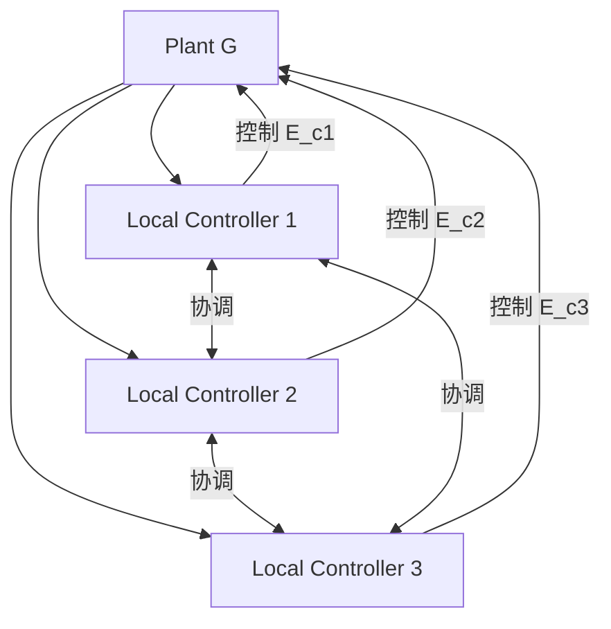

# 03.3 离散事件系统

---

📌 **内容摘要**

本文档深入探讨离散事件系统的核心原理和关键方法。内容涵盖控制论领域的主要知识点，包括调度, 资源分配, 并发, 位置等关键主题。适合具备相关基础的学习者进行深入研究。

**关键词**: 调度, 资源分配, 并发, 位置, 控制论, Petri网, 任务调度

📚 **学习目标**
- 深入理解离散事件系统的理论体系和形式化方法
- 能够进行相关定理的形式化证明
- 建立该领域的系统性知识框架

🎯 **难度级别**: 高级

⏱️ **预计阅读时间**: 15分钟

**前置知识**: 该领域的中级知识, 形式化方法基础

---


## 1. 引言

### 1.1 离散事件系统概述

离散事件系统 (Discrete Event Systems, DES) 是状态演变由异步离散事件触发的动态系统，与连续时间系统形成对比。

**典型应用**：

- 制造系统与调度
- 通信协议
- 交通控制系统
- 计算机操作系统

### 1.2 与连续系统的对比

| 特征 | 连续系统 | 离散事件系统 |
|-----|---------|------------|
| 状态空间 | 通常是连续的 $\mathbb{R}^n$ | 离散 (可数或有限) |
| 动态演变 | 微分方程驱动 | 事件触发 |
| 时间模型 | 连续或离散 | 异步事件序列 |
| 分析工具 | 微分方程、传递函数 | 自动机、Petri 网、形式语言 |

> **交叉引用**：Petri 网建模参见 [02.1_Petri网基础.md](../02_Petri网理论/02.1_Petri网基础.md)。

---

## 2. 形式化模型

### 2.1 自动机模型

**定义 2.1** (确定性自动机)。DES 可用确定性有限自动机 (DFA) 建模：

$$G = (X, E, f, x_0, X_m)$$

- $X$: 状态集合
- $E$: 事件集合
- $f: X \times E \to X$: 部分转移函数
- $x_0$: 初始状态
- $X_m$: 标记状态集合（表示任务完成）

### 2.2 生成语言

**定义 2.2** (生成语言)。自动机 $G$ 的**生成语言**：

$$\mathcal{L}(G) = \{s \in E^* \mid f(x_0, s) \text{ 有定义}\}$$

**定义 2.3** (标记语言)。

$$\mathcal{L}_m(G) = \{s \in \mathcal{L}(G) \mid f(x_0, s) \in X_m\}$$

### 2.3 非确定性自动机

**定义 2.4** (非确定性自动机)。转移函数扩展为 $f: X \times E \to 2^X$。

**定义 2.5** (并行组合)。两个自动机 $G_1, G_2$ 的并行组合：

$$G_1 \parallel G_2 = (X_1 \times X_2, E_1 \cup E_2, f_{\parallel}, (x_{01}, x_{02}), X_{m1} \times X_{m2})$$

其中 $f_{\parallel}$ 处理共享事件的同步和非共享事件的交错。

---

## 3. 监控理论 (Supervisory Control Theory)

### 3.1 可控性与可观性

**定义 3.1** (可控性)。事件集划分为：

- $E_c$: 可控事件（可被禁止）
- $E_{uc}$: 不可控事件（不可被禁止）

**定义 3.2** (可观性)。事件集划分为：

- $E_o$: 可观事件（可被观测）
- $E_{uo}$: 不可观事件（不可被观测）

**定义 3.3** (控制模式)。控制模式 $\gamma \in \Gamma = \{\gamma \subseteq E \mid E_{uc} \subseteq \gamma\}$

即：控制模式必须包含所有不可控事件。

### 3.2 监控器设计

**定义 3.4** (监控器)。监控器是一个函数 $S: \mathcal{L}(G) \to \Gamma$，将已发生事件序列映射到控制模式。

**定义 3.5** (闭环系统)。受控系统 $S/G$ 的行为：

$$\mathcal{L}(S/G) = \{s = e_1 e_2 \ldots e_k \in \mathcal{L}(G) \mid \forall i: e_i \in S(e_1 \ldots e_{i-1})\}$$

### 3.3 形式化控制问题

**问题 3.1** (基本控制问题)。给定未受控 DES $G$ 和规范语言 $K \subseteq \mathcal{L}(G)$，设计监控器 $S$ 使得：

$$\mathcal{L}(S/G) = \bar{K} \cap \mathcal{L}(G)$$

**定理 3.1** (可控性条件)。存在监控器 $S$ 使得 $\mathcal{L}(S/G) = \bar{K}$ 当且仅当 $K$ 是**可控的**：

$$\bar{K} E_{uc} \cap \mathcal{L}(G) \subseteq \bar{K}$$

即：在 $K$ 的闭包后接任何不可控事件，若仍在 $\mathcal{L}(G)$ 中，则也必须在 $\bar{K}$ 中。

### 3.4 可控性判定算法

**算法 3.1** (测试可控性)。

```python
def is_controllable(K, L, E_uc):
    """
    判定语言 K 是否相对于 L 可控
    K, L: 有限自动机接受的语言
    E_uc: 不可控事件集合
    """
    # 构造 K 的闭包自动机
    K_closure = construct_closure_automaton(K)

    # 测试条件: K̄ E_uc ∩ L ⊆ K̄
    for s in K_closure.accepted_strings():
        for e in E_uc:
            if K_closure.transitions(s, e) is None:
                # 检查 s·e 是否在 L 中
                if L.accepts(s + e):
                    # 如果 s·e ∈ L 但 s·e ∉ K̄, 则不可控
                    if not K_closure.accepts(s + e):
                        return False, f"冲突: 字符串 {s}, 事件 {e}"

    return True, "可控"

def compute_controllable_sublanguage(K, L, E_uc):
    """
    计算最大可控子语言
    使用不动点迭代
    """
    K_current = K

    while True:
        # 找出违反可控性的字符串
        violations = set()
        for s in K_current.prefixes():
            for e in E_uc:
                if s + e in L and s + e not in K_current:
                    violations.add(s)

        if not violations:
            break

        # 移除导致违规的前缀
        K_current = K_current.remove_prefixes(violations)

    return K_current
```

---

## 4. 可观性与观测器

### 4.1 可观性定义

**定义 4.1** (P-可观测性)。语言 $K$ 是 P-可观测的，若：

$$\forall s, s' \in \bar{K}, \forall e \in E_c:$$
$$P(s) = P(s') \text{ 且 } se \in \mathcal{L}(G) \text{ 且 } se \in \bar{K} \text{ 且 } s'e \in \mathcal{L}(G) \Rightarrow s'e \in \bar{K}$$

解释：观测等价的状态必须允许相同的可控事件。

**定理 4.1** (观测器存在条件)。存在基于观测器的监控器当且仅当 $K$ 既是可控的又是 P-可观测的。

### 4.2 观测器构造

**算法 4.1** (观测器自动机)。

```python
def construct_observer(G, E_o, Euo):
    """
    构造自然投影 P: E* → E_o* 的观测器自动机
    状态是 G 中状态的子集（不确定性集合）
    """
    # 初始状态: 从 x0 通过不可观事件可达的状态
    initial_estimate = unobservable_reach(G, {G.x0}, Euo)

    observer_states = [initial_estimate]
    observer_transitions = {}
    unexplored = [initial_estimate]

    while unexplored:
        current = unexplored.pop()

        for e in E_o:  # 仅考虑可观事件
            next_estimate = set()
            for x in current:
                if G.has_transition(x, e):
                    x_prime = G.transition(x, e)
                    # 添加后通过不可观事件可达的所有状态
                    next_estimate |= unobservable_reach(G, {x_prime}, Euo)

            if next_estimate:
                observer_transitions[(frozenset(current), e)] = frozenset(next_estimate)
                if frozenset(next_estimate) not in observer_states:
                    observer_states.append(frozenset(next_estimate))
                    unexplored.append(next_estimate)

    return ObserverAutomaton(observer_states, observer_transitions, initial_estimate)

def unobservable_reach(G, states, Euo):
    """通过不可观事件可达的状态闭包"""
    reach = set(states)
    changed = True
    while changed:
        changed = False
        for x in list(reach):
            for e in Euo:
                if G.has_transition(x, e):
                    x_prime = G.transition(x, e)
                    if x_prime not in reach:
                        reach.add(x_prime)
                        changed = True
    return reach
```

---

## 5. 分布式监控

### 5.1 分布式体系结构



### 5.2 共同可控性与去中心化

**定义 5.1** (共同可控性)。$K$ 是共同可控的，若：

$$\bar{K} E_{uc} \cap \mathcal{L}(G) \subseteq \bar{K}$$

其中 $E_{uc} = \bigcap_i E_{uc,i}$ 是所有局部控制器的不可控事件交集。

**定理 5.1** (去中心化条件)。若 $K$ 是共同可控的且满足**共同可观性**条件，则存在去中心化监控器组使得闭环行为等于 $K$。

---

## 6. Lean 形式化

### 6.1 自动机定义

```lean4
import Mathlib

-- 有限自动机
structure DFA (State Event : Type) [Fintype State] [Fintype Event] where
  transition : State → Event → Option State
  initial : State
  accepting : Set State

-- 扩展转移函数
def DFA.delta_star {S E} [Fintype S] [Fintype E]
    (M : DFA S E) : S → List E → Option S
  | s, [] => some s
  | s, e::es => match M.transition s e with
      | some s' => DFA.delta_star M s' es
      | none => none

-- 接受语言
def DFA.accepts {S E} [Fintype S] [Fintype E]
    (M : DFA S E) (w : List E) : Prop :=
  match M.delta_star M.initial w with
  | some s => s ∈ M.accepting
  | none => False
```

### 6.2 可控性

```lean4
-- 事件分类
structure EventClassification (Event : Type) where
  controllable : Set Event
  observable : Set Event

-- 可控性定义
def Controllable {S E} [Fintype S] [Fintype E]
    (M : DFA S E) (K : Set (List E))
    (Ec : EventClassification E) : Prop :=
  ∀ s ∈ K.prefixes, ∀ e ∉ Ec.controllable,
  M.accepts (s ++ [e]) → (s ++ [e]) ∈ K.prefixes

-- 最大可控子语言
def SupremalControllableSublanguage {S E} [Fintype S] [Fintype E]
    (M : DFA S E) (K : Set (List E))
    (Ec : EventClassification E) : Set (List E) :=
  { w ∈ K | Controllable M K.prefixes Ec }
```

### 6.3 监控器

```lean4
-- 监控器: 将已观察字符串映射到允许的事件集合
def Supervisor {E} := List E → Set E

-- 监控器必须允许所有不可控事件
def Admissible {E} (S : Supervisor) (Ec : EventClassification E) : Prop :=
  ∀ w, Ec.controllableᶜ ⊆ S w

-- 闭环语言
def ClosedLoopLanguage {S E} [Fintype S] [Fintype E]
    (M : DFA S E) (Sup : Supervisor) : Set (List E) :=
  { w | ∀ i, (w.take (i+1)).getLast ∈ Sup (w.take i) }
```

---

## 7. 应用与工具

### 7.1 典型应用

| 领域 | 应用 | 监控目标 |
|-----|------|---------|
| 制造系统 | 生产线控制 | 防止死锁、满足交付期限 |
| 通信协议 | 协议验证 | 确保消息正确传递 |
| 智能交通 | 信号灯控制 | 优化通行、避免冲突 |
| 软件系统 | 工作流管理 | 确保业务流程正确性 |

### 7.2 分析工具

- **DESUMA**: DES 自动机分析与可视化
- **Supremica**: 监控综合工具
- **TCT**: 计算树逻辑监控器综合

---

## 参考文献

1. Ramadge, P. J., & Wonham, W. M. (1989). The Control of Discrete Event Systems. Proceedings of the IEEE.
2. Cassandras, C. G., & Lafortune, S. (2008). Introduction to Discrete Event Systems. Springer.
3. Wonham, W. M., & Cai, K. (2019). Supervisory Control of Discrete-Event Systems. Springer.
4. Lin, F., & Wonham, W. M. (1988). Decentralized Supervisory Control of Discrete-Event Systems. Information Sciences.

---

## 索引

- **DFA**: §2.1
- **P-可观测性**: §4.1
- **共同可控性**: §5.2
- **去中心化监控**: §5
- **可控性**: §3.3
- **可观性**: §4
- **监控器**: §3.2
- **离散事件系统**: §1
- **生成语言**: §2.2
- **监控理论**: §3
---

## 📋 前置知识

- [02.1 Petri 网基础](../02_Petri网理论/02.1_Petri网基础.md)

---

## 📚 延伸阅读

- [02.4 可观测性](./04_软件工程/02_微服务架构/02.4_可观测性.md)
- [03.1 工作流基础](./04_软件工程/03_工作流系统/03.1_工作流基础.md)
- [03.1 工作流形式化](./04_软件工程/03_工作流系统/03.1_工作流形式化.md)
- [02.1 Petri 网基础](../02_Petri网理论/02.1_Petri网基础.md)
- [01.2 有限自动机](./02_形式语言/01_形式语言基础/01.2_有限自动机.md)
