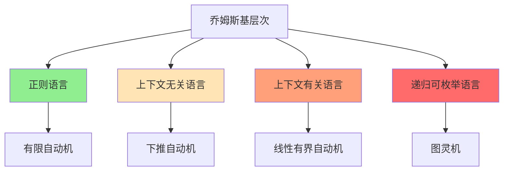
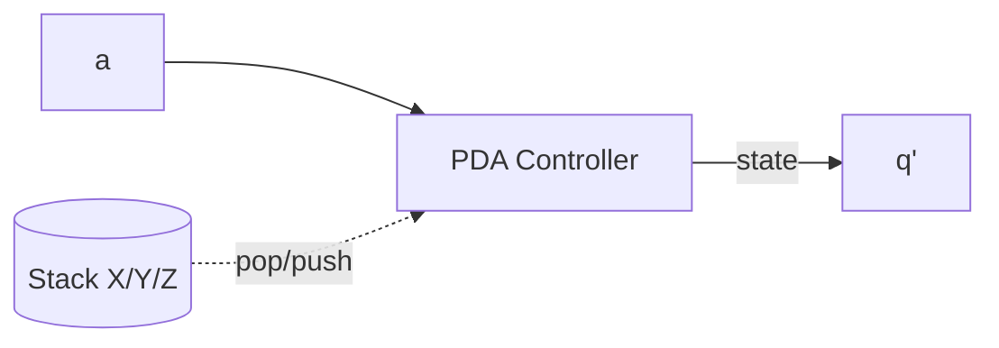

# 04.1 自动机理论

## 1. 引言

### 1.1 自动机理论概述

自动机理论是计算理论的基础分支，研究抽象计算设备的计算能力。由 McCulloch-Pitts (1943) 奠基，Kleene、Rabin、Scott 等人发展了现代理论。

**核心问题**：

- 什么是计算？
- 不同的计算模型有何能力差异？
- 哪些问题可计算？

### 1.2 Chomsky 层次



---

## 2. 有限自动机

### 2.1 确定性有限自动机 (DFA)

**定义 2.1** (DFA)。一个确定性有限自动机是五元组：

$$M = (Q, \Sigma, \delta, q_0, F)$$

- $Q$: 有限状态集合
- $\Sigma$: 有限输入字母表
- $\delta: Q \times \Sigma \to Q$: 转移函数
- $q_0 \in Q$: 初始状态
- $F \subseteq Q$: 接受状态集合

### 2.2 DFA 的计算

**定义 2.2** (扩展转移函数)。$\hat{\delta}: Q \times \Sigma^* \to Q$：

$$\hat{\delta}(q, \epsilon) = q$$
$$\hat{\delta}(q, wa) = \delta(\hat{\delta}(q, w), a)$$

**定义 2.3** (接受语言)。DFA $M$ 接受的语言：

$$L(M) = \{w \in \Sigma^* \mid \hat{\delta}(q_0, w) \in F\}$$

### 2.3 非确定性有限自动机 (NFA)

**定义 2.4** (NFA)。转移函数扩展为 $\delta: Q \times (\Sigma \cup \{\epsilon\}) \to 2^Q$。

**定理 2.1** (DFA-NFA 等价)。对于每个 NFA，存在等价的 DFA（子集构造法）。

**算法 2.1** (子集构造)。

```python
def subset_construction(nfa):
    """
    将NFA转换为等价的DFA
    最坏情况: 状态数指数增长
    """
    dfa_states = []
    dfa_transitions = {}
    dfa_start = epsilon_closure({nfa.start_state})

    unexplored = [dfa_start]
    dfa_states.append(dfa_start)

    while unexplored:
        current = unexplored.pop()

        for symbol in nfa.alphabet:
            next_states = set()
            for state in current:
                next_states |= nfa.transition(state, symbol)

            next_states = epsilon_closure(next_states)

            dfa_transitions[(frozenset(current), symbol)] = frozenset(next_states)

            if frozenset(next_states) not in dfa_states:
                dfa_states.append(frozenset(next_states))
                unexplored.append(next_states)

    # 接受状态: 包含NFA接受状态的集合
    dfa_accepting = [S for S in dfa_states if S & nfa.accepting_states]

    return DFA(dfa_states, nfa.alphabet, dfa_transitions,
               frozenset(dfa_start), dfa_accepting)

def epsilon_closure(states, nfa):
    """计算状态的epsilon闭包"""
    stack = list(states)
    closure = set(states)

    while stack:
        state = stack.pop()
        for next_state in nfa.transition(state, epsilon):
            if next_state not in closure:
                closure.add(next_state)
                stack.append(next_state)

    return closure
```

### 2.4 正则表达式

**定义 2.5** (正则表达式语法)。

$$R ::= \emptyset \mid \epsilon \mid a \mid R_1 + R_2 \mid R_1 \cdot R_2 \mid R^*$$

**定理 2.2** (Kleene)。正则表达式与有限自动机识别相同的语言类（正则语言）。

**算法 2.2** (正则表达式到 NFA)。

```python
def regex_to_nfa(regex):
    """
    Thompson构造: 正则表达式到NFA
    线性复杂度 O(|regex|)
    """
    match regex:
        case EmptySet:
            return NFA_with_no_accepting_path()
        case Epsilon:
            return NFA_single_epsilon_transition()
        case Symbol(a):
            return NFA_single_transition(a)
        case Union(r1, r2):
            nfa1 = regex_to_nfa(r1)
            nfa2 = regex_to_nfa(r2)
            return union_construction(nfa1, nfa2)
        case Concat(r1, r2):
            nfa1 = regex_to_nfa(r1)
            nfa2 = regex_to_nfa(r2)
            return concat_construction(nfa1, nfa2)
        case Star(r):
            nfa = regex_to_nfa(r)
            return star_construction(nfa)
```

---

## 3. 正则语言的性质

### 3.1 泵引理

**定理 3.1** (正则语言泵引理)。若 $L$ 是正则语言，则存在泵长度 $p$，使得对于任意 $w \in L$ 且 $|w| \geq p$，可将 $w = xyz$ 满足：

1. $|xy| \leq p$
2. $|y| > 0$
3. $\forall i \geq 0: xy^iz \in L$

**例 3.1** (证明 $L = \{a^n b^n \mid n \geq 0\}$ 不是正则语言)：

假设 $L$ 正则，取泵长度 $p$，考虑 $w = a^p b^p$。

由泵引理，$w = xyz$ 且 $|xy| \leq p$，故 $y$ 只含 $a$。

取 $i = 2$，则 $xy^2z = a^{p+|y|}b^p \notin L$，矛盾。∎

### 3.2 闭包性质

**定理 3.2** (正则语言闭包)。正则语言在以下运算下封闭：

| 运算 | 证明方法 |
|-----|---------|
| 并 | 乘积构造 |
| 交 | 乘积构造 |
| 补 | 交换接受/非接受状态 |
| 连接 | NFA 串联 |
| Kleene星 | NFA 循环 |
| 反转 | NFA 反向 |
| 同态 | 状态复制 |

### 3.3 Myhill-Nerode 定理

**定义 3.1** (不可区分性)。$x \sim_L y$ 若 $\forall z: xz \in L \Leftrightarrow yz \in L$。

**定理 3.3** (Myhill-Nerode)。$L$ 是正则的 $\Leftrightarrow$ $\sim_L$ 有有限指数。

**意义**：给出了正则语言的最小 DFA 状态数下界。

---

## 4. 上下文无关语言与下推自动机

### 4.1 上下文无关文法

**定义 4.1** (CFG)。上下文无关文法 $G = (V, \Sigma, R, S)$：

- $V$: 变元集合
- $\Sigma$: 终结符集合
- $R \subseteq V \times (V \cup \Sigma)^*$: 产生式规则
- $S \in V$: 起始变元

**例 4.1** (平衡括号文法)：

$$S \to (S) \mid SS \mid \epsilon$$

### 4.2 下推自动机 (PDA)

**定义 4.2** (PDA)。下推自动机是七元组：

$$P = (Q, \Sigma, \Gamma, \delta, q_0, Z_0, F)$$

- $\Gamma$: 栈字母表
- $Z_0 \in \Gamma$: 栈底符号
- $\delta: Q \times (\Sigma \cup \{\epsilon\}) \times \Gamma \to 2^{Q \times \Gamma^*}$

**转移含义**：$(q, a, X) \to (p, \gamma)$ 表示读入 $a$，栈顶 $X$ 弹出，压入 $\gamma$，进入状态 $p$。



### 4.3 PDA 与 CFG 等价

**定理 4.1** (CFG-PDA 等价)。上下文无关语言恰好是被 PDA 接受的语言类。

**构造概要**：

- CFG → PDA：使用栈模拟最左推导
- PDA → CFG：将计算历史编码为文法规则

### 4.4 CFL 的性质

**定理 4.2** (CFL 泵引理)。若 $L$ 是 CFL，则存在泵长度 $p$，使得对于 $|z| \geq p$ 的 $z \in L$，可将 $z = uvwxy$ 满足：

1. $|vwx| \leq p$
2. $|vx| > 0$
3. $\forall i \geq 0: uv^iwx^iy \in L$

**定理 4.3** (闭包性质)。CFL 在并、连接、Kleene星下封闭，但**不在**交、补下封闭。

---

## 5. 图灵机

### 5.1 确定性图灵机

**定义 5.1** (DTM)。确定性图灵机是七元组：

$$M = (Q, \Sigma, \Gamma, \delta, q_0, q_{accept}, q_{reject})$$

- $\Gamma \supseteq \Sigma$: 带字母表
- $\sqcup \in \Gamma \setminus \Sigma$: 空白符号
- $\delta: Q \times \Gamma \to Q \times \Gamma \times \{L, R\}$: 转移函数

**配置表示**：$\alpha q \beta$ 表示左带 $\alpha$，状态 $q$，右带 $\beta$。

### 5.2 图灵机变种

**定义 5.2** (多带图灵机)。有 $k$ 条带，每条带有独立读写头。

**定理 5.1** (等价性)。多带图灵机与单带图灵机等价（时间复杂度可能不同）。

**定义 5.3** (非确定性图灵机)。$\delta: Q \times \Gamma \to 2^{Q \times \Gamma \times \{L, R\}}$。

**定理 5.2** (NTM-DTM 等价)。NTM 与 DTM 识别相同的语言类，但可能有指数时间差异。

### 5.3 丘奇-图灵论题

**论题 5.1** (丘奇-图灵)。任何"算法可计算"的函数都可被图灵机计算。

这不是定理，而是关于计算本质的经验性论断，被广泛接受但不可证明。

---

## 6. Lean 形式化

### 6.1 DFA 定义

```lean4
import Mathlib

-- 确定性有限自动机
structure DFA (Q Sigma : Type) [Fintype Q] [Fintype Sigma] where
  transition : Q → Sigma → Q
  initial : Q
  accepting : Set Q

-- 扩展转移函数
def DFA.delta_star {Q Sigma} [Fintype Q] [Fintype Sigma]
    (M : DFA Q Sigma) : Q → List Sigma → Q
  | q, [] => q
  | q, a::as => DFA.delta_star M (M.transition q a) as

-- 接受语言
def DFA.accepts {Q Sigma} [Fintype Q] [Fintype Sigma]
    (M : DFA Q Sigma) : Set (List Sigma) :=
  { w | DFA.delta_star M M.initial w ∈ M.accepting }
```

### 6.2 正则语言定义

```lean4
-- 正则语言类
def RegularLanguage {Sigma : Type} [Fintype Sigma]
    (L : Set (List Sigma)) : Prop :=
  ∃ Q [Fintype Q], ∃ M : DFA Q Sigma, M.accepts = L

-- 正则表达式归纳类型
inductive Regex (Sigma : Type)
  | empty : Regex Sigma        -- ∅
  | epsilon : Regex Sigma      -- ε
  | atom : Sigma → Regex Sigma -- a
  | union : Regex Sigma → Regex Sigma → Regex Sigma  -- R₁ + R₂
  | concat : Regex Sigma → Regex Sigma → Regex Sigma -- R₁ · R₂
  | star : Regex Sigma → Regex Sigma                 -- R*

-- 正则表达式语义
def Regex.language {Sigma} : Regex Sigma → Set (List Sigma)
  | empty => ∅
  | epsilon => {[]}
  | atom a => {[a]}
  | union r1 r2 => r1.language ∪ r2.language
  | concat r1 r2 => { w1 ++ w2 | w1 ∈ r1.language, w2 ∈ r2.language }
  | star r => ⋃ n, r.language.pow n
```

### 6.3 Kleene 定理形式化

```lean4
-- Kleene定理第一部分: 正则表达式 → DFA
theorem regex_to_dfa {Sigma} [Fintype Sigma] (r : Regex Sigma) :
    ∃ Q [Fintype Q], ∃ M : DFA Q Sigma, M.accepts = r.language := by
  sorry  -- 需构造Thompson NFA然后子集构造

-- Kleene定理第二部分: DFA → 正则表达式
theorem dfa_to_regex {Q Sigma} [Fintype Q] [Fintype Sigma]
    (M : DFA Q Sigma) :
    ∃ r : Regex Sigma, r.language = M.accepts := by
  sorry  -- 需使用状态消除法

-- Kleene定理
theorem kleene_theorem {Sigma} [Fintype Sigma]
    (L : Set (List Sigma)) :
    RegularLanguage L ↔ ∃ r : Regex Sigma, r.language = L := by
  constructor
  · -- 正向: 正则语言 → 存在正则表达式
    intro h
    rcases h with ⟨Q, _, M, hM⟩
    rcases dfa_to_regex M with ⟨r, hr⟩
    exact ⟨r, by rw [←hM, hr]⟩
  · -- 反向: 正则表达式 → 正则语言
    intro h
    rcases h with ⟨r, hr⟩
    rcases regex_to_dfa r with ⟨Q, _, M, hM⟩
    exact ⟨Q, by infer_instance, M, by rw [hM, hr]⟩
```

### 6.4 泵引理

```lean4
-- 泵引理
theorem pumping_lemma {Q Sigma} [Fintype Q] [Fintype Sigma]
    (M : DFA Q Sigma) :
    ∀ w ∈ M.accepts, Fintype.card Q ≤ w.length →
    ∃ x y z, w = x ++ y ++ z ∧ y ≠ [] ∧
             x.length + y.length ≤ Fintype.card Q ∧
             ∀ i, x ++ y.repeat i ++ z ∈ M.accepts := by
  sorry  -- 需使用鸽巢原理
```

---

## 7. 复杂度与计算能力

### 7.1 自动机复杂度比较

| 自动机 | 空间 | 时间 (识别) | 表达能力 |
|-------|-----|-----------|---------|
| DFA | $O(1)$ | $O(n)$ | 正则语言 |
| NFA | $O(1)$ | $O(n)$ (模拟) | 正则语言 |
| PDA | $O(n)$ (栈) | $O(n)$ | CFL |
| LBA | $O(n)$ | $O(n^k)$ 或更高 | CSL |
| DTM | 无界 | 无界 | 递归可枚举 |

### 7.2 决策问题复杂度

| 问题 | DFA | NFA | PDA |
|-----|-----|-----|-----|
| 空性 | P | P | P |
| 成员资格 | P | P | P |
| 等价性 | P | PSPACE | 不可判定 |
| 包含 | P | PSPACE | 不可判定 |
| 全称性 | P | PSPACE | 不可判定 |

---

## 参考文献

1. Hopcroft, J. E., Motwani, R., & Ullman, J. D. (2006). Introduction to Automata Theory, Languages, and Computation. Pearson.
2. Sipser, M. (2012). Introduction to the Theory of Computation. Cengage.
3. Kozen, D. C. (1997). Automata and Computability. Springer.
4. Kleene, S. C. (1956). Representation of Events in Nerve Nets and Finite Automata. Automata Studies.

---

## 索引

- **CFL**: §4
- **CFG**: §4.1
- **DFA**: §2.1
- **DTM**: §5.1
- **Kleene 定理**: §2.4
- **Myhill-Nerode 定理**: §3.3
- **NFA**: §2.3
- **PDA**: §4.2
- **泵引理**: §3.1, §4.4
- **图灵机**: §5
- **正则语言**: §3
- **上下文无关语言**: §4
- **丘奇-图灵论题**: §5.3
