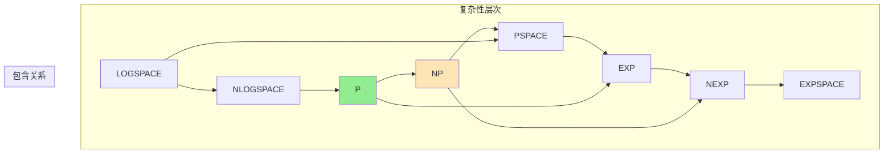

# 04.3 计算复杂性理论

---

📌 **内容摘要**

本文档深入探讨计算复杂性理论的核心原理和关键方法。内容涵盖计算理论领域的主要知识点，包括相关理论、方法及应用。适合具备相关基础的学习者进行深入研究。

**关键词**: 计算理论

📚 **学习目标**

- 深入理解计算复杂性的理论体系和形式化方法
- 能够进行相关定理的形式化证明
- 建立该领域的系统性知识框架

🎯 **难度级别**: 高级

⏱️ **预计阅读时间**: 15分钟

**前置知识**: 该领域的中级知识, 形式化方法基础

---


## 1. 引言

### 1.1 复杂性理论的目标

计算复杂性理论研究解决问题所需的计算资源（时间、空间），并对问题进行分类。

**核心问题**：

- 问题的内在难度是什么？
- 哪些问题是实际可解的？
- 资源之间的权衡关系？

### 1.2 复杂性层次



---

## 2. 时间与空间复杂性

### 2.1 时间复杂性类

**定义 2.1** (时间复杂性)。对于函数 $f: \mathbb{N} \to \mathbb{N}$：

$$\text{TIME}(f(n)) = \{L \mid \exists \text{ DTM } M \text{ 在时间 } O(f(n)) \text{ 内判定 } L\}$$

**定义 2.2** (复杂性类 P)。

$$P = \bigcup_{k \geq 0} \text{TIME}(n^k)$$

解释：多项式时间内可判定的语言类，被认为是"实际可解的"。

**定义 2.3** (非确定性时间)。

$$\text{NTIME}(f(n)) = \{L \mid \exists \text{ NTM } M \text{ 在时间 } O(f(n)) \text{ 内接受 } L\}$$

### 2.2 空间复杂性类

**定义 2.4** (空间复杂性)。

$$\text{SPACE}(f(n)) = \{L \mid \exists \text{ DTM } M \text{ 使用空间 } O(f(n)) \text{ 判定 } L\}$$

**定义 2.5** (L 和 PSPACE)。

$$L = \text{SPACE}(\log n)$$
$$PSPACE = \bigcup_{k \geq 0} \text{SPACE}(n^k)$$

**定理 2.1** (空间与时间的关系)。

$$L \subseteq NL \subseteq P \subseteq NP \subseteq PSPACE = NPSPACE \subseteq EXP$$

**定理 2.2** (Savitch)。$PSPACE = NPSPACE$。

_证明概要_：非确定性空间 $f(n)$ 可用确定性空间 $O(f(n)^2)$ 模拟。

### 2.3 层次定理

**定理 2.3** (时间层次)。若 $f$ 是时间可构造的，则：

$$\text{TIME}(f(n)) \subsetneq \text{TIME}(f(n)^2)$$

**定理 2.4** (空间层次)。若 $f$ 是空间可构造的，则：

$$\text{SPACE}(f(n)) \subsetneq \text{SPACE}(f(n) \cdot \log f(n))$$

---

## 3. NP 与 NP-完备性

### 3.1 NP 类

**定义 3.1** (NP)。

$$NP = \bigcup_{k \geq 0} \text{NTIME}(n^k)$$

等价定义：$L \in NP$ 当且仅当存在多项式时间验证器 $V$ 和多项式 $p$：

$$w \in L \Leftrightarrow \exists c \in \{0,1\}^{p(|w|)}: V(w, c) = 1$$

$c$ 称为**证书** (certificate) 或**见证** (witness)。

### 3.2 多项式时间归约

**定义 3.2** (多项式归约)。$A \leq_p B$ 若存在多项式时间可计算函数 $f$：

$$w \in A \Leftrightarrow f(w) \in B$$

**定理 3.1** (NP-完备性)。$B$ 是 **NP-完备的**，若：

1. $B \in NP$
2. $\forall A \in NP: A \leq_p B$（NP-困难性）

### 3.3 Cook-Levin 定理

**定理 3.2** (Cook-Levin)。SAT 是 NP-完备的。

_证明概要_：

1. SAT $\in$ NP：给定赋值，可在多项式时间验证
2. NP-困难性：任意 NP 问题可归约到 SAT
   - 给定 NTM $M$ 和输入 $w$
   - 构造布尔公式 $\phi$ 编码 $M$ 在 $w$ 上的接受计算
   - $\phi$ 可满足 $\Leftrightarrow$ $M$ 接受 $w$

**算法 3.1** (SAT 归约框架)。

```python
def NP_to_SAT(M, w, time_bound):
    """
    将NTM接受问题归约到SAT
    M: 非确定性图灵机
    w: 输入
    time_bound: 时间界 (多项式)
    """
    variables = []
    clauses = []

    # 表格变量: T[i, j, k] = 时间i位置j的符号是k
    for t in range(time_bound):
        for pos in range(time_bound):
            for symbol in alphabet ∪ states:
                variables.append(f"T_{t}_{pos}_{symbol}")

    # 约束1: 初始配置正确
    clauses.extend(initial_configuration_constraints(M, w))

    # 约束2: 转移函数一致性
    for t in range(time_bound - 1):
        for pos in range(time_bound):
            clauses.extend(transition_constraints(M, t, pos))

    # 约束3: 最终进入接受状态
    clauses.extend(accepting_state_constraints(time_bound))

    # 约束4: 每个单元格恰好一个符号
    clauses.extend(exactly_one_constraints())

    return CNF_formula(variables, clauses)
```

### 3.4 经典 NP-完备问题

| 问题 | 描述 | 归约来源 |
|-----|------|---------|
| 3-SAT | 每个子句至多3个文字 | SAT |
| 顶点覆盖 | 最小顶点覆盖 ≤ k | 3-SAT |
| 团 | 最大团 ≥ k | 顶点覆盖 |
| 哈密顿路径 | 存在哈密顿路径 | 顶点覆盖 |
| 子集和 | 子集和等于目标 | 3-SAT |
| 背包 | 背包优化问题 | 子集和 |
| 图着色 | 用k色着色 | 3-SAT |

---

## 4. P vs NP 问题

### 4.1 问题陈述

**问题 4.1** (P vs NP)。$P = NP$ 还是 $P \neq NP$？

这是数学和计算机科学中最重要的开放问题之一，Clay 千年奖问题之一。

**含义**：

- 若 $P = NP$：所有可被快速验证的问题也可被快速求解
- 若 $P \neq NP$：存在天然困难的问题

### 4.2 尝试证明的方向

| 方法 | 思路 | 现状 |
|-----|------|-----|
| 对角化 | 类似停机问题证明 | 受限于相对化障碍 |
| 电路复杂性 | 证明 NP 需要大电路 | 已证明部分结果 |
| 证明复杂性 | 分析证明系统强度 | 进展缓慢 |
| 代数几何 | 几何复杂性理论 | 活跃研究方向 |
| 统计物理 | 相变分析 | 启发式方法 |

### 4.3 NP-中间问题

**定理 4.1** (Ladner)。若 $P \neq NP$，则存在 $NP$-中间问题（在 NP 中但既非 NP-完备也非在 P 中）。

**候选 NP-中间问题**：

- 图同构 (GI)
- 整数分解
- 离散对数

---

## 5. 其他复杂性类

### 5.1 多项式层次

**定义 5.1** (多项式层次 PH)。

$$\Sigma_1^P = NP$$
$$\Pi_1^P = co\text{-}NP$$
$$\Sigma_{k+1}^P = NP^{\Sigma_k^P}$$
$$PH = \bigcup_k \Sigma_k^P$$

**定理 5.1**。若 $\Sigma_k^P = \Pi_k^P$ 对某个 $k$，则 $PH = \Sigma_k^P$（层次坍缩）。

### 5.2 PSPACE-完备问题

| 问题 | 描述 |
|-----|------|
| TQBF | 真值量化布尔公式 |
| 广义地理游戏 | 有向图上的博弈 |
| 国际象棋 | 指数空间版本 |
| 电路值问题 | 电路求值 |

**定理 5.2**。TQBF 是 PSPACE-完备的。

### 5.3 概率复杂性

**定义 5.2** (BPP)。

$$BPP = \{L \mid \exists \text{ PTM } M, \forall w:$$
$$w \in L \Rightarrow \Pr[M(w) = 1] \geq 2/3,$$
$$w \notin L \Rightarrow \Pr[M(w) = 0] \geq 2/3\}$$

**关系**：$P \subseteq BPP \subseteq PSPACE$，且普遍认为 $P = BPP$。

---

## 6. Lean 形式化

### 6.1 复杂性类定义

```lean4
import Mathlib

-- 时间复杂性类
def TIME {Sigma} [Fintype Sigma]
    (f : ℕ → ℕ) : Set (Set (List Sigma)) :=
  { L | ∃ M : TM, M.decides L ∧
    ∀ w, M.timeComplexity w ≤ f w.length }

-- P类
def P {Sigma} [Fintype Sigma] : Set (Set (List Sigma)) :=
  ⋃ k : ℕ, TIME (λ n => n ^ k)

-- NP类 (非确定性版本)
def NP {Sigma} [Fintype Sigma] : Set (Set (List Sigma)) :=
  { L | ∃ V : Verifier, V.isPolyTime ∧
    ∀ w, w ∈ L ↔ ∃ c, V.verify w c }

-- 多项式时间归约
def PolyTimeReducible {Sigma} [Fintype Sigma]
    (A B : Set (List Sigma)) : Prop :=
  ∃ f : (List Sigma) → (List Sigma),
  f.isPolyTime ∧ ∀ w, w ∈ A ↔ f w ∈ B

infix:50 " ≤ₚ " => PolyTimeReducible
```

### 6.2 NP-完备性

```lean4
-- NP-困难性
def NPHard {Sigma} [Fintype Sigma]
    (L : Set (List Sigma)) : Prop :=
  ∀ A ∈ NP, A ≤ₚ L

-- NP-完备性
def NPComplete {Sigma} [Fintype Sigma]
    (L : Set (List Sigma)) : Prop :=
  L ∈ NP ∧ NPHard L

-- Cook-Levin定理: SAT是NP-完备的
theorem sat_is_np_complete :
    NPComplete SAT := by
  constructor
  · -- SAT ∈ NP
    exact sat_in_np
  · -- SAT是NP-困难的
    intro A hA
    -- 构造从任意NP问题到SAT的归约
    sorry  -- 需Cook-Levin构造
```

### 6.3 复杂性层次

```lean4
-- L ⊆ P
theorem L_subset_P {Sigma} [Fintype Sigma] :
    L ⊆ (P : Set (Set (List Sigma))) := by
  sorry  -- 需证明对数空间可由多项式时间模拟

-- P ⊆ NP
theorem P_subset_NP {Sigma} [Fintype Sigma] :
    P ⊆ (NP : Set (Set (List Sigma))) := by
  intro L hL
  -- 确定性图灵机是非确定性图灵机的特例
  sorry

-- NP ⊆ PSPACE
theorem NP_subset_PSPACE {Sigma} [Fintype Sigma] :
    NP ⊆ (PSPACE : Set (Set (List Sigma))) := by
  sorry  -- 使用Savitch定理
```

---

## 7. 前沿研究

### 7.1 电路复杂性

**定义 7.1** (电路族)。问题可由多项式大小电路族求解当且仅当它在 $P/poly$ 中。

**定理 7.1** (Karp-Lipton)。若 $NP \subseteq P/poly$，则 $PH = \Sigma_2^P$。

### 7.2 量子复杂性

**定义 7.2** (BQP)。

$$BQP = \{L \mid \exists \text{ 量子多项式时间算法 } A:$$
$$w \in L \Rightarrow \Pr[A(w) = 1] \geq 2/3,$$
$$w \notin L \Rightarrow \Pr[A(w) = 0] \geq 2/3\}$$

**关系**：$P \subseteq BPP \subseteq BQP \subseteq PSPACE$

**Shor 算法**：整数分解 $\in$ BQP，对密码学有重要影响。

---

## 参考文献

1. Cook, S. A. (1971). The Complexity of Theorem-Proving Procedures. STOC.
2. Karp, R. M. (1972). Reducibility Among Combinatorial Problems. Complexity of Computer Computations.
3. Levin, L. (1973). Universal Search Problems. Problems of Information Transmission.
4. Sipser, M. (2012). Introduction to the Theory of Computation. Cengage.
5. Arora, S., & Barak, B. (2009). Computational Complexity. Cambridge University Press.

---

## 索引

- **BPP**: §5.3
- **Cook-Levin 定理**: §3.3
- **NP**: §3.1
- **NP-完备**: §3.2
- **NP-困难**: §6.2
- **P**: §2.1
- **PH (多项式层次)**: §5.1
- **PSPACE**: §2.2
- **P vs NP**: §4
- **TQBF**: §5.2
- **层次定理**: §2.3
- **多项式归约**: §3.2

---

## 📋 前置知识

- [04.2 可计算性理论](../04_计算理论/04.2_可计算性.md)

---

## 📚 延伸阅读

- [11.10 相变与临界现象](../../11_系统科学/03_复杂系统/03.2_相变与临界现象.md)
- [01.4 图灵机与计算](../../02_形式语言/01_形式语言基础/01.4_图灵机与计算.md)
