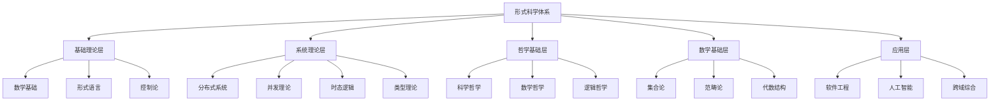

# 形式科学体系主索引

## 📋 目录

- [形式科学体系主索引](#形式科学体系主索引)
  - [📋 目录](#-目录)
  - [Formal Science System Master Index](#formal-science-system-master-index)
    - [1.1 体系概述](#11-体系概述)
    - [2. 目录结构](#2-目录结构)
      - [1.1.1 基础理论层 (01-03)](#111-基础理论层-01-03)
      - [1.1.2 系统理论层 (04-07)](#112-系统理论层-04-07)
      - [1.1.3 哲学基础层 (08)](#113-哲学基础层-08)
      - [1.1.4 数学基础层 (09)](#114-数学基础层-09)
      - [1.1.5 应用层 (10-12)](#115-应用层-10-12)
    - [1.2 知识关联图谱](#12-知识关联图谱)
    - [1.3 学习路径](#13-学习路径)
      - [3.3.1 基础路径](#331-基础路径)
      - [3.3.2 系统路径](#332-系统路径)
      - [3.3.3 应用路径](#333-应用路径)
    - [1.4 质量标准](#14-质量标准)
      - [4.4.1 内容一致性](#441-内容一致性)
      - [4.4.2 证明一致性](#442-证明一致性)
      - [4.4.3 相关性一致性](#443-相关性一致性)
      - [4.4.4 语义一致性](#444-语义一致性)
    - [1.5 技术规范](#15-技术规范)
      - [5.5.1 文档格式](#551-文档格式)
      - [5.5.2 数学表示](#552-数学表示)
      - [5.5.3 代码示例](#553-代码示例)
    - [1.6 导航系统](#16-导航系统)
      - [6.6.1 本地跳转](#661-本地跳转)
      - [6.6.2 索引系统](#662-索引系统)
    - [1.7 持续维护](#17-持续维护)
      - [7.7.1 版本控制](#771-版本控制)
      - [7.7.2 质量控制](#772-质量控制)
  - [1 批判性分析](#1-批判性分析)

---

## Formal Science System Master Index

### 1.1 体系概述

本索引建立了形式科学体系的完整知识架构，涵盖从基础理论到应用实践的各个层面，确保知识的一致性和完整性。

### 2. 目录结构

#### 1.1.1 基础理论层 (01-03)

- **[01_Foundational_Theory/](../../Matter/01_Foundational_Theory)**
  - 数学基础
  - 逻辑基础
  - 集合论基础
  - 范畴论基础

- **[02_Formal_Language/](./../02_Formal_Language/)**
  - 形式语言理论
  - 自动机理论
  - 语法分析
  - 语义理论

- **[03_Control_Theory/](../03_Control_Theory)**
  - 控制论基础
  - 系统理论
  - 稳定性分析
  - 最优控制

#### 1.1.2 系统理论层 (04-07)

- **[04_Distributed_Systems/](../11_Computer_Network_Theory/04_Distributed_Systems)**
  - 分布式算法
  - 一致性协议
  - 容错机制
  - 共识理论

- **[05_Concurrency_Theory/](./../05_Concurrency_Theory/)**
  - 并发理论
  - 同步机制
  - 死锁避免
  - 并发控制

- **[06_Temporal_Logic/](./../06_Temporal_Logic/)**
  - 时态逻辑
  - 模型检查
  - 实时系统
  - 时间约束

- **[07_Type_Theory/](./../07_Type_Theory/)**
  - 类型理论
  - 类型系统
  - 类型安全
  - 类型推断

#### 1.1.3 哲学基础层 (08)

- **[08_Philosophy_Science/](./../08_Philosophy_Science/)**
  - 科学哲学
  - 数学哲学
  - 逻辑哲学
  - 计算哲学

#### 1.1.4 数学基础层 (09)

- **[09_Mathematics/](./../09_Mathematics/)**
  - 集合论
  - 范畴论
  - 代数结构
  - 拓扑学

#### 1.1.5 应用层 (10-12)

- **[10_Software_Engineering/](./../10_Software_Engineering/)**
  - 软件架构
  - 设计模式
  - 形式化验证
  - 软件测试

- **[11_AI_Computing/](./../11_AI_Computing/)**
  - 人工智能
  - 机器学习
  - 知识表示
  - 推理系统

- **[12_Cross_Domain_Synthesis/](./../12_Cross_Domain_Synthesis/)**
  - 跨域综合
  - 系统集成
  - 理论统一
  - 应用创新

### 1.2 知识关联图谱

### 1.3 学习路径

#### 3.3.1 基础路径

1. **数学基础** → **逻辑基础** → **集合论** → **范畴论**
2. **形式语言** → **自动机理论** → **语法分析**
3. **控制论** → **系统理论** → **稳定性分析**

#### 3.3.2 系统路径

1. **类型理论** → **类型系统** → **类型安全**
2. **并发理论** → **分布式系统** → **一致性协议**
3. **时态逻辑** → **模型检查** → **实时系统**

#### 3.3.3 应用路径

1. **软件工程** → **形式化验证** → **软件测试**
2. **人工智能** → **知识表示** → **推理系统**
3. **跨域综合** → **系统集成** → **理论统一**

### 1.4 质量标准

#### 4.4.1 内容一致性

- **概念定义统一**: 所有概念在体系内保持一致的定义
- **符号使用规范**: 数学符号和逻辑符号的使用遵循国际标准
- **术语体系一致**: 专业术语的使用保持一致性

#### 4.4.2 证明一致性

- **逻辑推理严格**: 所有证明过程遵循严格的逻辑规则
- **证明过程完整**: 证明步骤完整，无逻辑跳跃
- **形式化程度高**: 尽可能使用形式化语言表达

#### 4.4.3 相关性一致性

- **知识关联清晰**: 不同主题间的关联关系明确
- **引用关系准确**: 交叉引用的内容准确无误
- **主题划分合理**: 主题的划分符合逻辑和实际需要

#### 4.4.4 语义一致性

- **表达方式统一**: 文档的表达风格保持一致
- **语言风格一致**: 学术语言的使用保持一致性
- **学术规范遵循**: 遵循国际学术写作规范

### 1.5 技术规范

#### 5.5.1 文档格式

- **Markdown格式**: 使用标准Markdown语法
- **严格序号体系**: 采用多级序号体系组织内容
- **多级标题结构**: 使用标准的标题层级结构

#### 5.5.2 数学表示

- **LaTeX数学公式**: 使用LaTeX语法编写数学公式
- **形式化符号**: 使用标准的形式化符号系统
- **图表结合**: 结合图表和数学公式进行表达

#### 5.5.3 代码示例

- **Rust语言优先**: 优先使用Rust语言编写代码示例
- **Haskell语言备选**: 必要时使用Haskell语言
- **形式化验证**: 代码示例应具有形式化验证价值

### 1.6 导航系统

#### 6.6.1 本地跳转

- **文件间跳转**: 使用相对路径进行文件间跳转
- **章节间跳转**: 使用锚点进行章节间跳转
- **跨域跳转**: 支持跨主题域的内容跳转

#### 6.6.2 索引系统

- **主题索引**: 按主题分类的索引系统
- **概念索引**: 按概念分类的索引系统
- **应用索引**: 按应用领域分类的索引系统

### 1.7 持续维护

#### 7.7.1 版本控制

- **版本号管理**: 使用语义化版本号
- **变更记录**: 详细记录每次变更内容
- **兼容性保证**: 确保版本间的兼容性

#### 7.7.2 质量控制

- **自动化检查**: 使用工具进行自动化质量检查
- **人工审查**: 定期进行人工内容审查
- **持续改进**: 根据反馈持续改进内容质量

---

**版本**: v1.0.0
**更新时间**: 2024-12-19
**维护者**: Formal Science Team

## 1 批判性分析

- 本节内容待补充：请从多元理论视角、局限性、争议点、应用前景等方面进行批判性分析。
