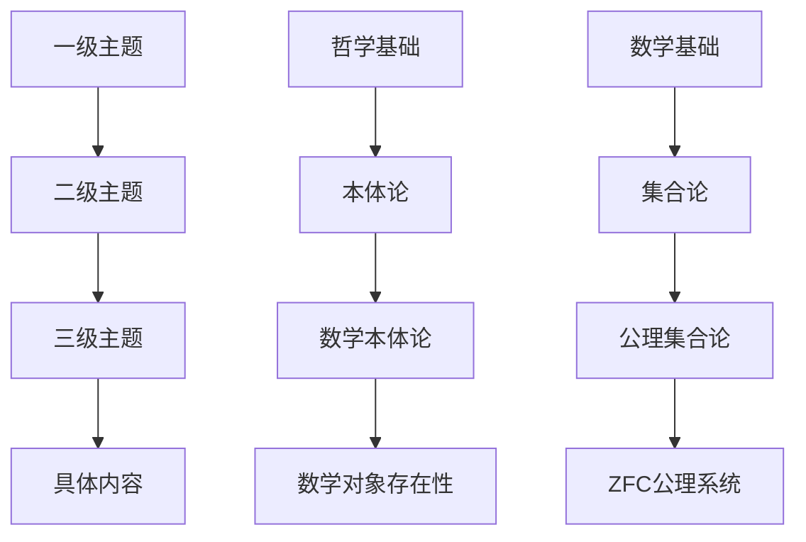
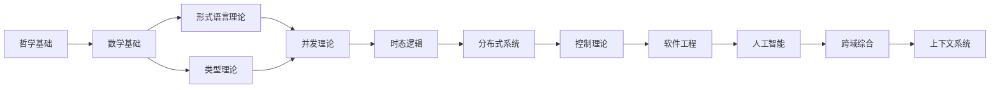

# 主题分类体系

## Topic Classification System

### 目录

1. [分类原则](#分类原则)
2. [一级主题分类](#一级主题分类)
3. [二级主题分类](#二级主题分类)
4. [三级主题分类](#三级主题分类)
5. [主题间关系](#主题间关系)
6. [分类标准](#分类标准)
7. [动态调整机制](#动态调整机制)

## 分类原则

### 核心原则

1. **层次性原则**：建立清晰的层次化分类结构
2. **相关性原则**：按内容相关性组织，避免重复
3. **完整性原则**：覆盖所有相关内容，无遗漏
4. **一致性原则**：分类标准统一，逻辑一致
5. **扩展性原则**：支持新内容的动态添加

### 分类标准

1. **学科属性**：按学科领域进行分类
2. **理论层次**：按理论抽象程度分类
3. **应用领域**：按实际应用领域分类
4. **方法论**：按研究方法进行分类
5. **历史发展**：按理论发展脉络分类

## 一级主题分类

### 01. 哲学基础 (Philosophical_Foundation)

**定义**：提供形式科学理论体系的认识论和方法论基础

**核心特征**：

- 提供认识论基础
- 建立方法论框架
- 确保逻辑一致性
- 支持跨学科整合

**包含内容**：

- 本体论：存在、实体、属性、关系
- 认识论：知识、真理、确证、信念
- 逻辑学：形式逻辑、哲学逻辑、非经典逻辑
- 伦理学：规范伦理学、元伦理学、应用伦理学
- 形而上学：存在论、模态形而上学、因果性

### 02. 数学基础 (Mathematical_Foundation)

**定义**：提供形式科学理论体系的数学工具和理论框架

**核心特征**：

- 提供形式化工具
- 建立理论框架
- 确保数学严谨性
- 支持抽象建模

**包含内容**：

- 集合论：现代数学的基础语言
- 范畴论：统一数学结构的理论框架
- 代数：抽象代数、线性代数、群论
- 几何：欧氏几何、拓扑学、微分几何
- 分析：微积分、实分析、复分析
- 数理逻辑：命题逻辑、谓词逻辑、证明论

### 03. 形式语言理论 (Formal_Language_Theory)

**定义**：研究语言的形式化描述、分析和处理的理论

**核心特征**：

- 语言的形式化建模
- 计算能力分析
- 复杂度理论
- 语言层次结构

**包含内容**：

- 自动机理论：DFA、NFA、PDA、图灵机
- 文法理论：正则文法、上下文无关文法、上下文有关文法
- 可计算性理论：递归函数、λ演算、丘奇-图灵论题
- 复杂度理论：P、NP、NP完全性、空间复杂度

### 04. 类型理论 (Type_Theory)

**定义**：研究程序类型系统的形式化理论和应用

**核心特征**：

- 类型安全保证
- 程序正确性验证
- 资源管理
- 抽象机制

**包含内容**：

- 简单类型理论：λ演算、类型检查、类型推断
- 线性类型理论：资源管理、内存安全、线性性
- 依赖类型理论：Π类型、Σ类型、程序验证
- 同伦类型理论：数学形式化、证明、同伦论
- 量子类型理论：量子计算、量子安全、量子协议

### 05. 并发理论 (Concurrency_Theory)

**定义**：研究并发系统的形式化建模和分析理论

**核心特征**：

- 并发行为建模
- 同步机制分析
- 死锁检测
- 性能分析

**包含内容**：

- Petri网理论：基本Petri网、高级Petri网、并发语义
- 进程演算：π演算、CSP、CCS、进程代数
- 并发逻辑：并发逻辑、分离逻辑、资源逻辑
- 并发模型：Actor模型、CSP模型、π演算模型

### 06. 时态逻辑 (Temporal_Logic)

**定义**：研究时间相关系统的形式化描述和验证理论

**核心特征**：

- 时间行为建模
- 时态性质验证
- 实时系统分析
- 模型检查

**包含内容**：

- 线性时态逻辑：LTL、时态操作符、模型检查
- 分支时态逻辑：CTL、CTL*、计算树逻辑
- 时态控制：规范、控制器合成、时态验证
- 实时逻辑：实时系统、时间约束、实时验证

### 07. 分布式系统 (Distributed_Systems)

**定义**：研究分布式系统的理论分析和设计方法

**核心特征**：

- 分布式算法
- 一致性保证
- 容错机制
- 性能优化

**包含内容**：

- 共识理论：FLP不可能性、Paxos、Raft、拜占庭容错
- 容错理论：故障模型、复制、状态机复制
- 一致性理论：强一致性、最终一致性、CAP定理
- 分布式算法：领导者选举、互斥、分布式事务

### 08. 控制理论 (Control_Theory)

**定义**：研究控制系统的理论分析和设计方法

**核心特征**：

- 系统建模
- 稳定性分析
- 控制器设计
- 性能优化

**包含内容**：

- 经典控制：系统建模、稳定性分析、根轨迹法
- 现代控制：状态空间、可控性、可观性、极点配置
- 鲁棒控制：不确定性建模、H∞控制、μ-综合
- 最优控制：变分法、动态规划、LQR、LQG

### 09. 软件工程 (Software_Engineering)

**定义**：研究软件系统的工程化开发和管理方法

**核心特征**：

- 软件架构设计
- 开发方法论
- 质量保证
- 项目管理

**包含内容**：

- 设计模式：创建型、结构型、行为型模式
- 架构设计：分层架构、微服务、事件驱动
- 形式化验证：模型检查、定理证明、静态分析
- 测试理论：单元测试、集成测试、形式化测试

### 10. 人工智能 (AI_Computing)

**定义**：研究智能系统的理论框架和实现方法

**核心特征**：

- 智能行为建模
- 学习算法
- 知识表示
- 推理机制

**包含内容**：

- 机器学习：监督学习、无监督学习、强化学习
- 知识表示：逻辑表示、语义网络、本体论
- 自动推理：归结推理、前向推理、后向推理
- AI哲学：强AI、弱AI、意识问题、图灵测试

### 11. 跨域综合 (Cross_Domain_Synthesis)

**定义**：整合不同理论领域，建立统一的理论框架

**核心特征**：

- 理论整合
- 跨学科融合
- 统一框架
- 前沿发展

**包含内容**：

- 理论整合：不同理论的统一框架
- 跨学科：学科间的交叉融合
- 统一框架：形式科学的统一理论
- 发展方向：前沿理论和应用

### 12. 上下文系统 (Context_System)

**定义**：维护整个理论体系的持续构建和质量保证

**核心特征**：

- 进度跟踪
- 质量保证
- 持续构建
- 上下文维护

**包含内容**：

- 进度跟踪：重构进度、质量指标、任务管理
- 持续构建：自动化构建、质量检查、版本管理
- 质量保证：规范检查、一致性验证、质量评估
- 上下文提醒：工作上下文、连续性支持、决策记录

## 二级主题分类

### 01. 哲学基础 - 二级分类

#### 01.01 本体论 (Ontology)

- **数学本体论**：数学对象的存在性、数学真理的本质
- **现实本体论**：客观实在、主观实在、物质与精神
- **信息本体论**：信息作为基础实在、计算宇宙假说
- **AI本体论**：智能的本质、意识的存在性

#### 01.02 认识论 (Epistemology)

- **知识论**：JTB理论、葛梯尔问题、确证理论
- **真理理论**：符合论、融贯论、实用主义、紧缩论
- **知识来源**：理性主义、经验主义、批判主义
- **知识结构**：基础主义、反基础主义、融贯论

#### 01.03 逻辑学 (Logic)

- **形式逻辑**：命题逻辑、谓词逻辑、模态逻辑、时序逻辑
- **哲学逻辑**：认识逻辑、道义逻辑、信念逻辑、意图逻辑
- **非经典逻辑**：直觉主义逻辑、模糊逻辑、非单调逻辑、多值逻辑
- **逻辑哲学**：逻辑的本质、发现vs发明、逻辑多元主义

#### 01.04 伦理学 (Ethics)

- **规范伦理学**：义务论、功利主义、德性伦理学、关怀伦理学
- **元伦理学**：道德实在论、情感主义、建构主义、错误理论
- **应用伦理学**：AI伦理、工程伦理、科学伦理、环境伦理
- **形式化伦理学**：道义逻辑、价值对齐、计算道德

#### 01.05 形而上学 (Metaphysics)

- **存在论**：实体、属性、关系、类别
- **模态形而上学**：必然性、可能性、可能世界、本质与偶然
- **时间与空间**：时间逻辑、空间哲学、时空关系
- **因果性**：因果关系、决定论、自由意志、概率因果

### 02. 数学基础 - 二级分类

#### 02.01 集合论 (Set_Theory)

- **朴素集合论**：集合的基本概念、集合运算、关系与函数
- **公理集合论**：ZFC公理系统、序数、基数、选择公理
- **构造性集合论**：直觉主义集合论、类型论集合论
- **集合论应用**：在数学各分支中的应用

#### 02.02 范畴论 (Category_Theory)

- **基础概念**：对象、态射、函子、自然变换
- **极限理论**：积、余积、等化子、余等化子
- **伴随理论**：伴随函子、单位、余单位
- **高阶范畴**：2-范畴、∞-范畴、同伦论

#### 02.03 代数 (Algebra)

- **抽象代数**：群、环、域、模、代数
- **线性代数**：向量空间、线性变换、特征值、特征向量
- **群论**：有限群、李群、表示论、伽罗瓦理论
- **环论**：交换环、非交换环、理想、局部化

#### 02.04 几何 (Geometry)

- **欧氏几何**：平面几何、立体几何、解析几何
- **非欧几何**：黎曼几何、罗氏几何、射影几何
- **拓扑学**：点集拓扑、代数拓扑、微分拓扑
- **微分几何**：流形、切丛、黎曼度量、曲率

#### 02.05 分析 (Analysis)

- **微积分**：极限、连续性、微分、积分
- **实分析**：测度论、勒贝格积分、函数空间
- **复分析**：复变函数、解析函数、留数理论
- **泛函分析**：巴拿赫空间、希尔伯特空间、算子理论

#### 02.06 数理逻辑 (Logic)

- **命题逻辑**：命题演算、真值表、自然演绎
- **谓词逻辑**：一阶逻辑、量词、模型论
- **证明论**：自然演绎、希尔伯特系统、根岑系统
- **模型论**：模型、理论、紧致性定理、完全性定理

### 03. 形式语言理论 - 二级分类

#### 03.01 自动机理论 (Automata_Theory)

- **有限自动机**：DFA、NFA、ε-NFA、最小化
- **下推自动机**：DPDA、NPDA、上下文无关语言
- **图灵机**：标准图灵机、非确定性图灵机、多带图灵机
- **线性有界自动机**：LBA、上下文有关语言

#### 03.02 文法理论 (Grammar_Theory)

- **正则文法**：右线性文法、左线性文法、正则表达式
- **上下文无关文法**：CFG、乔姆斯基范式、格雷巴赫范式
- **上下文有关文法**：CSG、单调文法、无限制文法
- **文法层次**：乔姆斯基层次、语言类包含关系

#### 03.03 可计算性理论 (Computability_Theory)

- **递归函数**：原始递归、μ递归、递归函数论
- **λ演算**：无类型λ演算、类型λ演算、归约
- **丘奇-图灵论题**：计算模型等价性、可计算性
- **不可判定性**：停机问题、波斯特问题、赖斯定理

#### 03.04 复杂度理论 (Complexity_Theory)

- **时间复杂度**：P类、NP类、NP完全性、多项式时间归约
- **空间复杂度**：PSPACE、L类、NL类、对数空间归约
- **随机化算法**：BPP、RP、ZPP、随机化归约
- **量子复杂度**：BQP、量子算法、量子优势

### 04. 类型理论 - 二级分类

#### 04.01 简单类型理论 (Simple_Type_Theory)

- **λ演算**：无类型λ演算、简单类型λ演算、类型检查
- **类型推断**：Hindley-Milner系统、算法W、最一般类型
- **类型安全**：类型保持性、进展性、类型错误避免
- **语义**：指称语义、操作语义、公理语义

#### 04.02 线性类型理论 (Linear_Type_Theory)

- **线性逻辑**：线性蕴涵、乘性连接词、加性连接词
- **线性λ演算**：线性函数、资源管理、线性性检查
- **仿射类型**：仿射逻辑、所有权、生命周期
- **应用**：内存安全、资源管理、并发编程

#### 04.03 依赖类型理论 (Dependent_Type_Theory)

- **Π类型**：依赖函数类型、类型族、参数化类型
- **Σ类型**：依赖积类型、存在类型、记录类型
- **归纳类型**：自然数、列表、树、归纳定义
- **程序验证**：程序正确性、规范、证明

#### 04.04 同伦类型理论 (Homotopy_Type_Theory)

- **同伦论基础**：路径、同伦、等价、同伦等价
- **类型作为空间**：类型的高维结构、同伦群
- **证明作为路径**：证明的几何解释、路径代数
- **数学形式化**：集合论、范畴论、代数拓扑

#### 04.05 量子类型理论 (Quantum_Type_Theory)

- **量子计算**：量子比特、量子门、量子算法
- **量子安全**：量子密码学、后量子密码学
- **量子协议**：量子密钥分发、量子隐形传态
- **量子编程**：量子编程语言、量子类型系统

### 05. 并发理论 - 二级分类

#### 05.01 Petri网理论 (Petri_Nets)

- **基本Petri网**：库所、变迁、流关系、标识
- **高级Petri网**：时间Petri网、着色Petri网、层次Petri网
- **并发语义**：步语义、部分序语义、真并发
- **分析技术**：可达性、有界性、活性、公平性

#### 05.02 进程演算 (Process_Calculi)

- **CCS**：通信系统演算、同步、并行、递归
- **CSP**：通信顺序进程、外部选择、内部选择
- **π演算**：移动进程演算、名称传递、动态拓扑
- **进程代数**：公理化、等价关系、互模拟

#### 05.03 并发逻辑 (Concurrent_Logic)

- **并发逻辑**：分离逻辑、资源逻辑、并发推理
- **分离逻辑**：分离合取、框架规则、资源推理
- **资源逻辑**：资源、消费、生产、资源管理
- **并发推理**：并发程序的逻辑推理、验证

#### 05.04 并发模型 (Concurrency_Models)

- **Actor模型**：Actor、消息传递、邮箱、行为
- **CSP模型**：进程、通道、通信、同步
- **π演算模型**：进程、名称、通信、移动
- **其他模型**：共享内存、消息传递、混合模型

### 06. 时态逻辑 - 二级分类

#### 06.01 线性时态逻辑 (Linear_Temporal_Logic)

- **LTL语法**：时态操作符、路径公式、状态公式
- **LTL语义**：路径满足关系、状态满足关系
- **模型检查**：LTL模型检查算法、状态空间搜索
- **应用**：程序验证、硬件验证、协议验证

#### 06.02 分支时态逻辑 (Branching_Temporal_Logic)

- **CTL**：计算树逻辑、路径量词、时态操作符
- **CTL***：CTL*语法、CTL*语义、表达能力
- **μ演算**：模态μ演算、不动点、表达能力
- **模型检查**：符号模型检查、BDD、SAT

#### 06.03 时态控制 (Temporal_Control)

- **规范**：时态规范、安全性质、活性性质
- **控制器合成**：自动控制器合成、博弈论方法
- **时态验证**：模型检查、定理证明、抽象解释
- **实时控制**：实时系统、时间约束、实时验证

#### 06.04 实时逻辑 (Real_Time_Logic)

- **实时系统**：时间约束、截止时间、响应时间
- **时间逻辑**：时间操作符、时间约束、时间验证
- **实时验证**：时间自动机、时间模型检查
- **应用**：嵌入式系统、实时控制、安全关键系统

### 07. 分布式系统 - 二级分类

#### 07.01 共识理论 (Consensus_Theory)

- **FLP不可能性**：异步系统中的共识不可能性
- **Paxos算法**：Paxos协议、提议者、接受者、学习者
- **Raft算法**：领导者选举、日志复制、安全性
- **拜占庭容错**：拜占庭故障、PBFT、拜占庭共识

#### 07.02 容错理论 (Fault_Tolerance)

- **故障模型**：崩溃故障、遗漏故障、拜占庭故障
- **复制**：状态复制、数据复制、一致性复制
- **状态机复制**：主备复制、多副本复制、一致性
- **恢复机制**：故障检测、故障恢复、自动恢复

#### 07.03 一致性理论 (Consistency_Theory)

- **强一致性**：线性一致性、顺序一致性、因果一致性
- **最终一致性**：最终一致性模型、收敛性
- **CAP定理**：一致性、可用性、分区容错性
- **一致性协议**：2PC、3PC、Paxos、Raft

#### 07.04 分布式算法 (Distributed_Algorithms)

- **领导者选举**：环算法、Bully算法、Chang-Roberts算法
- **互斥**：Lamport算法、Ricart-Agrawala算法、Maekawa算法
- **分布式事务**：2PC、3PC、Saga模式、TCC模式
- **分布式存储**：一致性哈希、DHT、分布式文件系统

### 08. 控制理论 - 二级分类

#### 08.01 经典控制 (Classical_Control)

- **系统建模**：传递函数、状态空间、系统识别
- **稳定性分析**：劳斯-赫尔维茨判据、奈奎斯特判据
- **根轨迹法**：根轨迹绘制、根轨迹分析、控制器设计
- **频域方法**：频率响应、波特图、奈奎斯特图

#### 08.02 现代控制 (Modern_Control)

- **状态空间**：状态方程、输出方程、状态反馈
- **可控性**：可控性矩阵、可控性判据、可控标准型
- **可观性**：可观性矩阵、可观性判据、可观标准型
- **极点配置**：状态反馈极点配置、观测器设计

#### 08.03 鲁棒控制 (Robust_Control)

- **不确定性建模**：参数不确定性、非结构化不确定性
- **H∞控制**：H∞范数、H∞控制器设计、μ-综合
- **μ-综合**：结构奇异值、μ-综合方法、鲁棒性能
- **LMI方法**：线性矩阵不等式、凸优化、控制器设计

#### 08.04 最优控制 (Optimal_Control)

- **变分法**：欧拉-拉格朗日方程、横截条件
- **动态规划**：贝尔曼方程、最优性原理、值函数
- **LQR**：线性二次调节器、黎卡提方程、最优反馈
- **LQG**：线性二次高斯、卡尔曼滤波、分离原理

### 09. 软件工程 - 二级分类

#### 09.01 设计模式 (Design_Patterns)

- **创建型模式**：单例、工厂、建造者、原型、抽象工厂
- **结构型模式**：适配器、桥接、组合、装饰、外观、享元、代理
- **行为型模式**：责任链、命令、解释器、迭代器、中介者、备忘录、观察者、状态、策略、模板方法、访问者
- **架构模式**：MVC、MVP、MVVM、微服务、事件驱动

#### 09.02 架构设计 (Architecture)

- **分层架构**：表现层、业务层、数据层、基础设施层
- **微服务架构**：服务拆分、服务通信、服务治理
- **事件驱动架构**：事件、事件流、事件存储、事件处理
- **云原生架构**：容器化、编排、服务网格、可观测性

#### 09.03 形式化验证 (Formal_Verification)

- **模型检查**：状态空间搜索、符号模型检查、有界模型检查
- **定理证明**：交互式定理证明、自动定理证明、证明辅助
- **静态分析**：类型检查、数据流分析、控制流分析
- **程序分析**：抽象解释、符号执行、模型检查

#### 09.04 测试理论 (Testing_Theory)

- **单元测试**：测试用例设计、测试覆盖率、测试驱动开发
- **集成测试**：接口测试、系统集成、端到端测试
- **形式化测试**：基于模型的测试、基于规范的测试
- **测试自动化**：测试框架、持续集成、测试报告

### 10. 人工智能 - 二级分类

#### 10.01 机器学习 (Machine_Learning)

- **监督学习**：分类、回归、支持向量机、决策树
- **无监督学习**：聚类、降维、关联规则、异常检测
- **强化学习**：Q学习、策略梯度、深度强化学习
- **深度学习**：神经网络、卷积网络、循环网络、注意力机制

#### 10.02 知识表示 (Knowledge_Representation)

- **逻辑表示**：一阶逻辑、描述逻辑、规则系统
- **语义网络**：概念图、框架、脚本、语义网络
- **本体论**：本体语言、本体工程、本体推理
- **知识图谱**：实体关系、知识抽取、知识融合

#### 10.03 自动推理 (Automated_Reasoning)

- **归结推理**：归结原理、归结证明、归结策略
- **前向推理**：前向链、规则引擎、专家系统
- **后向推理**：后向链、目标导向推理、Prolog
- **不确定性推理**：贝叶斯网络、模糊逻辑、证据理论

#### 10.04 AI哲学 (AI_Philosophy)

- **强AI**：通用人工智能、意识、自我意识
- **弱AI**：专用人工智能、工具性智能
- **意识问题**：中文房间、图灵测试、意识难题
- **AI伦理**：价值对齐、公平性、透明度、责任

### 11. 跨域综合 - 二级分类

#### 11.01 理论整合 (Theory_Integration)

- **统一框架**：不同理论的统一数学框架
- **理论映射**：理论间的对应关系和转换
- **交叉验证**：不同理论方法的相互验证
- **综合应用**：多理论方法的综合应用

#### 11.02 跨学科 (Cross_Disciplinary)

- **学科交叉**：不同学科间的交叉融合
- **方法论整合**：不同研究方法的整合
- **应用领域**：跨学科应用领域
- **新兴方向**：跨学科新兴研究方向

#### 11.03 统一框架 (Unified_Framework)

- **数学框架**：统一的数学理论框架
- **逻辑框架**：统一的逻辑推理框架
- **计算框架**：统一的计算模型框架
- **应用框架**：统一的应用开发框架

#### 11.04 发展方向 (Future_Directions)

- **理论前沿**：理论发展的前沿方向
- **技术前沿**：技术发展的前沿方向
- **应用前沿**：应用发展的前沿方向
- **挑战问题**：面临的主要挑战和问题

### 12. 上下文系统 - 二级分类

#### 12.01 进度跟踪 (Progress_Tracking)

- **任务管理**：任务分配、进度监控、里程碑管理
- **质量指标**：质量度量、质量评估、质量报告
- **资源管理**：人力资源、时间资源、技术资源
- **风险管理**：风险识别、风险评估、风险应对

#### 12.02 持续构建 (Continuous_Building)

- **自动化构建**：构建脚本、构建流程、构建环境
- **质量检查**：代码检查、文档检查、规范检查
- **版本管理**：版本控制、版本发布、版本回滚
- **部署管理**：环境部署、配置管理、发布管理

#### 12.03 质量保证 (Quality_Assurance)

- **规范检查**：编码规范、文档规范、格式规范
- **一致性验证**：逻辑一致性、术语一致性、格式一致性
- **质量评估**：质量度量、质量分析、质量改进
- **审查机制**：同行审查、专家审查、用户审查

#### 12.04 上下文提醒 (Context_Reminder)

- **工作上下文**：当前工作状态、工作环境、工作目标
- **连续性支持**：工作连续性、上下文保持、状态恢复
- **决策记录**：决策过程、决策理由、决策结果
- **知识管理**：知识积累、知识共享、知识更新

## 三级主题分类

三级主题分类是对二级主题的进一步细化，提供更具体的内容分类。每个二级主题下可以包含多个三级主题，形成完整的层次化分类体系。

### 示例：04.01 简单类型理论 - 三级分类

#### 04.01.01 λ演算基础

- **无类型λ演算**：语法、归约、Church-Rosser定理
- **简单类型λ演算**：类型语法、类型检查、类型安全
- **类型推断**：Hindley-Milner系统、算法W、最一般类型
- **语义**：指称语义、操作语义、公理语义

#### 04.01.02 类型系统

- **类型检查**：类型检查算法、类型错误诊断
- **类型推断**：类型推断算法、类型变量、约束求解
- **类型安全**：类型保持性、进展性、类型错误避免
- **类型系统设计**：类型系统设计原则、类型系统扩展

#### 04.01.03 语义理论

- **指称语义**：类型解释、表达式解释、语义域
- **操作语义**：小步语义、大步语义、归约关系
- **公理语义**：公理、推理规则、证明系统
- **语义等价**：语义等价关系、语义等价证明

#### 04.01.04 应用

- **编程语言**：类型系统在编程语言中的应用
- **编译器**：类型检查在编译器中的应用
- **程序验证**：类型系统在程序验证中的应用
- **软件工程**：类型系统在软件工程中的应用

## 主题间关系

### 层次关系

### 依赖关系

### 交叉关系

| 主题 | 交叉主题 | 交叉内容 |
|------|----------|----------|
| **类型理论** | **形式语言理论** | 类型系统的语法和语义 |
| **并发理论** | **时态逻辑** | 并发系统的时态性质 |
| **分布式系统** | **控制理论** | 分布式控制算法 |
| **软件工程** | **人工智能** | 智能软件系统 |
| **数学基础** | **所有主题** | 形式化工具和框架 |

## 1分类标准

### 内容标准

1. **主题相关性**：内容与主题的核心概念相关
2. **理论层次**：内容的抽象程度和理论深度
3. **应用领域**：内容的应用范围和领域
4. **方法论**：内容使用的研究方法和技术
5. **历史发展**：内容在理论发展中的位置

### 质量标准

1. **准确性**：内容的科学准确性和正确性
2. **完整性**：内容的完整性和系统性
3. **一致性**：内容与相关理论的一致性
4. **清晰性**：内容的表达清晰性和可理解性
5. **实用性**：内容的实际应用价值

### 组织标准

1. **层次性**：分类的层次结构和逻辑关系
2. **系统性**：分类的系统性和完整性
3. **扩展性**：分类的可扩展性和适应性
4. **一致性**：分类标准的一致性和统一性
5. **实用性**：分类的实用性和可操作性

## 动态调整机制

### 调整原则

1. **内容驱动**：根据内容变化调整分类
2. **需求导向**：根据用户需求调整分类
3. **发展适应**：根据理论发展调整分类
4. **质量保证**：确保分类质量和一致性
5. **持续改进**：持续优化和完善分类

### 调整流程

1. **需求识别**：识别分类调整的需求
2. **方案设计**：设计分类调整方案
3. **影响评估**：评估调整的影响范围
4. **实施执行**：执行分类调整
5. **效果评估**：评估调整效果
6. **持续监控**：持续监控分类效果

### 调整机制

1. **定期审查**：定期审查分类的合理性
2. **反馈收集**：收集用户反馈和建议
3. **专家评审**：专家评审分类调整方案
4. **试点验证**：在小范围内试点验证
5. **全面推广**：在验证成功后全面推广

---

**最后更新**: 2024-12-19
**版本**: v10.0
**维护者**: 形式科学理论体系团队

## 批判性分析

- 多元视角：
  - 语义与层级协同：主题分类既要服务导航，又要支撑一致性校验与证据收集；需与术语表、锚点ID、交叉引用共用底层事实表。
- 局限性：
  - 僵化与漂移：固定树形难适配新交叉主题；标题/锚点变更引发断链；需稳定ID与别名映射。
  - 维护成本：细粒度分类提升查准率但抬高维护成本；需自动化建议 + 人工确认的混合策略。
- 争议点：
  - 粒度选择：过细影响可读性，过粗影响可检索性；应按热度/成熟度分级。
- 应用前景：
  - 自适应导航：基于使用数据与依赖关系，动态推荐路径与先修依赖。
- 改进建议：
  - 稳定ID体系：为主题/章节建立稳定ID与别名；在CI中校验引用一致性。
  - 质量门禁：设定“断链率/孤立节点率/未双向链接率”阈值并阻断合并。
  - 漂移报告：周期生成分类漂移/锚点变更报告与修复建议清单。
