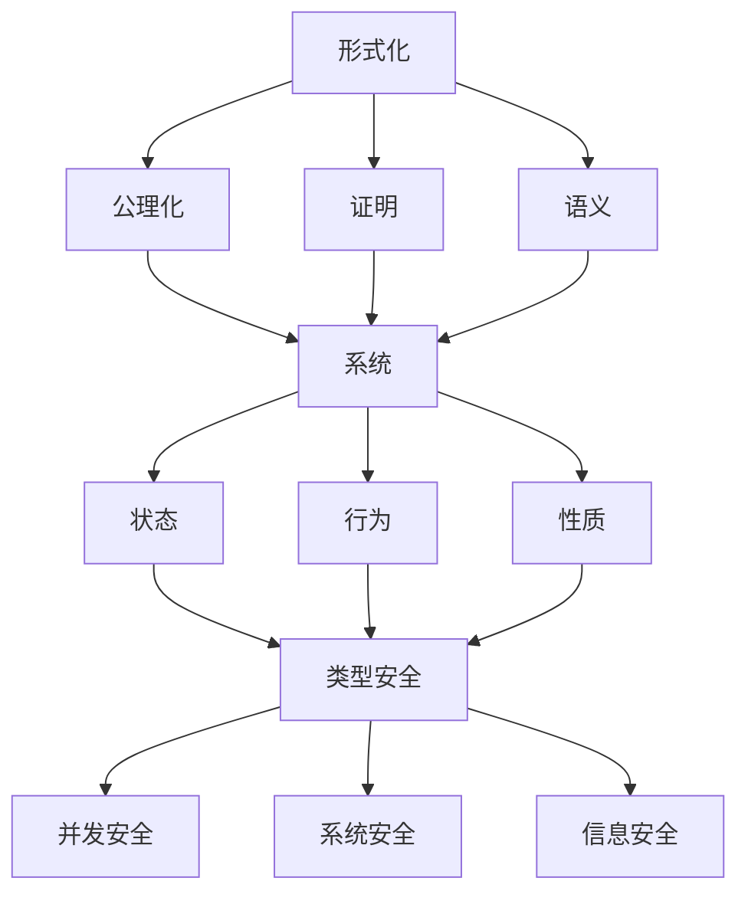

# 交叉引用索引

## Cross-Reference Index

### 目录

1. [索引概述](#索引概述)
2. [理论间交叉引用](#理论间交叉引用)
3. [概念交叉引用](#概念交叉引用)
4. [方法交叉引用](#方法交叉引用)
5. [应用交叉引用](#应用交叉引用)
6. [引用规范](#引用规范)
7. [索引维护](#索引维护)

## 索引概述

交叉引用索引是形式科学理论体系的重要组成部分，用于建立不同理论、概念、方法和应用之间的关联关系，确保知识体系的一致性和完整性。

### 索引功能

1. **关联发现**：发现不同理论间的关联关系
2. **知识导航**：提供知识探索的导航路径
3. **一致性保证**：确保相关概念的一致性
4. **完整性检查**：检查知识体系的完整性
5. **学习指导**：为学习提供路径指导

### 索引原则

1. **相关性原则**：只建立真正相关的交叉引用
2. **双向原则**：交叉引用应该是双向的
3. **层次原则**：按层次组织交叉引用
4. **更新原则**：及时更新交叉引用
5. **验证原则**：定期验证交叉引用的正确性

## 理论间交叉引用

### 基础理论交叉引用

#### 哲学基础 ↔ 数学基础

| 哲学概念 | 数学对应 | 引用文件 | 关系类型 |
|----------|----------|----------|----------|
| **存在** | 集合论中的存在量词 | `01_Philosophical_Foundation/01_Ontology/01_数学本体论.md` ↔ `02_Mathematical_Foundation/01_Set_Theory/01_集合论基础.md` | 基础对应 |
| **真理** | 逻辑真值 | `01_Philosophical_Foundation/02_Epistemology/01_知识论基础.md` ↔ `02_Mathematical_Foundation/06_Logic/01_数理逻辑基础.md` | 概念映射 |
| **推理** | 逻辑推理规则 | `01_Philosophical_Foundation/03_Logic/01_形式逻辑体系.md` ↔ `02_Mathematical_Foundation/06_Logic/01_数理逻辑基础.md` | 方法对应 |
| **必然性** | 模态逻辑 | `01_Philosophical_Foundation/05_Metaphysics/01_存在论基础.md` ↔ `02_Mathematical_Foundation/06_Logic/01_数理逻辑基础.md` | 理论扩展 |

#### 数学基础 ↔ 形式语言理论

| 数学概念 | 语言理论对应 | 引用文件 | 关系类型 |
|----------|--------------|----------|----------|
| **集合** | 字母表、语言 | `02_Mathematical_Foundation/01_Set_Theory/01_集合论基础.md` ↔ `03_Formal_Language_Theory/01_Automata_Theory/01_有限自动机.md` | 基础应用 |
| **函数** | 转移函数 | `02_Mathematical_Foundation/01_Set_Theory/01_集合论基础.md` ↔ `03_Formal_Language_Theory/01_Automata_Theory/01_有限自动机.md` | 概念应用 |
| **关系** | 语言关系 | `02_Mathematical_Foundation/01_Set_Theory/01_集合论基础.md` ↔ `03_Formal_Language_Theory/02_Grammar_Theory/01_形式文法.md` | 理论应用 |
| **递归** | 递归函数 | `02_Mathematical_Foundation/06_Logic/01_数理逻辑基础.md` ↔ `03_Formal_Language_Theory/03_Computability_Theory/01_可计算性基础.md` | 方法对应 |

#### 形式语言理论 ↔ 类型理论

| 语言概念 | 类型对应 | 引用文件 | 关系类型 |
|----------|----------|----------|----------|
| **语法** | 类型语法 | `03_Formal_Language_Theory/02_Grammar_Theory/01_形式文法.md` ↔ `04_Type_Theory/01_Simple_Type_Theory/01_简单类型λ演算.md` | 结构对应 |
| **语义** | 类型语义 | `03_Formal_Language_Theory/01_Automata_Theory/01_有限自动机.md` ↔ `04_Type_Theory/01_Simple_Type_Theory/01_简单类型λ演算.md` | 语义对应 |
| **归约** | 类型归约 | `03_Formal_Language_Theory/03_Computability_Theory/01_可计算性基础.md` ↔ `04_Type_Theory/01_Simple_Type_Theory/01_简单类型λ演算.md` | 操作对应 |
| **可计算性** | 类型可计算性 | `03_Formal_Language_Theory/03_Computability_Theory/01_可计算性基础.md` ↔ `04_Type_Theory/03_Dependent_Type_Theory/01_依赖类型基础.md` | 理论对应 |

### 核心理论交叉引用

#### 类型理论 ↔ 并发理论

| 类型概念 | 并发对应 | 引用文件 | 关系类型 |
|----------|----------|----------|----------|
| **线性类型** | 资源管理 | `04_Type_Theory/02_Linear_Type_Theory/01_线性类型系统.md` ↔ `05_Concurrency_Theory/01_Petri_Nets/01_Petri网基础.md` | 资源对应 |
| **所有权** | 资源所有权 | `04_Type_Theory/02_Linear_Type_Theory/01_线性类型系统.md` ↔ `05_Concurrency_Theory/03_Concurrent_Logic/01_并发逻辑.md` | 概念对应 |
| **生命周期** | 资源生命周期 | `04_Type_Theory/02_Linear_Type_Theory/01_线性类型系统.md` ↔ `05_Concurrency_Theory/02_Process_Calculi/01_进程演算基础.md` | 管理对应 |
| **并发安全** | 类型安全 | `04_Type_Theory/01_Simple_Type_Theory/01_简单类型λ演算.md` ↔ `05_Concurrency_Theory/01_Petri_Nets/01_Petri网基础.md` | 安全对应 |

#### 并发理论 ↔ 时态逻辑

| 并发概念 | 时态对应 | 引用文件 | 关系类型 |
|----------|----------|----------|----------|
| **并发行为** | 时态行为 | `05_Concurrency_Theory/01_Petri_Nets/01_Petri网基础.md` ↔ `06_Temporal_Logic/01_Linear_Temporal_Logic/01_LTL基础.md` | 行为对应 |
| **同步** | 时态同步 | `05_Concurrency_Theory/02_Process_Calculi/01_进程演算基础.md` ↔ `06_Temporal_Logic/02_Branching_Temporal_Logic/01_CTL基础.md` | 机制对应 |
| **死锁** | 时态死锁 | `05_Concurrency_Theory/01_Petri_Nets/01_Petri网基础.md` ↔ `06_Temporal_Logic/03_Temporal_Control/01_时态控制理论.md` | 问题对应 |
| **公平性** | 时态公平性 | `05_Concurrency_Theory/01_Petri_Nets/01_Petri网基础.md` ↔ `06_Temporal_Logic/01_Linear_Temporal_Logic/01_LTL基础.md` | 性质对应 |

#### 时态逻辑 ↔ 分布式系统

| 时态概念 | 分布式对应 | 引用文件 | 关系类型 |
|----------|------------|----------|----------|
| **时间约束** | 分布式时间 | `06_Temporal_Logic/04_Real_Time_Logic/01_实时逻辑.md` ↔ `07_Distributed_Systems/01_Consensus_Theory/01_共识基础.md` | 时间对应 |
| **同步** | 分布式同步 | `06_Temporal_Logic/03_Temporal_Control/01_时态控制理论.md` ↔ `07_Distributed_Systems/02_Fault_Tolerance/01_容错理论.md` | 机制对应 |
| **一致性** | 分布式一致性 | `06_Temporal_Logic/01_Linear_Temporal_Logic/01_LTL基础.md` ↔ `07_Distributed_Systems/03_Consistency_Theory/01_一致性理论.md` | 性质对应 |
| **容错** | 分布式容错 | `06_Temporal_Logic/03_Temporal_Control/01_时态控制理论.md` ↔ `07_Distributed_Systems/02_Fault_Tolerance/01_容错理论.md` | 机制对应 |

#### 分布式系统 ↔ 控制理论

| 分布式概念 | 控制对应 | 引用文件 | 关系类型 |
|----------|----------|----------|----------|
| **系统建模** | 控制建模 | `07_Distributed_Systems/01_Consensus_Theory/01_共识基础.md` ↔ `08_Control_Theory/01_Classical_Control/01_经典控制基础.md` | 建模对应 |
| **稳定性** | 控制稳定性 | `07_Distributed_Systems/03_Consistency_Theory/01_一致性理论.md` ↔ `08_Control_Theory/01_Classical_Control/01_经典控制基础.md` | 性质对应 |
| **反馈** | 控制反馈 | `07_Distributed_Systems/04_Distributed_Algorithms/01_分布式算法.md` ↔ `08_Control_Theory/02_Modern_Control/01_现代控制理论.md` | 机制对应 |
| **优化** | 控制优化 | `07_Distributed_Systems/04_Distributed_Algorithms/01_分布式算法.md` ↔ `08_Control_Theory/04_Optimal_Control/01_最优控制理论.md` | 方法对应 |

### 应用理论交叉引用

#### 控制理论 ↔ 软件工程

| 控制概念 | 软件对应 | 引用文件 | 关系类型 |
|----------|----------|----------|----------|
| **系统设计** | 软件设计 | `08_Control_Theory/01_Classical_Control/01_经典控制基础.md` ↔ `09_Software_Engineering/01_Design_Patterns/01_设计模式基础.md` | 设计对应 |
| **验证** | 软件验证 | `08_Control_Theory/03_Robust_Control/01_鲁棒控制理论.md` ↔ `09_Software_Engineering/03_Formal_Verification/01_形式化验证.md` | 方法对应 |
| **测试** | 软件测试 | `08_Control_Theory/01_Classical_Control/01_经典控制基础.md` ↔ `09_Software_Engineering/04_Testing_Theory/01_测试理论.md` | 验证对应 |
| **架构** | 软件架构 | `08_Control_Theory/02_Modern_Control/01_现代控制理论.md` ↔ `09_Software_Engineering/02_Architecture/01_软件架构.md` | 结构对应 |

#### 软件工程 ↔ 人工智能

| 软件概念 | AI对应 | 引用文件 | 关系类型 |
|----------|--------|----------|----------|
| **智能系统** | AI系统 | `09_Software_Engineering/02_Architecture/01_软件架构.md` ↔ `10_AI_Computing/01_Machine_Learning/01_机器学习基础.md` | 系统对应 |
| **知识表示** | AI知识 | `09_Software_Engineering/01_Design_Patterns/01_设计模式基础.md` ↔ `10_AI_Computing/02_Knowledge_Representation/01_知识表示.md` | 表示对应 |
| **推理** | AI推理 | `09_Software_Engineering/03_Formal_Verification/01_形式化验证.md` ↔ `10_AI_Computing/03_Automated_Reasoning/01_自动推理.md` | 推理对应 |
| **学习** | 机器学习 | `09_Software_Engineering/04_Testing_Theory/01_测试理论.md` ↔ `10_AI_Computing/01_Machine_Learning/01_机器学习基础.md` | 学习对应 |

## 概念交叉引用

### 核心概念网络

#### 形式化概念

| 概念 | 定义位置 | 应用位置 | 关系说明 |
|------|----------|----------|----------|
| **形式化** | `02_Mathematical_Foundation/06_Logic/01_数理逻辑基础.md` | 所有理论文件 | 基础方法 |
| **公理化** | `02_Mathematical_Foundation/01_Set_Theory/01_集合论基础.md` | 所有理论文件 | 基础方法 |
| **证明** | `02_Mathematical_Foundation/06_Logic/01_数理逻辑基础.md` | 所有理论文件 | 基础方法 |
| **语义** | `03_Formal_Language_Theory/01_Automata_Theory/01_有限自动机.md` | 所有理论文件 | 基础概念 |

#### 系统概念

| 概念 | 定义位置 | 应用位置 | 关系说明 |
|------|----------|----------|----------|
| **系统** | `08_Control_Theory/01_Classical_Control/01_经典控制基础.md` | 多个理论文件 | 核心概念 |
| **状态** | `05_Concurrency_Theory/01_Petri_Nets/01_Petri网基础.md` | 多个理论文件 | 核心概念 |
| **行为** | `06_Temporal_Logic/01_Linear_Temporal_Logic/01_LTL基础.md` | 多个理论文件 | 核心概念 |
| **性质** | `06_Temporal_Logic/01_Linear_Temporal_Logic/01_LTL基础.md` | 多个理论文件 | 核心概念 |

#### 安全概念

| 概念 | 定义位置 | 应用位置 | 关系说明 |
|------|----------|----------|----------|
| **类型安全** | `04_Type_Theory/01_Simple_Type_Theory/01_简单类型λ演算.md` | 多个理论文件 | 安全保证 |
| **并发安全** | `05_Concurrency_Theory/01_Petri_Nets/01_Petri网基础.md` | 多个理论文件 | 安全保证 |
| **系统安全** | `08_Control_Theory/03_Robust_Control/01_鲁棒控制理论.md` | 多个理论文件 | 安全保证 |
| **信息安全** | `10_AI_Computing/02_Knowledge_Representation/01_知识表示.md` | 多个理论文件 | 安全保证 |

### 概念层次关系



## 方法交叉引用

### 分析方法

| 方法 | 定义位置 | 应用位置 | 关系说明 |
|------|----------|----------|----------|
| **模型检查** | `06_Temporal_Logic/01_Linear_Temporal_Logic/01_LTL基础.md` | 多个理论文件 | 验证方法 |
| **定理证明** | `02_Mathematical_Foundation/06_Logic/01_数理逻辑基础.md` | 多个理论文件 | 证明方法 |
| **抽象解释** | `09_Software_Engineering/03_Formal_Verification/01_形式化验证.md` | 多个理论文件 | 分析方法 |
| **符号执行** | `09_Software_Engineering/03_Formal_Verification/01_形式化验证.md` | 多个理论文件 | 分析方法 |

### 设计方法

| 方法 | 定义位置 | 应用位置 | 关系说明 |
|------|----------|----------|----------|
| **分层设计** | `09_Software_Engineering/02_Architecture/01_软件架构.md` | 多个理论文件 | 设计方法 |
| **模块化设计** | `09_Software_Engineering/01_Design_Patterns/01_设计模式基础.md` | 多个理论文件 | 设计方法 |
| **形式化设计** | `04_Type_Theory/01_Simple_Type_Theory/01_简单类型λ演算.md` | 多个理论文件 | 设计方法 |
| **系统设计** | `08_Control_Theory/01_Classical_Control/01_经典控制基础.md` | 多个理论文件 | 设计方法 |

### 验证方法

| 方法 | 定义位置 | 应用位置 | 关系说明 |
|------|----------|----------|----------|
| **类型检查** | `04_Type_Theory/01_Simple_Type_Theory/01_简单类型λ演算.md` | 多个理论文件 | 验证方法 |
| **静态分析** | `09_Software_Engineering/03_Formal_Verification/01_形式化验证.md` | 多个理论文件 | 验证方法 |
| **动态测试** | `09_Software_Engineering/04_Testing_Theory/01_测试理论.md` | 多个理论文件 | 验证方法 |
| **形式化测试** | `09_Software_Engineering/04_Testing_Theory/01_测试理论.md` | 多个理论文件 | 验证方法 |

## 应用交叉引用

### 编程语言应用

| 理论 | 应用领域 | 引用文件 | 关系说明 |
|------|----------|----------|----------|
| **类型理论** | 编程语言设计 | `04_Type_Theory/01_Simple_Type_Theory/01_简单类型λ演算.md` | 直接应用 |
| **形式语言理论** | 编译器设计 | `03_Formal_Language_Theory/01_Automata_Theory/01_有限自动机.md` | 直接应用 |
| **并发理论** | 并发编程 | `05_Concurrency_Theory/01_Petri_Nets/01_Petri网基础.md` | 直接应用 |
| **时态逻辑** | 程序验证 | `06_Temporal_Logic/01_Linear_Temporal_Logic/01_LTL基础.md` | 直接应用 |

### 系统设计应用

| 理论 | 应用领域 | 引用文件 | 关系说明 |
|------|----------|----------|----------|
| **分布式系统** | 分布式系统设计 | `07_Distributed_Systems/01_Consensus_Theory/01_共识基础.md` | 直接应用 |
| **控制理论** | 控制系统设计 | `08_Control_Theory/01_Classical_Control/01_经典控制基础.md` | 直接应用 |
| **软件工程** | 软件系统设计 | `09_Software_Engineering/01_Design_Patterns/01_设计模式基础.md` | 直接应用 |
| **人工智能** | 智能系统设计 | `10_AI_Computing/01_Machine_Learning/01_机器学习基础.md` | 直接应用 |

### 验证应用

| 理论 | 应用领域 | 引用文件 | 关系说明 |
|------|----------|----------|----------|
| **模型检查** | 硬件验证 | `06_Temporal_Logic/01_Linear_Temporal_Logic/01_LTL基础.md` | 直接应用 |
| **定理证明** | 程序验证 | `02_Mathematical_Foundation/06_Logic/01_数理逻辑基础.md` | 直接应用 |
| **静态分析** | 代码分析 | `09_Software_Engineering/03_Formal_Verification/01_形式化验证.md` | 直接应用 |
| **形式化测试** | 系统测试 | `09_Software_Engineering/04_Testing_Theory/01_测试理论.md` | 直接应用 |

## 引用规范

### 引用格式

#### 文件引用格式

```text
[理论名称](文件路径#章节标题)
```

#### 示例

```text
[类型理论](../04_Type_Theory/01_Simple_Type_Theory/01_简单类型λ演算.md#类型安全)
```

#### 概念引用格式

```text
[概念名称](文件路径#概念定义)
```

#### 1示例

```text
[类型安全](../04_Type_Theory/01_Simple_Type_Theory/01_简单类型λ演算.md#类型安全定义)
```

#### 方法引用格式

```text
[方法名称](文件路径#方法描述)
```

#### 2示例

```text
[模型检查](../06_Temporal_Logic/01_Linear_Temporal_Logic/01_LTL基础.md#模型检查算法)
```

### 引用原则

1. **准确性**：引用必须准确指向目标内容
2. **完整性**：引用应包含足够的信息
3. **一致性**：引用格式应保持一致
4. **可维护性**：引用应便于维护和更新
5. **可读性**：引用应便于阅读和理解

### 引用检查

1. **链接有效性**：检查引用链接是否有效
2. **内容一致性**：检查引用内容是否一致
3. **格式规范性**：检查引用格式是否规范
4. **完整性检查**：检查引用是否完整
5. **更新检查**：检查引用是否需要更新

## 索引维护

### 维护原则

1. **及时性**：及时更新交叉引用
2. **准确性**：确保交叉引用的准确性
3. **完整性**：保持交叉引用的完整性
4. **一致性**：维护交叉引用的一致性
5. **可扩展性**：支持交叉引用的扩展

### 维护流程

1. **内容更新**：当内容更新时，更新相关交叉引用
2. **结构变化**：当结构变化时，更新相关交叉引用
3. **新增内容**：当新增内容时，建立相关交叉引用
4. **删除内容**：当删除内容时，清理相关交叉引用
5. **定期检查**：定期检查交叉引用的有效性

### 维护工具

1. **自动化工具**：使用自动化工具维护交叉引用
2. **检查脚本**：使用检查脚本验证交叉引用
3. **报告生成**：生成交叉引用报告
4. **可视化工具**：使用可视化工具展示交叉引用
5. **版本控制**：使用版本控制管理交叉引用

### 质量保证

1. **定期审查**：定期审查交叉引用的质量
2. **专家评审**：专家评审交叉引用的正确性
3. **用户反馈**：收集用户对交叉引用的反馈
4. **持续改进**：持续改进交叉引用的质量
5. **标准更新**：根据标准更新交叉引用

---

**最后更新**: 2024-12-19
**版本**: v10.0
**维护者**: 形式科学理论体系团队

## 批判性分析

- 多元理论视角：
  - 关系为一等公民：将“理论—概念—方法—应用”的跨表征关系以索引实体呈现，使导航与一致性校验共享同一底层事实。
  - 可验证的互链：通过双向/分层/版本化的互链策略，把交叉引用从“超链接”提升为“可审计证据”。
- 局限性分析：
  - 演化脆弱性：文件移动/章节改名/锚点变更易导致断链；需要规范化锚点与引用层的稳定ID。
  - 噪声与过度链接：低质量或冗余链接会降低认知效率；需设立建立/保留阈值与定期清理。
- 争议与分歧：
  - 语义粒度：链接指向概念、定理、证明片段或代码工件的粒度选择影响维护开销与可用性。
  - 自动 vs. 人工：自动生成关系网络的覆盖率高但精度不稳，人工策展精度高但成本高；建议“自动候选 + 人工确认”。
- 应用前景：
  - 研究溯源与复核：跨文档的论证链可被自动收集与导出，支撑复核与审计。
  - 学习路径自动化：基于关系图自动生成个性化学习路径与先修依赖提示。
- 改进建议：
  - 稳定ID与别名：为标题与锚点引入稳定ID与别名映射，避免链接漂移。
  - 质量门禁：在CI中对断链率、未双向链接率、孤立节点率设阈值并阻断合并。
  - 证据化导出：定期导出“交叉引用快照”和差异报告，形成可归档工件。
