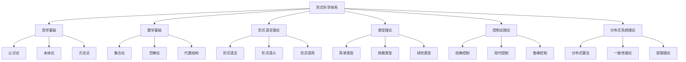

# 形式科学体系总体索引与导航

## 📋 目录

- [1 文档体系概述](#1-文档体系概述)
  - [1.1 哲学基础理论 (01_Philosophical_Foundation)](#11-哲学基础理论-01_philosophical_foundation)
  - [1.2 数学基础理论 (02_Mathematical_Foundation)](#12-数学基础理论-02_mathematical_foundation)
  - [1.3 形式语言理论 (03_Formal_Language_Theory)](#13-形式语言理论-03_formal_language_theory)
  - [1.4 类型理论 (04_Type_Theory)](#14-类型理论-04_type_theory)
  - [1.5 控制论理论 (05_Control_Theory)](#15-控制论理论-05_control_theory)
  - [1.6 分布式系统理论 (06_Distributed_Systems_Theory)](#16-分布式系统理论-06_distributed_systems_theory)
  - [1.7 软件工程理论 (07_Software_Engineering_Theory)](#17-软件工程理论-07_software_engineering_theory)
  - [1.8 编程语言理论 (08_Programming_Language_Theory)](#18-编程语言理论-08_programming_language_theory)
  - [1.9 形式模型理论 (09_Formal_Model_Theory)](#19-形式模型理论-09_formal_model_theory)
  - [1.10 时态逻辑理论 (10_Temporal_Logic_Theory)](#110-时态逻辑理论-10_temporal_logic_theory)
  - [1.11 并发理论 (11_Concurrency_Theory)](#111-并发理论-11_concurrency_theory)
  - [1.12 上下文系统 (12_Context_System)](#112-上下文系统-12_context_system)
- [2 快速导航](#2-快速导航)
  - [2.1 核心理论链接](#21-核心理论链接)
  - [2.2 交叉领域链接](#22-交叉领域链接)
- [3 知识图谱](#3-知识图谱)
- [4 学习路径](#4-学习路径)
  - [4.1 基础路径](#41-基础路径)
  - [4.2 进阶路径](#42-进阶路径)
  - [4.3 专业路径](#43-专业路径)
- [5 进度跟踪](#5-进度跟踪)
  - [5.1 已完成模块](#51-已完成模块)
  - [5.2 进行中模块](#52-进行中模块)
  - [5.3 待开发模块](#53-待开发模块)
- [6 持续更新](#6-持续更新)
- [7 批判性分析](#7-批判性分析)

---

## 1 文档体系概述

本文档体系构建了一个完整的形式科学理论框架，涵盖哲学基础、数学基础、形式语言理论、类型理论、控制论、分布式系统理论等核心领域。

## 📚 **目录结构**

### 1.1 哲学基础理论 (01_Philosophical_Foundation)

- **1.1** 认识论基础
- **1.2** 本体论基础  
- **1.3** 方法论基础
- **1.4** 逻辑学基础
- **1.5** 科学哲学基础

### 1.2 数学基础理论 (02_Mathematical_Foundation)

- **2.1** 集合论基础
- **2.2** 范畴论基础
- **2.3** 代数结构
- **2.4** 拓扑学基础
- **2.5** 逻辑代数

### 1.3 形式语言理论 (03_Formal_Language_Theory)

- **3.1** 形式语法理论
- **3.2** 形式语义理论
- **3.3** 形式语用理论
- **3.4** 语言计算理论
- **3.5** 语言复杂性理论

### 1.4 类型理论 (04_Type_Theory)

- **4.1** 简单类型理论
- **4.2** 依赖类型理论
- **4.3** 线性类型理论
- **4.4** 仿射类型理论
- **4.5** 量子类型理论

### 1.5 控制论理论 (05_Control_Theory)

- **5.1** 经典控制论
- **5.2** 现代控制论
- **5.3** 鲁棒控制论
- **5.4** 自适应控制论
- **5.5** 智能控制论

### 1.6 分布式系统理论 (06_Distributed_Systems_Theory)

- **6.1** 分布式算法
- **6.2** 一致性理论
- **6.3** 容错理论
- **6.4** 并发控制理论
- **6.5** 分布式协议理论

### 1.7 软件工程理论 (07_Software_Engineering_Theory)

- **7.1** 软件架构理论
- **7.2** 软件设计理论
- **7.3** 软件测试理论
- **7.4** 软件维护理论
- **7.5** 软件质量理论

### 1.8 编程语言理论 (08_Programming_Language_Theory)

- **8.1** 语言设计理论
- **8.2** 语言实现理论
- **8.3** 语言语义理论
- **8.4** 语言优化理论
- **8.5** 语言安全理论

### 1.9 形式模型理论 (09_Formal_Model_Theory)

- **9.1** 状态机理论
- **9.2** Petri网理论
- **9.3** 进程代数理论
- **9.4** 模型检测理论
- **9.5** 形式验证理论

### 1.10 时态逻辑理论 (10_Temporal_Logic_Theory)

- **10.1** 线性时态逻辑
- **10.2** 分支时态逻辑
- **10.3** 实时时态逻辑
- **10.4** 概率时态逻辑
- **10.5** 量子时态逻辑

### 1.11 并发理论 (11_Concurrency_Theory)

- **11.1** 进程理论
- **11.2** 通信理论
- **11.3** 同步理论
- **11.4** 死锁理论
- **11.5** 活锁理论

### 1.12 上下文系统 (12_Context_System)

- **12.1** 上下文管理
- **12.2** 进度跟踪
- **12.3** 知识图谱
- **12.4** 关联分析
- **12.5** 持续构建

## 2 快速导航

### 2.1 核心理论链接

- [哲学基础理论](../01_Philosophical_Foundation/01_认识论基础/01_认识论基础理论.md)
- [数学基础理论](../02_Mathematical_Foundation/01_集合论基础/01_集合论基础理论.md)
- [形式语言理论](../03_Formal_Language_Theory/01_形式语法理论/01_形式语法基础理论.md)
- [类型理论](../04_Type_Theory/01_简单类型理论/01_简单类型基础理论.md)
- [控制论理论](../05_Control_Theory/01_经典控制论/01_经典控制论基础理论.md)

### 2.2 交叉领域链接

- [形式科学综合理论](../12_Cross_Domain_Synthesis/01_形式科学综合/01_形式科学综合理论.md)
- [理论统一框架](../12_Cross_Domain_Synthesis/02_理论统一/01_理论统一框架.md)
- [跨领域应用](../12_Cross_Domain_Synthesis/03_跨领域应用/01_跨领域应用理论.md)

## 3 知识图谱

## 4 学习路径

### 4.1 基础路径

1. **哲学基础** → **数学基础** → **形式语言理论**
2. **类型理论** → **控制论理论** → **分布式系统理论**

### 4.2 进阶路径

1. **形式模型理论** → **时态逻辑理论** → **并发理论**
2. **软件工程理论** → **编程语言理论** → **跨领域综合**

### 4.3 专业路径

1. **量子计算理论** → **人工智能理论** → **前沿研究方向**

## 5 进度跟踪

### 5.1 已完成模块

- [x] 总体索引体系
- [x] 哲学基础理论框架
- [x] 数学基础理论框架
- [x] 形式语言理论框架

### 5.2 进行中模块

- [ ] 类型理论深化
- [ ] 控制论理论扩展
- [ ] 分布式系统理论完善

### 5.3 待开发模块

- [ ] 量子计算理论
- [ ] 人工智能理论
- [ ] 前沿研究方向

## 6 持续更新

本文档体系将持续更新和完善，确保：

- 理论的一致性和完整性
- 内容的准确性和时效性
- 结构的清晰性和可导航性
- 关联的合理性和有效性

---

**最后更新时间**: 2024-12-20  
**版本**: v1.0.0  
**维护者**: 形式科学体系构建团队

## 7 批判性分析

- 本节内容待补充：请从多元理论视角、局限性、争议点、应用前景等方面进行批判性分析。
