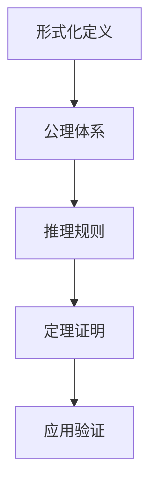
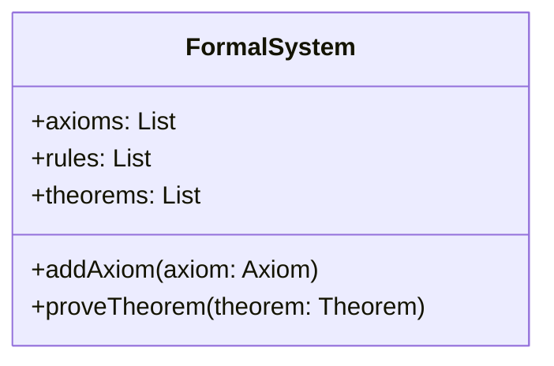

# Formal Science Refactor Project - Table of Contents / 形式科学重构项目 - 目录

## 📋 目录

- [1 Project Overview 项目概述](#1-project-overview-项目概述)
  - [1.1 Mission Statement 使命宣言](#11-mission-statement-使命宣言)
  - [1.2 Core Objectives 核心目标](#12-core-objectives-核心目标)
- [2 Formal Science Core Concepts 形式科学核心概念](#2-formal-science-core-concepts-形式科学核心概念)
  - [2.1 Definition 定义](#21-definition-定义)
  - [2.2 Core Characteristics 核心特征](#22-core-characteristics-核心特征)
  - [2.3 基础理论体系 Basic Theoretical System (01-15) - 深度构建 Deep Construction](#23-基础理论体系-basic-theoretical-system-01-15---深度构建-deep-construction)
    - [3.3.1 _Philosophical_Foundations - 哲学基础理论 Philosophical Foundation Theory](#331-_philosophical_foundations---哲学基础理论-philosophical-foundation-theory)
    - [3.3.2 _Mathematical_Foundations - 数学基础理论 Mathematical Foundation Theory](#332-_mathematical_foundations---数学基础理论-mathematical-foundation-theory)
    - [3.3.3 _Formal_Language_Theory - 形式语言理论 Formal Language Theory](#333-_formal_language_theory---形式语言理论-formal-language-theory)
    - [3.3.4 _Type_Theory - 类型理论 Type Theory](#334-_type_theory---类型理论-type-theory)
    - [3.3.5 _Formal_Model_Theory - 形式模型理论 Formal Model Theory](#335-_formal_model_theory---形式模型理论-formal-model-theory)
    - [3.3.6 _Logic_Theory - 逻辑理论 Logic Theory](#336-_logic_theory---逻辑理论-logic-theory)
    - [3.3.7 _Control_Theory - 控制论理论 Control Theory](#337-_control_theory---控制论理论-control-theory)
    - [3.3.8 _Programming_Language_Theory - 编程语言理论 Programming Language Theory](#338-_programming_language_theory---编程语言理论-programming-language-theory)
    - [3.3.9 _Software_Engineering_Theory - 软件工程理论 Software Engineering Theory](#339-_software_engineering_theory---软件工程理论-software-engineering-theory)
    - [3.3.10 _Computer_Architecture_Theory - 计算机架构理论 Computer Architecture Theory](#3310-_computer_architecture_theory---计算机架构理论-computer-architecture-theory)
    - [3.3.11 _Distributed_Systems_Theory - 分布式系统理论 Distributed Systems Theory](#3311-_distributed_systems_theory---分布式系统理论-distributed-systems-theory)
    - [3.3.12 _Computer_Network_Theory - 计算机网络理论 Computer Network Theory](#3312-_computer_network_theory---计算机网络理论-computer-network-theory)
    - [3.3.13 _Concurrency_Theory - 并发理论 Concurrency Theory](#3313-_concurrency_theory---并发理论-concurrency-theory)
    - [3.3.14 _Database_Theory - 数据库理论 Database Theory](#3314-_database_theory---数据库理论-database-theory)
    - [3.3.15 _Cross_Domain_Synthesis - 跨域综合理论 Cross-Domain Synthesis Theory](#3315-_cross_domain_synthesis---跨域综合理论-cross-domain-synthesis-theory)
  - [2.4 应用理论体系 Applied Theoretical System (16-25) - 广度扩展 Broad Extension](#24-应用理论体系-applied-theoretical-system-16-25---广度扩展-broad-extension)
    - [4.4.1 _Algorithm_Theory - 算法理论 Algorithm Theory](#441-_algorithm_theory---算法理论-algorithm-theory)
    - [4.4.2 _Data_Science_Theory - 数据科学理论 Data Science Theory](#442-_data_science_theory---数据科学理论-data-science-theory)
    - [4.4.3 _Information_Theory - 信息论 Information Theory](#443-_information_theory---信息论-information-theory)
    - [4.4.4 _Artificial_Intelligence_Theory - 人工智能理论 Artificial Intelligence Theory](#444-_artificial_intelligence_theory---人工智能理论-artificial-intelligence-theory)
    - [4.4.5 _Advanced_Computing_Theory - 先进计算理论 Advanced Computing Theory](#445-_advanced_computing_theory---先进计算理论-advanced-computing-theory)
  - [2.5 智能系统理论 Intelligent Systems Theory (21-30) - 智能化扩展 Intelligent Extension](#25-智能系统理论-intelligent-systems-theory-21-30---智能化扩展-intelligent-extension)
    - [5.5.1 _Intelligent_Systems_Theory - 智能系统理论 Intelligent Systems Theory](#551-_intelligent_systems_theory---智能系统理论-intelligent-systems-theory)
    - [5.5.2 _Intelligent_Computing_Theory - 智能计算理论 Intelligent Computing Theory](#552-_intelligent_computing_theory---智能计算理论-intelligent-computing-theory)
    - [5.5.3 _Intelligent_Applications_Theory - 智能应用理论 Intelligent Applications Theory](#553-_intelligent_applications_theory---智能应用理论-intelligent-applications-theory)
    - [5.5.4 _Intelligent_Technology_Theory - 智能技术理论 Intelligent Technology Theory](#554-_intelligent_technology_theory---智能技术理论-intelligent-technology-theory)
    - [5.5.5 _Intelligent_Engineering_Theory - 智能工程理论 Intelligent Engineering Theory](#555-_intelligent_engineering_theory---智能工程理论-intelligent-engineering-theory)
  - [2.6 智能运维理论 Intelligent Operations Theory (26-30) - 运维智能化 Operations Intelligence](#26-智能运维理论-intelligent-operations-theory-26-30---运维智能化-operations-intelligence)
    - [6.6.1 _Intelligent_Operations_Theory - 智能运维理论 Intelligent Operations Theory](#661-_intelligent_operations_theory---智能运维理论-intelligent-operations-theory)
    - [6.6.2 _Intelligent_Management_Theory - 智能管理理论 Intelligent Management Theory](#662-_intelligent_management_theory---智能管理理论-intelligent-management-theory)
    - [6.6.3 _Intelligent_Security_Theory - 智能安全理论 Intelligent Security Theory](#663-_intelligent_security_theory---智能安全理论-intelligent-security-theory)
    - [6.6.4 _Intelligent_Quality_Theory - 智能质量理论 Intelligent Quality Theory](#664-_intelligent_quality_theory---智能质量理论-intelligent-quality-theory)
    - [6.6.5 _Intelligent_Education_Theory - 智能教育理论 Intelligent Education Theory](#665-_intelligent_education_theory---智能教育理论-intelligent-education-theory)
  - [2.7 智能应用理论 Intelligent Applications Theory (31-40) - 应用智能化 Application Intelligence](#27-智能应用理论-intelligent-applications-theory-31-40---应用智能化-application-intelligence)
    - [7.7.1 _Intelligent_Agriculture_Theory - 智能农业理论 Intelligent Agriculture Theory](#771-_intelligent_agriculture_theory---智能农业理论-intelligent-agriculture-theory)
    - [7.7.2 _Intelligent_Service_Theory - 智能服务理论 Intelligent Service Theory](#772-_intelligent_service_theory---智能服务理论-intelligent-service-theory)
    - [7.7.3 _Intelligent_Communication_Theory - 智能通信理论 Intelligent Communication Theory](#773-_intelligent_communication_theory---智能通信理论-intelligent-communication-theory)
    - [7.7.4 _Intelligent_Perception_Theory - 智能感知理论 Intelligent Perception Theory](#774-_intelligent_perception_theory---智能感知理论-intelligent-perception-theory)
    - [7.7.5 _Intelligent_Learning_Theory - 智能学习理论 Intelligent Learning Theory](#775-_intelligent_learning_theory---智能学习理论-intelligent-learning-theory)
    - [7.7.6 _Intelligent_Interaction_Theory - 智能交互理论 Intelligent Interaction Theory](#776-_intelligent_interaction_theory---智能交互理论-intelligent-interaction-theory)
    - [7.7.7 _Intelligent_Decision_Theory - 智能决策理论 Intelligent Decision Theory](#777-_intelligent_decision_theory---智能决策理论-intelligent-decision-theory)
    - [7.7.8 _Intelligent_Cognition_Theory - 智能认知理论 Intelligent Cognition Theory](#778-_intelligent_cognition_theory---智能认知理论-intelligent-cognition-theory)
    - [7.7.9 _Intelligent_Creation_Theory - 智能创造理论 Intelligent Creation Theory](#779-_intelligent_creation_theory---智能创造理论-intelligent-creation-theory)
    - [7.7.10 _Intelligent_Evolution_Theory - 智能演化理论 Intelligent Evolution Theory](#7710-_intelligent_evolution_theory---智能演化理论-intelligent-evolution-theory)
  - [2.8 智能融合理论 Intelligent Integration Theory (41-50) - 融合智能化 Integration Intelligence](#28-智能融合理论-intelligent-integration-theory-41-50---融合智能化-integration-intelligence)
    - [8.8.1 _Intelligent_Integration_Theory - 智能融合理论 Intelligent Integration Theory](#881-_intelligent_integration_theory---智能融合理论-intelligent-integration-theory)
    - [8.8.2 _Intelligent_Synchronization_Theory - 智能同步理论 Intelligent Synchronization Theory](#882-_intelligent_synchronization_theory---智能同步理论-intelligent-synchronization-theory)
    - [8.8.3 _Intelligent_Adaptation_Theory - 智能适应理论 Intelligent Adaptation Theory](#883-_intelligent_adaptation_theory---智能适应理论-intelligent-adaptation-theory)
    - [8.8.4 _Intelligent_Optimization_Theory - 智能优化理论 Intelligent Optimization Theory](#884-_intelligent_optimization_theory---智能优化理论-intelligent-optimization-theory)
    - [8.8.5 _Intelligent_Innovation_Theory - 智能创新理论 Intelligent Innovation Theory](#885-_intelligent_innovation_theory---智能创新理论-intelligent-innovation-theory)
  - [2.9 智能统一理论 Intelligent Unification Theory (51-60) - 统一智能化 Unification Intelligence](#29-智能统一理论-intelligent-unification-theory-51-60---统一智能化-unification-intelligence)
    - [9.9.1 _Intelligent_Unification_Theory - 智能统一理论 Intelligent Unification Theory](#991-_intelligent_unification_theory---智能统一理论-intelligent-unification-theory)
    - [9.9.2 _Intelligent_Consistency_Theory - 智能一致性理论 Intelligent Consistency Theory](#992-_intelligent_consistency_theory---智能一致性理论-intelligent-consistency-theory)
    - [9.9.3 _Intelligent_Harmony_Theory - 智能和谐理论 Intelligent Harmony Theory](#993-_intelligent_harmony_theory---智能和谐理论-intelligent-harmony-theory)
    - [9.9.4 _Intelligent_Balance_Theory - 智能平衡理论 Intelligent Balance Theory](#994-_intelligent_balance_theory---智能平衡理论-intelligent-balance-theory)
    - [9.9.5 _Intelligent_Stability_Theory - 智能稳定性理论 Intelligent Stability Theory](#995-_intelligent_stability_theory---智能稳定性理论-intelligent-stability-theory)
  - [2.10 智能标准化理论 Intelligent Standardization Theory (61-70) - 标准化智能化 Standardization Intelligence](#210-智能标准化理论-intelligent-standardization-theory-61-70---标准化智能化-standardization-intelligence)
    - [10.10.1 _Intelligent_Standardization_Theory - 智能标准化理论 Intelligent Standardization Theory](#10101-_intelligent_standardization_theory---智能标准化理论-intelligent-standardization-theory)
    - [10.10.2 _Intelligent_Normalization_Theory - 智能规范化理论 Intelligent Normalization Theory](#10102-_intelligent_normalization_theory---智能规范化理论-intelligent-normalization-theory)
    - [10.10.3 _Intelligent_Specification_Theory - 智能规格化理论 Intelligent Specification Theory](#10103-_intelligent_specification_theory---智能规格化理论-intelligent-specification-theory)
    - [10.10.4 _Intelligent_Compatibility_Theory - 智能兼容性理论 Intelligent Compatibility Theory](#10104-_intelligent_compatibility_theory---智能兼容性理论-intelligent-compatibility-theory)
    - [10.10.5 _Intelligent_Coordination_Theory - 智能协调理论 Intelligent Coordination Theory](#10105-_intelligent_coordination_theory---智能协调理论-intelligent-coordination-theory)
  - [2.11 智能可靠性理论 Intelligent Reliability Theory (71-80) - 可靠性智能化 Reliability Intelligence](#211-智能可靠性理论-intelligent-reliability-theory-71-80---可靠性智能化-reliability-intelligence)
    - [11.11.1 _Intelligent_Reliability_Theory - 智能可靠性理论 Intelligent Reliability Theory](#11111-_intelligent_reliability_theory---智能可靠性理论-intelligent-reliability-theory)
    - [11.11.2 _Intelligent_Persistence_Theory - 智能持久性理论 Intelligent Persistence Theory](#11112-_intelligent_persistence_theory---智能持久性理论-intelligent-persistence-theory)
    - [11.11.3 _Intelligent_Compatibility_Theory - 智能兼容性理论 Intelligent Compatibility Theory](#11113-_intelligent_compatibility_theory---智能兼容性理论-intelligent-compatibility-theory)
    - [11.11.4 _Intelligent_Consistency_Theory - 智能一致性理论 Intelligent Consistency Theory](#11114-_intelligent_consistency_theory---智能一致性理论-intelligent-consistency-theory)
    - [11.11.5 _Intelligent_Coordination_Theory - 智能协调理论 Intelligent Coordination Theory](#11115-_intelligent_coordination_theory---智能协调理论-intelligent-coordination-theory)
  - [2.12 智能安全理论 Intelligent Security Theory (81-90) - 安全智能化 Security Intelligence](#212-智能安全理论-intelligent-security-theory-81-90---安全智能化-security-intelligence)
    - [12.12.1 _Intelligent_Security_Theory - 智能安全理论 Intelligent Security Theory](#12121-_intelligent_security_theory---智能安全理论-intelligent-security-theory)
    - [12.12.2 _Intelligent_Protection_Theory - 智能保护理论 Intelligent Protection Theory](#12122-_intelligent_protection_theory---智能保护理论-intelligent-protection-theory)
    - [12.12.3 _Intelligent_Defense_Theory - 智能防护理论 Intelligent Defense Theory](#12123-_intelligent_defense_theory---智能防护理论-intelligent-defense-theory)
    - [12.12.4 _Intelligent_Encryption_Theory - 智能加密理论 Intelligent Encryption Theory](#12124-_intelligent_encryption_theory---智能加密理论-intelligent-encryption-theory)
    - [12.12.5 _Intelligent_Authentication_Theory - 智能认证理论 Intelligent Authentication Theory](#12125-_intelligent_authentication_theory---智能认证理论-intelligent-authentication-theory)
  - [2.13 元数据与工具 Metadata and Tools (Meta)](#213-元数据与工具-metadata-and-tools-meta)
    - [13.13.1 Meta - 系统化知识点与批判性分析 Systematic Knowledge Points and Critical Analysis](#13131-meta---系统化知识点与批判性分析-systematic-knowledge-points-and-critical-analysis)
  - [2.14 索引与导航 Index and Navigation (Index)](#214-索引与导航-index-and-navigation-index)
    - [14.14.1 _Primary_System - 主系统架构 Primary System Architecture](#14141-_primary_system---主系统架构-primary-system-architecture)
- [3 Content Standards 内容标准](#3-content-standards-内容标准)
  - [3.1 理论文档标准 Theoretical Document Standards](#31-理论文档标准-theoretical-document-standards)
  - [3.2 批判性分析标准 Critical Analysis Standards](#32-批判性分析标准-critical-analysis-standards)
  - [3.3 多维度表征标准 Multi-dimensional Representation Standards](#33-多维度表征标准-multi-dimensional-representation-standards)
    - [3.3.1 数学公式 Mathematical Formulas](#331-数学公式-mathematical-formulas)
    - [3.3.2 代码示例 Code Examples](#332-代码示例-code-examples)
    - [3.3.3 图表 Diagrams](#333-图表-diagrams)
- [4 流程图 Flowchart](#4-流程图-flowchart)
- [5 类图 Class Diagram](#5-类图-class-diagram)
- [6 Progress Tracking 进度跟踪](#6-progress-tracking-进度跟踪)
  - [6.1 Completed 已完成](#61-completed-已完成)
  - [6.2 In Progress 进行中](#62-in-progress-进行中)
  - [6.3 To Complete 待完成](#63-to-complete-待完成)

---

## 1 Project Overview 项目概述

### 1.1 Mission Statement 使命宣言

构建一个**完整、系统、深度**的形式科学知识体系，通过**批判性分析、工程论证、多维度扩展**，建立面向未来的形式科学理论框架。

Building a **complete, systematic, and in-depth** formal science knowledge system through **critical analysis, engineering argumentation, and multi-dimensional expansion** to establish a future-oriented formal science theoretical framework.

### 1.2 Core Objectives 核心目标

1. **深度理论构建** / **Deep Theoretical Construction**: 从基础到前沿，构建完整的理论体系
   From foundations to frontiers, building a complete theoretical system

2. **广度应用扩展** / **Broad Application Extension**: 覆盖所有相关领域和应用场景
   Covering all related fields and application scenarios

3. **批判性分析** / **Critical Analysis**: 对每个理论进行深度批判和反思
   Deep criticism and reflection on each theory

4. **工程化论证** / **Engineering Argumentation**: 确保理论的可实现性和实用性
   Ensuring theoretical feasibility and practicality

5. **多维度表征** / **Multi-dimensional Representation**: 数学、代码、图表、案例等多重表达
   Multiple expressions through mathematics, code, diagrams, cases, etc.

## 2 Formal Science Core Concepts 形式科学核心概念

### 2.1 Definition 定义

**形式科学** / **Formal Science** 是研究抽象结构和逻辑关系的科学，包括数学、逻辑学、理论计算机科学等学科。形式科学不依赖于经验观察，而是通过逻辑推理和形式化方法来建立知识体系。

**Formal Science** is the study of abstract structures and logical relationships, including mathematics, logic, theoretical computer science, and other disciplines. Formal science does not rely on empirical observation but establishes knowledge systems through logical reasoning and formalization methods.

### 2.2 Core Characteristics 核心特征

1. **抽象性** / **Abstraction**: 研究抽象概念和结构
   Studying abstract concepts and structures

2. **逻辑性** / **Logicality**: 基于逻辑推理和证明
   Based on logical reasoning and proof

3. **形式化** / **Formalization**: 使用精确的符号和规则
   Using precise symbols and rules

4. **普遍性** / **Universality**: 具有普遍适用性
   Having universal applicability

5. **系统性** / **Systematicity**: 构建系统化的知识体系
   Building systematic knowledge systems

## Directory Structure / 目录结构

### 2.3 基础理论体系 Basic Theoretical System (01-15) - 深度构建 Deep Construction

#### 3.3.1 _Philosophical_Foundations - 哲学基础理论 Philosophical Foundation Theory

- 科学哲学、数学哲学、逻辑哲学、认知哲学
- Scientific Philosophy, Mathematical Philosophy, Logical Philosophy, Cognitive Philosophy
- 形式化思维、抽象化方法、公理化体系
- Formalized Thinking, Abstraction Methods, Axiomatic Systems

#### 3.3.2 _Mathematical_Foundations - 数学基础理论 Mathematical Foundation Theory

- 集合论、代数、分析、几何、拓扑
- Set Theory, Algebra, Analysis, Geometry, Topology
- 范畴论、同调代数、代数几何
- Category Theory, Homological Algebra, Algebraic Geometry

#### 3.3.3 _Formal_Language_Theory - 形式语言理论 Formal Language Theory

- 自动机理论、语法理论、语义理论
- Automata Theory, Grammar Theory, Semantics Theory
- 语言层次、计算复杂性、形式文法
- Language Hierarchy, Computational Complexity, Formal Grammars

#### 3.3.4 _Type_Theory - 类型理论 Type Theory

- 简单类型论、依赖类型论、线性类型论
- Simple Type Theory, Dependent Type Theory, Linear Type Theory
- 同伦类型论、Curry-Howard对应
- Homotopy Type Theory, Curry-Howard Correspondence

#### 3.3.5 _Formal_Model_Theory - 形式模型理论 Formal Model Theory

- 状态机、Petri网、进程代数
- State Machines, Petri Nets, Process Algebra
- 模型检查、形式验证、模型驱动
- Model Checking, Formal Verification, Model-Driven

#### 3.3.6 _Logic_Theory - 逻辑理论 Logic Theory

- 命题逻辑、谓词逻辑、模态逻辑
- Propositional Logic, Predicate Logic, Modal Logic
- 时态逻辑、直觉逻辑、模糊逻辑
- Temporal Logic, Intuitionistic Logic, Fuzzy Logic

#### 3.3.7 _Control_Theory - 控制论理论 Control Theory

- 线性控制、非线性控制、自适应控制
- Linear Control, Nonlinear Control, Adaptive Control
- 鲁棒控制、最优控制、智能控制
- Robust Control, Optimal Control, Intelligent Control

#### 3.3.8 _Programming_Language_Theory - 编程语言理论 Programming Language Theory

- 语言设计、类型系统、语义理论
- Language Design, Type Systems, Semantics Theory
- 编译原理、运行时系统、语言实现
- Compiler Principles, Runtime Systems, Language Implementation

#### 3.3.9 _Software_Engineering_Theory - 软件工程理论 Software Engineering Theory

- 形式方法、软件架构、质量保证
- Formal Methods, Software Architecture, Quality Assurance
- 开发方法论、项目管理、维护演化
- Development Methodologies, Project Management, Maintenance Evolution

#### 3.3.10 _Computer_Architecture_Theory - 计算机架构理论 Computer Architecture Theory

- 处理器设计、存储系统、并行计算
- Processor Design, Memory Systems, Parallel Computing
- 性能优化、能耗管理、可靠性设计
- Performance Optimization, Power Management, Reliability Design

#### 3.3.11 _Distributed_Systems_Theory - 分布式系统理论 Distributed Systems Theory

- 一致性理论、容错机制、共识算法
- Consistency Theory, Fault Tolerance, Consensus Algorithms
- 分布式计算、网络协议、系统协调
- Distributed Computing, Network Protocols, System Coordination

#### 3.3.12 _Computer_Network_Theory - 计算机网络理论 Computer Network Theory

- 网络协议、路由算法、网络安全
- Network Protocols, Routing Algorithms, Network Security
- 网络性能、QoS保证、网络管理
- Network Performance, QoS Guarantees, Network Management

#### 3.3.13 _Concurrency_Theory - 并发理论 Concurrency Theory

- 并发模型、同步机制、死锁避免
- Concurrency Models, Synchronization Mechanisms, Deadlock Avoidance
- 并发控制、并行算法、分布式并发
- Concurrency Control, Parallel Algorithms, Distributed Concurrency

#### 3.3.14 _Database_Theory - 数据库理论 Database Theory

- 数据模型、查询语言、事务处理
- Data Models, Query Languages, Transaction Processing
- 数据一致性、性能优化、分布式数据库
- Data Consistency, Performance Optimization, Distributed Databases

#### 3.3.15 _Cross_Domain_Synthesis - 跨域综合理论 Cross-Domain Synthesis Theory

- 理论融合、方法整合、应用交叉
- Theoretical Integration, Method Integration, Application Cross-fertilization
- 新兴领域、前沿技术、未来方向
- Emerging Fields, Frontier Technologies, Future Directions

### 2.4 应用理论体系 Applied Theoretical System (16-25) - 广度扩展 Broad Extension

#### 4.4.1 _Algorithm_Theory - 算法理论 Algorithm Theory

- 算法设计、复杂度分析、优化算法
- Algorithm Design, Complexity Analysis, Optimization Algorithms
- 机器学习算法、量子算法、生物算法
- Machine Learning Algorithms, Quantum Algorithms, Biological Algorithms

#### 4.4.2 _Data_Science_Theory - 数据科学理论 Data Science Theory

- 数据挖掘、统计分析、预测建模
- Data Mining, Statistical Analysis, Predictive Modeling
- 大数据处理、数据可视化、数据治理
- Big Data Processing, Data Visualization, Data Governance

#### 4.4.3 _Information_Theory - 信息论 Information Theory

- 信息度量、编码理论、信道容量
- Information Measures, Coding Theory, Channel Capacity
- 压缩算法、加密理论、信息熵
- Compression Algorithms, Encryption Theory, Information Entropy

#### 4.4.4 _Artificial_Intelligence_Theory - 人工智能理论 Artificial Intelligence Theory

- 机器学习、深度学习、知识表示
- Machine Learning, Deep Learning, Knowledge Representation
- 自然语言处理、计算机视觉、智能推理
- Natural Language Processing, Computer Vision, Intelligent Reasoning

#### 4.4.5 _Advanced_Computing_Theory - 先进计算理论 Advanced Computing Theory

- 量子计算、生物计算、神经计算
- Quantum Computing, Biological Computing, Neural Computing
- 边缘计算、云计算、高性能计算
- Edge Computing, Cloud Computing, High-Performance Computing

### 2.5 智能系统理论 Intelligent Systems Theory (21-30) - 智能化扩展 Intelligent Extension

#### 5.5.1 _Intelligent_Systems_Theory - 智能系统理论 Intelligent Systems Theory

- 智能系统设计、智能系统架构、智能系统优化
- Intelligent System Design, Intelligent System Architecture, Intelligent System Optimization

#### 5.5.2 _Intelligent_Computing_Theory - 智能计算理论 Intelligent Computing Theory

- 智能计算模型、智能算法、智能计算架构
- Intelligent Computing Models, Intelligent Algorithms, Intelligent Computing Architecture

#### 5.5.3 _Intelligent_Applications_Theory - 智能应用理论 Intelligent Applications Theory

- 智能应用设计、智能应用架构、智能应用优化
- Intelligent Application Design, Intelligent Application Architecture, Intelligent Application Optimization

#### 5.5.4 _Intelligent_Technology_Theory - 智能技术理论 Intelligent Technology Theory

- 智能技术方法、智能技术工具、智能技术标准
- Intelligent Technology Methods, Intelligent Technology Tools, Intelligent Technology Standards

#### 5.5.5 _Intelligent_Engineering_Theory - 智能工程理论 Intelligent Engineering Theory

- 智能工程设计、智能工程方法、智能工程实践
- Intelligent Engineering Design, Intelligent Engineering Methods, Intelligent Engineering Practice

### 2.6 智能运维理论 Intelligent Operations Theory (26-30) - 运维智能化 Operations Intelligence

#### 6.6.1 _Intelligent_Operations_Theory - 智能运维理论 Intelligent Operations Theory

- 智能运维方法、智能运维工具、智能运维平台
- Intelligent Operations Methods, Intelligent Operations Tools, Intelligent Operations Platforms

#### 6.6.2 _Intelligent_Management_Theory - 智能管理理论 Intelligent Management Theory

- 智能管理方法、智能管理工具、智能管理平台
- Intelligent Management Methods, Intelligent Management Tools, Intelligent Management Platforms

#### 6.6.3 _Intelligent_Security_Theory - 智能安全理论 Intelligent Security Theory

- 智能安全方法、智能安全工具、智能安全平台
- Intelligent Security Methods, Intelligent Security Tools, Intelligent Security Platforms

#### 6.6.4 _Intelligent_Quality_Theory - 智能质量理论 Intelligent Quality Theory

- 智能质量方法、智能质量工具、智能质量平台
- Intelligent Quality Methods, Intelligent Quality Tools, Intelligent Quality Platforms

#### 6.6.5 _Intelligent_Education_Theory - 智能教育理论 Intelligent Education Theory

- 智能教育方法、智能教育工具、智能教育平台
- Intelligent Education Methods, Intelligent Education Tools, Intelligent Education Platforms

### 2.7 智能应用理论 Intelligent Applications Theory (31-40) - 应用智能化 Application Intelligence

#### 7.7.1 _Intelligent_Agriculture_Theory - 智能农业理论 Intelligent Agriculture Theory

#### 7.7.2 _Intelligent_Service_Theory - 智能服务理论 Intelligent Service Theory

#### 7.7.3 _Intelligent_Communication_Theory - 智能通信理论 Intelligent Communication Theory

#### 7.7.4 _Intelligent_Perception_Theory - 智能感知理论 Intelligent Perception Theory

#### 7.7.5 _Intelligent_Learning_Theory - 智能学习理论 Intelligent Learning Theory

#### 7.7.6 _Intelligent_Interaction_Theory - 智能交互理论 Intelligent Interaction Theory

#### 7.7.7 _Intelligent_Decision_Theory - 智能决策理论 Intelligent Decision Theory

#### 7.7.8 _Intelligent_Cognition_Theory - 智能认知理论 Intelligent Cognition Theory

#### 7.7.9 _Intelligent_Creation_Theory - 智能创造理论 Intelligent Creation Theory

#### 7.7.10 _Intelligent_Evolution_Theory - 智能演化理论 Intelligent Evolution Theory

### 2.8 智能融合理论 Intelligent Integration Theory (41-50) - 融合智能化 Integration Intelligence

#### 8.8.1 _Intelligent_Integration_Theory - 智能融合理论 Intelligent Integration Theory

#### 8.8.2 _Intelligent_Synchronization_Theory - 智能同步理论 Intelligent Synchronization Theory

#### 8.8.3 _Intelligent_Adaptation_Theory - 智能适应理论 Intelligent Adaptation Theory

#### 8.8.4 _Intelligent_Optimization_Theory - 智能优化理论 Intelligent Optimization Theory

#### 8.8.5 _Intelligent_Innovation_Theory - 智能创新理论 Intelligent Innovation Theory

### 2.9 智能统一理论 Intelligent Unification Theory (51-60) - 统一智能化 Unification Intelligence

#### 9.9.1 _Intelligent_Unification_Theory - 智能统一理论 Intelligent Unification Theory

#### 9.9.2 _Intelligent_Consistency_Theory - 智能一致性理论 Intelligent Consistency Theory

#### 9.9.3 _Intelligent_Harmony_Theory - 智能和谐理论 Intelligent Harmony Theory

#### 9.9.4 _Intelligent_Balance_Theory - 智能平衡理论 Intelligent Balance Theory

#### 9.9.5 _Intelligent_Stability_Theory - 智能稳定性理论 Intelligent Stability Theory

### 2.10 智能标准化理论 Intelligent Standardization Theory (61-70) - 标准化智能化 Standardization Intelligence

#### 10.10.1 _Intelligent_Standardization_Theory - 智能标准化理论 Intelligent Standardization Theory

#### 10.10.2 _Intelligent_Normalization_Theory - 智能规范化理论 Intelligent Normalization Theory

#### 10.10.3 _Intelligent_Specification_Theory - 智能规格化理论 Intelligent Specification Theory

#### 10.10.4 _Intelligent_Compatibility_Theory - 智能兼容性理论 Intelligent Compatibility Theory

#### 10.10.5 _Intelligent_Coordination_Theory - 智能协调理论 Intelligent Coordination Theory

### 2.11 智能可靠性理论 Intelligent Reliability Theory (71-80) - 可靠性智能化 Reliability Intelligence

#### 11.11.1 _Intelligent_Reliability_Theory - 智能可靠性理论 Intelligent Reliability Theory

#### 11.11.2 _Intelligent_Persistence_Theory - 智能持久性理论 Intelligent Persistence Theory

#### 11.11.3 _Intelligent_Compatibility_Theory - 智能兼容性理论 Intelligent Compatibility Theory

#### 11.11.4 _Intelligent_Consistency_Theory - 智能一致性理论 Intelligent Consistency Theory

#### 11.11.5 _Intelligent_Coordination_Theory - 智能协调理论 Intelligent Coordination Theory

### 2.12 智能安全理论 Intelligent Security Theory (81-90) - 安全智能化 Security Intelligence

#### 12.12.1 _Intelligent_Security_Theory - 智能安全理论 Intelligent Security Theory

#### 12.12.2 _Intelligent_Protection_Theory - 智能保护理论 Intelligent Protection Theory

#### 12.12.3 _Intelligent_Defense_Theory - 智能防护理论 Intelligent Defense Theory

#### 12.12.4 _Intelligent_Encryption_Theory - 智能加密理论 Intelligent Encryption Theory

#### 12.12.5 _Intelligent_Authentication_Theory - 智能认证理论 Intelligent Authentication Theory

### 2.13 元数据与工具 Metadata and Tools (Meta)

#### 13.13.1 Meta - 系统化知识点与批判性分析 Systematic Knowledge Points and Critical Analysis

- 每个理论分支的深度批判性分析
- Deep critical analysis of each theoretical branch
- 工程论证、应用案例、未来展望
- Engineering argumentation, application cases, future prospects

### 2.14 索引与导航 Index and Navigation (Index)

#### 00_Master_Index/ - 主索引 / Master Index

#### 14.14.1 _Primary_System - 主系统架构 Primary System Architecture

## 3 Content Standards 内容标准

### 3.1 理论文档标准 Theoretical Document Standards

每个理论文档应包含：
Each theoretical document should include:

- **理论概述** / **Theory Overview**: 历史发展、核心思想、理论基础
  Historical development, core ideas, theoretical foundation
- **数学基础** / **Mathematical Foundations**: 形式化定义、公理体系、定理证明
  Formal definitions, axiomatic systems, theorems and proofs
- **核心概念** / **Core Concepts**: 基本概念、关键原理、重要性质
  Basic concepts, key principles, important properties
- **应用领域** / **Applications**: 工程应用、科学应用、实际案例
  Engineering applications, scientific applications, real-world cases
- **前沿发展** / **Frontiers**: 最新进展、开放问题、未来方向
  Latest developments, open problems, future directions
- **批判性分析** / **Critical Analysis**: 理论局限、实践挑战、改进方向
  Theoretical limitations, practical challenges, improvement directions

### 3.2 批判性分析标准 Critical Analysis Standards

每个批判性分析文档应包含：
Each critical analysis document should include:

- **知识点梳理** / **Knowledge Point Overview**: 理论定义、核心分支、关键概念
  Theory definition, core branches, key concepts
- **主流观点分析** / **Analysis of Mainstream Views**: 理论优势、实践局限、争议焦点
  Theoretical advantages, practical limitations, controversial points
- **学科交叉与融合** / **Interdisciplinary Integration**: 相关学科、交叉点分析、融合方向
  Related disciplines, cross-disciplinary analysis, integration directions
- **工程论证与应用案例** / **Engineering Argumentation & Application Cases**: 工程可实现性、可扩展性分析、可维护性评估、最佳实践对比、工程案例
  Engineering feasibility, scalability analysis, maintainability assessment, best practice comparison, engineering cases
- **创新性批判与未来展望** / **Innovative Critique & Future Prospects**: 创新方向、技术突破、未来展望
  Innovation directions, technological breakthroughs, future prospects

### 3.3 多维度表征标准 Multi-dimensional Representation Standards

#### 3.3.1 数学公式 Mathematical Formulas

```markdown
# 行内公式 / Inline Formula
$f(x) = \int_{-\infty}^{\infty} e^{-x^2} dx$

# 块级公式 / Block Formula
$$
\begin{align}
\nabla \cdot \vec{E} &= \frac{\rho}{\epsilon_0} \\
\nabla \cdot \vec{B} &= 0 \\
\nabla \times \vec{E} &= -\frac{\partial \vec{B}}{\partial t} \\
\nabla \times \vec{B} &= \mu_0\vec{J} + \mu_0\epsilon_0\frac{\partial \vec{E}}{\partial t}
\end{align}
$$
```

#### 3.3.2 代码示例 Code Examples

```rust
// Rust代码示例 / Rust Code Example
#[derive(Debug, Clone, PartialEq)]
pub struct FormalSystem {
    axioms: Vec<Axiom>,
    rules: Vec<InferenceRule>,
    theorems: Vec<Theorem>,
}

impl FormalSystem {
    pub fn new() -> Self {
        Self {
            axioms: Vec::new(),
            rules: Vec::new(),
            theorems: Vec::new(),
        }
    }
    
    pub fn add_axiom(&mut self, axiom: Axiom) {
        self.axioms.push(axiom);
    }
    
    pub fn prove_theorem(&self, theorem: &Theorem) -> Result<Proof, ProofError> {
        // 形式化证明实现 / Formal proof implementation
        unimplemented!()
    }
}
```

#### 3.3.3 图表 Diagrams

```markdown
## 4 流程图 Flowchart


## 5 类图 Class Diagram



```

## 6 Progress Tracking 进度跟踪

### 6.1 Completed 已完成

- [x] 目录结构重新设计 / Directory structure redesign
- [x] 318个批判性分析文档 / 318 critical analysis documents
- [x] 基础理论体系框架 / Basic theoretical system framework
- [x] 智能系统理论扩展 / Intelligent systems theory extension
- [x] 形式科学核心概念定义 / Formal science core concept definition

### 6.2 In Progress 进行中

- [ ] 理论文档深度重构 / Deep restructuring of theoretical documents
- [ ] 数学公式标准化 / Mathematical formula standardization
- [ ] 代码示例完善 / Code example completion
- [ ] 交叉引用修复 / Cross-reference fixing

### 6.3 To Complete 待完成

- [ ] 完整索引系统 / Complete indexing system
- [ ] 自动化工具链 / Automated toolchain
- [ ] 质量检查系统 / Quality checking system
- [ ] 持续集成流程 / Continuous integration process

---

**Last Updated** / **最后更新**: 2025-01-17  
**Version** / **版本**: v4.0 - 形式科学标准化版 / Formal Science Standardization Edition  
**Maintainer** / **维护者**: FormalScience Team  
**Goal** / **目标**: 构建完整、系统、深度的形式科学知识体系 / Building a complete, systematic, and in-depth formal science knowledge system
