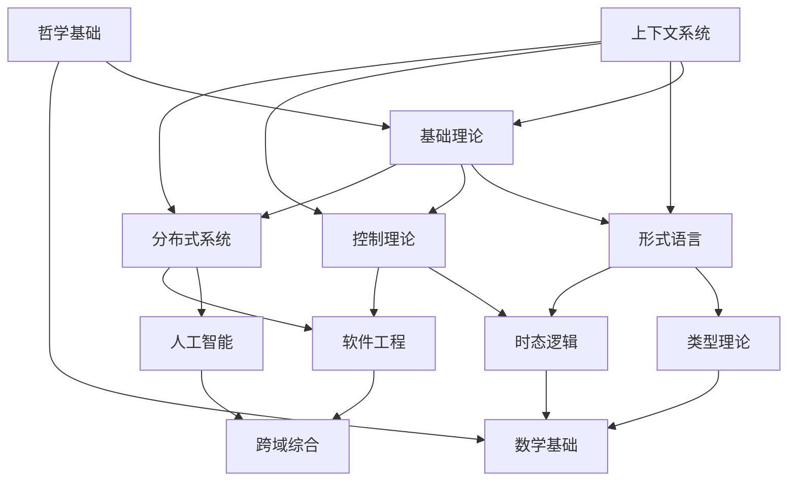

# 形式科学体系总索引 v6.0

## 📋 目录

- [1 体系概述](#1-体系概述)
  - [1.1 目标与范围](#11-目标与范围)
  - [1.2 体系特色](#12-体系特色)
  - [1.3 基础理论 (01_Foundational_Theory)](#13-基础理论-01_foundational_theory)
  - [1.4 形式语言 (02_Formal_Language)](#14-形式语言-02_formal_language)
  - [1.5 控制理论 (03_Control_Theory)](#15-控制理论-03_control_theory)
  - [1.6 分布式系统 (04_Distributed_Systems)](#16-分布式系统-04_distributed_systems)
  - [1.7 哲学基础 (05_Philosophical_Foundation)](#17-哲学基础-05_philosophical_foundation)
  - [1.8 时态逻辑 (06_Temporal_Logic)](#18-时态逻辑-06_temporal_logic)
  - [1.9 类型理论 (07_Type_Theory)](#19-类型理论-07_type_theory)
  - [1.10 数学基础 (08_Mathematics)](#110-数学基础-08_mathematics)
  - [1.11 软件工程 (09_Software_Engineering)](#111-软件工程-09_software_engineering)
  - [1.12 人工智能 (10_AI_Computing)](#112-人工智能-10_ai_computing)
  - [1.13 跨域综合 (11_Cross_Domain_Synthesis)](#113-跨域综合-11_cross_domain_synthesis)
  - [1.14 上下文系统 (12_Context_System)](#114-上下文系统-12_context_system)
- [2 知识关联图](#2-知识关联图)
- [3 形式化规范](#3-形式化规范)
  - [3.1 数学符号约定](#31-数学符号约定)
  - [3.2 文档结构规范](#32-文档结构规范)
- [4 引言](#4-引言)
  - [4.1 背景](#41-背景)
  - [4.2 目标](#42-目标)
  - [4.3 贡献](#43-贡献)
- [5 理论基础](#5-理论基础)
  - [5.1 基本概念](#51-基本概念)
  - [5.2 公理系统](#52-公理系统)
  - [5.3 形式化定义](#53-形式化定义)
- [6 主要结果](#6-主要结果)
  - [6.1 定理陈述](#61-定理陈述)
  - [6.2 证明过程](#62-证明过程)
  - [6.3 推论](#63-推论)
- [7 应用与扩展](#7-应用与扩展)
  - [7.1 应用领域](#71-应用领域)
  - [7.2 扩展方向](#72-扩展方向)
  - [7.3 未来工作](#73-未来工作)
  - [7.4 引用规范](#74-引用规范)
- [8 导航系统](#8-导航系统)
  - [8.1 主题导航](#81-主题导航)
  - [8.2 快速索引](#82-快速索引)
- [9 质量保证](#9-质量保证)
  - [9.1 内容一致性](#91-内容一致性)
  - [9.2 逻辑完整性](#92-逻辑完整性)
  - [9.3 引用完整性](#93-引用完整性)
- [10 持续更新](#10-持续更新)
  - [10.1 版本控制](#101-版本控制)
  - [10.2 更新机制](#102-更新机制)
- [11 批判性分析](#11-批判性分析)

---

## 1 体系概述

### 1.1 目标与范围

本体系致力于构建一个完整的形式科学知识库，涵盖：

- **理论基础**：数学、逻辑、哲学基础
- **形式化方法**：类型理论、形式语言、证明系统
- **系统理论**：控制论、分布式系统、并发理论
- **应用领域**：软件工程、人工智能、系统设计

### 1.2 体系特色

- **形式化规范**：严格的数学符号和证明格式
- **多表征方式**：图表、数学符号、形式化证明
- **树形结构**：严格的序号体系和目录组织
- **本地跳转**：文件间相互引用和导航
- **学术标准**：符合数学和哲学学术规范

## 2. 核心主题目录

### 1.3 基础理论 (01_Foundational_Theory)

- [01.1 形式化基础](01_Foundational_Theory/01.1_Formal_Foundations.md)
- [01.2 逻辑系统](01_Foundational_Theory/01.2_Logical_Systems.md)
- [01.3 公理化体系](01_Foundational_Theory/01.3_Axiomatic_Systems.md)
- [01.4 数学基础](01_Foundational_Theory/01.4_Mathematical_Foundations.md)

### 1.4 形式语言 (02_Formal_Language)

- [02.1 语法理论](02_Formal_Language/02.1_Syntax_Theory.md)
- [02.2 语义理论](02_Formal_Language/02.2_Semantics_Theory.md)
- [02.3 类型系统](02_Formal_Language/02.3_Type_Systems.md)
- [02.4 自动机理论](02_Formal_Language/02.4_Automata_Theory.md)

### 1.5 控制理论 (03_Control_Theory)

- [03.1 线性控制](03_Control_Theory/03.1_Linear_Control.md)
- [03.2 非线性控制](03_Control_Theory/03.2_Nonlinear_Control.md)
- [03.3 时态逻辑控制](03_Control_Theory/03.3_Temporal_Logic_Control.md)
- [03.4 最优控制](03_Control_Theory/03.4_Optimal_Control.md)

### 1.6 分布式系统 (04_Distributed_Systems)

- [04.1 共识算法](04_Distributed_Systems/04.1_Consensus_Algorithms.md)
- [04.2 并发理论](04_Distributed_Systems/04.2_Concurrency_Theory.md)
- [04.3 系统协调](04_Distributed_Systems/04.3_System_Coordination.md)
- [04.4 容错机制](04_Distributed_Systems/04.4_Fault_Tolerance.md)

### 1.7 哲学基础 (05_Philosophical_Foundation)

- [05.1 认识论](05_Philosophical_Foundation/05.1_Epistemology.md)
- [05.2 本体论](05_Philosophical_Foundation/05.2_Ontology.md)
- [05.3 方法论](05_Philosophical_Foundation/05.3_Methodology.md)
- [05.4 科学哲学](05_Philosophical_Foundation/05.4_Philosophy_of_Science.md)

### 1.8 时态逻辑 (06_Temporal_Logic)

- [06.1 线性时态逻辑](06_Temporal_Logic/06.1_Linear_Temporal_Logic.md)
- [06.2 分支时态逻辑](06_Temporal_Logic/06.2_Branching_Temporal_Logic.md)
- [06.3 时态类型理论](06_Temporal_Logic/06.3_Temporal_Type_Theory.md)
- [06.4 实时逻辑](06_Temporal_Logic/06.4_Real_Time_Logic.md)

### 1.9 类型理论 (07_Type_Theory)

- [07.1 线性类型](07_Type_Theory/07.1_Linear_Types.md)
- [07.2 仿射类型](07_Type_Theory/07.2_Affine_Types.md)
- [07.3 依赖类型](07_Type_Theory/07.3_Dependent_Types.md)
- [07.4 高阶类型](07_Type_Theory/07.4_Higher_Order_Types.md)

### 1.10 数学基础 (08_Mathematics)

- [08.1 集合论](08_Mathematics/08.1_Set_Theory.md)
- [08.2 范畴论](08_Mathematics/08.2_Category_Theory.md)
- [08.3 代数结构](08_Mathematics/08.3_Algebraic_Structures.md)
- [08.4 拓扑学](08_Mathematics/08.4_Topology.md)

### 1.11 软件工程 (09_Software_Engineering)

- [09.1 形式化方法](09_Software_Engineering/09.1_Formal_Methods.md)
- [09.2 程序验证](09_Software_Engineering/09.2_Program_Verification.md)
- [09.3 系统设计](09_Software_Engineering/09.3_System_Design.md)
- [09.4 软件架构](09_Software_Engineering/09.4_Software_Architecture.md)

### 1.12 人工智能 (10_AI_Computing)

- [10.1 机器学习](10_AI_Computing/10.1_Machine_Learning.md)
- [10.2 知识表示](10_AI_Computing/10.2_Knowledge_Representation.md)
- [10.3 推理系统](10_AI_Computing/10.3_Reasoning_Systems.md)
- [10.4 形式化AI](10_AI_Computing/10.4_Formal_AI.md)

### 1.13 跨域综合 (11_Cross_Domain_Synthesis)

- [11.1 理论融合](11_Cross_Domain_Synthesis/11.1_Theory_Integration.md)
- [11.2 方法整合](11_Cross_Domain_Synthesis/11.2_Method_Integration.md)
- [11.3 应用拓展](11_Cross_Domain_Synthesis/11.3_Application_Extension.md)
- [11.4 新兴领域](11_Cross_Domain_Synthesis/11.4_Emerging_Fields.md)

### 1.14 上下文系统 (12_Context_System)

- [12.1 持续构建](../13_Context_System/12.1_Continuous_Construction.md)
- [12.2 进度跟踪](../13_Context_System/12.2_Progress_Tracking.md)
- [12.3 上下文管理](12_Context_System/12.3_Context_Management.md)
- [12.4 质量保证](12_Context_System/12.4_Quality_Assurance.md)

## 2 知识关联图



## 3 形式化规范

### 3.1 数学符号约定

- **集合**: $A, B, C, \ldots$
- **函数**: $f: A \rightarrow B$
- **类型**: $\tau, \sigma, \rho, \ldots$
- **上下文**: $\Gamma, \Delta, \ldots$
- **证明**: $\vdash, \models, \Rightarrow$

### 3.2 文档结构规范

```text
# 主题标题

## 4 引言
### 4.1 背景
### 4.2 目标
### 4.3 贡献

## 5 理论基础
### 5.1 基本概念
### 5.2 公理系统
### 5.3 形式化定义

## 6 主要结果
### 6.1 定理陈述
### 6.2 证明过程
### 6.3 推论

## 7 应用与扩展
### 7.1 应用领域
### 7.2 扩展方向
### 7.3 未来工作

## 5. 参考文献
```

### 7.4 引用规范

- **内部引用**: `[主题编号](文件路径)`
- **外部引用**: 标准学术格式
- **交叉引用**: 双向链接

## 8 导航系统

### 8.1 主题导航

- [基础理论导航](README.md)
- [形式语言导航](README.md)
- [控制理论导航](README.md)
- [分布式系统导航](README.md)
- [哲学基础导航](README.md)
- [时态逻辑导航](README.md)
- [类型理论导航](README.md)
- [数学基础导航](README.md)
- [软件工程导航](README.md)
- [人工智能导航](README.md)
- [跨域综合导航](README.md)
- [上下文系统导航](README.md)

### 8.2 快速索引

- [概念索引](Concept_Index.md)
- [定理索引](00_Master_Index/Theorem_Index.md)
- [应用索引](00_Master_Index/Application_Index.md)
- [参考文献索引](00_Master_Index/Reference_Index.md)

## 9 质量保证

### 9.1 内容一致性

- 术语使用统一
- 符号约定一致
- 证明风格规范

### 9.2 逻辑完整性

- 公理系统完备
- 证明过程严谨
- 结论推导正确

### 9.3 引用完整性

- 内部引用有效
- 外部引用准确
- 交叉引用正确

## 10 持续更新

### 10.1 版本控制

- 主版本号：重大结构变更
- 次版本号：内容增删
- 修订号：错误修正

### 10.2 更新机制

- 定期内容审查
- 用户反馈整合
- 学术进展跟踪

---

**版本**: v6.0
**最后更新**: 2024-12-19
**维护者**: AI Assistant
**状态**: 持续构建中

## 11 批判性分析

- 本节内容待补充：请从多元理论视角、局限性、争议点、应用前景等方面进行批判性分析。
