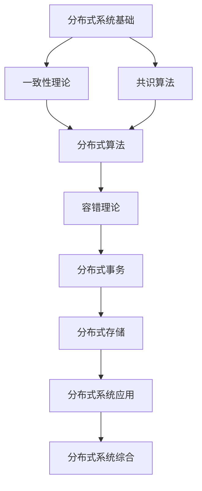

# 分布式系统理论索引 (Distributed Systems Theory Index)

## 📋 **目录**

### 1. [分布式系统基础](06.1_Distributed_Systems_Foundation.md)

### 2. [一致性理论](06.2_Consistency_Theory.md)

### 3. [共识算法](06.3_Consensus_Algorithms.md)

### 4. [分布式算法](06.4_Distributed_Algorithms.md)

### 5. [容错理论](06.5_Fault_Tolerance_Theory.md)

### 6. [分布式事务](06.6_Distributed_Transactions.md)

### 7. [分布式存储](06.7_Distributed_Storage.md)

### 8. [分布式系统应用](06.8_Distributed_Systems_Applications.md)

---

## 🎯 **分布式系统理论概述**

分布式系统理论研究由多个独立计算节点组成的系统的设计、分析和实现。它为云计算、区块链、分布式数据库等现代技术提供了理论基础。

### 核心特征

1. **并发性**：多个节点同时执行
2. **异步性**：节点间通信存在延迟
3. **部分失效**：节点可能独立失效
4. **一致性**：确保系统状态的一致性
5. **可扩展性**：支持系统规模扩展

### 理论层次

```
┌─────────────────────────────────────────────────────────────┐
│                    分布式系统综合 (6.9)                       │
├─────────────────────────────────────────────────────────────┤
│ 应用理论 (6.8) │ 存储理论 (6.7) │ 事务理论 (6.6) │ 容错理论 (6.5) │
├─────────────────────────────────────────────────────────────┤
│ 分布式算法 (6.4) │ 共识算法 (6.3) │ 一致性理论 (6.2) │ 基础理论 (6.1) │
└─────────────────────────────────────────────────────────────┘
```

---

## 🔗 **理论关联图**



---

## 📚 **详细主题结构**

### 6.1 分布式系统基础

- **6.1.1** [系统模型](06.1_Distributed_Systems_Foundation.md#611-系统模型)
- **6.1.2** [通信模型](06.1_Distributed_Systems_Foundation.md#612-通信模型)
- **6.1.3** [故障模型](06.1_Distributed_Systems_Foundation.md#613-故障模型)
- **6.1.4** [时间模型](06.1_Distributed_Systems_Foundation.md#614-时间模型)

### 6.2 一致性理论

- **6.2.1** [强一致性](06.2_Consistency_Theory.md#621-强一致性)
- **6.2.2** [最终一致性](06.2_Consistency_Theory.md#622-最终一致性)
- **6.2.3** [因果一致性](06.2_Consistency_Theory.md#623-因果一致性)
- **6.2.4** [顺序一致性](06.2_Consistency_Theory.md#624-顺序一致性)

### 6.3 共识算法

- **6.3.1** [Paxos算法](06.3_Consensus_Algorithms.md#631-paxos算法)
- **6.3.2** [Raft算法](06.3_Consensus_Algorithms.md#632-raft算法)
- **6.3.3** [拜占庭容错](06.3_Consensus_Algorithms.md#633-拜占庭容错)
- **6.3.4** [区块链共识](06.3_Consensus_Algorithms.md#634-区块链共识)

### 6.4 分布式算法

- **6.4.1** [分布式排序](06.4_Distributed_Algorithms.md#641-分布式排序)
- **6.4.2** [分布式图算法](06.4_Distributed_Algorithms.md#642-分布式图算法)
- **6.4.3** [分布式搜索](06.4_Distributed_Algorithms.md#643-分布式搜索)
- **6.4.4** [分布式机器学习](06.4_Distributed_Algorithms.md#644-分布式机器学习)

### 6.5 容错理论

- **6.5.1** [故障检测](06.5_Fault_Tolerance_Theory.md#651-故障检测)
- **6.5.2** [故障恢复](06.5_Fault_Tolerance_Theory.md#652-故障恢复)
- **6.5.3** [复制策略](06.5_Fault_Tolerance_Theory.md#653-复制策略)
- **6.5.4** [自愈系统](06.5_Fault_Tolerance_Theory.md#654-自愈系统)

### 6.6 分布式事务

- **6.6.1** [两阶段提交](06.6_Distributed_Transactions.md#661-两阶段提交)
- **6.6.2** [三阶段提交](06.6_Distributed_Transactions.md#662-三阶段提交)
- **6.6.3** [Saga模式](06.6_Distributed_Transactions.md#663-saga模式)
- **6.6.4** [最终一致性事务](06.6_Distributed_Transactions.md#664-最终一致性事务)

### 6.7 分布式存储

- **6.7.1** [分布式文件系统](06.7_Distributed_Storage.md#671-分布式文件系统)
- **6.7.2** [分布式数据库](06.7_Distributed_Storage.md#672-分布式数据库)
- **6.7.3** [键值存储](06.7_Distributed_Storage.md#673-键值存储)
- **6.7.4** [对象存储](06.7_Distributed_Storage.md#674-对象存储)

### 6.8 分布式系统应用

- **6.8.1** [云计算](06.8_Distributed_Systems_Applications.md#681-云计算)
- **6.8.2** [区块链](06.8_Distributed_Systems_Applications.md#682-区块链)
- **6.8.3** [微服务架构](06.8_Distributed_Systems_Applications.md#683-微服务架构)
- **6.8.4** [边缘计算](06.8_Distributed_Systems_Applications.md#684-边缘计算)

---

## 🔄 **与其他理论的关联**

### 向上关联

- **控制论理论**：[05_Control_Theory](../05_Control_Theory/01_Control_Theory_Index.md)
- **类型理论**：[04_Type_Theory](../04_Type_Theory/01_Type_Theory_Index.md)

### 向下关联

- **并发理论**：[11_Concurrency_Theory](../11_Concurrency_Theory/01_Concurrency_Theory_Index.md)
- **软件工程理论**：[07_Software_Engineering_Theory](../07_Software_Engineering_Theory/01_Software_Engineering_Theory_Index.md)

---

## 📖 **学习路径建议**

### 基础路径

1. 分布式系统基础 → 一致性理论 → 共识算法
2. 分布式算法 → 容错理论 → 分布式事务
3. 分布式存储 → 分布式系统应用 → 分布式系统综合

### 专业路径

- **系统架构方向**：基础理论 → 一致性理论 → 微服务架构
- **算法方向**：分布式算法 → 共识算法 → 区块链
- **存储方向**：分布式存储 → 容错理论 → 云计算

---

## 🎯 **核心概念索引**

| 概念 | 定义位置 | 相关理论 |
|------|----------|----------|
| 系统模型 | [6.1.1](06.1_Distributed_Systems_Foundation.md#611-系统模型) | 分布式系统基础 |
| 一致性 | [6.2.1](06.2_Consistency_Theory.md#621-强一致性) | 一致性理论 |
| 共识 | [6.3.1](06.3_Consensus_Algorithms.md#631-paxos算法) | 共识算法 |
| 分布式算法 | [6.4.1](06.4_Distributed_Algorithms.md#641-分布式排序) | 分布式算法 |
| 容错 | [6.5.1](06.5_Fault_Tolerance_Theory.md#651-故障检测) | 容错理论 |
| 分布式事务 | [6.6.1](06.6_Distributed_Transactions.md#661-两阶段提交) | 分布式事务 |
| 分布式存储 | [6.7.1](06.7_Distributed_Storage.md#671-分布式文件系统) | 分布式存储 |
| 云计算 | [6.8.1](06.8_Distributed_Systems_Applications.md#681-云计算) | 分布式系统应用 |

---

## 🔄 **持续更新**

**最后更新时间**：2024-12-20
**版本**：v1.0.0
**维护者**：分布式系统理论重构团队

---

## 📋 **待完成任务**

- [ ] 创建所有子主题的详细文档
- [ ] 建立分布式概念间的交叉引用系统
- [ ] 完善算法分析和证明
- [ ] 构建分布式理论与工程实践的桥梁
