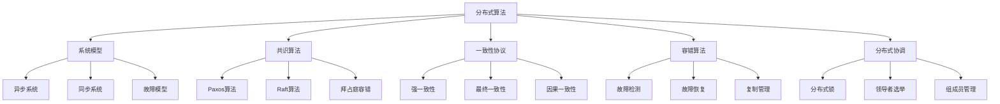

# 分布式算法基础理论 (Distributed Algorithms Foundation)

## 🎯 **概述**

分布式算法是分布式系统理论的核心，研究如何在多个节点之间协调计算，解决共识、一致性、容错等关键问题。本文档构建了完整的分布式算法理论体系。

## 📚 **目录**

### 1. 分布式系统基础理论

- **1.1** 系统模型形式化
- **1.2** 故障模型
- **1.3** 系统执行模型
- **1.4** 复杂度分析

### 2. 共识算法

- **2.1** 共识问题定义
- **2.2** Paxos算法
- **2.3** Raft算法
- **2.4** 拜占庭容错算法

### 3. 一致性协议

- **3.1** 强一致性
- **3.2** 最终一致性
- **3.3** 因果一致性
- **3.4** 顺序一致性

### 4. 容错算法

- **4.1** 故障检测
- **4.2** 故障恢复
- **4.3** 复制管理
- **4.4** 状态同步

### 5. 分布式协调

- **5.1** 分布式锁
- **5.2** 领导者选举
- **5.3** 组成员管理
- **5.4** 分布式事务

## 1. 分布式系统基础理论

### 1.1 系统模型形式化

**定义 1.1 (分布式系统)**
分布式系统是一个三元组 $DS = (N, C, M)$，其中：

- $N = \{p_1, p_2, \ldots, p_n\}$ 是节点集合，$|N| = n$
- $C \subseteq N \times N$ 是通信关系
- $M$ 是消息传递机制

**定义 1.2 (异步系统)**
异步分布式系统中：

- 消息传递延迟无界但有限
- 节点处理时间无界但有限
- 不存在全局时钟

**定义 1.3 (同步系统)**
同步分布式系统中：

- 消息传递延迟有界
- 节点处理时间有界
- 存在全局时钟或同步轮次

**定义 1.4 (部分同步系统)**
部分同步系统中：

- 消息传递延迟有界但未知
- 节点处理时间有界但未知
- 时钟漂移有界

**形式化实现：**

```haskell
data Node = Node {
  nodeId :: NodeId,
  state :: NodeState,
  neighbors :: [NodeId]
} deriving (Show, Eq)

data DistributedSystem = DistributedSystem {
  nodes :: Map NodeId Node,
  communication :: CommunicationModel,
  messageMechanism :: MessageMechanism
} deriving (Show)

data CommunicationModel = 
  Synchronous {
    maxDelay :: Time,
    maxProcessingTime :: Time
  }
  | Asynchronous {
    minDelay :: Time,
    maxDelay :: Time
  }
  | PartialSynchronous {
    unknownBound :: Time
  }
  deriving (Show)

-- 系统执行模型
data Event = 
  InternalEvent NodeId StateTransition
  | SendEvent NodeId NodeId Message
  | ReceiveEvent NodeId NodeId Message
  deriving (Show)

type Execution = [Event]

-- 系统执行
executeSystem :: DistributedSystem -> Execution -> DistributedSystem
executeSystem sys events = 
  foldl executeEvent sys events

executeEvent :: DistributedSystem -> Event -> DistributedSystem
executeEvent sys event = 
  case event of
    InternalEvent nodeId transition -> 
      let node = nodes sys ! nodeId
          newState = applyTransition (state node) transition
          newNode = node { state = newState }
      in sys { nodes = Map.insert nodeId newNode (nodes sys) }
    
    SendEvent from to message -> 
      let -- 发送消息
          newMessages = addMessage (messageMechanism sys) from to message
      in sys { messageMechanism = newMessages }
    
    ReceiveEvent from to message -> 
      let -- 接收消息
          node = nodes sys ! to
          newState = processMessage (state node) message
          newNode = node { state = newState }
      in sys { nodes = Map.insert to newNode (nodes sys) }
```

### 1.2 故障模型

**定义 1.5 (故障类型)**
节点故障类型：

- **崩溃故障**：节点停止工作
- **拜占庭故障**：节点任意行为
- **遗漏故障**：节点遗漏某些操作
- **时序故障**：节点违反时序约束

**定义 1.6 (故障假设)**
故障假设 $F$ 指定：

- 故障类型
- 最大故障节点数 $f$
- 故障模式（静态/动态）

**定理 1.1 (故障边界)**
在 $n$ 个节点的系统中，最多可以容忍 $f$ 个故障节点，其中：

- 崩溃故障：$f < n$
- 拜占庭故障：$f < n/3$
- 遗漏故障：$f < n/2$

**证明：** 通过反证法：

1. 假设可以容忍更多故障节点
2. 构造故障场景导致协议失败
3. 得出矛盾，证明边界正确

**形式化实现：**

```haskell
data FaultType = 
  CrashFault
  | ByzantineFault
  | OmissionFault
  | TimingFault
  deriving (Show, Eq)

data FaultAssumption = FaultAssumption {
  faultType :: FaultType,
  maxFaultyNodes :: Int,
  faultPattern :: FaultPattern
} deriving (Show)

data FaultPattern = Static | Dynamic deriving (Show, Eq)

-- 故障检测器
data FailureDetector = FailureDetector {
  suspected :: Map NodeId Bool,
  timeout :: Time
} deriving (Show)

-- 故障检测
detectFaults :: DistributedSystem -> FailureDetector -> FailureDetector
detectFaults sys detector = 
  let -- 检查每个节点
      newSuspected = Map.mapWithKey (\nodeId _ -> 
        isNodeFaulty sys nodeId detector) (nodes sys)
  in detector { suspected = newSuspected }

isNodeFaulty :: DistributedSystem -> NodeId -> FailureDetector -> Bool
isNodeFaulty sys nodeId detector = 
  let -- 检查节点是否响应
      lastHeartbeat = getLastHeartbeat sys nodeId
      currentTime = getCurrentTime sys
  in currentTime - lastHeartbeat > timeout detector

-- 故障边界检查
checkFaultBound :: Int -> FaultType -> Bool
checkFaultBound n faultType = 
  let maxFaulty = case faultType of
        CrashFault -> n - 1
        ByzantineFault -> n `div` 3 - 1
        OmissionFault -> n `div` 2 - 1
        TimingFault -> n - 1
  in maxFaulty >= 0
```

### 1.3 系统执行模型

**定义 1.7 (系统执行)**
系统执行是事件序列 $\sigma = e_1, e_2, \ldots$，其中每个事件 $e_i$ 是：

- 内部事件：节点内部状态转换
- 发送事件：节点发送消息
- 接收事件：节点接收消息

**定义 1.8 (执行公平性)**
执行是公平的，如果：

- 每个消息最终被传递
- 每个正确节点无限次执行步骤

**形式化实现：**

```haskell
data ExecutionModel = ExecutionModel {
  events :: [Event],
  fairness :: FairnessConstraint
} deriving (Show)

data FairnessConstraint = 
  Unfair
  | WeakFairness
  | StrongFairness
  deriving (Show)

-- 执行公平性检查
checkFairness :: Execution -> FairnessConstraint -> Bool
checkFairness execution fairness = 
  case fairness of
    Unfair -> True
    WeakFairness -> checkWeakFairness execution
    StrongFairness -> checkStrongFairness execution

checkWeakFairness :: Execution -> Bool
checkWeakFairness execution = 
  let -- 检查每个消息是否最终被传递
      messages = extractMessages execution
      delivered = extractDeliveredMessages execution
  in all (\msg -> msg `elem` delivered) messages

checkStrongFairness :: Execution -> Bool
checkWeakFairness execution = 
  let -- 检查每个正确节点是否无限次执行
      nodeExecutions = countNodeExecutions execution
  in all (\count -> count > 0) nodeExecutions
```

## 2. 共识算法

### 2.1 共识问题

**定义 2.1 (共识问题)**
共识问题要求所有正确节点就某个值达成一致，满足：

- **一致性**：所有正确节点决定相同值
- **有效性**：如果所有正确节点提议相同值，则决定该值
- **终止性**：所有正确节点最终做出决定

**定义 2.2 (共识复杂度)**
共识问题的复杂度度量：

- **消息复杂度**：总消息数量
- **时间复杂度**：决定轮次数量
- **空间复杂度**：每个节点存储空间

**定理 2.1 (FLP不可能性)**
在异步系统中，即使只有一个节点崩溃，也无法实现确定性共识。

**证明：** 通过构造性证明：

1. 假设存在确定性共识算法
2. 构造执行序列导致无限延迟
3. 违反终止性，得出矛盾

**形式化实现：**

```haskell
data ConsensusProblem = ConsensusProblem {
  nodes :: [NodeId],
  proposedValues :: Map NodeId Value,
  decidedValues :: Map NodeId Value
} deriving (Show)

data ConsensusProperties = ConsensusProperties {
  agreement :: Bool,    -- 一致性
  validity :: Bool,     -- 有效性
  termination :: Bool   -- 终止性
} deriving (Show)

-- 共识算法接口
class ConsensusAlgorithm a where
  propose :: a -> NodeId -> Value -> a
  decide :: a -> NodeId -> Maybe Value
  step :: a -> Event -> a

-- 共识正确性检查
checkConsensusCorrectness :: ConsensusProblem -> ConsensusProperties
checkConsensusCorrectness problem = 
  let -- 检查一致性
      agreement = checkAgreement problem
      -- 检查有效性
      validity = checkValidity problem
      -- 检查终止性
      termination = checkTermination problem
  in ConsensusProperties {
    agreement = agreement,
    validity = validity,
    termination = termination
  }

checkAgreement :: ConsensusProblem -> Bool
checkAgreement problem = 
  let decidedValues = Map.elems (decidedValues problem)
      uniqueValues = Set.fromList decidedValues
  in Set.size uniqueValues <= 1

checkValidity :: ConsensusProblem -> Bool
checkValidity problem = 
  let -- 检查是否所有提议值相同
      proposedValues = Map.elems (proposedValues problem)
      allSame = all (\v -> v == head proposedValues) proposedValues
      -- 检查决定值是否在提议值中
      decidedInProposed = all (\v -> v `elem` proposedValues) 
                              (Map.elems (decidedValues problem))
  in not allSame || decidedInProposed
```

### 2.2 Paxos算法

**定义 2.3 (Paxos角色)**
Paxos算法中的角色：

- **提议者**：发起提议
- **接受者**：接受提议
- **学习者**：学习最终决定

**定义 2.4 (Paxos状态)**
Paxos状态包含：

- **提议编号**：$n \in \mathbb{N}$
- **已接受值**：$v \in V$
- **已接受编号**：$n_a \in \mathbb{N}$

**形式化实现：**

```rust
// Rust实现Paxos算法
#[derive(Debug, Clone)]
pub struct PaxosState {
    proposal_number: u64,
    accepted_value: Option<Value>,
    accepted_number: u64,
    promised_number: u64,
}

#[derive(Debug)]
pub enum PaxosRole {
    Proposer,
    Acceptor,
    Learner,
}

#[derive(Debug)]
pub struct PaxosNode {
    node_id: NodeId,
    role: PaxosRole,
    state: PaxosState,
    acceptors: Vec<NodeId>,
    learners: Vec<NodeId>,
}

impl PaxosNode {
    pub fn new(node_id: NodeId, role: PaxosRole) -> Self {
        PaxosNode {
            node_id,
            role,
            state: PaxosState {
                proposal_number: 0,
                accepted_value: None,
                accepted_number: 0,
                promised_number: 0,
            },
            acceptors: Vec::new(),
            learners: Vec::new(),
        }
    }
    
    // Phase 1a: 提议者发送Prepare消息
    pub fn phase_1a(&mut self, value: Value) -> Vec<Message> {
        self.state.proposal_number += 1;
        let prepare_msg = Message::Prepare {
            from: self.node_id,
            proposal_number: self.state.proposal_number,
            value,
        };
        
        self.acceptors.iter().map(|&acceptor_id| {
            Message::new(prepare_msg.clone(), self.node_id, acceptor_id)
        }).collect()
    }
    
    // Phase 1b: 接受者响应Prepare消息
    pub fn phase_1b(&mut self, msg: &Message) -> Option<Message> {
        if let Message::Prepare { proposal_number, .. } = msg {
            if *proposal_number > self.state.promised_number {
                self.state.promised_number = *proposal_number;
                
                let response = Message::Promise {
                    from: self.node_id,
                    proposal_number: *proposal_number,
                    accepted_number: self.state.accepted_number,
                    accepted_value: self.state.accepted_value.clone(),
                };
                
                Some(Message::new(response, self.node_id, msg.from()))
            } else {
                Some(Message::Nack {
                    from: self.node_id,
                    proposal_number: *proposal_number,
                })
            }
        } else {
            None
        }
    }
    
    // Phase 2a: 提议者发送Accept消息
    pub fn phase_2a(&mut self, value: Value) -> Vec<Message> {
        let accept_msg = Message::Accept {
            from: self.node_id,
            proposal_number: self.state.proposal_number,
            value,
        };
        
        self.acceptors.iter().map(|&acceptor_id| {
            Message::new(accept_msg.clone(), self.node_id, acceptor_id)
        }).collect()
    }
    
    // Phase 2b: 接受者响应Accept消息
    pub fn phase_2b(&mut self, msg: &Message) -> Option<Message> {
        if let Message::Accept { proposal_number, value } = msg {
            if *proposal_number >= self.state.promised_number {
                self.state.accepted_number = *proposal_number;
                self.state.accepted_value = Some(value.clone());
                
                let response = Message::Accepted {
                    from: self.node_id,
                    proposal_number: *proposal_number,
                    value: value.clone(),
                };
                
                // 通知学习者
                self.notify_learners(&response);
                
                Some(Message::new(response, self.node_id, msg.from()))
            } else {
                Some(Message::Nack {
                    from: self.node_id,
                    proposal_number: *proposal_number,
                })
            }
        } else {
            None
        }
    }
    
    fn notify_learners(&self, msg: &Message) {
        for &learner_id in &self.learners {
            // 发送学习消息
        }
    }
}

#[derive(Debug, Clone)]
pub enum Message {
    Prepare {
        from: NodeId,
        proposal_number: u64,
        value: Value,
    },
    Promise {
        from: NodeId,
        proposal_number: u64,
        accepted_number: u64,
        accepted_value: Option<Value>,
    },
    Accept {
        from: NodeId,
        proposal_number: u64,
        value: Value,
    },
    Accepted {
        from: NodeId,
        proposal_number: u64,
        value: Value,
    },
    Nack {
        from: NodeId,
        proposal_number: u64,
    },
}
```

### 2.3 Raft算法

**定义 2.5 (Raft角色)**
Raft算法中的角色：

- **领导者**：处理客户端请求
- **跟随者**：响应领导者请求
- **候选人**：参与领导者选举

**定义 2.6 (Raft状态)**
Raft状态包含：

- **当前任期**：$term \in \mathbb{N}$
- **投票信息**：$votedFor \in N \cup \{\bot\}$
- **日志条目**：$log = [entry_1, entry_2, \ldots]$

**形式化实现：**

```rust
// Rust实现Raft算法
#[derive(Debug, Clone)]
pub struct RaftState {
    current_term: u64,
    voted_for: Option<NodeId>,
    log: Vec<LogEntry>,
    commit_index: u64,
    last_applied: u64,
}

#[derive(Debug, Clone)]
pub struct LogEntry {
    term: u64,
    index: u64,
    command: Command,
}

#[derive(Debug)]
pub enum RaftRole {
    Follower,
    Candidate,
    Leader,
}

#[derive(Debug)]
pub struct RaftNode {
    node_id: NodeId,
    role: RaftRole,
    state: RaftState,
    election_timeout: Duration,
    heartbeat_interval: Duration,
    last_heartbeat: Instant,
}

impl RaftNode {
    pub fn new(node_id: NodeId) -> Self {
        RaftNode {
            node_id,
            role: RaftRole::Follower,
            state: RaftState {
                current_term: 0,
                voted_for: None,
                log: Vec::new(),
                commit_index: 0,
                last_applied: 0,
            },
            election_timeout: Duration::from_millis(150),
            heartbeat_interval: Duration::from_millis(50),
            last_heartbeat: Instant::now(),
        }
    }
    
    // 领导者选举
    pub fn start_election(&mut self) -> Vec<Message> {
        self.state.current_term += 1;
        self.role = RaftRole::Candidate;
        self.state.voted_for = Some(self.node_id);
        
        let request_vote_msg = Message::RequestVote {
            term: self.state.current_term,
            candidate_id: self.node_id,
            last_log_index: self.state.log.len() as u64,
            last_log_term: self.state.log.last().map(|e| e.term).unwrap_or(0),
        };
        
        // 向所有其他节点发送投票请求
        self.get_all_nodes().iter().filter(|&&id| id != self.node_id)
            .map(|&node_id| {
                Message::new(request_vote_msg.clone(), self.node_id, node_id)
            }).collect()
    }
    
    // 处理投票请求
    pub fn handle_request_vote(&mut self, msg: &Message) -> Option<Message> {
        if let Message::RequestVote { term, candidate_id, last_log_index, last_log_term } = msg {
            let mut vote_granted = false;
            
            if *term > self.state.current_term {
                self.state.current_term = *term;
                self.role = RaftRole::Follower;
                self.state.voted_for = None;
            }
            
            if *term == self.state.current_term && 
               (self.state.voted_for.is_none() || self.state.voted_for == Some(*candidate_id)) {
                // 检查日志完整性
                let last_log = self.state.log.last();
                if last_log.is_none() || 
                   (*last_log_term > last_log.unwrap().term) ||
                   (*last_log_term == last_log.unwrap().term && *last_log_index >= last_log.unwrap().index) {
                    vote_granted = true;
                    self.state.voted_for = Some(*candidate_id);
                }
            }
            
            Some(Message::RequestVoteResponse {
                term: self.state.current_term,
                vote_granted,
            })
        } else {
            None
        }
    }
    
    // 领导者心跳
    pub fn send_heartbeat(&self) -> Vec<Message> {
        let append_entries_msg = Message::AppendEntries {
            term: self.state.current_term,
            leader_id: self.node_id,
            prev_log_index: 0,
            prev_log_term: 0,
            entries: Vec::new(),
            leader_commit: self.state.commit_index,
        };
        
        self.get_all_nodes().iter().filter(|&&id| id != self.node_id)
            .map(|&node_id| {
                Message::new(append_entries_msg.clone(), self.node_id, node_id)
            }).collect()
    }
    
    // 处理心跳
    pub fn handle_append_entries(&mut self, msg: &Message) -> Option<Message> {
        if let Message::AppendEntries { term, leader_id, entries, leader_commit } = msg {
            if *term >= self.state.current_term {
                self.state.current_term = *term;
                self.role = RaftRole::Follower;
                self.last_heartbeat = Instant::now();
                
                // 应用日志条目
                if !entries.is_empty() {
                    self.apply_log_entries(entries);
                }
                
                // 更新提交索引
                if *leader_commit > self.state.commit_index {
                    self.state.commit_index = std::cmp::min(*leader_commit, self.state.log.len() as u64);
                }
                
                Some(Message::AppendEntriesResponse {
                    term: self.state.current_term,
                    success: true,
                })
            } else {
                Some(Message::AppendEntriesResponse {
                    term: self.state.current_term,
                    success: false,
                })
            }
        } else {
            None
        }
    }
    
    fn apply_log_entries(&mut self, entries: &[LogEntry]) {
        for entry in entries {
            if entry.index <= self.state.log.len() as u64 {
                // 截断冲突的日志
                self.state.log.truncate(entry.index as usize);
            }
            self.state.log.push(entry.clone());
        }
    }
}
```

## 3. 一致性协议

### 3.1 强一致性

**定义 3.1 (强一致性)**
强一致性要求所有节点看到相同的操作顺序。

**定义 3.2 (线性一致性)**
线性一致性是最强的一致性模型，要求：

- **原子性**：操作要么完全执行，要么完全不执行
- **顺序性**：所有操作都有全局顺序
- **实时性**：如果操作A在操作B开始前完成，则A在B之前

**形式化实现：**

```haskell
data ConsistencyModel = 
  StrongConsistency
  | Linearizability
  | SequentialConsistency
  | CausalConsistency
  | EventualConsistency
  deriving (Show, Eq)

data Operation = Operation {
  operationId :: OperationId,
  nodeId :: NodeId,
  timestamp :: Timestamp,
  operationType :: OperationType,
  key :: Key,
  value :: Value
} deriving (Show)

data OperationType = Read | Write | Delete deriving (Show, Eq)

-- 强一致性检查
checkStrongConsistency :: [Operation] -> Bool
checkStrongConsistency operations = 
  let -- 检查原子性
      atomic = checkAtomicity operations
      -- 检查顺序性
      ordered = checkOrdering operations
      -- 检查实时性
      realtime = checkRealtime operations
  in atomic && ordered && realtime

checkAtomicity :: [Operation] -> Bool
checkAtomicity operations = 
  let -- 检查每个操作是否完全执行
      completed = all isCompleted operations
  in completed

checkOrdering :: [Operation] -> Bool
checkOrdering operations = 
  let -- 检查是否存在全局顺序
      globalOrder = findGlobalOrder operations
  in isConsistent globalOrder

checkRealtime :: [Operation] -> Bool
checkRealtime operations = 
  let -- 检查实时性约束
      realtimeConstraints = generateRealtimeConstraints operations
  in all checkConstraint realtimeConstraints
```

## 4. 容错算法

### 4.1 故障检测

**定义 4.1 (故障检测器)**
故障检测器是函数 $FD : N \rightarrow 2^N$，满足：

- **完整性**：崩溃节点最终被所有正确节点怀疑
- **准确性**：正确节点最终不被怀疑

**定理 4.1 (故障检测器不可能性)**
在异步系统中，无法实现完美的故障检测器。

**证明：** 通过异步性：

1. 无法区分慢节点和故障节点
2. 完美检测器需要同步假设
3. 因此异步系统中不可能

**形式化实现：**

```haskell
data FailureDetector = FailureDetector {
  suspected :: Map NodeId Bool,
  timeout :: Time,
  heartbeatInterval :: Time
} deriving (Show)

-- 故障检测算法
detectFailures :: DistributedSystem -> FailureDetector -> FailureDetector
detectFailures sys detector = 
  let -- 检查每个节点
      newSuspected = Map.mapWithKey (\nodeId _ -> 
        isNodeSuspected sys nodeId detector) (nodes sys)
  in detector { suspected = newSuspected }

isNodeSuspected :: DistributedSystem -> NodeId -> FailureDetector -> Bool
isNodeSuspected sys nodeId detector = 
  let -- 检查最后心跳时间
      lastHeartbeat = getLastHeartbeat sys nodeId
      currentTime = getCurrentTime sys
  in currentTime - lastHeartbeat > timeout detector

-- 心跳机制
sendHeartbeat :: NodeId -> [NodeId] -> [Message]
sendHeartbeat sender receivers = 
  map (\receiver -> Message {
    from = sender,
    to = receiver,
    content = Heartbeat { timestamp = getCurrentTime }
  }) receivers
```

## 5. 分布式协调

### 5.1 分布式锁

**定义 5.1 (分布式锁)**
分布式锁确保在分布式环境中资源的互斥访问。

**定义 5.2 (锁性质)**
分布式锁应满足：

- **互斥性**：同一时间只有一个节点持有锁
- **无死锁**：不会出现所有节点都在等待的情况
- **无饥饿**：每个请求最终都能获得锁

**形式化实现：**

```rust
// Rust实现分布式锁
use std::collections::HashMap;
use std::sync::{Arc, Mutex};
use tokio::time::{Duration, Instant};

#[derive(Debug, Clone)]
pub struct LockRequest {
    node_id: NodeId,
    resource_id: ResourceId,
    timestamp: Instant,
    timeout: Duration,
}

#[derive(Debug)]
pub struct DistributedLock {
    resource_id: ResourceId,
    holder: Option<NodeId>,
    queue: Vec<LockRequest>,
    timeout: Duration,
}

impl DistributedLock {
    pub fn new(resource_id: ResourceId) -> Self {
        DistributedLock {
            resource_id,
            holder: None,
            queue: Vec::new(),
            timeout: Duration::from_secs(30),
        }
    }
    
    pub fn acquire(&mut self, request: LockRequest) -> LockResult {
        if self.holder.is_none() {
            // 锁可用，直接获取
            self.holder = Some(request.node_id);
            LockResult::Granted
        } else if self.holder == Some(request.node_id) {
            // 重入锁
            LockResult::Granted
        } else {
            // 锁被占用，加入队列
            self.queue.push(request);
            LockResult::Queued
        }
    }
    
    pub fn release(&mut self, node_id: NodeId) -> Option<LockRequest> {
        if self.holder == Some(node_id) {
            self.holder = None;
            
            // 从队列中选择下一个请求
            if let Some(next_request) = self.queue.pop() {
                self.holder = Some(next_request.node_id);
                Some(next_request)
            } else {
                None
            }
        } else {
            None
        }
    }
    
    pub fn check_timeout(&mut self) -> Vec<LockRequest> {
        let now = Instant::now();
        let mut timed_out = Vec::new();
        
        // 检查超时的请求
        self.queue.retain(|request| {
            if now.duration_since(request.timestamp) > request.timeout {
                timed_out.push(request.clone());
                false
            } else {
                true
            }
        });
        
        timed_out
    }
}

#[derive(Debug)]
pub enum LockResult {
    Granted,
    Queued,
    Timeout,
    Error(String),
}

// 分布式锁管理器
#[derive(Debug)]
pub struct LockManager {
    locks: Arc<Mutex<HashMap<ResourceId, DistributedLock>>>,
}

impl LockManager {
    pub fn new() -> Self {
        LockManager {
            locks: Arc::new(Mutex::new(HashMap::new())),
        }
    }
    
    pub async fn acquire_lock(&self, resource_id: ResourceId, node_id: NodeId) -> LockResult {
        let mut locks = self.locks.lock().unwrap();
        
        let lock = locks.entry(resource_id).or_insert_with(|| {
            DistributedLock::new(resource_id)
        });
        
        let request = LockRequest {
            node_id,
            resource_id,
            timestamp: Instant::now(),
            timeout: Duration::from_secs(30),
        };
        
        lock.acquire(request)
    }
    
    pub async fn release_lock(&self, resource_id: ResourceId, node_id: NodeId) -> bool {
        let mut locks = self.locks.lock().unwrap();
        
        if let Some(lock) = locks.get_mut(&resource_id) {
            lock.release(node_id).is_some()
        } else {
            false
        }
    }
}
```

## 📊 **理论关系图**



## 🔗 **相关理论链接**

- [一致性理论](../02_一致性理论/01_一致性基础理论.md)
- [容错理论](../03_容错理论/01_容错基础理论.md)
- [并发控制理论](../04_并发控制理论/01_并发控制基础理论.md)
- [分布式协议理论](../05_分布式协议理论/01_分布式协议基础理论.md)
- [控制论理论](../../05_Control_Theory/01_经典控制论/01_经典控制论基础理论.md)
- [类型理论](../../04_Type_Theory/01_简单类型理论/01_简单类型基础理论.md)

## 📚 **参考文献**

1. Lynch, N. A. (1996). Distributed algorithms. Morgan Kaufmann.
2. Lamport, L. (1998). The part-time parliament. ACM Transactions on Computer Systems, 16(2), 133-169.
3. Ongaro, D., & Ousterhout, J. (2014). In search of an understandable consensus algorithm. In USENIX Annual Technical Conference (pp. 305-319).
4. Fischer, M. J., Lynch, N. A., & Paterson, M. S. (1985). Impossibility of distributed consensus with one faulty process. Journal of the ACM, 32(2), 374-382.
5. Chandra, T. D., & Toueg, S. (1996). Unreliable failure detectors for reliable distributed systems. Journal of the ACM, 43(2), 225-267.

---

**最后更新时间**: 2024-12-20  
**版本**: v1.0.0  
**维护者**: 形式科学体系构建团队
