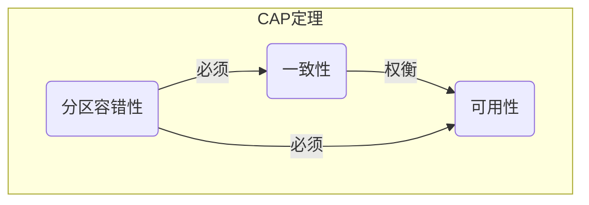

# 06.1 分布式系统基础理论 (Foundations)

## 目录

1.  [定义与背景](#1-定义与背景)
2.  [批判性分析](#2-批判性分析)
3.  [核心概念与定理](#3-核心概念与定理)
4.  [形式化表达](#4-形式化表达)
5.  [交叉引用](#5-交叉引用)
6.  [参考文献](#6-参考文献)

---

## 1. 定义与背景

分布式系统是由多个独立的计算单元组成的集合，这些单元通过网络进行通信和协作，以一个单一、一致的系统呈现给用户。本篇探讨构建和理解这类系统所需的基础理论。

---

## 2. 批判性分析

-   **优点**: 可扩展性、高可用性、资源共享、容错能力。
-   **缺点**: 系统设计和调试极其复杂，固有的不确定性（网络延迟、节点故障）导致难以推理，缺乏全局时钟和共享状态。

---

## 3. 核心概念与定理

-   **CAP 定理 (Brewer's Theorem)**: 任何一个分布式系统在一致性（Consistency）、可用性（Availability）和分区容错性（Partition tolerance）这三个基本需求中，最多只能同时满足两项。在现代分布式系统中，分区容错性通常是必须保证的，因此系统设计需要在C和A之间进行权衡。
-   **FLP 不可能性 (FLP Impossibility Result)**: 在一个允许节点失效的异步分布式系统中，即使只有一个处理器可能崩溃，也不存在一个确定性的共识算法能保证在有限时间内达成一致。
-   **Fallacies of Distributed Computing (分布式计算的谬误)**: 一系列关于分布式系统的错误假设，如"网络是可靠的"、"延迟为零"、"带宽是无限的"等。工程师必须清楚地认识到这些谬误。
-   **时钟与顺序 (Clocks and Ordering)**:
    -   **Lamport 逻辑时钟**: 通过时间戳为分布式系统中的事件提供一个偏序关系。
    -   **Vector Clocks**: Lamport时钟的改进，可以确定事件之间的因果关系。

---

## 4. 形式化表达

**CAP 定理**:
在一个分布式系统中，`C`, `A`, `P` 三者不可兼得。
-   **CA (No Partition Tolerance)**: 放弃分区容错，如单体数据库。当网络分区发生时系统不可用。
-   **CP (Consistency + Partition Tolerance)**: 放弃可用性。网络分区时，为保证数据一致性，受影响的服务需要下线。
-   **AP (Availability + Partition Tolerance)**: 放弃强一致性。网络分区时，节点仍可独立提供服务，但可能导致数据不一致（最终一致性）。

---

## 5. 交叉引用

-   [分布式系统总览](./README.md)
-   [共识与协作](./06.3_Consensus_and_Coordination.md)
-   [复制与一致性](./06.4_Replication_and_Consistency.md)

---

## 6. 参考文献

1.  Gilbert, Seth, and Lynch, Nancy. "Brewer's conjecture and the feasibility of consistent, available, partition-tolerant web services." *ACM SIGACT News*, 2002.
2.  Fischer, Michael J., Lynch, Nancy A., and Paterson, Michael S. "Impossibility of distributed consensus with one faulty process." *Journal of the ACM*, 1985.
3.  Lamport, Leslie. "Time, clocks, and the ordering of events in a distributed system." *Communications of the ACM*, 1978. 