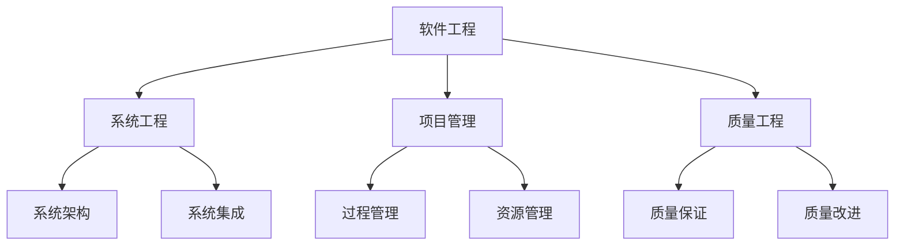
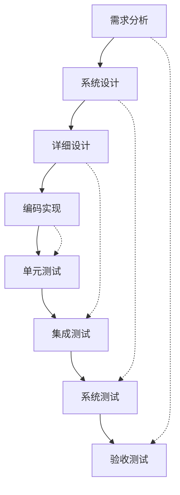

# 软件工程综合框架

## 目录

1. [概述](#1-概述)
2. [理论基础](#2-理论基础)
3. [软件生命周期](#3-软件生命周期)
4. [系统架构](#4-系统架构)
5. [设计模式](#5-设计模式)
6. [质量保证](#6-质量保证)
7. [项目管理](#7-项目管理)
8. [哲学批判与反思](#8-哲学批判与反思)
9. [理论整合](#9-理论整合)
10. [未来发展方向](#10-未来发展方向)

## 1. 概述

### 1.1 定义与范围

**定义 1.1.1** 软件工程 (Software Engineering)
软件工程是应用系统化、规范化、可量化的方法来开发、运行和维护软件的学科。

**定义 1.1.2** 软件系统
软件系统是由程序、数据和文档组成的复杂系统，用于解决特定领域的问题。

### 1.2 核心特征

| 特征 | 描述 | 重要性 |
|------|------|--------|
| 系统性 | 采用系统化的方法进行开发 | 高 |
| 工程性 | 应用工程原则和最佳实践 | 高 |
| 可量化 | 支持度量和评估 | 中 |
| 可重复 | 过程可以重复和优化 | 中 |
| 可维护 | 支持软件的长期维护 | 高 |

### 1.3 理论地位



## 2. 理论基础

### 2.1 系统工程理论

#### 2.1.1 系统思维

**定义 2.1.1** 系统
系统是由相互关联的组件组成的整体，具有涌现性质。

**原则 2.1.1** 系统原则

- 整体性：系统大于各部分之和
- 层次性：系统具有层次结构
- 涌现性：整体具有部分没有的性质
- 反馈性：系统具有反馈机制

#### 2.1.2 复杂性理论

**定义 2.1.2** 软件复杂性
软件复杂性包括：

- 结构复杂性：组件间的关系复杂度
- 行为复杂性：系统行为的复杂度
- 认知复杂性：理解和维护的难度

**定理 2.1.1** (复杂性增长定律)
随着软件规模的增长，复杂性呈非线性增长。

### 2.2 工程理论

#### 2.2.1 工程原则

**原则 2.2.1** 工程原则

- 模块化：将系统分解为独立模块
- 抽象化：隐藏不必要的细节
- 标准化：采用标准化的方法和工具
- 可验证性：支持验证和测试

#### 2.2.2 设计理论

**定义 2.2.1** 设计模式
设计模式是解决常见设计问题的标准解决方案。

**定义 2.2.2** 架构风格
架构风格是系统组织的高级模式。

### 2.3 管理理论

#### 2.3.1 项目管理

**定义 2.3.1** 项目
项目是临时性的努力，用于创造独特的产品、服务或结果。

**定义 2.3.2** 项目管理
项目管理是应用知识、技能、工具和技术来满足项目要求的过程。

#### 2.3.2 过程管理

**定义 2.3.3** 软件过程
软件过程是用于开发和维护软件的活动、方法和实践的集合。

## 3. 软件生命周期

### 3.1 传统生命周期模型

#### 3.1.1 瀑布模型

**模型 3.1.1** 瀑布模型
瀑布模型是线性的、顺序的软件开发模型。

**阶段 3.1.1** 瀑布阶段

1. 需求分析
2. 系统设计
3. 详细设计
4. 编码实现
5. 测试验证
6. 部署维护

**优点 3.1.1** 瀑布模型优点

- 结构清晰
- 易于管理
- 文档完整

**缺点 3.1.1** 瀑布模型缺点

- 缺乏灵活性
- 难以应对变化
- 风险较高

#### 3.1.2 V模型

**模型 3.1.2** V模型
V模型是瀑布模型的变种，强调测试与开发的对应关系。



### 3.2 敏捷生命周期模型

#### 3.2.1 Scrum

**框架 3.2.1** Scrum框架
Scrum是一个轻量级的敏捷框架，用于复杂产品的开发。

**角色 3.2.1** Scrum角色

- 产品负责人 (Product Owner)
- Scrum Master
- 开发团队 (Development Team)

**事件 3.2.1** Scrum事件

- Sprint计划会议
- 每日站会
- Sprint评审会议
- Sprint回顾会议

**工件 3.2.1** Scrum工件

- 产品待办事项列表
- Sprint待办事项列表
- 产品增量

#### 3.2.2 看板方法

**方法 3.2.1** 看板方法
看板方法是一种可视化的项目管理方法。

**原则 3.2.1** 看板原则

- 可视化工作流
- 限制在制品
- 管理流动
- 明确过程策略
- 实施反馈循环
- 协作改进

### 3.3 现代生命周期模型

#### 3.3.1 DevOps

**文化 3.3.1** DevOps文化
DevOps是开发、运维和质量保证的集成。

**实践 3.3.1** DevOps实践

- 持续集成 (CI)
- 持续部署 (CD)
- 基础设施即代码 (IaC)
- 监控和日志
- 自动化测试

**示例 3.3.1** CI/CD流水线

```yaml
# GitHub Actions 示例
name: CI/CD Pipeline
on: [push, pull_request]

jobs:
  test:
    runs-on: ubuntu-latest
    steps:
    - uses: actions/checkout@v2
    - name: Setup Rust
      uses: actions-rs/toolchain@v1
      with:
        toolchain: stable
    - name: Run tests
      run: cargo test
    - name: Run clippy
      run: cargo clippy -- -D warnings
    - name: Build
      run: cargo build --release
```

## 4. 系统架构

### 4.1 架构模式

#### 4.1.1 分层架构

**模式 4.1.1** 分层架构
分层架构将系统组织为一系列层次，每层只与相邻层交互。

**示例 4.1.1** 典型分层

```text
┌─────────────────┐
│   表示层        │  (Presentation Layer)
├─────────────────┤
│   业务逻辑层    │  (Business Logic Layer)
├─────────────────┤
│   数据访问层    │  (Data Access Layer)
├─────────────────┤
│   数据层        │  (Data Layer)
└─────────────────┘
```

**优点 4.1.1** 分层架构优点

- 关注点分离
- 易于维护
- 可重用性高

#### 4.1.2 微服务架构

**模式 4.1.2** 微服务架构
微服务架构将系统分解为小型、独立的服务。

**特征 4.1.1** 微服务特征

- 服务独立性
- 技术多样性
- 数据去中心化
- 故障隔离

**示例 4.1.2** 微服务通信

```rust
// 服务间通信示例
use reqwest;

async fn call_user_service(user_id: u32) -> Result<User, Box<dyn std::error::Error>> {
    let client = reqwest::Client::new();
    let response = client
        .get(&format!("http://user-service:8080/users/{}", user_id))
        .send()
        .await?;
    
    let user: User = response.json().await?;
    Ok(user)
}
```

### 4.2 分布式系统

#### 4.2.1 分布式架构

**模式 4.2.1** 分布式架构
分布式架构将系统部署在多个节点上。

**挑战 4.2.1** 分布式挑战

- 网络分区
- 时钟同步
- 一致性保证
- 故障处理

#### 4.2.2 一致性模型

**模型 4.2.1** CAP定理
CAP定理指出，分布式系统最多只能同时满足一致性(Consistency)、可用性(Availability)和分区容错性(Partition tolerance)中的两个。

**模型 4.2.2** 最终一致性
最终一致性允许系统在一段时间内不一致，但最终会达到一致状态。

### 4.3 云原生架构

#### 4.3.1 容器化

**技术 4.3.1** 容器技术
容器技术提供轻量级的虚拟化环境。

**示例 4.3.1** Dockerfile

```dockerfile
FROM rust:1.70 as builder
WORKDIR /app
COPY . .
RUN cargo build --release

FROM debian:bullseye-slim
RUN apt-get update && apt-get install -y ca-certificates && rm -rf /var/lib/apt/lists/*
COPY --from=builder /app/target/release/myapp /usr/local/bin/myapp
CMD ["myapp"]
```

#### 4.3.2 编排技术

**技术 4.3.2** Kubernetes
Kubernetes是容器编排平台，提供自动化的部署、扩展和管理。

**示例 4.3.2** Kubernetes部署

```yaml
apiVersion: apps/v1
kind: Deployment
metadata:
  name: myapp
spec:
  replicas: 3
  selector:
    matchLabels:
      app: myapp
  template:
    metadata:
      labels:
        app: myapp
    spec:
      containers:
      - name: myapp
        image: myapp:latest
        ports:
        - containerPort: 8080
        resources:
          requests:
            memory: "64Mi"
            cpu: "250m"
          limits:
            memory: "128Mi"
            cpu: "500m"
```

## 5. 设计模式

### 5.1 创建型模式

#### 5.1.1 单例模式

**模式 5.1.1** 单例模式
单例模式确保一个类只有一个实例，并提供全局访问点。

**示例 5.1.1** Rust单例实现

```rust
use std::sync::Once;
use std::sync::Mutex;
use std::sync::Arc;

pub struct Database {
    connection_string: String,
}

impl Database {
    fn new(connection_string: String) -> Self {
        Database { connection_string }
    }
    
    pub fn query(&self, sql: &str) -> Result<String, Box<dyn std::error::Error>> {
        // 执行查询逻辑
        Ok(format!("Query result for: {}", sql))
    }
}

pub struct DatabaseManager {
    database: Arc<Mutex<Option<Database>>>,
    init: Once,
}

impl DatabaseManager {
    pub fn new() -> Self {
        DatabaseManager {
            database: Arc::new(Mutex::new(None)),
            init: Once::new(),
        }
    }
    
    pub fn get_instance(&self) -> Arc<Mutex<Option<Database>>> {
        self.init.call_once(|| {
            let db = Database::new("postgresql://localhost/mydb".to_string());
            *self.database.lock().unwrap() = Some(db);
        });
        Arc::clone(&self.database)
    }
}
```

#### 5.1.2 工厂模式

**模式 5.1.2** 工厂模式
工厂模式提供创建对象的接口，但让子类决定实例化的类。

**示例 5.1.2** 抽象工厂

```rust
trait Database {
    fn connect(&self) -> Result<(), Box<dyn std::error::Error>>;
    fn query(&self, sql: &str) -> Result<String, Box<dyn std::error::Error>>;
}

struct PostgreSQL;
struct MySQL;

impl Database for PostgreSQL {
    fn connect(&self) -> Result<(), Box<dyn std::error::Error>> {
        println!("Connecting to PostgreSQL...");
        Ok(())
    }
    
    fn query(&self, sql: &str) -> Result<String, Box<dyn std::error::Error>> {
        Ok(format!("PostgreSQL result: {}", sql))
    }
}

impl Database for MySQL {
    fn connect(&self) -> Result<(), Box<dyn std::error::Error>> {
        println!("Connecting to MySQL...");
        Ok(())
    }
    
    fn query(&self, sql: &str) -> Result<String, Box<dyn std::error::Error>> {
        Ok(format!("MySQL result: {}", sql))
    }
}

trait DatabaseFactory {
    fn create_database(&self) -> Box<dyn Database>;
}

struct PostgreSQLFactory;
struct MySQLFactory;

impl DatabaseFactory for PostgreSQLFactory {
    fn create_database(&self) -> Box<dyn Database> {
        Box::new(PostgreSQL)
    }
}

impl DatabaseFactory for MySQLFactory {
    fn create_database(&self) -> Box<dyn Database> {
        Box::new(MySQL)
    }
}
```

### 5.2 结构型模式

#### 5.2.1 适配器模式

**模式 5.2.1** 适配器模式
适配器模式将一个类的接口转换为客户期望的另一个接口。

**示例 5.2.1** 接口适配

```rust
// 旧接口
trait OldInterface {
    fn old_method(&self) -> String;
}

// 新接口
trait NewInterface {
    fn new_method(&self) -> String;
}

// 适配器
struct Adapter {
    old_interface: Box<dyn OldInterface>,
}

impl Adapter {
    fn new(old_interface: Box<dyn OldInterface>) -> Self {
        Adapter { old_interface }
    }
}

impl NewInterface for Adapter {
    fn new_method(&self) -> String {
        self.old_interface.old_method()
    }
}
```

#### 5.2.2 装饰器模式

**模式 5.2.2** 装饰器模式
装饰器模式动态地给对象添加额外的职责。

**示例 5.2.2** 功能装饰

```rust
trait Component {
    fn operation(&self) -> String;
}

struct ConcreteComponent;

impl Component for ConcreteComponent {
    fn operation(&self) -> String {
        "ConcreteComponent".to_string()
    }
}

struct Decorator {
    component: Box<dyn Component>,
}

impl Decorator {
    fn new(component: Box<dyn Component>) -> Self {
        Decorator { component }
    }
}

impl Component for Decorator {
    fn operation(&self) -> String {
        format!("Decorator({})", self.component.operation())
    }
}
```

### 5.3 行为型模式

#### 5.3.1 观察者模式

**模式 5.3.1** 观察者模式
观察者模式定义对象间的一对多依赖关系。

**示例 5.3.1** 事件通知

```rust
use std::collections::HashMap;
use std::sync::{Arc, Mutex};

trait Observer {
    fn update(&self, data: &str);
}

trait Subject {
    fn attach(&mut self, observer: Arc<Mutex<dyn Observer + Send>>);
    fn detach(&mut self, observer: Arc<Mutex<dyn Observer + Send>>);
    fn notify(&self, data: &str);
}

struct ConcreteSubject {
    observers: Vec<Arc<Mutex<dyn Observer + Send>>>,
}

impl ConcreteSubject {
    fn new() -> Self {
        ConcreteSubject {
            observers: Vec::new(),
        }
    }
}

impl Subject for ConcreteSubject {
    fn attach(&mut self, observer: Arc<Mutex<dyn Observer + Send>>) {
        self.observers.push(observer);
    }
    
    fn detach(&mut self, observer: Arc<Mutex<dyn Observer + Send>>) {
        self.observers.retain(|obs| !Arc::ptr_eq(obs, &observer));
    }
    
    fn notify(&self, data: &str) {
        for observer in &self.observers {
            if let Ok(obs) = observer.lock() {
                obs.update(data);
            }
        }
    }
}
```

#### 5.3.2 策略模式

**模式 5.3.2** 策略模式
策略模式定义一系列算法，使它们可以互相替换。

**示例 5.3.2** 算法策略

```rust
trait SortStrategy {
    fn sort(&self, data: &mut [i32]);
}

struct BubbleSort;
struct QuickSort;
struct MergeSort;

impl SortStrategy for BubbleSort {
    fn sort(&self, data: &mut [i32]) {
        let n = data.len();
        for i in 0..n {
            for j in 0..n-i-1 {
                if data[j] > data[j+1] {
                    data.swap(j, j+1);
                }
            }
        }
    }
}

impl SortStrategy for QuickSort {
    fn sort(&self, data: &mut [i32]) {
        if data.len() <= 1 {
            return;
        }
        
        let pivot = data[0];
        let mut left = Vec::new();
        let mut right = Vec::new();
        
        for &x in &data[1..] {
            if x <= pivot {
                left.push(x);
            } else {
                right.push(x);
            }
        }
        
        self.sort(&mut left);
        self.sort(&mut right);
        
        data[..left.len()].copy_from_slice(&left);
        data[left.len()] = pivot;
        data[left.len()+1..].copy_from_slice(&right);
    }
}

struct Sorter {
    strategy: Box<dyn SortStrategy>,
}

impl Sorter {
    fn new(strategy: Box<dyn SortStrategy>) -> Self {
        Sorter { strategy }
    }
    
    fn sort(&self, data: &mut [i32]) {
        self.strategy.sort(data);
    }
}
```

## 6. 质量保证

### 6.1 测试策略

#### 6.1.1 测试金字塔

**模型 6.1.1** 测试金字塔
测试金字塔描述了不同类型测试的理想比例。

```text
        /\
       /  \     E2E Tests (少量)
      /____\
     /      \   Integration Tests (中等)
    /________\
   /          \  Unit Tests (大量)
  /____________\
```

**原则 6.1.1** 测试原则

- 单元测试：快速、独立、可重复
- 集成测试：验证组件交互
- 端到端测试：验证完整功能

#### 6.1.2 测试驱动开发

**方法 6.1.1** TDD循环
TDD遵循红-绿-重构的循环：

1. 红：编写失败的测试
2. 绿：编写代码使测试通过
3. 重构：改进代码质量

**示例 6.1.1** TDD示例

```rust
#[cfg(test)]
mod tests {
    use super::*;
    
    #[test]
    fn test_calculator_add() {
        let calc = Calculator::new();
        assert_eq!(calc.add(2, 3), 5);
    }
    
    #[test]
    fn test_calculator_multiply() {
        let calc = Calculator::new();
        assert_eq!(calc.multiply(2, 3), 6);
    }
}

pub struct Calculator;

impl Calculator {
    pub fn new() -> Self {
        Calculator
    }
    
    pub fn add(&self, a: i32, b: i32) -> i32 {
        a + b
    }
    
    pub fn multiply(&self, a: i32, b: i32) -> i32 {
        a * b
    }
}
```

### 6.2 代码质量

#### 6.2.1 静态分析

**工具 6.2.1** 静态分析工具
静态分析工具在编译时检查代码质量。

**示例 6.2.1** Rust Clippy

```rust
// 启用 Clippy 检查
#![deny(clippy::all)]

fn main() {
    let x = 5;
    let y = 10;
    
    // Clippy 会警告这个比较
    if x == y {
        println!("Equal");
    }
}
```

#### 6.2.2 代码审查

**过程 6.2.1** 代码审查过程

1. 开发者提交代码
2. 审查者检查代码
3. 提供反馈和建议
4. 开发者修改代码
5. 重新审查直到通过

**检查点 6.2.1** 审查要点

- 代码正确性
- 性能考虑
- 安全性问题
- 可维护性
- 可读性

### 6.3 性能优化

#### 6.3.1 性能分析

**工具 6.3.1** 性能分析工具
性能分析工具帮助识别性能瓶颈。

**示例 6.3.1** 基准测试

```rust
use criterion::{black_box, criterion_group, criterion_main, Criterion};

fn fibonacci(n: u64) -> u64 {
    match n {
        0 => 1,
        1 => 1,
        n => fibonacci(n-1) + fibonacci(n-2),
    }
}

fn criterion_benchmark(c: &mut Criterion) {
    c.bench_function("fib 20", |b| b.iter(|| fibonacci(black_box(20))));
}

criterion_group!(benches, criterion_benchmark);
criterion_main!(benches);
```

#### 6.3.2 内存管理

**策略 6.3.1** 内存优化策略

- 减少内存分配
- 使用对象池
- 避免内存泄漏
- 优化数据结构

## 7. 项目管理

### 7.1 项目规划

#### 7.1.1 需求管理

**过程 7.1.1** 需求工程过程

1. 需求获取
2. 需求分析
3. 需求规格说明
4. 需求验证
5. 需求管理

**技术 7.1.1** 需求获取技术

- 访谈
- 问卷调查
- 原型开发
- 用例分析
- 场景分析

#### 7.1.2 项目估算

**方法 7.1.1** 估算方法

- 专家判断
- 类比估算
- 参数估算
- 三点估算

**模型 7.1.1** COCOMO模型
COCOMO (Constructive Cost Model) 是软件成本估算模型。

```text
Effort = a × (KLOC)^b × EAF
Duration = c × (Effort)^d
```

### 7.2 风险管理

#### 7.2.1 风险识别

**类别 7.2.1** 风险类别

- 技术风险
- 项目风险
- 商业风险
- 外部风险

**技术 7.2.1** 风险识别技术

- 头脑风暴
- 德尔菲法
- 检查表
- 假设分析

#### 7.2.2 风险应对

**策略 7.2.1** 风险应对策略

- 规避：消除风险源
- 转移：将风险转移给第三方
- 减轻：降低风险影响
- 接受：接受风险后果

### 7.3 团队管理

#### 7.3.1 团队建设

**阶段 7.3.1** 团队发展阶段

1. 形成期 (Forming)
2. 震荡期 (Storming)
3. 规范期 (Norming)
4. 成熟期 (Performing)

**因素 7.3.1** 团队效能因素

- 团队规模
- 技能多样性
- 沟通模式
- 领导风格

#### 7.3.2 沟通管理

**渠道 7.3.1** 沟通渠道

- 正式沟通
- 非正式沟通
- 书面沟通
- 口头沟通

**工具 7.3.1** 沟通工具

- 项目管理软件
- 即时通讯工具
- 视频会议系统
- 文档管理系统

## 8. 哲学批判与反思

### 8.1 认识论批判

#### 8.1.1 工程方法的局限性

**批判 8.1.1** 形式化与创造性
软件工程强调形式化方法，但可能：

- 抑制创造性思维
- 过度标准化
- 忽视直觉和灵感

**反思 8.1.1** 平衡策略
需要在工程化和创造性之间找到平衡：

- 保留创新空间
- 适度标准化
- 鼓励实验和探索

#### 8.1.2 知识的可工程化性

**批判 8.1.2** 工程化边界
并非所有软件开发活动都可以完全工程化：

- 创新性设计难以标准化
- 艺术性编程难以量化
- 直觉性决策难以形式化

### 8.2 方法论批判

#### 8.2.1 过程模型的适用性

**批判 8.2.1** 模型局限性
不同的过程模型有其适用边界：

- 瀑布模型不适合快速变化
- 敏捷方法不适合高度规范的项目
- 混合方法可能增加复杂性

#### 8.2.2 工具与目的

**批判 8.2.2** 工具主义
软件工程可能过度依赖工具：

- 工具成为目的而非手段
- 忽视人的因素
- 过度自动化

### 8.3 价值论批判

#### 8.3.1 工程价值

**批判 8.3.1** 价值判断
软件工程的价值需要批判性评估：

- 效率是否牺牲了质量
- 标准化是否抑制了创新
- 量化是否忽视了定性因素

#### 8.3.2 社会影响

**批判 8.3.2** 社会维度
软件工程具有社会维度：

- 技术可能影响就业
- 自动化可能改变工作性质
- 软件可能影响社会结构

## 9. 理论整合

### 9.1 跨学科整合

#### 9.1.1 系统工程整合

**整合 9.1.1** 系统思维
软件工程需要系统思维：

- 整体性考虑
- 层次性分析
- 涌现性理解

#### 9.1.2 认知科学整合

**整合 9.1.2** 认知模型
软件工程应考虑认知因素：

- 人类认知限制
- 学习曲线优化
- 错误预防设计

### 9.2 技术整合

#### 9.2.1 工具链整合

**整合 9.2.1** 开发工具链
集成多种开发工具：

- 版本控制系统
- 持续集成工具
- 测试框架
- 部署工具

#### 9.2.2 标准整合

**整合 9.2.2** 标准化
建立软件工程标准：

- 过程标准
- 质量标准
- 接口标准

### 9.3 实践整合

#### 9.3.1 理论与实践

**整合 9.3.1** 实践导向
理论需要与实践结合：

- 理论指导实践
- 实践验证理论
- 理论与实践相互促进

#### 9.3.2 教育与培训

**整合 9.3.2** 能力建设
软件工程需要持续学习：

- 技术更新
- 方法演进
- 工具发展

## 10. 未来发展方向

### 10.1 技术发展趋势

#### 10.1.1 智能化

**趋势 10.1.1** AI辅助开发
软件工程将更加智能化：

- 自动代码生成
- 智能测试
- 自动优化

#### 10.1.2 自动化

**趋势 10.1.2** 自动化程度提升
软件开发将更加自动化：

- 自动部署
- 自动监控
- 自动修复

### 10.2 方法发展趋势

#### 10.2.1 敏捷演进

**趋势 10.2.1** 敏捷方法发展
敏捷方法将继续演进：

- 大规模敏捷
- 混合方法
- 定制化过程

#### 10.2.2 DevOps深化

**趋势 10.2.2** DevOps发展
DevOps将更加深入：

- 安全集成
- 数据驱动
- 持续改进

### 10.3 应用领域扩展

#### 10.3.1 新兴领域

**扩展 10.3.1** 新应用
软件工程将扩展到新领域：

- 量子软件
- 生物软件
- 社会软件

#### 10.3.2 跨学科应用

**扩展 10.3.2** 学科融合
软件工程将促进学科融合：

- 软件与硬件的融合
- 软件与服务的融合
- 软件与数据的融合

## 总结

软件工程作为一门综合性学科，涵盖了从需求分析到系统维护的完整软件生命周期。通过系统化的方法、工程化的原则和可量化的过程，软件工程为高质量软件的开发提供了理论指导和实践工具。

然而，我们也需要保持批判性思维，认识到软件工程方法的局限性和适用边界。通过哲学批判和理论整合，我们可以更好地理解软件工程的本质和价值，推动其在更广泛领域的应用和发展。

未来，随着技术的进步和理论的发展，软件工程将继续在软件开发、系统集成、项目管理等领域发挥重要作用，为人类创造更智能、更高效、更可靠的软件系统。

---

-**参考文献**

1. Pressman, R. S. (2014). Software Engineering: A Practitioner's Approach. McGraw-Hill.
2. Sommerville, I. (2015). Software Engineering. Pearson.
3. Brooks, F. P. (1995). The Mythical Man-Month: Essays on Software Engineering. Addison-Wesley.
4. McConnell, S. (2004). Code Complete: A Practical Handbook of Software Construction. Microsoft Press.
5. Martin, R. C. (2008). Clean Code: A Handbook of Agile Software Craftsmanship. Prentice Hall.

-**相关链接**

- [返回主目录](../00_Master_Index/01_Comprehensive_Knowledge_System.md)
- [数学基础](../02_Mathematical_Foundation/01_Comprehensive_Mathematical_Framework.md)
- [理论体系](../03_Theoretical_System/01_Comprehensive_Theory_Framework.md)
- [形式模型](../04_Formal_Model/01_Comprehensive_Formal_Model_Framework.md)
- [编程语言](../05_Programming_Language/01_Comprehensive_Programming_Language_Framework.md)
