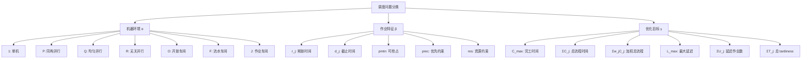
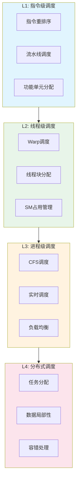

# 01.1 调度模型抽象

---

📌 **内容摘要**

本文档深入探讨调度模型抽象的核心原理和关键方法。内容涵盖调度理论基础领域的主要知识点，包括实时调度, EDF, 调度算法, 调度, 资源分配等关键主题。适合初学者建立基础知识体系。

**关键词**: 实时调度, EDF, 调度算法, 调度, 资源分配, CPU调度, 一致性, 截止时间

📚 **学习目标**
- 理解调度模型抽象的基本概念和核心原理
- 掌握相关术语和符号表示
- 能够分析和实现相关算法

🎯 **难度级别**: 初级

⏱️ **预计阅读时间**: 15分钟

**前置知识**: 基础数学知识, 算法与数据结构

---


> **交叉引用**: 源Matter中的调度系统文档
>
> - [Matter: 分布式调度框架](../../Matter/02_分布式系统/02.3_分布式调度.md)
> - [Matter: 操作系统调度](../../Matter/01_操作系统/01.4_进程调度.md)
> - [FormalRE: 实时调度系统](../../FormalRE/调度系统/实时调度核心理论.md)

---

## 01.1.1 统一调度问题形式化定义

### 01.1.1.1 基本调度三元组

**定义 01.1.1** (调度三元组). 调度问题可形式化为三元组 $\mathcal{S} = (\mathcal{J}, \mathcal{R}, \mathcal{O})$，其中：

- $\mathcal{J} = \{J_1, J_2, \ldots, J_n\}$：作业集合
- $\mathcal{R} = \{R_1, R_2, \ldots, R_m\}$：资源集合
- $\mathcal{O} \subseteq \mathcal{J} \times \mathcal{R} \times \mathbb{T}$：调度方案（作业-资源-时间分配关系）

### 01.1.1.2 作业的形式化描述

**定义 01.1.2** (作业). 作业 $J_i$ 是一个五元组：

$$J_i = (r_i, d_i, C_i, \vec{p}_i, \mathcal{D}_i)$$

其中：

| 符号 | 含义 | 类型 |
|------|------|------|
| $r_i$ | 释放时间 (release time) | $\mathbb{R}_{\geq 0}$ |
| $d_i$ | 截止时间 (deadline) | $\mathbb{R}_{\geq 0} \cup \{+\infty\}$ |
| $C_i$ | 计算需求 (computation requirement) | $\mathbb{R}_{>0}$ |
| $\vec{p}_i$ | 资源需求向量 | $\mathbb{R}_{\geq 0}^m$ |
| $\mathcal{D}_i$ | 依赖集合 | $2^{\mathcal{J}}$ |

### 01.1.1.3 资源的形式化描述

**定义 01.1.3** (资源). 资源 $R_j$ 是一个三元组：

$$R_j = (C_j^{\text{cap}}, \mathcal{F}_j, \mathcal{A}_j)$$

其中：

- $C_j^{\text{cap}}$：资源容量
- $\mathcal{F}_j$：功能集合
- $\mathcal{A}_j$：亲和性约束

---

## 01.1.2 调度问题的分类学

### 01.1.2.1 Graham表示法扩展

经典Graham三字段表示法 $\alpha|\beta|\gamma$ 扩展为统一调度分类：


### 01.1.2.2 资源约束扩展

**定义 01.1.4** (资源约束调度). 带资源约束的调度问题记为 $RCPSP$ (Resource-Constrained Project Scheduling Problem)：

$$\begin{aligned}
\text{minimize} \quad & C_{\max} = \max_{i} (s_i + p_i) \\
\text{subject to} \quad & s_i \geq r_i, \quad \forall J_i \in \mathcal{J} \\
& s_i + p_i \leq d_i, \quad \forall J_i \in \mathcal{J} \text{ (若硬实时)} \\
& \sum_{J_i \in \mathcal{A}(t)} r_{ik} \leq R_k, \quad \forall t, \forall k \\
& s_i + p_i \leq s_j, \quad \forall (J_i, J_j) \in \mathcal{P}
\end{aligned}$$

其中：
- $s_i$：作业 $J_i$ 的开始时间
- $p_i$：处理时间
- $r_{ik}$：作业 $J_i$ 对资源 $k$ 的需求
- $R_k$：资源 $k$ 的总容量
- $\mathcal{A}(t)$：时间 $t$ 正在执行的作业集合
- $\mathcal{P}$：优先约束集合

---

## 01.1.3 调度状态空间模型

### 01.1.3.1 状态转移系统

**定义 01.1.5** (调度状态机). 调度过程可建模为确定性的状态转移系统：

$$\mathcal{M} = (S, s_0, \mathcal{A}, \delta, \mathcal{G})$$

其中：
- $S$：状态空间，每个状态 $s \in S$ 包含所有作业的当前状态
- $s_0 \in S$：初始状态
- $\mathcal{A}$：动作集合（选择哪个作业在哪个资源上执行）
- $\delta: S \times \mathcal{A} \rightarrow S$：状态转移函数
- $\mathcal{G} \subseteq S$：目标状态集合

### 01.1.3.2 Rust实现：调度状态机框架

```rust
/// 调度系统的统一抽象
pub trait SchedulingSystem {
    type Job: Job;
    type Resource: Resource;
    type State: State;
    type Action: Action;

    /// 获取当前状态
    fn current_state(&self) -> &Self::State;

    /// 获取可用动作集合
    fn available_actions(&self) -> Vec<Self::Action>;

    /// 执行动作，返回新状态
    fn apply(&mut self, action: Self::Action) -> Result<Self::State, SchedulingError>;

    /// 判断是否为终止状态
    fn is_terminal(&self) -> bool;

    /// 计算目标函数值
    fn objective_value(&self) -> f64;
}

/// 作业trait
pub trait Job: Clone + Debug {
    fn id(&self) -> JobId;
    fn release_time(&self) -> Time;
    fn deadline(&self) -> Option<Time>;
    fn processing_time(&self) -> Duration;
    fn resource_requirements(&self) -> ResourceVector;
    fn dependencies(&self) -> &[JobId];
}

/// 资源trait
pub trait Resource: Clone + Debug {
    fn id(&self) -> ResourceId;
    fn capacity(&self) -> Capacity;
    fn capabilities(&self) -> &CapabilitySet;
    fn is_compatible_with(&self, job: &impl Job) -> bool;
}

/// 调度状态
# [derive(Clone, Debug)]
pub struct ScheduleState<J: Job, R: Resource> {
    /// 当前时间
    pub current_time: Time,
    /// 待调度作业队列
    pub pending: VecDeque<J>,
    /// 正在执行的作业: (作业, 资源, 开始时间)
    pub executing: Vec<(J, R, Time)>,
    /// 已完成作业
    pub completed: Vec<(J, Time)>, // (作业, 完成时间)
    /// 资源可用时间
    pub resource_available: HashMap<ResourceId, Time>,
}

impl<J: Job, R: Resource> ScheduleState<J, R> {
    /// 检查资源约束是否满足
    pub fn check_resource_constraints(&self, time: Time) -> bool {
        // 统计各资源的使用量
        let mut usage: HashMap<ResourceId, Capacity> = HashMap::new();

        for (job, resource, start_time) in &self.executing {
            let processing_time = job.processing_time();
            if *start_time <= time && time < *start_time + processing_time {
                *usage.entry(resource.id()).or_insert(0) +=
                    job.resource_requirements().get(&resource.id()).copied().unwrap_or(0);
            }
        }

        // 检查是否超过容量
        usage.iter().all(|(res_id, used)| {
            // 需要访问资源定义来检查容量
            true // 简化实现
        })
    }

    /// 获取就绪作业集合（依赖已满足）
    pub fn ready_jobs(&self) -> Vec<&J> {
        let completed_ids: HashSet<_> = self.completed.iter()
            .map(|(j, _)| j.id())
            .collect();

        self.pending.iter()
            .filter(|job| {
                job.dependencies().iter()
                    .all(|dep| completed_ids.contains(dep))
            })
            .collect()
    }
}
```
---

## 01.1.4 层次化调度模型

### 01.1.4.1 多层级调度抽象


### 01.1.4.2 层次间交互模型

**定义 01.1.6** (层次化调度). 设调度层次为 $\mathcal{L} = \{L_1, L_2, \ldots, L_k\}$，则层次间交互定义为：

$$\forall L_i, L_j \in \mathcal{L}, i < j: \quad \mathcal{I}_{ij}: \mathcal{S}_i \times \mathcal{A}_i \rightarrow \mathcal{S}_j \times \mathcal{A}_j$$

其中 $\mathcal{I}_{ij}$ 表示从层次 $i$ 到层次 $j$ 的信息和控制传递。

---

## 01.1.5 定理与性质

### 01.1.5.1 调度存在性定理

**定理 01.1.1** (调度可行性). 对于资源约束调度问题 $RCPSP$，可行调度存在的必要条件是：

$$\forall t \in [0, T], \forall k: \sum_{J_i \in \mathcal{R}(t)} r_{ik} \leq R_k$$

其中 $\mathcal{R}(t) = \{J_i : r_i \leq t < d_i\}$ 是时间 $t$ 活跃的作业集合。

*证明概要*: 若存在某时刻 $t$ 和资源 $k$ 使得 $\sum r_{ik} > R_k$，则资源约束无法满足，调度不可行。$\square$

### 01.1.5.2 调度最优性条件

**定理 01.1.2** (最优调度特征). 对于 $1||\sum C_j$ 问题，最优调度满足：

$$\text{Shortest Processing Time (SPT) 规则}$$

即作业按处理时间非降序排列：$p_{(1)} \leq p_{(2)} \leq \ldots \leq p_{(n)}$。

*证明*:

$$\sum_{j=1}^n C_j = \sum_{j=1}^n \sum_{i=1}^j p_{(i)} = \sum_{j=1}^n (n-j+1) p_{(j)}$$

由交换论证，若存在 $p_{(i)} > p_{(i+1)}$，交换后目标函数减小。$\square$

---

## 01.1.6 C++伪代码：统一调度框架

```cpp
# pragma once
# include <vector>
# include <queue>
# include <memory>
# include <functional>
# include <optional>

namespace scheduling {

template<typename T>
using Time = T;

template<typename T>
using Duration = T;

// 作业基类
template<typename ResourceId, typename TimeType>
struct Job {
    using Id = size_t;

    Id id;
    Time<TimeType> release_time;
    std::optional<Time<TimeType>> deadline;
    Duration<TimeType> processing_time;
    std::vector<ResourceId> required_resources;
    std::vector<Id> dependencies;

    // 优先级权重（用于加权目标）
    double weight = 1.0;

    bool is_ready(const std::vector<bool>& completed) const {
        for (auto dep : dependencies) {
            if (!completed[dep]) return false;
        }
        return true;
    }
};

// 资源基类
template<typename ResourceId, typename CapacityType>
struct Resource {
    ResourceId id;
    CapacityType capacity;

    // 当前分配量
    CapacityType allocated{0};

    bool can_allocate(CapacityType request) const {
        return allocated + request <= capacity;
    }

    void allocate(CapacityType amount) {
        allocated += amount;
    }

    void release(CapacityType amount) {
        allocated -= amount;
    }
};

// 调度策略接口
template<typename JobType, typename ResourceType, typename StateType>
class SchedulingPolicy {
public:
    virtual ~SchedulingPolicy() = default;

    // 选择下一个要调度的作业
    virtual std::optional<typename JobType::Id> select_job(
        const StateType& state,
        const std::vector<JobType>& ready_jobs
    ) = 0;

    // 选择资源分配
    virtual std::optional<typename ResourceType::Id> select_resource(
        const StateType& state,
        const JobType& job,
        const std::vector<ResourceType>& available_resources
    ) = 0;
};

// 统一调度器
template<typename JobType, typename ResourceType>
class UnifiedScheduler {
public:
    using JobId = typename JobType::Id;
    using ResourceId = typename ResourceType::Id;
    using TimeType = double;
    using State = ScheduleState<JobType, ResourceType>;

    struct ScheduleResult {
        std::vector<std::tuple<JobId, TimeType, TimeType>> schedule; // (job_id, start, finish)
        TimeType makespan;
        double objective_value;
        bool feasible;
    };

    UnifiedScheduler(
        std::vector<JobType> jobs,
        std::vector<ResourceType> resources
    ) : jobs_(std::move(jobs)), resources_(std::move(resources)) {}

    // 执行调度
    template<typename Policy>
    ScheduleResult schedule(Policy& policy) {
        State state;
        state.current_time = 0;
        state.pending = initialize_pending_queue();
        state.completed.resize(jobs_.size(), false);

        while (!is_complete(state)) {
            // 1. 更新执行中作业
            update_executing(state);

            // 2. 获取就绪作业
            auto ready = get_ready_jobs(state);

            // 3. 尝试调度就绪作业
            for (const auto& job : ready) {
                auto available = get_available_resources(job);
                auto selected_resource = policy.select_resource(state, job, available);

                if (selected_resource.has_value()) {
                    assign_job(state, job, selected_resource.value());
                }
            }

            // 4. 推进时间
            advance_time(state);
        }

        return build_result(state);
    }

private:
    std::vector<JobType> jobs_;
    std::vector<ResourceType> resources_;

    struct ScheduleState {
        TimeType current_time;
        std::queue<JobType> pending;
        std::vector<std::tuple<JobType, ResourceType, TimeType>> executing;
        std::vector<bool> completed;
        std::vector<TimeType> completion_times;
    };

    // ... 辅助方法实现
};

} // namespace scheduling
```

---

## 01.1.7 总结与延伸阅读

| 概念 | 数学符号 | 实际系统对应 |
|------|----------|--------------|
| 作业 | $J_i$ | 进程/线程/任务/内核 |
| 资源 | $R_j$ | CPU/GPU/内存/网络带宽 |
| 调度方案 | $\sigma$ | 调度器的实际决策序列 |
| 目标函数 | $f(\sigma)$ | 延迟/吞吐量/利用率/能耗 |

**延伸阅读**:
- [01.2 调度算法分析](./01.2_调度算法分析.md) - 复杂度与近似比
- [01.3 调度等价性](./01.3_调度等价性.md) - 模型间的转换关系
- [02.1 CPU调度](../02_硬件调度/02.1_CPU调度.md) - 指令级与线程级调度
---

## 📚 延伸阅读

- [02.1 CPU调度](../02_硬件调度/02.1_CPU调度.md)
- [01.1 调度问题定义](../01_调度理论基础/01.1_调度问题定义.md)
- [03.1 进程调度](../03_OS调度/03.1_进程调度.md)
- [01.2 调度算法分析](../01_调度理论基础/01.2_调度算法分析.md)
- [01.3 调度等价性](../01_调度理论基础/01.3_调度等价性.md)
