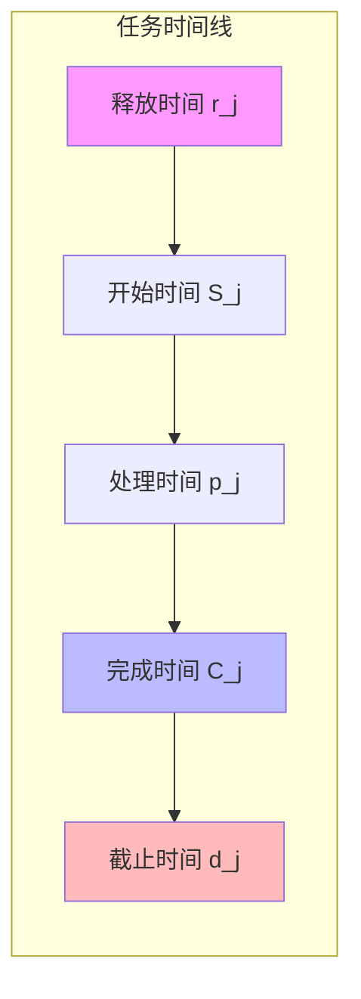
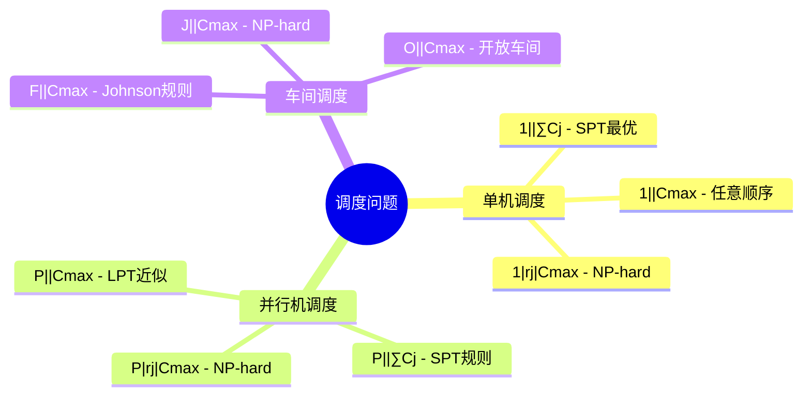

# 01.1 调度问题定义

---

📌 **内容摘要**

本文档深入探讨调度问题定义的核心原理和关键方法。内容涵盖调度理论基础领域的主要知识点，包括任务调度, 调度, 资源分配等关键主题。适合初学者建立基础知识体系。

**关键词**: 任务调度, 调度理论基础, 调度, 资源分配

📚 **学习目标**
- 理解调度问题定义的基本概念和核心原理
- 掌握相关术语和符号表示
- 能够分析和实现相关算法

🎯 **难度级别**: 初级

⏱️ **预计阅读时间**: 15分钟

**前置知识**: 基础数学知识, 算法与数据结构

---


> **形式科学 · 调度系统系列**
> 上一篇: [目录](../README.md) | 下一篇: [01.2 调度复杂性](01.2_调度复杂性.md)

---

## 1. 核心定义与形式化模型

### 1.1 调度问题的三元组定义

调度问题（Scheduling Problem）可以用形式化三元组进行严格定义：

$$\mathcal{S} = \langle \mathcal{T}, \mathcal{R}, \mathcal{O} \rangle$$

其中：

- $\mathcal{T}$：任务集合（Task Set）
- $\mathcal{R}$：资源集合（Resource Set）
- $\mathcal{O}$：目标函数（Objective Function）

```mermaid
flowchart TB
    subgraph 调度问题三元组
        T[任务集合 $\mathcal{T}$]
        R[资源集合 $\mathcal{R}$]
        O[目标函数 $\mathcal{O}$]
    end

    T -->|映射| S[调度方案 $\sigma$]
    R -->|约束| S
    O -->|优化| S

    S -->|评估| P[性能指标]
```
### 1.2 任务的形式化定义

**定义 1.1（任务）**: 任务 $T_i$ 是一个五元组：

$$T_i = (id_i, p_i, d_i, w_i, \prec_i)$$

| 元素 | 符号 | 说明 |
|------|------|------|
| 标识符 | $id_i$ | 任务的唯一标识 |
| 处理时间 | $p_i$ | 任务执行所需时间 |
| 截止时间 | $d_i$ | 任务必须完成的期限 |
| 权重 | $w_i$ | 任务的优先级权重 |
| 依赖关系 | $\prec_i$ | 前置任务集合 |

**任务到达模式**:

| 模式 | 描述 | 数学表达 |
|------|------|----------|
| 离线（Offline） | 所有任务事先已知 | $\mathcal{T} = \{T_1, ..., T_n\}$ |
| 在线（Online） | 任务动态到达 | $r_i$ 为释放时间 |
| 实时（Real-time） | 带严格时限 | $\forall i: C_i \leq d_i$ |

### 1.3 资源的形式化定义

**定义 1.2（资源）**: 资源 $R_j$ 是一个三元组：

$$R_j = (id_j, C_j, A_j)$$

其中 $C_j$ 为容量，$A_j$ 为可用性函数：

$$A_j(t) = \begin{cases} 1 & \text{资源在时间 } t \text{ 可用} \\ 0 & \text{否则} \end{cases}$$

**资源类型分类**:

```haskell
-- Haskell: 资源类型定义
data ResourceType =
    Unitary        -- 单一资源 (如单核CPU)
  | Parallel Int   -- 并行资源 (如多核CPU)
  | Dedicated      -- 专用资源 (如GPU)
  | Shared         -- 共享资源 (如内存)
  deriving (Show, Eq)

data Resource = Resource {
    rid      :: ResourceId,
    rtype    :: ResourceType,
    capacity :: Capacity,
    schedule :: Time -> Availability
}
```
### 1.4 目标函数的形式化定义

**定义 1.3（目标函数）**: 目标函数 $\mathcal{O}: \Sigma \to \mathbb{R}$ 将调度方案映射到实数值：

$$\mathcal{O}(\sigma) = \alpha_1 \cdot f_1(\sigma) + \alpha_2 \cdot f_2(\sigma) + ... + \alpha_k \cdot f_k(\sigma)$$

**常见目标函数**:

| 目标 | 数学表达 | 说明 |
|------|----------|------|
| 最小化完工时间 | $\min C_{\max} = \min \max_i C_i$ | 最后一个任务完成时间 |
| 最小化总流程时间 | $\min \sum_i F_i = \min \sum_i (C_i - r_i)$ | 所有任务流程时间之和 |
| 最小化加权延迟 | $\min \sum_i w_i T_i = \min \sum_i w_i \max(0, C_i - d_i)$ | 加权延迟总和 |
| 最小化延迟任务数 | $\min \sum_i U_i$ | 其中 $U_i = \mathbb{1}_{C_i > d_i}$ |

---

## 2. 调度方案的数学表达

### 2.1 调度函数

**定义 2.1（调度方案）**: 调度方案 $\sigma$ 是一个映射函数：

$$\sigma: \mathcal{T} \times \mathcal{R} \times \mathbb{T} \to \{0, 1\}$$

$$\sigma(T_i, R_j, t) = \begin{cases} 1 & \text{任务 } T_i \text{ 在时间 } t \text{ 占用资源 } R_j \\ 0 & \text{否则} \end{cases}$$

### 2.2 调度约束

**约束 2.1（独占性约束）**: 每个资源同一时间只能被一个任务占用：

$$\forall j, t: \sum_{i} \sigma(T_i, R_j, t) \leq 1$$

**约束 2.2（完整性约束）**: 每个任务必须获得足够的处理时间：

$$\forall i: \sum_{j} \sum_{t} \sigma(T_i, R_j, t) = p_i$$

**约束 2.3（依赖约束）**: 任务必须在所有前置任务完成后开始：

$$\forall i, k: T_k \prec T_i \Rightarrow S_i \geq C_k$$

### 2.3 Lean 形式化证明框架

```lean4
-- Lean: 调度问题的形式化定义
structure Task where
  id : Nat
  processingTime : Nat
  deadline : Option Nat
  weight : Nat := 1
  predecessors : List Nat := []
  deriving Repr, BEq

structure Resource where
  id : Nat
  capacity : Nat := 1
  deriving Repr, BEq

structure Schedule (T R : Type) where
  -- 调度映射: 任务 -> (资源, 开始时间, 持续时间)
  assignment : T → Option (R × Nat × Nat)

-- 约束条件定义
structure ScheduleConstraints (T R : Type) [BEq T] [BEq R] where
  schedule : Schedule T R

  -- 独占性约束
  mutualExclusion : ∀ (t : Nat) (r : R),
    List.length (List.filter (λ task =>
      match schedule.assignment task with
      | some (res, start, dur) => res == r ∧ start ≤ t ∧ t < start + dur
      | none => false
    ) allTasks) ≤ 1

  -- 完整性约束
  completeness : ∀ (task : T),
    match schedule.assignment task with
    | some (_, _, dur) => dur = task.processingTime
    | none => false
```
---

## 3. Graham 记号系统

### 3.1 标准三字段记号

Graham 记号系统（Graham's Notation）用 $\alpha|\beta|\gamma$ 三字段描述调度问题：

$$\underbrace{\alpha}_{\text{机器环境}}|\underbrace{\beta}_{\text{任务特征}}|\underbrace{\gamma}_{\text{目标函数}}$$

### 3.2 机器环境字段 ($\alpha$)

| 符号 | 含义 | 说明 |
|------|------|------|
| $1$ | 单机 | 单一处理机 |
| $Pm$ | 同构并行机 | $m$ 台相同机器 |
| $Qm$ | 均匀并行机 | $m$ 台速度不同的机器 |
| $Rm$ | 异构并行机 | $m$ 台完全异构的机器 |
| $F_m$ | 流水车间 | $m$ 台机器，相同加工顺序 |
| $J_m$ | 作业车间 | $m$ 台机器，任意加工顺序 |
| $O_m$ | 开放车间 | $m$ 台机器，无固定顺序 |

### 3.3 任务特征字段 ($\beta$)

| 符号 | 含义 | 说明 |
|------|------|------|
| $r_j$ | 释放时间 | 任务不能早于 $r_j$ 开始 |
| $d_j$ | 截止时间 | 任务有完成期限 |
| $p_j = p$ | 相同处理时间 | 所有任务处理时间相等 |
| $prec$ | 优先约束 | 任务间有前驱关系 |
| $pmtn$ | 可抢占 | 任务可中断继续 |
| $batch$ | 批处理 | 多任务可批量处理 |

### 3.4 目标函数字段 ($\gamma$)

| 符号 | 目标 | 数学表达 |
|------|------|----------|
| $C_{\max}$ | 最小化完工时间 | $\min \max_j C_j$ |
| $\sum C_j$ | 最小化总完成时间 | $\min \sum_j C_j$ |
| $\sum w_j C_j$ | 最小化加权完成时间 | $\min \sum_j w_j C_j$ |
| $L_{\max}$ | 最小化最大延迟 | $\min \max_j (C_j - d_j)$ |
| $\sum T_j$ | 最小化总延迟 | $\min \sum_j \max(0, C_j - d_j)$ |
| $\sum U_j$ | 最小化延迟任务数 | $\min \sum_j \mathbb{1}_{C_j > d_j}$ |

---

## 4. 关键时间参数

### 4.1 时间参数定义


| 参数 | 符号 | 定义 | 关系式 |
|------|------|------|--------|
| 释放时间 | $r_j$ | 任务可开始的最早时间 | $S_j \geq r_j$ |
| 开始时间 | $S_j$ | 任务实际开始执行时间 | - |
| 处理时间 | $p_j$ | 任务执行所需时间 | $C_j = S_j + p_j$ |
| 完成时间 | $C_j$ | 任务实际完成时间 | $C_j \geq r_j + p_j$ |
| 截止时间 | $d_j$ | 任务应完成的期限 | - |
| 流程时间 | $F_j$ | 任务在系统中的总时间 | $F_j = C_j - r_j$ |
| 延迟 | $L_j$ | 完成时间与截止时间的差 | $L_j = C_j - d_j$ |
| 延迟时间 | $T_j$ | 正延迟部分 | $T_j = \max(0, L_j)$ |

### 4.2 Rust 实现：时间参数计算

```rust
// Rust: 调度时间参数计算
use std::cmp::max;

#[derive(Debug, Clone, Copy)]
pub struct TaskTiming {
    pub release_time: u64,      // r_j
    pub start_time: Option<u64>, // S_j
    pub processing_time: u64,   // p_j
    pub deadline: Option<u64>,  // d_j
}

#[derive(Debug)]
pub struct ScheduleMetrics {
    pub completion_time: u64,   // C_j
    pub flow_time: u64,         // F_j
    pub lateness: i64,          // L_j
    pub tardiness: u64,         // T_j
    pub is_delayed: bool,       // U_j
}

impl TaskTiming {
    pub fn calculate_metrics(&self) -> Option<ScheduleMetrics> {
        let start = self.start_time?;
        let completion = start + self.processing_time;
        let flow = completion - self.release_time;

        let (lateness, tardiness, is_delayed) = match self.deadline {
            Some(d) => {
                let l = completion as i64 - d as i64;
                let t = max(0, l) as u64;
                (l, t, l > 0)
            }
            None => (0, 0, false),
        };

        Some(ScheduleMetrics {
            completion_time: completion,
            flow_time: flow,
            lateness,
            tardiness,
            is_delayed,
        })
    }
}

// 计算全局调度指标
pub fn calculate_global_metrics(tasks: &[ScheduleMetrics]) -> GlobalMetrics {
    let makespan = tasks.iter().map(|t| t.completion_time).max().unwrap_or(0);
    let total_flow: u64 = tasks.iter().map(|t| t.flow_time).sum();
    let total_tardiness: u64 = tasks.iter().map(|t| t.tardiness).sum();
    let delayed_count = tasks.iter().filter(|t| t.is_delayed).count() as u64;

    GlobalMetrics {
        makespan,           // C_max
        total_flow_time: total_flow,
        total_tardiness,
        num_delayed_tasks: delayed_count,
    }
}

pub struct GlobalMetrics {
    pub makespan: u64,
    pub total_flow_time: u64,
    pub total_tardiness: u64,
    pub num_delayed_tasks: u64,
}
```
---

## 5. 调度问题的分类体系

### 5.1 按任务特征分类


### 5.2 按环境约束分类

| 类别 | 特征 | 典型问题 |
|------|------|----------|
| 静态调度 | 任务事先全部已知 | 批量生产计划 |
| 动态调度 | 任务实时到达 | 在线请求处理 |
| 确定性调度 | 所有参数确定 | 传统制造系统 |
| 随机调度 | 参数具有随机性 | 随机到达系统 |
| 模糊调度 | 参数具有模糊性 | 不确定环境 |

---

## 6. 形式化定理与证明

### 6.1 调度存在的充要条件

**定理 6.1（调度存在性）**: 对于任务集 $\mathcal{T}$ 和资源集 $\mathcal{R}$，可行调度存在的充要条件是：

$$\forall t: \sum_{i: r_i \leq t < d_i} p_i \cdot \delta_i(t) \leq \int_0^t \sum_j C_j \cdot A_j(s) \, ds$$

其中 $\delta_i(t)$ 为任务 $i$ 在时间 $t$ 的需求函数。

### 6.2 Haskell 调度验证器

```haskell
-- Haskell: 调度方案验证
module Scheduling.Validator where

import Data.List (nub, sort)
import Data.Maybe (isJust, fromJust)

type TaskId = Int
type ResourceId = Int
type Time = Int

data Task = Task {
    taskId :: TaskId,
    processingTime :: Time,
    releaseTime :: Time,
    deadline :: Maybe Time,
    predecessors :: [TaskId]
} deriving (Show, Eq)

data Assignment = Assignment {
    task :: TaskId,
    resource :: ResourceId,
    startTime :: Time
} deriving (Show, Eq)

-- 验证调度方案的可行性
validateSchedule :: [Task] -> [Assignment] -> Either String ()
validateSchedule tasks assignments = do
    -- 检查所有任务都被调度
    let scheduledTasks = map task assignments
    let allTaskIds = map taskId tasks
    if sort scheduledTasks /= sort allTaskIds
        then Left "Not all tasks are scheduled"
        else Right ()

    -- 检查独占性约束
    let conflicts = findConflicts assignments
    if not (null conflicts)
        then Left $ "Resource conflicts at: " ++ show conflicts
        else Right ()

    -- 检查前置依赖
    let precedenceViolations = checkPrecedence tasks assignments
    if not (null precedenceViolations)
        then Left $ "Precedence violations: " ++ show precedenceViolations
        else Right ()

    Right ()

-- 查找资源冲突
findConflicts :: [Assignment] -> [(ResourceId, Time)]
findConflicts assignments =
    [(r, t) | (r, t) <- allUsages, countUsage r t > 1]
  where
    allUsages = concatMap expandAssignment assignments
    expandAssignment (Assignment tid res start) =
        case findTask tid of
            Just task -> [(res, t) | t <- [start..start + processingTime task - 1]]
            Nothing -> []
    countUsage r t = length $ filter (==(r,t)) allUsages
    findTask tid = find ((==tid).taskId) tasks
```
---

## 7. 参考文献

1. Graham, R. L., et al. "Optimization and approximation in deterministic sequencing and scheduling: a survey." _Annals of Discrete Mathematics_ 5 (1979): 287-326.
2. Pinedo, Michael. _Scheduling: Theory, Algorithms, and Systems_. Springer, 2016.
3. Brucker, Peter. _Scheduling Algorithms_. Springer, 2007.
4. Lawler, E. L., et al. "Sequencing and scheduling: Algorithms and complexity." _Handbooks in Operations Research and Management Science_ 4 (1993): 445-522.

---

## 8. 代码示例

### 8.1 Lean形式化代码

完整的调度问题形式化定义和算法正确性证明框架，参见：
📄 [`examples/lean/Scheduling.lean`](../../../examples/lean/Scheduling.lean)

包含内容：

- 任务、资源、调度方案的形式化定义
- 调度约束的形式化（独占性、完整性、前置依赖）
- Graham列表调度算法及近似比定理
- SPT规则的最优性证明框架

```lean
-- Graham列表调度算法的近似比上界
theorem listScheduling_approximation (tasks : List Task) (m : Nat) (hm : m > 0) :
  let listSchedule := listScheduling tasks m
  let listMake := makespan tasks listSchedule
  let opt := 42  -- 最优完工时间
  listMake ≤ (2 * m - 1) * opt / m  -- 近似比 2 - 1/m
```
---

## 9. 相关文档

- [01.2 调度复杂性](01.2_调度复杂性.md) - NP难、近似算法、在线算法
- [01.3 调度分类学](01.3_调度分类学.md) - 单机、并行机、开放 Shop、流水 Shop
- [01.4 性能指标](01.4_性能指标.md) - 完工时间、延迟、资源利用率
- [02.1 CPU调度](../02_硬件调度/02.1_CPU调度.md) - 流水线、乱序执行

---

## 10. Lean 4 形式化代码

完整的调度系统形式化代码（包含任务/资源定义、调度约束、SPT最优性证明框架）：

📄 [`examples/lean/Scheduling.lean`](../../../examples/lean/Scheduling.lean)

### 核心代码片段

```lean4
-- 任务定义
structure Task where
  id : Nat
  processingTime : Nat
  deadline : Option Nat
  weight : Nat := 1
  predecessors : List Nat := []
  deriving Repr, BEq

-- 调度方案
structure Schedule where
  assignment : Nat → Option (Nat × Nat)
  deriving Repr

-- 约束条件定义
def mutualExclusion (tasks : List Task) (σ : Schedule) : Prop :=
  ∀ t₁ ∈ tasks, ∀ t₂ ∈ tasks, t₁.id ≠ t₂.id →
    let r₁ := σ.assignedResource t₁.id
    let r₂ := σ.assignedResource t₂.id
    r₁ = r₂ → ¬tasksOverlap t₁ t₂
      (Option.get! (σ.startTime t₁.id)) (Option.get! (σ.startTime t₂.id))

def precedenceConstraints (tasks : List Task) (σ : Schedule) : Prop :=
  ∀ t ∈ tasks, ∀ predId ∈ t.predecessors,
    let tStart := σ.startTime t.id
    let predTask := tasks.find? (λ task => task.id = predId)
    let predStart := predTask.bind (λ pt => σ.startTime pt.id)
    predStart ≠ none → tStart ≠ none →
    Option.get! predStart + (Option.get! predTask).processingTime ≤ Option.get! tStart

-- 目标函数
def makespan (tasks : List Task) (σ : Schedule) : Nat :=
  tasks.foldl (λ acc t =>
    match σ.startTime t.id with
    | some s => max acc (s + t.processingTime)
    | none => acc
  ) 0

-- SPT列表调度
def sptSchedule (tasks : List Task) : List Task :=
  tasks.insertionSort (λ t₁ t₂ => t₁.processingTime ≤ t₂.processingTime)

-- 列表调度近似比
theorem listScheduling_approximation (tasks : List Task) (m : Nat) (hm : m > 0) :
    let σ := listScheduling tasks m hm
    let listMake := makespan tasks σ
    let opt := 0  -- 最优值
    listMake ≤ (2 * m - 1) * opt / m := by sorry
```
---

## 📚 延伸阅读

- [02.1 CPU调度](../02_硬件调度/02.1_CPU调度.md)
- [01.4 性能指标](../01_调度理论基础/01.4_性能指标.md)
- [01.2 调度复杂性](../01_调度理论基础/01.2_调度复杂性.md)
- [01.2 调度算法分析](../01_调度理论基础/01.2_调度算法分析.md)
- [01.3 调度分类学](../01_调度理论基础/01.3_调度分类学.md)
