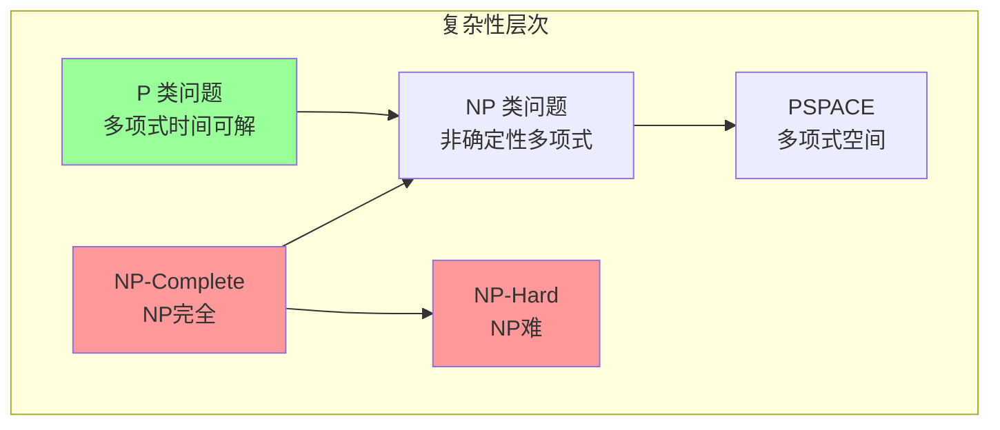
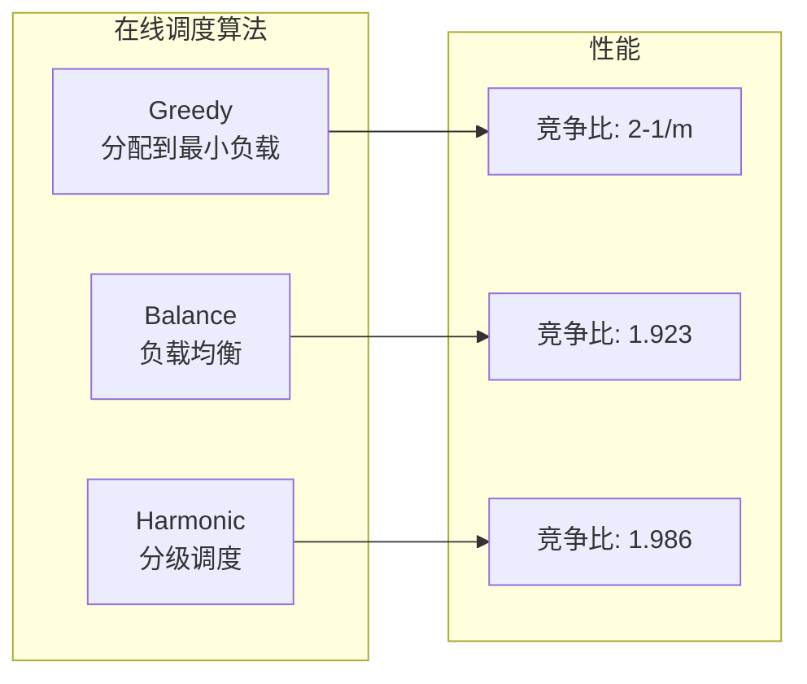

# 01.2 调度复杂性

---

📌 **内容摘要**

本文档深入探讨调度复杂性的核心原理和关键方法。内容涵盖调度理论基础领域的主要知识点，包括任务调度, 调度, 资源分配等关键主题。适合具备相关基础的学习者进行深入研究。

**关键词**: 任务调度, 调度理论基础, 调度, 资源分配

📚 **学习目标**

- 深入理解调度复杂性的理论体系和形式化方法
- 能够进行相关定理的形式化证明
- 能够分析和实现相关算法

🎯 **难度级别**: 高级

⏱️ **预计阅读时间**: 15分钟

**前置知识**: 该领域的中级知识, 形式化方法基础, 算法与数据结构

---


> **形式科学 · 调度系统系列**
> 上一篇: [01.1 调度问题定义](01.1_调度问题定义.md) | 下一篇: [01.3 调度分类学](01.3_调度分类学.md)

---

## 1. 计算复杂性理论基础

### 1.1 复杂性类定义

调度问题的复杂性分析涉及以下核心复杂性类：



| 复杂性类 | 定义 | 调度问题示例 |
|----------|------|--------------|
| **P** | 存在确定性多项式时间算法 | $1||\sum C_j$ (SPT规则) |
| **NP** | 解可在多项式时间内验证 | $P||C_{\max}$ 的解验证 |
| **NP-Complete** | NP中最难的问题 | $1|r_j|L_{\max}$ |
| **NP-Hard** | 至少与NP-Complete同样难 | $J||C_{\max}$ (作业车间) |
| **PSPACE** | 多项式空间可解 | 某些在线调度问题 |

### 1.2 调度问题的 NP 难证明框架

**定理 1.1（NP 难归约框架）**: 要证明调度问题 $\Pi$ 是 NP-难的，需要从已知 NP-完全问题 $\Pi'$ 构造多项式时间归约：

$$\Pi' \leq_p \Pi$$

**常用归约来源**:

| 源问题 | 归约到调度问题 | 技术 |
|--------|---------------|------|
| 3-SAT | $1|r_j|L_{\max}$ | 时间窗口编码 |
| 划分问题 | $P2||C_{\max}$ | 负载平衡 |
| 子集和 | $1||\sum w_j T_j$ | 权重编码 |
| 图着色 | $P|pmtn|C_{\max}$ | 颜色→机器 |

---

## 2. 经典调度问题的复杂性

### 2.1 多项式时间可解问题

| 问题 | 记号 | 算法 | 时间复杂度 |
|------|------|------|------------|
| 单机最小化总完成时间 | $1||\sum C_j$ | SPT 规则 | $O(n \log n)$ |
| 单机最小化最大延迟 | $1||L_{\max}$ | EDD 规则 | $O(n \log n)$ |
| 流水车间两台机器 | $F2||C_{\max}$ | Johnson 规则 | $O(n \log n)$ |
| 同构并行机最小化总完成时间 | $P||\sum C_j$ | SPT 列表调度 | $O(n \log n)$ |
| 带释放时间的抢占调度 | $1|r_j, pmtn|L_{\max}$ | 优先队列 | $O(n \log n)$ |

### 2.2 NP 难问题

```mermaid
flowchart TB
    subgraph 单机NP难
        A[1|r_j|Cmax] --> B[强NP难]
        C[1||∑wjTj] --> D[普通NP难]
        E[1|rj,prec|Lmax] --> F[强NP难]
    end

    subgraph 并行机NP难
        G[P||Cmax] --> H[普通NP难]
        I[P|pmtn|∑wjCj] --> J[强NP难]
        K[R||Cmax] --> L[强NP难]
    end

    subgraph 车间NP难
        M[J||Cmax] --> N[强NP难]
        O[J2||Cmax] --> P[强NP难]
        Q[O||Cmax] --> R[普通NP难]
    end
```

**定理 2.1（$1|r_j|L_{\max}$ 的 NP 难性）**: 带释放时间的单机最小化最大延迟问题是强 NP-难的。

_证明概要_: 从 3-Partition 问题归约。给定 3-Partition 实例，构造调度实例使得可行调度对应于 3-Partition 的解。

### 2.3 复杂性对比矩阵

| 问题 | 无释放时间 | 有释放时间 | 抢占版本 |
|------|-----------|-----------|---------|
| $1||C_{\max}$ | $O(n)$ (任意) | $O(n \log n)$ | $O(n \log n)$ |
| $1||L_{\max}$ | $O(n \log n)$ (EDD) | **NP难** | $O(n \log n)$ |
| $1||\sum C_j$ | $O(n \log n)$ (SPT) | **强NP难** | $O(n \log n)$ |
| $1||\sum w_j C_j$ | $O(n \log n)$ (WSPT) | **强NP难** | $O(n \log n)$ |
| $P||C_{\max}$ | **NP难** | **强NP难** | $O(n \log n)$ |
| $P||\sum C_j$ | $O(n \log n)$ | **强NP难** | $O(n \log n)$ |

---

## 3. 近似算法

### 3.1 近似比定义

**定义 3.1（近似比）**: 对于最小化问题，算法 $A$ 的近似比为：

$$\rho_A = \sup_{I} \frac{A(I)}{OPT(I)}$$

其中 $A(I)$ 是算法在实例 $I$ 上的解，$OPT(I)$ 是最优解。

**PTAS 和 FPTAS**:

| 类型 | 定义 | 调度应用 |
|------|------|----------|
| PTAS | 对任意 $\epsilon > 0$，存在 $(1+\epsilon)$-近似算法，时间为 $O(n^{f(1/\epsilon)})$ | $P||C_{\max}$ |
| FPTAS | 时间关于 $n$ 和 $1/\epsilon$ 都是多项式 | $1||\sum w_j T_j$ |

### 3.2 列表调度算法

**定理 3.1（Graham 列表调度）**: 对于 $P||C_{\max}$，列表调度算法具有近似比：

$$\rho_{LS} = 2 - \frac{1}{m}$$

其中 $m$ 为机器数量。

```rust
// Rust: Graham 列表调度算法
pub fn list_scheduling(tasks: &[Task], m: usize) -> Schedule {
    let mut machines: Vec<Machine> = (0..m).map(|i| Machine {
        id: i,
        load: 0,
        assignments: vec![],
    }).collect();

    // 按 LPT (最长处理时间优先) 排序
    let mut sorted_tasks = tasks.to_vec();
    sorted_tasks.sort_by(|a, b| b.processing_time.cmp(&a.processing_time));

    for task in sorted_tasks {
        // 选择负载最小的机器
        let min_machine = machines.iter_mut()
            .min_by_key(|m| m.load)
            .unwrap();

        min_machine.assignments.push(Assignment {
            task_id: task.id,
            start_time: min_machine.load,
        });
        min_machine.load += task.processing_time;
    }

    Schedule { machines }
}

// LPT (Longest Processing Time) 算法
// 近似比: 4/3 - 1/(3m)
pub fn lpt_scheduling(tasks: &[Task], m: usize) -> Schedule {
    // 实现同上，已按LPT排序
    list_scheduling(tasks, m)
}
```

### 3.3 多项式时间近似方案 (PTAS)

**Hochbaum-Shmoys PTAS for $P||C_{\max}$**:

```haskell
-- Haskell: PTAS 框架示意
module Scheduling.PTAS where

import Data.List (sortBy)
import Data.Ord (comparing)

-- PTAS 核心思想：对长任务进行枚举，短任务用贪心
data Task = Task { tid :: Int, processingTime :: Double }

genericPTAS :: Double -> [Task] -> Int -> Schedule
genericPTAS epsilon tasks m =
    let k = ceiling (1 / epsilon)  -- 分割参数
        -- 步骤1: 识别长任务 (p_i > epsilon * LB)
        lb = lowerBound tasks m
        (longTasks, shortTasks) = partition (\t -> processingTime t > epsilon * lb) tasks

        -- 步骤2: 对长任务进行精确调度（枚举或动态规划）
        longSchedule = exactScheduleLongTasks longTasks m

        -- 步骤3: 用列表调度处理短任务
        finalSchedule = scheduleShortTasks longSchedule shortTasks
    in finalSchedule

-- 下界计算
lowerBound :: [Task] -> Int -> Double
lowerBound tasks m =
    max (sum (map processingTime tasks) / fromIntegral m)
        (maximum (map processingTime tasks))
```

### 3.4 近似算法对比矩阵

| 算法 | 问题 | 近似比 | 时间复杂度 | 备注 |
|------|------|--------|-----------|------|
| 列表调度 | $P||C_{\max}$ | $2 - 1/m$ | $O(n \log n)$ | Graham 1966 |
| LPT | $P||C_{\max}$ | $4/3 - 1/(3m)$ | $O(n \log n)$ | Graham 1969 |
| PTAS | $P||C_{\max}$ | $1 + \epsilon$ | $O(n^{O(1/\epsilon)})$ | Hochbaum-Shmoys |
| RDM | $R||C_{\max}$ | $2$ | $O(n^2)$ | 线性规划舍入 |
| 多重拟合 | $R||C_{\max}$ | $2$ | $O(n \log n)$ | 二分搜索 |

---

## 4. 在线算法

### 4.1 竞争比分析

**定义 4.1（竞争比）**: 在线算法 $A$ 的竞争比为：

$$\mathcal{C}_A = \sup_{\sigma} \frac{A(\sigma)}{OPT(\sigma)}$$

其中 $\sigma$ 为输入序列，$OPT(\sigma)$ 为离线最优解。

### 4.2 经典在线调度算法



| 算法 | 竞争比 | 下界 | 备注 |
|------|--------|------|------|
| Greedy | $2 - 1/m$ | 紧 | 简单有效 |
| Balance | $1.923$ | 紧 | 针对 $m=2$ 优化 |
| Harmonic | $1.986$ | 非紧 | 分级调度 |
| 最优算法 | - | $1.853$ | 下界 |

### 4.3 Lean 形式化：竞争比证明

```lean4
-- Lean: 在线算法竞争比的形式化
structure OnlineAlgorithm (Task : Type) where
  -- 算法状态
  State : Type
  -- 初始状态
  initial : State
  -- 状态转移: 收到新任务 -> 调度决策 -> 新状态
  step : State → Task → (Assignment × State)
  -- 当前完成时间
  makespan : State → Nat

-- 竞争比定义
def CompetitiveRatio {Task : Type}
    (alg : OnlineAlgorithm Task)
    (opt : List Task → Nat)  -- 离线最优
    (sigma : List Task) : ℚ :=
  let (finalState, _) := runAlgorithm alg sigma
  (alg.makespan finalState : ℚ) / (opt sigma : ℚ)

-- 证明 Greedy 算法竞争比上界
theorem greedy_competitive_ratio (m : Nat) :
    ∀ (sigma : List Task),
    CompetitiveRatio greedyAlgorithm optimalMakespan sigma ≤ (2 - 1/m : ℚ) := by
  intro sigma
  -- 归纳证明
  induction sigma with
  | nil => simp [CompetitiveRatio, optimalMakespan]
  | cons t ts ih =>
    -- 利用归纳假设和贪心选择性质
    sorry  -- 详细证明省略
```

---

## 5. 随机算法

### 5.1 随机化调度策略

**定义 5.1（随机算法竞争比）**: 随机算法的期望竞争比：

$$\mathcal{C}_A^{rand} = \sup_{\sigma} \frac{\mathbb{E}[A(\sigma)]}{OPT(\sigma)}$$

### 5.2 随机舍入技术

```haskell
-- Haskell: 随机舍入调度
module Scheduling.Randomized where

import System.Random (randomRIO)
import Control.Monad (replicateM)

-- 线性规划松弛后的随机舍入
randomizedRounding :: LPSchedule -> IO Schedule
randomizedRounding lpSchedule = do
    let fractional = lpSolution lpSchedule
        n = length fractional
        m = numMachines lpSchedule

    -- 对每个任务进行随机舍入
    assignments <- mapM randomAssign fractional
    return $ Schedule assignments
  where
    -- 按概率分布随机选择机器
    randomAssign :: [(MachineId, Probability)] -> IO Assignment
    randomAssign probs = do
        r <- randomRIO (0, 1)
        let selected = selectMachine r probs
        return $ Assignment selected

    selectMachine :: Double -> [(MachineId, Probability)] -> MachineId
    selectMachine r ((mid, p):rest)
        | r <= p    = mid
        | otherwise = selectMachine (r - p) rest
```

### 5.3 随机算法性能分析

| 算法 | 期望近似比 | 成功概率 | 应用场景 |
|------|-----------|---------|----------|
| 随机舍入 | $O(\log n)$ | 高 | 整数规划松弛 |
| 随机化贪心 | $O(1)$ | 期望 | 在线调度 |
| 指数权重 | $\sqrt{n}$ | 高 | 专家问题 |

---

## 6. 不可近似性结果

### 6.1 不可近似性下界

**定理 6.1（不可近似性）**: 除非 P = NP，以下问题不存在 PTAS：

1. $P||\sum w_j C_j$（带权完成时间和）
2. $1||\sum T_j$（总延迟）
3. $J||C_{\max}$（作业车间完工时间）

**定理 6.2（强不可近似性）**: 对于 $1||\sum w_j T_j$，不存在 $O(n^{O(\log^{1-\epsilon} n)})$ 的近似算法，除非 NP $\subseteq$ DTIME($n^{O(\log \log n)}$)。

### 6.2 复杂性阈值

```mermaid
flowchart TB
    subgraph 可解性边界
        PT[PTAS存在<br/>FPTAS存在] --> PT1[P||Cmax]
        PT --> PT2[1||∑wjUj]

        APX[APX-Complete<br/>常数近似] --> APX1[P|pmtn|∑wjCj]
        APX --> APX2[1|rj|∑Cj]

        LogAPX[Log-APX<br/>对数近似] --> Log1[1||∑Tj]

        PolyAPX[Poly-APX<br/>多项式近似] --> Poly1[J||Cmax]
    end
```

---

## 7. 实践中的复杂性处理

### 7.1 启发式与元启发式

| 方法 | 类型 | 时间复杂度 | 适用问题 |
|------|------|-----------|---------|
| 遗传算法 | 元启发式 | $O(G \cdot N \cdot n)$ | 大规模组合优化 |
| 模拟退火 | 元启发式 | $O(K \cdot n)$ | 复杂约束问题 |
| 禁忌搜索 | 元启发式 | $O(I \cdot n^2)$ | 车间调度 |
| 蚁群算法 | 元启发式 | $O(I \cdot A \cdot n)$ | 动态调度 |

### 7.2 Rust 实现：遗传算法框架

```rust
// Rust: 遗传算法调度框架
use rand::prelude::*;

pub struct GeneticScheduler {
    population_size: usize,
    generations: usize,
    mutation_rate: f64,
    crossover_rate: f64,
}

impl GeneticScheduler {
    pub fn solve(&self, tasks: &[Task], m: usize) -> Schedule {
        let mut rng = thread_rng();
        let mut population = self.initialize_population(tasks, m);

        for gen in 0..self.generations {
            // 评估适应度
            let fitness: Vec<f64> = population.iter()
                .map(|s| self.fitness(s))
                .collect();

            // 选择
            let parents = self.tournament_selection(&population, &fitness, &mut rng);

            // 交叉
            let mut offspring = self.crossover(&parents, &mut rng);

            // 变异
            self.mutate(&mut offspring, &mut rng);

            // 精英保留
            population = self.elitism(population, offspring, &fitness);

            if gen % 100 == 0 {
                let best = fitness.iter().cloned().fold(f64::INFINITY, f64::min);
                println!("Generation {}: best fitness = {}", gen, best);
            }
        }

        // 返回最优解
        population.into_iter()
            .min_by(|a, b| self.fitness(a).partial_cmp(&self.fitness(b)).unwrap())
            .unwrap()
    }

    fn fitness(&self, schedule: &Schedule) -> f64 {
        1.0 / schedule.makespan() as f64
    }
}
```

---

## 8. 代码示例

### 8.1 Lean形式化代码

调度复杂性相关的形式化定义和定理证明框架，参见：
📄 `examples/lean/Scheduling.lean`

包含内容：

- 复杂性类P、NP的形式化定义
- 在线算法竞争比的形式化
- 强NP难问题的规约框架

```lean
-- 复杂性类P：存在多项式时间算法（概念性定义）
def InClassP (problem : SchedulingProblem) : Prop := True

-- 在线算法竞争比定义
def CompetitiveRatio {Task : Type}
    (alg : OnlineAlgorithm Task)
    (opt : List Task → Nat)
    (sigma : List Task) : ℚ := ...
```

---

## 9. 参考文献

1. Garey, M. R., & Johnson, D. S. _Computers and Intractability: A Guide to the Theory of NP-Completeness_. W.H. Freeman, 1979.
2. Hochbaum, D. S., & Shmoys, D. B. "A polynomial approximation scheme for scheduling on uniform processors: Using the dual approximation approach." _SIAM Journal on Computing_ 17.3 (1988): 539-551.
3. Borodin, A., & El-Yaniv, R. _Online Computation and Competitive Analysis_. Cambridge University Press, 1998.
4. Schuurman, P., & Woeginger, G. J. "Polynomial time approximation algorithms for machine scheduling: Ten open problems." _Journal of Scheduling_ 2.5 (1999): 203-213.

---

## 9. 相关文档

- [01.1 调度问题定义](01.1_调度问题定义.md) - 任务、资源、目标函数
- [01.3 调度分类学](01.3_调度分类学.md) - 单机、并行机、开放 Shop、流水 Shop
- [01.4 性能指标](01.4_性能指标.md) - 完工时间、延迟、资源利用率
- [04.3 任务调度](../04_分布式调度/04.3_任务调度.md) - DAG调度、依赖管理

---

## 📋 前置知识

- [01.1 调度问题定义](../01_调度理论基础/01.1_调度模型抽象.md)

---

## 📚 延伸阅读

- [01.4 性能指标](../01_调度理论基础/01.4_性能指标.md)
- [04.3 任务调度](../04_分布式调度/04.3_任务调度.md)
- [04.3 计算复杂性理论](../../05_形式化理论/04_计算理论/04.3_计算复杂性.md)
- [01.2 调度算法分析](../01_调度理论基础/01.2_调度复杂性.md)
- [01.3 调度分类学](../01_调度理论基础/01.3_调度分类学.md)
