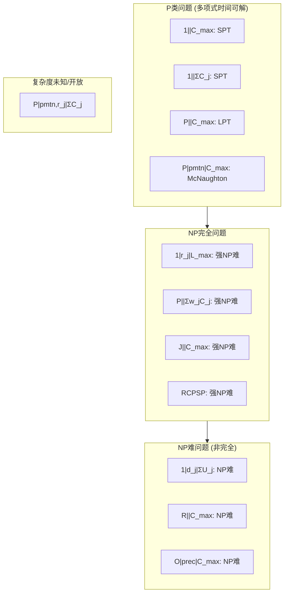

# 01.2 调度算法分析

---

📌 **内容摘要**

本文档深入探讨调度算法分析的核心原理和关键方法。内容涵盖调度理论基础领域的主要知识点，包括调度, 资源分配, 一致性, 共识算法, 任务调度等关键主题。适合初学者建立基础知识体系。

**关键词**: 调度, 资源分配, 一致性, 共识算法, 任务调度, 分布式系统, 调度理论基础

📚 **学习目标**
- 理解调度算法分析的基本概念和核心原理
- 掌握相关术语和符号表示
- 能够分析和实现相关算法

🎯 **难度级别**: 初级

⏱️ **预计阅读时间**: 15分钟

**前置知识**: 基础数学知识, 算法与数据结构

---


> **交叉引用**: 源Matter中的调度系统文档
>
> - [Matter: 调度算法复杂度](../../Matter/02_分布式系统/02.3_分布式调度.md#调度算法复杂度)
> - [FormalRE: 算法复杂度分析](../../FormalRE/算法复杂度/调度复杂度理论.md)

---

## 01.2.1 计算复杂度理论

### 01.2.1.1 调度问题的复杂度层次



### 01.2.1.2 强NP难性证明框架

**定理 01.2.1** (强NP难性). 问题 $1|r_j|L_{\max}$ 是强NP难的。

_证明概要_: 从3-Partition问题归约。

给定3-Partition实例：整数 $A$ 和 $n$ 个整数 $a_1, \ldots, a_{3n}$，满足 $\sum a_i = nA$ 且 $A/4 < a_i < A/2$。

构造调度实例：

- $3n$ 个普通作业：$J_i = (0, 3nA + a_i, a_i)$，即 $r_i = 0, d_i = 3nA + a_i, p_i = a_i$
- $n$ 个分隔作业：$S_j = ((3j-1)A, 3jA, A)$，即间隔 $A$ 时间单位的槽

存在可行调度 $\Leftrightarrow$ 存在3-Partition解。$\square$

---

## 01.2.2 近似算法与竞争比

### 01.2.2.1 近似比定义

**定义 01.2.1** (近似比). 对于最小化问题，算法 $\mathcal{A}$ 的近似比为：

$$\rho_{\mathcal{A}} = \sup_{I} \frac{\mathcal{A}(I)}{OPT(I)}$$

其中 $OPT(I)$ 是实例 $I$ 的最优解。

**定义 01.2.2** (PTAS与FPTAS).

- PTAS (Polynomial Time Approximation Scheme): 对任意 $\epsilon > 0$，存在 $(1+\epsilon)$-近似算法，时间为 $O(n^{f(1/\epsilon)})$
- FPTAS (Fully PTAS): 时间为 $O(poly(n, 1/\epsilon))$

### 01.2.2.2 经典调度问题的近似比

| 问题 | 算法 | 近似比 | 紧确性 |
|------|------|--------|--------|
| $P||C_{\max}$ | LPT | $4/3 - 1/(3m)$ | 紧 |
| $P||C_{\max}$ | List Scheduling | $2 - 1/m$ | 紧 |
| $P||\sum w_j C_j$ | WSPT | 2 | 紧 |
| $R||C_{\max}$ | 线性规划舍入 | 2 | 不紧 |
| $J||C_{\max}$ | 主动调度 | 2 | 紧 |

### 01.2.2.3 LPT算法分析

**定理 01.2.2** (LPT近似比). 对于 $P||C_{\max}$，LPT (Longest Processing Time first) 算法的近似比为：

$$\rho_{LPT} \leq \frac{4}{3} - \frac{1}{3m}$$

_证明_:

设 $C_{\max}^{LPT}$ 为LPT的完工时间，$C_{\max}^*$ 为最优完工时间。

关键引理：若LPT将作业 $J_k$ 分配给机器 $M_i$，则：

$$L_i + p_k \leq \frac{1}{m}\sum_{j=1}^n p_j + \frac{m-1}{m}p_k$$

其中 $L_i$ 是分配前机器 $i$ 的负载。

由于 $J_k$ 是最后一个开始执行的作业（决定完工时间），有：

$$C_{\max}^{LPT} = L_i + p_k$$

又 $C_{\max}^* \geq \frac{1}{m}\sum p_j$ 且 $C_{\max}^* \geq p_k$，联立得：

$$C_{\max}^{LPT} \leq C_{\max}^* + \frac{m-1}{m}p_k \leq \left(\frac{4}{3} - \frac{1}{3m}\right)C_{\max}^*$$

紧例：$m$ 个机器，$2m+1$ 个作业：

- $2m$ 个作业：$p_i = 2m - \lfloor(i+1)/2\rfloor + 1$，即 $2m, 2m, 2m-1, 2m-1, \ldots$
- 1个作业：$p_{2m+1} = m$

最优调度：$C_{\max}^* = 3m$
LPT调度：$C_{\max}^{LPT} = 4m - 1$ $\square$

---

## 01.2.3 在线调度与竞争分析

### 01.2.3.1 在线调度模型

**定义 01.2.3** (在线调度). 在线调度中，作业信息逐步到达：

- **时间在线**: 作业在时间 $r_j$ 到达，未知未来作业
- **非Clairvoyant**: 处理时间 $p_j$ 未知直到完成
- **完全在线**: 两者皆未知

### 01.2.3.2 竞争比下界定理

**定理 01.2.3** (在线List Scheduling下界). 对于 $P|online|C_{\max}$，任何确定性算法的竞争比至少为：

$$\rho \geq 2 - \frac{1}{m}$$

_证明_: 使用对抗性实例。

对抗者首先释放 $m$ 个大小为1的作业。若算法将两个作业分配到同一机器，后续释放 $m-2$ 个大小为 $\epsilon$ 的作业，竞争比 $\rightarrow 2$。

若算法均匀分配，后续释放一个大小为 $m$ 的作业，该机器负载 $m+1$，最优 $m + \epsilon$，竞争比 $\rightarrow 2 - 1/m$。$\square$

### 01.2.3.3 Rust实现：竞争分析框架

```rust
/// 在线调度算法接口
pub trait OnlineScheduler<J: Job> {
    /// 处理作业到达事件
    fn on_job_arrival(&mut self, job: J, time: Time);

    /// 处理作业完成事件
    fn on_job_completion(&mut self, job_id: JobId, time: Time);

    /// 获取当前调度决策
    fn get_schedule(&self) -> Vec<(JobId, ResourceId, Time)>;
}

/// 竞争比分析器
pub struct CompetitiveRatioAnalyzer<J: Job> {
    online_algorithm: Box<dyn OnlineScheduler<J>>,
    optimal_offline: Box<dyn OfflineScheduler<J>>,
    test_cases: Vec<TestCase<J>>,
}

impl<J: Job> CompetitiveRatioAnalyzer<J> {
    /// 计算竞争比上界
    pub fn analyze_competitive_ratio(&mut self) -> CompetitiveRatioResult {
        let mut max_ratio = 0.0;
        let mut worst_case: Option<TestCase<J>> = None;

        for test_case in &self.test_cases {
            // 运行在线算法
            let online_result = self.run_online(test_case);

            // 运行离线最优算法
            let offline_result = self.run_offline(test_case);

            // 计算比值
            let ratio = online_result.objective / offline_result.objective;

            if ratio > max_ratio {
                max_ratio = ratio;
                worst_case = Some(test_case.clone());
            }
        }

        CompetitiveRatioResult {
            upper_bound: max_ratio,
            worst_case,
            is_tight: self.verify_tightness(max_ratio),
        }
    }

    /// 生成对抗性测试用例
    pub fn generate_adversarial_cases(&self, params: AdversarialParams) -> Vec<TestCase<J>> {
        let mut cases = vec![];

        // 基于下界构造的对抗实例
        for m in params.machine_counts.iter() {
            // 构造迫使竞争比接近下界的实例
            let case = self.create_lower_bound_instance(*m);
            cases.push(case);
        }

        cases
    }

    fn create_lower_bound_instance(&self, m: usize) -> TestCase<J> {
        // 实现下界构造
        unimplemented!()
    }
}

/// List Scheduling在线实现
pub struct ListScheduler {
    machines: Vec<MachineState>,
    current_loads: Vec<Time>,
}

impl OnlineScheduler<SimpleJob> for ListScheduler {
    fn on_job_arrival(&mut self, job: SimpleJob, _time: Time) {
        // 贪婪分配到负载最小的机器
        let min_load_machine = self.current_loads
            .iter()
            .enumerate()
            .min_by(|a, b| a.1.partial_cmp(b.1).unwrap())
            .map(|(i, _)| i)
            .unwrap();

        self.current_loads[min_load_machine] += job.processing_time();
    }

    fn on_job_completion(&mut self, _job_id: JobId, _time: Time) {
        // List Scheduling不处理完成事件
    }

    fn get_schedule(&self) -> Vec<(JobId, ResourceId, Time)> {
        vec![] // 简化实现
    }
}
```

---

## 01.2.4 概率分析与随机算法

### 01.2.4.1 随机化调度算法

**定义 01.2.4** (随机调度). 随机调度算法 $\mathcal{A}_R$ 的期望竞争比：

$$\rho_{\mathcal{A}_R}^{exp} = \sup_{I} \frac{\mathbb{E}[\mathcal{A}_R(I)]}{OPT(I)}$$

### 01.2.4.2 随机舍入技术

**定理 01.2.4** (R||C_max的随机舍入). 对于无关并行机调度 $R||C_{\max}$，存在随机化 $O(\log m)$-近似算法。

_算法概要_:

1. 求解分配线性规划松弛
2. 以概率 $x_{ij}$ 将作业 $j$ 分配给机器 $i$
3. 重复直到所有作业被分配

_期望分析_:
机器 $i$ 的期望负载 $\mathbb{E}[L_i] = \sum_j p_{ij} x_{ij} \leq T$（LP最优值）

由Chernoff界，$\Pr[L_i > c \log m \cdot T] < 1/m^2$。

Union bound得 $\Pr[\max_i L_i > c \log m \cdot T] < 1/m$。$\square$

---

## 01.2.5 C++伪代码：复杂度分析工具

```cpp
#pragma once
#include <vector>
#include <functional>
#include <cmath>
#include <random>

namespace scheduling {
namespace complexity {

// 复杂度类枚举
enum class ComplexityClass {
    P,          // 多项式时间
    NP_COMPLETE,// NP完全
    NP_HARD,    // NP难
    STRONG_NP,  // 强NP难
    PSPACE,     // PSPACE完全
    UNKNOWN     // 未知
};

// 问题描述
template<typename Instance, typename Solution>
struct Problem {
    using InstanceType = Instance;
    using SolutionType = Solution;
    using ObjectiveFunc = std::function<double(const Solution&)>;

    std::string name;
    ComplexityClass known_complexity;
    ObjectiveFunc objective;

    // 验证解的正确性
    std::function<bool(const Instance&, const Solution&)> verifier;
};

// 近似算法分析器
template<typename Problem>
class ApproximationAnalyzer {
public:
    using Instance = typename Problem::InstanceType;
    using Solution = typename Problem::SolutionType;

    struct ApproximationResult {
        double max_ratio;
        double avg_ratio;
        Instance worst_case;
        bool is_tight;
        std::vector<double> ratios;
    };

    // 测试近似比
    template<typename Algorithm>
    ApproximationResult analyze(
        Algorithm& algo,
        const std::vector<Instance>& test_instances,
        std::function<Solution(const Instance&)> optimal_solver
    ) {
        ApproximationResult result;
        result.max_ratio = 0.0;
        double sum_ratio = 0.0;

        for (const auto& instance : test_instances) {
            // 算法解
            Solution algo_sol = algo.solve(instance);
            double algo_val = problem_.objective(algo_sol);

            // 最优解
            Solution opt_sol = optimal_solver(instance);
            double opt_val = problem_.objective(opt_sol);

            // 计算比值
            double ratio = algo_val / opt_val;
            result.ratios.push_back(ratio);
            sum_ratio += ratio;

            if (ratio > result.max_ratio) {
                result.max_ratio = ratio;
                result.worst_case = instance;
            }
        }

        result.avg_ratio = sum_ratio / test_instances.size();
        result.is_tight = verify_tightness(result.max_ratio);

        return result;
    }

    // 生成紧实例
    template<typename Algorithm>
    Instance generate_tight_instance(
        Algorithm& algo,
        double target_ratio,
        size_t max_attempts = 10000
    ) {
        for (size_t i = 0; i < max_attempts; ++i) {
            auto instance = random_instance_generator_();

            // 尝试找到接近目标比值的实例
            Solution algo_sol = algo.solve(instance);
            double algo_val = problem_.objective(algo_sol);

            // 使用LP松弛作为下界
            double lower_bound = lp_relaxation_bound(instance);

            double ratio = algo_val / lower_bound;
            if (std::abs(ratio - target_ratio) < 0.01) {
                return instance;
            }
        }

        throw std::runtime_error("Failed to generate tight instance");
    }

private:
    Problem problem_;
    std::function<Instance()> random_instance_generator_;

    double lp_relaxation_bound(const Instance& instance) {
        // 求解LP松弛
        return 0.0; // 简化实现
    }

    bool verify_tightness(double ratio) {
        // 验证是否达到理论下界
        return false; // 简化实现
    }
};

// LPT算法具体实现
class LPTAlgorithm {
public:
    struct ParallelInstance {
        size_t m; // 机器数
        std::vector<double> processing_times;
    };

    struct Schedule {
        std::vector<std::vector<size_t>> machine_jobs;
        double makespan;
    };

    Schedule solve(const ParallelInstance& instance) {
        Schedule schedule;
        schedule.machine_jobs.resize(instance.m);
        std::vector<double> loads(instance.m, 0.0);

        // 按处理时间降序排序作业索引
        std::vector<size_t> job_indices(instance.processing_times.size());
        std::iota(job_indices.begin(), job_indices.end(), 0);
        std::sort(job_indices.begin(), job_indices.end(),
            [&](size_t a, size_t b) {
                return instance.processing_times[a] > instance.processing_times[b];
            });

        // 贪婪分配
        for (size_t job_idx : job_indices) {
            double p = instance.processing_times[job_idx];

            // 找到负载最小的机器
            size_t min_machine = std::min_element(loads.begin(), loads.end()) - loads.begin();

            schedule.machine_jobs[min_machine].push_back(job_idx);
            loads[min_machine] += p;
        }

        schedule.makespan = *std::max_element(loads.begin(), loads.end());
        return schedule;
    }
};

} // namespace complexity
} // namespace scheduling
```

---

## 01.2.6 参数化复杂度与FPT算法

### 01.2.6.1 参数化调度

**定义 01.2.5** (FPT). 问题在参数 $k$ 下是FPT的，若存在算法时间为 $O(f(k) \cdot n^c)$。

调度问题的常见参数：

- $k$：机器数 $m$
- $k$：完工时间上界 $C_{\max}$
- $k$：并行度（最大同时执行作业数）

### 01.2.6.2 固定参数可解结果

| 问题 | 参数 | FPT结果 | 时间复杂度 |
|------|------|---------|-----------|
| $P_m||C_{\max}$ | $m$ | FPT | $O(2^m n)$ |
| $1||\sum T_j$ | $\sum p_j$ | FPT | $O^*(2^{\sum p_j})$ |
| $1|r_j|L_{\max}$ | $k$（释放时间数量） | FPT | $n^{O(k)}$ |

---

## 01.2.7 总结

| 分析维度 | 核心问题 | 关键工具 |
|----------|----------|----------|
| 最坏情况 | 近似比上界 | 紧实例构造、LP对偶 |
| 在线分析 | 竞争比 | 对抗论证、势函数 |
| 随机分析 | 期望性能 | 概率不等式、集中不等式 |
| 参数化 | 固定参数可解性 | 核化、 bounded search tree |

**延伸阅读**:

- [01.1 调度模型抽象](./01.1_调度模型抽象.md) - 统一调度模型
- [01.3 调度等价性](./01.3_调度等价性.md) - 模型间转换关系
---

## 📚 延伸阅读

- [01.1 调度模型抽象](../01_调度理论基础/01.1_调度模型抽象.md)
- [01.1 调度问题定义](../01_调度理论基础/01.1_调度问题定义.md)
- [01.3 调度等价性](../01_调度理论基础/01.3_调度等价性.md)
