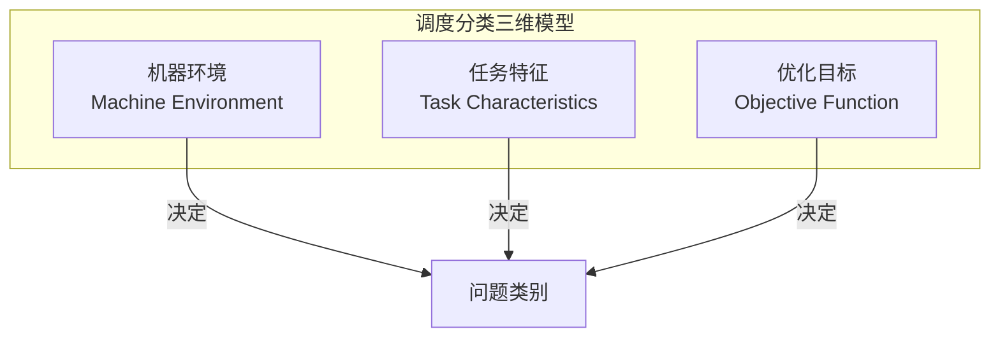
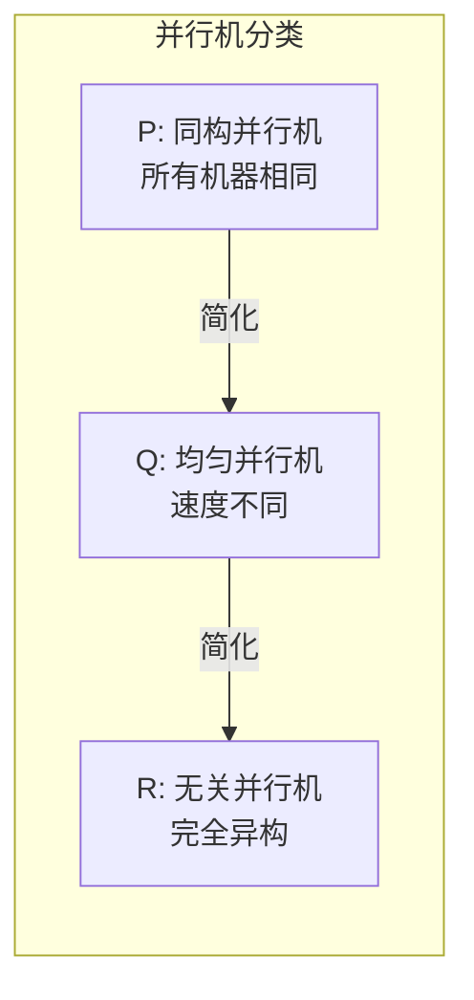
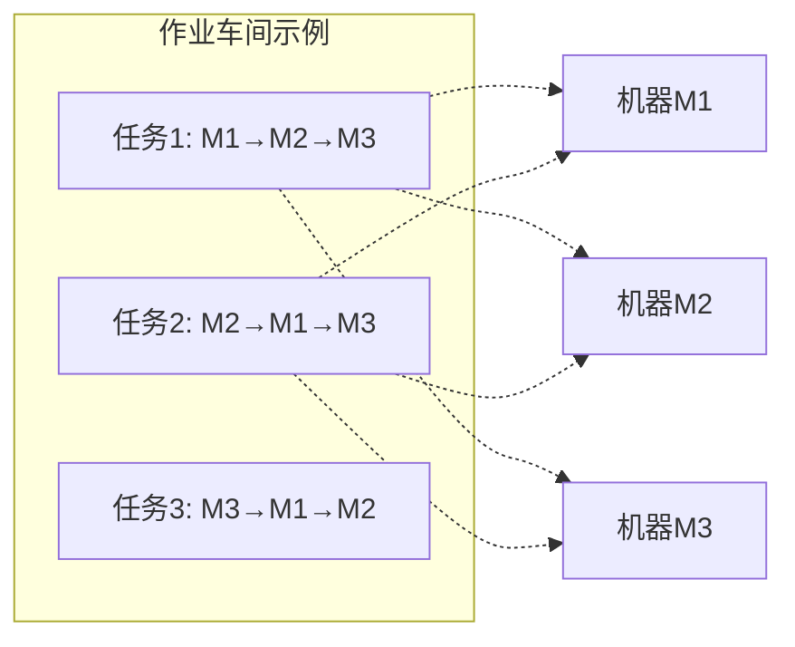
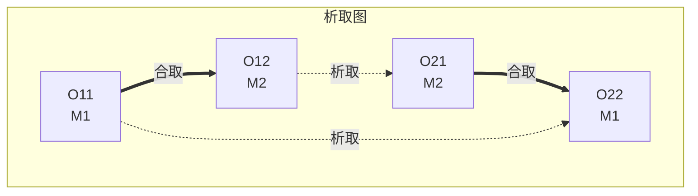

# 01.3 调度分类学

---

📌 **内容摘要**

本文档深入探讨调度分类学的核心原理和关键方法。内容涵盖调度理论基础领域的主要知识点，包括任务调度, 调度, 资源分配等关键主题。适合初学者建立基础知识体系。

**关键词**: 任务调度, 调度理论基础, 调度, 资源分配

📚 **学习目标**
- 理解调度分类学的基本概念和核心原理
- 掌握相关术语和符号表示
- 能够分析和实现相关算法

🎯 **难度级别**: 初级

⏱️ **预计阅读时间**: 15分钟

**前置知识**: 基础数学知识, 算法与数据结构

---


> **形式科学 · 调度系统系列**
> 上一篇: [01.2 调度复杂性](01.2_调度复杂性.md) | 下一篇: [01.4 性能指标](01.4_性能指标.md)

---

## 1. 调度问题分类框架

### 1.1 三维分类体系

调度问题可以从三个维度进行系统分类：



| 维度 | 主要类别 | 子类别 |
|------|----------|--------|
| **机器环境** | 单机、并行机、车间 | 同构/异构、流水/作业/开放 |
| **任务特征** | 约束类型、处理时间 | 释放时间、截止时间、抢占、依赖 |
| **优化目标** | 完工时间、延迟、成本 | 最大、总和、加权 |

### 1.2 形式化分类映射

$$\mathcal{P}: \mathcal{M} \times \mathcal{T} \times \mathcal{O} \to \mathbb{C}$$

其中：

- $\mathcal{M} = \{1, P_m, Q_m, R_m, F_m, J_m, O_m, ...\}$（机器环境集合）
- $\mathcal{T} = \{r_j, d_j, pmtn, prec, batch, ...\}$（任务特征集合）
- $\mathcal{O} = \{C_{\max}, L_{\max}, \sum C_j, \sum w_j T_j, ...\}$（目标函数集合）
- $\mathbb{C} = \{P, NP, NP\text{-}C, ...\}$（复杂性类别）

---

## 2. 单机调度 (Single Machine)

### 2.1 基本定义

**定义 2.1（单机调度）**: 所有任务在单台机器上按某种顺序处理，目标是最优化某个性能指标。

$$\text{机器}: M_1 \quad \text{容量}: C_1 = 1$$

### 2.2 单机调度问题图谱

```mermaid
flowchart TB
    subgraph 单机调度问题
        S1[1||Cmax] -->|平凡| A1[任意顺序<br/>O(n)]
        S2[1||∑Cj] -->|SPT| A2[最短处理时间优先<br/>O(n log n)]
        S3[1||Lmax] -->|EDD| A3[最早截止时间优先<br/>O(n log n)]
        S4[1|rj|Lmax] -->|NP难| A4[分支定界/启发式]
        S5[1||∑wjCj] -->|WSPT| A5[加权最短处理时间<br/>O(n log n)]
        S6[1||∑Uj] -->|Moore算法| A6[Moore-Hodgson算法<br/>O(n log n)]
    end
```

### 2.3 最优规则与算法

| 问题 | 记号 | 最优规则 | 时间复杂度 | 正确性证明 |
|------|------|----------|-----------|-----------|
| 最小化完工时间 | $1||C_{\max}$ | 任意顺序 | $O(n)$ | 平凡 |
| 最小化总流程时间 | $1||\sum C_j$ | SPT (最短处理时间优先) | $O(n \log n)$ | 相邻交换论证 |
| 最小化最大延迟 | $1||L_{\max}$ | EDD (最早截止时间优先) | $O(n \log n)$ | Jackson 规则 |
| 最小化延迟任务数 | $1||\sum U_j$ | Moore-Hodgson 算法 | $O(n \log n)$ | 贪心选择 |
| 最小化加权完成时间 | $1||\sum w_j C_j$ | WSPT (加权SPT) | $O(n \log n)$ | 比率规则 |

### 2.4 Lean 形式化：交换论证

```lean4
-- Lean: SPT规则最优性证明
structure SingleMachineSchedule (n : Nat) where
  -- 排列表示处理顺序
  permutation : Fin n → Fin n  -- 位置 -> 任务索引
  processingTimes : Fin n → Nat

-- SPT规则：按处理时间非递减排序
def sptSchedule (pt : Fin n → Nat) : SingleMachineSchedule n :=
  let sorted := sortBy (λ i => pt i) (List.range n)
  { permutation := λ pos => sorted.get! pos,
    processingTimes := pt }

-- 交换论证：如果存在逆序对，交换后目标函数不增加
theorem exchangeArgument {n : Nat} (pt : Fin n → Nat) :
    ∀ (σ : SingleMachineSchedule n),
    (∃ i j, i < j ∧ pt (σ.permutation i) > pt (σ.permutation j)) →
    let σ' := swap σ i j
    totalCompletionTime σ' ≤ totalCompletionTime σ := by
  intro σ h
  rcases h with ⟨i, j, h_ij, h_rev⟩
  -- 展开总完成时间定义
  unfold totalCompletionTime
  -- 证明交换后完成时间减少
  sorry  -- 详细计算省略

-- SPT最优性主定理
theorem sptOptimality (pt : Fin n → Nat) :
    ∀ (σ : SingleMachineSchedule n),
    totalCompletionTime (sptSchedule pt) ≤ totalCompletionTime σ := by
  -- 反证法 + 交换论证
  sorry
```

---

## 3. 并行机调度 (Parallel Machine)

### 3.1 并行机类型



| 类型 | 记号 | 定义 | 速度因子 |
|------|------|------|----------|
| 同构并行机 | $P_m$ | $m$ 台相同机器 | $s_1 = s_2 = ... = s_m = 1$ |
| 均匀并行机 | $Q_m$ | $m$ 台速度不同的机器 | $s_1, s_2, ..., s_m$ |
| 无关并行机 | $R_m$ | 任务-机器相关速度 | $v_{ij}$ 为任务 $i$ 在机器 $j$ 的速度 |

### 3.2 处理时间计算

对于任务 $T_j$ 在机器 $M_i$ 上的处理时间：

| 机器类型 | 处理时间公式 |
|----------|-------------|
| 同构 | $p_{ji} = p_j$ |
| 均匀 | $p_{ji} = p_j / s_i$ |
| 无关 | $p_{ji} = p_j / v_{ji}$ |

### 3.3 并行机调度算法

| 问题 | 复杂性 | 算法 | 近似比 |
|------|--------|------|--------|
| $P||C_{\max}$ | NP难 | LPT | $4/3 - 1/(3m)$ |
| $P||\sum C_j$ | P | SPT列表调度 | 最优 |
| $P|r_j|C_{\max}$ | 强NP难 | 列表调度 | $3 - 1/m$ |
| $Q||C_{\max}$ | NP难 | 多重拟合 | 2 |
| $R||C_{\max}$ | 强NP难 | 线性规划舍入 | 2 |

### 3.4 Haskell 实现：LPT 规则

```haskell
-- Haskell: LPT (Longest Processing Time) 规则
module Scheduling.ParallelMachine where

import Data.List (sortBy, sortOn)
import Data.Ord (comparing, Down(..))

type MachineId = Int
type TaskId = Int
type Time = Int

data Task = Task {
    taskId :: TaskId,
    processingTime :: Time
} deriving (Show, Eq)

data Machine = Machine {
    machineId :: MachineId,
    load :: Time,
    assignedTasks :: [(TaskId, Time)]  -- (任务, 开始时间)
} deriving (Show, Eq)

-- LPT算法：最长处理时间优先
lptSchedule :: [Task] -> Int -> [Machine]
lptSchedule tasks m =
    let -- 步骤1: 按处理时间降序排序
        sortedTasks = sortOn (Down . processingTime) tasks
        -- 步骤2: 初始化机器
        initialMachines = map (\i -> Machine i 0 []) [1..m]
        -- 步骤3: 贪心分配
    in foldl assignTask initialMachines sortedTasks
  where
    assignTask :: [Machine] -> Task -> [Machine]
    assignTask machines task =
        -- 选择当前负载最小的机器
        let minMachine = minimumBy (comparing load) machines
            newLoad = load minMachine + processingTime task
            updatedMachine = minMachine {
                load = newLoad,
                assignedTasks = assignedTasks minMachine ++
                    [(taskId task, load minMachine)]
            }
        in map (\m -> if machineId m == machineId minMachine
                      then updatedMachine
                      else m) machines

-- 计算完工时间 (makespan)
makespan :: [Machine] -> Time
makespan = maximum . map load
```

---

## 4. 流水车间调度 (Flow Shop)

### 4.1 定义与特征

**定义 4.1（流水车间）**: $m$ 台机器按固定顺序排列，所有任务必须经过相同的加工路径 $M_1 \to M_2 \to ... \to M_m$。

**关键约束**:

- 同一任务的工序有优先约束：$O_{i,j} \prec O_{i,j+1}$
- 无等待流水车间：任务完成 $M_j$ 后立即开始 $M_{j+1}$

### 4.2 Johnson 规则

**定理 4.1（Johnson 规则）**: 对于 $F2||C_{\max}$，最优调度为：

$$\mathcal{S}^* = \{T_i \mid p_{i1} \leq p_{i2}\} \text{ 按 } p_{i1} \text{ 升序} \cup \{T_i \mid p_{i1} > p_{i2}\} \text{ 按 } p_{i2} \text{ 降序}$$

```rust
// Rust: Johnson 规则实现
pub fn johnson_rule(tasks: &[FlowTask]) -> Vec<TaskId> {
    // 分为两组
    let mut set1: Vec<_> = tasks.iter()
        .filter(|t| t.processing_time_m1 <= t.processing_time_m2)
        .cloned()
        .collect();
    let mut set2: Vec<_> = tasks.iter()
        .filter(|t| t.processing_time_m1 > t.processing_time_m2)
        .cloned()
        .collect();

    // Set1: 按 M1 处理时间升序
    set1.sort_by_key(|t| t.processing_time_m1);

    // Set2: 按 M2 处理时间降序
    set2.sort_by(|a, b| b.processing_time_m2.cmp(&a.processing_time_m2));

    // 合并
    set1.iter().map(|t| t.id)
        .chain(set2.iter().map(|t| t.id))
        .collect()
}
```

### 4.3 流水车间复杂性

| 问题 | 机器数 | 复杂性 | 最优算法 |
|------|--------|--------|----------|
| $F2||C_{\max}$ | 2 | P | Johnson 规则 |
| $F3||C_{\max}$ | 3 | 强 NP 难 | 启发式/元启发式 |
| $Fm|pmtn|C_{\max}$ | $m$ | P |  Gonzalez-Sahni 算法 |
| $F2|no-wait|C_{\max}$ | 2 | NP 难 | TSP 近似 |

---

## 5. 作业车间调度 (Job Shop)

### 5.1 定义与特征

**定义 5.1（作业车间）**: $m$ 台机器，每个任务有各自的加工路径（路由）。

$$\text{任务 } T_i: M_{i1} \to M_{i2} \to ... \to M_{ik_i}$$



### 5.2 析取图模型

**定义 5.2（析取图）**: 作业车间可用析取图 $G = (V, C \cup D)$ 表示：

- $V$：所有操作节点
- $C$：合取弧（工序优先约束）
- $D$：析取弧（机器互斥约束）



### 5.3 作业车间调度算法

| 算法 | 类型 | 特点 | 适用规模 |
|------|------|------|----------|
| 分支定界 | 精确 | 最优解，指数时间 | 小规模 |
| 移动瓶颈启发式 | 启发式 | 高效，质量好 | 中等规模 |
| 遗传算法 | 元启发式 | 全局搜索 | 大规模 |
| 禁忌搜索 | 元启发式 | 局部搜索强 | 大规模 |
| 约束规划 | 精确/启发 | 处理复杂约束 | 中等规模 |

### 5.4 Rust 实现：析取图调度

```rust
// Rust: 作业车间析取图模型
use petgraph::graph::{DiGraph, NodeIndex};
use petgraph::algo::toposort;

pub struct DisjunctiveGraph {
    pub graph: DiGraph<Operation, EdgeType>,
    pub disjunctive_edges: Vec<(NodeIndex, NodeIndex, MachineId)>,
}

#[derive(Clone, Copy)]
pub enum EdgeType {
    Conjunctive,  // 工序优先约束
    Disjunctive,  // 机器互斥约束
}

impl DisjunctiveGraph {
    // 选择一个方向定向析取边
    pub fn orient_disjunction(&mut self, from: NodeIndex, to: NodeIndex) {
        self.graph.add_edge(from, to, EdgeType::Disjunctive);
    }

    // 计算关键路径
    pub fn critical_path(&self) -> Vec<NodeIndex> {
        // 拓扑排序
        let topo = toposort(&self.graph, None).expect("Cycle detected");

        // 动态规划计算最长路径
        let mut earliest_start: HashMap<NodeIndex, u64> = HashMap::new();
        let mut predecessor: HashMap<NodeIndex, Option<NodeIndex>> = HashMap::new();

        for node in topo {
            let max_pred = self.graph.edges_directed(node, Incoming)
                .map(|e| {
                    let pred = e.source();
                    earliest_start[&pred] + self.graph[node].duration
                })
                .max()
                .unwrap_or(0);

            earliest_start.insert(node, max_pred);
        }

        // 回溯找关键路径
        self.backtrack_critical_path(&earliest_start)
    }
}
```

---

## 6. 开放车间调度 (Open Shop)

### 6.1 定义与特征

**定义 6.1（开放车间）**: $m$ 台机器，每个任务需要在每台机器上加工一次，但加工顺序可以任意。

$$\text{任务 } T_i: \{M_1, M_2, ..., M_m\} \text{ 任意顺序}$$

### 6.2 开放车间复杂性

| 问题 | 机器数 | 复杂性 | 最优算法 |
|------|--------|--------|----------|
| $O2||C_{\max}$ | 2 | P | Gonzalez-Sahni 算法 |
| $O3||C_{\max}$ | 3 | NP 难 | 启发式 |
| $Om||C_{\max}$ | $m$ | NP 难 | 近似算法 |
| $Om|pmtn|C_{\max}$ | $m$ | P | 线性规划 |

### 6.3 两机开放车间最优算法

**定理 6.1（Gonzalez-Sahni）**: $O2||C_{\max}$ 的最优调度满足：

$$C_{\max}^* = \max\left\{\max_{i}(p_{i1} + p_{i2}), \sum_i p_{i1}, \sum_i p_{i2}\right\}$$

算法步骤：

1. 计算集合 $A = \{i \mid p_{i1} \leq p_{i2}\}$ 和 $B = \{i \mid p_{i1} > p_{i2}\}$
2. $A$ 中任务按 $p_{i1}$ 升序排列
3. $B$ 中任务按 $p_{i2}$ 降序排列
4. 组合形成调度

---

## 7. 车间调度对比

### 7.1 特征对比矩阵

| 特征 | 流水车间 | 作业车间 | 开放车间 |
|------|----------|----------|----------|
| 加工路径 | 固定 | 任务特定 | 任意 |
| 机器访问 | 全部访问 | 子集访问 | 全部访问 |
| 顺序约束 | 严格 | 任务内严格 | 无 |
| 典型复杂性 | $F2$: P, $F3$: NP难 | 强 NP难 | $O2$: P, $O3$: NP难 |
| 实际应用 | 流水线制造 | 定制化生产 | 测试/检验 |

### 7.2 复杂性层次图

```mermaid
flowchart TB
    subgraph 车间调度复杂性层次
        F2[F2||Cmax<br/>Johnson规则<br/>多项式时间]
        O2[O2||Cmax<br/>Gonzalez-Sahni<br/>多项式时间]

        F3[F3||Cmax<br/>NP难]
        O3[O3||Cmax<br/>NP难]

        J[J||Cmax<br/>强NP难]
    end

    F2 --> F3
    O2 --> O3
    F3 --> J
    O3 --> J
```

---

## 8. Haskell 统一调度框架

```haskell
-- Haskell: 统一调度框架
module Scheduling.Taxonomy where

import Data.Kind (Type)

-- 调度问题类型族
type family MachineEnv (env :: MachineEnvironment) :: Type
type family TaskChar (tc :: TaskCharacteristic) :: Type
type family Objective (obj :: ObjectiveFunction) :: Type

data MachineEnvironment
    = Single           -- 单机
    | Parallel ParallelType Int  -- 并行机
    | FlowShop Int     -- 流水车间
    | JobShop          -- 作业车间
    | OpenShop Int     -- 开放车间
    deriving (Show, Eq)

data ParallelType = Identical | Uniform | Unrelated
    deriving (Show, Eq)

data TaskCharacteristic
    = Basic
    | WithReleaseTime
    | WithDeadline
    | Preemptive
    | WithPrecedence
    | BatchProcessing
    deriving (Show, Eq)

data ObjectiveFunction
    = Makespan
    | TotalCompletionTime
    | TotalWeightedCompletionTime
    | MaximumLateness
    | TotalTardiness
    | NumberOfTardyJobs
    deriving (Show, Eq)

-- 调度算法接口
class Scheduler (env :: MachineEnvironment) where
    type Schedule env :: Type
    type Task env :: Type

    solve :: [Task env] -> ObjectiveFunction -> Schedule env
    evaluate :: Schedule env -> ObjectiveFunction -> Double

-- 单机调度实例
instance Scheduler 'Single where
    type Schedule 'Single = [TaskId]
    type Task 'Single = (TaskId, ProcessingTime, Maybe Deadline)

    solve tasks Makespan = map fst tasks  -- 任意顺序
    solve tasks TotalCompletionTime =
        map fst $ sortOn snd tasks  -- SPT
    solve tasks MaximumLateness =
        map fst $ sortOn (\(_,_,d) -> d) tasks  -- EDD
    -- ... 其他目标函数
```

---

## 9. 参考文献

1. Conway, R. W., Maxwell, W. L., & Miller, L. W. _Theory of Scheduling_. Addison-Wesley, 1967.
2. Gonzalez, T., & Sahni, S. "Open shop scheduling to minimize finish time." _Journal of the ACM_ 23.4 (1976): 665-679.
3. Johnson, S. M. "Optimal two-and three-stage production schedules with setup times included." _Naval Research Logistics Quarterly_ 1.1 (1954): 61-68.
4. Adams, J., Balas, E., & Zawack, D. "The shifting bottleneck procedure for job shop scheduling." _Management Science_ 34.3 (1988): 391-401.

---

## 10. 相关文档

- [01.1 调度问题定义](01.1_调度问题定义.md) - 任务、资源、目标函数
- [01.2 调度复杂性](01.2_调度复杂性.md) - NP难、近似算法、在线算法
- [01.4 性能指标](01.4_性能指标.md) - 完工时间、延迟、资源利用率
- [02.1 CPU调度](../02_硬件调度/02.1_CPU调度.md) - 流水线、乱序执行
---

## 📋 前置知识

- [01.2 调度复杂性](../01_调度理论基础/01.2_调度复杂性.md)

---

## 📚 延伸阅读

- [02.1 CPU调度](../02_硬件调度/02.1_CPU调度.md)
- [01.4 性能指标](../01_调度理论基础/01.4_性能指标.md)
- [11.2 系统分类](./11_系统科学/01_一般系统论/01.2_系统分类.md)
- [01.2 调度复杂性](../01_调度理论基础/01.2_调度复杂性.md)
- [01.2 调度算法分析](../01_调度理论基础/01.2_调度算法分析.md)
