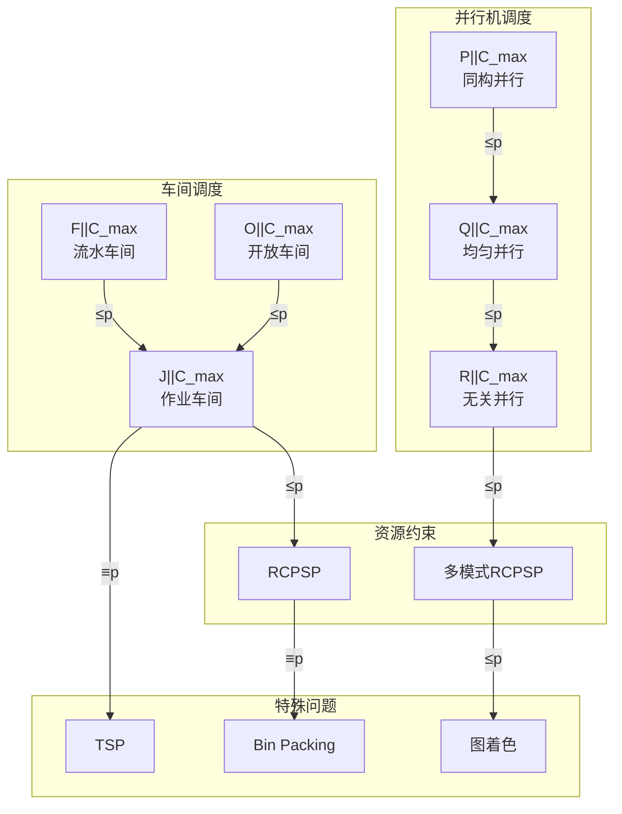
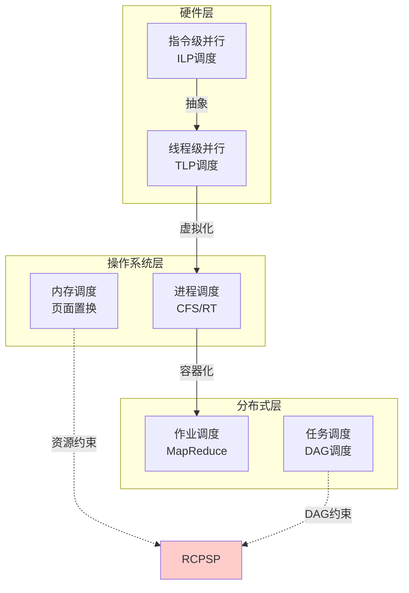

# 01.3 调度等价性

---

📌 **内容摘要**

本文档深入探讨调度等价性的核心原理和关键方法。内容涵盖调度理论基础领域的主要知识点，包括调度, 资源分配, 一致性, 共识算法, 任务调度等关键主题。适合初学者建立基础知识体系。

**关键词**: 调度, 资源分配, 一致性, 共识算法, 任务调度, 分布式系统, 调度理论基础

📚 **学习目标**
- 理解调度等价性的基本概念和核心原理
- 掌握相关术语和符号表示
- 能够分析和实现相关算法

🎯 **难度级别**: 初级

⏱️ **预计阅读时间**: 15分钟

**前置知识**: 基础数学知识, 算法与数据结构

---


> **交叉引用**: 源Matter中的调度系统文档
>
> - [Matter: 调度系统映射](../../Matter/02_分布式系统/02.3_分布式调度.md#调度等价性)
>
- [FormalRE: 形式化等价关系](../../FormalRE/形式化方法/系统等价理论.md)

---

## 01.3.1 调度问题的形式化等价

### 01.3.1.1 问题归约框架

**定义 01.3.1** (调度归约). 设 $\Pi_1$ 和 $\Pi_2$ 是两个调度问题，若存在多项式时间可计算的函数 $f$ 和 $g$ 使得：

$$\forall I_1 \in \Pi_1: \quad OPT_1(I_1) = g(OPT_2(f(I_1)))$$

则称 $\Pi_1$ **多项式归约**到 $\Pi_2$，记作 $\Pi_1 \leq_p \Pi_2$。

### 01.3.1.2 等价关系图



---

## 01.3.2 机器环境等价

### 01.3.2.1 并行机与单机的等价

**定理 01.3.1** (并行机归约). $P_m||C_{\max}$ 可多项式归约到带释放时间的单机问题 $1|r_j|C_{\max}$。

_构造_:
给定 $P_m||C_{\max}$ 实例：$m$ 台机器，作业 $\{J_1, \ldots, J_n\}$，处理时间 $\{p_1, \ldots, p_n\}$。

构造 $1|r_j|C_{\max}$ 实例：

- 对每个作业 $J_j$，创建 $m$ 个副本 $J_j^{(1)}, \ldots, J_j^{(m)}$
- 副本 $J_j^{(i)}$ 的释放时间 $r_j^{(i)} = (i-1) \cdot \max_k p_k$
- 处理时间 $p_j^{(i)} = p_j$

约束：同一作业的副本互斥（类似互斥资源约束）。$\square$

### 01.3.2.2 车间调度归约

**定理 01.3.2** (车间归约). 作业车间 $J||C_{\max}$ 可多项式归约到资源约束项目调度 $RCPSP$。

_构造_:
给定作业车间实例：

- $n$ 个作业，每个作业 $J_i$ 有 $n_i$ 道工序 $\{O_{i1}, \ldots, O_{in_i}\}$
- 工序 $O_{ij}$ 需在机器 $\mu_{ij}$ 上处理 $p_{ij}$ 时间

构造 $RCPSP$：

- 每个工序 $O_{ij}$ 对应一个活动
- 同一作业内的工序顺序约束：$O_{ij} \prec O_{i,j+1}$
- 机器资源：$m$ 种可再生资源，容量均为1
- 活动 $O_{ij}$ 需要1单位资源 $\mu_{ij}$

**定理 01.3.3** (流水车间特殊性). 当 $m=2$ 时，$F2||C_{\max}$ 有多项式时间算法 (Johnson规则)。

_Johnson规则_:
将作业分为两组：

- $A = \{J_i : p_{i1} \leq p_{i2}\}$，按 $p_{i1}$ 升序排列
- $B = \{J_i : p_{i1} > p_{i2}\}$，按 $p_{i2}$ 降序排列

最优调度为 $A$ 后接 $B$。$\square$

---

## 01.3.3 目标函数等价

### 01.3.3.1 目标函数转换

**定理 01.3.4** (完工时间与延迟等价). 对于正则目标函数，$1||L_{\max}$ 可归约到 $1||C_{\max}$。

_构造_:
给定 $1||L_{\max}$ 实例，作业 $J_j$ 有截止时间 $d_j$。

添加虚拟作业 $J_{n+1}$：

- $p_{n+1} = M$（足够大）
- $d_{n+1} = D$（目标延迟上界）

则 $L_{\max} \leq D - M$ 当且仅当 $J_{n+1}$ 在 $D-M+p_{n+1} = D$ 前完成。$\square$

### 01.3.3.2 多目标等价关系


---

## 01.3.4 调度策略等价

### 01.3.4.1 抢占与非抢占等价

**定理 01.3.5** (抢占等价). 对于 $P|pmtn|C_{\max}$，存在最优调度为最多 $m-1$ 次抢占。

_证明_: McNaughton规则产生无需抢占的最优调度。$\square$

**定理 01.3.6** (抢占能力界限). 对于 $1|r_j, pmtn|L_{\max}$，EDF (Earliest Deadline First) 最优；但对于 $1|r_j|L_{\max}$（非抢占），问题为强NP难。

### 01.3.4.2 Rust实现：等价性验证框架

```rust
/// 调度问题等价性验证
pub mod equivalence {
    use super::*;

    /// 问题转换接口
    pub trait ProblemReduction<P1, P2> {
        /// 将问题P1的实例转换为P2的实例
        fn forward(&self, instance: &P1::Instance) -> P2::Instance;

        /// 将P2的解转换回P1的解
        fn backward(&self,
            p1_instance: &P1::Instance,
            p2_solution: &P2::Solution
        ) -> P1::Solution;

        /// 验证转换保持目标函数值
        fn verify_objective_preservation(&self,
            p1_instance: &P1::Instance,
            p2_solution: &P2::Solution,
            p1_objective: f64,
        ) -> bool;
    }

    /// 车间到RCPSP的转换
    pub struct JobShopToRCPSP;

    impl ProblemReduction<JobShopProblem, RCPSPProblem> for JobShopToRCPSP {
        fn forward(&self, js_instance: &JobShopInstance) -> RCPSPInstance {
            let mut activities = vec![];
            let mut precedence = vec![];
            let mut resource_requirements = vec![];

            // 机器作为可再生资源
            let num_machines = js_instance.num_machines();
            let resource_capacities = vec![1; num_machines];

            let mut activity_id = 0;
            let mut job_start_indices = vec![];

            for job in &js_instance.jobs {
                job_start_indices.push(activity_id);

                for (op_idx, operation) in job.operations.iter().enumerate() {
                    activities.push(Activity {
                        id: activity_id,
                        duration: operation.processing_time,
                    });

                    // 作业内顺序约束
                    if op_idx > 0 {
                        precedence.push((activity_id - 1, activity_id));
                    }

                    // 资源需求：对应机器1单位
                    let mut req = vec![0; num_machines];
                    req[operation.machine] = 1;
                    resource_requirements.push(req);

                    activity_id += 1;
                }
            }

            RCPSPInstance {
                activities,
                precedence_constraints: precedence,
                renewable_resources: resource_capacities,
                resource_requirements,
            }
        }

        fn backward(&self,
            js_instance: &JobShopInstance,
            rcpsp_solution: &RCPSPSolution,
        ) -> JobShopSolution {
            // 从RCPSP调度重建作业车间调度
            let mut machine_schedules: Vec<Vec<(Time, Time, JobId)>> =
                vec![vec![]; js_instance.num_machines()];

            let mut activity_id = 0;
            for (job_id, job) in js_instance.jobs.iter().enumerate() {
                for operation in &job.operations {
                    let start_time = rcpsp_solution.start_times[activity_id];
                    let finish_time = start_time + operation.processing_time;

                    machine_schedules[operation.machine].push((
                        start_time,
                        finish_time,
                        job_id,
                    ));

                    activity_id += 1;
                }
            }

            // 计算完工时间
            let makespan = machine_schedules.iter()
                .filter_map(|schedule| schedule.last())
                .map(|(_, finish, _)| *finish)
                .max()
                .unwrap_or(0.0);

            JobShopSolution {
                machine_schedules,
                makespan,
            }
        }

        fn verify_objective_preservation(&self,
            js_instance: &JobShopInstance,
            rcpsp_solution: &RCPSPSolution,
            js_objective: f64,
        ) -> bool {
            let rcpsp_makespan = rcpsp_solution.activities.iter()
                .map(|a| a.start_time + a.duration)
                .max()
                .unwrap_or(0.0);

            (rcpsp_makespan - js_objective).abs() < 1e-6
        }
    }

    /// 等价性测试器
    pub struct EquivalenceTester {
        test_instances: Vec<TestInstance>,
    }

    impl EquivalenceTester {
        /// 验证归约的正确性
        pub fn verify_reduction<P1, P2, R>(&self, reduction: &R) -> VerificationResult
        where
            R: ProblemReduction<P1, P2>,
        {
            let mut results = vec![];

            for instance in &self.test_instances {
                // 正向转换
                let p2_instance = reduction.forward(&instance.p1_instance);

                // 求解P2（假设有求解器）
                let p2_solution = solve_p2(&p2_instance);

                // 反向转换
                let p1_solution_converted = reduction.backward(
                    &instance.p1_instance,
                    &p2_solution
                );

                // 直接求解P1
                let p1_solution_direct = solve_p1(&instance.p1_instance);

                // 比较
                let converted_obj = calculate_objective(&p1_solution_converted);
                let direct_obj = calculate_objective(&p1_solution_direct);

                results.push(EquivalenceTest {
                    instance_id: instance.id,
                    objective_ratio: converted_obj / direct_obj,
                    is_valid: reduction.verify_objective_preservation(
                        &instance.p1_instance,
                        &p2_solution,
                        direct_obj,
                    ),
                });
            }

            VerificationResult { tests: results }
        }
    }
}
```

---

## 01.3.5 不同领域调度的统一视角

### 01.3.5.1 层次间等价关系



### 01.3.5.2 统一RCPSP视角

**定理 01.3.7** (统一表示). 以下调度问题均可表示为 $RCPSP$ 的特例：

1. **指令调度**: 资源=功能单元，活动=指令，优先约束=数据依赖
2. **进程调度**: 资源=CPU核心，活动=进程/线程，释放时间约束
3. **分布式任务调度**: 资源=计算节点，活动=任务，网络带宽约束
4. **内存页面置换**: 资源=物理页框，活动=虚拟页访问，最小化缺页

---

## 01.3.6 C++伪代码：等价性验证

```cpp
#pragma once
#include <variant>
#include <functional>
#include <type_traits>

namespace scheduling {
namespace equivalence {

// 统一调度实例类型
template<typename Job, typename Resource>
struct UnifiedInstance {
    std::vector<Job> jobs;
    std::vector<Resource> resources;

    // 依赖图
    AdjacencyList precedence_constraints;

    // 资源需求矩阵
    Matrix<size_t> resource_requirements;

    // 时间约束
    std::vector<Time> release_times;
    std::vector<std::optional<Time>> deadlines;
};

// 问题变体标签
enum class ProblemVariant {
    SingleMachine,
    ParallelMachine,
    JobShop,
    FlowShop,
    OpenShop,
    RCPSP
};

// 调度转换器
template<typename From, typename To>
class InstanceTransformer {
public:
    using FromInstance = From;
    using ToInstance = To;

    virtual ~InstanceTransformer() = default;

    // 核心转换函数
    virtual ToInstance transform(const FromInstance& from) = 0;

    // 反向转换（如果存在）
    virtual std::optional<FromInstance> inverse(const ToInstance& to) = 0;

    // 验证转换的正确性
    virtual bool verify(const FromInstance& from, const ToInstance& to) {
        // 检查基本不变量
        return check_job_count(from, to) &&
               check_resource_consistency(from, to);
    }

protected:
    virtual bool check_job_count(const FromInstance& from, const ToInstance& to) = 0;
    virtual bool check_resource_consistency(const FromInstance& from, const ToInstance& to) = 0;
};

// 并行机到RCPSP的转换
template<typename Job>
class ParallelToRCPSP : public InstanceTransformer<
    ParallelMachineInstance<Job>,
    RCPSPInstance<Job>
> {
public:
    using Base = InstanceTransformer<
        ParallelMachineInstance<Job>,
        RCPSPInstance<Job>
    >;

    RCPSPInstance<Job> transform(const ParallelMachineInstance<Job>& parallel) override {
        RCPSPInstance<Job> rcpsp;

        // 机器作为资源
        rcpsp.num_resources = parallel.num_machines;
        rcpsp.resource_capacities = std::vector<size_t>(parallel.num_machines, 1);

        // 每个作业对应一个活动
        rcpsp.activities.reserve(parallel.jobs.size());
        for (const auto& job : parallel.jobs) {
            rcpsp.activities.push_back({
                .id = job.id,
                .duration = job.processing_time,
                .resource_req = std::vector<size_t>(parallel.num_machines, 0)
            });
        }

        // 设置资源需求：作业可以运行在任何机器上
        for (auto& activity : rcpsp.activities) {
            for (size_t m = 0; m < parallel.num_machines; ++m) {
                // 创建多模式：每个模式对应一台机器
                activity.resource_req[m] = 1; // 需要1单位机器资源
            }
        }

        return rcpsp;
    }

    std::optional<ParallelMachineInstance<Job>> inverse(
        const RCPSPInstance<Job>& rcpsp
    ) override {
        // 检查RCPSP是否对应并行机问题
        if (!is_parallel_machine_variant(rcpsp)) {
            return std::nullopt;
        }

        ParallelMachineInstance<Job> parallel;
        parallel.num_machines = rcpsp.num_resources;

        for (const auto& activity : rcpsp.activities) {
            Job job;
            job.id = activity.id;
            job.processing_time = activity.duration;
            parallel.jobs.push_back(job);
        }

        return parallel;
    }

protected:
    bool check_job_count(const ParallelMachineInstance<Job>& from,
                        const RCPSPInstance<Job>& to) override {
        return from.jobs.size() == to.activities.size();
    }

    bool check_resource_consistency(const ParallelMachineInstance<Job>& from,
                                    const RCPSPInstance<Job>& to) override {
        return from.num_machines == to.num_resources;
    }

private:
    bool is_parallel_machine_variant(const RCPSPInstance<Job>& rcpsp) {
        // 检查是否为并行机特例：
        // 1. 无优先约束
        // 2. 每个活动恰好需要1单位某资源
        // 3. 无资源替代
        return rcpsp.precedence_constraints.empty();
    }
};

// 等价性验证器
class EquivalenceVerifier {
public:
    template<typename P1, typename P2, typename Transformer>
    struct VerificationResult {
        bool is_valid;
        double objective_gap;
        std::string error_message;
    };

    template<typename P1, typename P2, typename Solver, typename Transformer>
    VerificationResult<P1, P2, Transformer> verify(
        const typename P1::Instance& instance1,
        Solver& p1_solver,
        Solver& p2_solver,
        Transformer& transformer
    ) {
        // 直接求解
        auto solution1_direct = p1_solver.solve(instance1);
        auto obj1_direct = P1::objective(solution1_direct);

        // 转换后求解
        auto instance2 = transformer.transform(instance1);
        auto solution2 = p2_solver.solve(instance2);
        auto solution1_converted = transformer.inverse_transform(solution2);
        auto obj1_converted = P1::objective(solution1_converted);

        // 比较
        double gap = std::abs(obj1_direct - obj1_converted) / obj1_direct;

        return {
            .is_valid = gap < 1e-6,
            .objective_gap = gap,
            .error_message = gap < 1e-6 ? "" : "Objective mismatch"
        };
    }
};

} // namespace equivalence
} // namespace scheduling
```

---

## 01.3.7 总结

| 等价类型 | 核心思想 | 应用场景 |
|----------|----------|----------|
| 问题归约 | 多项式转换 | 复杂度分析、算法迁移 |
| 目标转换 | 惩罚函数 | 多目标优化 |
| 层次抽象 | RCPSP统一 | 跨层调度协同 |
| 策略等价 | 抢占/非抢占 | 系统实现选择 |

**延伸阅读**:

- [01.1 调度模型抽象](./01.1_调度模型抽象.md) - 统一调度模型
- [01.2 调度算法分析](./01.2_调度算法分析.md) - 复杂度与近似比
- [04.3 跨层调度协同](../04_分布式调度/04.3_跨层调度协同.md) - 端到端优化
---

## 📚 延伸阅读

- [04.3 跨层调度协同](../04_分布式调度/04.3_跨层调度协同.md)
- [04.3 任务调度](../04_分布式调度/04.3_任务调度.md)
- [01.1 调度模型抽象](../01_调度理论基础/01.1_调度模型抽象.md)
- [01.1 调度问题定义](../01_调度理论基础/01.1_调度问题定义.md)
- [02.2 内存调度](../02_硬件调度/02.2_内存调度.md)
