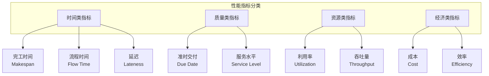
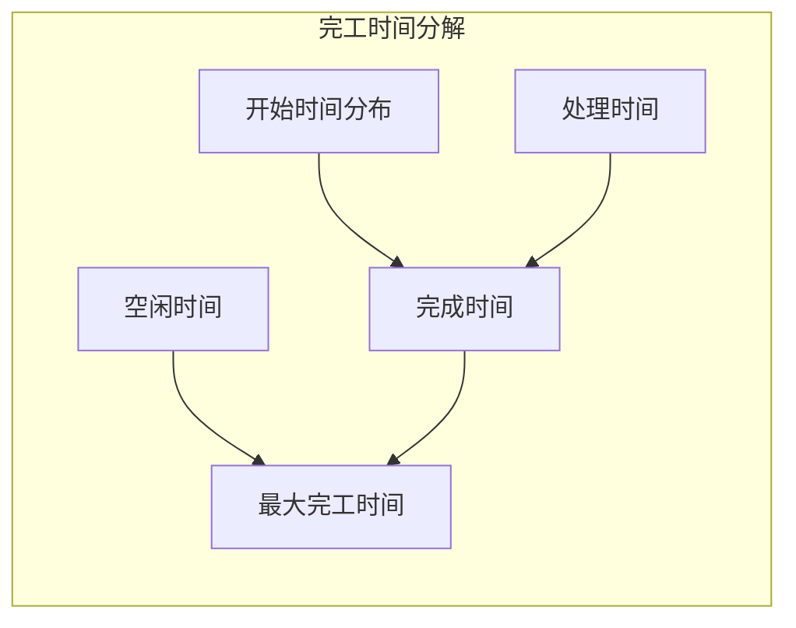
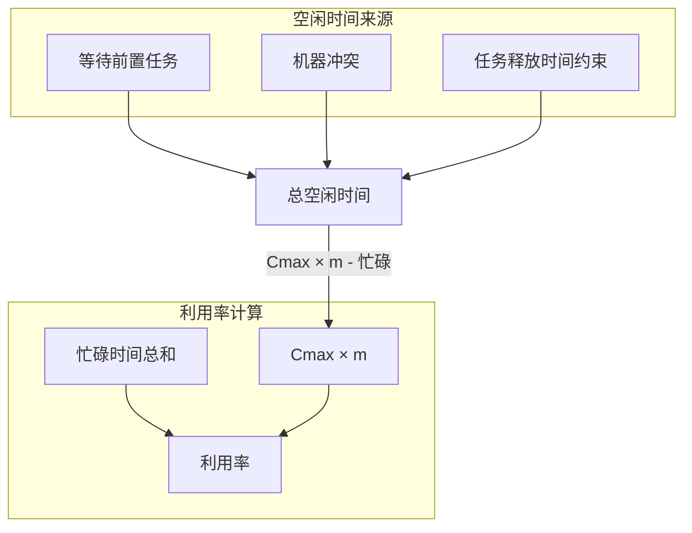
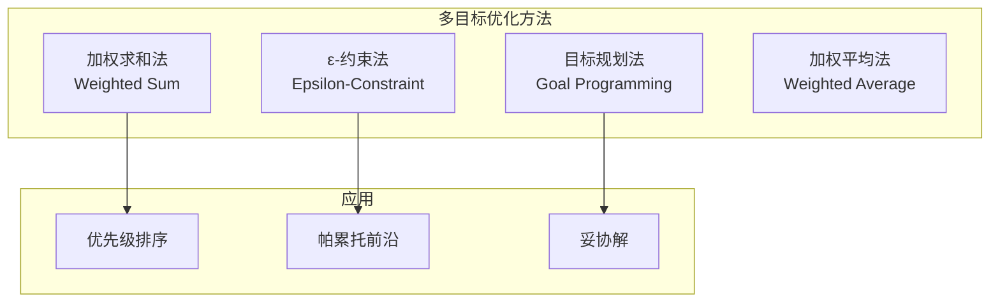
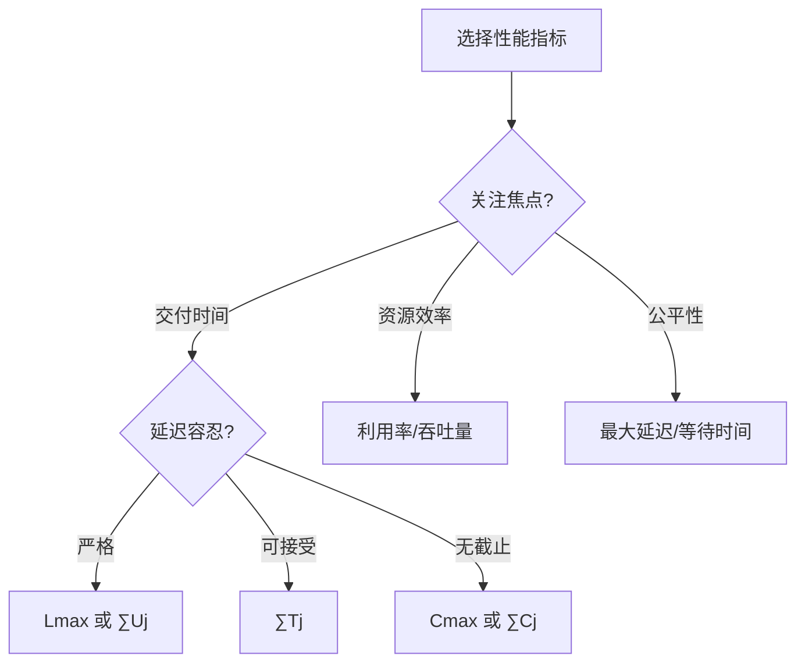

# 01.4 性能指标

> **形式科学 · 调度系统系列**
> 上一篇: [01.3 调度分类学](01.3_调度分类学.md) | 下一篇: [02.1 CPU调度](../02_硬件调度/02.1_CPU调度.md)

---

## 1. 性能指标体系

### 1.1 指标分类框架

调度性能指标可从多个维度进行分类：



### 1.2 形式化指标定义

对于调度方案 $\sigma$，设：

- $C_j(\sigma)$: 任务 $j$ 的完成时间
- $F_j(\sigma) = C_j(\sigma) - r_j$: 任务 $j$ 的流程时间
- $L_j(\sigma) = C_j(\sigma) - d_j$: 任务 $j$ 的延迟
- $T_j(\sigma) = \max(0, L_j(\sigma))$: 任务 $j$ 的延迟时间

---

## 2. 完工时间指标 (Makespan)

### 2.1 定义与性质

**定义 2.1（完工时间）**: 调度方案中所有任务完成时间的最大值：

$$C_{\max}(\sigma) = \max_{j \in \mathcal{J}} C_j(\sigma)$$

**性质**:

- 最小化 $C_{\max}$ 等价于最大化系统吞吐量
- $C_{\max}$ 是最常见的调度目标之一
- 对于单机调度，$C_{\max} = \sum_j p_j$（与顺序无关）

### 2.2 完工时间分析



**下界定理**:

$$C_{\max}^* \geq \max\left\{\max_j p_j, \frac{\sum_j p_j}{m}\right\}$$

其中 $m$ 为机器数量。

### 2.3 Rust 实现：完工时间计算

```rust
// Rust: 完工时间计算与分析
use std::collections::HashMap;

#[derive(Debug, Clone)]
pub struct Schedule {
    pub assignments: Vec<Assignment>,  // (任务, 机器, 开始时间)
}

#[derive(Debug, Clone, Copy)]
pub struct Assignment {
    pub task_id: usize,
    pub machine_id: usize,
    pub start_time: u64,
    pub processing_time: u64,
}

impl Assignment {
    pub fn completion_time(&self) -> u64 {
        self.start_time + self.processing_time
    }
}

impl Schedule {
    // 计算完工时间 (makespan)
    pub fn makespan(&self) -> u64 {
        self.assignments.iter()
            .map(|a| a.completion_time())
            .max()
            .unwrap_or(0)
    }

    // 按机器分组的完工时间
    pub fn makespan_per_machine(&self) -> HashMap<usize, u64> {
        let mut machine_makespan: HashMap<usize, u64> = HashMap::new();

        for assignment in &self.assignments {
            let completion = assignment.completion_time();
            machine_makespan.entry(assignment.machine_id)
                .and_modify(|m| *m = (*m).max(completion))
                .or_insert(completion);
        }

        machine_makespan
    }

    // 计算完工时间的下界
    pub fn makespan_lower_bound(tasks: &[u64], m: usize) -> u64 {
        let max_processing_time = tasks.iter().copied().max().unwrap_or(0);
        let total_processing_time: u64 = tasks.iter().sum();
        let avg_load = (total_processing_time + m as u64 - 1) / m as u64;

        max_processing_time.max(avg_load)
    }
}
```

---

## 3. 延迟指标 (Tardiness & Lateness)

### 3.1 延迟相关定义

| 指标 | 符号 | 定义 | 目标 |
|------|------|------|------|
| 延迟 | $L_j$ | $C_j - d_j$ | 可正可负 |
| 延迟时间 | $T_j$ | $\max(0, L_j)$ | 非负 |
| 提前时间 | $E_j$ | $\max(0, d_j - C_j)$ | 非负 |
| 延迟标志 | $U_j$ | $\mathbb{1}_{C_j > d_j}$ | 二元值 |

```mermaid
flowchart LR
    subgraph 时间关系
        r[释放时间 rj] --> S[开始时间 Sj]
        S --> C[完成时间 Cj]
        C --> d[截止时间 dj]
    end

    C -->|差值| L[延迟 Lj = Cj - dj]
    L -->|max(0,·)| T[延迟时间 Tj]
    L -->|min(0,·)| E[提前时间 Ej]
    T -->|>0?| U[延迟标志 Uj]
```

### 3.2 延迟相关目标函数

| 目标函数 | 记号 | 说明 | 复杂性 |
|----------|------|------|--------|
| 最大延迟 | $L_{\max}$ | $\max_j L_j$ | $O(n \log n)$ (EDD) |
| 总延迟 | $\sum T_j$ | 所有延迟时间之和 | NP难 |
| 加权总延迟 | $\sum w_j T_j$ | 带权延迟之和 | NP难 |
| 延迟任务数 | $\sum U_j$ | Moore-Hodgson算法 | $O(n \log n)$ |
| 加权延迟任务数 | $\sum w_j U_j$ | 带权延迟任务数 | NP难 |

### 3.3 Lean 形式化：延迟分析

```lean4
-- Lean: 延迟指标的形式化定义
structure DueDateTask where
  id : Nat
  processingTime : Nat
  deadline : Nat
  weight : Nat := 1
  deriving Repr, BEq

structure ScheduledTask extends DueDateTask where
  startTime : Nat

def ScheduledTask.completionTime (t : ScheduledTask) : Nat :=
  t.startTime + t.processingTime

def ScheduledTask.lateness (t : ScheduledTask) : Int :=
  (t.completionTime : Int) - (t.deadline : Int)

def ScheduledTask.tardiness (t : ScheduledTask) : Nat :=
  let l := t.lateness
  if l > 0 then l.natAbs else 0

def ScheduledTask.earliness (t : ScheduledTask) : Nat :=
  let l := t.lateness
  if l < 0 then l.natAbs else 0

def ScheduledTask.isTardy (t : ScheduledTask) : Bool :=
  t.completionTime > t.deadline

-- 全局指标计算
def totalTardiness (tasks : List ScheduledTask) : Nat :=
  tasks.foldl (λ acc t => acc + t.tardiness) 0

def maxLateness (tasks : List ScheduledTask) : Int :=
  match tasks with
  | [] => 0
  | t :: ts =>
    let l := t.lateness
    ts.foldl (λ maxL t => max maxL t.lateness) l

def numberOfTardyJobs (tasks : List ScheduledTask) : Nat :=
  tasks.filter (λ t => t.isTardy) |>.length
```

---

## 4. 资源利用率指标

### 4.1 利用率定义

**定义 4.1（机器利用率）**: 机器 $i$ 的利用率为其忙碌时间占总完工时间的比例：

$$U_i = \frac{\sum_{j: T_j \text{ on } M_i} p_j}{C_{\max}}$$

**定义 4.2（系统利用率）**: 所有机器的平均利用率：

$$\bar{U} = \frac{1}{m} \sum_{i=1}^{m} U_i = \frac{\sum_j p_j}{m \cdot C_{\max}}$$

### 4.2 利用率分析



### 4.3 Haskell 实现：利用率计算

```haskell
-- Haskell: 资源利用率计算
module Scheduling.Metrics.Utilization where

type MachineId = Int
type Time = Double

data MachineUsage = MachineUsage {
    machineId :: MachineId,
    busyTime :: Time,
    totalTime :: Time
} deriving (Show, Eq)

-- 单机利用率
machineUtilization :: MachineUsage -> Double
machineUtilization mu = busyTime mu / totalTime mu

-- 系统平均利用率
systemUtilization :: [MachineUsage] -> Double
systemUtilization mus =
    let totalBusy = sum (map busyTime mus)
        totalAvailable = sum (map totalTime mus)
    in totalBusy / totalAvailable

-- 利用率方差（负载均衡指标）
utilizationVariance :: [MachineUsage] -> Double
utilizationVariance mus =
    let utilizations = map machineUtilization mus
        avg = sum utilizations / fromIntegral (length utilizations)
        squaredDiffs = map (\u -> (u - avg) ^ 2) utilizations
    in sum squaredDiffs / fromIntegral (length utilizations)

-- Gantt图分析
analyzeGanttChart :: [(MachineId, [(Time, Time)])] -> Time -> [MachineUsage]
analyzeGanttChart gantt makespan =
    map (\(mid, intervals) ->
        let busy = sum (map (\(s, e) -> e - s) intervals)
        in MachineUsage mid busy makespan
    ) gantt
```

---

## 5. 吞吐量与效率指标

### 5.1 吞吐量定义

**定义 5.1（吞吐量）**: 单位时间内完成的任务数量：

$$\text{Throughput} = \frac{n}{C_{\max}}$$

**定义 5.2（加权吞吐量）**: 考虑任务权重的吞吐量：

$$\text{Weighted Throughput} = \frac{\sum_j w_j}{C_{\max}}$$

### 5.2 效率指标

| 指标 | 公式 | 说明 |
|------|------|------|
| 调度效率 | $\eta = \frac{\text{最优值}}{\text{实际值}}$ | 接近1表示高效 |
| 平均流程时间 | $\bar{F} = \frac{1}{n} \sum_j F_j$ | 任务在系统中的平均时间 |
| 加权平均流程时间 | $\bar{F}_w = \frac{\sum_j w_j F_j}{\sum_j w_j}$ | 带权平均 |
| 等待时间 | $W_j = F_j - p_j$ | 任务等待时间 |

---

## 6. 综合性能评估

### 6.1 多目标优化框架

当需要同时优化多个指标时，常用方法：



### 6.2 加权目标函数

$$Z(\sigma) = \sum_{k=1}^{K} \lambda_k \cdot \frac{f_k(\sigma) - f_k^{\min}}{f_k^{\max} - f_k^{\min}}$$

其中 $\lambda_k \geq 0$ 且 $\sum_k \lambda_k = 1$。

### 6.3 Rust 实现：综合评估

```rust
// Rust: 综合性能评估框架
#[derive(Debug, Clone)]
pub struct PerformanceMetrics {
    pub makespan: u64,
    pub total_completion_time: u64,
    pub total_flow_time: u64,
    pub max_lateness: i64,
    pub total_tardiness: u64,
    pub num_tardy_jobs: usize,
    pub avg_machine_utilization: f64,
    pub throughput: f64,
}

#[derive(Debug, Clone)]
pub struct WeightedObjective {
    pub weights: ObjectiveWeights,
}

#[derive(Debug, Clone)]
pub struct ObjectiveWeights {
    pub makespan_weight: f64,
    pub tardiness_weight: f64,
    pub utilization_weight: f64,
    pub flow_time_weight: f64,
}

impl WeightedObjective {
    pub fn evaluate(&self, metrics: &PerformanceMetrics) -> f64 {
        let w = &self.weights;

        // 归一化（需要已知最小最大值）
        let norm_makespan = metrics.makespan as f64 / 1000.0;
        let norm_tardiness = metrics.total_tardiness as f64 / 100.0;
        let norm_utilization = 1.0 - metrics.avg_machine_utilization;  // 最小化
        let norm_flow = metrics.total_flow_time as f64 / 1000.0;

        w.makespan_weight * norm_makespan +
        w.tardiness_weight * norm_tardiness +
        w.utilization_weight * norm_utilization +
        w.flow_time_weight * norm_flow
    }

    // 计算调度效率
    pub fn scheduling_efficiency(
        &self,
        actual: &PerformanceMetrics,
        optimal: &PerformanceMetrics
    ) -> f64 {
        let actual_score = self.evaluate(actual);
        let optimal_score = self.evaluate(optimal);

        optimal_score / actual_score
    }
}
```

---

## 7. 性能指标对比矩阵

### 7.1 指标特性对比

| 指标 | 类型 | 优化方向 | 计算复杂度 | 敏感性 | 应用场景 |
|------|------|----------|-----------|--------|----------|
| $C_{\max}$ | 瓶颈 | 最小化 | $O(n)$ | 低 | 生产计划 |
| $\sum C_j$ | 平均 | 最小化 | $O(n)$ | 中 | 流程优化 |
| $L_{\max}$ | 最坏情况 | 最小化 | $O(n)$ | 高 | 实时系统 |
| $\sum T_j$ | 累积 | 最小化 | NP难 | 中 | 服务系统 |
| $\sum U_j$ | 计数 | 最小化 | $O(n \log n)$ | 低 | 订单管理 |
| $\bar{U}$ | 比率 | 最大化 | $O(n)$ | 低 | 资源规划 |

### 7.2 决策树：选择性能指标



---

## 8. Lean 完整形式化框架

```lean4
-- Lean: 完整性能指标框架
import Mathlib

namespace SchedulingMetrics

-- 基础结构
structure TaskMetrics where
  id : Nat
  processingTime : Nat
  releaseTime : Nat := 0
  deadline : Option Nat := none
  weight : Nat := 1

structure ScheduledTask extends TaskMetrics where
  startTime : Nat
  machineId : Nat := 0

-- 计算属性
def ScheduledTask.completionTime (t : ScheduledTask) : Nat :=
  t.startTime + t.processingTime

def ScheduledTask.flowTime (t : ScheduledTask) : Nat :=
  t.completionTime - t.releaseTime

def ScheduledTask.waitingTime (t : ScheduledTask) : Nat :=
  t.flowTime - t.processingTime

def ScheduledTask.lateness (t : ScheduledTask) : Int :=
  match t.deadline with
  | some d => (t.completionTime : Int) - (d : Int)
  | none => 0

def ScheduledTask.tardiness (t : ScheduledTask) : Nat :=
  max 0 (t.lateness.natAbs)

def ScheduledTask.earliness (t : ScheduledTask) : Nat :=
  if t.lateness < 0 then t.lateness.natAbs else 0

def ScheduledTask.isTardy (t : ScheduledTask) : Bool :=
  t.tardiness > 0

-- 全局指标
def makespan (tasks : List ScheduledTask) : Nat :=
  match tasks with
  | [] => 0
  | _ => (tasks.map (·.completionTime)).maximum?.getD 0

def totalCompletionTime (tasks : List ScheduledTask) : Nat :=
  (tasks.map (·.completionTime)).sum

def totalFlowTime (tasks : List ScheduledTask) : Nat :=
  (tasks.map (·.flowTime)).sum

def totalWaitingTime (tasks : List ScheduledTask) : Nat :=
  (tasks.map (·.waitingTime)).sum

def maxLateness (tasks : List ScheduledTask) : Int :=
  match tasks.filter (λ t => t.deadline.isSome) with
  | [] => 0
  | ts => (ts.map (·.lateness)).maximum?.getD 0

def totalTardiness (tasks : List ScheduledTask) : Nat :=
  (tasks.map (·.tardiness)).sum

def numberOfTardyJobs (tasks : List ScheduledTask) : Nat :=
  (tasks.filter (·.isTardy)).length

-- 机器利用率
def machineUtilization
    (tasks : List ScheduledTask)
    (machineId : Nat)
    (makespan : Nat) : ℚ :=
  let busyTime := (tasks.filter (λ t => t.machineId = machineId)
    |>.map (·.processingTime)).sum
  (busyTime : ℚ) / (makespan : ℚ)

def systemUtilization
    (tasks : List ScheduledTask)
    (numMachines : Nat) : ℚ :=
  let makespanVal := makespan tasks
  let totalBusy := (tasks.map (·.processingTime)).sum
  (totalBusy : ℚ) / ((numMachines * makespanVal) : ℚ)

-- 加权指标
def weightedSum {α : Type} [Mul α] [Add α] [OfNat α 0]
    (items : List (α × α)) : α :=
  items.foldl (λ acc (v, w) => acc + v * w) 0

def totalWeightedCompletionTime (tasks : List ScheduledTask) : Nat :=
  (tasks.map (λ t => (t.completionTime, t.weight))).weightedSum

def totalWeightedTardiness (tasks : List ScheduledTask) : Nat :=
  (tasks.map (λ t => (t.tardiness, t.weight))).weightedSum

end SchedulingMetrics
```

---

## 9. 参考文献

1. Baker, K. R., & Trietsch, D. _Principles of Sequencing and Scheduling_. Wiley, 2009.
2. Dauzère-Pérès, S., & Lasserre, J. B. "A modified shifting bottleneck procedure for job-shop scheduling." _International Journal of Production Research_ 31.4 (1993): 923-932.
3. Ragatz, G. L., & Mabert, V. A. "A simulation analysis of due date assignment rules." _Journal of Operations Management_ 5.1 (1984): 27-39.
4. Sculli, D. "The completion time of PERT networks." _Journal of the Operational Research Society_ 34.2 (1983): 155-158.

---

## 10. 相关文档

- [01.1 调度问题定义](01.1_调度问题定义.md) - 任务、资源、目标函数
- [01.2 调度复杂性](01.2_调度复杂性.md) - NP难、近似算法、在线算法
- [01.3 调度分类学](01.3_调度分类学.md) - 单机、并行机、开放 Shop、流水 Shop
- [02.1 CPU调度](../02_硬件调度/02.1_CPU调度.md) - 流水线、乱序执行
