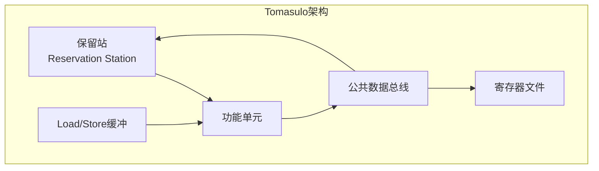
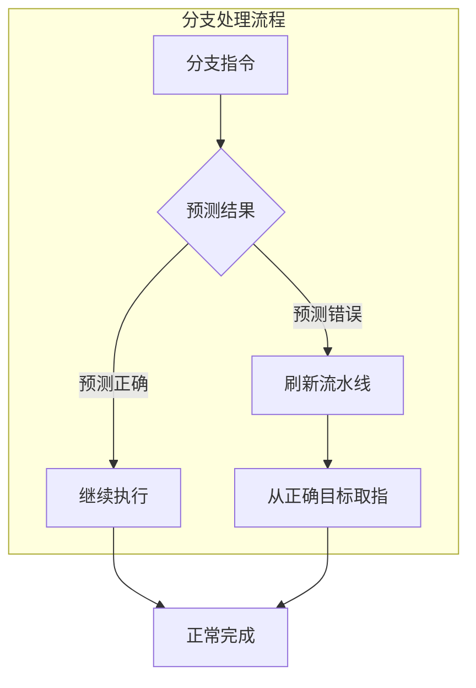
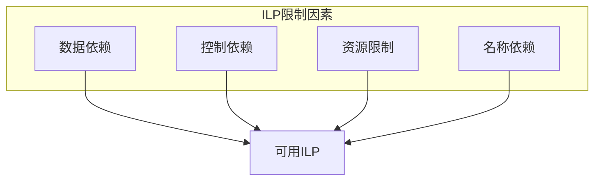

# 02.1 CPU调度

---

📌 **内容摘要**

本文档深入探讨CPU调度的核心原理和关键方法。内容涵盖硬件调度领域的主要知识点，包括任务调度, 调度, 资源分配等关键主题。适合初学者建立基础知识体系。

**关键词**: 任务调度, 硬件调度, 调度, 资源分配

📚 **学习目标**

- 理解CPU调度的基本概念和核心原理
- 掌握相关术语和符号表示
- 能够分析和实现相关算法

🎯 **难度级别**: 初级

⏱️ **预计阅读时间**: 15分钟

**前置知识**: 基础数学知识, 算法与数据结构

---


> **形式科学 · 调度系统系列**
> 上一篇: [01.4 性能指标](../01_调度理论基础/01.4_性能指标.md) | 下一篇: [02.2 内存调度](02.2_内存调度.md)

---

## 1. CPU执行模型基础

### 1.1 处理器执行流水线

现代 CPU 采用流水线（Pipeline）技术提高指令吞吐量，经典五级流水线如下：


**形式化定义**：设流水线级数为 $k$，每级处理时间为 $\tau$，则：

$$\text{单指令时间} = k \cdot \tau$$
$$\text{吞吐量} = \frac{1}{\tau}$$
$$\text{加速比} = \frac{k \cdot \tau}{\tau + (n-1)\tau} \approx k \quad (n \gg k)$$

### 1.2 流水线冲突与调度

| 冲突类型 | 原因 | 解决策略 |
|----------|------|----------|
| **结构冲突** | 资源竞争 | 资源复制、流水线停顿 |
| **数据冲突** | 数据依赖 | 转发、停顿、指令重排 |
| **控制冲突** | 分支指令 | 分支预测、延迟槽、预测执行 |

**数据依赖类型**：

```haskell
-- Haskell: 数据依赖类型定义
data DataDependency
    = RAW Int Int  -- Read After Write (真依赖)
    | WAR Int Int  -- Write After Read (反依赖)
    | WAW Int Int  -- Write After Write (输出依赖)
    deriving (Show, Eq)

-- 检测数据冲突
hasConflict :: Instruction -> Instruction -> Maybe DataDependency
hasConflict i1 i2
    | dest i1 `elem` sources i2 = Just $ RAW (id i1) (id i2)
    | dest i2 `elem` sources i1 = Just $ WAR (id i1) (id i2)
    | dest i1 == dest i2        = Just $ WAW (id i1) (id i2)
    | otherwise                 = Nothing
```

---

## 2. 动态调度：乱序执行

### 2.1 Tomasulo 算法

Tomasulo 算法通过寄存器重命名和动态调度实现乱序执行：



**关键数据结构**：

| 结构 | 功能 | 容量 |
|------|------|------|
| 保留站 (RS) | 缓冲等待操作数的指令 | $n_{RS}$ |
| 重排序缓冲 (ROB) | 确保按序提交 | $n_{ROB}$ |
| 寄存器重命名表 | 映射逻辑到物理寄存器 | $n_{arch}$ |
| 加载/存储队列 | 内存操作排序 | $n_{LSQ}$ |

### 2.2 Rust 实现：Tomasulo 核心逻辑

```rust
// Rust: Tomasulo 算法核心实现
use std::collections::{HashMap, VecDeque};

#[derive(Debug, Clone)]
pub struct ReservationStation {
    pub id: usize,
    pub busy: bool,
    pub op: Option<Operation>,
    pub vj: Option<Value>,      // 操作数1值
    pub vk: Option<Value>,      // 操作数2值
    pub qj: Option<usize>,      // 操作数1来源保留站
    pub qk: Option<usize>,      // 操作数2来源保留站
    pub dest: Option<usize>,    // 目标ROB项
}

#[derive(Debug)]
pub struct TomasuloScheduler {
    reservation_stations: Vec<ReservationStation>,
    reorder_buffer: VecDeque<ROBEntry>,
    register_status: HashMap<Register, Option<usize>>, // 寄存器 -> ROB项
    pub cycle: u64,
}

impl TomasuloScheduler {
    // 发射阶段：分配保留站和ROB项
    pub fn issue(&mut self, instr: Instruction) -> Result<(), IssueError> {
        // 查找空闲保留站
        let rs_id = self.find_free_rs()
            .ok_or(IssueError::ReservationStationsFull)?;

        // 分配ROB项
        let rob_entry = ROBEntry {
            id: self.reorder_buffer.len(),
            instruction: instr.clone(),
            state: ROBState::Issue,
            value: None,
        };

        // 寄存器重命名
        for (i, src) in instr.sources.iter().enumerate() {
            match self.register_status.get(src) {
                Some(Some(rob_id)) => {
                    // 等待ROB写回
                    if i == 0 { self.reservation_stations[rs_id].qj = Some(*rob_id); }
                    else { self.reservation_stations[rs_id].qk = Some(*rob_id); }
                }
                _ => {
                    // 寄存器值已就绪
                    let val = self.read_register(src);
                    if i == 0 { self.reservation_stations[rs_id].vj = Some(val); }
                    else { self.reservation_stations[rs_id].vk = Some(val); }
                }
            }
        }

        // 更新目标寄存器状态
        self.register_status.insert(instr.dest, Some(rob_entry.id));
        self.reorder_buffer.push_back(rob_entry);

        Ok(())
    }

    // 执行阶段：操作数就绪的指令开始执行
    pub fn execute(&mut self) {
        for rs in &mut self.reservation_stations {
            if rs.busy && rs.qj.is_none() && rs.qk.is_none() && rs.op.is_some() {
                // 操作数就绪，开始执行
                rs.op = Some(rs.op.clone().unwrap().execute());
            }
        }
    }

    // 写回阶段：广播结果到等待的保留站和ROB
    pub fn writeback(&mut self, rs_id: usize, result: Value) {
        // 更新ROB
        if let Some(dest_rob) = self.reservation_stations[rs_id].dest {
            if let Some(entry) = self.reorder_buffer.get_mut(dest_rob) {
                entry.value = Some(result.clone());
                entry.state = ROBState::Writeback;
            }
        }

        // CDB广播：更新其他等待该结果的保留站
        for rs in &mut self.reservation_stations {
            if rs.qj == Some(dest_rob) {
                rs.vj = Some(result.clone());
                rs.qj = None;
            }
            if rs.qk == Some(dest_rob) {
                rs.vk = Some(result.clone());
                rs.qk = None;
            }
        }

        // 释放保留站
        self.reservation_stations[rs_id] = ReservationStation::new(rs_id);
    }

    // 提交阶段：按序提交ROB中的指令
    pub fn commit(&mut self) -> Option<ROBEntry> {
        if let Some(entry) = self.reorder_buffer.front() {
            if entry.state == ROBState::Writeback {
                let committed = self.reorder_buffer.pop_front().unwrap();

                // 更新寄存器文件
                if let Some(val) = &committed.value {
                    self.write_register(committed.instruction.dest, val.clone());

                    // 清除寄存器状态
                    self.register_status.insert(
                        committed.instruction.dest,
                        None
                    );
                }

                return Some(committed);
            }
        }
        None
    }
}
```

### 2.3 性能分析

**IPC (每周期指令数)**:

$$\text{IPC} = \frac{n_{instr}}{n_{cycles}}$$

**理论最大 IPC**:

$$\text{IPC}_{\max} = \min(n_{issue}, n_{execute}, n_{commit})$$

---

## 3. 分支预测

### 3.1 分支预测基础

控制冲突是流水线性能的主要瓶颈之一：



**分支预测准确率对性能的影响**:

$$\text{CPI}_{branch} = 1 + f_{branch} \cdot (1 - P_{accuracy}) \cdot \text{penalty}$$

其中：

- $f_{branch}$: 分支指令频率（~20%）
- $P_{accuracy}$: 预测准确率
- $\text{penalty}$: 预测错误惩罚（~15-20 cycles）

### 3.2 分支预测器类型

| 预测器 | 描述 | 准确率 | 硬件开销 |
|--------|------|--------|----------|
| 静态预测 | 总是预测某方向 | ~60% | 无 |
| 双模态 (Bimodal) | 2位饱和计数器 | ~85% | 低 |
| 两级自适应 | BHR + PHT | ~93% | 中 |
| Gshare | 全局历史异或 | ~95% | 中 |
| TAGE | 多个历史长度表 | ~97% | 高 |

### 3.3 Haskell 实现：Gshare 预测器

```haskell
-- Haskell: Gshare 分支预测器实现
module CPU.BranchPrediction where

import Data.Bits (xor, shiftL, shiftR)
import Data.Array.IO (IOArray, newArray, readArray, writeArray)
import Data.Word (Word64)

type PC = Word64
type GlobalHistory = Word64
type Counter = Int  -- 2位饱和计数器: 0-3

data GsharePredictor = GsharePredictor {
    pht :: IOArray Int Counter,     -- 模式历史表
    ghr :: IORef GlobalHistory,     -- 全局历史寄存器
    historyBits :: Int,             -- 历史位数
    tableSize :: Int                -- PHT大小
}

-- 初始化预测器
initGshare :: Int -> Int -> IO GsharePredictor
gshare historyBits tableBits = do
    let tableSize = 2 ^ tableBits
    pht <- newArray (0, tableSize - 1) 1  -- 初始弱预测跳转
    ghr <- newIORef 0
    return $ GsharePredictor pht ghr historyBits tableSize

-- 获取索引：PC 异或 GHR
getIndex :: GsharePredictor -> PC -> GlobalHistory -> Int
getIndex pred pc ghr =
    let mask = (1 `shiftL` historyBits pred) - 1
        pcBits = fromIntegral pc .&. mask
        ghrBits = fromIntegral ghr .&. mask
    in (pcBits `xor` ghrBits) `mod` tableSize pred

-- 预测分支
gpredict :: GsharePredictor -> PC -> IO Bool
gpredict pred pc = do
    ghr <- readIORef (ghr pred)
    let idx = getIndex pred pc ghr
    counter <- readArray (pht pred) idx
    return $ counter >= 2  -- 2或3预测跳转

-- 更新预测器
gupdate :: GsharePredictor -> PC -> Bool -> IO ()
gupdate pred pc taken = do
    ghr <- readIORef (ghr pred)
    let idx = getIndex pred pc ghr
    counter <- readArray (pht pred) idx

    -- 更新2位饱和计数器
    let newCounter = case taken of
            True  -> min 3 (counter + 1)
            False -> max 0 (counter - 1)
    writeArray (pht pred) idx newCounter

    -- 更新全局历史寄存器
    let newGhr = ((ghr `shiftL` 1) .&. ((1 `shiftL` historyBits pred) - 1))
                 .|. (if taken then 1 else 0)
    writeIORef (ghr pred) newGhr
```

---

## 4. 指令级并行性 (ILP)

### 4.1 ILP 理论基础

**定义 4.1（指令级并行性）**: 程序中可以同时执行的独立指令数量。

$$\text{ILP} = \lim_{n \to \infty} \frac{n}{\text{critical path length}}$$

**ILP 限制因素**：



### 4.2 超标量执行

| 发射宽度 | 典型处理器 | IPC上限 |
|----------|-----------|---------|
| 2-way | Intel Pentium | 2 |
| 4-way | Intel Core i7 | 4 |
| 6-way | Apple M1/M2 | 6 |
| 8-way | AMD Zen 4 | 8 |

**发射策略**：

| 策略 | 描述 | 复杂度 |
|------|------|--------|
| 顺序发射 | 按程序顺序发射 | 低 |
| 乱序发射 | 从就绪指令中选择 | 高 |
| 推测发射 | 基于预测提前发射 | 高 |

---

## 5. 多线程技术

### 5.1 细粒度多线程


**线程切换开销**: 0 cycles（每周期切换）

**优势**: 隐藏延迟
**劣势**: 单线程性能下降

### 5.2 同时多线程 (SMT)

| 资源 | 共享/复制 | 说明 |
|------|-----------|------|
| 功能单元 | 共享 | 动态分配 |
| 保留站 | 分区 | 每个线程独立 |
| 重命名寄存器 | 分区 | 避免相互干扰 |
| L1 I-Cache | 共享 | 可配置方式 |
| L1 D-Cache | 共享 | 需隔离机制 |
| L2/L3 Cache | 共享 | 通过QoS管理 |

---

## 6. Lean 形式化验证框架

```lean4
-- Lean: CPU调度正确性验证
structure Instruction where
  id : Nat
  op : Operation
  sources : List Register
  dest : Register
  pc : Address
  deriving DecidableEq, Repr

inductive InstructionState
  | Fetch : InstructionState
  | Decode : InstructionState
  | Issue : ReservationStationId → InstructionState
  | Execute : FunctionalUnitId → InstructionState
  | Writeback : InstructionState
  | Commit : InstructionState
  deriving DecidableEq, Repr

structure CPUState where
  cycle : Nat
  instructions : List (Instruction × InstructionState)
  registers : RegisterFile
  memory : Memory
  reservationStations : List ReservationStation
  reorderBuffer : List ROBEntry

-- 正确性：按序提交
def inOrderCommit (s : CPUState) : Prop :=
  let committed := s.instructions.filter (λ (_, st) => st = .Commit)
  -- 提交的指令ID必须是连续的
  ∀ i j, i < j →
    committed[i]!.1.id < committed[j]!.1.id

-- 正确性：数据流正确
def dataflowCorrect (s : CPUState) (i1 i2 : Instruction) : Prop :=
  i2.dest ∈ i1.sources →
  -- i2必须在i1完成前完成
  let state1 := (s.instructions.find (λ (i, _) => i = i1)).map Prod.snd
  let state2 := (s.instructions.find (λ (i, _) => i = i2)).map Prod.snd
  match state1, state2 with
  | some (.Commit), some st2 => st2 = .Commit
  | _, _ => True  -- 尚未提交的按定义满足

-- Tomasulo算法不变式
def tomasuloInvariant (s : CPUState) : Prop :=
  -- 每个保留站要么空闲，要么正在等待/执行有效指令
  ∀ rs ∈ s.reservationStations,
    rs.busy → rs.op.isSome

  -- ROB中指令按序排列
  ∧ (∀ i, i < s.reorderBuffer.length - 1 →
      s.reorderBuffer[i]!.instruction.pc <
      s.reorderBuffer[i+1]!.instruction.pc)

  -- 寄存器状态一致性
  ∧ (∀ r, s.registers.status r = some robId →
      ∃ entry ∈ s.reorderBuffer, entry.id = robId)

-- 定理：如果不变式保持，则正确性保持
theorem invariantImpliesCorrectness :
    ∀ s, tomasuloInvariant s →
    inOrderCommit s ∧
    ∀ i1 i2, dataflowCorrect s i1 i2 := by
  sorry  -- 形式化证明
```

---

## 7. 性能评估与对比

### 7.1 处理器架构对比矩阵

| 架构 | 发射宽度 | ROB大小 | 执行单元 | 典型IPC | 代表处理器 |
|------|----------|---------|----------|---------|-----------|
| 顺序单发 | 1 | 无 | 1 | ~0.8 | 早期ARM |
| 顺序超标量 | 2 | 无 | 2 | ~1.2 | Atom |
| 乱序执行 | 4 | 128-256 | 6-8 | ~2.5 | Core i7 |
| 宽发射乱序 | 6-8 | 256-512 | 10-12 | ~3.5 | M1, Zen 4 |

### 7.2 调度策略对比

| 策略 | 复杂度 | 性能 | 功耗 | 适用场景 |
|------|--------|------|------|----------|
| 静态调度 | 低 | 中 | 低 | 嵌入式 |
| 动态调度 | 高 | 高 | 高 | 通用计算 |
| 协作调度 | 中 | 高 | 中 | 移动设备 |

---

## 8. 参考文献

1. Hennessy, J. L., & Patterson, D. A. _Computer Architecture: A Quantitative Approach_. Morgan Kaufmann, 2019.
2. Tomasulo, R. M. "An efficient algorithm for exploiting multiple arithmetic units." _IBM Journal of Research and Development_ 11.1 (1967): 25-33.
3. Yeh, T. Y., & Patt, Y. N. "Two-level adaptive training branch prediction." _ACM SIGMICRO Newsletter_ 23.1-2 (1992): 51-61.
4. Tjaden, G. S., & Flynn, M. J. "Detection and parallel execution of independent instructions." _IEEE Transactions on Computers_ 100.10 (1970): 889-895.

---

## 9. 相关文档

- [01.4 性能指标](../01_调度理论基础/01.4_性能指标.md) - 完工时间、延迟、资源利用率
- [02.2 内存调度](02.2_内存调度.md) - 缓存替换、预取、NUMA
- [02.3 存储调度](02.3_存储调度.md) - 磁盘调度、SSD调度
- [03.1 进程调度](../03_OS调度/03.1_进程调度.md) - 策略、CFS、实时调度

---

## 📋 前置知识

- [01.1 调度问题定义](../01_调度理论基础/01.1_调度模型抽象.md)

---

## 📚 延伸阅读

- [01.4 性能指标](../01_调度理论基础/01.4_性能指标.md)
- [02.3 存储调度](../02_硬件调度/02.3_加速器调度.md)
- [02.2 内存调度](../02_硬件调度/02.2_GPU调度.md)
- [03.1 进程调度](../03_OS调度/03.1_进程调度.md)
- [02.3 依赖类型](../../02_形式语言/02_类型论/02.3_依赖类型.md)
