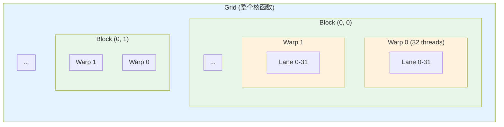
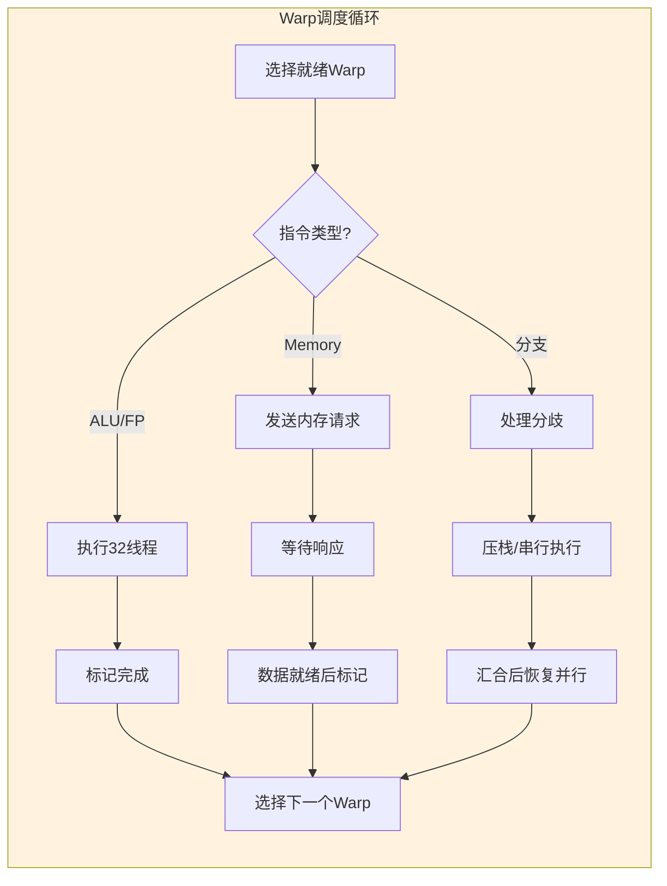
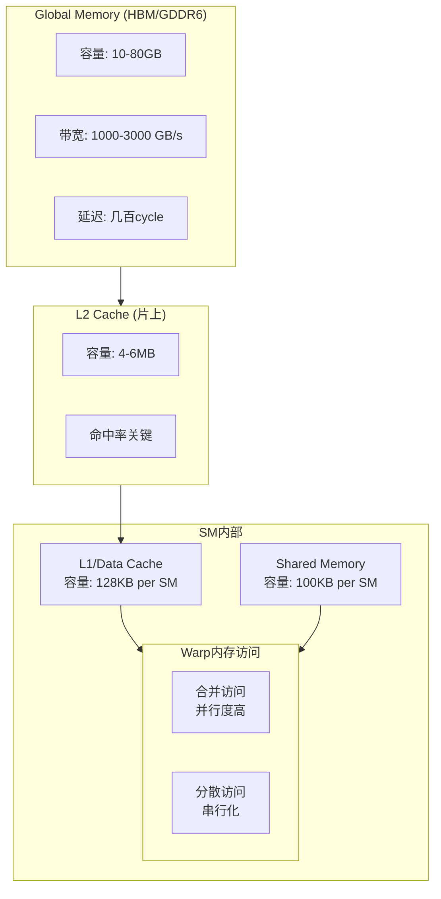

# 02.2 GPU调度

---

📌 **内容摘要**

本文档深入探讨GPU调度的核心原理和关键方法。内容涵盖硬件调度领域的主要知识点，包括任务调度, 调度, 资源分配等关键主题。适合有一定基础的学习者系统学习。

**关键词**: 任务调度, 硬件调度, 调度, 资源分配

📚 **学习目标**
- 掌握GPU调度的核心概念和主要方法
- 理解相关理论的应用场景
- 能够分析和实现相关算法

🎯 **难度级别**: 中级

⏱️ **预计阅读时间**: 15分钟

**前置知识**: 相关领域的基础概念, 算法与数据结构

---


> **交叉引用**: 源Matter中的GPU调度文档
>
> - [Matter: GPU架构](../../Matter/01_计算机组成原理/04.2_GPU架构.md)
> - [Matter: CUDA编程模型](../../Matter/01_计算机组成原理/04.3_CUDA编程模型.md)
> - [FormalRE: GPU调度理论](../../FormalRE/硬件/GPU调度模型.md)

---

## 02.2.1 GPU执行模型

### 02.2.1.1 层次化线程组织


### 02.2.1.2 执行模型形式化

**定义 02.2.1** (GPU执行单元). GPU调度涉及以下层次：

- **Kernel**: $K = (G, B, T_{\text{shared}}, T_{\text{reg}})$
  - $G$: Grid维度（线程块数量）
  - $B$: Block维度（每块线程数）
  - $T_{\text{shared}}$: 共享内存需求
  - $T_{\text{reg}}$: 寄存器需求

- **SM占用约束**:

  $$N_{\text{blocks}}^{\max} = \min\left(\frac{\text{SharedMem}_{\text{total}}}{T_{\text{shared}}}, \frac{\text{Registers}_{\text{total}}}{B \cdot T_{\text{reg}} \cdot 256}, 32\right)$$

---

## 02.2.2 Warp调度

### 02.2.2.1 Warp执行模型

**定义 02.2.2** (Warp). Warp是GPU的基本调度单位，包含32个线程，执行SIMT（单指令多线程）模式：


### 02.2.2.2 调度策略

**GTO (Greedy Then Oldest)**:

$$\text{选择Warp} = \begin{cases} \text{同一Warp继续执行} & \text{if 仍有就绪指令} \\ \text{最老的就绪Warp} & \text{otherwise} \end{cases}$$

**Two-Level调度**:

$$\mathcal{W} = \mathcal{W}_{\text{prior}} \cup \mathcal{W}_{\text{non-prior}}$$

优先调度 $\mathcal{W}_{\text{prior}}$ 中的warp，减少内存等待开销。

### 02.2.2.3 Rust实现：Warp调度器

```rust
/// Warp调度器
pub struct WarpScheduler {
    /// SM上的所有Warp
    warps: Vec<Warp>,
    /// 调度策略
    policy: WarpSchedulingPolicy,
    /// 当前调度的Warp索引
    current_warp: Option<WarpId>,
    /// 记分板：跟踪寄存器依赖
    scoreboard: Scoreboard,
    /// 分歧栈
    divergence_stack: Vec<DivergenceEntry>,
}

/// Warp状态
#[derive(Debug, Clone, Copy, PartialEq)]
pub enum WarpState {
    /// 等待指令获取
    Fetching,
    /// 等待记分板
    ScoreboardStall,
    /// 等待内存响应
    MemoryWait,
    /// 执行中
    Executing,
    /// 在分歧栈中
    Diverged,
    /// 已完成
    Completed,
}

/// Warp调度策略
#[derive(Debug, Clone, Copy)]
pub enum WarpSchedulingPolicy {
    /// 轮询
    RoundRobin,
    /// 贪婪-最老
    GreedyThenOldest,
    /// 两级调度
    TwoLevel { active_limit: usize },
    /// 缓存感知
    CacheAware,
}

/// Warp结构
#[derive(Debug, Clone)]
pub struct Warp {
    pub id: WarpId,
    pub block_id: BlockId,
    pub state: WarpState,
    /// 程序计数器
    pub pc: Address,
    /// 活跃掩码（哪些线程活跃）
    pub active_mask: ThreadMask,
    /// 分歧栈深度
    pub divergence_depth: usize,
    /// 指令历史（用于Two-Level策略）
    pub inst_history: VecDeque<Instruction>,
    /// 上次调度周期
    pub last_scheduled_cycle: Cycle,
    /// 内存请求队列
    pub pending_mem_requests: Vec<MemRequestId>,
}

impl WarpScheduler {
    /// 每时钟周期调度
    pub fn cycle(&mut self, current_cycle: Cycle) -> Option<(WarpId, Instruction)> {
        // 1. 更新warp状态
        self.update_warp_states();

        // 2. 根据策略选择warp
        let selected_warp = self.select_warp(current_cycle)?;

        // 3. 获取指令
        let instruction = self.fetch_instruction(selected_warp)?;

        // 4. 检查记分板
        if self.scoreboard.check_conflict(selected_warp, &instruction) {
            self.warps[selected_warp.0].state = WarpState::ScoreboardStall;
            return None;
        }

        // 5. 处理分支分歧
        if instruction.is_branch() {
            self.handle_branch(selected_warp, &instruction);
        }

        // 6. 更新记分板
        self.scoreboard.reserve(selected_warp, &instruction);

        // 7. 更新warp状态
        self.warps[selected_warp.0].last_scheduled_cycle = current_cycle;
        self.warps[selected_warp.0].inst_history.push_back(instruction.clone());
        if self.warps[selected_warp.0].inst_history.len() > 10 {
            self.warps[selected_warp.0].inst_history.pop_front();
        }

        self.current_warp = Some(selected_warp);

        Some((selected_warp, instruction))
    }

    fn select_warp(&self, current_cycle: Cycle) -> Option<WarpId> {
        match self.policy {
            WarpSchedulingPolicy::RoundRobin => {
                self.round_robin_select()
            }
            WarpSchedulingPolicy::GreedyThenOldest => {
                self.gto_select()
            }
            WarpSchedulingPolicy::TwoLevel { active_limit } => {
                self.two_level_select(active_limit, current_cycle)
            }
            WarpSchedulingPolicy::CacheAware => {
                self.cache_aware_select()
            }
        }
    }

    /// Greedy-Then-Oldest选择
    fn gto_select(&self) -> Option<WarpId> {
        // 尝试继续当前warp（贪婪）
        if let Some(current) = self.current_warp {
            if self.is_warp_ready(current) {
                return Some(current);
            }
        }

        // 选择最老的就绪warp
        self.warps
            .iter()
            .filter(|w| self.is_warp_ready(w.id))
            .min_by_key(|w| w.last_scheduled_cycle)
            .map(|w| w.id)
    }

    /// Two-Level选择
    fn two_level_select(&self, active_limit: usize, current_cycle: Cycle)
        -> Option<WarpId> {
        // 将warp分为优先组和非优先组
        let (prior, non_prior): (Vec<_>, Vec<_>) = self.warps
            .iter()
            .filter(|w| self.is_warp_ready(w.id))
            .partition(|w| {
                // 近期被调度过的为优先组
                current_cycle - w.last_scheduled_cycle < active_limit as u64
            });

        // 优先从优先组选择
        if !prior.is_empty() {
            prior.iter()
                .min_by_key(|w| w.last_scheduled_cycle)
                .map(|w| w.id)
        } else {
            non_prior.iter()
                .min_by_key(|w| w.last_scheduled_cycle)
                .map(|w| w.id)
        }
    }

    /// 处理分支分歧
    fn handle_branch(&mut self, warp_id: WarpId, inst: &Instruction) {
        let warp = &mut self.warps[warp_id.0];

        // 计算活跃掩码的分割
        let (taken_mask, not_taken_mask) = self.evaluate_branch(inst, warp.active_mask);

        if taken_mask.any() && not_taken_mask.any() {
            // 存在分歧，压栈
            let divergence_entry = DivergenceEntry {
                pc: warp.pc + inst.instruction_size(),
                active_mask: not_taken_mask,
                reconvergence_pc: self.find_reconvergence_point(warp.pc),
            };

            self.divergence_stack.push(divergence_entry);
            warp.active_mask = taken_mask;
            warp.divergence_depth += 1;
            warp.state = WarpState::Diverged;
        }
    }

    fn is_warp_ready(&self, warp_id: WarpId) -> bool {
        let warp = &self.warps[warp_id.0];
        warp.state == WarpState::Fetching
            && !warp.active_mask.none()
            && warp.pending_mem_requests.is_empty()
    }

    fn update_warp_states(&mut self) {
        for warp in &mut self.warps {
            match warp.state {
                WarpState::MemoryWait => {
                    // 检查内存请求是否完成
                    if warp.pending_mem_requests.is_empty() {
                        warp.state = WarpState::Fetching;
                    }
                }
                WarpState::Diverged => {
                    // 检查是否可以汇合
                    if let Some(entry) = self.divergence_stack.last() {
                        if warp.pc == entry.reconvergence_pc {
                            warp.active_mask |= entry.active_mask;
                            warp.divergence_depth -= 1;
                            self.divergence_stack.pop();
                            if warp.divergence_depth == 0 {
                                warp.state = WarpState::Fetching;
                            }
                        }
                    }
                }
                _ => {}
            }
        }
    }
}

/// 记分板：跟踪寄存器依赖
pub struct Scoreboard {
    /// 每个warp的未就绪寄存器集合
    pending_regs: HashMap<WarpId, HashSet<RegisterId>>,
}

impl Scoreboard {
    pub fn check_conflict(&self, warp_id: WarpId, inst: &Instruction) -> bool {
        if let Some(pending) = self.pending_regs.get(&warp_id) {
            // 检查源操作数是否有未就绪的
            for src in &inst.src_regs {
                if pending.contains(src) {
                    return true; // 存在冲突
                }
            }
        }
        false
    }

    pub fn reserve(&mut self, warp_id: WarpId, inst: &Instruction) {
        let entry = self.pending_regs.entry(warp_id).or_insert_with(HashSet::new);
        // 标记目的寄存器为未就绪
        for dst in &inst.dst_regs {
            entry.insert(*dst);
        }
    }

    pub fn release(&mut self, warp_id: WarpId, reg: RegisterId) {
        if let Some(pending) = self.pending_regs.get_mut(&warp_id) {
            pending.remove(&reg);
        }
    }
}
```
---

## 02.2.3 内存调度

### 02.2.3.1 GPU内存层次


### 02.2.3.2 内存合并与银行冲突

**定义 02.2.3** (内存合并). 一个warp中的32个线程同时访问全局内存时，若访问地址连续，则合并为最少的事务：

$$\text{事务数} = \left\lceil \frac{32 \times \text{access\_size}}{128} \right\rceil$$

**银行冲突**: 共享内存分为32个银行，同周期同银行的多线程访问导致串行化：

$$\text{冲突度} = \max_{b \in [0,31]} \left| \{t \in [0,31] : \text{bank}(addr_t) = b\} \right|$$

### 02.2.3.3 内存请求调度

```rust
/// 内存请求调度器（位于内存控制器）
pub struct MemoryScheduler {
    /// 待处理请求队列
    pending_queue: VecDeque<MemRequest>,
    /// 行缓冲区状态
    row_buffers: Vec<Option<RowAddress>>,
    /// 调度策略
    policy: MemSchedulingPolicy,
    /// 统计信息
    stats: MemStats,
}

#[derive(Debug, Clone, Copy)]
pub enum MemSchedulingPolicy {
    /// FIFO
    FirstComeFirstServe,
    /// FR-FCFS：优先行命中
    FrFcfs,
    /// 最短作业优先（针对请求大小）
    ShortestJobFirst,
}

#[derive(Debug, Clone)]
pub struct MemRequest {
    pub id: MemRequestId,
    pub warp_id: WarpId,
    pub address: PhysicalAddress,
    pub size: usize,
    pub is_write: bool,
    pub arrival_cycle: Cycle,
}

impl MemoryScheduler {
    /// 调度内存请求
    pub fn schedule(&mut self, current_cycle: Cycle) -> Vec<MemRequest> {
        match self.policy {
            MemSchedulingPolicy::FirstComeFirstServe => {
                self.schedule_fcfs(current_cycle)
            }
            MemSchedulingPolicy::FrFcfs => {
                self.schedule_frfcfs(current_cycle)
            }
            MemSchedulingPolicy::ShortestJobFirst => {
                self.schedule_sjf(current_cycle)
            }
        }
    }

    /// FR-FCFS调度（First-Ready First-Come First-Serve）
    fn schedule_frfcfs(&mut self, current_cycle: Cycle) -> Vec<MemRequest> {
        let mut scheduled = vec![];
        let mut remaining: Vec<_> = self.pending_queue.drain(..).collect();

        // 按行命中优先级排序
        remaining.sort_by(|a, b| {
            let bank_a = self.get_bank(a.address);
            let bank_b = self.get_bank(b.address);
            let row_a = self.get_row(a.address);
            let row_b = self.get_row(b.address);

            let hit_a = self.row_buffers[bank_a] == Some(row_a);
            let hit_b = self.row_buffers[bank_b] == Some(row_b);

            // 行命中优先，其次FCFS
            hit_b.cmp(&hit_a)
                .then_with(|| a.arrival_cycle.cmp(&b.arrival_cycle))
        });

        // 选择请求（考虑银行约束）
        let mut used_banks = HashSet::new();
        for req in remaining {
            let bank = self.get_bank(req.address);
            if !used_banks.contains(&bank) {
                used_banks.insert(bank);
                scheduled.push(req);

                // 更新行缓冲区
                self.row_buffers[bank] = Some(self.get_row(req.address));
            } else {
                self.pending_queue.push_back(req);
            }
        }

        scheduled
    }

    fn get_bank(&self, addr: PhysicalAddress) -> usize {
        // 简化实现：假设地址映射
        ((addr >> 10) & 0xF) as usize
    }

    fn get_row(&self, addr: PhysicalAddress) -> RowAddress {
        (addr >> 14) as RowAddress
    }
}
```
---

## 02.2.4 C++伪代码：GPU调度模拟器

```cpp
#pragma once
#include <vector>
#include <array>
#include <bitset>
#include <queue>
#include <stack>

namespace gpu {
namespace scheduling {

// GPU配置常量
constexpr size_t WARP_SIZE = 32;
constexpr size_t MAX_WARPS_PER_SM = 64;
constexpr size_t MAX_BLOCKS_PER_SM = 32;
constexpr size_t NUM_BANKS = 32;
constexpr size_t BANK_GRANULARITY = 4; // 4 bytes

// 线程掩码
using ThreadMask = std::bitset<WARP_SIZE>;

// 指令类型
enum class InstType {
    ALU, FP, LOAD, STORE, BRANCH, BARRIER, MEM_FENCE
};

// GPU指令
template<size_t MaxSrc = 4, size_t MaxDst = 2>
struct Instruction {
    InstType type;
    uint64_t pc;
    std::array<int, MaxSrc> src_regs;
    std::array<int, MaxDst> dst_regs;
    size_t num_src;
    size_t num_dst;

    // 内存指令信息
    struct MemInfo {
        bool is_global;
        size_t access_size; // bytes per thread
        bool is_coalesced_hint;
    } mem_info;

    // 分支信息
    struct BranchInfo {
        int64_t offset;
        bool is_conditional;
        int predicate_reg;
    } branch_info;

    uint32_t latency;
};

// Warp状态
struct Warp {
    uint32_t warp_id;
    uint32_t block_id;
    uint64_t pc;
    ThreadMask active_mask;

    enum class State {
        READY,              // 就绪
        SCOREBOARD_STALL,   // 寄存器依赖
        MEMORY_WAIT,        // 等待内存
        BARRIER_WAIT,       // 等待同步
        DIVERGED,           // 分支分歧
        COMPLETED           // 完成
    } state;

    // 分歧栈
    struct DivergenceEntry {
        uint64_t rpc;           // 汇合点
        ThreadMask mask;        // 待执行掩码
        uint64_t pc;            // 目标PC
    };
    std::stack<DivergenceEntry> divergence_stack;

    // 统计
    uint64_t cycles_in_state[7] = {0};
};

// SM (Streaming Multiprocessor) 调度器
class SMScheduler {
public:
    SMScheduler(size_t max_warps, size_t max_blocks)
        : max_warps_(max_warps)
        , max_blocks_(max_blocks)
        , current_cycle_(0) {}

    // 分配Block到SM
    bool allocate_block(const BlockConfig& config) {
        if (allocated_blocks_.size() >= max_blocks_) {
            return false;
        }

        // 检查资源约束
        size_t warps_needed = (config.threads_per_block + WARP_SIZE - 1) / WARP_SIZE;
        if (allocated_warps_ + warps_needed > max_warps_) {
            return false;
        }

        // 分配Warp
        uint32_t block_id = next_block_id_++;
        for (size_t i = 0; i < warps_needed; ++i) {
            Warp warp;
            warp.warp_id = allocated_warps_ + i;
            warp.block_id = block_id;
            warp.pc = config.entry_pc;
            warp.active_mask.set(); // 所有线程初始活跃
            warp.state = Warp::State::READY;

            // 最后一个warp可能有部分线程不活跃
            if (i == warps_needed - 1) {
                size_t active_threads = config.threads_per_block % WARP_SIZE;
                if (active_threads != 0) {
                    for (size_t t = active_threads; t < WARP_SIZE; ++t) {
                        warp.active_mask.reset(t);
                    }
                }
            }

            warps_.push_back(warp);
        }

        allocated_warps_ += warps_needed;
        allocated_blocks_.push_back(block_id);

        return true;
    }

    // 每周期执行
    void cycle() {
        current_cycle_++;

        // 1. 检查完成的内存请求
        process_memory_completions();

        // 2. 更新Warp状态
        update_warp_states();

        // 3. 选择并发射Warp
        if (auto* warp = select_warp()) {
            issue_warp(warp);
        }

        // 4. 统计更新
        for (auto& warp : warps_) {
            warp.cycles_in_state[static_cast<size_t>(warp.state)]++;
        }
    }

private:
    size_t max_warps_;
    size_t max_blocks_;
    size_t allocated_warps_ = 0;
    uint32_t next_block_id_ = 0;
    uint64_t current_cycle_;

    std::vector<Warp> warps_;
    std::vector<uint32_t> allocated_blocks_;

    // 记分板
    std::vector<std::bitset<256>> scoreboard_; // 假设256个寄存器

    // 内存请求队列
    struct PendingMemRequest {
        uint32_t warp_id;
        uint64_t address;
        bool is_write;
        uint32_t completion_cycle;
    };
    std::queue<PendingMemRequest> pending_mem_requests_;

    Warp* select_warp() {
        // 简单的轮询策略
        static size_t last_selected = 0;

        for (size_t i = 0; i < warps_.size(); ++i) {
            size_t idx = (last_selected + i + 1) % warps_.size();
            if (warps_[idx].state == Warp::State::READY &&
                !warps_[idx].active_mask.none()) {
                last_selected = idx;
                return &warps_[idx];
            }
        }
        return nullptr;
    }

    void issue_warp(Warp* warp) {
        // 获取指令
        Instruction<> inst = fetch_instruction(warp->pc);

        // 记分板检查
        if (has_scoreboard_conflict(warp->warp_id, inst)) {
            warp->state = Warp::State::SCOREBOARD_STALL;
            return;
        }

        // 执行指令
        switch (inst.type) {
            case InstType::ALU:
            case InstType::FP:
                execute_alu(warp, inst);
                break;

            case InstType::LOAD:
            case InstType::STORE:
                issue_memory(warp, inst);
                break;

            case InstType::BRANCH:
                handle_branch(warp, inst);
                break;

            case InstType::BARRIER:
                handle_barrier(warp);
                break;

            default:
                break;
        }

        // 更新记分板
        update_scoreboard(warp->warp_id, inst);
    }

    void handle_branch(Warp* warp, const Instruction<>& inst) {
        if (!inst.branch_info.is_conditional) {
            // 无条件分支
            warp->pc += inst.branch_info.offset;
        } else {
            // 条件分支：需要评估谓词
            auto [taken_mask, not_taken_mask] = evaluate_predicate(
                warp->active_mask,
                inst.branch_info.predicate_reg
            );

            if (taken_mask.any() && not_taken_mask.any()) {
                // 分歧
                Warp::DivergenceEntry entry;
                entry.rpc = find_reconvergence_point(warp->pc);
                entry.mask = not_taken_mask;
                entry.pc = warp->pc + inst.instruction_size();

                warp->divergence_stack.push(entry);
                warp->active_mask = taken_mask;
                warp->pc += inst.branch_info.offset;
                warp->state = Warp::State::DIVERGED;
            } else if (taken_mask.any()) {
                warp->pc += inst.branch_info.offset;
            } else {
                warp->pc += inst.instruction_size();
            }
        }
    }

    void issue_memory(Warp* warp, const Instruction<>& inst) {
        // 计算每个线程的地址
        std::vector<uint64_t> addresses;
        for (size_t t = 0; t < WARP_SIZE; ++t) {
            if (warp->active_mask.test(t)) {
                uint64_t addr = calculate_effective_address(
                    warp->warp_id, t, inst
                );
                addresses.push_back(addr);
            }
        }

        // 检查合并
        auto transactions = coalesce_addresses(addresses, inst.mem_info.access_size);

        // 发送内存请求
        for (const auto& txn : transactions) {
            PendingMemRequest req;
            req.warp_id = warp->warp_id;
            req.address = txn.base_address;
            req.is_write = (inst.type == InstType::STORE);
            req.completion_cycle = current_cycle_ + calculate_memory_latency(txn);

            pending_mem_requests_.push(req);
        }

        warp->state = Warp::State::MEMORY_WAIT;
    }

    std::vector<MemTransaction> coalesce_addresses(
        const std::vector<uint64_t>& addresses,
        size_t access_size
    ) {
        // 简化实现：按128字节分段
        std::set<uint64_t> segments;
        for (auto addr : addresses) {
            segments.insert(addr & ~0x7F); // 128字节对齐
        }

        std::vector<MemTransaction> transactions;
        for (auto seg : segments) {
            transactions.push_back({seg, 128});
        }
        return transactions;
    }

    void process_memory_completions() {
        while (!pending_mem_requests_.empty() &&
               pending_mem_requests_.front().completion_cycle <= current_cycle_) {
            auto& req = pending_mem_requests_.front();
            warps_[req.warp_id].state = Warp::State::READY;
            pending_mem_requests_.pop();
        }
    }

    void update_warp_states() {
        for (auto& warp : warps_) {
            if (warp.state == Warp::State::DIVERGED &&
                warp.pc == warp.divergence_stack.top().rpc) {
                // 汇合
                auto& entry = warp.divergence_stack.top();
                warp.active_mask |= entry.mask;
                warp.divergence_stack.pop();

                if (warp.divergence_stack.empty()) {
                    warp.state = Warp::State::READY;
                }
            }
        }
    }

    // 辅助函数声明...
    Instruction<> fetch_instruction(uint64_t pc);
    bool has_scoreboard_conflict(uint32_t warp_id, const Instruction<>& inst);
    void execute_alu(Warp* warp, const Instruction<>& inst);
    std::pair<ThreadMask, ThreadMask> evaluate_predicate(
        const ThreadMask& active, int pred_reg);
    uint64_t find_reconvergence_point(uint64_t branch_pc);
    void handle_barrier(Warp* warp);
    void update_scoreboard(uint32_t warp_id, const Instruction<>& inst);
    uint64_t calculate_effective_address(uint32_t warp, size_t lane,
                                          const Instruction<>& inst);
    uint32_t calculate_memory_latency(const MemTransaction& txn);
};

} // namespace scheduling
} // namespace gpu
```

---

## 02.2.5 总结

| 调度层次 | 调度单元 | 关键策略 | 优化目标 |
|----------|----------|----------|----------|
| Warp级 | 32线程warp | GTO、Two-Level | 隐藏延迟 |
| Block级 | Thread Block | 占用最大化 | 并行度 |
| 内存级 | 全局/共享内存 | FR-FCFS、合并 | 带宽利用率 |

**延伸阅读**:

- [02.1 CPU调度](./02.1_CPU调度.md) - 指令级、线程级调度
- [02.3 加速器调度](./02.3_加速器调度.md) - TPU、AI加速器
---

## 📋 前置知识

- [02.1 CPU调度](../02_硬件调度/02.1_CPU调度.md)

---

## 📚 延伸阅读

- [02.1 CPU调度](../02_硬件调度/02.1_CPU调度.md)
- [01.1 调度模型抽象](../01_调度理论基础/01.1_调度模型抽象.md)
- [01.1 调度问题定义](../01_调度理论基础/01.1_调度问题定义.md)
- [02.2 内存调度](../02_硬件调度/02.2_内存调度.md)
- [02.3 加速器调度](../02_硬件调度/02.3_加速器调度.md)
