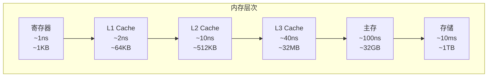
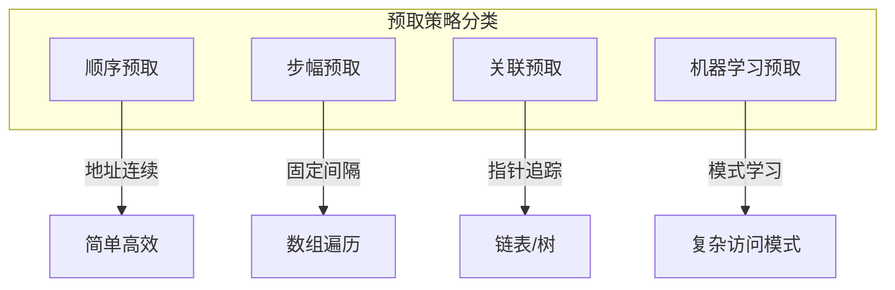
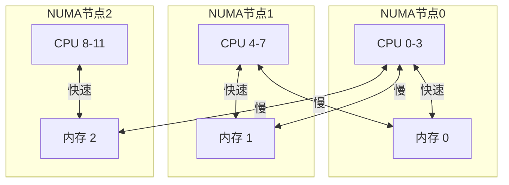

# 02.2 内存调度

---

📌 **内容摘要**

本文档深入探讨内存调度的核心原理和关键方法。内容涵盖硬件调度领域的主要知识点，包括任务调度, 调度, 资源分配等关键主题。适合有一定基础的学习者系统学习。

**关键词**: 任务调度, 硬件调度, 调度, 资源分配

📚 **学习目标**

- 掌握内存调度的核心概念和主要方法
- 理解相关理论的应用场景
- 能够分析和实现相关算法

🎯 **难度级别**: 中级

⏱️ **预计阅读时间**: 15分钟

**前置知识**: 相关领域的基础概念, 算法与数据结构

---


> **形式科学 · 调度系统系列**
> 上一篇: [02.1 CPU调度](02.1_CPU调度.md) | 下一篇: [02.3 存储调度](02.3_存储调度.md)

---

## 1. 内存层次结构

### 1.1 层次结构模型



**局部性原理**：

$$\text{时空局部性} \Rightarrow \text{缓存有效}$$

- **时间局部性**: 最近访问的数据很可能再次被访问
- **空间局部性**: 相邻数据很可能被连续访问

### 1.2 性能模型

**平均内存访问时间 (AMAT)**:

$$\text{AMAT} = t_{hit} + (1 - h) \cdot t_{miss}$$

其中：

- $h$: 缓存命中率
- $t_{hit}$: 命中访问时间
- $t_{miss}$: 缺失惩罚

---

## 2. 缓存替换策略

### 2.1 替换策略分类

| 策略 | 描述 | 实现复杂度 | 命中率 |
|------|------|-----------|--------|
| **LRU** | 最近最少使用 | 中 | 高 |
| **FIFO** | 先进先出 | 低 | 中 |
| **LFU** | 最少使用 | 中 | 中 |
| **Random** | 随机替换 | 低 | 中 |
| **OPT** | 最优（理论） | - | 最高 |
| **Clock** | 时钟算法 | 低 | 接近LRU |

### 2.2 LRU 形式化定义

**定义 2.1（LRU）**: 当需要替换时，选择最长时间未被访问的缓存行：

$$\text{ Victim} = \arg\min_{b \in \text{Cache}} t_{last\_access}(b)$$

### 2.3 Rust 实现：LRU 缓存

```rust
// Rust: LRU缓存实现
use std::collections::HashMap;
use std::hash::Hash;

pub struct LRUCache<K, V> {
    capacity: usize,
    cache: HashMap<K, Node<V>>,
    lru_list: LinkedList<K>,
}

struct Node<V> {
    value: V,
    list_ptr: *mut ListNode<K>,
}

impl<K: Eq + Hash + Clone, V> LRUCache<K, V> {
    pub fn new(capacity: usize) -> Self {
        Self {
            capacity,
            cache: HashMap::with_capacity(capacity),
            lru_list: LinkedList::new(),
        }
    }

    pub fn get(&mut self, key: &K) -> Option<&V> {
        if let Some(node) = self.cache.get_mut(key) {
            // 移动到队首（最近使用）
            self.lru_list.move_to_front(node.list_ptr);
            Some(&node.value)
        } else {
            None
        }
    }

    pub fn put(&mut self, key: K, value: V) {
        if let Some(node) = self.cache.get_mut(&key) {
            // 更新现有值
            node.value = value;
            self.lru_list.move_to_front(node.list_ptr);
        } else {
            // 检查容量
            if self.cache.len() >= self.capacity {
                // 淘汰LRU项
                let lru_key = self.lru_list.pop_back().unwrap();
                self.cache.remove(&lru_key);
            }

            // 插入新项
            let ptr = self.lru_list.push_front(key.clone());
            self.cache.insert(key, Node {
                value,
                list_ptr: ptr,
            });
        }
    }
}

// 简化版：使用Vec实现
pub struct SimpleLRUCache<K, V> {
    capacity: usize,
    entries: Vec<(K, V)>,  // 按访问时间排序，新访问在尾部
}

impl<K: Eq + Clone, V: Clone> SimpleLRUCache<K, V> {
    pub fn get(&mut self, key: &K) -> Option<V> {
        let pos = self.entries.iter().position(|(k, _)| k == key)?;
        let entry = self.entries.remove(pos);
        self.entries.push(entry.clone());
        Some(entry.1)
    }

    pub fn put(&mut self, key: K, value: V) {
        if let Some(pos) = self.entries.iter().position(|(k, _)| k == &key) {
            self.entries.remove(pos);
        } else if self.entries.len() >= self.capacity {
            self.entries.remove(0);  // 移除LRU
        }
        self.entries.push((key, value));
    }
}
```

### 2.4 Haskell 实现：时钟算法

```haskell
-- Haskell: 时钟(Clock)替换算法
module Memory.ClockAlgorithm where

import Data.Array.IO (IOArray, newArray, readArray, writeArray)
import Data.IORef (IORef, newIORef, readIORef, writeIORef)

data ClockEntry k v = ClockEntry {
    key :: k,
    value :: v,
    referenceBit :: Bool
} deriving (Show)

data ClockCache k v = ClockCache {
    entries :: IOArray Int (Maybe (ClockEntry k v)),
    clockHand :: IORef Int,
    capacity :: Int
}

-- 初始化时钟缓存
initClockCache :: Int -> IO (ClockCache k v)
initClockCache capacity = do
    entries <- newArray (0, capacity - 1) Nothing
    hand <- newIORef 0
    return $ ClockCache entries hand capacity

-- 访问数据
clockAccess :: (Eq k) => ClockCache k v -> k -> IO (Maybe v)
clockAccess cache key = do
    let size = capacity cache
    -- 查找是否存在
    found <- findEntry cache key
    case found of
        Just (idx, entry) -> do
            -- 设置引用位
            writeArray (entries cache) idx (Just entry { referenceBit = True })
            return (Just $ value entry)
        Nothing -> return Nothing

-- 插入/替换
clockInsert :: ClockCache k v -> k -> v -> IO ()
clockInsert cache key value = do
    let size = capacity cache
    hand <- readIORef (clockHand cache)

    -- 尝试找到空槽或可替换项
    (idx, replaced) <- findSlot cache hand

    -- 写入新项
    writeArray (entries cache) idx (Just $ ClockEntry key value True)
    writeIORef (clockHand cache) ((idx + 1) `mod` size)
  where
    findSlot cache hand = do
        entry <- readArray (entries cache) hand
        case entry of
            Nothing -> return (hand, Nothing)
            Just e ->
                if referenceBit e
                    then do  -- 引用位为1，清零并继续
                        writeArray (entries cache) hand
                            (Just e { referenceBit = False })
                        findSlot cache ((hand + 1) `mod` capacity cache)
                    else  -- 引用位为0，替换此项
                        return (hand, Just $ key e)
```

---

## 3. 缓存预取技术

### 3.1 预取策略



| 策略 | 触发条件 | 预取地址 | 准确率 | 开销 |
|------|----------|----------|--------|------|
| 顺序 | 访问 $A$, $A+1$ | $A+2$ | 高 | 低 |
| 步幅 | 访问 $A$, $A+s$ | $A+2s$ | 中 | 低 |
| 间接 | 访问 $A[i]$ | $A[A[i]]$ | 低 | 高 |
| 标记 | 特定PC | 历史关联 | 中 | 中 |

### 3.2 预取收益模型

**覆盖率 (Coverage)**:

$$\text{Coverage} = \frac{\text{预取命中的缺失}}{\text{总缓存缺失}}$$

**准确率 (Accuracy)**:

$$\text{Accuracy} = \frac{\text{有用预取}}{\text{总预取}}$$

**性能影响**:

$$\text{Speedup} = \frac{1}{(1 - f) + \frac{f}{h \cdot A + (1-h)}}$$

其中 $f$ 为预取覆盖的缺失比例，$h$ 为准确率，$A$ 为预取提前量。

### 3.3 Rust 实现：步幅预取器

```rust
// Rust: 步幅预取器实现
use std::collections::HashMap;

pub struct StridePrefetcher {
    // PC -> 上一次访问地址
    last_access: HashMap<u64, u64>,
    // PC -> 步幅
    strides: HashMap<u64, i64>,
    // PC -> 步幅置信度
    confidence: HashMap<u64, u8>,
    // 预取度
    prefetch_degree: usize,
    // 置信度阈值
    confidence_threshold: u8,
}

impl StridePrefetcher {
    pub fn new(prefetch_degree: usize) -> Self {
        Self {
            last_access: HashMap::new(),
            strides: HashMap::new(),
            confidence: HashMap::new(),
            prefetch_degree,
            confidence_threshold: 2,
        }
    }

    pub fn access(&mut self, pc: u64, addr: u64) -> Vec<u64> {
        let mut prefetches = Vec::new();

        if let Some(&last_addr) = self.last_access.get(&pc) {
            let current_stride = addr as i64 - last_addr as i64;

            if let Some(&prev_stride) = self.strides.get(&pc) {
                if current_stride == prev_stride {
                    // 步幅一致，增加置信度
                    let conf = self.confidence.entry(pc).or_insert(0);
                    *conf = (*conf + 1).min(255);

                    // 置信度足够高时预取
                    if *conf >= self.confidence_threshold {
                        for i in 1..=self.prefetch_degree {
                            let pf_addr = addr.wrapping_add(
                                (current_stride * i as i64) as u64
                            );
                            prefetches.push(pf_addr);
                        }
                    }
                } else {
                    // 步幅变化，降低置信度
                    let conf = self.confidence.entry(pc).or_insert(0);
                    *conf = conf.saturating_sub(1);
                    self.strides.insert(pc, current_stride);
                }
            } else {
                // 首次计算步幅
                self.strides.insert(pc, current_stride);
                self.confidence.insert(pc, 1);
            }
        }

        self.last_access.insert(pc, addr);
        prefetches
    }
}
```

---

## 4. NUMA 内存调度

### 4.1 NUMA 架构

**定义 4.1（NUMA）**: 非统一内存访问（Non-Uniform Memory Access）架构中，处理器访问本地内存比远程内存更快。



**访问延迟对比**:

| 访问类型 | 延迟 | 带宽 |
|----------|------|------|
| 本地内存 | ~100ns | 高 |
| 同一插槽 | ~120ns | 高 |
| 跨插槽 | ~200ns | 中 |
| 远程节点 | ~400ns | 低 |

### 4.2 NUMA 感知调度

**内存分配策略**:

| 策略 | 描述 | 适用场景 |
|------|------|----------|
| 本地优先 | 优先从本地节点分配 | 通用计算 |
| 轮询 | 跨节点均匀分配 | 避免热点 |
| 绑定 | 强制指定节点 | 性能敏感 |
| 交错 | 页面级轮询 | 大内存工作集 |

### 4.3 Haskell 实现：NUMA 感知分配器

```haskell
-- Haskell: NUMA感知内存分配
module Memory.NUMA where

import Data.Array (Array, array, (!))
import Data.List (minimumBy)
import Data.Ord (comparing)

type NodeId = Int
type PageId = Int
type CPUId = Int

data NUMANode = NUMANode {
    nodeId :: NodeId,
    localCPUs :: [CPUId],
    freePages :: Int,
    accessLatency :: Array NodeId Int  -- 到其他节点的延迟
} deriving (Show)

data NUMASystem = NUMASystem {
    nodes :: Array NodeId NUMANode,
    pageToNode :: Array PageId NodeId,
    cpuToNode :: Array CPUId NodeId
}

-- 获取CPU所在节点
cpuNode :: NUMASystem -> CPUId -> NodeId
cpuNode sys cpu = cpuToNode sys ! cpu

-- 计算内存访问代价
accessCost :: NUMASystem -> CPUId -> NodeId -> Int
accessCost sys cpu memNode =
    let cpuNodeId = cpuNode sys cpu
        node = nodes sys ! cpuNodeId
    in accessLatency node ! memNode

-- NUMA感知页面分配
allocatePage :: NUMASystem -> CPUId -> (PageId, NUMASystem)
allocatePage sys cpu =
    let cpuNodeId = cpuNode sys cpu
        candidates = filter (\n -> freePages n > 0) (elems $ nodes sys)

        -- 选择代价最小的节点
        bestNode = minimumBy (\n1 n2 ->
            let cost1 = accessCost sys cpu (nodeId n1)
                cost2 = accessCost sys cpu (nodeId n2)
            in compare cost1 cost2) candidates

        pageId = allocateFromNode bestNode

        -- 更新系统状态
        newSys = sys {
            pageToNode = pageToNode sys // [(pageId, nodeId bestNode)]
        }
    in (pageId, newSys)

-- 页面迁移决策
shouldMigrate :: NUMASystem -> PageId -> CPUId -> Bool
shouldMigrate sys page cpu =
    let currentNode = pageToNode sys ! page
        cpuNodeId = cpuNode sys cpu
        currentCost = accessCost sys cpu currentNode
        localCost = accessLatency (nodes sys ! cpuNodeId) ! cpuNodeId
    in currentCost > localCost * 2  -- 阈值判断
```

---

## 5. 内存带宽调度

### 5.1 带宽管理

**QoS 控制**: 在共享内存系统中，防止某个应用独占带宽。

| 机制 | 粒度 | 精度 | 开销 |
|------|------|------|------|
| 页面着色 | 粗 | 低 | 低 |
| 内存控制器调度 | 中 | 中 | 中 |
| 带宽限制器 | 细 | 高 | 高 |

### 5.2 内存控制器调度

**调度策略对比**:


| 策略 | 原则 | 优点 | 缺点 |
|------|------|------|------|
| FCFS | 先来先服务 | 简单公平 | 忽略行缓冲局部性 |
| FR-FCFS | 行命中优先 | 高吞吐 | 可能饿死 |
| ATLAS | 服务时间感知 | 低延迟 | 复杂 |
| TCM | 应用分类 | 区分服务 | 需要分类 |

---

## 6. Lean 形式化：缓存一致性

```lean4
-- Lean: 缓存一致性协议形式化
inductive CacheState
  | Invalid      -- I: 无效
  | Shared       -- S: 共享（只读）
  | Exclusive    -- E: 独占（可写）
  | Modified     -- M: 已修改
  | Owned        -- O: MOESI中的O
  deriving DecidableEq, Repr

structure CacheLine where
  tag : Address
  state : CacheState
  data : Data
  deriving Repr

structure Cache where
  lines : Array (Option CacheLine)

-- MSI协议状态转换
def msiTransition : CacheState → Message → CacheState
  | .Invalid, .Read => .Shared
  | .Invalid, .ReadExclusive => .Exclusive
  | .Shared, .Read => .Shared
  | .Shared, .ReadExclusive => .Exclusive
  | .Shared, .Write => .Modified
  | .Exclusive, .Read => .Shared
  | .Exclusive, .Write => .Modified
  | .Modified, .Read => .Shared
  | .Modified, .WriteBack => .Invalid
  | s, _ => s  -- 其他情况保持不变

-- 一致性不变式
def coherenceInvariant (caches : Array Cache) (addr : Address) : Prop :=
  let states := caches.map (λ c => getState c addr)

  -- 至多一个Modified
  (states.count .Modified ≤ 1)

  -- Modified时无Shared
  ∧ (states.contains .Modified → states.count .Shared = 0)

  -- Exclusive时无其他缓存有此数据
  ∧ (states.contains .Exclusive → states.count (λ s => s ≠ .Invalid) = 1)

-- 定理：MSI协议保持一致性
theorem msiPreservesCoherence :
    ∀ (caches : Array Cache) (addr : Address) (msg : Message),
    coherenceInvariant caches addr →
    coherenceInvariant (applyMessage caches msg) addr := by
  sorry  -- 形式化证明
```

---

## 7. 性能指标与评估

### 7.1 内存性能指标

| 指标 | 定义 | 目标 |
|------|------|------|
| MPKI | 每千条指令缺失数 | 最小化 |
| 命中延迟 | 缓存命中时间 | 最小化 |
| 缺失惩罚 | 缓存缺失代价 | 最小化 |
| 带宽利用率 | 实际/峰值带宽 | 最大化 |
| 公平性 | 各流带宽分布 | 均衡 |

### 7.2 对比矩阵

| 技术 | 命中率提升 | 复杂度 | 硬件开销 | 适用场景 |
|------|-----------|--------|----------|----------|
| LRU | 基准 | 中 | 中 | 通用 |
| 预取 | 10-40% | 中 | 中 | 规则访问 |
| NUMA感知 | 20-50% | 高 | 低 | 多路服务器 |
| QoS控制 | - | 高 | 高 | 虚拟化/云 |

---

## 8. 参考文献

1. Hennessy, J. L., & Patterson, D. A. _Computer Architecture: A Quantitative Approach_. Morgan Kaufmann, 2019.
2. Jaleel, A., et al. "High performance cache replacement using re-reference interval prediction (RRIP)." _ACM SIGARCH_ 2010.
3. Mutlu, O., & Moscibroda, T. "Parallelism-aware batch scheduling." _IEEE Micro_ 2009.
4. Dashti, M., et al. "Traffic management: A holistic approach to memory placement on NUMA systems." _ASPLOS_ 2013.

---

## 9. 相关文档

- [02.1 CPU调度](02.1_CPU调度.md) - 流水线、乱序执行、分支预测
- [02.3 存储调度](02.3_存储调度.md) - 磁盘调度、SSD调度、I/O合并
- [02.4 网络调度](02.4_网络调度.md) - 包调度、QoS、拥塞控制
- [03.3 内存管理](../03_OS调度/03.3_IO调度.md) - 页面置换、工作集

---

## 📚 延伸阅读

- [02.1 CPU调度](../02_硬件调度/02.1_CPU调度.md)
- [1. 内存管理模型](./03_编程范式/01_编程语言理论/01.3_内存管理模型.md)
- [01.4 性能指标](../01_调度理论基础/01.4_性能指标.md)
- [02.4 网络调度](../02_硬件调度/02.4_网络调度.md)
- [02.3 存储调度](../02_硬件调度/02.3_加速器调度.md)
