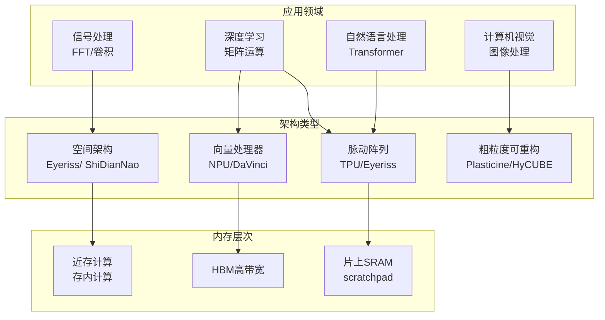
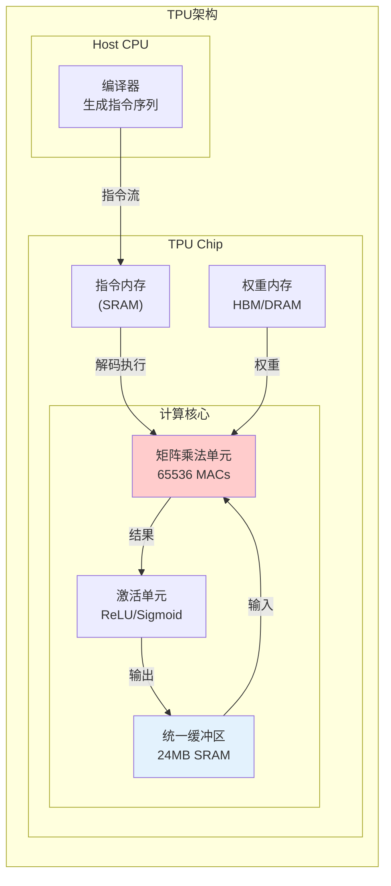

# 02.3 加速器调度

---

📌 **内容摘要**

本文档深入探讨加速器调度的核心原理和关键方法。内容涵盖硬件调度领域的主要知识点，包括任务调度, 调度, 资源分配等关键主题。适合有一定基础的学习者系统学习。

**关键词**: 任务调度, 硬件调度, 调度, 资源分配

📚 **学习目标**
- 掌握加速器调度的核心概念和主要方法
- 理解相关理论的应用场景
- 能够分析和实现相关算法

🎯 **难度级别**: 中级

⏱️ **预计阅读时间**: 15分钟

**前置知识**: 相关领域的基础概念, 算法与数据结构

---


> **交叉引用**: 源Matter中的AI加速器文档
>
> - [Matter: TPU架构](../../Matter/01_计算机组成原理/04.4_TPU架构.md)
> - [Matter: AI加速器](../../Matter/01_计算机组成原理/04.5_AI加速器.md)
> - [FormalRE: 加速器调度理论](../../FormalRE/硬件/AI加速器调度.md)

---

## 02.3.1 AI加速器架构概览

### 02.3.1.1 加速器类型对比



### 02.3.1.2 调度挑战对比

| 加速器 | 核心运算 | 主要瓶颈 | 调度关键 |
|--------|----------|----------|----------|
| TPU | 矩阵乘 (MxM) | 权重带宽 | 权重驻留、分批 |
| GPU | 通用并行 | 内存延迟 | warp调度、合并 |
| NPU | 卷积/全连接 | 数据重用 | tiling策略 |
| CGRA | 数据流图 | 路由拥塞 | 映射与调度 |

---

## 02.3.2 TPU调度

### 02.3.2.1 TPU架构



### 02.3.2.2 矩阵乘法调度

**定义 02.3.1** (MxM调度). 给定矩阵乘法 C = A * B，其中 A in R^{M*K}, B in R^{K*N}：

$$C_{ij} = sum_{k=0}^{K-1} A_{ik} * B_{kj}$$

**脉动阵列调度**:

$$PE_{i,j}^{(t)} = PE_{i,j}^{(t-1)} + A_{i,k}^{(t)} * B_{k,j}^{(t)}$$

其中PE为处理单元，数据在阵列中流动（脉动）。

### 02.3.2.3 TPU调度策略

```rust
/// TPU调度器
pub struct TPUScheduler {
    systolic_array: SystolicArrayConfig,
    unified_buffer: UnifiedBufferManager,
    weight_fifo: WeightFIFO,
    dma_engine: DMAEngine,
    current_instruction: Option<TpuInstruction>,
}

#[derive(Debug, Clone)]
pub struct SystolicArrayConfig {
    pub rows: usize,
    pub cols: usize,
    pub ops_per_cycle: usize,
}

#[derive(Debug, Clone)]
pub enum TpuInstruction {
    MatrixMultiply {
        a_addr: UnifiedBufferAddr,
        b_addr: WeightMemoryAddr,
        c_addr: UnifiedBufferAddr,
        m: usize, k: usize, n: usize,
        accumulate: bool,
    },
    Activate {
        input_addr: UnifiedBufferAddr,
        output_addr: UnifiedBufferAddr,
        size: usize,
        activation: ActivationType,
    },
    DMA {
        direction: DMADirection,
        host_addr: HostAddr,
        device_addr: DeviceAddr,
        size: usize,
    },
    Sync,
}

impl TPUScheduler {
    pub fn schedule_matmul(&mut self, matmul: &MatMulOp) -> Vec<TpuInstruction> {
        let mut instructions = vec![];
        let block_m = self.systolic_array.rows;
        let block_n = self.systolic_array.cols;
        let block_k = 128;

        for m_start in (0..matmul.m).step_by(block_m) {
            for n_start in (0..matmul.n).step_by(block_n) {
                for k_start in (0..matmul.k).step_by(block_k) {
                    instructions.push(TpuInstruction::DMA {
                        direction: DMADirection::HostToWeightFIFO,
                        host_addr: matmul.b_addr + (k_start * matmul.n + n_start) * 2,
                        device_addr: 0,
                        size: block_k * block_n * 2,
                    });

                    instructions.push(TpuInstruction::MatrixMultiply {
                        a_addr: matmul.a_addr + m_start * matmul.k + k_start,
                        b_addr: 0,
                        c_addr: matmul.c_addr + m_start * matmul.n + n_start,
                        m: (m_start + block_m).min(matmul.m) - m_start,
                        k: (k_start + block_k).min(matmul.k) - k_start,
                        n: (n_start + block_n).min(matmul.n) - n_start,
                        accumulate: k_start > 0,
                    });
                }
            }
        }
        instructions
    }
}
```

---

## 02.3.3 神经网络加速器调度

### 02.3.3.1 数据流调度模式

| 数据流 | 特征 | 适用场景 | 代表架构 |
|--------|------|----------|----------|
| WS (Weight Stationary) | 权重驻留 | 权重重用高 | Eyeriss |
| OS (Output Stationary) | 输出驻留 | 输出重用高 | ShiDianNao |
| NS (No Local Reuse) | 无局部重用 | 资源受限 | - |
| RS (Row Stationary) | 行级驻留 | CNN优化 | Eyeriss v2 |

---

## 02.3.4 C++伪代码：加速器调度框架

```cpp
#pragma once
#include <vector>
#include <memory>
#include <functional>

namespace accelerator {
namespace scheduling {

// 加速器类型
template<typename DataType>
struct Tensor {
    std::vector<size_t> shape;
    std::vector<DataType> data;
    MemoryLevel location;
};

enum class MemoryLevel {
    HOST,       // CPU内存
    HBM,        // 高带宽内存
    SRAM,       // 片上SRAM
    REGISTER    // 寄存器
};

// 算子定义
template<typename T>
struct Operator {
    enum class Type {
        CONV,           // 卷积
        MATMUL,         // 矩阵乘法
        ACTIVATION,     // 激活函数
        POOLING,        // 池化
        BATCHNORM,      // 批归一化
        ELEMENTWISE     // 逐元素运算
    } type;

    std::vector<Tensor<T>> inputs;
    std::vector<Tensor<T>> outputs;
    std::vector<size_t> params; // 算子参数
};

// 调度策略
template<typename T>
class SchedulingStrategy {
public:
    virtual ~SchedulingStrategy() = default;

    // 生成执行计划
    virtual std::vector<ExecutionStep<T>> schedule(
        const std::vector<Operator<T>>& graph,
        const AcceleratorConfig& config
    ) = 0;

    // 计算性能估计
    virtual PerformanceEstimate estimate(
        const std::vector<ExecutionStep<T>>& schedule,
        const AcceleratorConfig& config
    ) = 0;
};

// Tiling调度器
template<typename T>
class TilingScheduler : public SchedulingStrategy<T> {
public:
    struct TileConfig {
        size_t tile_m, tile_n, tile_k;  // 矩阵乘法分块
        size_t tile_h, tile_w, tile_c;  // 卷积分块
    };

    std::vector<ExecutionStep<T>> schedule(
        const std::vector<Operator<T>>& graph,
        const AcceleratorConfig& config
    ) override {
        std::vector<ExecutionStep<T>> schedule;

        for (const auto& op : graph) {
            auto steps = schedule_operator(op, config);
            schedule.insert(schedule.end(), steps.begin(), steps.end());
        }

        return schedule;
    }

private:
    std::vector<ExecutionStep<T>> schedule_operator(
        const Operator<T>& op,
        const AcceleratorConfig& config
    ) {
        switch (op.type) {
            case Operator<T>::Type::MATMUL:
                return schedule_matmul(op, config);
            case Operator<T>::Type::CONV:
                return schedule_conv(op, config);
            default:
                return schedule_default(op, config);
        }
    }

    std::vector<ExecutionStep<T>> schedule_matmul(
        const Operator<T>& op,
        const AcceleratorConfig& config
    ) {
        // 解析维度
        size_t M = op.inputs[0].shape[0];
        size_t K = op.inputs[0].shape[1];
        size_t N = op.inputs[1].shape[1];

        // 确定分块大小
        TileConfig tiles;
        tiles.tile_m = config.systolic_rows;
        tiles.tile_n = config.systolic_cols;
        tiles.tile_k = 128; // 可配置

        std::vector<ExecutionStep<T>> steps;

        // 生成tile调度
        for (size_t m = 0; m < M; m += tiles.tile_m) {
            for (size_t n = 0; n < N; n += tiles.tile_n) {
                for (size_t k = 0; k < K; k += tiles.tile_k) {
                    // 加载权重tile
                    steps.push_back({
                        .type = ExecutionStep<T>::Type::LOAD_WEIGHT,
                        .tensor = slice_tensor(op.inputs[1], k, n, tiles),
                        .target_memory = MemoryLevel::SRAM
                    });

                    // 执行矩阵乘法tile
                    steps.push_back({
                        .type = ExecutionStep<T>::Type::COMPUTE,
                        .op_type = Operator<T>::Type::MATMUL,
                        .input_tiles = {
                            slice_tensor(op.inputs[0], m, k, tiles),
                            slice_tensor(op.inputs[1], k, n, tiles)
                        },
                        .accumulate = k > 0
                    });
                }

                // 存储输出tile
                steps.push_back({
                    .type = ExecutionStep<T>::Type::STORE,
                    .tensor = slice_tensor(op.outputs[0], m, n, tiles),
                    .target_memory = MemoryLevel::HBM
                });
            }
        }

        return steps;
    }
};

} // namespace scheduling
} // namespace accelerator
```

---

## 02.3.5 总结

| 加速器类型 | 调度特点 | 关键优化 |
|------------|----------|----------|
| TPU | 脉动阵列数据流 | 权重驻留、双缓冲 |
| NPU | 分层tiling | 数据重用最大化 |
| CGRA | 空间映射 | 路由优化、PE利用率 |

**延伸阅读**:

- [02.1 CPU调度](./02.1_CPU调度.md) - 指令级、线程级调度
- [02.2 GPU调度](./02.2_GPU调度.md) - warp调度、内存调度
- [04.2 大数据调度](../04_分布式调度/04.2_大数据调度.md) - 深度学习框架调度
---

## 📚 延伸阅读

- [02.2 GPU调度](../02_硬件调度/02.2_GPU调度.md)
- [04.2 大数据调度](../04_分布式调度/04.2_大数据调度.md)
- [02.1 CPU调度](../02_硬件调度/02.1_CPU调度.md)
- [04.2 数据流调度](../04_分布式调度/04.2_数据流调度.md)
- [02.2 内存调度](../02_硬件调度/02.2_内存调度.md)
