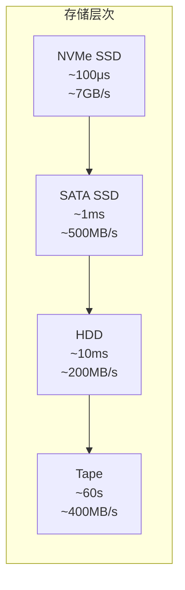
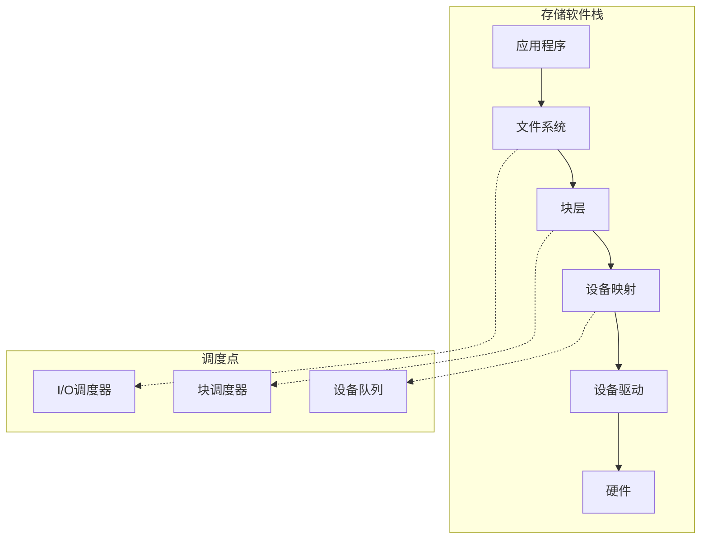
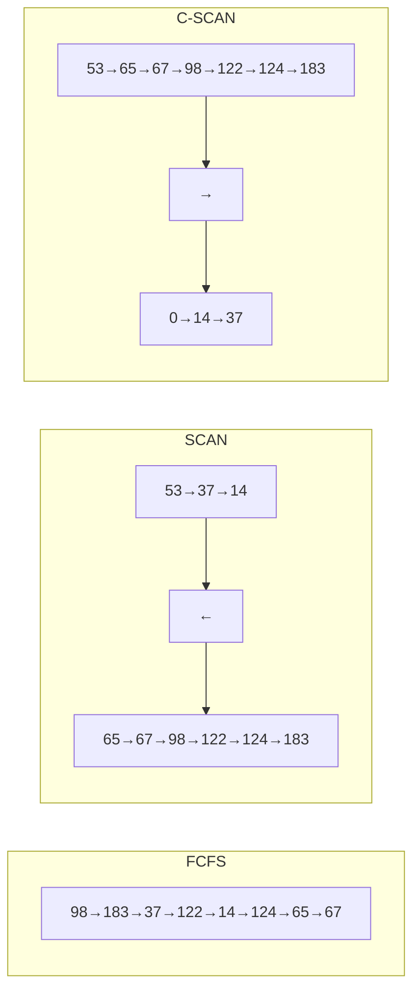
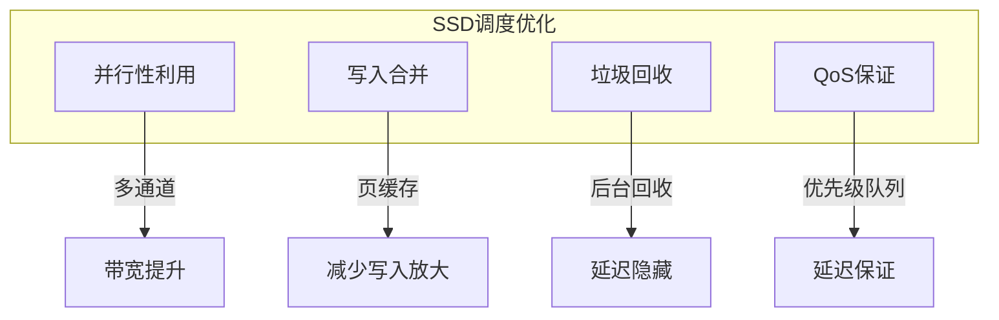
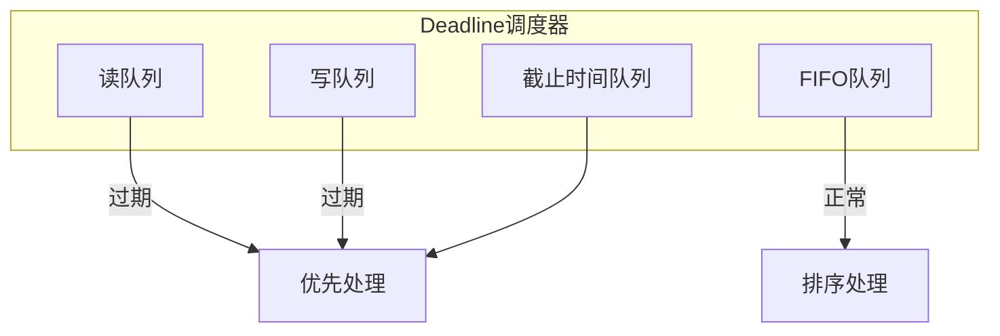
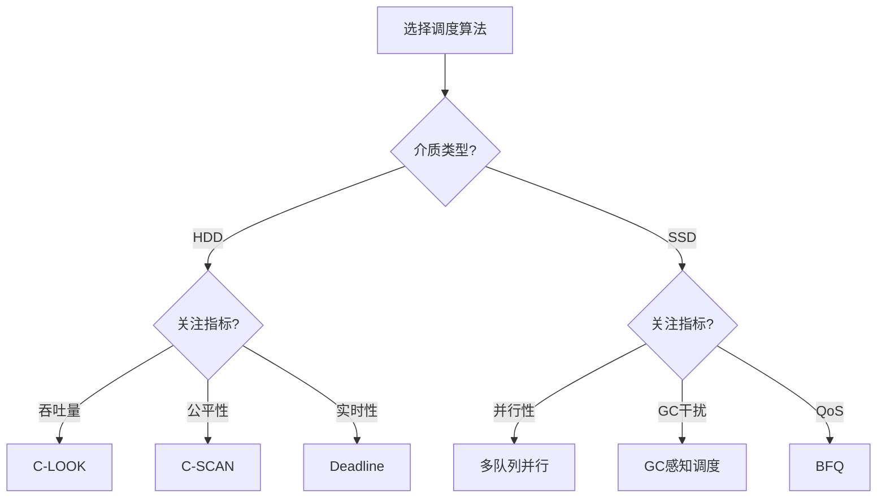

# 02.3 存储调度

> **形式科学 · 调度系统系列**
> 上一篇: [02.2 内存调度](02.2_内存调度.md) | 下一篇: [02.4 网络调度](02.4_网络调度.md)

---

## 1. 存储系统层次

### 1.1 存储介质特性



**存储介质对比**:

| 特性 | NVMe SSD | SATA SSD | HDD | 磁带 |
|------|----------|----------|-----|------|
| 访问延迟 | ~100μs | ~1ms | ~10ms | ~60s |
| 顺序带宽 | ~7GB/s | ~500MB/s | ~200MB/s | ~400MB/s |
| 随机IOPS | ~1M | ~100K | ~200 | ~1 |
| 耐用性 | 有限(P/E) | 有限 | 高 | 极高 |
| 成本/GB | 中 | 中 | 低 | 极低 |

### 1.2 存储栈层次



---

## 2. 磁盘调度算法

### 2.1 磁盘物理特性

**磁头移动模型**:

$$\text{寻道时间} = a + b \cdot \sqrt{d}$$

其中 $d$ 为磁道距离，$a$、$b$ 为设备相关常数。

**旋转延迟**: 平均为半圈旋转时间

$$T_{rot} = \frac{60}{2 \cdot RPM}$$

### 2.2 经典调度算法

| 算法 | 策略 | 优点 | 缺点 |
|------|------|------|------|
| **FCFS** | 先来先服务 | 简单公平 | 无优化 |
| **SSTF** | 最短寻道时间优先 | 低寻道 | 可能饿死 |
| **SCAN** | 电梯算法 | 无饿死 | 两端不公平 |
| **C-SCAN** | 循环扫描 | 更公平 | 返回时不服务 |
| **LOOK** | 改进的SCAN | 减少无效移动 | 稍复杂 |
| **C-LOOK** | 循环LOOK | 综合最优 | 最常用 |

### 2.3 算法可视化



### 2.4 Rust 实现：磁盘调度器

```rust
// Rust: 磁盘调度算法实现
#[derive(Debug, Clone)]
pub struct DiskRequest {
    pub track: u32,
    pub sector: u32,
    pub is_read: bool,
    pub arrival_time: u64,
}

pub trait DiskScheduler {
    fn schedule(&mut self, current_track: u32, requests: &[DiskRequest]) -> Vec<usize>;
}

// FCFS调度器
pub struct FCFS;
impl DiskScheduler for FCFS {
    fn schedule(&mut self, _current: u32, _requests: &[DiskRequest]) -> Vec<usize> {
        (0.._requests.len()).collect()
    }
}

// SSTF调度器
pub struct SSTF;
impl DiskScheduler for SSTF {
    fn schedule(&mut self, current: u32, requests: &[DiskRequest]) -> Vec<usize> {
        let mut indices: Vec<usize> = (0..requests.len()).collect();
        let mut current_track = current;
        let mut result = Vec::new();
        let mut remaining: Vec<_> = indices.into_iter()
            .map(|i| (i, requests[i].track))
            .collect();

        while !remaining.is_empty() {
            // 找到最近的请求
            let min_idx = remaining.iter()
                .enumerate()
                .min_by_key(|(_, (_, t))| {
                    (*t as i32 - current_track as i32).abs()
                })
                .map(|(i, _)| i)
                .unwrap();

            let (idx, track) = remaining.remove(min_idx);
            result.push(idx);
            current_track = track;
        }

        result
    }
}

// SCAN调度器（电梯算法）
pub struct SCAN {
    direction: Direction,
}

#[derive(Clone, Copy)]
enum Direction { Up, Down }

impl DiskScheduler for SCAN {
    fn schedule(&mut self, current: u32, requests: &[DiskRequest]) -> Vec<usize> {
        let mut indices: Vec<usize> = (0..requests.len()).collect();
        let mut result = Vec::new();

        // 按方向分离请求
        let (mut same_dir, mut opposite_dir): (Vec<_>, Vec<_>) = indices.iter()
            .map(|&i| (i, requests[i].track))
            .partition(|(_, t)| match self.direction {
                Direction::Up => *t >= current,
                Direction::Down => *t <= current,
            });

        // 同方向排序
        same_dir.sort_by_key(|(_, t)| match self.direction {
            Direction::Up => *t,
            Direction::Down => u32::MAX - *t,
        });

        // 反方向排序
        opposite_dir.sort_by_key(|(_, t)| match self.direction {
            Direction::Up => u32::MAX - *t,
            Direction::Down => *t,
        });

        // 合并结果
        result.extend(same_dir.iter().map(|(i, _)| *i));
        result.extend(opposite_dir.iter().map(|(i, _)| *i));

        // 反转方向
        self.direction = match self.direction {
            Direction::Up => Direction::Down,
            Direction::Down => Direction::Up,
        };

        result
    }
}

// C-LOOK调度器
pub struct CLook {
    direction: Direction,
}

impl DiskScheduler for CLook {
    fn schedule(&mut self, current: u32, requests: &[DiskRequest]) -> Vec<usize> {
        let mut tracks: Vec<_> = requests.iter()
            .enumerate()
            .map(|(i, r)| (i, r.track))
            .collect();

        // 分离同方向和反方向
        let (mut same_dir, opposite_dir): (Vec<_>, Vec<_>) = tracks.into_iter()
            .partition(|(_, t)| match self.direction {
                Direction::Up => *t >= current,
                Direction::Down => *t <= current,
            });

        // 同方向排序
        same_dir.sort_by(|(_, t1), (_, t2)| t1.cmp(t2));
        let mut opposite_dir = opposite_dir;
        opposite_dir.sort_by(|(_, t1), (_, t2)| t1.cmp(t2));

        // 合并：同方向 + 反方向（循环）
        let mut result: Vec<_> = same_dir.iter().map(|(i, _)| *i).collect();
        result.extend(opposite_dir.iter().map(|(i, _)| *i));

        result
    }
}

// 计算总寻道距离
pub fn total_seek_distance(
    requests: &[DiskRequest],
    order: &[usize],
    start: u32
) -> u64 {
    let mut total: u64 = 0;
    let mut current = start;

    for &idx in order {
        total += (requests[idx].track as i64 - current as i64).abs() as u64;
        current = requests[idx].track;
    }

    total
}
```

---

## 3. SSD 调度

### 3.1 SSD 特性

**与HDD的关键差异**:

| 特性 | HDD | SSD |
|------|-----|-----|
| 寻道时间 | ~10ms | 无 |
| 随机读性能 | 差 | 好 |
| 写入特性 | 原地更新 | 擦除-编程 |
| 并行性 | 单磁头 | 多通道/多die |
| GC开销 | 无 | 有 |

### 3.2 SSD 调度优化



**调度策略**:

| 策略 | 目的 | 实现方式 |
|------|------|----------|
| 读优先 | 降低读延迟 | 写缓冲延迟刷盘 |
| 并行调度 | 最大化带宽 | 多通道队列 |
| 磨损均衡 | 延长寿命 | 冷热数据分离 |
| GC调度 | 减少干扰 | 空闲时回收 |

### 3.3 Haskell 实现：SSD 调度器

```haskell
-- Haskell: SSD调度器
module Storage.SSD where

import Data.List (partition, sortOn)
import Data.Ord (Down(..))

data SSDRequest = SSDRequest {
    reqId :: Int,
    reqType :: RequestType,
    channel :: Int,
    die :: Int,
    page :: Int,
    priority :: Int
} deriving (Show, Eq)

data RequestType = Read | Write | Erase
    deriving (Show, Eq)

-- SSD调度器状态
data SSDScheduler = SSDScheduler {
    numChannels :: Int,
    numDiesPerChannel :: Int,
    writeBuffer :: [SSDRequest],
    readQueue :: [SSDRequest],
    eraseQueue :: [SSDRequest]
}

-- 并行调度：按通道分组
scheduleParallel :: SSDScheduler -> [[SSDRequest]]
scheduleParallel scheduler =
    let allReads = readQueue scheduler
        -- 按通道分组
        byChannel = groupByChannel allReads (numChannels scheduler)
        -- 每个通道内按die并行
        parallel = map (limitByDie (numDiesPerChannel scheduler)) byChannel
    in parallel
  where
    groupByChannel reqs n =
        [filter (\r -> channel r == c) reqs | c <- [0..n-1]]

    limitByDie n reqs =
        -- 每个die最多一个请求
        take n $ sortOn (Down . priority) reqs

-- 混合读写调度
scheduleMixed :: SSDScheduler -> ([SSDRequest], [SSDRequest])
scheduleMixed scheduler =
    let reads = take 4 (sortOn (Down . priority) (readQueue scheduler))
        -- 写入缓冲合并
        writes = mergeWrites (writeBuffer scheduler)
    in (reads, writes)

-- 合并相邻写入
mergeWrites :: [SSDRequest] -> [SSDRequest]
mergeWrites [] = []
mergeWrites (r:rs) =
    let (mergeable, rest) = partition (canMerge r) rs
        merged = foldl merge r mergeable
    in merged : mergeWrites rest
  where
    canMerge r1 r2 = channel r1 == channel r2 &&
                     abs (page r1 - page r2) <= 4
    merge r1 r2 = r1  -- 简化合并

-- GC调度
gcSchedule :: SSDScheduler -> [SSDRequest] -> [SSDRequest]
gcSchedule scheduler foreground =
    -- 只有在没有高优先级读时才执行GC
    if any (\r -> priority r > 5) foreground
        then []  -- 推迟GC
        else take 1 (eraseQueue scheduler)
```

---

## 4. I/O 合并与调度

### 4.1 I/O 合并

**合并条件**: 物理上相邻的请求可以合并为一个大请求。

$$\text{可合并}(req_1, req_2) = \text{end}(req_1) = \text{start}(req_2)$$

### 4.2 电梯算法优化

**Deadline I/O Scheduler** (Linux 2.4-2.6):



**特性**:

- 读写分离队列
- 读请求500ms过期
- 写请求5s过期
- 过期请求优先处理

### 4.3 Rust 实现：I/O 合并

```rust
// Rust: I/O请求合并
#[derive(Debug, Clone)]
pub struct IORequest {
    pub start_sector: u64,
    pub num_sectors: u32,
    pub is_write: bool,
}

impl IORequest {
    pub fn end_sector(&self) -> u64 {
        self.start_sector + self.num_sectors as u64
    }

    pub fn can_merge(&self, other: &IORequest) -> bool {
        self.is_write == other.is_write &&
        (self.end_sector() == other.start_sector ||
         other.end_sector() == self.start_sector)
    }

    pub fn merge(&self, other: &IORequest) -> IORequest {
        let start = self.start_sector.min(other.start_sector);
        let end = self.end_sector().max(other.end_sector());
        IORequest {
            start_sector: start,
            num_sectors: (end - start) as u32,
            is_write: self.is_write,
        }
    }
}

pub fn merge_requests(requests: &mut Vec<IORequest>) -> Vec<IORequest> {
    if requests.is_empty() {
        return vec![];
    }

    // 按起始扇区排序
    requests.sort_by_key(|r| r.start_sector);

    let mut merged = vec![requests[0].clone()];

    for req in requests.iter().skip(1) {
        let last = merged.last_mut().unwrap();
        if last.can_merge(req) {
            *last = last.merge(req);
        } else {
            merged.push(req.clone());
        }
    }

    merged
}
```

---

## 5. 存储 QoS 与公平性

### 5.1 QoS 目标

| 指标 | 定义 | 目标值 |
|------|------|--------|
| IOPS | 每秒I/O数 | 保证最低 |
| 带宽 | 吞吐量 | 保证份额 |
| 延迟 | 响应时间 | 上限控制 |
| 延迟抖动 | 延迟方差 | 最小化 |

### 5.2 调度算法

**CFQ (Completely Fair Queuing)**:

- 每个进程一个队列
- 时间片轮转
- 虚拟时间调度

**BFQ (Budget Fair Queuing)**:

- 基于请求大小的预算
- 更精确的公平性
- 更好的延迟保证

### 5.3 Lean 形式化：公平性

```lean4
-- Lean: 存储调度公平性
structure StorageRequest where
  id : Nat
  source : ProcessId
  size : Nat
  arrival : Nat
  deadline : Option Nat

structure StorageSchedule where
  order : List StorageRequest
  completionTimes : StorageRequest → Nat

def fairnessMetric (schedule : StorageSchedule) (reqs : List StorageRequest) : ℚ :=
  let times := reqs.map (λ r => schedule.completionTimes r - r.arrival)
  let avg := (times.sum : ℚ) / times.length
  let variance := (times.map (λ t => (t - avg) ^ 2)).sum / times.length
  variance  -- 方差越小越公平

def qosSatisfaction (schedule : StorageSchedule) (reqs : List StorageRequest) : ℚ :=
  let satisfied := reqs.filter (λ r =>
    match r.deadline with
    | some d => schedule.completionTimes r ≤ d
    | none => true
  )
  (satisfied.length : ℚ) / (reqs.length : ℚ)

-- 定理：轮转调度在相同大小请求下是公平的
theorem roundRobinFairness :
    ∀ (reqs : List StorageRequest),
    (∀ r ∈ reqs, r.size = c) →  -- 所有请求大小相同
    isFair (roundRobinSchedule reqs) reqs := by
  sorry
```

---

## 6. 性能对比

### 6.1 算法性能对比

| 算法 | 平均寻道 | 最大寻道 | 公平性 | 实现复杂度 |
|------|----------|----------|--------|-----------|
| FCFS | 高 | 高 | 好 | 低 |
| SSTF | 低 | 中 | 差 | 低 |
| SCAN | 中 | 低 | 中 | 中 |
| C-SCAN | 中 | 低 | 好 | 中 |
| LOOK | 低 | 低 | 中 | 中 |
| C-LOOK | 低 | 低 | 好 | 中 |

### 6.2 决策矩阵



---

## 7. 参考文献

1. Coffman, E. G., et al. "System deadlocks." _Computing Surveys_ 3.2 (1971): 67-78.
2. Gopalan, K. "Improving file system performance with predictive prefetching." _USENIX ATC_ 2005.
3. Park, S., & Shen, K. "FIOS: A fair, efficient flash I/O scheduler." _FAST_ 2012.
4. Kim, H., & Ahn, S. "BPLRU: A buffer management scheme for improving random writes in flash storage." _FAST_ 2008.

---

## 8. 相关文档

- [02.2 内存调度](02.2_内存调度.md) - 缓存替换、预取、NUMA
- [02.4 网络调度](02.4_网络调度.md) - 包调度、QoS、拥塞控制
- [03.4 设备调度](../03_OS调度/03.4_设备调度.md) - I/O调度、中断处理
- [04.2 数据流调度](../04_分布式调度/04.2_数据流调度.md) - Spark、Flink
