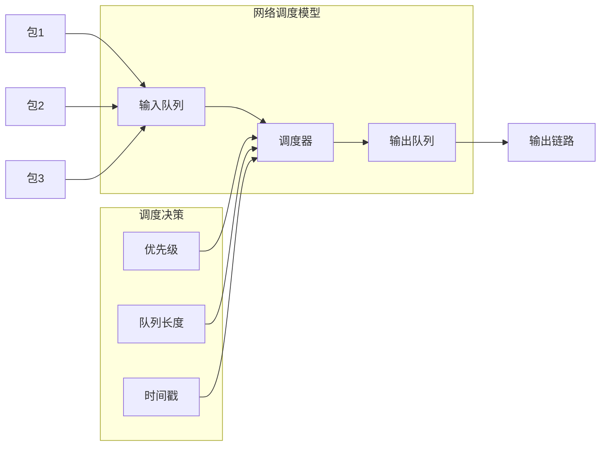
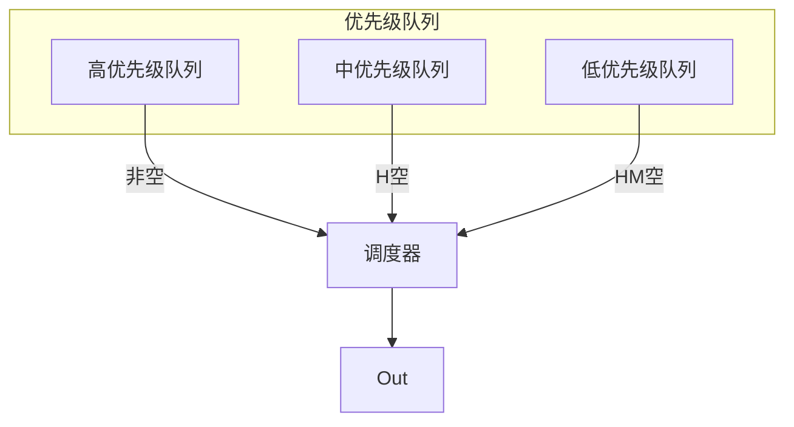
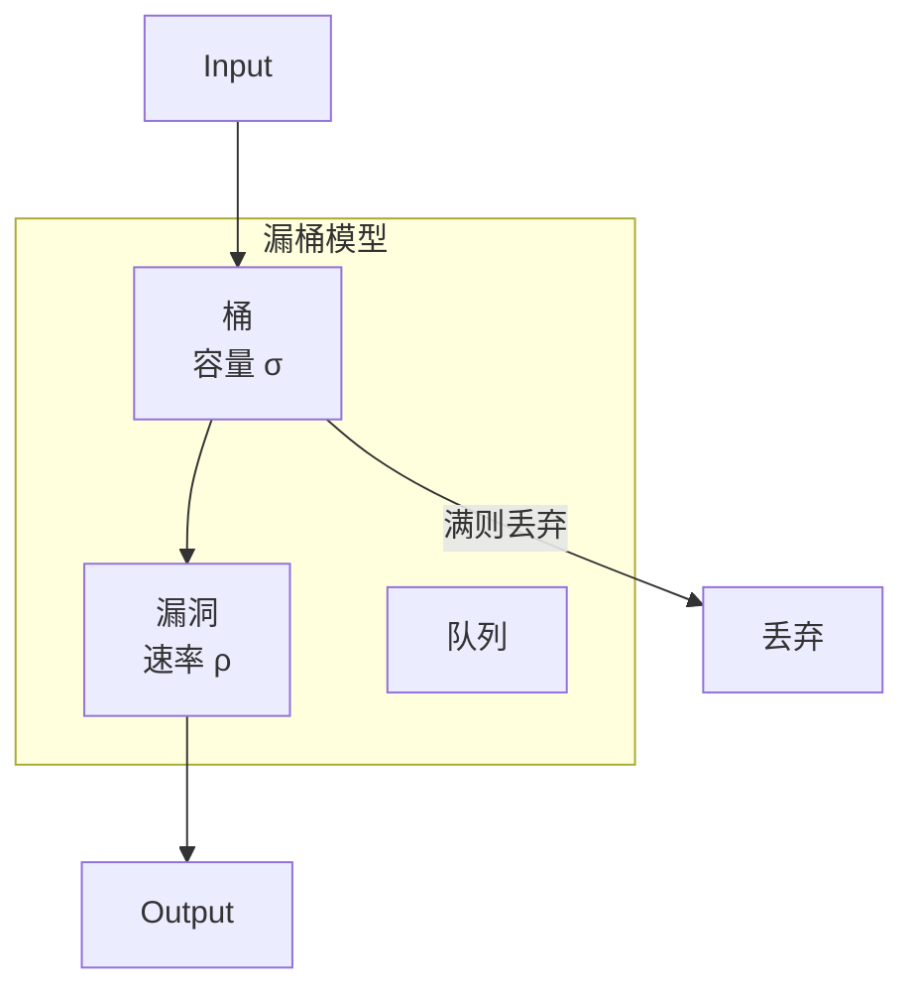
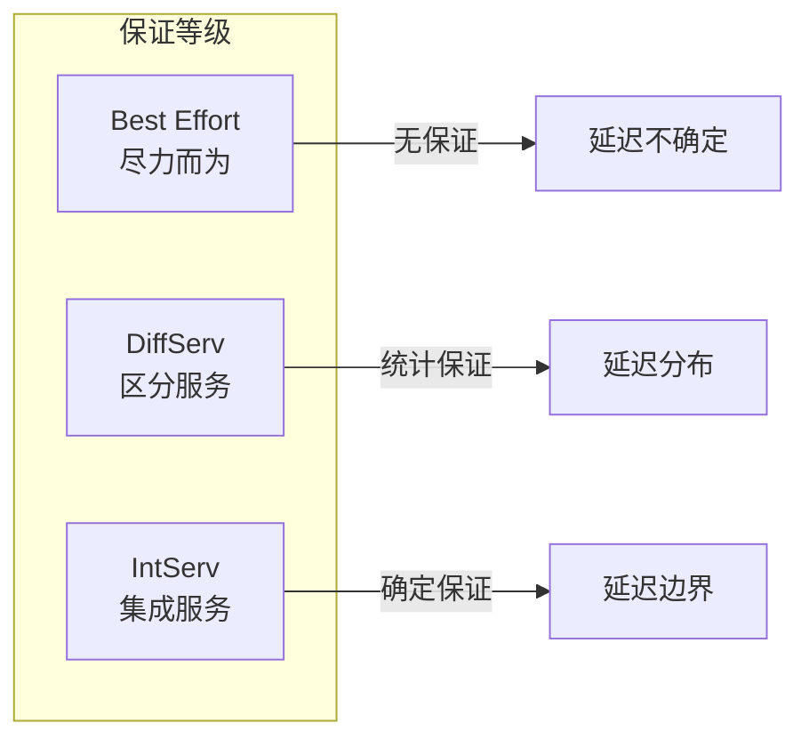

# 02.4 网络调度

---

📌 **内容摘要**

本文档深入探讨网络调度的核心原理和关键方法。内容涵盖硬件调度领域的主要知识点，包括决策理论, 调度算法, 风险, 调度, 资源分配等关键主题。适合具备相关基础的学习者进行深入研究。

**关键词**: 决策理论, 调度算法, 风险, 调度, 资源分配, 硬件调度, CPU调度, 效用

📚 **学习目标**
- 深入理解网络调度的理论体系和形式化方法
- 能够进行相关定理的形式化证明
- 能够分析和实现相关算法

🎯 **难度级别**: 高级

⏱️ **预计阅读时间**: 15分钟

**前置知识**: 该领域的中级知识, 形式化方法基础, 算法与数据结构

---


> **形式科学 · 调度系统系列**
> 上一篇: [02.3 存储调度](02.3_存储调度.md) | 下一篇: [03.1 进程调度](../03_OS调度/03.1_进程调度.md)

---

## 1. 网络调度基础

### 1.1 网络数据包调度模型


**形式化模型**:

$$\mathcal{N} = \langle \mathcal{Q}, \mathcal{S}, \mathcal{P}, \mathcal{C} \rangle$$

- $\mathcal{Q}$: 队列集合
- $\mathcal{S}$: 调度策略
- $\mathcal{P}$: 包特性（大小、优先级、截止时间）
- $\mathcal{C}$: 链路容量

---

## 2. 包调度算法

### 2.1 FIFO (First-In-First-Out)

**特性**：

- 简单实现
- 无公平性保证
- 可能产生队头阻塞

$$\text{包 } i \text{ 的离开时间}: D_i = \max(A_i, D_{i-1}) + L_i/C$$

其中 $A_i$ 为到达时间，$L_i$ 为包长，$C$ 为链路容量。

### 2.2 优先级队列 (PQ)


**问题**：可能导致低优先级饿死

### 2.3 轮询 (Round Robin)

**定义 2.1（轮询）**: 按顺序服务每个队列，每个队列每次服务一个包。

**问题**：包大小不同时不公平

### 2.4 赤字轮询 (Deficit Round Robin)

**核心思想**: 给每个队列分配配额，小包累积配额。

```rust
// Rust: 赤字轮询实现
pub struct DRRScheduler {
    queues: Vec<VecDeque<Packet>>,
    deficits: Vec<u32>,  // 每个队列的赤字计数器
    quantum: u32,        // 每个队列的基本配额
    active_list: VecDeque<usize>,  // 活动队列索引
}

impl DRRScheduler {
    pub fn new(num_queues: usize, quantum: u32) -> Self {
        Self {
            queues: (0..num_queues).map(|_| VecDeque::new()).collect(),
            deficits: vec![0; num_queues],
            quantum,
            active_list: VecDeque::new(),
        }
    }

    pub fn enqueue(&mut self, queue_id: usize, packet: Packet) {
        let was_empty = self.queues[queue_id].is_empty();
        self.queues[queue_id].push_back(packet);

        // 如果队列之前为空，加入活动列表
        if was_empty {
            self.active_list.push_back(queue_id);
        }
    }

    pub fn dequeue(&mut self) -> Option<Packet> {
        let num_active = self.active_list.len();

        for _ in 0..num_active {
            if let Some(queue_id) = self.active_list.pop_front() {
                // 增加配额
                self.deficits[queue_id] += self.quantum;

                // 尝试发送包
                while let Some(packet) = self.queues[queue_id].front() {
                    if packet.size <= self.deficits[queue_id] {
                        // 可以发送
                        self.deficits[queue_id] -= packet.size;
                        let pkt = self.queues[queue_id].pop_front().unwrap();

                        // 如果队列还有包，放回活动列表
                        if !self.queues[queue_id].is_empty() {
                            self.active_list.push_back(queue_id);
                        } else {
                            self.deficits[queue_id] = 0;  // 清空赤字
                        }

                        return Some(pkt);
                    } else {
                        // 配额不足，跳过
                        break;
                    }
                }

                // 队列为空或配额不足，保留在活跃列表末尾
                if !self.queues[queue_id].is_empty() {
                    self.active_list.push_back(queue_id);
                } else {
                    self.deficits[queue_id] = 0;
                }
            }
        }

        None
    }
}
```
### 2.5 加权公平队列 (WFQ)

**定义 2.2（WFQ）**: 模拟 GPS (Generalized Processor Sharing) 的理想公平性。

$$\text{完成时间}: F_i^k = \max(V(A_i^k), F_i^{k-1}) + \frac{L_i^k}{r_i}$$

其中 $V(t)$ 为虚拟时间，$r_i$ 为流 $i$ 的权重。

### 2.6 Haskell 实现：WFQ

```haskell
-- Haskell: 加权公平队列实现
module Network.WFQ where

import Data.Map (Map)
import qualified Data.Map as Map
import Data.PQueue.Min (MinQueue)
import qualified Data.PQueue.Min as PQ

type FlowId = Int
type VirtualTime = Double
type Weight = Double

data Packet = Packet {
    pktId :: Int,
    flowId :: FlowId,
    size :: Double,
    arrivalTime :: Double,
    finishTime :: VirtualTime  -- 虚拟完成时间
} deriving (Show, Eq, Ord)

-- 基于虚拟完成时间排序
instance Ord Packet where
    compare p1 p2 = compare (finishTime p1) (finishTime p2)

-- WFQ调度器
data WFQScheduler = WFQScheduler {
    flows :: Map FlowId Weight,       -- 每个流的权重
    packets :: MinQueue Packet,       -- 按虚拟完成时间排序的包队列
    virtualTime :: VirtualTime,       -- 当前虚拟时间
    lastVTimeUpdate :: Double,        -- 上次更新时间
    activeFlows :: Map FlowId (VirtualTime, Double)  -- 流 -> (最后完成时间, 已发送字节)
}

-- 初始化调度器
initWFQ :: [(FlowId, Weight)] -> WFQScheduler
initWFQ flowWeights = WFQScheduler {
    flows = Map.fromList flowWeights,
    packets = PQ.empty,
    virtualTime = 0,
    lastVTimeUpdate = 0,
    activeFlows = Map.empty
}

-- 计算虚拟时间
updateVirtualTime :: WFQScheduler -> Double -> WFQScheduler
updateVirtualTime scheduler now =
    let dt = now - lastVTimeUpdate scheduler
        activeWeight = sum (Map.elems (flows scheduler))
        newVTime = if activeWeight > 0
                   then virtualTime scheduler + dt / activeWeight
                   else virtualTime scheduler
    in scheduler {
        virtualTime = newVTime,
        lastVTimeUpdate = now
    }

-- 入队
enqueue :: WFQScheduler -> Packet -> WFQScheduler
enqueue scheduler packet =
    let fid = flowId packet
        weight = Map.findWithDefault 1.0 fid (flows scheduler)

        -- 获取流的最后完成时间
        (startTime, bytesSent) = Map.findWithDefault
            (virtualTime scheduler, 0) fid (activeFlows scheduler)

        -- 计算虚拟完成时间
        finTime = max startTime (virtualTime scheduler) +
                  size packet / weight

        newPacket = packet { finishTime = finTime }

        -- 更新流状态
        newActiveFlows = Map.insert fid (finTime, bytesSent + size packet)
            (activeFlows scheduler)

    in scheduler {
        packets = PQ.insert newPacket (packets scheduler),
        activeFlows = newActiveFlows
    }

-- 出队
dequeue :: WFQScheduler -> Maybe (Packet, WFQScheduler)
dequeue scheduler =
    case PQ.minView (packets scheduler) of
        Nothing -> Nothing
        Just (pkt, remaining) ->
            let fid = flowId pkt
                newScheduler = scheduler { packets = remaining }
            in Just (pkt, newScheduler)
```
---

## 3. QoS 保证

### 3.1 流量整形

**漏桶算法 (Leaky Bucket)**:


**令牌桶算法 (Token Bucket)**:

$$\text{允许突发}: \text{最大包数} = \sigma + \rho \cdot t$$

其中 $\sigma$ 为桶容量，$\rho$ 为令牌产生速率。

### 3.2 Rust 实现：令牌桶

```rust
// Rust: 令牌桶实现
pub struct TokenBucket {
    capacity: f64,      // 桶容量 σ
    tokens: f64,        // 当前令牌数
    rate: f64,          // 令牌产生速率 ρ
    last_update: std::time::Instant,
}

impl TokenBucket {
    pub fn new(capacity: f64, rate: f64) -> Self {
        Self {
            capacity,
            tokens: capacity,  // 初始满桶
            rate,
            last_update: std::time::Instant::now(),
        }
    }

    // 更新令牌数
    fn update_tokens(&mut self) {
        let now = std::time::Instant::now();
        let elapsed = now.duration_since(self.last_update).as_secs_f64();
        self.tokens = (self.tokens + self.rate * elapsed).min(self.capacity);
        self.last_update = now;
    }

    // 尝试消费令牌
    pub fn try_consume(&mut self, amount: f64) -> bool {
        self.update_tokens();

        if self.tokens >= amount {
            self.tokens -= amount;
            true
        } else {
            false
        }
    }

    // 计算下次可发送时间
    pub fn time_until_ready(&mut self, amount: f64) -> Option<std::time::Duration> {
        self.update_tokens();

        if self.tokens >= amount {
            Some(std::time::Duration::from_secs(0))
        } else {
            let needed = amount - self.tokens;
            let wait_secs = needed / self.rate;
            Some(std::time::Duration::from_secs_f64(wait_secs))
        }
    }
}

// 双 leaky bucket (符合 GCRA 算法)
pub struct DualLeakyBucket {
    pcr_bucket: TokenBucket,  // 峰值信元速率
    scr_bucket: TokenBucket,  // 持续信元速率
    mbs: f64,                 // 最大突发大小
}

impl DualLeakyBucket {
    pub fn is_conforming(&mut self, packet_size: f64) -> bool {
        self.pcr_bucket.try_consume(packet_size) &&
        self.scr_bucket.try_consume(packet_size)
    }
}
```
---

## 4. 拥塞控制

### 4.1 TCP 拥塞控制

**经典算法**:

| 阶段 | 行为 | 触发条件 |
|------|------|----------|
| 慢启动 | cwnd *= 2 | 收到ACK，cwnd < ssthresh |
| 拥塞避免 | cwnd += 1 | 收到ACK，cwnd >= ssthresh |
| 快速重传 | 重传 | 3个重复ACK |
| 快速恢复 | cwnd = ssthresh + 3 | 快速重传后 |

### 4.2 主动队列管理 (AQM)

**RED (Random Early Detection)**:

$$p = \begin{cases}
0 & q < q_{min} \\
p_{max} \cdot \frac{q - q_{min}}{q_{max} - q_{min}} & q_{min} \leq q \leq q_{max} \\
1 & q > q_{max}
\end{cases}$$

### 4.3 Haskell 实现：RED

```haskell
-- Haskell: RED主动队列管理
module Network.RED where

data REDParams = REDParams {
    minThreshold :: Double,    -- q_min
    maxThreshold :: Double,    -- q_max
    maxProbability :: Double,  -- p_max
    weight :: Double           -- Wq，用于平均队列长度
}

data REDQueue = REDQueue {
    params :: REDParams,
    avgQueueLen :: Double,
    queue :: [Packet],
    count :: Int  -- 上次丢弃后的包数
}

-- 更新平均队列长度
updateAvgQueueLen :: REDQueue -> Double -> Bool -> REDQueue
updateAvgQueueLen q currentLen isEmpty =
    let w = weight (params q)
        newAvg = if isEmpty
            then (1 - w) ^ currentLen * avgQueueLen q
            else (1 - w) * avgQueueLen q + w * currentLen
    in q { avgQueueLen = newAvg }

-- 计算丢弃概率
calculateDropProb :: REDParams -> Double -> Int -> Double
calculateDropProb p avgLen count
    | avgLen < minThreshold p = 0
    | avgLen > maxThreshold p = 1
    | otherwise =
        let pb = maxProbability p * (avgLen - minThreshold p) /
                 (maxThreshold p - minThreshold p)
        in pb / (1 - count * pb)

-- RED入队
redEnqueue :: REDQueue -> Packet -> IO (Either Packet Packet)
redEnqueue q packet = do
    let p = params q
        avgLen = avgQueueLen q
        dropProb = calculateDropProb p avgLen (count q)

    r <- randomRIO (0, 1)

    if r < dropProb
        then return $ Left packet  -- 丢弃
        else return $ Right packet  -- 入队
```
---

## 5. 数据中心网络调度

### 5.1 数据中心特性

| 特性 | 影响 | 调度策略 |
|------|------|----------|
| 高带宽 | 低传输时延 | 流量中心化 |
| 低延迟要求 | 尾延迟敏感 | 优先级分离 |
| 突发流量 | 拥塞热点 | ECN/拥塞信号 |
| 多租户 | 公平性要求 | 带宽保证 |

### 5.2 DCTCP

**数据中心 TCP**:

$$\text{cwnd减少} = (1 - \frac{\alpha}{2})$$

其中 $\alpha$ 基于 ECN 标记比例的估计：

$$\alpha = (1 - g) \cdot \alpha + g \cdot F$$

### 5.3 PIAS

** Practical Information-Agnostic Flow Scheduling**:

| 优先级 | 阈值 | 策略 |
|--------|------|------|
| 7 | < 100KB | 严格优先 |
| 6 | < 10MB | 高优先 |
| TCP/IP | 传输层/网络层 | 面向连接/无连接 |
| 0 | > 100MB | 最低优先 |

---

## 6. Lean 形式化：网络延迟边界

```lean4
-- Lean: 网络调度延迟边界
structure NetworkPacket where
  id : Nat
  size : Nat
  arrival : Nat
  deadline : Option Nat
  priority : Nat
  deriving Repr

structure NetworkScheduler where
  queue : List NetworkPacket
  capacity : Nat  -- 链路容量 (bits/time)

def transmissionTime (scheduler : NetworkScheduler) (pkt : NetworkPacket) : Nat :=
  (pkt.size + scheduler.capacity - 1) / scheduler.capacity

def fifoDelayBound (scheduler : NetworkScheduler) (pkt : NetworkPacket) : Nat :=
  let queueSize := (scheduler.queue.filter (λ p => p.arrival ≤ pkt.arrival)).sum (λ p => p.size)
  queueSize / scheduler.capacity + transmissionTime scheduler pkt

-- WFQ延迟边界
def wfqDelayBound (scheduler : NetworkScheduler)
                  (pkt : NetworkPacket)
                  (weight : Nat)  -- 该流的权重
                  (totalWeight : Nat) : Nat :=
  let maxPacketSize := scheduler.queue.map (λ p => p.size) |>.maximum?.getD 0
  let transTime := transmissionTime scheduler pkt

  -- 基于GPS模型的延迟边界
  (maxPacketSize * totalWeight) / (scheduler.capacity * weight) + transTime

-- 定理：WFQ的延迟优于FIFO
theorem wfqBetterThanFifo :
    ∀ (scheduler : NetworkScheduler) (pkt : NetworkPacket) (w tw : Nat),
    w > 0 ∧ tw ≥ w →
    wfqDelayBound scheduler pkt w tw ≤ fifoDelayBound scheduler pkt := by
  sorry  -- 形式化证明
```
---

## 7. 性能对比

### 7.1 调度算法对比

| 算法 | 公平性 | 延迟 | 复杂度 | 适用场景 |
|------|--------|------|--------|----------|
| FIFO | 差 | 不确定 | 低 | 简单场景 |
| PQ | 差 | 低（高优先级） | 低 | 实时流量 |
| RR | 中 | 中 | 低 | 等权重流 |
| DRR | 好 | 中 | 中 | 变长包 |
| WFQ | 最优 | 有界 | 高 | 需要保证 |
| WF2Q | 最优 | 更紧 | 更高 | 严格保证 |

### 7.2 QoS 保证对比



---

## 8. 参考文献

1. Demers, A., Keshav, S., & Shenker, S. "Analysis and simulation of a fair queueing algorithm." *ACM SIGCOMM* 1989.
2. Floyd, S., & Jacobson, V. "Random early detection gateways for congestion avoidance." *IEEE/ACM Transactions on Networking* 1993.
3. Alizadeh, M., et al. "Data center TCP (DCTCP)." *ACM SIGCOMM* 2010.
4. Bai, W., et al. "PIAS: Practical information-agnostic flow scheduling." *ACM CoNEXT* 2014.

---

## 9. 相关文档

- [02.3 存储调度](02.3_存储调度.md) - 磁盘调度、SSD调度、I/O合并
- [03.1 进程调度](../03_OS调度/03.1_进程调度.md) - 策略、CFS、实时调度
- [04.1 集群调度](../04_分布式调度/04.1_集群调度.md) - YARN、Mesos、Kubernetes
- [04.4 边缘调度](../04_分布式调度/04.4_边缘调度.md) - 移动边缘、IoT、5G调度
---

## 📚 延伸阅读

- [04.4 边缘调度](../04_分布式调度/04.4_边缘调度.md)
- [01.1 调度模型抽象](../01_调度理论基础/01.1_调度模型抽象.md)
- [01.1 调度问题定义](../01_调度理论基础/01.1_调度问题定义.md)
- [02.3 存储调度](../02_硬件调度/02.3_存储调度.md)
- [03.1 进程调度](../03_OS调度/03.1_进程调度.md)
