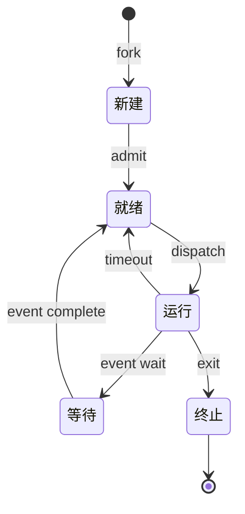
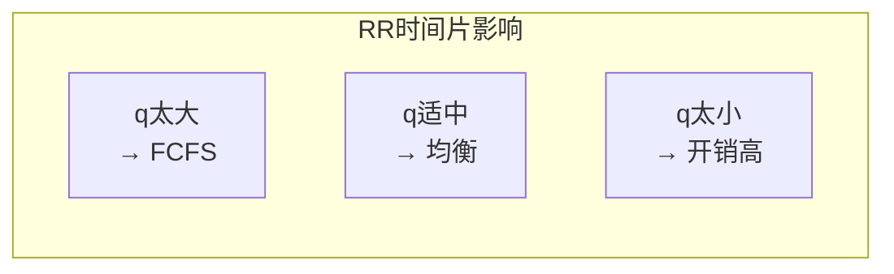
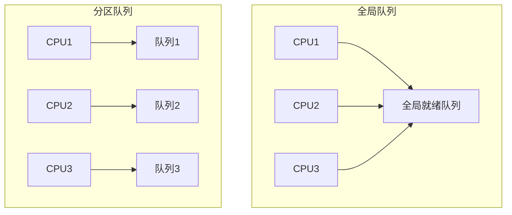

# 03.1 进程调度

> **形式科学 · 调度系统系列**
> 上一篇: [02.4 网络调度](../02_硬件调度/02.4_网络调度.md) | 下一篇: [03.2 线程调度](03.2_线程调度.md)

---

## 1. 进程调度基础

### 1.1 进程状态模型



**形式化定义**:

$$\text{进程 } P_i = \langle PCB_i, S_i, C_i, R_i \rangle$$

- $PCB_i$: 进程控制块
- $S_i$: 状态 ∈ {新建, 就绪, 运行, 等待, 终止}
- $C_i$: 上下文（寄存器、程序计数器等）
- $R_i$: 资源占用集合

### 1.2 调度时机

| 事件 | 调度类型 | 说明 |
|------|----------|------|
| 进程终止 | 非抢占 | 运行进程完成 |
| 进程阻塞 | 非抢占 | 等待 I/O |
| 时间片用完 | 抢占 | 公平分配 CPU |
| I/O 完成 | 抢占 | 高优先级就绪 |
| 新进程到达 | 抢占 | 可能更高优先级 |

---

## 2. 经典调度算法

### 2.1 先来先服务 (FCFS)

**定义 2.1（FCFS）**: 按进程到达顺序调度。

**等待时间**: $W_i = \sum_{j < i} B_j$，其中 $B_j$ 为进程 $j$ 的突发时间。

**问题**: 护航效应（Convoy Effect）

```
进程: P1(24), P2(3), P3(3)
到达顺序: P1, P2, P3

甘特图:
|P1(24)    |P2(3)|P3(3)|
0          24    27    30

平均等待时间: (0 + 24 + 27) / 3 = 17
```

### 2.2 最短作业优先 (SJF)

**定义 2.2（SJF）**: 选择突发时间最短的进程。

**最优性**: 最小化平均等待时间。

$$\text{平均等待时间} = \frac{1}{n} \sum_{i=1}^{n} W_i$$

**预测突发时间**: 指数平均

$$\tau_{n+1} = \alpha \cdot t_n + (1 - \alpha) \cdot \tau_n$$

### 2.3 优先级调度

**定义 2.3（优先级调度）**: 每个进程关联优先级，调度最高优先级进程。

**问题**: 饥饿（Starvation）

**解决方案**: 老化（Aging）

$$\text{新优先级} = \text{原优先级} + \text{等待时间} \cdot k$$

### 2.4 轮转调度 (RR)

**定义 2.4（RR）**: 每个进程获得固定时间片 $q$。

**周转时间**: $T_{RR} = T_{FCFS} + \text{上下文切换开销}$

**时间片选择**:

$$q \approx \frac{\text{平均突发时间}}{n}$$



### 2.5 Rust 实现：多级反馈队列

```rust
// Rust: 多级反馈队列 (MLFQ) 实现
use std::collections::{VecDeque, HashMap};

#[derive(Debug, Clone)]
pub struct Process {
    pub pid: u32,
    pub priority: usize,  // 队列级别
    pub remaining_time: u64,
    pub total_burst: u64,
    pub arrival_time: u64,
}

pub struct MLFQScheduler {
    queues: Vec<VecDeque<Process>>,  // 多级队列
    time_quantum: Vec<u64>,          // 每级队列时间片
    current_time: u64,
    aging_threshold: u64,            // 老化阈值
    last_execution: HashMap<u32, u64>, // 上次执行时间
}

impl MLFQScheduler {
    pub fn new(num_levels: usize, base_quantum: u64) -> Self {
        let mut quantum = vec![];
        for i in 0..num_levels {
            quantum.push(base_quantum * (1 << i)); // 指数增长
        }

        Self {
            queues: (0..num_levels).map(|_| VecDeque::new()).collect(),
            time_quantum: quantum,
            current_time: 0,
            aging_threshold: 1000,
            last_execution: HashMap::new(),
        }
    }

    pub fn enqueue(&mut self, mut process: Process) {
        let level = process.priority.min(self.queues.len() - 1);
        self.queues[level].push_back(process);
    }

    pub fn schedule(&mut self) -> Option<(Process, u64)> {
        // 应用老化
        self.apply_aging();

        // 找到最高优先级非空队列
        for level in 0..self.queues.len() {
            if !self.queues[level].is_empty() {
                let mut process = self.queues[level].pop_front().unwrap();
                let quantum = self.time_quantum[level];

                // 计算实际执行时间
                let exec_time = quantum.min(process.remaining_time);
                process.remaining_time -= exec_time;

                // 更新状态
                self.current_time += exec_time;
                self.last_execution.insert(process.pid, self.current_time);

                // 如果未完成，降级
                if process.remaining_time > 0 {
                    process.priority = (process.priority + 1)
                        .min(self.queues.len() - 1);
                    self.queues[process.priority].push_back(process);
                }

                return Some((process, exec_time));
            }
        }

        None
    }

    fn apply_aging(&mut self) {
        for level in (1..self.queues.len()).rev() {
            let to_promote: Vec<_> = self.queues[level]
                .iter()
                .enumerate()
                .filter(|(_, p)| {
                    let last = self.last_execution.get(&p.pid).copied()
                        .unwrap_or(p.arrival_time);
                    self.current_time - last > self.aging_threshold
                })
                .map(|(i, _)| i)
                .collect::<Vec<_>>()
                .into_iter()
                .rev()
                .collect();

            for idx in to_promote {
                if let Some(mut process) = self.queues[level].remove(idx) {
                    process.priority = process.priority.saturating_sub(1);
                    self.queues[process.priority].push_back(process);
                }
            }
        }
    }
}
```

---

## 3. Linux CFS 调度器

### 3.1 CFS 核心思想

**完全公平调度器 (Completely Fair Scheduler)**:


**虚拟时间计算**:

$$vruntime_i = vruntime_i + \frac{runtime_i \cdot 1024}{weight_i}$$

其中 $weight_i$ 由 nice 值决定：

| nice | -20 | -10 | 0 | 10 | 19 |
|------|-----|-----|---|-----|-----|
| weight | 88761 | 11058 | 1024 | 110 | 15 |

### 3.2 调度延迟与粒度

**目标延迟** ($sysctl\ kernel\ sched\ latency\ ns$): 默认 6ms

$$\text{时间片} = \frac{\text{目标延迟} \cdot weight_i}{\sum weight_j}$$

**最小粒度** ($sched\ min\ granularity$): 默认 0.75ms

### 3.3 Haskell 实现：CFS 核心

```haskell
-- Haskell: CFS调度器核心
module OS.CFS where

import Data.Map (Map)
import qualified Data.Map as Map
import Data.Ratio ((%))

type VRuntime = Rational
type Weight = Int
type Nice = Int

data Task = Task {
    taskId :: Int,
    vruntime :: VRuntime,
    weight :: Weight,
    execStart :: Maybe Integer  -- 纳秒时间戳
} deriving (Show, Eq, Ord)

-- nice值到weight的映射 (Linux内核表格)
niceToWeight :: Nice -> Weight
niceToWeight nice =
    let weights = [88761, 71755, 56483, 46273, 36291,
                   29154, 23254, 18705, 14949, 11916,
                   1024, 820, 655, 526, 423, 335, 272, 215, 172, 137, 110]
        idx = nice + 20
    in if idx >= 0 && idx < length weights
       then weights !! idx
       else 1024

-- CFS调度器状态
data CFSScheduler = CFSScheduler {
    tasks :: Map Int Task,      -- 所有任务
    minVRuntime :: VRuntime,    -- 最小虚拟时间
    totalWeight :: Weight,      -- 总权重
    nrRunning :: Int,           -- 可运行任务数
    schedLatency :: Integer,    -- 目标延迟 (ns)
    minGranularity :: Integer   -- 最小粒度 (ns)
}

-- 计算时间片
calcTimeslice :: CFSScheduler -> Task -> Integer
calcTimeslice scheduler task =
    let weightSum = totalWeight scheduler
        latency = schedLatency scheduler
        slice = (latency * fromIntegral (weight task)) `div`
                fromIntegral weightSum
        minGran = minGranularity scheduler
    in max slice minGran

-- 更新vruntime
updateVRuntime :: Task -> Integer -> Task
calcVRuntime task deltaExec =
    let deltaV = (fromIntegral deltaExec % 1) *
                 (1024 % fromIntegral (weight task))
    in task { vruntime = vruntime task + deltaV }

-- 选择下一个任务 (最小vruntime)
pickNextTask :: CFSScheduler -> Maybe Task
pickNextTask scheduler =
    if nrRunning scheduler == 0
        then Nothing
        else Just $ minimumBy (comparing vruntime) (Map.elems $ tasks scheduler)

-- 检查是否需要抢占
checkPreempt :: CFSScheduler -> Task -> Bool
checkPreempt scheduler current =
    case pickNextTask scheduler of
        Nothing -> False
        Just next -> vruntime next + delta < vruntime current
            where delta = 1 % 1000000  -- 小阈值避免频繁抢占
```

---

## 4. 实时调度

### 4.1 实时任务模型

**任务参数**:

| 参数 | 符号 | 说明 |
|------|------|------|
| 周期 | $T_i$ | 任务释放间隔 |
| 截止时间 | $D_i$ | 相对截止时间 |
| 执行时间 | $C_i$ | 最坏执行时间 (WCET) |
| 相位 | $\phi_i$ | 首次释放偏移 |

**利用率**:

$$U = \sum_{i=1}^{n} \frac{C_i}{T_i}$$

### 4.2 速率单调 (RM) 调度

**定义 4.1（RM）**: 周期越短，优先级越高。

**可调度性测试** (Liu & Layland):

$$U \leq n(2^{1/n} - 1) \approx n \cdot \ln 2 \quad (n \to \infty \Rightarrow 69\%)$$

**精确测试** (Response Time Analysis):

$$R_i^{k+1} = C_i + \sum_{j \in hp(i)} \left\lceil \frac{R_i^k}{T_j} \right\rceil C_j$$

### 4.3 最早截止时间优先 (EDF)

**定义 4.2（EDF）**: 绝对截止时间最早的优先。

**最优性**: 如果任务集可调度，EDF 可以找到可行调度。

**可调度性测试**:

$$U \leq 1$$

### 4.4 Rust 实现：EDF 调度器

```rust
// Rust: EDF调度器实现
use std::collections::BinaryHeap;
use std::cmp::Ordering;

#[derive(Debug, Clone)]
pub struct RealTimeTask {
    pub id: u32,
    pub period: u64,
    pub deadline: u64,      // 相对截止时间
    pub wcet: u64,          // 最坏执行时间
    pub next_release: u64,  // 下次释放时间
    pub absolute_deadline: u64,
    pub remaining_exec: u64,
}

#[derive(Debug, Clone)]
pub struct EDFScheduler {
    ready_queue: BinaryHeap<RealTimeTask>,  // 按截止时间排序
    current_time: u64,
}

impl Ord for RealTimeTask {
    fn cmp(&self, other: &Self) -> Ordering {
        // 最小堆：截止时间早的优先
        other.absolute_deadline.cmp(&self.absolute_deadline)
            .then_with(|| self.id.cmp(&other.id))
    }
}

impl PartialOrd for RealTimeTask {
    fn partial_cmp(&self, other: &Self) -> Option<Ordering> {
        Some(self.cmp(other))
    }
}

impl PartialEq for RealTimeTask {
    fn eq(&self, other: &Self) -> bool {
        self.absolute_deadline == other.absolute_deadline && self.id == other.id
    }
}

impl Eq for RealTimeTask {}

impl EDFScheduler {
    pub fn new() -> Self {
        Self {
            ready_queue: BinaryHeap::new(),
            current_time: 0,
        }
    }

    // 可调度性测试
    pub fn is_schedulable(tasks: &[RealTimeTask]) -> bool {
        let total_utilization: f64 = tasks.iter()
            .map(|t| t.wcet as f64 / t.period as f64)
            .sum();

        total_utilization <= 1.0
    }

    // 精确响应时间分析
    pub fn response_time_analysis(task: &RealTimeTask, higher_priority: &[RealTimeTask]) -> Option<u64> {
        let mut r = task.wcet;
        let deadline = task.deadline;

        loop {
            let interference: u64 = higher_priority.iter()
                .map(|hp| ((r + hp.period - 1) / hp.period) * hp.wcet)
                .sum();

            let new_r = task.wcet + interference;

            if new_r > deadline {
                return None;  // 不可调度
            }

            if new_r == r {
                return Some(r);  // 收敛
            }

            r = new_r;
        }
    }

    pub fn tick(&mut self, dt: u64) -> Vec<SchedulingEvent> {
        let mut events = vec![];
        self.current_time += dt;

        // 检查截止期限
        let mut to_remove = vec![];
        for (i, task) in self.ready_queue.iter().enumerate() {
            if task.absolute_deadline < self.current_time && task.remaining_exec > 0 {
                events.push(SchedulingEvent::DeadlineMiss(task.clone()));
                to_remove.push(task.id);
            }
        }

        events
    }
}

#[derive(Debug)]
pub enum SchedulingEvent {
    DeadlineMiss(RealTimeTask),
    TaskComplete(RealTimeTask),
    ContextSwitch { from: u32, to: u32 },
}
```

---

## 5. 多处理器调度

### 5.1 亲和性调度

**定义 5.1（CPU亲和性）**: 将进程绑定到特定 CPU 或 CPU 集合。

**亲和性类型**:

| 类型 | 策略 | 优点 |
|------|------|------|
| 软亲和性 | 倾向于但不强制 | 负载均衡 |
| 硬亲和性 | 强制绑定 | 缓存效率 |
| NUMA感知 | 内存本地性 | 内存访问效率 |

### 5.2 全局 vs 分区调度



| 特性 | 全局队列 | 分区队列 |
|------|----------|----------|
| 负载均衡 | 好 | 需迁移 |
| 缓存效率 | 差 | 好 |
| 实现复杂度 | 高（需同步） | 低 |
| 实时性 | 更优 | 受限 |

---

## 6. Lean 形式化：可调度性

```lean4
-- Lean: 实时调度可调度性证明
structure PeriodicTask where
  id : Nat
  period : Nat
  deadline : Nat
  wcet : Nat
  -- 约束: 截止时间 ≤ 周期
  h_deadline : deadline ≤ period
  -- 约束: 执行时间 ≤ 截止时间
  h_wcet : wcet ≤ deadline
  deriving Repr

def utilization (tasks : List PeriodicTask) : ℚ :=
  tasks.foldl (λ acc t => acc + (t.wcet : ℚ) / t.period) 0

-- 速率单调可调度性条件 (Liu & Layland)
def rmSchedulableBound (n : Nat) : ℚ :=
  n * (2 ^ (1 / n : ℚ) - 1)

-- EDF可调度性条件
def edfSchedulable (tasks : List PeriodicTask) : Prop :=
  utilization tasks ≤ 1

-- 定理: 如果利用率 ≤ Liu-Layland边界，则RM可调度
theorem rmSufficientCondition :
    ∀ (tasks : List PeriodicTask),
    let n := tasks.length
    utilization tasks ≤ rmSchedulableBound n →
    rmSchedulable tasks := by
  sorry  -- 证明省略

-- 定理: EDF是最优的
theorem edfOptimality :
    ∀ (tasks : List PeriodicTask),
    (∃ (schedule : Schedule), feasible schedule tasks) →
    edfSchedulable tasks := by
  sorry  -- 证明省略

-- 响应时间分析
def responseTime (task : PeriodicTask) (hp : List PeriodicTask) : Nat :=
  let fixpoint (r : Nat) : Nat :=
    task.wcet + hp.foldl (λ acc hp =>
      acc + ((r + hp.period - 1) / hp.period) * hp.wcet) 0
  -- 迭代直到收敛
  Nat.iterate fixpoint 100 task.wcet

def exactSchedulable (task : PeriodicTask) (hp : List PeriodicTask) : Bool :=
  responseTime task hp ≤ task.deadline
```

---

## 7. 性能评估

### 7.1 调度算法对比

| 算法 | 平均等待时间 | 响应时间 | 公平性 | 实时性 | 开销 |
|------|-------------|----------|--------|--------|------|
| FCFS | 差 | 差 | 好 | 无 | 低 |
| SJF | 最优 | 好 | 差 | 无 | 中 |
| RR | 中 | 好 | 好 | 无 | 中 |
| Priority | 可变 | 可变 | 差 | 软实时 | 低 |
| MLFQ | 中 | 好 | 好 | 软实时 | 中 |
| CFS | 中 | 好 | 最优 | 无 | 中 |
| EDF | - | - | - | 最优 | 中 |

### 7.2 调度开销模型

$$\text{有效利用率} = \frac{\text{有用计算时间}}{\text{总时间}} = \frac{\text{CPU时间} - \text{调度开销}}{\text{CPU时间}}$$

**上下文切换开销**: ~1-10μs

---

## 8. 参考文献

1. Silberschatz, A., Galvin, P. B., & Gagne, G. _Operating System Concepts_. Wiley, 2018.
2. Liu, C. L., & Layland, J. W. "Scheduling algorithms for multiprogramming in a hard-real-time environment." _JACM_ 20.1 (1973): 46-61.
3. Pabla, C. S. "Completely fair scheduler." _Linux Journal_ 2009.184 (2009): 4.
4. Buttazzo, G. C. _Hard Real-Time Computing Systems_. Springer, 2011.

---

## 9. 相关文档

- [02.4 网络调度](../02_硬件调度/02.4_网络调度.md) - 包调度、QoS、拥塞控制
- [03.2 线程调度](03.2_线程调度.md) - 用户级、内核级、混合模型
- [03.3 内存管理](03.3_内存管理.md) - 页面置换、工作集
- [04.1 集群调度](../04_分布式调度/04.1_集群调度.md) - YARN、Mesos、Kubernetes
