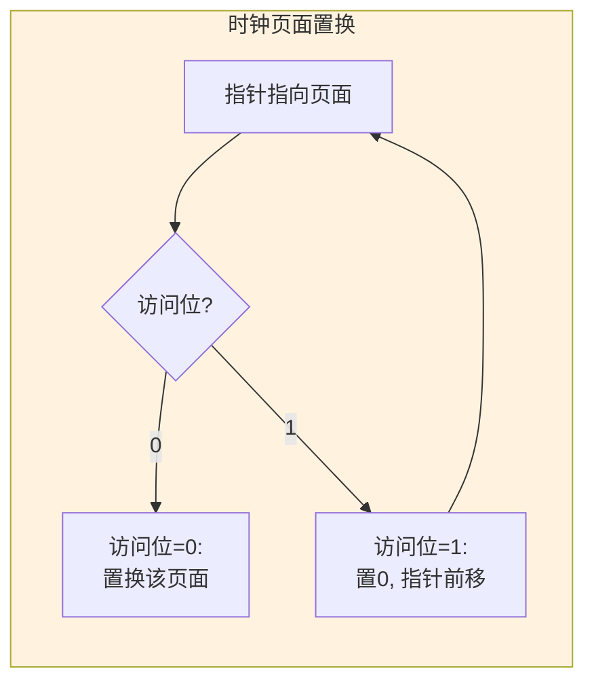
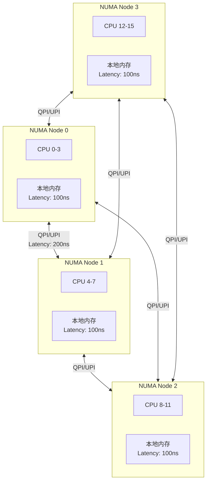
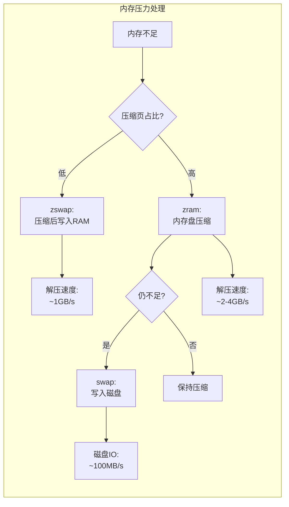

# 03.2 内存调度

---

📌 **内容摘要**

本文档深入探讨内存调度的核心原理和关键方法。内容涵盖OS调度领域的主要知识点，包括任务调度, 调度, 资源分配等关键主题。适合有一定基础的学习者系统学习。

**关键词**: 任务调度, 调度, 资源分配, OS调度

📚 **学习目标**

- 掌握内存调度的核心概念和主要方法
- 理解相关理论的应用场景
- 能够分析和实现相关算法

🎯 **难度级别**: 中级

⏱️ **预计阅读时间**: 15分钟

**前置知识**: 相关领域的基础概念, 算法与数据结构

---


---

## 03.2.1 页面置换调度

### 03.2.1.1 页面置换问题形式化

**定义 03.2.1** (页面置换问题). 给定：

- 物理页框集合 $F = \{f_1, \ldots, f_m\}$
- 页面访问序列 $\sigma = (r_1, r_2, \ldots, r_n)$，其中 $r_i \in P$（虚拟页面集合）

目标：最小化缺页次数（或最大化命中率）

### 03.2.1.2 最优算法 (OPT)

**定理 03.2.1** (Belady最优算法). OPT算法：置换最久后才被访问的页面。

$$\text{选择页面 } p = \arg\max_{p \in F} \text{next\_access}(p)$$

OPT是不可实现的（需要未来知识），但可作为评估基准。

### 03.2.1.3 LRU与近似算法

**LRU (Least Recently Used)**: 置换最久未使用的页面

**时钟算法 (Clock/Second Chance)**: LRU的近似实现



```rust
/// LRU页面置换实现
pub struct LRUPageReplacer {
    /// 页框数量
    num_frames: usize,
    /// 页面到访问时间的映射
    page_table: HashMap<PageId, AccessTime>,
    /// 按访问时间排序的页面
    lru_list: LinkedList<PageId>,
    /// 当前时间
    current_time: AccessTime,
    /// 统计
    stats: ReplacementStats,
}

/// 时钟算法实现
pub struct ClockPageReplacer {
    num_frames: usize,
    /// 循环队列中的页框
    frames: Vec<Frame>,
    /// 时钟指针
    hand: usize,
}

#[derive(Debug, Clone)]
pub struct Frame {
    pub page: Option<PageId>,
    pub reference_bit: bool,
    pub modified_bit: bool,
}

impl ClockPageReplacer {
    pub fn access(&mut self, page: PageId, is_write: bool) -> Option<PageId> {
        // 检查是否已在内存
        for frame in &self.frames {
            if frame.page == Some(page) {
                // 命中，设置访问位
                if let Some(f) = self.frames.iter_mut().find(|f| f.page == Some(page)) {
                    f.reference_bit = true;
                    if is_write {
                        f.modified_bit = true;
                    }
                }
                return None;
            }
        }

        // 缺页，需要置换
        self.replace(page, is_write)
    }

    fn replace(&mut self, new_page: PageId, is_write: bool) -> Option<PageId> {
        let start = self.hand;

        loop {
            let frame = &mut self.frames[self.hand];

            if !frame.reference_bit {
                // 找到牺牲页
                let victim = frame.page;

                frame.page = Some(new_page);
                frame.reference_bit = true;
                frame.modified_bit = is_write;

                self.hand = (self.hand + 1) % self.num_frames;
                return victim;
            }

            // 给第二次机会
            frame.reference_bit = false;
            self.hand = (self.hand + 1) % self.num_frames;

            // 避免无限循环
            if self.hand == start {
                // 完整遍历了一圈，选择当前指向的
                let victim = self.frames[self.hand].page;
                self.frames[self.hand] = Frame {
                    page: Some(new_page),
                    reference_bit: true,
                    modified_bit: is_write,
                };
                self.hand = (self.hand + 1) % self.num_frames;
                return victim;
            }
        }
    }
}

/// 工作集页面置换 (WS-Clock)
pub struct WSClockReplacer {
    clock: ClockPageReplacer,
    /// 工作集窗口大小 (单位: 时间)
    tau: Time,
    /// 最后访问时间
    last_access: HashMap<PageId, Time>,
    /// 当前时间
    current_time: Time,
}

impl WSClockReplacer {
    pub fn access(&mut self, page: PageId, is_write: bool) -> Option<PageId> {
        self.current_time += 1;

        // 更新访问时间
        self.last_access.insert(page, self.current_time);

        // 检查是否在工作集中
        match self.clock.access(page, is_write) {
            None => None, // 命中
            Some(victim) => {
                // 检查牺牲页是否在工作集中
                if let Some(last) = self.last_access.get(&victim) {
                    if self.current_time - *last <= self.tau {
                        // 在工作集中，不应该置换
                        // 放回（简化处理）
                        self.clock.force_insert(victim);
                        // 重新选择
                        self.clock.access(page, is_write)
                    } else {
                        Some(victim)
                    }
                } else {
                    Some(victim)
                }
            }
        }
    }
}
```

---

## 03.2.2 工作集与驻留集管理

### 03.2.2.1 工作集模型

**定义 03.2.2** (工作集). 进程 $p$ 在时间 $t$ 的工作集：

$$W(t, \Delta) = \{p_i : p_i \text{ 在时间区间 } [t-\Delta, t] \text{ 内被访问}\}$$

其中 $\Delta$ 为工作集窗口大小。

**性质**:

- 工作集大小 $|W(t, \Delta)|$ 随时间变化
- 若分配给进程的页框数 < 工作集大小，则产生抖动 (thrashing)

### 03.2.2.2 页面故障频率 (PFF) 算法

```rust
/// PFF页面置换
pub struct PFFReplacer {
    /// 缺页间隔阈值
    threshold_low: Time,
    threshold_high: Time,

    /// 上次缺页时间
    last_fault_time: Time,
    /// 当前页框数
    current_frames: usize,
    /// 最小/最大页框限制
    min_frames: usize,
    max_frames: usize,

    /// 实际置换器
    inner: Box<dyn PageReplacer>,
}

impl PFFReplacer {
    pub fn handle_page_fault(&mut self, current_time: Time, page: PageId) {
        let interval = current_time - self.last_fault_time;

        if interval < self.threshold_low {
            // 缺页太频繁，增加页框
            if self.current_frames < self.max_frames {
                self.current_frames += 1;
                self.inner.allocate_frame();
            }
        } else if interval > self.threshold_high {
            // 缺页很少，可以减少页框
            if self.current_frames > self.min_frames {
                self.current_frames -= 1;
                self.inner.free_frame();
            }
        }

        self.last_fault_time = current_time;
        self.inner.access(page);
    }
}
```

---

## 03.2.3 NUMA内存调度

### 03.2.3.1 NUMA架构



### 03.2.3.2 NUMA感知调度

**策略**:

1. **首次触摸 (First Touch)**: 页面分配在首次访问的节点
2. **本地分配**: 优先从本地节点分配
3. **页面迁移**: 将页面迁移到访问最频繁的节点
4. **进程绑定**: 将进程绑定到特定节点

```rust
/// NUMA内存调度器
pub struct NumaScheduler {
    /// NUMA节点信息
    nodes: Vec<NumaNode>,
    /// 页面到节点的映射
    page_home_node: HashMap<PageId, NodeId>,
    /// 每个节点上的页面访问统计
    node_access_stats: Vec<AccessStats>,
    /// 迁移阈值
    migration_threshold: f64,
}

#[derive(Debug, Clone)]
pub struct NumaNode {
    pub id: NodeId,
    pub cpus: Vec<CpuId>,
    pub total_memory: usize,
    pub free_memory: usize,
    /// 到各节点的距离（相对值）
    pub distance_matrix: Vec<u32>,
}

#[derive(Debug, Clone, Default)]
pub struct AccessStats {
    /// 本地访问次数
    pub local_accesses: u64,
    /// 远程访问次数
    pub remote_accesses: HashMap<NodeId, u64>,
    /// 访问模式历史
    pub access_pattern: VecDeque<(NodeId, Time)>,
}

impl NumaScheduler {
    /// 分配页面（首次触摸）
    pub fn alloc_page(&mut self, page: PageId, preferred_node: NodeId) -> NodeId {
        // 优先从偏好节点分配
        if self.nodes[preferred_node.0].free_memory > 0 {
            self.nodes[preferred_node.0].free_memory -= PAGE_SIZE;
            self.page_home_node.insert(page, preferred_node);
            return preferred_node;
        }

        // 从最近节点分配
        for (node_id, _) in self.get_nodes_by_distance(preferred_node) {
            if self.nodes[node_id.0].free_memory > 0 {
                self.nodes[node_id.0].free_memory -= PAGE_SIZE;
                self.page_home_node.insert(page, node_id);
                return node_id;
            }
        }

        panic!("Out of memory");
    }

    /// 记录页面访问
    pub fn record_access(&mut self, page: PageId, accessing_node: NodeId, time: Time) {
        if let Some(&home_node) = self.page_home_node.get(&page) {
            let stats = &mut self.node_access_stats[home_node.0];

            if home_node == accessing_node {
                stats.local_accesses += 1;
            } else {
                *stats.remote_accesses.entry(accessing_node).or_insert(0) += 1;
            }

            stats.access_pattern.push_back((accessing_node, time));

            // 限制历史长度
            while stats.access_pattern.len() > 1000 {
                stats.access_pattern.pop_front();
            }
        }
    }

    /// 决定是否迁移页面
    pub fn should_migrate(&self, page: PageId) -> Option<NodeId> {
        let home_node = *self.page_home_node.get(&page)?;
        let stats = &self.node_access_stats[home_node.0];

        let total_accesses = stats.local_accesses
            + stats.remote_accesses.values().sum::<u64>();

        if total_accesses == 0 {
            return None;
        }

        // 计算访问最多的远程节点
        let mut max_remote: Option<(NodeId, u64)> = None;
        for (&node, &count) in &stats.remote_accesses {
            if let Some((_, max_count)) = max_remote {
                if count > max_count {
                    max_remote = Some((node, count));
                }
            } else {
                max_remote = Some((node, count));
            }
        }

        if let Some((remote_node, remote_count)) = max_remote {
            let remote_ratio = remote_count as f64 / total_accesses as f64;
            if remote_ratio > self.migration_threshold {
                return Some(remote_node);
            }
        }

        None
    }

    /// 执行页面迁移
    pub fn migrate_page(&mut self, page: PageId, to_node: NodeId) -> Result<(), MigrateError> {
        let from_node = *self.page_home_node.get(&page)
            .ok_or(MigrateError::PageNotFound)?;

        if from_node == to_node {
            return Ok(());
        }

        // 检查目标节点空间
        if self.nodes[to_node.0].free_memory < PAGE_SIZE {
            return Err(MigrateError::NoSpace);
        }

        // 执行迁移
        self.nodes[from_node.0].free_memory += PAGE_SIZE;
        self.nodes[to_node.0].free_memory -= PAGE_SIZE;
        self.page_home_node.insert(page, to_node);

        // 重置统计
        self.node_access_stats[to_node.0] = AccessStats::default();

        Ok(())
    }

    fn get_nodes_by_distance(&self, from: NodeId) -> Vec<(NodeId, u32)> {
        let mut nodes: Vec<_> = self.nodes[from.0]
            .distance_matrix
            .iter()
            .enumerate()
            .map(|(id, &dist)| (NodeId(id), dist))
            .collect();

        nodes.sort_by_key(|&(_, dist)| dist);
        nodes
    }
}
```

---

## 03.2.4 内存压缩与交换调度

### 03.2.4.1 zswap与zram



---

## 03.2.5 总结

| 技术 | 目标 | 关键机制 | 适用场景 |
|------|------|----------|----------|
| LRU/Clock | 最大化命中率 | 访问历史 | 通用 |
| Working Set | 防止抖动 | 窗口统计 | 内存紧张 |
| NUMA | 降低访问延迟 | 本地优先、迁移 | 多路服务器 |
| zswap/zram | 延迟换出 | 压缩 | 嵌入式/移动 |

**延伸阅读**:

- [03.1 进程调度](./03.1_进程调度.md) - CFS、实时调度
- [03.3 I/O调度](./03.3_IO调度.md) - 磁盘、网络I/O调度

---

## 📚 延伸阅读

- [02.2 内存调度](../02_硬件调度/02.2_GPU调度.md)
- [1. 内存管理模型](../../03_编程范式/01_编程语言理论/01.3_内存管理模型.md)
- [03.3 I/O调度](../03_OS调度/03.3_IO调度.md)
- [03.1 进程调度](../03_OS调度/03.1_进程调度.md)
