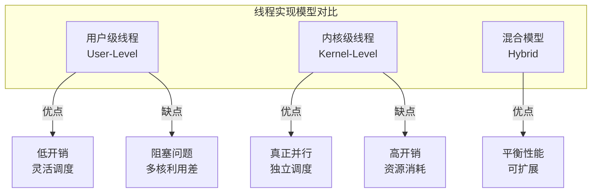
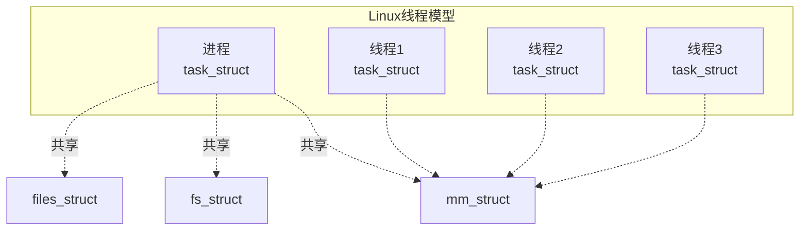
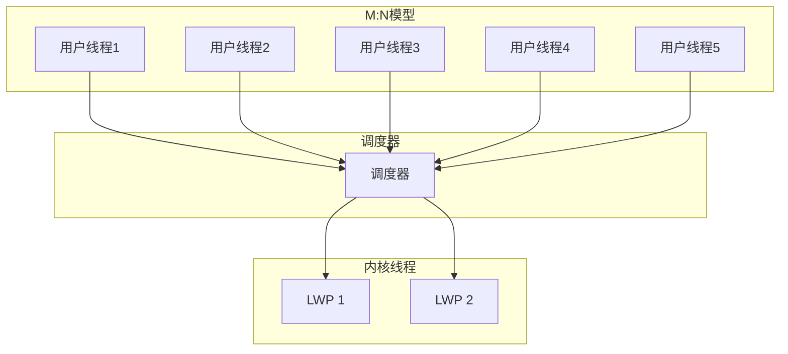
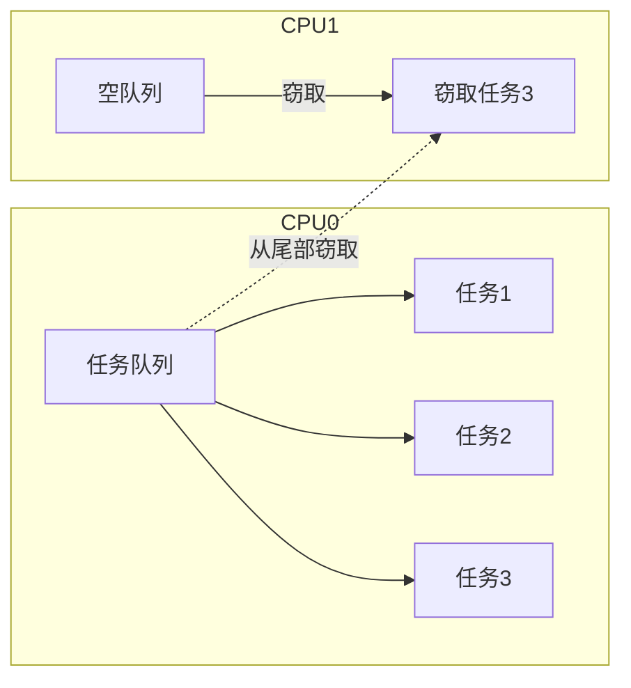
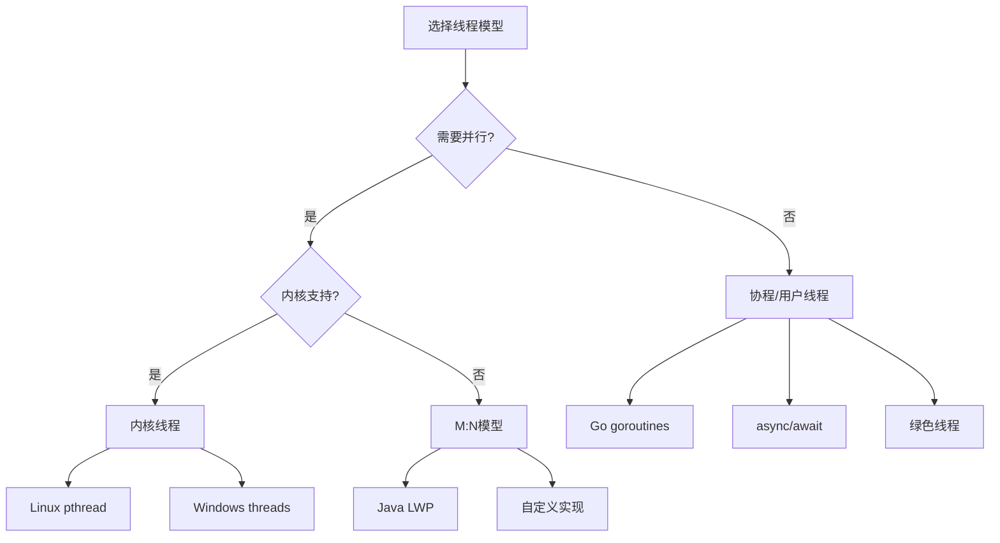

# 03.2 线程调度

> **形式科学 · 调度系统系列**
> 上一篇: [03.1 进程调度](03.1_进程调度.md) | 下一篇: [03.3 内存管理](03.3_内存管理.md)

---

## 1. 线程模型概述

### 1.1 线程实现模型



### 1.2 线程状态与调度

| 状态 | 说明 | 转换条件 |
|------|------|----------|
| 新建 | 已创建，未就绪 | 初始化完成 → 就绪 |
| 就绪 | 等待 CPU | 被调度 → 运行 |
| 运行 | 正在执行 | 时间片用完 → 就绪 |
| 阻塞 | 等待事件 | I/O完成 → 就绪 |
| 终止 | 执行完成 | - |

---

## 2. 用户级线程调度

### 2.1 轻量级调度

**定义 2.1（用户级线程）**: 完全在用户空间实现，内核不可见。

**调度器激活**:

$$\text{上下文切换时间} \approx 1\text{--}2\mu s \ll 1\text{--}10\mu s \text{ (内核线程)}$$

### 2.2 协作式 vs 抢占式

| 特性 | 协作式 | 抢占式 |
|------|--------|--------|
| 切换时机 | 主动放弃 | 定时中断 |
| 实现复杂度 | 低 | 高 |
| 公平性保证 | 无 | 有 |
| 响应性 | 差 | 好 |
| 应用示例 | Goroutines(早期) | Go 1.14+ |

### 2.3 Rust 实现：绿色线程调度器

```rust
// Rust: 用户级线程(绿色线程)调度器
use std::collections::VecDeque;
use std::sync::atomic::{AtomicU64, Ordering};
use std::cell::RefCell;
use std::rc::Rc;

pub type GreenThreadId = u64;

static NEXT_ID: AtomicU64 = AtomicU64::new(1);

pub struct GreenThread {
    pub id: GreenThreadId,
    pub state: ThreadState,
    pub context: ThreadContext,
    pub stack: Vec<u8>,
    pub priority: u8,
}

#[derive(Debug, Clone, Copy, PartialEq)]
pub enum ThreadState {
    Ready,
    Running,
    Blocked,
    Finished,
}

#[derive(Debug)]
pub struct ThreadContext {
    pub rsp: u64,
    pub rbp: u64,
    pub rip: u64,
    pub rbx: u64,
    pub r12: u64,
    pub r13: u64,
    pub r14: u64,
    pub r15: u64,
}

pub struct GreenThreadScheduler {
    ready_queue: VecDeque<Rc<RefCell<GreenThread>>>,
    current_thread: Option<Rc<RefCell<GreenThread>>>,
    time_slice: u64,
    tick_count: u64,
}

impl GreenThreadScheduler {
    pub fn new(time_slice: u64) -> Self {
        Self {
            ready_queue: VecDeque::new(),
            current_thread: None,
            time_slice,
            tick_count: 0,
        }
    }

    pub fn spawn<F>(&mut self, f: F) -> GreenThreadId
    where
        F: FnOnce() + 'static,
    {
        let id = NEXT_ID.fetch_add(1, Ordering::SeqCst);
        let stack = vec![0u8; 1024 * 1024]; // 1MB 栈

        let thread = GreenThread {
            id,
            state: ThreadState::Ready,
            context: ThreadContext::new(&stack, f),
            stack,
            priority: 5, // 默认优先级
        };

        self.ready_queue.push_back(Rc::new(RefCell::new(thread)));
        id
    }

    pub fn schedule(&mut self) -> Option<Rc<RefCell<GreenThread>>> {
        // 抢占式：检查时间片
        if let Some(ref current) = self.current_thread {
            let mut curr = current.borrow_mut();
            self.tick_count += 1;

            if self.tick_count >= self.time_slice && curr.state == ThreadState::Running {
                // 时间片用完，放回就绪队列
                curr.state = ThreadState::Ready;
                drop(curr);
                self.ready_queue.push_back(current.clone());
                self.tick_count = 0;
                self.current_thread = None;
            }
        }

        // 选择下一个线程
        if let Some(next) = self.ready_queue.pop_front() {
            next.borrow_mut().state = ThreadState::Running;
            self.current_thread = Some(next.clone());
            Some(next)
        } else {
            self.current_thread = None
        }
    }

    pub fn yield_thread(&mut self) {
        if let Some(ref current) = self.current_thread {
            let mut curr = current.borrow_mut();
            curr.state = ThreadState::Ready;
            drop(curr);
            self.ready_queue.push_back(current.clone());
        }
        self.current_thread = None;
        self.tick_count = 0;
    }

    pub fn block_current(&mut self) {
        if let Some(ref current) = self.current_thread {
            current.borrow_mut().state = ThreadState::Blocked;
        }
        self.current_thread = None;
    }

    pub fn unblock(&mut self, id: GreenThreadId) {
        // 从阻塞队列移到就绪队列
        // 简化实现
    }
}

impl ThreadContext {
    fn new<F>(_stack: &[u8], _f: F) -> Self
    where
        F: FnOnce() + 'static,
    {
        // 初始化上下文（平台相关汇编）
        Self {
            rsp: 0,
            rbp: 0,
            rip: 0,
            rbx: 0,
            r12: 0,
            r13: 0,
            r14: 0,
            r15: 0,
        }
    }
}
```

---

## 3. 内核级线程调度

### 3.1 Linux 线程实现

**轻量级进程 (LWP)**:



**task_struct 关键字段**:

| 字段 | 说明 | 调度相关 |
|------|------|----------|
| `state` | 进程状态 | 调度依据 |
| `prio` | 动态优先级 | CFS权重 |
| `se` | 调度实体 | vruntime |
| `cpus_allowed` | CPU亲和性 | 多核调度 |
| `policy` | 调度策略 | 调度器选择 |

### 3.2 调度策略

```c
// Linux 调度策略
#define SCHED_NORMAL    0   // CFS (普通进程)
#define SCHED_FIFO      1   // 实时 FIFO
#define SCHED_RR        2   // 实时 RR
#define SCHED_BATCH     3   // 批处理
#define SCHED_IDLE      5   // 空闲
#define SCHED_DEADLINE  6   // EDF 实时
```

### 3.3 Haskell 实现：线程调度模拟

```haskell
-- Haskell: 内核线程调度模拟
module OS.KernelThread where

import Data.Map (Map)
import qualified Data.Map as Map
import Data.Set (Set)
import qualified Data.Set as Set

type ThreadId = Int
type CPUMask = Set Int

data SchedulingPolicy
    = SCHED_NORMAL      -- CFS
    | SCHED_FIFO Int    -- 实时优先级 1-99
    | SCHED_RR Int      -- 实时轮转
    | SCHED_BATCH       -- 批处理
    | SCHED_IDLE        -- 空闲
    | SCHED_DEADLINE    -- EDF
    deriving (Show, Eq, Ord)

data ThreadState
    = TASK_RUNNING
    | TASK_INTERRUPTIBLE
    | TASK_UNINTERRUPTIBLE
    | TASK_STOPPED
    | TASK_TRACED
    | EXIT_ZOMBIE
    | EXIT_DEAD
    deriving (Show, Eq)

data KernelThread = KernelThread {
    tid :: ThreadId,
    tgid :: ThreadId,           -- 线程组ID
    state :: ThreadState,
    policy :: SchedulingPolicy,
    staticPrio :: Int,          -- 静态优先级 (nice)
    dynPrio :: Int,             -- 动态优先级
    vruntime :: Rational,       -- CFS虚拟时间
    cpusAllowed :: CPUMask,     -- CPU亲和性
    timeSlice :: Int,           -- 时间片
    execStart :: Integer        -- 开始执行时间
} deriving (Show)

data KernelScheduler = KernelScheduler {
    runQueues :: Map SchedulingPolicy [KernelThread],
    loadBalance :: Bool,
    numCPUs :: Int
}

-- 选择调度策略对应的调度器
selectScheduler :: SchedulingPolicy -> String
selectScheduler SCHED_NORMAL = "CFS"
selectScheduler (SCHED_FIFO _) = "RT_FIFO"
selectScheduler (SCHED_RR _) = "RT_RR"
selectScheduler SCHED_BATCH = "CFS_BATCH"
selectScheduler SCHED_IDLE = "IDLE"
selectScheduler SCHED_DEADLINE = "DL"

-- 实时优先级检查
isRealTime :: SchedulingPolicy -> Bool
isRealTime (SCHED_FIFO _) = True
isRealTime (SCHED_RR _) = True
isRealTime SCHED_DEADLINE = True
isRealTime _ = False

-- 优先级比较 (实时 > 普通)
comparePriority :: KernelThread -> KernelThread -> Ordering
comparePriority t1 t2
    | isRealTime (policy t1) && not (isRealTime (policy t2)) = GT
    | not (isRealTime (policy t1)) && isRealTime (policy t2) = LT
    | isRealTime (policy t1) && isRealTime (policy t2) =
        compare (dynPrio t1) (dynPrio t2)
    | otherwise = compare (vruntime t1) (vruntime t2)

-- 负载均衡：选择最忙的CPU
findBusiestQueue :: KernelScheduler -> Maybe SchedulingPolicy
findBusiestQueue scheduler =
    let queueLengths = Map.map length (runQueues scheduler)
    in if Map.null queueLengths
       then Nothing
       else Just $ fst $ Map.foldlWithKey
            (\(maxK, maxV) k v -> if v > maxV then (k, v) else (maxK, maxV))
            (SCHED_NORMAL, 0) queueLengths
```

---

## 4. 混合模型：M:N 调度

### 4.1 模型架构

**定义 4.1（M:N 线程）**: M 个用户级线程映射到 N 个内核级线程。



### 4.2 调度器激活机制

**上行调用 (Upcall)**:

| 事件 | 内核动作 | 用户调度器响应 |
|------|----------|---------------|
| 线程阻塞 | 通知 | 调度新线程 |
| 时钟中断 | 通知 | 抢占检查 |
| I/O 完成 | 通知 | 唤醒线程 |
| 新处理器可用 | 通知 | 创建新 LWP |

---

## 5. 工作窃取调度

### 5.1 基本概念

**定义 5.1（工作窃取）**: 空闲处理器从忙碌处理器的队列"窃取"任务。

$$\text{窃取开销} = O(1) \text{ (双端队列尾部操作)}$$



### 5.2 Rust 实现：工作窃取队列

```rust
// Rust: Chase-Lev 工作窃取双端队列
use std::cell::Cell;
use std::sync::atomic::{AtomicIsize, Ordering};
use std::sync::Arc;

pub struct Worker<T> {
    deque: Arc<Deque<T>>,
}

pub struct Stealer<T> {
    deque: Arc<Deque<T>>,
}

struct Deque<T> {
    bottom: Cell<isize>,
    top: AtomicIsize,
    buffer: Cell<*mut T>,
    capacity: Cell<usize>,
}

impl<T> Worker<T> {
    pub fn new() -> (Worker<T>, Stealer<T>) {
        let deque = Arc::new(Deque::new());
        (Worker { deque: deque.clone() }, Stealer { deque })
    }

    // 本地 push (底部)
    pub fn push(&self, task: T) {
        let b = self.deque.bottom.get();
        let t = self.deque.top.load(Ordering::Acquire);
        let cap = self.deque.capacity.get();

        // 检查是否需要扩容
        if (b - t) > cap as isize - 1 {
            self.deque.grow();
        }

        unsafe {
            let buffer = self.deque.buffer.get();
            let index = (b as usize) & (cap - 1);
            std::ptr::write(buffer.add(index), task);
        }

        self.deque.bottom.set(b + 1);
    }

    // 本地 pop (底部)
    pub fn pop(&self) -> Option<T> {
        let b = self.deque.bottom.get() - 1;
        self.deque.bottom.set(b);

        let t = self.deque.top.load(Ordering::Acquire);

        if b < t {
            // 空队列
            self.deque.bottom.set(t);
            return None;
        }

        let cap = self.deque.capacity.get();
        let buffer = self.deque.buffer.get();

        unsafe {
            let index = (b as usize) & (cap - 1);
            let task = std::ptr::read(buffer.add(index));

            // 竞争条件：可能只有一个元素
            if b == t {
                // 尝试原子更新 top
                if self.deque.top.compare_exchange(
                    t, t + 1,
                    Ordering::SeqCst,
                    Ordering::Relaxed
                ).is_err() {
                    // 窃取者赢了，放弃任务
                    self.deque.bottom.set(t + 1);
                    std::mem::forget(task);
                    return None;
                }
            }

            Some(task)
        }
    }
}

impl<T> Stealer<T> {
    // 窃取 (从顶部)
    pub fn steal(&self) -> Option<T> {
        let t = self.deque.top.load(Ordering::Acquire);
        let b = self.deque.bottom.get();

        if t >= b {
            return None; // 空队列
        }

        let cap = self.deque.capacity.get();
        let buffer = self.deque.buffer.get();

        unsafe {
            let index = (t as usize) & (cap - 1);
            let task = std::ptr::read(buffer.add(index));

            // 尝试原子更新 top
            if self.deque.top.compare_exchange(
                t, t + 1,
                Ordering::SeqCst,
                Ordering::Relaxed
            ).is_ok() {
                Some(task)
            } else {
                // 竞争失败
                std::mem::forget(task);
                None
            }
        }
    }
}
```

---

## 6. 异步/协程调度

### 6.1 协程模型

**定义 6.1（协程）**: 用户态可挂起/恢复的执行单元，比线程更轻量。

| 特性 | 线程 | 协程 |
|------|------|------|
| 切换开销 | 1-10μs | <100ns |
| 栈大小 | MB级 | KB级 |
| 调度 | 内核 | 用户态 |
| 并行 | 是 | 否（单线程内） |
| 适用 | CPU密集型 | IO密集型 |

### 6.2 async/await 调度

```rust
// Rust: 异步调度器 (简化版)
use std::future::Future;
use std::pin::Pin;
use std::task::{Context, Poll, Waker};
use std::collections::VecDeque;
use std::sync::{Arc, Mutex};

pub struct Task {
    future: Pin<Box<dyn Future<Output = ()> + Send>>,
}

pub struct AsyncScheduler {
    ready_queue: Arc<Mutex<VecDeque<Task>>>,
    io_waker: Arc<Mutex<Vec<Waker>>>,
}

impl AsyncScheduler {
    pub fn new() -> Self {
        Self {
            ready_queue: Arc::new(Mutex::new(VecDeque::new())),
            io_waker: Arc::new(Mutex::new(vec![])),
        }
    }

    pub fn spawn<F>(&self, future: F)
    where
        F: Future<Output = ()> + Send + 'static,
    {
        let task = Task {
            future: Box::pin(future),
        };
        self.ready_queue.lock().unwrap().push_back(task);
    }

    pub fn run(&self) {
        loop {
            let task = {
                let mut queue = self.ready_queue.lock().unwrap();
                queue.pop_front()
            };

            if let Some(mut task) = task {
                let waker = self.create_waker();
                let mut context = Context::from_waker(&waker);

                // 轮询 future
                match task.future.as_mut().poll(&mut context) {
                    Poll::Ready(()) => {
                        // 任务完成
                    }
                    Poll::Pending => {
                        // 任务挂起，稍后重新调度
                    }
                }
            } else {
                // 没有就绪任务，等待 I/O
                self.wait_for_io();
            }
        }
    }

    fn create_waker(&self) -> Waker {
        // 创建 waker，当 I/O 就绪时唤醒任务
        todo!()
    }

    fn wait_for_io(&self) {
        // 阻塞等待 I/O 事件
        std::thread::sleep(std::time::Duration::from_millis(1));
    }
}
```

---

## 7. 性能对比

### 7.1 线程模型对比矩阵

| 模型 | 上下文切换 | 内存占用 | 并行性 | 可扩展性 | 适用场景 |
|------|-----------|----------|--------|----------|----------|
| 用户级 | 低 | 低 | 无 | 好 | 高并发IO |
| 内核级 | 高 | 高 | 是 | 中 | CPU密集型 |
| M:N | 中 | 中 | 是 | 好 | 通用 |
| 协程 | 极低 | 极低 | 无 | 极好 | 异步IO |

### 7.2 调度策略决策树



---

## 8. 参考文献

1. Anderson, T. E., et al. "Scheduler activations: Effective kernel support for the user-level management of parallelism." _ACM TOCS_ 10.1 (1992): 53-79.
2. Chase, D., & Lev, Y. "Dynamic circular work-stealing deque." _SPAA_ 2005.
3. Go 语言协程实现: https://golang.org/src/runtime/proc.go
4. Rust async book: https://rust-lang.github.io/async-book/

---

## 9. 相关文档

- [03.1 进程调度](03.1_进程调度.md) - 策略、CFS、实时调度
- [03.3 内存管理](03.3_内存管理.md) - 页面置换、工作集、虚拟内存
- [03.4 设备调度](03.4_设备调度.md) - I/O调度、中断处理、DMA
- [04.3 任务调度](../04_分布式调度/04.3_任务调度.md) - DAG调度、依赖管理
