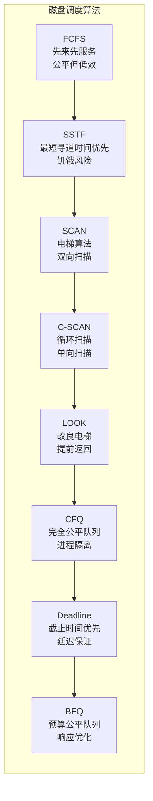
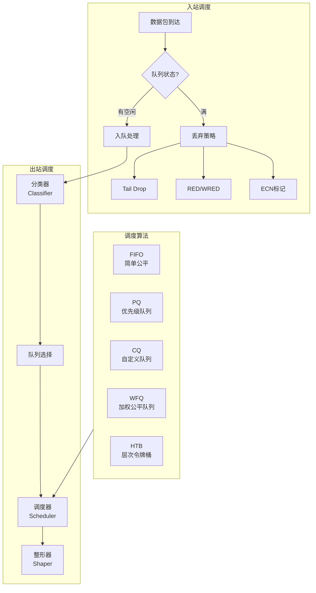

# 03.3 I/O调度

---

📌 **内容摘要**

本文档深入探讨I/O调度的核心原理和关键方法。内容涵盖OS调度领域的主要知识点，包括任务调度, 调度, 资源分配等关键主题。适合有一定基础的学习者系统学习。

**关键词**: 任务调度, 调度, 资源分配, OS调度

📚 **学习目标**
- 掌握I/O调度的核心概念和主要方法
- 理解相关理论的应用场景
- 能够分析和实现相关算法

🎯 **难度级别**: 中级

⏱️ **预计阅读时间**: 15分钟

**前置知识**: 相关领域的基础概念, 算法与数据结构

---


> **交叉引用**: 源Matter中的I/O调度文档
>
> - [Matter: I/O系统](../../Matter/01_操作系统/01.7_IO系统.md)
> - [Matter: 磁盘调度](../../Matter/01_操作系统/01.8_磁盘调度.md)
> - [FormalRE: I/O调度理论](../../FormalRE/操作系统/IO调度理论.md)

---

## 03.3.1 磁盘I/O调度

### 03.3.1.1 磁盘访问模型

**定义 03.3.1** (磁盘访问时间). 磁盘请求访问时间：

$$T_{access} = T_{seek} + T_{rotation} + T_{transfer}$$

其中：

- $T_{seek}$: 寻道时间 (0.5-10ms)
- $T_{rotation}$: 旋转延迟 (2-8ms)
- $T_{transfer}$: 传输时间 (<1ms)

### 03.3.1.2 经典磁盘调度算法



### 03.3.1.3 C-SCAN与LOOK实现

```rust
/// C-SCAN (Circular SCAN) 磁盘调度
pub struct CSCANScheduler {
    /// 当前磁头位置
    head_position: Track,
    /// 移动方向（C-SCAN始终向内）
    direction: Direction,
    /// 最大磁道数
    max_track: Track,
    /// 待处理请求队列
    request_queue: BinaryHeap<Reverse<Track>>,
}

#[derive(Debug, Clone, Copy, PartialEq, Eq, PartialOrd, Ord)]
pub struct Track(pub u32);

impl CSCANScheduler {
    pub fn schedule(&mut self) -> Option<Track> {
        // 寻找当前位置之后的最小磁道
        let mut temp_queue: Vec<Track> = vec![];
        let mut selected = None;

        while let Some(Reverse(track)) = self.request_queue.pop() {
            if track >= self.head_position && selected.is_none() {
                selected = Some(track);
            } else {
                temp_queue.push(track);
            }
        }

        // 如果没有找到，从最小磁道开始（循环）
        if selected.is_none() && !temp_queue.is_empty() {
            temp_queue.sort();
            selected = Some(temp_queue.remove(0));
        }

        // 将剩余请求放回队列
        for track in temp_queue {
            self.request_queue.push(Reverse(track));
        }

        // 更新磁头位置
        if let Some(track) = selected {
            self.head_position = track;
        }

        selected
    }

    /// 计算总寻道距离
    pub fn calculate_total_seek(&self, requests: &[Track]) -> u32 {
        let mut total = 0u32;
        let mut current = self.head_position.0;

        // 按C-SCAN顺序排序
        let mut sorted: Vec<_> = requests.iter().copied().collect();
        sorted.sort_by_key(|t| t.0);

        // 分割为两部分：当前位置之后的和之前的
        let after: Vec<_> = sorted.iter()
            .filter(|&&t| t.0 >= current)
            .copied()
            .collect();
        let before: Vec<_> = sorted.iter()
            .filter(|&&t| t.0 < current)
            .copied()
            .collect();

        // 先服务after部分
        for track in &after {
            total += track.0.abs_diff(current);
            current = track.0;
        }

        // 跳到最小（如果需要服务before部分）
        if !before.is_empty() {
            total += current; // 移动到0
            current = 0;

            // 服务before部分
            for track in &before {
                total += track.0.abs_diff(current);
                current = track.0;
            }
        }

        total
    }
}

/// LOOK调度（改良的电梯算法）
pub struct LOOKScheduler {
    head_position: Track,
    direction: Direction,
    request_queue: Vec<Track>,
}

#[derive(Debug, Clone, Copy, PartialEq)]
pub enum Direction {
    Inward,   // 向磁道号增大的方向
    Outward,  // 向磁道号减小的方向
}

impl LOOKScheduler {
    pub fn schedule(&mut self) -> Option<Track> {
        if self.request_queue.is_empty() {
            return None;
        }

        // 按当前方向寻找最近的请求
        let candidates: Vec<_> = self.request_queue.iter()
            .filter(|&&t| match self.direction {
                Direction::Inward => t >= self.head_position,
                Direction::Outward => t <= self.head_position,
            })
            .copied()
            .collect();

        if let Some(&selected) = candidates.iter()
            .min_by_key(|&&t| t.0.abs_diff(self.head_position.0)) {

            // 移除选中的请求
            self.request_queue.retain(|&t| t != selected);
            self.head_position = selected;
            return Some(selected);
        }

        // 当前方向无请求，改变方向
        self.direction = match self.direction {
            Direction::Inward => Direction::Outward,
            Direction::Outward => Direction::Inward,
        };

        // 重新调度
        self.schedule()
    }
}
```

### 03.3.1.4 Linux I/O调度器

```rust
/// CFQ (Complete Fair Queuing) 调度器
pub struct CFQScheduler {
    /// 每个进程的请求队列
    process_queues: HashMap<Pid, CFQQueue>,
    /// 服务树（按虚拟时间排序）
    service_tree: BTreeMap<u64, Pid>,
    /// 时间片长度
    slice_sync: Time,
    slice_async: Time,
    /// 当前正在服务的队列
    active_queue: Option<Pid>,
    /// 当前队列的剩余时间片
    slice_left: Time,
}

#[derive(Debug, Clone)]
pub struct CFQQueue {
    pid: Pid,
    /// 请求队列
    requests: VecDeque<IORequest>,
    /// 虚拟服务时间
    vtime: u64,
    /// 权重
    weight: u32,
    /// 队列状态
    state: QueueState,
}

impl CFQScheduler {
    /// 添加请求
    pub fn add_request(&mut self, req: IORequest) {
        let queue = self.process_queues.entry(req.pid).or_insert_with(|| {
            CFQQueue {
                pid: req.pid,
                requests: VecDeque::new(),
                vtime: 0,
                weight: 100, // 默认权重
                state: QueueState::Idle,
            }
        });

        queue.requests.push_back(req);
        queue.state = QueueState::Ready;
    }

    /// 选择下一个请求
    pub fn dispatch(&mut self) -> Option<IORequest> {
        // 检查当前队列是否还有时间片
        if let Some(active_pid) = self.active_queue {
            if self.slice_left > 0 {
                if let Some(queue) = self.process_queues.get_mut(&active_pid) {
                    if let Some(req) = queue.requests.pop_front() {
                        self.slice_left -= req.estimated_service_time();
                        return Some(req);
                    }
                }
            }
        }

        // 选择下一个队列（最小虚拟时间）
        let next_pid = self.service_tree.iter()
            .filter(|(_, pid)| {
                self.process_queues.get(pid)
                    .map(|q| !q.requests.is_empty())
                    .unwrap_or(false)
            })
            .next()
            .map(|(_, &pid)| pid)?;

        // 分配新的时间片
        self.active_queue = Some(next_pid);
        self.slice_left = if self.is_sync(next_pid) {
            self.slice_sync
        } else {
            self.slice_async
        };

        // 更新虚拟时间
        if let Some(queue) = self.process_queues.get_mut(&next_pid) {
            queue.vtime += self.slice_left as u64 / queue.weight as u64;
        }

        self.dispatch()
    }

    fn is_sync(&self, pid: Pid) -> bool {
        // 判断是否为同步I/O
        true // 简化
    }
}

/// Deadline调度器
pub struct DeadlineScheduler {
    /// 读请求队列（按截止时间排序）
    read_queue: BTreeMap<Time, IORequest>,
    /// 写请求队列（按截止时间排序）
    write_queue: BTreeMap<Time, IORequest>,
    /// 读截止时间
    read_expire: Time,
    /// 写截止时间
    write_expire: Time,
    /// FIFO队列（保证公平性）
    fifo_queue: VecDeque<IORequest>,
    /// 批处理计数
    batch_count: usize,
    max_batch: usize,
}

impl DeadlineScheduler {
    /// 添加请求
    pub fn add_request(&mut self, req: IORequest) {
        let deadline = req.arrival_time + if req.is_read {
            self.read_expire
        } else {
            self.write_expire
        };

        if req.is_read {
            self.read_queue.insert(deadline, req.clone());
        } else {
            self.write_queue.insert(deadline, req.clone());
        }

        self.fifo_queue.push_back(req);
    }

    /// 调度请求
    pub fn dispatch(&mut self, current_time: Time) -> Option<IORequest> {
        // 检查是否有超时的读请求
        if let Some((&deadline, _)) = self.read_queue.iter().next() {
            if deadline <= current_time {
                return self.extract_read_request();
            }
        }

        // 检查是否有超时的写请求
        if let Some((&deadline, _)) = self.write_queue.iter().next() {
            if deadline <= current_time {
                return self.extract_write_request();
            }
        }

        // 批处理：优先与当前请求方向一致
        if self.batch_count < self.max_batch {
            if let Some(req) = self.fifo_queue.front() {
                if req.is_read && !self.read_queue.is_empty() {
                    self.batch_count += 1;
                    return self.extract_read_request();
                } else if !req.is_read && !self.write_queue.is_empty() {
                    self.batch_count += 1;
                    return self.extract_write_request();
                }
            }
        }

        // 重置批处理计数，选择下一个方向
        self.batch_count = 0;

        // 优先读（读通常对延迟更敏感）
        if !self.read_queue.is_empty() {
            self.extract_read_request()
        } else if !self.write_queue.is_empty() {
            self.extract_write_request()
        } else {
            None
        }
    }

    fn extract_read_request(&mut self) -> Option<IORequest> {
        if let Some((_, req)) = self.read_queue.iter().next() {
            let req = req.clone();
            self.read_queue.remove(&(req.arrival_time + self.read_expire));
            self.fifo_queue.retain(|r| r.id != req.id);
            Some(req)
        } else {
            None
        }
    }

    fn extract_write_request(&mut self) -> Option<IORequest> {
        if let Some((_, req)) = self.write_queue.iter().next() {
            let req = req.clone();
            self.write_queue.remove(&(req.arrival_time + self.write_expire));
            self.fifo_queue.retain(|r| r.id != req.id);
            Some(req)
        } else {
            None
        }
    }
}
```

---

## 03.3.2 网络I/O调度

### 03.3.2.1 网络包调度



### 03.3.2.2 令牌桶算法

```rust
/// 令牌桶速率限制器
pub struct TokenBucket {
    /// 桶容量 (字节)
    capacity: u64,
    /// 当前令牌数
    tokens: f64,
    /// 填充速率 (字节/秒)
    fill_rate: f64,
    /// 上次更新时间
    last_update: Instant,
    /// 时钟周期
    clock: Duration,
}

impl TokenBucket {
    pub fn new(capacity: u64, rate: f64) -> Self {
        TokenBucket {
            capacity,
            tokens: capacity as f64,
            fill_rate: rate,
            last_update: Instant::now(),
            clock: Duration::from_millis(10),
        }
    }

    /// 尝试消耗令牌
    pub fn consume(&mut self, amount: u64) -> Result<(), TokenError> {
        self.update_tokens();

        if self.tokens >= amount as f64 {
            self.tokens -= amount as f64;
            Ok(())
        } else {
            Err(TokenError::InsufficientTokens)
        }
    }

    /// 等待直到有足够令牌
    pub async fn consume_wait(&mut self, amount: u64) {
        while self.consume(amount).is_err() {
            let needed = amount as f64 - self.tokens;
            let wait_time = Duration::from_secs_f64(needed / self.fill_rate);
            tokio::time::sleep(wait_time).await;
            self.update_tokens();
        }
    }

    fn update_tokens(&mut self) {
        let now = Instant::now();
        let elapsed = now.duration_since(self.last_update).as_secs_f64();

        self.tokens = (self.tokens + elapsed * self.fill_rate)
            .min(self.capacity as f64);
        self.last_update = now;
    }
}

/// 层次令牌桶 (HTB)
pub struct HTBScheduler {
    /// 根类
    root: HTBClass,
    /// 叶子类映射
    leaf_classes: HashMap<ClassId, HTBClass>,
    /// 当前活动类
    active_classes: BTreeSet<ClassId>,
}

#[derive(Debug, Clone)]
pub struct HTBClass {
    id: ClassId,
    parent: Option<ClassId>,
    /// 保证速率
    rate: u64,
    /// 最高速率
    ceil: u64,
    /// 桶容量
    burst: u64,
    cburst: u64,
    /// 优先级
    priority: u8,
    /// 当前层级
    level: u8,
    /// 令牌桶
    tokens: TokenBucket,
    ctokens: TokenBucket,
    /// 队列
    queue: VecDeque<Packet>,
}

impl HTBScheduler {
    /// 出队一个包
    pub fn dequeue(&mut self) -> Option<Packet> {
        // 按优先级和层级选择类
        let selected_class = self.select_class()?;

        if let Some(class) = self.leaf_classes.get_mut(&selected_class) {
            if let Some(packet) = class.queue.pop_front() {
                // 消耗令牌
                let _ = class.tokens.consume(packet.size);

                // 更新活动状态
                if class.queue.is_empty() {
                    self.active_classes.remove(&selected_class);
                }

                return Some(packet);
            }
        }

        None
    }

    fn select_class(&self) -> Option<ClassId> {
        // 简化的选择逻辑：优先选择层级低的，同层级选择优先级高的
        self.active_classes.iter()
            .filter_map(|&id| self.leaf_classes.get(&id).map(|c| (id, c)))
            .min_by_key(|(_, class)| (class.level, class.priority))
            .map(|(id, _)| id)
    }
}
```

---

## 03.3.3 C++伪代码：I/O调度框架

```cpp
#pragma once
#include <queue>
#include <vector>
#include <memory>
#include <functional>

namespace io {
amespace scheduling {

// I/O请求
template<typename SectorType = uint64_t>
struct IORequest {
    uint64_t id;
    SectorType sector;
    size_t size;
    bool is_read;
    uint64_t arrival_time;
    uint64_t deadline;
    int priority;
    pid_t pid;
};

// 磁盘调度策略接口
template<typename SectorType>
class DiskSchedulingPolicy {
public:
    virtual ~DiskSchedulingPolicy() = default;

    virtual void add_request(const IORequest<SectorType>& req) = 0;
    virtual std::optional<IORequest<SectorType>> dispatch(
        SectorType current_head
    ) = 0;
    virtual bool empty() const = 0;
};

// SSTF实现
template<typename SectorType>
class SSTFPolicy : public DiskSchedulingPolicy<SectorType> {
public:
    void add_request(const IORequest<SectorType>& req) override {
        requests_.push_back(req);
    }

    std::optional<IORequest<SectorType>> dispatch(
        SectorType current_head
    ) override {
        if (requests_.empty()) {
            return std::nullopt;
        }

        // 寻找最近的请求
        auto it = std::min_element(requests_.begin(), requests_.end(),
            [current_head](const auto& a, const auto& b) {
                return std::abs(static_cast<int64_t>(a.sector - current_head)) <
                       std::abs(static_cast<int64_t>(b.sector - current_head));
            });

        IORequest<SectorType> req = *it;
        requests_.erase(it);
        return req;
    }

    bool empty() const override {
        return requests_.empty();
    }

private:
    std::vector<IORequest<SectorType>> requests_;
};

// SCAN实现
template<typename SectorType>
class SCANPolicy : public DiskSchedulingPolicy<SectorType> {
public:
    void add_request(const IORequest<SectorType>& req) override {
        if (req.sector >= current_head_) {
            upward_queue_.push(req);
        } else {
            downward_queue_.push(req);
        }
    }

    std::optional<IORequest<SectorType>> dispatch(
        SectorType current_head
    ) override {
        current_head_ = current_head;

        // 优先服务当前方向的请求
        auto& primary = (direction_ == Direction::UP) ?
                        upward_queue_ : downward_queue_;
        auto& secondary = (direction_ == Direction::UP) ?
                          downward_queue_ : upward_queue_;

        if (!primary.empty()) {
            auto req = primary.top();
            primary.pop();
            return req;
        }

        // 改变方向
        if (!secondary.empty()) {
            direction_ = (direction_ == Direction::UP) ?
                        Direction::DOWN : Direction::UP;
            auto req = secondary.top();
            secondary.pop();
            return req;
        }

        return std::nullopt;
    }

    bool empty() const override {
        return upward_queue_.empty() && downward_queue_.empty();
    }

private:
    enum class Direction { UP, DOWN };
    Direction direction_ = Direction::UP;
    SectorType current_head_ = 0;

    // 按扇区号排序的优先队列
    struct UpwardCompare {
        bool operator()(const auto& a, const auto& b) {
            return a.sector > b.sector;
        }
    };
    struct DownwardCompare {
        bool operator()(const auto& a, const auto& b) {
            return a.sector < b.sector;
        }
    };

    std::priority_queue<IORequest<SectorType>,
                       std::vector<IORequest<SectorType>>,
                       UpwardCompare> upward_queue_;
    std::priority_queue<IORequest<SectorType>,
                       std::vector<IORequest<SectorType>>,
                       DownwardCompare> downward_queue_;
};

// 通用I/O调度器
class IOScheduler {
public:
    template<typename Policy>
    void set_policy() {
        policy_ = std::make_unique<Policy>();
    }

    void submit_request(const IORequest<>& req) {
        policy_->add_request(req);
    }

    std::optional<IORequest<>> schedule(uint64_t current_head) {
        return policy_->dispatch(current_head);
    }

private:
    std::unique_ptr<DiskSchedulingPolicy<uint64_t>> policy_;
};

} // namespace scheduling
} // namespace io
```

---

## 03.3.4 总结

| 调度器 | 目标 | 适用存储 | 特点 |
|--------|------|----------|------|
| NOOP | 最小开销 | SSD/NVMe | FIFO，无重排序 |
| Deadline | 延迟保证 | HDD | 读优先，截止时间 |
| CFQ | 公平性 | HDD | 进程隔离，时间片 |
| BFQ | 响应性 | HDD/SSD | 预算控制，低延迟 |
| Kyber | 低延迟 | NVMe | 多队列，快速路径 |
| mq-deadline | 现代HDD | NVMe | 多队列优化 |

**延伸阅读**:

- [03.1 进程调度](./03.1_进程调度.md) - CFS、实时调度
- [03.2 内存调度](./03.2_内存调度.md) - 页面置换、NUMA
---

## 📚 延伸阅读

- [01.2 调度算法分析](../01_调度理论基础/01.2_调度算法分析.md)
- [02.2 内存调度](../02_硬件调度/02.2_内存调度.md)
- [03.1 进程调度](../03_OS调度/03.1_进程调度.md)
