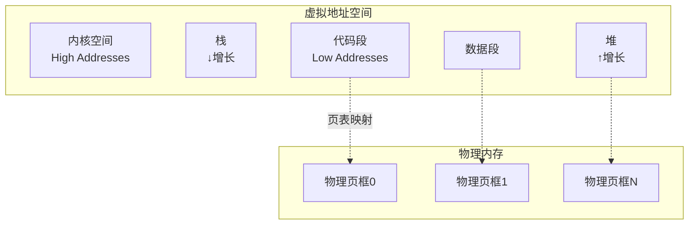
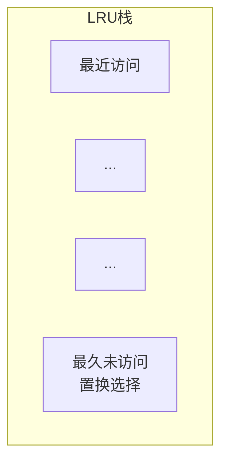
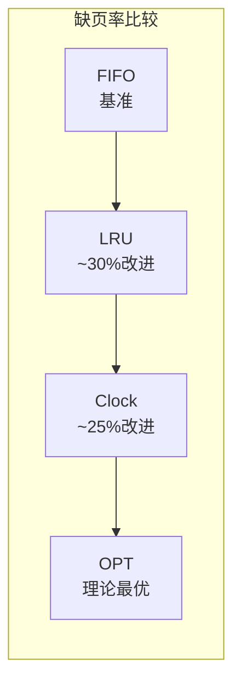

# 03.3 内存管理

---

📌 **内容摘要**

本文档深入探讨内存管理的核心原理和关键方法。内容涵盖OS调度领域的主要知识点，包括任务调度, 调度, 资源分配等关键主题。适合有一定基础的学习者系统学习。

**关键词**: 任务调度, 调度, 资源分配, OS调度

📚 **学习目标**

- 掌握内存管理的核心概念和主要方法
- 理解相关理论的应用场景
- 建立该领域的系统性知识框架

🎯 **难度级别**: 中级

⏱️ **预计阅读时间**: 15分钟

**前置知识**: 相关领域的基础概念, 算法与数据结构

---


> **形式科学 · 调度系统系列**
> 上一篇: [03.2 线程调度](03.2_线程调度.md) | 下一篇: [03.4 设备调度](03.4_设备调度.md)

---

## 1. 内存管理基础

### 1.1 地址空间模型



**地址转换**:

$$\text{物理地址} = \text{页框号} \times \text{页大小} + \text{页内偏移}$$

### 1.2 内存管理单元 (MMU)

| 组件 | 功能 | 说明 |
|------|------|------|
| TLB | 地址转换缓存 | 加速页表查找 |
| 页表遍历器 | 硬件页表遍历 | 处理 TLB 缺失 |
| 权限检查 | 访问权限验证 | R/W/X 位检查 |

---

## 2. 页面置换算法

### 2.1 最优页面置换 (OPT)

**定义 2.1（OPT）**: 置换最长时间不会被访问的页面。

**局限性**: 需要未来知识，仅作为理论基准。

$$\text{选择页}: \arg\max_{p} \{t_{next\_access}(p)\}$$

### 2.2 先进先出 (FIFO)

**Belady 异常**: 增加页框数反而增加缺页率。

```rust
// Rust: FIFO页面置换
use std::collections::VecDeque;

pub struct FIFOPageReplacer {
    frames: VecDeque<PageId>,
    capacity: usize,
}

impl FIFOPageReplacer {
    pub fn new(capacity: usize) -> Self {
        Self {
            frames: VecDeque::with_capacity(capacity),
            capacity,
        }
    }

    pub fn access(&mut self, page: PageId) -> bool {
        if self.frames.contains(&page) {
            // 页面在内存中（命中）
            true
        } else {
            // 缺页
            if self.frames.len() >= self.capacity {
                // 置换最早进入的页面
                self.frames.pop_front();
            }
            self.frames.push_back(page);
            false
        }
    }
}
```

### 2.3 最近最少使用 (LRU)

**定义 2.2（LRU）**: 置换最长时间未被访问的页面。

**栈特性**: 满足包含性质，无 Belady 异常。



**近似实现（时钟算法）**:

```haskell
-- Haskell: 时钟页面置换
module Memory.ClockPageReplacement where

import Data.Array.IO (IOArray, newArray, readArray, writeArray)
import Data.IORef (IORef, newIORef, readIORef, modifyIORef)

type PageId = Int
type FrameId = Int

data PageFrame = PageFrame {
    pageId :: Maybe PageId,
    referenceBit :: Bool
}

data ClockReplacer = ClockReplacer {
    frames :: IOArray FrameId PageFrame,
    hand :: IORef FrameId,
    numFrames :: Int
}

-- 初始化
initClock :: Int -> IO ClockReplacer
initClock n = do
    frames <- newArray (0, n-1) (PageFrame Nothing False)
    hand <- newIORef 0
    return $ ClockReplacer frames hand n

-- 访问页面
clockAccess :: ClockReplacer -> PageId -> IO Bool
clockAccess replacer page = do
    let framesArr = frames replacer
    -- 查找是否已在内存
    found <- findPage framesArr page (numFrames replacer)
    case found of
        Just frameId -> do
            -- 命中，设置引用位
            frame <- readArray framesArr frameId
            writeArray framesArr frameId frame { referenceBit = True }
            return True
        Nothing -> do
            -- 缺页，需要置换
            evictAndLoad replacer page
            return False

-- 查找页面
findPage :: IOArray FrameId PageFrame -> PageId -> Int -> IO (Maybe FrameId)
findPage arr page n = go 0
  where
    go i | i >= n = return Nothing
         | otherwise = do
             frame <- readArray arr i
             case pageId frame of
                 Just p | p == page -> return (Just i)
                 _ -> go (i + 1)

-- 置换页面
evictAndLoad :: ClockReplacer -> PageId -> IO ()
evictAndLoad replacer newPage = do
    let framesArr = frames replacer
        n = numFrames replacer

    -- 时钟扫描找置换目标
    victim <- findVictim replacer

    -- 加载新页面
    writeArray framesArr victim (PageFrame (Just newPage) True)

-- 查找置换目标
findVictim :: ClockReplacer -> IO FrameId
findVictim replacer = do
    let framesArr = frames replacer
    currentHand <- readIORef (hand replacer)

    go currentHand
  where
    go start = do
        h <- readIORef (hand replacer)
        frame <- readArray framesArr h

        if referenceBit frame
            then do  -- 引用位为1，清零并继续
                writeArray framesArr h frame { referenceBit = False }
                advanceHand replacer
                go start
            else do  -- 引用位为0，找到置换目标
                advanceHand replacer
                return h

    framesArr = frames replacer

    advanceHand r = modifyIORef (hand r) (\h -> (h + 1) `mod` numFrames r)
```

### 2.4 页面置换算法对比

| 算法 | 实现复杂度 | 缺页率 | Belady异常 | 适用场景 |
|------|-----------|--------|-----------|----------|
| OPT | 不可能 | 最优 | 无 | 理论基准 |
| FIFO | 低 | 差 | 有 | 简单系统 |
| LRU | 高 | 好 | 无 | 通用 |
| 时钟 | 低 | 接近LRU | 无 | 实际系统 |
| NFU | 中 | 中 | 无 | 带历史权重 |
| 工作集 | 中 | 好 | 无 | 局部性良好 |

---

## 3. 工作集模型

### 3.1 工作集定义

**定义 3.1（工作集）**: 进程在最近 $\Delta$ 个时间单位内访问的页面集合。

$$W(t, \Delta) = \{p \mid p \text{ 在时间区间 } [t-\Delta, t] \text{ 内被访问}\}$$

**性质**:

- 工作集大小 $w(t, \Delta) = |W(t, \Delta)|$
- 工作集大小上限: $w(t, \Delta) \leq \Delta$
- 抖动（Thrashing）: 当 $\sum w_i > \text{可用页框}$ 时发生

### 3.2 工作集页面置换

**策略**: 置换不在工作集中的页面。

```rust
// Rust: 工作集页面置换
use std::collections::HashMap;
use std::time::{Duration, Instant};

pub struct WorkingSetReplacer {
    frames: HashMap<PageId, (FrameId, Instant)>,  // 页面 -> (帧号, 最后访问时间)
    access_history: Vec<(Instant, PageId)>,       // 访问历史
    delta: Duration,                              // 工作集窗口
    capacity: usize,
}

impl WorkingSetReplacer {
    pub fn new(capacity: usize, delta_ms: u64) -> Self {
        Self {
            frames: HashMap::new(),
            access_history: Vec::new(),
            delta: Duration::from_millis(delta_ms),
            capacity,
        }
    }

    pub fn access(&mut self, page: PageId, now: Instant) -> bool {
        // 清理过期历史
        self.prune_history(now);

        // 记录访问
        self.access_history.push((now, page));

        if self.frames.contains_key(&page) {
            // 命中，更新时间
            let (frame, _) = self.frames[&page];
            self.frames.insert(page, (frame, now));
            true
        } else {
            // 缺页
            if self.frames.len() >= self.capacity {
                self.evict_outside_working_set(now);
            }
            let frame = self.find_free_frame();
            self.frames.insert(page, (frame, now));
            false
        }
    }

    fn prune_history(&mut self, now: Instant) {
        let cutoff = now - self.delta;
        self.access_history.retain(|(t, _)| *t >= cutoff);
    }

    fn evict_outside_working_set(&mut self, now: Instant) {
        let cutoff = now - self.delta;

        // 找到不在工作集中的页面（最近未访问）
        let to_evict: Vec<_> = self.frames
            .iter()
            .filter(|(_, (_, last_access))| *last_access < cutoff)
            .map(|(page, _)| *page)
            .collect();

        if to_evict.is_empty() {
            // 所有页面都在工作集中，选择最老的
            let oldest = self.frames
                .iter()
                .min_by_key(|(_, (_, t))| *t)
                .map(|(p, _)| *p)
                .unwrap();
            self.frames.remove(&oldest);
        } else {
            // 淘汰不在工作集中的页面
            for page in to_evict {
                self.frames.remove(&page);
                if self.frames.len() < self.capacity {
                    break;
                }
            }
        }
    }

    fn find_free_frame(&self) -> FrameId {
        // 简化：返回下一个可用帧号
        self.frames.len()
    }

    // 获取当前工作集大小
    pub fn working_set_size(&self, now: Instant) -> usize {
        let cutoff = now - self.delta;
        self.frames
            .values()
            .filter(|(_, t)| *t >= cutoff)
            .count()
    }
}
```

---

## 4. 虚拟内存系统

### 4.1 分页系统

**页表结构**:

| 字段 | 位数 | 说明 |
|------|------|------|
| 页框号 | 40 | 物理页框地址 |
| 存在位 (P) | 1 | 是否在内存 |
| 读写位 (R/W) | 1 | 写权限 |
| 用户位 (U/S) | 1 | 用户态可访问 |
| 访问位 (A) | 1 | 是否被访问 |
| 脏位 (D) | 1 | 是否被修改 |

**多级页表** (x86-64):


### 4.2 页分配策略

| 策略 | 说明 | 优缺点 |
|------|------|--------|
| 全局分配 | 所有进程共享页框池 | 灵活，但进程间干扰 |
| 局部分配 | 每个进程有固定页框 | 隔离，但利用率低 |
| 比例分配 | 按进程大小比例分配 | 平衡 |

### 4.3 页面回收

**kswapd 守护进程**:

```haskell
-- Haskell: 页面回收策略模拟
module Memory.PageReclaim where

import Data.List (sortOn)
import Data.Ord (Down(..))

type PageId = Int
type PFN = Int
data PageType = Anonymous | FileBacked | Kernel

data Page = Page {
    pageId :: PageId,
    pfn :: PFN,
    pageType :: PageType,
    referenced :: Bool,     -- 访问位
    dirty :: Bool,          -- 脏位
    age :: Int,             -- 页年龄
    mappedProcesses :: [Int]
}

-- 页框回收算法 (PFRA)
data ReclaimStrategy
    = LRU_Reclaim        -- 标准LRU
    | Clock_Reclaim      -- 时钟算法
    | SWAPONCE           -- 一次交换扫描
    deriving (Show)

-- 计算页面回收优先级
reclaimPriority :: Page -> Int
reclaimPriority page =
    let baseScore = case pageType page of
            Kernel -> 1000      -- 尽量不回收内核页
            FileBacked -> 100   -- 文件页可回收
            Anonymous -> 200    -- 匿名页需要交换

        refBonus = if referenced page then -50 else 0
        dirtyPenalty = if dirty page then 50 else 0
        ageBonus = -(age page)  -- 年龄越大越优先回收

    in baseScore + refBonus + dirtyPenalty + ageBonus

-- 选择回收页面
selectPagesToReclaim :: [Page] -> Int -> [Page]
selectPagesToReclaim pages targetCount =
    take targetCount $ sortOn reclaimPriority pages

-- 回收页面
reclaimPage :: Page -> IO ()
reclaimPage page = do
    case (pageType page, dirty page) of
        (FileBacked, True) -> do
            -- 写回文件页
            writebackPage page
        (Anonymous, True) -> do
            -- 交换到磁盘
            swapOutPage page
        (_, False) -> do
            -- 直接释放
            freePage page

writebackPage :: Page -> IO ()
writebackPage = undefined

swapOutPage :: Page -> IO ()
swapOutPage = undefined

freePage :: Page -> IO ()
freePage = undefined
```

---

## 5. 内存压缩与去重

### 5.1 内存压缩 (zswap/zram)

**压缩率模型**:

$$\text{有效内存} = \text{物理内存} + \text{压缩内存} \times \text{压缩比}$$

### 5.2 KSM (Kernel Samepage Merging)

**原理**: 扫描合并相同内容的页面。

```rust
// Rust: 页面去重概念实现
use std::collections::HashMap;
use sha2::{Sha256, Digest};

pub struct KSM {
    page_hashes: HashMap<[u8; 32], Vec<PageId>>,  // 哈希 -> 页面列表
    merged_pages: HashMap<PageId, PageId>,         // 页 -> 共享页
}

impl KSM {
    pub fn new() -> Self {
        Self {
            page_hashes: HashMap::new(),
            merged_pages: HashMap::new(),
        }
    }

    pub fn scan_page(&mut self, page_id: PageId, content: &[u8]) -> Option<PageId> {
        // 计算页面哈希
        let hash = Self::calculate_hash(content);

        // 查找相同哈希的页面
        if let Some(existing_pages) = self.page_hashes.get(&hash) {
            for &existing_id in existing_pages {
                // 确认内容完全相同（防止哈希冲突）
                if self.pages_equal(page_id, existing_id) {
                    // 合并页面
                    self.merged_pages.insert(page_id, existing_id);
                    return Some(existing_id);
                }
            }
        }

        // 新页面，加入哈希表
        self.page_hashes.entry(hash)
            .or_insert_with(Vec::new)
            .push(page_id);

        None
    }

    fn calculate_hash(content: &[u8]) -> [u8; 32] {
        let mut hasher = Sha256::new();
        hasher.update(content);
        hasher.finalize().into()
    }

    fn pages_equal(&self, _p1: PageId, _p2: PageId) -> bool {
        // 实际实现需要比较页面内容
        true
    }
}
```

---

## 6. Lean 形式化：内存安全

```lean4
-- Lean: 虚拟内存系统形式化
structure PageTableEntry where
  frameNumber : Nat
  present : Bool
  writable : Bool
  userAccessible : Bool
  accessed : Bool
  dirty : Bool
  deriving Repr, DecidableEq

structure PageTable where
  entries : Nat → Option PageTableEntry

def isValidAccess (pt : PageTable) (vpn : Nat) (write : Bool) (user : Bool) : Bool :=
  match pt.entries vpn with
  | none => false
  | some pte =>
      pte.present ∧
      (¬write ∨ pte.writable) ∧
      (¬user ∨ pte.userAccessible)

def translate (pt : PageTable) (vpn : Nat) : Option Nat :=
  match pt.entries vpn with
  | some pte => if pte.present then some pte.frameNumber else none
  | none => none

-- 内存访问安全定理
theorem validAccessImpliesTranslation (pt : PageTable) (vpn : Nat) (write user : Bool) :
    isValidAccess pt vpn write user →
    ∃ pfn, translate pt vpn = some pfn := by
  intro h
  unfold isValidAccess at h
  cases pt.entries vpn with
  | none => contradiction
  | some pte =>
    simp [translate, h]

-- 页面置换不变式
def pageReplacementInvariant
    (oldTable newTable : PageTable)
    (evicted loaded : Nat) : Prop :=
  ∀ vpn, vpn ≠ loaded →
    translate newTable vpn = translate oldTable vpn

  -- 加载的页面可翻译
  ∧ translate newTable loaded ≠ none

  -- 淘汰的页面不可翻译
  ∧ translate newTable evicted = none

theorem replacementMaintainsConsistency :
    ∀ (oldTable : PageTable) (evicted loaded : Nat),
    oldTable.entries evicted ≠ none →  -- 淘汰的页面存在
    let newTable := { oldTable with
      entries := λ vpn =>
        if vpn = evicted then none
        else if vpn = loaded then some {
          frameNumber := (oldTable.entries evicted).get!.frameNumber,
          present := true, writable := true,
          userAccessible := true, accessed := false, dirty := false }
        else oldTable.entries vpn }
    pageReplacementInvariant oldTable newTable evicted loaded := by
  sorry
```

---

## 7. 性能评估

### 7.1 页面置换算法性能



### 7.2 工作集窗口选择

| Δ 值 | 工作集大小 | 缺页率 | 抖动风险 |
|------|-----------|--------|----------|
| 小 | 小 | 高 | 低 |
| 中 | 中 | 低 | 中 |
| 大 | 大 | 更低 | 高 |

---

## 8. 参考文献

1. Denning, P. J. "The working set model for program behavior." _CACM_ 11.5 (1968): 323-333.
2. Belady, L. A. "A study of replacement algorithms for a virtual-storage computer." _IBM Systems Journal_ 5.2 (1966): 78-101.
3. Corbato, F. J. "A paging experiment with the Multics system." _MIT Project MAC_ (1968).
4. Love, R. _Linux Kernel Development_. Addison-Wesley, 2010.

---

## 9. 相关文档

- [02.2 内存调度](../02_硬件调度/02.2_GPU调度.md) - 缓存替换、预取、NUMA
- [03.2 线程调度](03.2_线程调度.md) - 用户级、内核级、混合模型
- [03.4 设备调度](03.4_设备调度.md) - I/O调度、中断处理、DMA
- [04.1 集群调度](../04_分布式调度/04.1_集群调度.md) - YARN、Mesos、Kubernetes

---

## 📚 延伸阅读

- [1. 内存管理模型](./03_编程范式/01_编程语言理论/01.3_内存管理模型.md)
- [02.2 内存调度](../02_硬件调度/02.2_GPU调度.md)
- [03.4 设备调度](../03_OS调度/03.4_设备调度.md)
- [02.3 内存安全形式化](./03_编程范式/02_Rust语言深入/02.3_内存安全形式化.md)
- [03.2 线程调度](../03_OS调度/03.2_内存调度.md)
