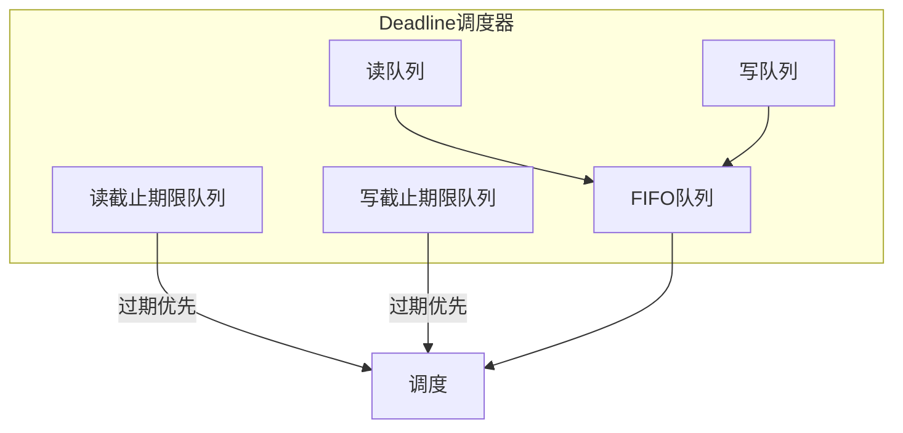
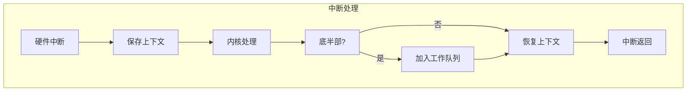
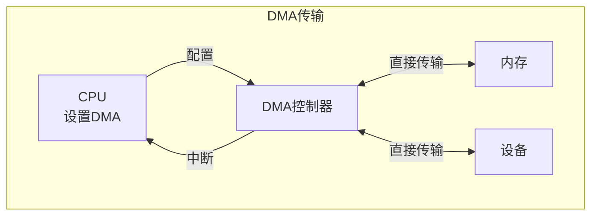
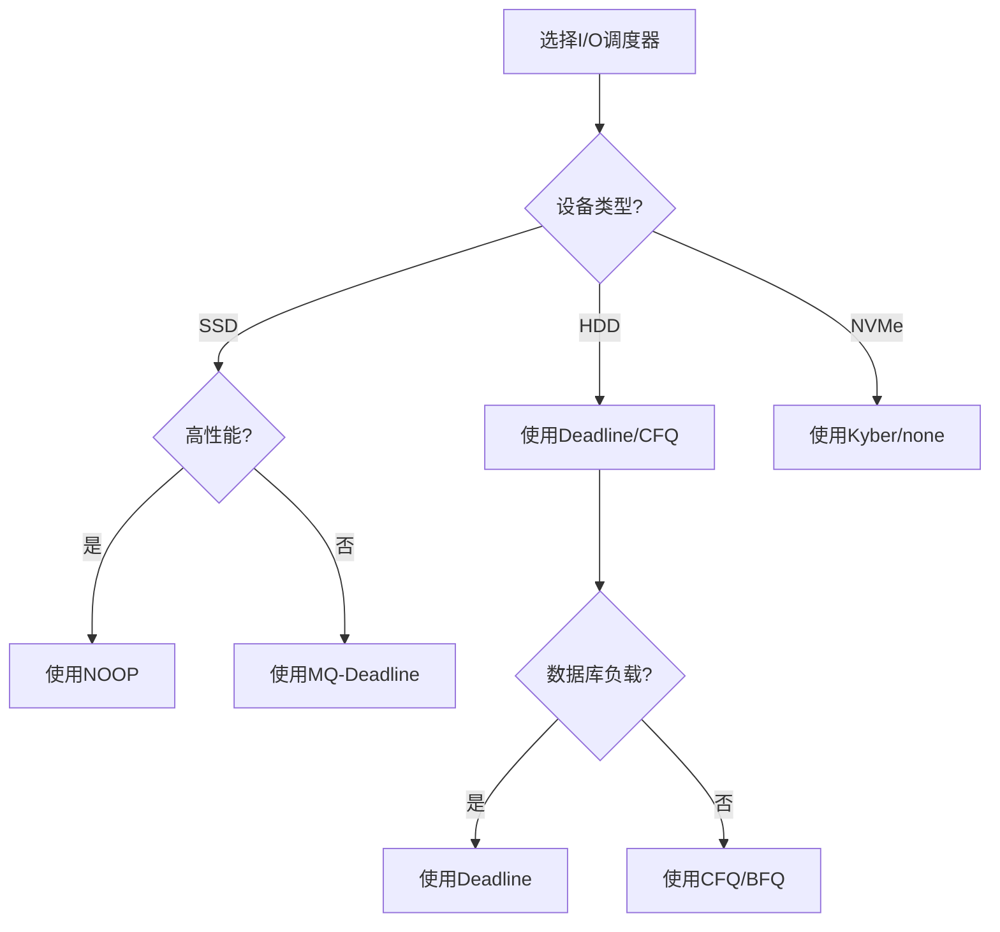

# 03.4 设备调度

---

📌 **内容摘要**

本文档深入探讨设备调度的核心原理和关键方法。内容涵盖OS调度领域的主要知识点，包括调度, 资源分配, 一致性, YARN等关键主题。适合具备相关基础的学习者进行深入研究。

**关键词**: 调度, 资源分配, 一致性, OS调度, YARN, 共识算法, 任务调度, 分布式系统

📚 **学习目标**

- 深入理解设备调度的理论体系和形式化方法
- 能够进行相关定理的形式化证明
- 能够分析和实现相关算法

🎯 **难度级别**: 高级

⏱️ **预计阅读时间**: 15分钟

**前置知识**: 该领域的中级知识, 形式化方法基础, 算法与数据结构

---


> **形式科学 · 调度系统系列**
> 上一篇: [03.3 内存管理](03.3_内存管理.md) | 下一篇: [04.1 集群调度](../04_分布式调度/04.1_集群调度.md)

---

## 1. I/O 调度基础

### 1.1 I/O 系统架构


### 1.2 I/O 请求生命周期

| 阶段 | 操作 | 时间量级 |
|------|------|----------|
| 系统调用 | 用户→内核 | ~100ns |
| VFS 处理 | 路径解析 | ~1μs |
| 页缓存检查 | 缓存命中？| ~100ns |
| I/O 调度 | 请求排序合并 | ~1μs |
| 设备驱动 | 编程设备 | ~10μs |
| DMA 传输 | 数据传输 | 设备相关 |
| 中断处理 | 完成通知 | ~10μs |

---

## 2. I/O 调度算法

### 2.1 Linux I/O 调度器

| 调度器 | 策略 | 适用场景 |
|--------|------|----------|
| **NOOP** | 先进先出 | 闪存设备 |
| **CFQ** | 完全公平队列 | 通用桌面 |
| **Deadline** | 截止期限 | 数据库 |
| **BFQ** | 预算公平队列 | 交互式系统 |
| **Kyber** | 多队列 | NVMe SSD |

### 2.2 Deadline 调度器

**核心思想**: 保证读写请求的截止期限。



**截止期限参数**:

- 读截止期限: 500ms
- 写截止期限: 5s

```rust
// Rust: Deadline I/O调度器
use std::collections::{VecDeque, BinaryHeap};
use std::cmp::Ordering;
use std::time::{Duration, Instant};

#[derive(Debug, Clone)]
pub struct IORequest {
    pub sector: u64,
    pub size: u32,
    pub is_write: bool,
    pub arrival_time: Instant,
    pub deadline: Instant,
}

impl Ord for IORequest {
    fn cmp(&self, other: &Self) -> Ordering {
        // 按截止时间排序（最早截止优先）
        self.deadline.cmp(&other.deadline)
            .then_with(|| self.sector.cmp(&other.sector))
    }
}

impl PartialOrd for IORequest {
    fn partial_cmp(&self, other: &Self) -> Option<Ordering> {
        Some(self.cmp(other))
    }
}

impl PartialEq for IORequest {
    fn eq(&self, other: &Self) -> bool {
        self.deadline == other.deadline && self.sector == other.sector
    }
}

impl Eq for IORequest {}

pub struct DeadlineScheduler {
    read_fifo: VecDeque<IORequest>,
    write_fifo: VecDeque<IORequest>,
    read_deadline: BinaryHeap<IORequest>,
    write_deadline: BinaryHeap<IORequest>,

    read_expire_ms: u64,
    write_expire_ms: u64,

    next_dispatch: Option<IORequest>,
}

impl DeadlineScheduler {
    pub fn new() -> Self {
        Self {
            read_fifo: VecDeque::new(),
            write_fifo: VecDeque::new(),
            read_deadline: BinaryHeap::new(),
            write_deadline: BinaryHeap::new(),
            read_expire_ms: 500,
            write_expire_ms: 5000,
            next_dispatch: None,
        }
    }

    pub fn enqueue(&mut self, mut req: IORequest) {
        let expire_ms = if req.is_write {
            self.write_expire_ms
        } else {
            self.read_expire_ms
        };

        req.deadline = req.arrival_time + Duration::from_millis(expire_ms);

        if req.is_write {
            self.write_fifo.push_back(req.clone());
            self.write_deadline.push(req);
        } else {
            self.read_fifo.push_back(req.clone());
            self.read_deadline.push(req);
        }
    }

    pub fn dispatch(&mut self, now: Instant) -> Option<IORequest> {
        // 检查是否有已过期的请求
        if let Some(req) = self.check_expired(now) {
            self.remove_from_fifo(&req);
            return Some(req);
        }

        // 按扇区号排序选择（类似电梯算法）
        self.select_by_sector()
    }

    fn check_expired(&mut self, now: Instant) -> Option<IORequest> {
        // 检查读截止期限
        if let Some(req) = self.read_deadline.peek() {
            if req.deadline <= now {
                return self.read_deadline.pop();
            }
        }

        // 检查写截止期限
        if let Some(req) = self.write_deadline.peek() {
            if req.deadline <= now {
                return self.write_deadline.pop();
            }
        }

        None
    }

    fn select_by_sector(&mut self) -> Option<IORequest> {
        // 简化的电梯选择
        // 实际实现会跟踪磁头位置

        if !self.read_fifo.is_empty() {
            self.read_fifo.pop_front()
        } else if !self.write_fifo.is_empty() {
            self.write_fifo.pop_front()
        } else {
            None
        }
    }

    fn remove_from_fifo(&mut self, req: &IORequest) {
        // 从FIFO队列中移除已调度的请求
        let fifo = if req.is_write {
            &mut self.write_fifo
        } else {
            &mut self.read_fifo
        };

        if let Some(pos) = fifo.iter().position(|r| r.sector == req.sector) {
            fifo.remove(pos);
        }
    }
}
```

### 2.3 BFQ (Budget Fair Queuing)

**核心思想**: 基于请求大小的预算分配。

$$\text{虚拟时间增量} = \frac{\text{实际服务量}}{\text{权重}}$$

---

## 3. 中断处理

### 3.1 中断类型

| 类型 | 触发源 | 响应时间 | 处理要求 |
|------|--------|----------|----------|
| **硬件中断** | 设备信号 | ~1μs | 快速响应 |
| **软件中断** | 系统调用 | ~100ns | 同步处理 |
| **定时器中断** | 时钟芯片 | ~1ms | 调度触发 |
| **IPI** | 处理器间 | ~1μs | 多核同步 |

### 3.2 中断处理流程



**顶半部 (Top Half)**:

- 最小化处理
- 关中断执行
- 快速响应

**底半部 (Bottom Half)**:

- 延后处理
- 开中断执行
- 复杂逻辑

### 3.3 Haskell 实现：软中断处理

```haskell
-- Haskell: 底半部处理机制
module OS.Interrupt where

import Control.Concurrent (forkIO, threadDelay)
import Control.Concurrent.STM (TQueue, atomically, writeTQueue, readTQueue)
import Data.Time (UTCTime, getCurrentTime, diffUTCTime)

data InterruptType
    = DiskComplete
    | NetworkPacket
    | TimerTick
    | KeyboardInput
    deriving (Show, Eq)

data Interrupt = Interrupt {
    intType :: InterruptType,
    timestamp :: UTCTime,
    dataPtr :: Maybe Int  -- 关联数据指针
}

-- 底半部处理类型
data BottomHalf
    = SoftIRQ Int         -- 软中断 (高优先级)
    | Tasklet Int         -- Tasklet (同类型串行)
    | WorkQueue (IO ())   -- 工作队列 (进程上下文)
    deriving (Show)

data InterruptHandler = InterruptHandler {
    topHalf :: Interrupt -> IO BottomHalf,
    softIRQAction :: Int -> IO (),
    taskletAction :: Int -> IO ()
}

-- 中断控制器
data InterruptController = InterruptController {
    pendingIRQs :: TQueue Interrupt,
    softIRQPending :: [Bool],     -- 32个软中断位
    taskletQueue :: TQueue Int,
    workQueue :: TQueue (IO ())
}

-- 处理硬件中断 (顶半部)
handleHardwareInterrupt :: InterruptController -> Interrupt -> IO ()
handleHardwareInterrupt ctrl irq = do
    -- 快速顶半部处理
    putStrLn $ "Top half: " ++ show (intType irq)

    -- 调度底半部
    case intType irq of
        DiskComplete ->
            atomically $ writeTQueue (workQueue ctrl) (processDiskIO irq)
        NetworkPacket ->
            atomically $ writeTQueue (taskletQueue ctrl) 0
        TimerTick ->
            return ()  -- 直接处理
        KeyboardInput ->
            atomically $ writeTQueue (workQueue ctrl) (processKeyboard irq)

-- 底半部处理器
bottomHalfProcessor :: InterruptController -> IO ()
bottomHalfProcessor ctrl = do
    -- 处理软中断 (按优先级)
    processSoftIRQs ctrl

    -- 处理tasklet
    processTasklets ctrl

    -- 处理工作队列
    processWorkQueue ctrl

processSoftIRQs :: InterruptController -> IO ()
processSoftIRQs _ = do
    -- 按优先级顺序处理32个软中断
    return ()

processTasklets :: InterruptController -> IO ()
processTasklets ctrl = do
    mTasklet <- atomically $ tryReadTQueue (taskletQueue ctrl)
    case mTasklet of
        Nothing -> return ()
        Just t -> do
            putStrLn $ "Processing tasklet: " ++ show t
            processTasklets ctrl  -- 递归处理更多

processWorkQueue :: InterruptController -> IO ()
processWorkQueue ctrl = do
    mWork <- atomically $ tryReadTQueue (workQueue ctrl)
    case mWork of
        Nothing -> return ()
        Just work -> do
            work  -- 执行工作
            processWorkQueue ctrl

processDiskIO :: Interrupt -> IO ()
processDiskIO irq = do
    putStrLn $ "Processing disk I/O completion: " ++ show (dataPtr irq)

processKeyboard :: Interrupt -> IO ()
processKeyboard irq = do
    putStrLn $ "Processing keyboard input: " ++ show (dataPtr irq)
```

---

## 4. DMA 调度

### 4.1 DMA 工作原理

**定义 4.1（DMA）**: 直接内存访问，允许设备直接与内存交换数据而不经过 CPU。



### 4.2 DMA 通道管理

| 特性 | 说明 |
|------|------|
| 分散/聚集 | 支持非连续内存传输 |
| 环形缓冲 | 连续数据传输 |
| 双缓冲 | 乒乓操作 |
| 流控制 | 设备控制传输速率 |

### 4.3 Rust 实现：DMA 描述符链

```rust
// Rust: DMA描述符链管理
use std::ptr::{read_volatile, write_volatile};

#[repr(C, align(16))]
pub struct DMADescriptor {
    pub source: u64,
    pub dest: u64,
    pub size: u32,
    pub control: u32,
    pub next: *mut DMADescriptor,
}

impl DMADescriptor {
    const CTRL_VALID: u32 = 1 << 0;
    const CTRL_INT_EN: u32 = 1 << 1;
    const CTRL_END: u32 = 1 << 2;

    pub fn new(source: u64, dest: u64, size: u32) -> Self {
        Self {
            source,
            dest,
            size,
            control: Self::CTRL_VALID | Self::CTRL_INT_EN,
            next: std::ptr::null_mut(),
        }
    }

    pub fn set_next(&mut self, next: *mut DMADescriptor) {
        self.next = next;
        if next.is_null() {
            self.control |= Self::CTRL_END;
        }
    }
}

pub struct DMAChannel {
    channel_id: u32,
    descriptors: Vec<DMADescriptor>,
    active: bool,
}

impl DMAChannel {
    pub fn submit_transfer(&mut self, desc: DMADescriptor) -> Result<(), DMAError> {
        if self.active {
            // 添加到描述符链末尾
            self.descriptors.push(desc);
        } else {
            // 启动新传输
            self.descriptors = vec![desc];
            self.start_transfer()?;
        }
        Ok(())
    }

    pub fn submit_scatter_gather(
        &mut self,
        segments: Vec<(u64, u64, u32)>  // (src, dst, size)
    ) -> Result<(), DMAError> {
        if segments.is_empty() {
            return Ok(());
        }

        // 创建描述符链
        let mut descs: Vec<_> = segments
            .into_iter()
            .map(|(src, dst, size)| DMADescriptor::new(src, dst, size))
            .collect();

        // 链接描述符
        for i in 0..descs.len() - 1 {
            let next_ptr = &mut descs[i + 1] as *mut _;
            descs[i].set_next(next_ptr);
        }

        // 最后一个描述符标记结束
        if let Some(last) = descs.last_mut() {
            last.control |= DMADescriptor::CTRL_END;
        }

        self.descriptors = descs;
        self.start_transfer()
    }

    fn start_transfer(&mut self) -> Result<(), DMAError> {
        if self.descriptors.is_empty() {
            return Err(DMAError::NoDescriptors);
        }

        // 将描述符地址写入DMA控制器寄存器
        let desc_ptr = &self.descriptors[0] as *const _ as u64;
        unsafe {
            self.write_register(DMA_REG_DESC_ADDR, desc_ptr);
            self.write_register(DMA_REG_CONTROL, DMA_CTRL_START);
        }

        self.active = true;
        Ok(())
    }

    pub fn check_completion(&self) -> bool {
        unsafe {
            let status = self.read_register(DMA_REG_STATUS);
            (status & DMA_STATUS_DONE) != 0
        }
    }

    unsafe fn write_register(&self, offset: usize, value: u64) {
        let reg = (self.register_base() + offset) as *mut u64;
        write_volatile(reg, value);
    }

    unsafe fn read_register(&self, offset: usize) -> u64 {
        let reg = (self.register_base() + offset) as *const u64;
        read_volatile(reg)
    }

    fn register_base(&self) -> usize {
        // 返回DMA寄存器基地址
        0x1000 + (self.channel_id as usize) * 0x100
    }
}

#[derive(Debug)]
pub enum DMAError {
    NoDescriptors,
    ChannelBusy,
    InvalidAddress,
}

const DMA_REG_DESC_ADDR: usize = 0x00;
const DMA_REG_CONTROL: usize = 0x08;
const DMA_REG_STATUS: usize = 0x10;
const DMA_CTRL_START: u64 = 1;
const DMA_STATUS_DONE: u64 = 1;
```

---

## 5. 设备电源管理

### 5.1 电源状态

| 状态 | 功耗 | 恢复时间 | 特性 |
|------|------|----------|------|
| **D0** | 100% | 0 | 完全开启 |
| **D1** | ~80% | <100μs | 轻度节能 |
| **D2** | ~20% | <10ms | 显著节能 |
| **D3hot** | ~5% | <100ms | 大部分关闭 |
| **D3cold** | ~0% | >100ms | 完全关闭 |

### 5.2 运行时 PM 策略

**自动挂起**:

$$\text{自动挂起延迟} = \text{空闲时间阈值}$$

---

## 6. 性能优化

### 6.1 I/O 合并策略

| 策略 | 条件 | 收益 |
|------|------|------|
| 相邻合并 | 物理相邻 | 减少请求数 |
| 范围合并 | 逻辑相邻 | 预读优化 |
| 死线合并 | 截止前 | 保证QoS |

### 6.2 调度器选择决策树



---

## 7. Lean 形式化：I/O 正确性

```lean4
-- Lean: I/O请求正确性
structure IORequest where
  sector : Nat
  size : Nat
  isWrite : Bool
  arrival : Nat
  deadline : Nat
  -- 约束
  h_size : size > 0
  h_deadline : deadline ≥ arrival
  deriving Repr

def ioCompleted (req : IORequest) (completionTime : Nat) : Bool :=
  completionTime ≤ req.deadline

def ioResponseTime (req : IORequest) (completionTime : Nat) : Nat :=
  completionTime - req.arrival

-- I/O调度器正确性：所有请求都在截止前完成
def schedulerCorrect
    (requests : List IORequest)
    (schedule : List (IORequest × Nat)) : Prop :=
  ∀ (req : IORequest), req ∈ requests →
    ∃ (ct : Nat), (req, ct) ∈ schedule ∧ ioCompleted req ct

-- 吞吐量计算
def throughput (schedule : List (IORequest × Nat)) (window : Nat) : ℚ :=
  let completedInWindow := schedule.filter (λ (_, ct) => ct ≤ window)
  let totalSize := completedInWindow.foldl (λ acc (req, _) =>
    acc + req.size) 0
  (totalSize : ℚ) / (window : ℚ)

-- 公平性：各流请求响应时间方差最小
def fairnessMetric
    (schedule : List (IORequest × Nat))
    (flows : List Nat) : ℚ :=
  let flowResponseTimes := flows.map (λ f =>
    let flowRequests := schedule.filter (λ (req, _) =>
      req.sector / 1000 = f)  -- 按扇区位假设流ID
    let responseTimes := flowRequests.map (λ (req, ct) =>
      ioResponseTime req ct)
    if responseTimes.isEmpty then 0
    else responseTimes.sum / responseTimes.length)

  let avg := flowResponseTimes.sum / flowResponseTimes.length
  let variance := flowResponseTimes.foldl (λ acc rt =>
    acc + (rt - avg) ^ 2) 0 / flowResponseTimes.length

  variance
```

---

## 8. 参考文献

1. Love, R. _Linux Kernel Development_. Addison-Wesley, 2010.
2. Corbet, J., Rubini, A., & Kroah-Hartman, G. _Linux Device Drivers_. O'Reilly, 2005.
3. Park, S., & Shen, K. "FIOS: A fair, efficient flash I/O scheduler." _FAST_ 2012.
4. Zhang, Y., et al. "Multi-Queue I/O Scheduling: A Journey from Traditional to Emerging Storage Systems." _ACM TOS_ 2021.

---

## 9. 相关文档

- [02.3 存储调度](../02_硬件调度/02.3_加速器调度.md) - 磁盘调度、SSD调度
- [03.3 内存管理](03.3_内存管理.md) - 页面置换、工作集、虚拟内存
- [04.1 集群调度](../04_分布式调度/04.1_集群调度.md) - YARN、Mesos、Kubernetes
- [04.2 数据流调度](../04_分布式调度/04.2_大数据调度.md) - Spark、Flink

---

## 📚 延伸阅读

- [1. 内存管理模型](./03_编程范式/01_编程语言理论/01.3_内存管理模型.md)
- [04.2 数据流调度](../04_分布式调度/04.2_大数据调度.md)
- [02.3 存储调度](../02_硬件调度/02.3_加速器调度.md)
- [01.2 调度算法分析](../01_调度理论基础/01.2_调度复杂性.md)
- [12.1.4 决策树分析](./12_决策与博弈论/01_决策理论基础/01.4_决策树分析.md)
