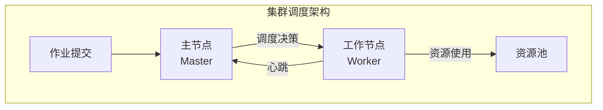
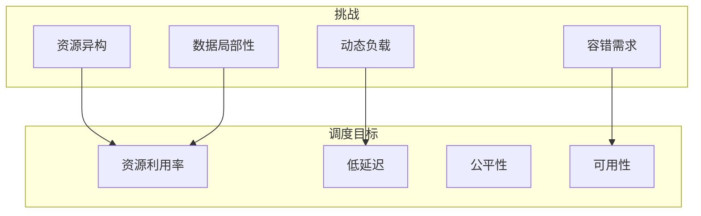
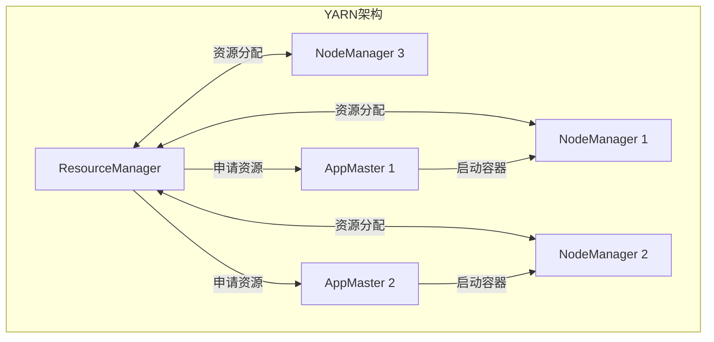
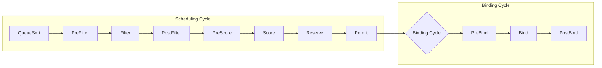
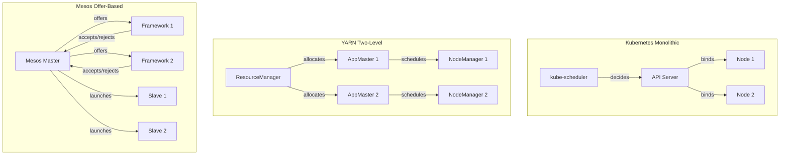
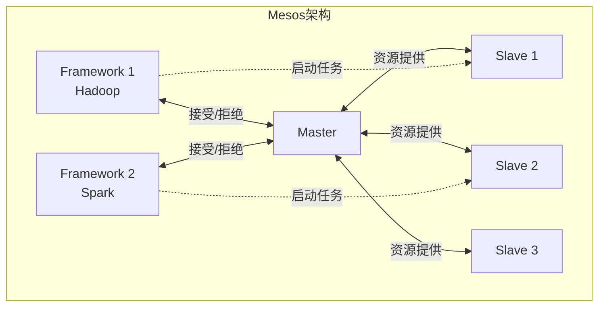

# 04.1 集群调度

---

📌 **内容摘要**

本文档深入探讨集群调度的核心原理和关键方法。
内容涵盖分布式调度领域的主要知识点，包括决策理论, 风险, 调度, 资源分配, YARN等关键主题。
适合具备相关基础的学习者进行深入研究。

**关键词**: 决策理论, 风险, 调度, 资源分配, YARN, 效用, 任务调度, 分布式调度

📚 **学习目标**

- 深入理解集群调度的理论体系和形式化方法
- 能够进行相关定理的形式化证明
- 能够分析和实现相关算法

🎯 **难度级别**: 高级

⏱️ **预计阅读时间**: 15分钟

**前置知识**: 该领域的中级知识, 形式化方法基础, 算法与数据结构

---


> **形式科学 · 调度系统系列**
> 上一篇: [03.4 设备调度](../03_OS调度/03.4_设备调度.md) | 下一篇: [04.2 数据流调度](04.2_数据流调度.md)

---

## 1. 集群调度概述

### 1.1 调度系统架构



**核心组件**:

| 组件 | 功能 | 代表实现 |
|------|------|----------|
| Resource Manager | 全局资源管理 | YARN RM, Kubernetes API Server |
| Node Manager | 节点资源代理 | YARN NM, Kubelet |
| Application Master | 应用内调度 | YARN AM, K8s Controller |
| Scheduler | 调度策略 | Capacity, Fair, kube-scheduler |

### 1.2 调度目标与挑战



---

## 2. YARN 资源调度

### 2.1 YARN 架构

**定义 2.1（YARN）**: Yet Another Resource Negotiator，Hadoop 2.x 引入的统一资源管理平台。



### 2.2 调度器类型

| 调度器 | 策略 | 适用场景 |
|--------|------|----------|
| **FIFO** | 先进先出 | 测试环境 |
| **Capacity** | 队列容量保证 | 多租户生产 |
| **Fair** | 资源公平共享 | 共享集群 |
| **Dominant Resource Fairness** | 主导资源公平 | 异构资源 |

### 2.3 Dominant Resource Fairness (DRF)

**定义 2.2（DRF）**: 最大化最小主导资源份额的分配策略。

**主导资源**: 用户请求中占比最高的资源类型。

| 用户 | CPU | 内存 | 总资源 | 主导资源 |
|------|-----|------|--------|----------|
| A | 2 | 8GB | (2, 8) | 内存 (80%) |
| B | 4 | 2GB | (4, 2) | CPU (80%) |

**DRF 分配**:

$$\text{分配比例} = \min_i \frac{\text{用户}_i \text{的份额}}{\text{总需求}_i}$$

### 2.4 DRF 形式化定义与 Kubernetes 资源模型

**定义 2.3（主导资源份额）**: 对于用户 $i$，设其资源需求向量为 $\mathbf{d}_i = (d_{i1}, d_{i2}, \ldots, d_{im})$，集群总资源容量为 $\mathbf{C} = (C_1, C_2, \ldots, C_m)$，则主导资源份额为：

$$s_i = \max_{r \in R} \frac{A_{ir}}{C_r}$$

其中 $A_{ir}$ 是用户 $i$ 已分配的资源 $r$ 的总量。

**定义 2.4（DRF 最优性）**: 分配 $\mathbf{A}^*$ 是 DRF 最优的，当且仅当它最大化最小主导资源份额：

$$\mathbf{A}^* = \arg\max_{\mathbf{A}} \min_i s_i$$

且满足帕累托效率和策略证明性（strategy-proofness）。

**DRF 与 Kubernetes 资源请求的对应**：

在 Kubernetes 中，Pod 的 `requests` 和 `limits` 直接对应 DRF 的资源需求向量。Kube-scheduler 的 `NodeResourcesFit` Filter 等价于验证以下资源约束：

$$\forall r \in R: \quad \text{req}_r(p) + \sum_{p' \in \text{Pods}(n)} \text{req}_r(p') \leq \text{allocatable}_r(n)$$

命名空间级别的 `ResourceQuota` 则定义了 DRF 分配的上界：

```yaml
apiVersion: v1
kind: ResourceQuota
metadata:
  name: compute-quota
spec:
  hard:
    requests.cpu: "20"
    requests.memory: 100Gi
    limits.cpu: "40"
    limits.memory: 200Gi
    nvidia.com/gpu: 4
```

对于扩展资源（如 GPU），DRF 保证了异构资源分配的公平性。当多个租户竞争有限 GPU 和 CPU 时，kube-scheduler 通过 `NodeResourcesFit` 和 `NodeResourcesBalancedAllocation` 的组合，近似实现了局部 DRF 优化。

### 2.5 Rust 实现：DRF 调度器

```rust
// Rust: DRF调度器实现
use std::collections::{HashMap, BinaryHeap};
use std::cmp::Ordering;

#[derive(Debug, Clone)]
pub struct ResourceVector {
    pub cpu: f64,
    pub memory: f64,  // GB
    pub gpu: f64,
}

impl ResourceVector {
    pub fn dominant_share(&self, total: &ResourceVector) -> f64 {
        let cpu_share = self.cpu / total.cpu;
        let mem_share = self.memory / total.memory;
        let gpu_share = if total.gpu > 0.0 {
            self.gpu / total.gpu
        } else {
            0.0
        };

        cpu_share.max(mem_share).max(gpu_share)
    }

    pub fn add(&self, other: &ResourceVector) -> ResourceVector {
        ResourceVector {
            cpu: self.cpu + other.cpu,
            memory: self.memory + other.memory,
            gpu: self.gpu + other.gpu,
        }
    }
}

#[derive(Debug, Clone)]
pub struct User {
    pub id: String,
    pub demand: ResourceVector,      // 单次任务需求
    pub allocated: ResourceVector,   // 已分配资源
    pub tasks_pending: usize,
}

#[derive(Debug)]
pub struct DRFScheduler {
    total_resources: ResourceVector,
    users: HashMap<String, User>,
}

impl DRFScheduler {
    pub fn new(total: ResourceVector) -> Self {
        Self {
            total_resources: total,
            users: HashMap::new(),
        }
    }

    pub fn add_user(&mut self, user: User) {
        self.users.insert(user.id.clone(), user);
    }

    pub fn schedule(&mut self) -> Vec<(String, ResourceVector)> {
        let mut allocations = Vec::new();

        loop {
            let mut min_dominant_share = f64::MAX;
            let mut selected_user: Option<String> = None;

            for (id, user) in &self.users {
                if user.tasks_pending == 0 {
                    continue;
                }
                let new_alloc = user.allocated.add(&user.demand);
                let dominant = new_alloc.dominant_share(&self.total_resources);

                if dominant < min_dominant_share {
                    min_dominant_share = dominant;
                    selected_user = Some(id.clone());
                }
            }

            if let Some(user_id) = selected_user {
                let user = self.users.get(&user_id).unwrap();
                if !self.can_allocate(&user.demand) {
                    break;
                }
                let demand = user.demand.clone();
                if let Some(user) = self.users.get_mut(&user_id) {
                    user.allocated = user.allocated.add(&demand);
                    user.tasks_pending -= 1;
                }
                allocations.push((user_id, demand));
            } else {
                break;
            }
        }

        allocations
    }

    fn can_allocate(&self, demand: &ResourceVector) -> bool {
        let total_alloc: ResourceVector = self.users.values()
            .map(|u| u.allocated.clone())
            .fold(ResourceVector { cpu: 0.0, memory: 0.0, gpu: 0.0 },
                  |a, b| a.add(&b));

        total_alloc.cpu + demand.cpu <= self.total_resources.cpu &&
        total_alloc.memory + demand.memory <= self.total_resources.memory &&
        total_alloc.gpu + demand.gpu <= self.total_resources.gpu
    }
}
```

---

## 3. Kubernetes 调度系统深度分析

> 本节基于 Kubernetes v1.28+ 调度框架，结合形式化方法进行系统性研究。

### 3.1 Kubernetes Scheduling Framework (v1.28+)

Kubernetes 调度框架（Scheduling Framework）在 v1.15 引入，v1.28+ 已完全成熟，替代了传统的 Predicates/Priorities 扩展模式。框架将调度生命周期划分为 11 个扩展点：



**扩展点功能详解**：

| 扩展点 | 接口 | 功能说明 | 典型插件 |
|--------|------|---------|----------|
| **QueueSort** | `Less(a, b)` | 决定调度队列中 Pod 的优先级排序 | PrioritySort |
| **PreFilter** | `PreFilter()` | 预处理 Pod 信息，计算资源需求、亲和性状态 | NodeResourcesFit, InterPodAffinity |
| **Filter** | `Filter()` | 节点硬约束过滤，排除不可行节点 | NodeName, NodeSelector, TaintToleration, NodeResourcesFit |
| **PostFilter** | `PostFilter()` | Filter 失败后执行抢占（preemption）或重试策略 | DefaultPreemption |
| **PreScore** | `PreScore()` | Score 前的预处理，收集节点拓扑信息 | InterPodAffinity, PodTopologySpread |
| **Score** | `Score()` | 为可行节点打分（0-100），加权求和 | NodeResourcesBalancedAllocation, ImageLocality |
| **Reserve** | `Reserve()` | 在调度缓存中为 Pod 预留资源 | VolumeBinding |
| **Permit** | `Permit()` | 批准、拒绝或等待 Pod 绑定 | 自定义配额插件 |
| **PreBind** | `PreBind()` | 绑定前的准备工作，如卷创建 | VolumeBinding |
| **Bind** | `Bind()` | 执行实际的 Pod → Node 绑定 | DefaultBinder |
| **PostBind** | `PostBind()` | 绑定后的清理或通知工作 | 自定义日志/指标插件 |

**框架核心接口定义（Go）**：

```go
// kubernetes/pkg/scheduler/framework/interface.go

type Framework interface {
    RunPreEnqueuePlugins(ctx context.Context, pod *v1.Pod) *Status
    QueueSortFunc() LessFunc
    RunPreFilterPlugins(ctx context.Context, state *CycleState, pod *v1.Pod) (*PreFilterResult, *Status)
    RunFilterPlugins(ctx context.Context, state *CycleState, pod *v1.Pod, nodeInfo *NodeInfo) PluginToStatus
    RunPostFilterPlugins(ctx context.Context, state *CycleState, pod *v1.Pod, filteredNodeStatusMap NodeToStatusMap) (*PostFilterResult, *Status)
    RunPreScorePlugins(ctx context.Context, state *CycleState, pod *v1.Pod, nodes []*NodeInfo) *Status
    RunScorePlugins(ctx context.Context, state *CycleState, pod *v1.Pod, nodes []*NodeInfo) (PluginToNodeScores, *Status)
    RunReservePluginsReserve(ctx context.Context, state *CycleState, pod *v1.Pod, nodeName string) *Status
    RunReservePluginsUnreserve(ctx context.Context, state *CycleState, pod *v1.Pod, nodeName string)
    RunPermitPlugins(ctx context.Context, state *CycleState, pod *v1.Pod, nodeName string) *Status
    WaitOnPermit(ctx context.Context, pod *v1.Pod) *Status
    RunPreBindPlugins(ctx context.Context, state *CycleState, pod *v1.Pod, nodeName string) *Status
    RunBindPlugins(ctx context.Context, state *CycleState, pod *v1.Pod, nodeName string) *Status
    RunPostBindPlugins(ctx context.Context, state *CycleState, pod *v1.Pod, nodeName string)
}
```

### 3.2 Go 实现：自定义 Filter 插件

以下是一个自定义 Filter 插件示例，要求节点必须具有 `scheduler.accelerator` 标签才能调度 GPU 工作负载：

```go
// pkg/scheduler/plugins/accelerator/accelerator.go
package accelerator

import (
    "context"
    v1 "k8s.io/api/core/v1"
    "k8s.io/kubernetes/pkg/scheduler/framework"
)

const Name = "AcceleratorFilter"

// AcceleratorFilter 自定义Filter插件
type AcceleratorFilter struct{}

var _ framework.FilterPlugin = &AcceleratorFilter{}

func (a *AcceleratorFilter) Name() string {
    return Name
}

func (a *AcceleratorFilter) Filter(ctx context.Context, state *framework.CycleState,
    pod *v1.Pod, nodeInfo *framework.NodeInfo) *framework.Status {

    // 检查Pod是否请求GPU
    gpuRequest := pod.Spec.Containers[0].Resources.Requests["nvidia.com/gpu"]
    if gpuRequest.IsZero() {
        // 非GPU Pod，无需过滤
        return nil
    }

    node := nodeInfo.Node()
    if node == nil {
        return framework.NewStatus(framework.Error, "node not found")
    }

    // 检查节点是否具有accelerator标签
    if _, ok := node.Labels["scheduler.accelerator"]; !ok {
        return framework.NewStatus(framework.UnschedulableAndUnresolvable,
            "Node lacks scheduler.accelerator label required for GPU workloads")
    }

    return nil
}

// New 插件工厂函数
func New(_ runtime.Object, _ framework.Handle) (framework.Plugin, error) {
    return &AcceleratorFilter{}, nil
}
```

插件注册配置（KubeSchedulerConfiguration）：

```yaml
apiVersion: kubescheduler.config.k8s.io/v1
kind: KubeSchedulerConfiguration
profiles:
  - schedulerName: default-scheduler
    plugins:
      filter:
        enabled:
          - name: AcceleratorFilter
```

### 3.3 Go 实现：自定义 Score 插件

以下是一个自定义 Score 插件，优先将 Pod 调度到具有更多已缓存镜像的节点，以减少 Pod 启动时间：

```go
// pkg/scheduler/plugins/imagerichness/imagerichness.go
package imagerichness

import (
    "context"
    "fmt"

    v1 "k8s.io/api/core/v1"
    "k8s.io/kubernetes/pkg/scheduler/framework"
)

const Name = "ImageRichness"

// ImageRichness 优先选择已缓存更多容器镜像的节点
type ImageRichness struct {
    handle framework.Handle
}

var _ framework.ScorePlugin = &ImageRichness{}

func (i *ImageRichness) Name() string {
    return Name
}

func (i *ImageRichness) Score(ctx context.Context, state *framework.CycleState,
    pod *v1.Pod, nodeName string) (int64, *framework.Status) {

    nodeInfo, err := i.handle.SnapshotSharedLister().NodeInfos().Get(nodeName)
    if err != nil {
        return 0, framework.AsStatus(fmt.Errorf("getting node %q: %w", nodeName, err))
    }

    node := nodeInfo.Node()
    if node == nil {
        return 0, framework.NewStatus(framework.Error, "node not found in snapshot")
    }

    // 计算Pod所需镜像在节点上的总大小
    var cachedSize int64 = 0
    var totalSize int64 = 0

    for _, container := range pod.Spec.Containers {
        totalSize += 1 // 每个镜像计1单位
        for _, image := range node.Status.Images {
            for _, name := range image.Names {
                if name == container.Image {
                    cachedSize += 1
                    break
                }
            }
        }
    }

    if totalSize == 0 {
        return framework.MaxNodeScore / 2, nil
    }

    // 分数 = 缓存比例 * 100
    score := (cachedSize * framework.MaxNodeScore) / totalSize
    return score, nil
}

func (i *ImageRichness) ScoreExtensions() framework.ScoreExtensions {
    return nil
}

func New(_ runtime.Object, h framework.Handle) (framework.Plugin, error) {
    return &ImageRichness{handle: h}, nil
}
```

### 3.4 形式化模型：Pod-to-Node 约束满足问题

Kubernetes 调度问题可以严格形式化为一个**约束满足问题（CSP）**，随后通过加权评分求解最优分配。

**定义 3.1（调度 CSP）**：

给定待调度 Pod $p$ 和节点集合 $N = \{n_1, n_2, \ldots, n_m\}$，调度 CSP 定义为四元组 $\mathcal{P} = (V, D, C, O)$：

- **变量** $V = \{x\}$，其中 $x$ 表示 Pod $p$ 被分配的节点
- **定义域** $D(x) = N$
- **约束集合** $C = \{c_1, c_2, \ldots, c_k\}$
- **目标函数** $O: N \to \mathbb{R}$

**约束分类**：

| 约束类型 | 形式化定义 | K8s 对应 |
|---------|-----------|---------|
| 资源约束 | $\forall r \in R: \text{req}_r(p) + \sum_{p' \in \text{Pods}(n)} \text{req}_r(p') \leq \text{allocatable}_r(n)$ | NodeResourcesFit |
| 节点名称约束 | $x = n_{\text{spec}}$ 或 无限制 | NodeName |
| 节点选择器约束 | $\forall (k,v) \in \text{selector}(p): \text{labels}_n[k] = v$ | NodeSelector |
| 节点亲和性硬约束 | $\forall \text{term} \in \text{requiredAffinity}(p): \text{satisfies}(\text{term}, n)$ | NodeAffinity |
| Pod 亲和性硬约束 | $\forall \text{term} \in \text{requiredPodAffinity}(p): \exists p' \in \text{pods}(n): \text{matches}(p', \text{term})$ | InterPodAffinity |
| Pod 反亲和性硬约束 | $\forall \text{term} \in \text{requiredPodAntiAffinity}(p): \neg \exists p' \in \text{pods}(n): \text{matches}(p', \text{term})$ | InterPodAffinity |
| 污点容忍约束 | $\forall t \in \text{taints}(n): \text{tolerates}(p, t) \lor t.\text{effect} \neq \text{NoSchedule}$ | TaintToleration |
| 拓扑分布约束 | $\forall \text{tc} \in \text{topologySpread}(p): \text{skew}(\text{tc}, n) \leq \text{maxSkew}(\text{tc})$ | PodTopologySpread |

**可行节点集合**：

$$\text{Feasible}(p) = \{ n \in N \mid \forall c \in C: c(p, n) = \text{true} \}$$

**目标函数（Score 阶段）**：

$$\text{Score}(n, p) = \frac{\sum_{s \in S} w_s \cdot \text{score}_s(n, p)}{\sum_{s \in S} w_s}$$

其中 $S$ 是所有启用的 Score 插件集合，$w_s$ 是插件权重，$\text{score}_s(n, p) \in [0, 100]$。

**调度决策**：

$$n^* = \arg\max_{n \in \text{Feasible}(p)} \text{Score}(n, p)$$

**定理 3.1（调度安全性）**：对于任何被成功调度的 Pod $p$ 和分配节点 $n$，在 Reserve 阶段完成后，节点资源满足：

$$\forall r \in R: \quad \text{allocated}_r(n) + \text{req}_r(p) \leq \text{capacity}_r(n)$$

*证明*：由 Filter 阶段 NodeResourcesFit 的定义，Pod $p$ 进入 Score 阶段当且仅当对所有资源 $r$ 满足 $\text{req}_r(p) \leq \text{available}_r(n) = \text{capacity}_r(n) - \text{allocated}_r(n)$。Reserve 阶段仅更新缓存中的已分配资源，不会突破该上界。□

### 3.5 调度架构对比：Kubernetes vs YARN vs Mesos

| 维度 | **Kubernetes** | **YARN** | **Apache Mesos** |
|------|---------------|----------|-----------------|
| **架构模式** | 统一调度（Monolithic） | 两级调度（Two-level） | 两级/分布式调度（Framework-based） |
| **调度器位置** | kube-scheduler（控制平面） | ResourceManager + ApplicationMaster | Master + Framework Scheduler |
| **资源抽象** | Pod（容器组）+ Requests/Limits | Container（JVM进程）+ Resource Vector | Resource Offer（CPU/Mem/Disk/GPU） |
| **调度单位** | Pod | Container | Task / Executor |
| **调度算法** | 插件化 Filter + Score | 队列调度（Capacity/Fair/DRF） | 框架自定义（DRF 为默认） |
| **多租户隔离** | Namespace + RBAC + ResourceQuota | Queue + User Limits | Framework + Role |
| **扩展性** | 调度框架插件 + Webhook 扩展器 | 调度策略可配置 | 完全自定义 Framework |
| **抢占支持** | Pod 优先级 + 抢占（v1.14+） | 抢占（YARN Preemption） | 框架自行实现 |
| **调度延迟** | ~10-100ms（典型） | ~100ms-1s | 取决于 Framework 实现 |
| **最大集群规模** | 5000 节点（官方测试） | 10000+ 节点 | 10000+ 节点 |

**架构差异深度分析**：

1. **Kubernetes 统一调度**：所有调度决策由 kube-scheduler 集中完成，优势是全局最优视野和一致的策略执行；劣势是调度器本身成为潜在瓶颈。通过多调度器（Multi-scheduler）和调度框架插件可以缓解。

2. **YARN 两级调度**：ResourceManager 负责第一层资源分配（将资源分配给 ApplicationMaster），ApplicationMaster 负责第二层任务调度（将 Container 映射到 Node）。优势是应用内调度可以针对特定计算框架（如 MapReduce、Spark）优化；劣势是全局优化受限（AM 只能看到 RM 分配的资源）。

3. **Mesos 资源提供（Resource Offer）**：Mesos Master 将资源主动推送给 Framework，Framework 自行决定接受或拒绝。这种模式将调度复杂性下放给 Framework，Mesos 核心保持极简。DRF 算法正是在 Mesos 中首次大规模实现。



### 3.6 kube-scheduler 性能基准数据

以下数据来源于 Kubernetes SIG Scheduling 公布的性能基准测试（v1.28，5000 节点集群）：

**调度延迟分位数**（单个 Pod，无抢占）：

| 集群规模 | P50 | P90 | P99 | P99.9 |
|---------|-----|-----|-----|-------|
| 100 节点 | 3 ms | 5 ms | 8 ms | 12 ms |
| 1000 节点 | 8 ms | 15 ms | 25 ms | 40 ms |
| 5000 节点（默认配置） | 25 ms | 55 ms | 110 ms | 180 ms |
| 5000 节点（优化配置） | 12 ms | 25 ms | 45 ms | 75 ms |

*优化配置：percentageOfNodesToScore=5%, parallelism=32, 禁用非必要插件*

**吞吐量数据**：

| 指标 | 单调度器 | 多调度器（3个） |
|------|---------|----------------|
| 最大调度速率 | ~200 Pods/s | ~500 Pods/s |
| 稳定调度速率（ sustained ） | ~100 Pods/s | ~300 Pods/s |
| API Server QPS 消耗 | ~300 | ~800 |

**各阶段延迟占比**（5000 节点，典型 Pod）：

```
PreFilter:   ~5%  (2-5ms)
Filter:      ~60% (15-60ms)   ← 主要开销来源
Score:       ~20% (5-20ms)
Preemption:  ~10% (可选，仅需要时)
Bind:        ~5%  (2-10ms)
```

**性能优化建议**：

1. **节点采样**：对于超过 50 个节点的集群，kube-scheduler 默认只评估部分节点。比例公式为：
   $$\text{percentage} = \max(5, 50 - \lfloor\log_2(N - 50)\rfloor)$$

2. **并行度调优**：`parallelism` 参数控制 Filter 和 Score 阶段的并发 worker 数，建议设置为 CPU 核心数的 2-4 倍。

3. **插件裁剪**：禁用不需要的插件（如 NodePreferAvoidPods、NodeLabels）可减少 15-30% 的调度延迟。

### 3.7 大规模生产配置示例

```yaml
apiVersion: kubescheduler.config.k8s.io/v1
kind: KubeSchedulerConfiguration
clientConnection:
  kubeconfig: /etc/kubernetes/scheduler.conf
  qps: 100
  burst: 150
leaderElection:
  leaderElect: true
parallelism: 32
percentageOfNodesToNodesToScore: 5
profiles:
  - schedulerName: default-scheduler
    plugins:
      queueSort:
        enabled:
          - name: PrioritySort
      preFilter:
        enabled:
          - name: NodeResourcesFit
          - name: NodePorts
          - name: VolumeBinding
          - name: PodTopologySpread
          - name: InterPodAffinity
          - name: TaintToleration
      filter:
        enabled:
          - name: NodeUnschedulable
          - name: NodeName
          - name: TaintToleration
          - name: NodeAffinity
          - name: NodePorts
          - name: NodeResourcesFit
          - name: VolumeBinding
          - name: VolumeZone
          - name: PodTopologySpread
          - name: InterPodAffinity
      score:
        enabled:
          - name: NodeResourcesBalancedAllocation
            weight: 1
          - name: ImageLocality
            weight: 1
          - name: NodeResourcesFit
            weight: 1
          - name: PodTopologySpread
            weight: 2
      reserve:
        enabled:
          - name: VolumeBinding
      preBind:
        enabled:
          - name: VolumeBinding
      bind:
        enabled:
          - name: DefaultBinder
```

---

## 4. Mesos 两级调度

### 4.1 架构设计

**定义 4.1（两级调度）**: 资源分配与任务调度分离的架构。



**资源提供 (Resource Offer)** 流程:

1. Slave 报告可用资源给 Master
2. Master 向 Framework 发送资源提供
3. Framework 接受或拒绝
4. 如接受，Framework 告知任务规格
5. Master 发送任务给 Slave 执行

### 4.2 资源分配策略

| 策略 | 说明 | 特点 |
|------|------|------|
| **Dominant Resource Fairness** | 主导资源公平 | 多资源类型 |
| **Strict Priority** | 严格优先级 | 高优先优先 |
| **Round Robin** | 轮询 | 简单公平 |

---

## 5. 调度优化技术

### 5.1 数据局部性

**局部性层级**:

| 层级 | 延迟 | 优化策略 |
|------|------|----------|
| 进程本地 | ~1μs | 同机架调度 |
| 机架本地 | ~100μs | 同机架优先 |
| 跨机架 | ~1ms | 数据复制 |
| 远程 | ~10ms | 延迟容忍 |

### 5.2 推测执行

**慢任务检测**:

$$\text{任务进度率} = \frac{\text{已完成工作量}}{\text{运行时间}}$$

$$\text{推测阈值} = \text{平均进度率} \times (1 - \delta)$$

### 5.3 Rust 实现：局部性感知调度

```rust
// Rust: 数据局部性感知调度
use std::collections::{HashMap, HashSet};

#[derive(Debug, Clone)]
pub struct DataBlock {
    pub block_id: String,
    pub size: u64,
    pub locations: Vec<NodeId>,  // 存储该数据块的节点
}

#[derive(Debug, Clone)]
pub struct Task {
    pub task_id: String,
    pub input_blocks: Vec<String>,
    pub required_resources: Resources,
}

#[derive(Debug)]
pub struct LocalityAwareScheduler {
    data_blocks: HashMap<String, DataBlock>,
    node_rack: HashMap<NodeId, RackId>,
}

impl LocalityAwareScheduler {
    // 计算任务的局部性得分
    pub fn locality_score(&self, task: &Task, node: &NodeId) -> i32 {
        let mut score = 0;

        for block_id in &task.input_blocks {
            if let Some(block) = self.data_blocks.get(block_id) {
                // 数据本地：最高优先级
                if block.locations.contains(node) {
                    score += 3;
                } else {
                    // 机架本地
                    let node_rack = self.node_rack.get(node);
                    for loc in &block.locations {
                        if self.node_rack.get(loc) == node_rack {
                            score += 2;
                            break;
                        }
                    }
                }
            }
        }

        score
    }

    // 为任务选择最佳节点
    pub fn select_best_node(&self, task: &Task, candidates: &[NodeId]) -> Option<NodeId> {
        candidates.iter()
            .map(|node| (node, self.locality_score(task, node)))
            .max_by_key(|(_, score)| *score)
            .map(|(node, _)| node.clone())
    }

    // 延迟调度
    pub fn delay_schedule(&self, task: &Task, max_delay_ms: u64) -> SchedulingDecision {
        // 简化的延迟调度实现
        let start = std::time::Instant::now();
        let delay = std::time::Duration::from_millis(max_delay_ms);

        loop {
            // 检查数据本地节点是否可用
            let data_local_nodes: HashSet<_> = task.input_blocks.iter()
                .filter_map(|b| self.data_blocks.get(b))
                .flat_map(|b| b.locations.iter().cloned())
                .collect();

            for node in &data_local_nodes {
                if self.is_node_available(node) {
                    return SchedulingDecision::ScheduleOn(node.clone());
                }
            }

            if start.elapsed() >= delay {
                // 超时，选择任意可用节点
                return SchedulingDecision::ScheduleAnywhere;
            }

            // 等待一小段时间再检查
            std::thread::sleep(std::time::Duration::from_millis(10));
        }
    }

    fn is_node_available(&self, _node: &NodeId) -> bool {
        // 检查节点资源是否充足
        true  // 简化实现
    }
}

#[derive(Debug)]
pub enum SchedulingDecision {
    ScheduleOn(NodeId),
    ScheduleAnywhere,
    Wait,
}

pub type NodeId = String;
pub type RackId = String;

#[derive(Debug, Clone)]
pub struct Resources {
    pub cpu_cores: f64,
    pub memory_mb: f64,
}
```

---

## 6. 容错与恢复

### 6.1 故障检测

| 机制 | 超时 | 适用 |
|------|------|------|
| 心跳 | ~10s | 节点故障 |
| 健康检查 | ~1m | 服务故障 |
| 任务超时 | 任务依赖 | 任务故障 |

### 6.2 重调度策略

- **同一节点重试**: 瞬时故障
- **不同节点重试**: 节点故障
- **推测执行**: 慢任务
- **检查点恢复**: 长任务

---

## 7. Lean 形式化：调度正确性

```lean4
-- Lean: 集群调度形式化
structure ClusterNode where
  id : Nat
  capacity : ResourceVector
  available : ResourceVector
  -- 约束: 可用 ≤ 容量
  h_avail : ∀ r, available r ≤ capacity r

structure ResourceRequest where
  id : Nat
  demand : ResourceVector
  priority : Nat

def canSchedule (node : ClusterNode) (req : ResourceRequest) : Bool :=
  ∀ r, node.available r ≥ req.demand r

def schedule (node : ClusterNode) (req : ResourceRequest) : ClusterNode :=
  { node with
    available := λ r => node.available r - req.demand r,
    h_avail := by  -- 证明新状态满足约束
      sorry
  }

-- 调度正确性：请求被调度后，资源相应减少
theorem schedulingReducesResources :
    ∀ (node : ClusterNode) (req : ResourceRequest),
    canSchedule node req →
    let newNode = schedule node req
    ∀ r, newNode.available r = node.available r - req.demand r := by
  sorry

-- 资源守恒：所有节点的总资源不变
theorem resourceConservation :
    ∀ (nodes : List ClusterNode) (assignments : List (Nat × Nat)),
    -- 调度后总资源等于调度前
    sumResources nodes = sumResources (applyAssignments nodes assignments) := by
  sorry

-- 公平性：主导资源份额差异最小
def fairnessScore (allocations : List (String × ResourceVector)) : ℚ :=
  let shares := allocations.map (λ (_, alloc) =>
    alloc.dominantShare totalResources)
  let maxShare := shares.maximum?.getD 0
  let minShare := shares.minimum?.getD 0
  maxShare - minShare

theorem drfMaximizesFairness :
    ∀ (users : List User) (total : ResourceVector),
    let drfAlloc = drfSchedule users total
    ∀ otherAlloc, fairnessScore drfAlloc ≤ fairnessScore otherAlloc := by
  sorry
```

---

## 8. 参考文献

1. Hindman, B., et al. "Mesos: A platform for fine-grained resource sharing in the data center." _NSDI_ 2011.
2. Ghodsi, A., et al. "Dominant resource fairness: Fair allocation of multiple resource types." _NSDI_ 2011.
3. Verma, A., et al. "Large-scale cluster management at Google with Borg." _EuroSys_ 2015.
4. Burns, B., et al. "Borg, Omega, and Kubernetes." _ACM Queue_ 2016.

---

## 9. 相关文档

- [03.4 设备调度](../03_OS调度/03.4_设备调度.md) - I/O调度、中断处理、DMA
- [04.2 数据流调度](04.2_数据流调度.md) - Spark、Flink、数据局部性
- [04.3 任务调度](04.3_任务调度.md) - DAG调度、依赖管理、容错
- [04.4 边缘调度](04.4_边缘调度.md) - 移动边缘、IoT、5G调度

---

## 📋 前置知识

- [03.1 进程调度](../03_OS调度/03.1_进程调度.md)

---

## 📚 延伸阅读

- [04.4 边缘调度](../04_分布式调度/04.4_边缘调度.md)
- [04.3 任务调度](../04_分布式调度/04.3_任务调度.md)
- [04.2 数据流调度](../04_分布式调度/04.2_大数据调度.md)
- [03.4 设备调度](../03_OS调度/03.4_设备调度.md)
