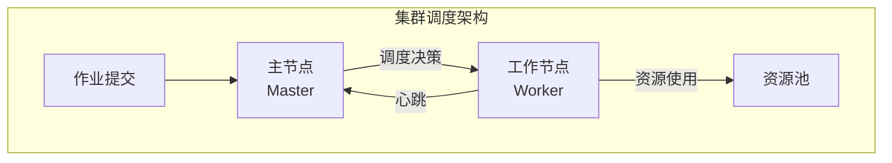
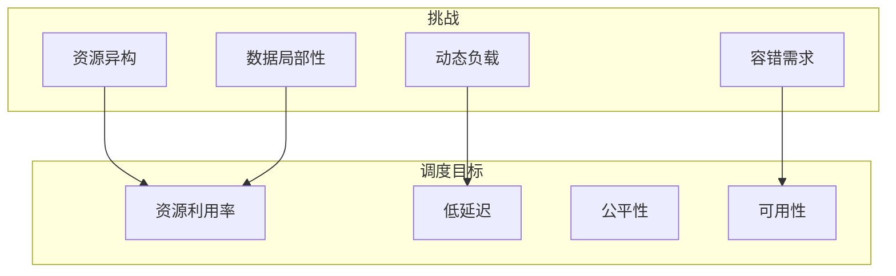
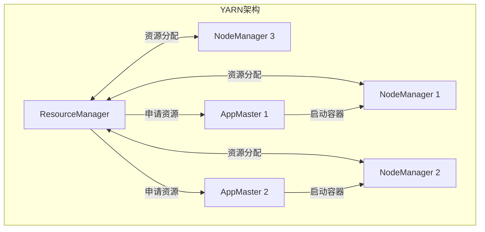
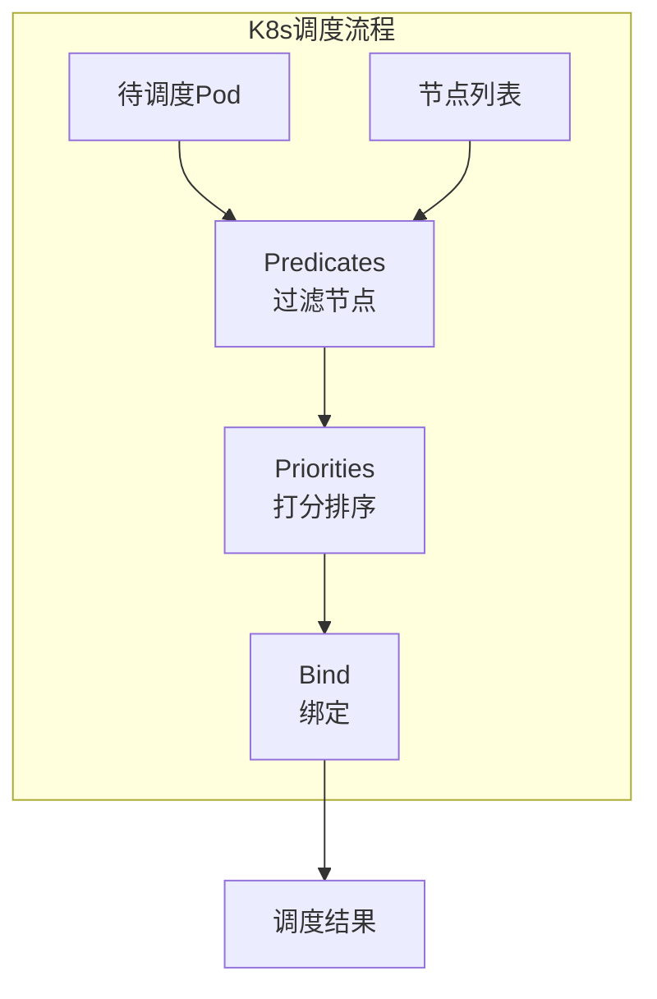
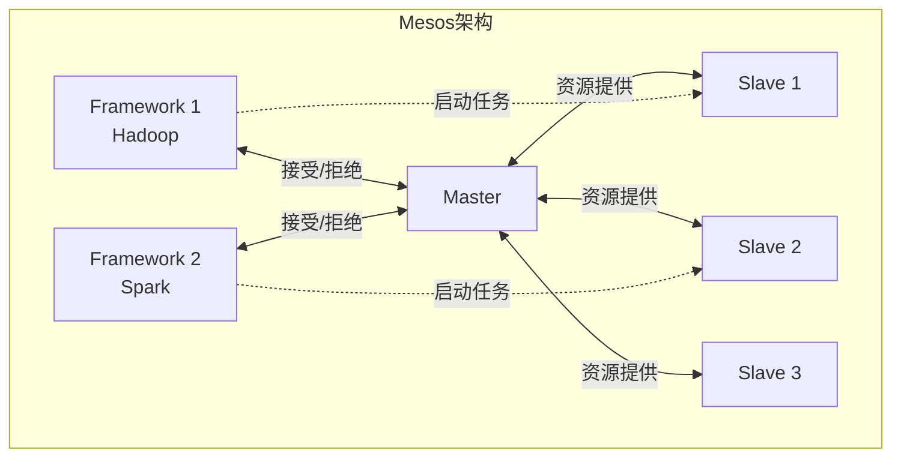

# 04.1 集群调度

---

📌 **内容摘要**

本文档深入探讨集群调度的核心原理和关键方法。内容涵盖分布式调度领域的主要知识点，包括决策理论, 风险, 调度, 资源分配, YARN等关键主题。适合具备相关基础的学习者进行深入研究。

**关键词**: 决策理论, 风险, 调度, 资源分配, YARN, 效用, 任务调度, 分布式调度

📚 **学习目标**
- 深入理解集群调度的理论体系和形式化方法
- 能够进行相关定理的形式化证明
- 能够分析和实现相关算法

🎯 **难度级别**: 高级

⏱️ **预计阅读时间**: 15分钟

**前置知识**: 该领域的中级知识, 形式化方法基础, 算法与数据结构

---


> **形式科学 · 调度系统系列**
> 上一篇: [03.4 设备调度](../03_OS调度/03.4_设备调度.md) | 下一篇: [04.2 数据流调度](04.2_数据流调度.md)

---

## 1. 集群调度概述

### 1.1 调度系统架构



**核心组件**:

| 组件 | 功能 | 代表实现 |
|------|------|----------|
| Resource Manager | 全局资源管理 | YARN RM, Kubernetes API Server |
| Node Manager | 节点资源代理 | YARN NM, Kubelet |
| Application Master | 应用内调度 | YARN AM, K8s Controller |
| Scheduler | 调度策略 | Capacity, Fair, kube-scheduler |

### 1.2 调度目标与挑战



---

## 2. YARN 资源调度

### 2.1 YARN 架构

**定义 2.1（YARN）**: Yet Another Resource Negotiator，Hadoop 2.x 引入的统一资源管理平台。



### 2.2 调度器类型

| 调度器 | 策略 | 适用场景 |
|--------|------|----------|
| **FIFO** | 先进先出 | 测试环境 |
| **Capacity** | 队列容量保证 | 多租户生产 |
| **Fair** | 资源公平共享 | 共享集群 |
| **Dominant Resource Fairness** | 主导资源公平 | 异构资源 |

### 2.3 Dominant Resource Fairness (DRF)

**定义 2.2（DRF）**: 最大化最小主导资源份额的分配策略。

**主导资源**: 用户请求中占比最高的资源类型。

| 用户 | CPU | 内存 | 总资源 | 主导资源 |
|------|-----|------|--------|----------|
| A | 2 | 8GB | (2, 8) | 内存 (80%) |
| B | 4 | 2GB | (4, 2) | CPU (80%) |

**DRF 分配**:

$$\text{分配比例} = \min_i \frac{\text{用户}_i \text{的份额}}{\text{总需求}_i}$$

### 2.4 Rust 实现：DRF 调度器

```rust
// Rust: DRF调度器实现
use std::collections::{HashMap, BinaryHeap};
use std::cmp::Ordering;

#[derive(Debug, Clone)]
pub struct ResourceVector {
    pub cpu: f64,
    pub memory: f64,  // GB
    pub gpu: f64,
}

impl ResourceVector {
    pub fn dominant_share(&self, total: &ResourceVector) -> f64 {
        let cpu_share = self.cpu / total.cpu;
        let mem_share = self.memory / total.memory;
        let gpu_share = if total.gpu > 0.0 {
            self.gpu / total.gpu
        } else {
            0.0
        };

        cpu_share.max(mem_share).max(gpu_share)
    }

    pub fn add(&self, other: &ResourceVector) -> ResourceVector {
        ResourceVector {
            cpu: self.cpu + other.cpu,
            memory: self.memory + other.memory,
            gpu: self.gpu + other.gpu,
        }
    }
}

#[derive(Debug, Clone)]
pub struct User {
    pub id: String,
    pub demand: ResourceVector,      // 单次任务需求
    pub allocated: ResourceVector,   // 已分配资源
    pub tasks_pending: usize,
}

#[derive(Debug)]
pub struct DRFScheduler {
    total_resources: ResourceVector,
    users: HashMap<String, User>,
}

impl DRFScheduler {
    pub fn new(total: ResourceVector) -> Self {
        Self {
            total_resources: total,
            users: HashMap::new(),
        }
    }

    pub fn add_user(&mut self, user: User) {
        self.users.insert(user.id.clone(), user);
    }

    pub fn schedule(&mut self) -> Vec<(String, ResourceVector)> {
        let mut allocations = Vec::new();

        loop {
            // 计算每个用户的当前主导份额
            let mut min_dominant_share = f64::MAX;
            let mut selected_user: Option<String> = None;

            for (id, user) in &self.users {
                if user.tasks_pending == 0 {
                    continue;
                }

                // 计算如果分配后的主导份额
                let new_alloc = user.allocated.add(&user.demand);
                let dominant = new_alloc.dominant_share(&self.total_resources);

                if dominant < min_dominant_share {
                    min_dominant_share = dominant;
                    selected_user = Some(id.clone());
                }
            }

            // 检查资源是否足够
            if let Some(user_id) = selected_user {
                let user = self.users.get(&user_id).unwrap();

                // 检查资源约束
                if !self.can_allocate(&user.demand) {
                    break;
                }

                // 分配资源
                let demand = user.demand.clone();
                if let Some(user) = self.users.get_mut(&user_id) {
                    user.allocated = user.allocated.add(&demand);
                    user.tasks_pending -= 1;
                }

                allocations.push((user_id, demand));
            } else {
                break;
            }
        }

        allocations
    }

    fn can_allocate(&self, demand: &ResourceVector) -> bool {
        let total_alloc: ResourceVector = self.users.values()
            .map(|u| u.allocated.clone())
            .fold(ResourceVector { cpu: 0.0, memory: 0.0, gpu: 0.0 },
                  |a, b| a.add(&b));

        total_alloc.cpu + demand.cpu <= self.total_resources.cpu &&
        total_alloc.memory + demand.memory <= self.total_resources.memory &&
        total_alloc.gpu + demand.gpu <= self.total_resources.gpu
    }
}
```

---

## 3. Kubernetes 调度

### 3.1 调度框架



**调度阶段**:

| 阶段 | 功能 | 示例 |
|------|------|------|
| Pre-filter | 预处理 | 计算Pod资源需求 |
| Filter | 节点筛选 | 资源充足、标签匹配 |
| Post-filter | 后处理 | 选择候选集 |
| Score | 打分排序 | 资源平衡、亲和性 |
| Reserve | 资源预留 | 防止竞态 |
| Permit | 批准等待 | 配额检查 |
| Pre-bind | 预绑定 | 存储准备 |
| Bind | 绑定 | 更新API |

### 3.2 调度策略

**节点选择约束**:

```yaml
# 节点选择示例
nodeSelector:
  disktype: ssd
affinity:
  podAffinity:
    requiredDuringSchedulingIgnoredDuringExecution:
    - labelSelector:
        matchExpressions:
        - key: security
          operator: In
          values:
          - S1
      topologyKey: topology.kubernetes.io/zone
```

### 3.3 Haskell 实现：K8s调度模拟

```haskell
-- Haskell: Kubernetes调度器模拟
module Cluster.K8sScheduler where

import Data.List (sortBy, filter)
import Data.Map (Map)
import qualified Data.Map as Map
import Data.Set (Set)
import qualified Data.Set as Set

type NodeName = String
type PodName = String
type LabelKey = String
type LabelValue = String

data ResourceQuantity = ResourceQuantity {
    cpu :: Double,      -- 核心数
    memory :: Double,   -- MiB
    pods :: Int
} deriving (Show, Eq)

data Node = Node {
    nodeName :: NodeName,
    allocatable :: ResourceQuantity,
    allocated :: ResourceQuantity,
    labels :: Map LabelKey LabelValue,
    taints :: [Taint]
} deriving (Show)

data Pod = Pod {
    podName :: PodName,
    requests :: ResourceQuantity,
    labels :: Map LabelKey LabelValue,
    nodeSelector :: Map LabelKey LabelValue,
    tolerations :: [Toleration],
    affinity :: Maybe Affinity
} deriving (Show)

data Taint = Taint {
    taintKey :: String,
    taintValue :: String,
    effect :: TaintEffect
} deriving (Show)

data TaintEffect = NoSchedule | PreferNoSchedule | NoExecute
    deriving (Show)

data Toleration = Toleration {
    tolKey :: String,
    tolValue :: String,
    tolEffect :: TaintEffect
} deriving (Show)

data Affinity = NodeAffinity | PodAffinity | PodAntiAffinity
    deriving (Show)

-- 调度结果
data ScheduleResult = Scheduled NodeName | Failed String
    deriving (Show)

-- Predicates: 过滤不满足条件的节点
predicates :: Pod -> [Node] -> [Node]
predicates pod = filter (podFitsNode pod)

podFitsNode :: Pod -> Node -> Bool
podFitsNode pod node =
    -- 资源充足
    hasEnoughResources pod node
    -- 节点选择器匹配
    && matchesNodeSelector pod node
    -- 容忍污点
    && toleratesTaints pod node
    -- 亲和性约束
    && satisfiesAffinity pod node

hasEnoughResources :: Pod -> Node -> Bool
hasEnoughResources pod node =
    let avail = availableResources node
        req = requests pod
    in cpu avail >= cpu req
       && memory avail >= memory req
       && pods avail >= pods req

availableResources :: Node -> ResourceQuantity
availableResources node = ResourceQuantity {
    cpu = cpu (allocatable node) - cpu (allocated node),
    memory = memory (allocatable node) - memory (allocated node),
    pods = pods (allocatable node) - pods (allocated node)
}

matchesNodeSelector :: Pod -> Node -> Bool
matchesNodeSelector pod node =
    all (\(k, v) -> Map.lookup k (labels node) == Just v)
        (Map.toList $ nodeSelector pod)

toleratesTaints :: Pod -> Node -> Bool
toleratesTaints pod node =
    all (\taint -> any (\tol -> tolerates tol taint) (tolerations pod))
        (taints node)

tolerates :: Toleration -> Taint -> Bool
tolerates tol taint =
    tolKey tol == taintKey taint &&
    tolValue tol == taintValue taint &&
    tolEffect tol == effect taint

satisfiesAffinity :: Pod -> Node -> Bool
satisfiesAffinity _ _ = True  -- 简化实现

-- Priorities: 为节点打分
scoreNode :: Pod -> Node -> Double
scoreNode pod node =
    let resourceScore = scoreResourceBalance pod node
        selectorScore = if matchesNodeSelector pod node then 10 else 0
    in resourceScore + fromIntegral selectorScore

scoreResourceBalance :: Pod -> Node -> Double
scoreResourceBalance pod node =
    let avail = availableResources node
        req = requests pod
        -- 剩余资源比例
        cpuRatio = (cpu avail - cpu req) / cpu (allocatable node)
        memRatio = (memory avail - memory req) / memory (allocatable node)
    -- 使用最小资源比例的节点得分更高（更平衡）
    in (cpuRatio + memRatio) / 2.0 * 100.0

-- 调度Pod
schedulePod :: Pod -> [Node] -> ScheduleResult
schedulePod pod nodes =
    let candidates = predicates pod nodes
    in if null candidates
       then Failed "No suitable node found"
       else
         let scored = map (\n -> (n, scoreNode pod n)) candidates
             bestNode = fst $ head $ sortBy (\(_, s1) (_, s2) ->
                 compare s2 s1) scored
         in Scheduled (nodeName bestNode)

-- 模拟调度多个Pod
schedulePods :: [Pod] -> [Node] -> Map PodName ScheduleResult
schedulePods pods nodes =
    foldl (\acc pod ->
        let result = schedulePod pod nodes
        in Map.insert (podName pod) result acc
    ) Map.empty pods
```

---

## 4. Mesos 两级调度

### 4.1 架构设计

**定义 4.1（两级调度）**: 资源分配与任务调度分离的架构。



**资源提供 (Resource Offer)** 流程:

1. Slave 报告可用资源给 Master
2. Master 向 Framework 发送资源提供
3. Framework 接受或拒绝
4. 如接受，Framework 告知任务规格
5. Master 发送任务给 Slave 执行

### 4.2 资源分配策略

| 策略 | 说明 | 特点 |
|------|------|------|
| **Dominant Resource Fairness** | 主导资源公平 | 多资源类型 |
| **Strict Priority** | 严格优先级 | 高优先优先 |
| **Round Robin** | 轮询 | 简单公平 |

---

## 5. 调度优化技术

### 5.1 数据局部性

**局部性层级**:

| 层级 | 延迟 | 优化策略 |
|------|------|----------|
| 进程本地 | ~1μs | 同机架调度 |
| 机架本地 | ~100μs | 同机架优先 |
| 跨机架 | ~1ms | 数据复制 |
| 远程 | ~10ms | 延迟容忍 |

### 5.2 推测执行

**慢任务检测**:

$$\text{任务进度率} = \frac{\text{已完成工作量}}{\text{运行时间}}$$

$$\text{推测阈值} = \text{平均进度率} \times (1 - \delta)$$

### 5.3 Rust 实现：局部性感知调度

```rust
// Rust: 数据局部性感知调度
use std::collections::{HashMap, HashSet};

#[derive(Debug, Clone)]
pub struct DataBlock {
    pub block_id: String,
    pub size: u64,
    pub locations: Vec<NodeId>,  // 存储该数据块的节点
}

#[derive(Debug, Clone)]
pub struct Task {
    pub task_id: String,
    pub input_blocks: Vec<String>,
    pub required_resources: Resources,
}

#[derive(Debug)]
pub struct LocalityAwareScheduler {
    data_blocks: HashMap<String, DataBlock>,
    node_rack: HashMap<NodeId, RackId>,
}

impl LocalityAwareScheduler {
    // 计算任务的局部性得分
    pub fn locality_score(&self, task: &Task, node: &NodeId) -> i32 {
        let mut score = 0;

        for block_id in &task.input_blocks {
            if let Some(block) = self.data_blocks.get(block_id) {
                // 数据本地：最高优先级
                if block.locations.contains(node) {
                    score += 3;
                } else {
                    // 机架本地
                    let node_rack = self.node_rack.get(node);
                    for loc in &block.locations {
                        if self.node_rack.get(loc) == node_rack {
                            score += 2;
                            break;
                        }
                    }
                }
            }
        }

        score
    }

    // 为任务选择最佳节点
    pub fn select_best_node(&self, task: &Task, candidates: &[NodeId]) -> Option<NodeId> {
        candidates.iter()
            .map(|node| (node, self.locality_score(task, node)))
            .max_by_key(|(_, score)| *score)
            .map(|(node, _)| node.clone())
    }

    // 延迟调度
    pub fn delay_schedule(&self, task: &Task, max_delay_ms: u64) -> SchedulingDecision {
        // 简化的延迟调度实现
        let start = std::time::Instant::now();
        let delay = std::time::Duration::from_millis(max_delay_ms);

        loop {
            // 检查数据本地节点是否可用
            let data_local_nodes: HashSet<_> = task.input_blocks.iter()
                .filter_map(|b| self.data_blocks.get(b))
                .flat_map(|b| b.locations.iter().cloned())
                .collect();

            for node in &data_local_nodes {
                if self.is_node_available(node) {
                    return SchedulingDecision::ScheduleOn(node.clone());
                }
            }

            if start.elapsed() >= delay {
                // 超时，选择任意可用节点
                return SchedulingDecision::ScheduleAnywhere;
            }

            // 等待一小段时间再检查
            std::thread::sleep(std::time::Duration::from_millis(10));
        }
    }

    fn is_node_available(&self, _node: &NodeId) -> bool {
        // 检查节点资源是否充足
        true  // 简化实现
    }
}

#[derive(Debug)]
pub enum SchedulingDecision {
    ScheduleOn(NodeId),
    ScheduleAnywhere,
    Wait,
}

pub type NodeId = String;
pub type RackId = String;

#[derive(Debug, Clone)]
pub struct Resources {
    pub cpu_cores: f64,
    pub memory_mb: f64,
}
```

---

## 6. 容错与恢复

### 6.1 故障检测

| 机制 | 超时 | 适用 |
|------|------|------|
| 心跳 | ~10s | 节点故障 |
| 健康检查 | ~1m | 服务故障 |
| 任务超时 | 任务依赖 | 任务故障 |

### 6.2 重调度策略

- **同一节点重试**: 瞬时故障
- **不同节点重试**: 节点故障
- **推测执行**: 慢任务
- **检查点恢复**: 长任务

---

## 7. Lean 形式化：调度正确性

```lean4
-- Lean: 集群调度形式化
structure ClusterNode where
  id : Nat
  capacity : ResourceVector
  available : ResourceVector
  -- 约束: 可用 ≤ 容量
  h_avail : ∀ r, available r ≤ capacity r

structure ResourceRequest where
  id : Nat
  demand : ResourceVector
  priority : Nat

def canSchedule (node : ClusterNode) (req : ResourceRequest) : Bool :=
  ∀ r, node.available r ≥ req.demand r

def schedule (node : ClusterNode) (req : ResourceRequest) : ClusterNode :=
  { node with
    available := λ r => node.available r - req.demand r,
    h_avail := by  -- 证明新状态满足约束
      sorry
  }

-- 调度正确性：请求被调度后，资源相应减少
theorem schedulingReducesResources :
    ∀ (node : ClusterNode) (req : ResourceRequest),
    canSchedule node req →
    let newNode = schedule node req
    ∀ r, newNode.available r = node.available r - req.demand r := by
  sorry

-- 资源守恒：所有节点的总资源不变
theorem resourceConservation :
    ∀ (nodes : List ClusterNode) (assignments : List (Nat × Nat)),
    -- 调度后总资源等于调度前
    sumResources nodes = sumResources (applyAssignments nodes assignments) := by
  sorry

-- 公平性：主导资源份额差异最小
def fairnessScore (allocations : List (String × ResourceVector)) : ℚ :=
  let shares := allocations.map (λ (_, alloc) =>
    alloc.dominantShare totalResources)
  let maxShare := shares.maximum?.getD 0
  let minShare := shares.minimum?.getD 0
  maxShare - minShare

theorem drfMaximizesFairness :
    ∀ (users : List User) (total : ResourceVector),
    let drfAlloc = drfSchedule users total
    ∀ otherAlloc, fairnessScore drfAlloc ≤ fairnessScore otherAlloc := by
  sorry
```

---

## 8. 参考文献

1. Hindman, B., et al. "Mesos: A platform for fine-grained resource sharing in the data center." _NSDI_ 2011.
2. Ghodsi, A., et al. "Dominant resource fairness: Fair allocation of multiple resource types." _NSDI_ 2011.
3. Verma, A., et al. "Large-scale cluster management at Google with Borg." _EuroSys_ 2015.
4. Burns, B., et al. "Borg, Omega, and Kubernetes." _ACM Queue_ 2016.

---

## 9. 相关文档

- [03.4 设备调度](../03_OS调度/03.4_设备调度.md) - I/O调度、中断处理、DMA
- [04.2 数据流调度](04.2_数据流调度.md) - Spark、Flink、数据局部性
- [04.3 任务调度](04.3_任务调度.md) - DAG调度、依赖管理、容错
- [04.4 边缘调度](04.4_边缘调度.md) - 移动边缘、IoT、5G调度
---

## 📋 前置知识

- [03.1 进程调度](../03_OS调度/03.1_进程调度.md)

---

## 📚 延伸阅读

- [04.4 边缘调度](../04_分布式调度/04.4_边缘调度.md)
- [04.3 任务调度](../04_分布式调度/04.3_任务调度.md)
- [04.2 数据流调度](../04_分布式调度/04.2_数据流调度.md)
- [03.4 设备调度](../03_OS调度/03.4_设备调度.md)
