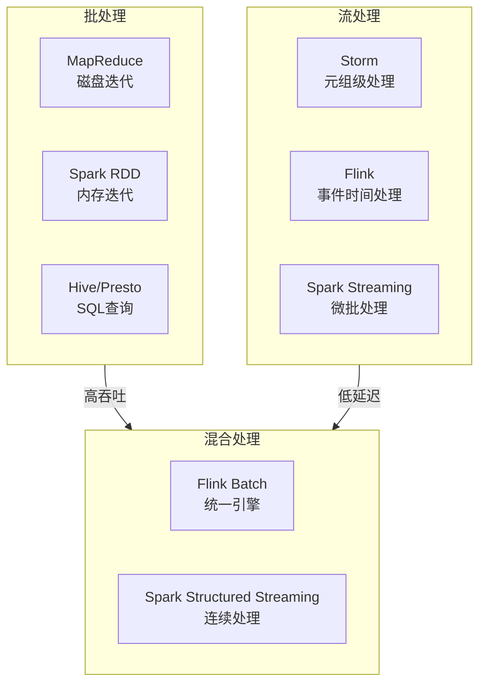
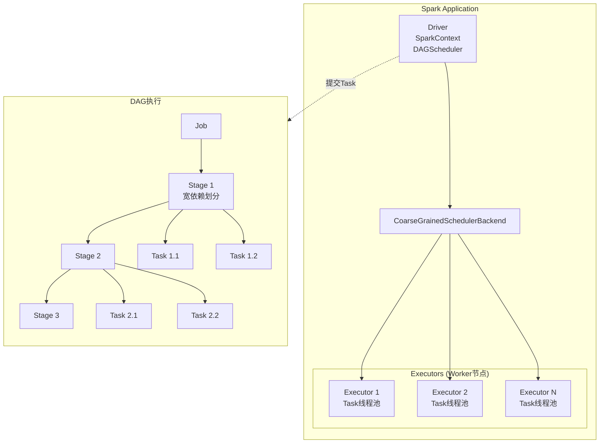
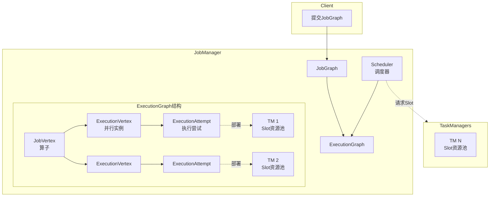

# 04.2 大数据调度

---

📌 **内容摘要**

本文档深入探讨大数据调度的核心原理和关键方法。内容涵盖分布式调度领域的主要知识点，包括调度, 资源分配, 一致性, 共识算法等关键主题。适合具备相关基础的学习者进行深入研究。

**关键词**: 调度, 资源分配, 分布式调度, 一致性, 共识算法, 任务调度, 分布式系统

📚 **学习目标**

- 深入理解大数据调度的理论体系和形式化方法
- 能够进行相关定理的形式化证明
- 能够分析和实现相关算法

🎯 **难度级别**: 高级

⏱️ **预计阅读时间**: 20分钟

**前置知识**: 该领域的中级知识, 形式化方法基础, 算法与数据结构

---


---

## 04.2.1 大数据调度特征

### 04.2.1.1 计算模式对比



### 04.2.1.2 调度挑战

| 维度 | 批处理 | 流处理 | 混合处理 |
|------|--------|--------|----------|
| 延迟要求 | 分钟/小时级 | 毫秒/秒级 | 自适应 |
| 资源模式 | 峰值预留 | 持续占用 | 弹性伸缩 |
| 数据依赖 | 静态DAG | 动态流图 | 统一表达 |
| 故障恢复 | 重算分区 | 检查点回放 | 增量恢复 |

---

## 04.2.2 Spark调度

### 04.2.2.1 Spark执行模型



### 04.2.2.2 DAGScheduler实现

```rust
/// Spark DAG调度器
pub struct DAGScheduler {
    /// 运行的Job
    active_jobs: HashMap<JobId, ActiveJob>,
    /// Stage等待表
    waiting_stages: HashSet<StageId>,
    /// 运行中的Stage
    running_stages: HashSet<StageId>,
    /// 失败的Stage
    failed_stages: HashSet<StageId>,
    /// Stage缓存
    stage_cache: HashMap<StageId, Stage>,
    /// 输出提交协调器
    output_committer: OutputCommitCoordinator,
}

#[derive(Debug, Clone)]
pub struct ActiveJob {
    pub id: JobId,
    pub final_stage: StageId,
    pub partitions: Vec<PartitionId>,
    pub listener: JobListener,
    pub num_finished: usize,
}

#[derive(Debug, Clone)]
pub struct Stage {
    pub id: StageId,
    pub rdd: RDDId,
    pub num_tasks: usize,
    pub parents: Vec<StageId>,
    /// 是否为shuffle map stage
    pub is_shuffle_map: bool,
    pub shuffle_dep: Option<ShuffleDependency>,
    /// 任务位置偏好
    pub preferred_locs: HashMap<PartitionId, Vec<TaskLocation>>,
}

impl DAGScheduler {
    /// 提交Job
    pub fn submit_job(&mut self, rdd: RDDId, func: TaskFn, partitions: Vec<PartitionId>,
                      listener: JobListener) -> JobId {
        let job_id = self.next_job_id();

        // 创建final stage
        let final_stage = self.create_result_stage(rdd, func, partitions.clone(), job_id);

        let job = ActiveJob {
            id: job_id,
            final_stage,
            partitions,
            listener,
            num_finished: 0,
        };

        self.active_jobs.insert(job_id, job);

        // 提交stage
        self.submit_stage(final_stage, job_id);

        job_id
    }

    /// 提交Stage
    fn submit_stage(&mut self, stage_id: StageId, job_id: JobId) {
        let stage = self.stage_cache.get(&stage_id).cloned();

        if let Some(stage) = stage {
            // 检查所有父stage是否完成
            let missing_parents: Vec<_> = stage.parents.iter()
                .filter(|&&p| !self.is_stage_completed(p))
                .cloned()
                .collect();

            if missing_parents.is_empty() {
                // 所有依赖满足，提交task
                self.submit_missing_tasks(stage, job_id);
                self.waiting_stages.remove(&stage_id);
                self.running_stages.insert(stage_id);
            } else {
                // 先提交父stage
                self.waiting_stages.insert(stage_id);
                for parent in missing_parents {
                    self.submit_stage(parent, job_id);
                }
            }
        }
    }

    /// 提交缺失的Task
    fn submit_missing_tasks(&mut self, stage: Stage, job_id: JobId) {
        if stage.is_shuffle_map {
            // ShuffleMapStage: 创建ShuffleMapTask
            let tasks: Vec<Box<dyn Task>> = stage.preferred_locs.iter()
                .map(|(part_id, locs)| {
                    Box::new(ShuffleMapTask {
                        stage_id: stage.id,
                        partition: *part_id,
                        rdd: stage.rdd,
                        locs: locs.clone(),
                        dep: stage.shuffle_dep.clone().unwrap(),
                    }) as Box<dyn Task>
                })
                .collect();

            self.submit_tasks(tasks);
        } else {
            // ResultStage: 创建ResultTask
            let job = self.active_jobs.get(&job_id).unwrap();

            let tasks: Vec<Box<dyn Task>> = job.partitions.iter()
                .map(|part_id| {
                    Box::new(ResultTask {
                        stage_id: stage.id,
                        partition: *part_id,
                        rdd: stage.rdd,
                        func: stage.func.clone(),
                        locs: stage.preferred_locs.get(part_id).cloned()
                            .unwrap_or_default(),
                        output_id: job_id,
                    }) as Box<dyn Task>
                })
                .collect();

            self.submit_tasks(tasks);
        }
    }

    /// 处理Task完成
    pub fn handle_task_completion(&mut self, event: CompletionEvent) {
        match event.task.task_type() {
            TaskType::ShuffleMap => {
                self.handle_shuffle_map_completion(event);
            }
            TaskType::Result => {
                self.handle_result_completion(event);
            }
        }
    }

    fn handle_shuffle_map_completion(&mut self, event: CompletionEvent) {
        let stage_id = event.task.stage_id();

        // 更新shuffle map输出位置
        if let Some(result) = event.result.downcast_ref::<MapStatus>() {
            self.map_output_tracker.register_map_output(
                result.shuffle_id,
                event.task.partition(),
                result.clone()
            );
        }

        // 检查stage是否完成
        if self.is_stage_completed(stage_id) {
            self.running_stages.remove(&stage_id);

            // 提交等待该stage的子stage
            let waiting: Vec<_> = self.waiting_stages.iter()
                .filter(|&&s| {
                    self.stage_cache.get(&s)
                        .map(|st| st.parents.contains(&stage_id))
                        .unwrap_or(false)
                })
                .cloned()
                .collect();

            for child in waiting {
                if let Some(job_id) = self.get_job_for_stage(child) {
                    self.submit_stage(child, job_id);
                }
            }
        }
    }

    fn handle_result_completion(&mut self, event: CompletionEvent) {
        let task = event.task.downcast_ref::<ResultTask>().unwrap();

        if let Some(job) = self.active_jobs.get_mut(&task.output_id) {
            job.num_finished += 1;
            job.listener.task_succeeded(event.task.partition(), event.result);

            if job.num_finished == job.partitions.len() {
                // Job完成
                job.listener.job_succeeded();
                self.active_jobs.remove(&task.output_id);
            }
        }
    }

    fn is_stage_completed(&self, stage_id: StageId) -> bool {
        // 简化实现
        !self.running_stages.contains(&stage_id)
            && !self.waiting_stages.contains(&stage_id)
            && !self.failed_stages.contains(&stage_id)
    }
}
```

### 04.2.2.3 TaskScheduler与资源分配

```rust
/// Task调度器
pub struct TaskSchedulerImpl {
    /// 后端调度器
    backend: Box<dyn SchedulerBackend>,
    /// 每个Executor的Task集合
    executor_tasks: HashMap<ExecutorId, HashSet<TaskId>>,
    /// TaskSetManager池
    active_task_sets: Vec<TaskSetManager>,
    /// 根池（层次调度）
    root_pool: Pool,
    /// 延迟调度
    locality_wait: Duration,
}

impl TaskSchedulerImpl {
    /// 资源提供回调
    pub fn resource_offers(&mut self, offers: Vec[WorkerOffer]) -> Vec<TaskDescription> {
        let mut tasks_to_launch = vec![];

        // 按资源排序offer
        let mut sorted_offers = offers;
        sorted_offers.sort_by(|a, b| b.cores.cmp(&a.cores));

        for offer in sorted_offers {
            let available_cores = offer.cores;
            let mut launched_tasks_at_executor = 0;

            // 尝试为每个TaskSet分配Task
            for task_set_mgr in &self.active_task_sets {
                if launched_tasks_at_executor >= available_cores {
                    break;
                }

                // 考虑数据本地性
                let locality_levels = vec![
                    LocalityLevel::Process,
                    LocalityLevel::Node,
                    LocalityLevel::Rack,
                    LocalityLevel::Any,
                ];

                for locality in &locality_levels {
                    let max_locality_tasks = available_cores - launched_tasks_at_executor;

                    let tasks = task_set_mgr.resource_offer(
                        &offer,
                        max_locality_tasks,
                        *locality
                    );

                    for task in tasks {
                        tasks_to_launch.push(TaskDescription {
                            executor_id: offer.executor_id.clone(),
                            task: task,
                        });
                        launched_tasks_at_executor += 1;
                    }
                }
            }
        }

        tasks_to_launch
    }
}

/// TaskSetManager：管理一个Stage的所有Task
pub struct TaskSetManager {
    task_set: TaskSet,
    /// 未完成的Task
    pending_tasks: Vec<Task>,
    /// 成功的Task
    successful: Vec<bool>,
    /// 运行中的Task
    running_tasks: HashSet<TaskId>,
    /// 每个位置偏好的Task索引
    pending_tasks_for_executor: HashMap<ExecutorId, Vec<usize>>,
    pending_tasks_for_host: HashMap<Host, Vec<usize>>,
    pending_tasks_for_rack: HashMap<Rack, Vec<usize>>,
}

impl TaskSetManager {
    /// 资源提供处理
    pub fn resource_offer(&mut self, offer: &WorkerOffer,
                          max_tasks: usize,
                          locality: LocalityLevel) -> Vec<Task> {
        let mut launched = vec![];

        // 根据本地性级别选择Task
        let candidates = match locality {
            LocalityLevel::Process => {
                self.pending_tasks_for_executor.get(&offer.executor_id)
                    .cloned()
                    .unwrap_or_default()
            }
            LocalityLevel::Node => {
                self.pending_tasks_for_host.get(&offer.host)
                    .cloned()
                    .unwrap_or_default()
            }
            LocalityLevel::Rack => {
                self.pending_tasks_for_rack.get(&offer.rack)
                    .cloned()
                    .unwrap_or_default()
            }
            LocalityLevel::Any => {
                (0..self.pending_tasks.len()).collect()
            }
        };

        for idx in candidates.iter().take(max_tasks) {
            if let Some(task) = self.pending_tasks.get(*idx) {
                if !self.running_tasks.contains(&task.id())
                   && !self.successful[task.partition_id()] {
                    launched.push(task.clone());
                    self.running_tasks.insert(task.id());
                }
            }
        }

        launched
    }
}
```

---

## 04.2.3 Flink调度

### 04.2.3.1 Flink执行模型



### 04.2.3.2 Slot分配与共享

```rust
/// Flink Slot调度
pub struct SlotPool {
    /// 可用Slot
    available_slots: Vec<AllocatedSlot>,
    /// 已分配Slot
    allocated_slots: HashMap<AllocationId, AllocatedSlot>,
    /// 等待Slot的请求
    pending_requests: VecDeque<PendingRequest>,
}

pub struct SlotSharingManager {
    /// Slot共享组
    groups: HashMap<SlotSharingGroupId, SlotSharingGroup>,
}

pub struct SlotSharingGroup {
    id: SlotSharingGroupId,
    /// 该组的Slot资源
    slots: Vec<Slot>,
    /// 分配的ExecutionVertex
    assignments: HashMap<ExecutionVertexId, Slot>,
    /// 兼容性约束
    slot_profile: ResourceProfile,
}

impl SlotSharingManager {
    /// 为ExecutionGraph分配Slot
    pub fn allocate_slots(&mut self, graph: &mut ExecutionGraph,
                          slot_provider: &mut dyn SlotProvider)
        -> Result<(), SlotAllocationException> {

        // 按拓扑排序分配
        let sorted_vertices = graph.get_vertices_topologically();

        for vertex in sorted_vertices {
            let group_id = vertex.get_slot_sharing_group();

            if let Some(group) = self.groups.get_mut(&group_id) {
                // 尝试在现有Slot中分配
                if let Some(slot) = self.find_slot_in_group(group, &vertex) {
                    self.assign_slot_to_vertex(&mut vertex, slot)?;
                } else {
                    // 请求新Slot
                    let new_slot = slot_provider.allocate_slot(
                        group.slot_profile.clone()
                    )?;
                    group.slots.push(new_slot.clone());
                    self.assign_slot_to_vertex(&mut vertex, new_slot)?;
                }
            }
        }

        Ok(())
    }

    fn find_slot_in_group(&self, group: &SlotSharingGroup,
                          vertex: &ExecutionVertex) -> Option<Slot> {
        // 检查现有Slot是否有容量
        for slot in &group.slots {
            if slot.get_available_cores() >= vertex.get_resource_requirement().cores {
                // 检查亲和性约束
                if self.check_affinity(slot, vertex) {
                    return Some(slot.clone());
                }
            }
        }
        None
    }
}

/// Pipelined Region调度（故障恢复单元）
pub struct PipelinedRegion {
    vertices: Vec<ExecutionVertexId>,
    required_resources: ResourceProfile,
}

impl Scheduler {
    /// 基于Pipelined Region的调度
    pub fn allocate_resources_for_regions(&mut self,
                                          regions: Vec<PipelinedRegion>)
        -> Result<(), ScheduleException> {

        // 按依赖顺序调度Region
        let sorted_regions = self.sort_regions_by_dependency(regions);

        for region in sorted_regions {
            // 批量请求资源
            let slots = self.slot_provider.allocate_slots(
                region.required_resources,
                region.vertices.len()
            )?;

            // 并行部署Region内所有Vertex
            let deployments: Vec<_> = region.vertices.iter()
                .zip(slots.iter())
                .map(|(vertex_id, slot)| {
                    self.create_deployment(vertex_id, slot)
                })
                .collect();

            // 并行执行部署
            self.deploy_all(deployments).await?;
        }

        Ok(())
    }
}
```

---

## 04.2.4 C++伪代码：大数据调度框架

```cpp
#pragma once
#include <vector>
#include <memory>
#include <functional>
#include <unordered_map>

namespace bigdata {
namespace scheduling {

// 任务定义
template<typename T>
struct Task {
    int id;
    int partition;
    std::vector<int> dependencies; // 前置任务ID
    T data; // 任务数据
    int attempt_number = 0;
    TaskState state = TaskState::PENDING;
};

enum class TaskState {
    PENDING,
    RUNNING,
    SUCCESS,
    FAILED,
    KILLED
};

// Stage定义
template<typename T>
struct Stage {
    int id;
    StageType type;
    std::vector<Task<T>> tasks;
    std::vector<int> parent_stages;
    std::function<void(const TaskResult&)> completion_callback;
};

enum class StageType {
    MAP,
    REDUCE,
    SHUFFLE_MAP,
    RESULT
};

// DAG调度器
template<typename T>
class DAGScheduler {
public:
    using TaskType = Task<T>;
    using StageType = Stage<T>;

    void submit_job(const std::vector<StageType>& stages,
                    const JobListener& listener) {
        int job_id = next_job_id_++;

        // 构建stage依赖图
        for (const auto& stage : stages) {
            stage_cache_[stage.id] = stage;
        }

        // 找到最终stage
        int final_stage = find_final_stage(stages);

        ActiveJob job{job_id, final_stage, listener};
        active_jobs_[job_id] = job;

        // 提交最终stage
        submit_stage(final_stage, job_id);
    }

    void handle_task_completion(int task_id, const TaskResult& result) {
        auto& task = task_cache_[task_id];
        task.state = result.success ? TaskState::SUCCESS : TaskState::FAILED;

        int stage_id = task_to_stage_[task_id];

        if (result.success) {
            stage_task_completions_[stage_id]++;

            // 检查stage是否完成
            if (is_stage_complete(stage_id)) {
                on_stage_completion(stage_id);
            }
        } else {
            // 重试或失败处理
            handle_task_failure(task, result);
        }
    }

private:
    int next_job_id_ = 0;
    std::unordered_map<int, StageType> stage_cache_;
    std::unordered_map<int, ActiveJob> active_jobs_;
    std::unordered_map<int, TaskType> task_cache_;
    std::unordered_map<int, int> task_to_stage_;
    std::unordered_map<int, int> stage_task_completions_;
    std::unordered_set<int> completed_stages_;

    void submit_stage(int stage_id, int job_id) {
        auto& stage = stage_cache_[stage_id];

        // 检查父stage是否完成
        for (int parent : stage.parent_stages) {
            if (!is_stage_complete(parent)) {
                waiting_stages_.insert(stage_id);
                return;
            }
        }

        // 提交所有任务
        for (auto& task : stage.tasks) {
            submit_task(task);
        }

        running_stages_.insert(stage_id);
    }

    void submit_task(const TaskType& task) {
        // 发送到TaskScheduler
        task_scheduler_->submit(task);
    }

    bool is_stage_complete(int stage_id) {
        auto& stage = stage_cache_[stage_id];
        return stage_task_completions_[stage_id] >= stage.tasks.size();
    }

    void on_stage_completion(int stage_id) {
        running_stages_.erase(stage_id);
        completed_stages_.insert(stage_id);

        // 触发子stage
        for (int waiting : waiting_stages_) {
            auto& stage = stage_cache_[waiting];
            if (std::all_of(stage.parent_stages.begin(),
                           stage.parent_stages.end(),
                           this { return completed_stages_.count(p); })) {
                waiting_stages_.erase(waiting);
                if (auto job_id = get_job_for_stage(waiting)) {
                    submit_stage(waiting, *job_id);
                }
            }
        }
    }

    void handle_task_failure(TaskType& task, const TaskResult& result) {
        if (task.attempt_number < MAX_TASK_ATTEMPTS) {
            task.attempt_number++;
            submit_task(task);
        } else {
            // Stage失败
            fail_stage(task_to_stage_[task.id]);
        }
    }

    std::unique_ptr<TaskScheduler> task_scheduler_;
    std::unordered_set<int> waiting_stages_;
    std::unordered_set<int> running_stages_;
};

// 流处理调度器
template<typename T>
class StreamScheduler {
public:
    struct Operator {
        int id;
        int parallelism;
        ResourceProfile resources;
        std::vector<int> upstream;
        std::vector<int> downstream;
    };

    // 部署流拓扑
    void deploy_topology(const std::vector<Operator>& operators,
                         SlotProvider& provider) {
        // 识别Pipelined Region
        auto regions = compute_pipelined_regions(operators);

        // 按拓扑顺序部署
        for (auto& region : topological_sort(regions)) {
            deploy_region(region, provider);
        }
    }

private:
    struct PipelinedRegion {
        std::vector<int> operators;
        ResourceProfile total_resources;
    };

    std::vector<PipelinedRegion> compute_pipelined_regions(
        const std::vector<Operator>& operators
    ) {
        // 根据连接类型划分Region
        // 粗粒度: blocking shuffle划分
        // 细粒度: pipelined连接在一个Region
        std::vector<PipelinedRegion> regions;
        // 实现省略...
        return regions;
    }

    void deploy_region(const PipelinedRegion& region,
                       SlotProvider& provider) {
        // 批量申请slot
        auto slots = provider.allocate_slots(region.total_resources,
                                              region.operators.size());

        // 并行部署
        for (size_t i = 0; i < region.operators.size(); ++i) {
            deploy_operator(region.operators[i], slots[i]);
        }
    }
};

} // namespace scheduling
} // namespace bigdata
```

---

## 04.2.5 总结

| 框架 | 调度粒度 | 核心特性 | 优化重点 |
|------|----------|----------|----------|
| Spark | Stage-Task | DAG调度、内存迭代 | 数据本地性 |
| Flink | OperatorChain | 流批一体、事件时间 | 延迟与吞吐平衡 |
| Storm | Bolt-Spout | 低延迟、至少一次 | 故障快速恢复 |
| Ray | Task-Actor | 分布式Actor、混合调度 | 通用分布式计算 |

**延伸阅读**:

- [04.1 集群调度](./04.1_集群调度.md) - Kubernetes、YARN
- [04.3 跨层调度协同](./04.3_跨层调度协同.md) - 端到端优化

---

## 📋 前置知识

- [04.1 集群调度](../04_分布式调度/04.1_集群调度.md)

---

## 📚 延伸阅读

- [04.3 跨层调度协同](../04_分布式调度/04.3_跨层调度协同.md)
- [04.1 集群调度](../04_分布式调度/04.1_集群调度.md)
