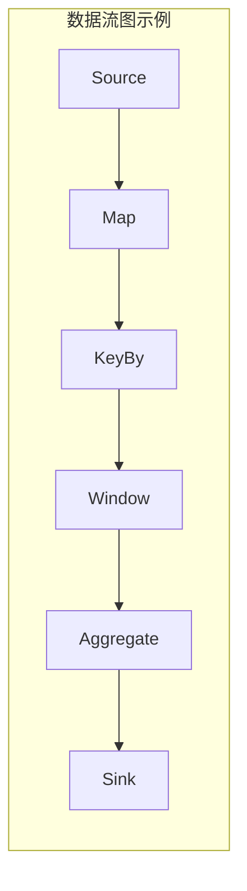
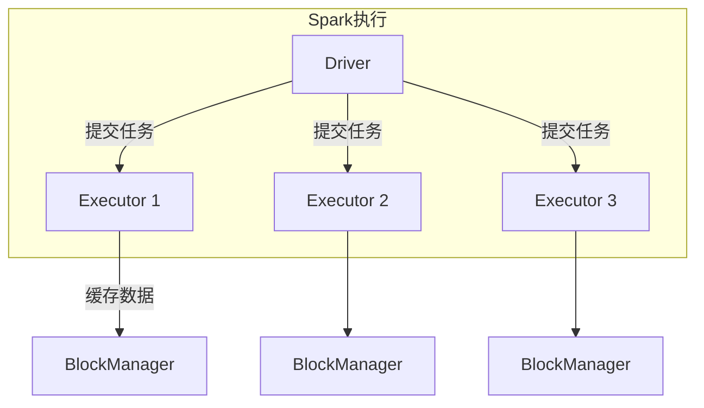
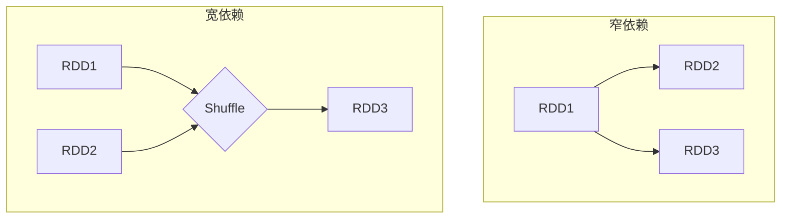
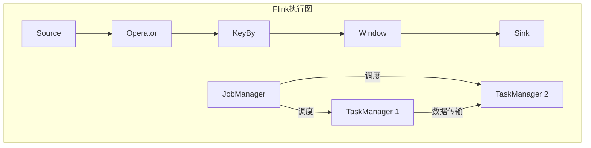
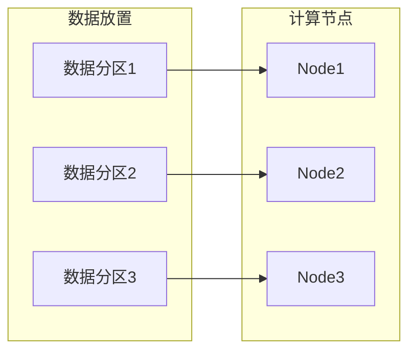
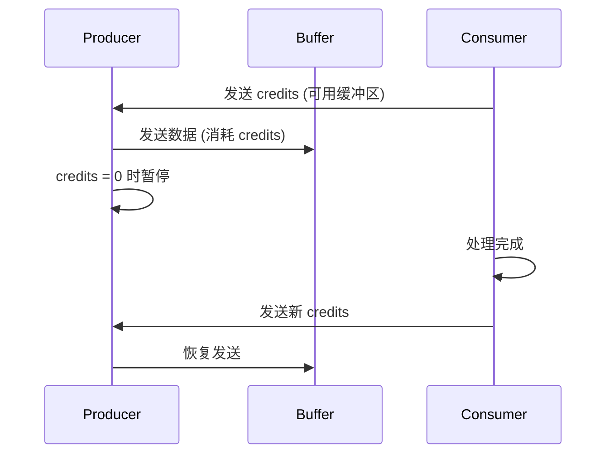

# 04.2 数据流调度

> **形式科学 · 调度系统系列**
> 上一篇: [04.1 集群调度](04.1_集群调度.md) | 下一篇: [04.3 任务调度](04.3_任务调度.md)

---

## 1. 数据流处理模型

### 1.1 批处理 vs 流处理


| 特性 | 批处理 (Spark) | 流处理 (Flink) |
|------|----------------|----------------|
| 数据粒度 | 大批量 | 单条/微批 |
| 延迟 | 分钟-小时 | 毫秒-秒 |
| 吞吐 | TB级 | GB级 |
| 容错 | 检查点 | 状态快照 |
| 适用 | 离线分析 | 实时计算 |

### 1.2 数据流图模型

**定义 1.1（数据流图）**: 有向图 $G = (V, E)$，其中：

- $V$: 算子（Operator）集合
- $E$: 数据流（Data Stream）集合



---

## 2. Spark 调度

### 2.1 Spark 执行模型



**关键概念**:

| 概念 | 说明 | 调度单位 |
|------|------|----------|
| Application | 用户程序 | JVM进程 |
| Job | 动作触发 | DAGScheduler |
| Stage | 宽依赖划分 | TaskScheduler |
| Task | 最小执行单元 | Executor |

### 2.2 DAG 调度

**宽依赖 vs 窄依赖**:



**阶段划分算法**:

```rust
// Rust: Spark阶段划分简化实现
use std::collections::{HashMap, HashSet, VecDeque};

#[derive(Debug, Clone)]
pub enum Dependency {
    Narrow,  // 一对一/多对一，无shuffle
    Wide,    // 多对多，需要shuffle
}

#[derive(Debug, Clone)]
pub struct RDD {
    pub id: usize,
    pub parents: Vec<(usize, Dependency)>,
}

#[derive(Debug)]
pub struct Stage {
    pub id: usize,
    pub rdds: Vec<usize>,
    pub shuffle_deps: Vec<usize>,  // 依赖的前置shuffle阶段
}

pub struct DAGScheduler {
    rdds: HashMap<usize, RDD>,
}

impl DAGScheduler {
    // 划分阶段
    pub def divide_into_stages(&self, final_rdd: usize) -> Vec<Stage> {
        let mut stages = Vec::new();
        let mut visited = HashSet::new();
        let mut stage_id = 0;

        // 使用栈进行DFS遍历
        let mut stack = vec![(final_rdd, false)];

        while let Some((rdd_id, processed)) = stack.pop() {
            if processed {
                // 创建阶段
                let stage = self.create_stage(&mut visited, rdd_id, stage_id);
                stages.push(stage);
                stage_id += 1;
                continue;
            }

            if visited.contains(&rdd_id) {
                continue;
            }

            stack.push((rdd_id, true));  // 标记后续处理

            if let Some(rdd) = self.rdds.get(&rdd_id) {
                for (parent_id, dep) in &rdd.parents {
                    match dep {
                        Dependency::Narrow => {
                            // 窄依赖，继续遍历
                            if !visited.contains(parent_id) {
                                stack.push((*parent_id, false));
                            }
                        }
                        Dependency::Wide => {
                            // 宽依赖，父RDD属于不同阶段
                            if !visited.contains(parent_id) {
                                stack.push((*parent_id, false));
                            }
                        }
                    }
                }
            }
        }

        stages.reverse();  // 按执行顺序排列
        stages
    }

    fn create_stage(&self, visited: &mut HashSet<usize>,
                   rdd_id: usize, stage_id: usize) -> Stage {
        let mut stage_rdds = vec![rdd_id];
        let mut shuffle_deps = Vec::new();

        // 收集所有窄依赖的RDD
        let mut queue = VecDeque::new();
        queue.push_back(rdd_id);
        visited.insert(rdd_id);

        while let Some(current) = queue.pop_front() {
            if let Some(rdd) = self.rdds.get(&current) {
                for (parent_id, dep) in &rdd.parents {
                    match dep {
                        Dependency::Narrow => {
                            if !visited.contains(parent_id) {
                                visited.insert(*parent_id);
                                stage_rdds.push(*parent_id);
                                queue.push_back(*parent_id);
                            }
                        }
                        Dependency::Wide => {
                            shuffle_deps.push(*parent_id);
                        }
                    }
                }
            }
        }

        Stage {
            id: stage_id,
            rdds: stage_rdds,
            shuffle_deps,
        }
    }
}
```

### 2.3 数据局部性调度

| 级别 | 延迟 | 优先级 |
|------|------|--------|
| PROCESS_LOCAL | ~1ms | 最高 |
| NODE_LOCAL | ~5ms | 高 |
| NO_PREF | ~10ms | 中 |
| RACK_LOCAL | ~50ms | 低 |
| ANY | ~100ms | 最低 |

---

## 3. Flink 调度

### 3.1 流处理调度模型



### 3.2 检查点与状态管理

**Chandy-Lamport 算法**:

1. Checkpoint Coordinator 向所有 Source 发送 barrier
2. Source 将 barrier 注入数据流
3. 算子接收 barrier 后快照状态
4. 所有算子完成快照后，检查点完成

```haskell
-- Haskell: 检查点屏障流
data CheckpointBarrier = CheckpointBarrier {
    checkpointId :: Int,
    timestamp :: Int64
} deriving (Show)

data StreamElement a
    = DataElement a
    | Barrier CheckpointBarrier
    | Watermark Int64
    deriving (Show)

-- 检查点对齐
alignCheckpoints :: [StreamElement a] -> [StreamElement a] -> ([StreamElement a], [StreamElement a])
alignCheckpoints left right =
    let leftBarrier = findBarrier left
        rightBarrier = findBarrier right
    in case (leftBarrier, rightBarrier) of
        (Just b1, Just b2) | checkpointId b1 == checkpointId b2 ->
            -- 对齐完成，触发快照
            ([], [])
        _ ->
            -- 继续缓冲
            (left, right)

findBarrier :: [StreamElement a] -> Maybe CheckpointBarrier
cindBarrier [] = Nothing
findBarrier (Barrier b : _) = Just b
findBarrier (_ : xs) = findBarrier xs
```

### 3.3 时间语义

| 时间类型 | 定义 | 适用场景 |
|----------|------|----------|
| Event Time | 数据产生时间 | 乱序数据 |
| Processing Time | 处理时间 | 低延迟 |
| Ingestion Time | 摄入时间 | 简单场景 |

**Watermark 策略**:

$$\text{Watermark}(t) = \max(event\_time) - \text{max\_out\_of\_orderness}$$

---

## 4. 数据局部性优化

### 4.1 数据放置策略



**分区策略**:

| 策略 | 说明 | 适用 |
|------|------|------|
| Hash | 哈希分区 | 数据倾斜少 |
| Range | 范围分区 | 有序数据 |
| Broadcast | 广播 | 小表Join |
| Custom | 自定义 | 特定模式 |

### 4.2 Rust 实现：分区器

```rust
// Rust: 数据分区策略
pub trait Partitioner {
    fn partition(&self, key: &Key, num_partitions: usize) -> usize;
}

pub struct HashPartitioner;

impl Partitioner for HashPartitioner {
    fn partition(&self, key: &Key, num_partitions: usize) -> usize {
        let hash = self.compute_hash(key);
        (hash as usize) % num_partitions
    }
}

impl HashPartitioner {
    fn compute_hash(&self, key: &Key) -> u64 {
        use std::collections::hash_map::DefaultHasher;
        use std::hash::{Hash, Hasher};

        let mut hasher = DefaultHasher::new();
        key.hash(&mut hasher);
        hasher.finish()
    }
}

pub struct RangePartitioner {
    boundaries: Vec<Key>,
}

impl Partitioner for RangePartitioner {
    fn partition(&self, key: &Key, num_partitions: usize) -> usize {
        // 二分查找确定分区
        match self.boundaries.binary_search(key) {
            Ok(idx) => idx.min(num_partitions - 1),
            Err(idx) => idx.min(num_partitions - 1),
        }
    }
}

pub struct LocalityAwarePartitioner {
    data_locations: HashMap<Key, Vec<NodeId>>,
    node_load: HashMap<NodeId, usize>,
}

impl Partitioner for LocalityAwarePartitioner {
    fn partition(&self, key: &Key, num_partitions: usize) -> usize {
        // 优先选择有数据本地性的节点
        if let Some(nodes) = self.data_locations.get(key) {
            // 选择负载最低的本地节点
            let best_node = nodes.iter()
                .min_by_key(|n| self.node_load.get(*n).unwrap_or(&0))
                .cloned();

            if let Some(node) = best_node {
                return self.node_to_partition(&node, num_partitions);
            }
        }

        // 回退到哈希分区
        HashPartitioner.partition(key, num_partitions)
    }
}

pub type Key = Vec<u8>;
pub type NodeId = String;
```

---

## 5. 背压与流量控制

### 5.1 背压机制

**问题**: 生产者速度 > 消费者速度

**解决方案**:

| 机制 | 实现 | 延迟 |
|------|------|------|
| 阻塞队列 | 填满后阻塞 | 高 |
| 令牌桶 | 速率限制 | 中 |
| 动态缓冲区 | Credit-based | 低 |

### 5.2 Credit-based 流控



---

## 6. 状态管理

### 6.1 状态后端

| 后端 | 存储 | 适用 |
|------|------|------|
| Memory | 堆内存 | 小状态、测试 |
| FsStateBackend | 本地磁盘+异步上传 | 大状态 |
| RocksDB | 本地RocksDB | 超大状态 |
| Incremental | 增量快照 | 快速恢复 |

### 6.2 状态一致性

- **AT_LEAST_ONCE**: 至少一次
- **EXACTLY_ONCE**: 精确一次（两阶段提交）

---

## 7. Lean 形式化：流处理正确性

```lean4
-- Lean: 流处理正确性
structure StreamElement (α : Type) where
  value : α
  timestamp : Nat
  watermark : Nat

def isLate [LE α] (e : StreamElement α) (currentWM : Nat) : Bool :=
  e.timestamp > currentWM

-- 窗口操作正确性
structure Window where
  start : Nat
  end : Nat
  elements : List (StreamElement α)

def windowContains (w : Window) (e : StreamElement α) : Bool :=
  w.start ≤ e.timestamp ∧ e.timestamp < w.end

-- 窗口计算结果正确性
def windowResultCorrect
    (input : List (StreamElement α))
    (window : Window)
    (result : β)
    (f : List α → β) : Prop :=
  let windowElements := input.filter (λ e => windowContains window e)
  result = f (windowElements.map (λ e => e.value))

-- 检查点一致性
def checkpointConsistent
    (states : List (Nat × σ))  -- (checkpointId, state)
    (messages : List (StreamElement α)) : Prop :=
  -- 所有barrier之前的消息都已处理
  -- 所有barrier之后的消息都未处理
  ∀ cp, (cp, _) ∈ states →
    ∃ barrierTime,
      (∀ m ∈ messages, m.timestamp < barrierTime → m.processed) ∧
      (∀ m ∈ messages, m.timestamp ≥ barrierTime → ¬m.processed)
```

---

## 8. 性能对比

### 8.1 Spark vs Flink

| 特性 | Spark Streaming | Flink |
|------|-----------------|-------|
| 处理模型 | 微批 | 原生流 |
| 延迟 | 秒级 | 毫秒级 |
| 状态管理 | RDD持久化 | 分布式快照 |
| 事件时间 | 支持 | 原生支持 |
| 容错 | 检查点 | 轻量级检查点 |

---

## 9. 参考文献

1. Zaharia, M., et al. "Apache Spark: A unified engine for big data processing." _CACM_ 2016.
2. Carbone, P., et al. "Apache Flink: Stream and batch processing in a single engine." _IEEE Data Engineering Bulletin_ 2015.
3. Akidau, T., et al. "The dataflow model: A practical approach to balancing correctness, latency, and cost in massive-scale, unbounded, out-of-order data processing." _VLDB_ 2015.
4. Chandy, K. M., & Lamport, L. "Distributed snapshots: Determining global states of distributed systems." _ACM TOCS_ 1985.

---

## 10. 相关文档

- [04.1 集群调度](04.1_集群调度.md) - YARN、Mesos、Kubernetes
- [04.3 任务调度](04.3_任务调度.md) - DAG调度、依赖管理、容错
- [04.4 边缘调度](04.4_边缘调度.md) - 移动边缘、IoT、5G调度
- [02.2 内存调度](../02_硬件调度/02.2_内存调度.md) - 缓存替换、预取
