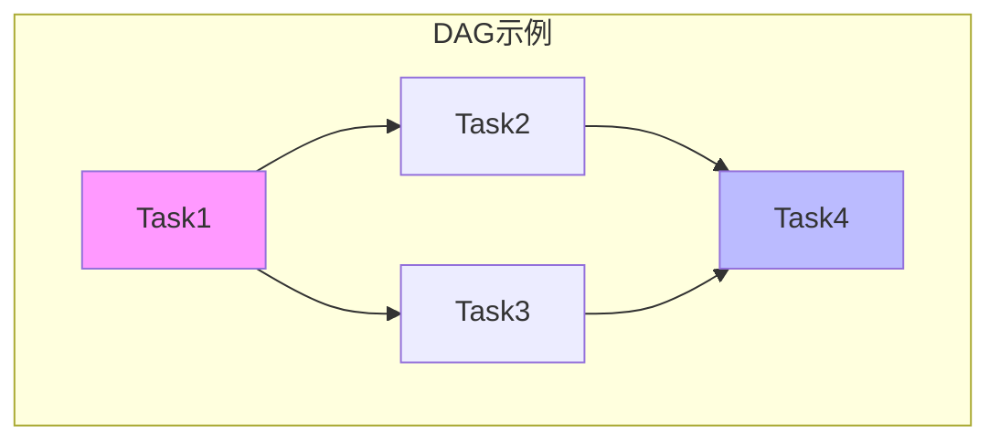
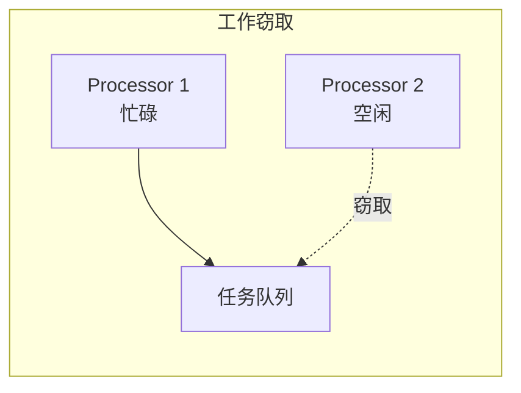

# 04.3 任务调度

---

📌 **内容摘要**

本文档深入探讨任务调度的核心原理和关键方法。内容涵盖分布式调度领域的主要知识点，包括任务调度, 调度, 资源分配等关键主题。适合具备相关基础的学习者进行深入研究。

**关键词**: 任务调度, 分布式调度, 调度, 资源分配

📚 **学习目标**
- 深入理解任务调度的理论体系和形式化方法
- 能够进行相关定理的形式化证明
- 能够分析和实现相关算法

🎯 **难度级别**: 高级

⏱️ **预计阅读时间**: 15分钟

**前置知识**: 该领域的中级知识, 形式化方法基础, 算法与数据结构

---


> **形式科学 · 调度系统系列**
> 上一篇: [04.2 数据流调度](04.2_数据流调度.md) | 下一篇: [04.4 边缘调度](04.4_边缘调度.md)

---

## 1. DAG 调度基础

### 1.1 任务依赖模型

**定义 1.1（DAG）**: 有向无环图 $G = (V, E)$，其中：

- $V$: 任务集合
- $E$: 依赖关系（边 $u \to v$ 表示任务 $u$ 必须在 $v$ 之前完成）



**关键路径**:

$$CP = \max_{p \in \text{paths}} \sum_{v \in p} w(v)$$

### 1.2 DAG 调度复杂性

| 问题 | 约束 | 复杂性 |
|------|------|--------|
| $P|prec|C_{\max}$ | 无限处理器 | P (列表调度) |
| $P|prec|C_{\max}$ | 有限处理器 | NP-hard |
| $P|tree|C_{\max}$ | 树形结构 | P (Hu算法) |
| $P|intree|C_{\max}$ | 内向树 | P |

---

## 2. 列表调度算法

### 2.1 优先级定义

**定义 2.1（优先级）**: 任务优先级的计算方式：

| 优先级 | 公式 | 特点 |
|--------|------|------|
| **b-level** | 到出口的最长路径 | 乐观估计 |
| **t-level** | 从入口的最长路径 | 最早开始 |
| **SLL** | b-level + t-level | 综合考虑 |
| **HLF** | 最高层优先 | 树形DAG |

### 2.2 列表调度算法框架

```rust
// Rust: 列表调度框架
use std::collections::{HashMap, HashSet, VecDeque};

#[derive(Debug, Clone)]
pub struct Task {
    pub id: usize,
    pub duration: u64,
    pub predecessors: Vec<usize>,
    pub successors: Vec<usize>,
}

pub struct DAG {
    pub tasks: HashMap<usize, Task>,
}

impl DAG {
    // 计算b-level（到出口的最长路径）
    pub fn compute_b_level(&self) -> HashMap<usize, u64> {
        let mut b_level = HashMap::new();
        let mut visited = HashSet::new();

        for (&id, task) in &self.tasks {
            if task.successors.is_empty() {
                // 出口任务
                b_level.insert(id, task.duration);
                visited.insert(id);
            }
        }

        // 拓扑排序逆序计算
        let mut changed = true;
        while changed {
            changed = false;
            for (&id, task) in &self.tasks {
                if visited.contains(&id) {
                    continue;
                }

                // 检查所有后继是否已计算
                let all_succ_computed = task.successors.iter()
                    .all(|s| visited.contains(s));

                if all_succ_computed {
                    let max_succ_b_level = task.successors.iter()
                        .map(|s| b_level.get(s).unwrap_or(&0))
                        .max()
                        .unwrap_or(&0);

                    b_level.insert(id, task.duration + max_succ_b_level);
                    visited.insert(id);
                    changed = true;
                }
            }
        }

        b_level
    }
}

pub struct ListScheduler {
    dag: DAG,
    num_processors: usize,
}

impl ListScheduler {
    pub fn schedule(&self) -> Schedule {
        let b_level = self.dag.compute_b_level();

        // 按b-level降序排序
        let mut task_list: Vec<_> = self.dag.tasks.keys()
            .map(|&id| (id, *b_level.get(&id).unwrap_or(&0)))
            .collect();
        task_list.sort_by(|a, b| b.1.cmp(&a.1));

        let mut schedule = Schedule::new(self.num_processors);
        let mut completed = HashSet::new();
        let mut in_progress: HashMap<usize, (usize, u64)> = HashMap::new(); // task -> (processor, end_time)
        let mut current_time: u64 = 0;

        while completed.len() < self.dag.tasks.len() {
            // 检查完成的任务
            let mut just_completed = Vec::new();
            for (&task_id, &(proc, end_time)) in &in_progress {
                if end_time <= current_time {
                    just_completed.push(task_id);
                    completed.insert(task_id);
                    schedule.add_task(task_id, proc, end_time - self.dag.tasks[&task_id].duration, end_time);
                }
            }

            for task_id in just_completed {
                in_progress.remove(&task_id);
            }

            // 找到就绪任务
            let ready_tasks: Vec<_> = task_list.iter()
                .filter(|(id, _)| !completed.contains(id) && !in_progress.contains_key(id))
                .filter(|(id, _)| {
                    self.dag.tasks[id].predecessors.iter()
                        .all(|p| completed.contains(p))
                })
                .map(|(id, priority)| (*id, *priority))
                .collect();

            // 分配到可用处理器
            let available_procs: Vec<_> = (0..self.num_processors)
                .filter(|p| !in_progress.values().any(|(proc, _)| proc == p))
                .collect();

            for (task_id, _) in ready_tasks.iter().take(available_procs.len()) {
                if let Some(&proc) = available_procs.get(in_progress.len()) {
                    let duration = self.dag.tasks[task_id].duration;
                    in_progress.insert(*task_id, (proc, current_time + duration));
                }
            }

            // 推进时间
            if let Some(&(_, next_time)) = in_progress.values().min_by_key(|(_, t)| *t) {
                current_time = next_time;
            } else if completed.len() < self.dag.tasks.len() {
                current_time += 1;  // 空闲时推进
            }
        }

        schedule
    }
}

#[derive(Debug)]
pub struct Schedule {
    pub processor_count: usize,
    pub assignments: Vec<(usize, usize, u64, u64)>, // (task, processor, start, end)
    pub makespan: u64,
}

impl Schedule {
    fn new(count: usize) -> Self {
        Self {
            processor_count: count,
            assignments: vec![],
            makespan: 0,
        }
    }

    fn add_task(&mut self, task: usize, processor: usize, start: u64, end: u64) {
        self.assignments.push((task, processor, start, end));
        self.makespan = self.makespan.max(end);
    }
}
```

---

## 3. 动态任务调度

### 3.1 工作窃取

**定义 3.1（工作窃取）**: 空闲处理器从忙碌处理器的队列窃取任务。



### 3.2 任务窃取策略

| 策略 | 目标队列 | 开销 | 局部性 |
|------|----------|------|--------|
| 随机 | 随机选择 | 低 | 差 |
| 最近邻居 | 拓扑近邻 | 中 | 中 |
| 全局信息 | 最忙队列 | 高 | 差 |

---

## 4. 容错调度

### 4.1 故障模型

| 故障类型 | 概率 | 恢复策略 |
|----------|------|----------|
| 任务失败 | 高 | 重试 |
| 节点故障 | 中 | 迁移 |
| 网络分区 | 低 | 检查点 |

### 4.2 检查点策略

**定期检查点**:

$$\text{最优间隔} = \sqrt{2 \cdot \delta \cdot M}$$

其中 $\delta$ 为检查点开销，$M$ 为平均故障间隔。

### 4.3 Haskell 实现：容错调度

```haskell
-- Haskell: 容错任务调度
module Distributed.FaultTolerance where

import Data.Map (Map)
import qualified Data.Map as Map
import Data.Set (Set)
import qualified Data.Set as Set
import Data.Time (UTCTime, diffUTCTime)

type TaskId = String
type NodeId = String

data TaskStatus
    = Pending
    | Running NodeId UTCTime  -- 运行节点，开始时间
    | Completed UTCTime
    | Failed String
    | Retrying Int            -- 重试次数
    deriving (Show)

data Checkpoint = Checkpoint {
    cpTaskId :: TaskId,
    cpTime :: UTCTime,
    cpState :: TaskState
} deriving (Show)

data TaskState = TaskState {
    inputs :: Map String Value,
    intermediate :: Value
} deriving (Show)

data Value = IntValue Int | StringValue String | ListValue [Value]
    deriving (Show)

data FaultTolerantScheduler = FaultTolerantScheduler {
    maxRetries :: Int,
    checkpointInterval :: Double,  -- 秒
    taskStatus :: Map TaskId TaskStatus,
    checkpoints :: Map TaskId [Checkpoint]
}

-- 检查点创建
createCheckpoint :: TaskId -> TaskState -> IO Checkpoint
createCheckpoint taskId state = do
    now <- getCurrentTime
    return $ Checkpoint taskId now state

-- 任务失败处理
handleTaskFailure :: FaultTolerantScheduler -> TaskId -> String -> IO FaultTolerantScheduler
handleTaskFailure scheduler taskId error = do
    let currentStatus = Map.lookup taskId (taskStatus scheduler)

    case currentStatus of
        Just (Retrying n) | n >= maxRetries scheduler -> do
            -- 超过重试次数
            return $ scheduler {
                taskStatus = Map.insert taskId (Failed error) (taskStatus scheduler)
            }

        _ -> do
            -- 重试
            let retryCount = case currentStatus of
                    Just (Retrying n) -> n + 1
                    _ -> 1

            -- 查找最近检查点
            let lastCp = case Map.lookup taskId (checkpoints scheduler) of
                    Just cps | not (null cps) -> Just (last cps)
                    _ -> Nothing

            putStrLn $ "Retrying task " ++ taskId ++ " (attempt " ++ show retryCount ++ ")"

            case lastCp of
                Just cp -> do
                    putStrLn $ "Resuming from checkpoint at " ++ show (cpTime cp)
                    -- 从检查点恢复
                    return $ scheduler {
                        taskStatus = Map.insert taskId (Retrying retryCount) (taskStatus scheduler)
                    }
                Nothing -> do
                    -- 从头开始
                    return $ scheduler {
                        taskStatus = Map.insert taskId (Retrying retryCount) (taskStatus scheduler)
                    }

-- 检查点调度
scheduleCheckpoint :: FaultTolerantScheduler -> TaskId -> IO FaultTolerantScheduler
scheduleCheckpoint scheduler taskId = do
    now <- getCurrentTime

    -- 检查是否需要创建检查点
    let shouldCheckpoint = case Map.lookup taskId (checkpoints scheduler) of
            Just (cp:_) ->
                let elapsed = diffUTCTime now (cpTime cp)
                in realToFrac elapsed > checkpointInterval scheduler
            Nothing -> True

    if shouldCheckpoint
        then do
            -- 创建检查点
            let state = TaskState Map.empty (IntValue 0)  -- 简化
            cp <- createCheckpoint taskId state

            let cps = Map.findWithDefault [] taskId (checkpoints scheduler)
            return $ scheduler {
                checkpoints = Map.insert taskId (cps ++ [cp]) (checkpoints scheduler)
            }
        else return scheduler
```

---

## 5. 依赖管理

### 5.1 依赖类型

| 类型 | 语义 | 示例 |
|------|------|------|
| 完成依赖 | 任务完成后触发 | 数据处理 |
| 启动依赖 | 任务启动时触发 | 资源准备 |
| 输出依赖 | 数据产出依赖 | 文件传递 |
| 外部依赖 | 外部事件触发 | 定时任务 |

### 5.2 依赖解析

```rust
// Rust: 依赖解析与拓扑排序
pub fn topological_sort(dag: &DAG) -> Result<Vec<usize>, CycleError> {
    let mut in_degree: HashMap<usize, usize> = HashMap::new();
    let mut queue = VecDeque::new();
    let mut result = Vec::new();

    // 计算入度
    for (&id, task) in &dag.tasks {
        let degree = task.predecessors.len();
        in_degree.insert(id, degree);

        if degree == 0 {
            queue.push_back(id);
        }
    }

    // Kahn算法
    while let Some(id) = queue.pop_front() {
        result.push(id);

        if let Some(task) = dag.tasks.get(&id) {
            for &succ in &task.successors {
                if let Some(degree) = in_degree.get_mut(&succ) {
                    *degree -= 1;
                    if *degree == 0 {
                        queue.push_back(succ);
                    }
                }
            }
        }
    }

    // 检查环
    if result.len() != dag.tasks.len() {
        return Err(CycleError);
    }

    Ok(result)
}

#[derive(Debug)]
pub struct CycleError;
```

---

## 6. Lean 形式化：DAG调度正确性

```lean4
-- Lean: DAG调度正确性
structure DAGTask where
  id : Nat
  duration : Nat
  predecessors : List Nat
  successors : List Nat

def isAcyclic (tasks : List DAGTask) : Prop :=
  -- 拓扑排序存在
  ∃ (order : List Nat),
    -- 包含所有任务
    order.perm (tasks.map (·.id)) ∧
    -- 依赖顺序满足
    ∀ t ∈ tasks, ∀ p ∈ t.predecessors,
      ∃ i j, order[i]? = some t.id ∧ order[j]? = some p ∧ i > j

-- 调度分配
def ScheduleAssignment := Nat → Nat × Nat  -- taskId -> (processor, startTime)

def validSchedule
    (tasks : List DAGTask)
    (assignment : ScheduleAssignment) : Prop :=
  -- 处理器分配有效
  (∀ t ∈ tasks, (assignment t.id).1 ≥ 0) ∧

  -- 无时间重叠（同一处理器）
  (∀ t1 ∈ tasks, ∀ t2 ∈ tasks,
    t1.id ≠ t2.id →
    (assignment t1.id).1 = (assignment t2.id).1 →
    let (p1, s1) = assignment t1.id
    let (p2, s2) = assignment t2.id
    s1 + t1.duration ≤ s2 ∨ s2 + t2.duration ≤ s1) ∧

  -- 依赖约束满足
  (∀ t ∈ tasks, ∀ p ∈ t.predecessors,
    let (t_proc, t_start) = assignment t.id
    let (p_proc, p_start) = assignment p
    p_start + (tasks.find? (λ x => x.id = p)).get!.duration ≤ t_start)

-- 关键路径长度下界
def criticalPathLength (tasks : List DAGTask) : Nat :=
  let paths := allPaths tasks
  paths.map pathLength |>.maximum?.getD 0
where
  pathLength path := path.foldl (λ acc t => acc + t.duration) 0

-- 定理：任何调度的完工时间不短于关键路径
theorem makespanLowerBound :
    ∀ (tasks : List DAGTask) (assignment : ScheduleAssignment),
    isAcyclic tasks →
    validSchedule tasks assignment →
    let makespan := tasks.map (λ t => (assignment t.id).2 + t.duration) |>.maximum?.getD 0
    makespan ≥ criticalPathLength tasks := by
  sorry
```

---

## 7. 性能评估

### 7.1 调度算法对比

| 算法 | 近似比 | 时间复杂度 | 适用场景 |
|------|--------|-----------|----------|
| 列表调度 | $2 - 1/m$ | $O(|V|^2)$ | 通用DAG |
| 关键路径 | - | $O(|V| \log |V|)$ | 优先级明确 |
| Hu算法 | 最优 | $O(|V|)$ | 树形DAG |
| 遗传算法 | - | $O(G \cdot |V|)$ | 复杂约束 |

---

## 8. 参考文献

1. Kwok, Y. K., & Ahmad, I. "Static scheduling algorithms for allocating directed task graphs to multiprocessors." _ACM Computing Surveys_ 1999.
2. Wu, M. Y., & Gajski, D. D. "Hypertool: A programming aid for message-passing systems." _IEEE TPDS_ 1990.
3. Isard, M., et al. "Dryad: distributed data-parallel programs from sequential building blocks." _EuroSys_ 2007.
4. Hindman, B., et al. "Mesos: A platform for fine-grained resource sharing in the data center." _NSDI_ 2011.

---

## 9. 相关文档

- [04.1 集群调度](04.1_集群调度.md) - YARN、Mesos、Kubernetes
- [04.2 数据流调度](04.2_数据流调度.md) - Spark、Flink、数据局部性
- [04.4 边缘调度](04.4_边缘调度.md) - 移动边缘、IoT、5G调度
- [01.2 调度复杂性](../01_调度理论基础/01.2_调度复杂性.md) - NP难、近似算法
---

## 📚 延伸阅读

- [04.4 边缘调度](../04_分布式调度/04.4_边缘调度.md)
- [04.2 数据流调度](../04_分布式调度/04.2_数据流调度.md)
- [02.3 依赖类型](./02_形式语言/02_类型论/02.3_依赖类型.md)
- [2.3 依赖类型论 (Dependent Type Theory)](./02_形式语言/02_类型论/02.3_依赖类型论.md)
- [01.2 调度复杂性](../01_调度理论基础/01.2_调度复杂性.md)
