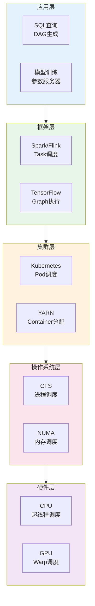

# 04.3 跨层调度协同

---

📌 **内容摘要**

本文档深入探讨跨层调度协同的核心原理和关键方法。内容涵盖分布式调度领域的主要知识点，包括调度, 资源分配, 一致性, 共识算法等关键主题。适合具备相关基础的学习者进行深入研究。

**关键词**: 调度, 资源分配, 分布式调度, 一致性, 共识算法, 任务调度, 分布式系统

📚 **学习目标**
- 深入理解跨层调度协同的理论体系和形式化方法
- 能够进行相关定理的形式化证明
- 能够分析和实现相关算法

🎯 **难度级别**: 高级

⏱️ **预计阅读时间**: 20分钟

**前置知识**: 该领域的中级知识, 形式化方法基础, 算法与数据结构

---


> **交叉引用**: 源Matter中的调度协同文档
>
> - [Matter: 跨层优化](../../Matter/02_分布式系统/02.8_跨层优化.md)
> - [FormalRE: 跨层调度理论](../../FormalRE/分布式系统/跨层调度理论.md)

---

## 04.3.1 调度层次概览

### 04.3.1.1 端到端调度栈



### 04.3.1.2 跨层协同挑战

| 层次 | 时间粒度 | 决策频率 | 信息可见性 |
|------|----------|----------|------------|
| 应用层 | 秒-分钟 | 每Job | 全局视图 |
| 框架层 | 毫秒-秒 | 每Task | 分区视图 |
| 集群层 | 秒-分钟 | 每Pod/Container | 节点视图 |
| OS层 | 微秒-毫秒 | 每进程/线程 | 本地视图 |
| 硬件层 | 纳秒-微秒 | 每指令/warp | 微架构视图 |

---

## 04.3.2 信息传递与反馈

### 04.3.2.1 向上信息聚合

```rust
/// 跨层性能指标聚合
pub struct PerformanceTelemetry {
    /// 硬件层指标
    pub hw_metrics: HardwareMetrics,
    /// OS层指标
    pub os_metrics: OSMetrics,
    /// 集群层指标
    pub cluster_metrics: ClusterMetrics,
    /// 框架层指标
    pub framework_metrics: FrameworkMetrics,
}

#[derive(Debug, Clone)]
pub struct HardwareMetrics {
    /// CPU利用率
    pub cpu_utilization: f64,
    /// 内存带宽利用率
    pub memory_bandwidth: f64,
    /// GPU利用率
    pub gpu_utilization: f64,
    /// 缓存命中率
    pub cache_hit_rate: f64,
    /// 功耗
    pub power_consumption: f64,
}

#[derive(Debug, Clone)]
pub struct OSMetrics {
    /// 进程上下文切换率
    pub context_switches: u64,
    /// 页面错误率
    pub page_faults: u64,
    /// I/O吞吐量
    pub io_throughput: u64,
    /// 系统调用频率
    pub syscall_rate: u64,
    /// CFS延迟
    pub cfs_latency: Duration,
}

/// 指标聚合器
pub struct MetricsAggregator {
    collectors: Vec<Box<dyn MetricsCollector>>,
    aggregation_window: Duration,
}

impl MetricsAggregator {
    /// 聚合所有层级的指标
    pub fn aggregate(&self) -> PerformanceTelemetry {
        PerformanceTelemetry {
            hw_metrics: self.collect_hw_metrics(),
            os_metrics: self.collect_os_metrics(),
            cluster_metrics: self.collect_cluster_metrics(),
            framework_metrics: self.collect_framework_metrics(),
        }
    }

    /// 向上层报告关键指标
    pub fn report_upwards(&self, metrics: &PerformanceTelemetry) {
        // OS层检测到CPU饱和，通知集群层
        if metrics.os_metrics.cpu_utilization > 0.9 {
            self.notify_cluster_layer(ResourcePressure::CPU);
        }

        // 硬件层检测到内存带宽瓶颈，通知OS层调整NUMA策略
        if metrics.hw_metrics.memory_bandwidth > 0.95 {
            self.notify_os_layer(MemoryPressure::Bandwidth);
        }

        // 框架层检测到任务延迟增加，请求集群层扩容
        if metrics.framework_metrics.task_latency > LATENCY_THRESHOLD {
            self.notify_cluster_layer(ScalingRequest::ScaleUp);
        }
    }
}
```

### 04.3.2.2 向下指令分解

```rust
/// 跨层调度决策分解
pub struct SchedulingDecision {
    pub layer: SchedulingLayer,
    pub decision_type: DecisionType,
    pub constraints: Vec<SchedulingConstraint>,
}

#[derive(Debug, Clone)]
pub enum DecisionType {
    // 应用层决策
    QueryOptimization(OptimizedPlan),

    // 框架层决策
    TaskPlacement(Vec<TaskPlacement>),

    // 集群层决策
    PodScheduling(PodSpec, NodeSelector),

    // OS层决策
    ProcessAffinity(Vec<CpuSet>),
    MemoryPolicy(NUMAPolicy),

    // 硬件层决策
    DVFS(FrequencySetting),
    CachePartitioning(CacheWayAllocation),
}

/// 调度决策分解器
pub struct DecisionDecomposer {
    pub policies: Vec<Box<dyn DecompositionPolicy>>,
}

impl DecisionDecomposer {
    /// 将高层决策分解到低层
    pub fn decompose(&self, decision: SchedulingDecision) -> Vec<SchedulingDecision> {
        match decision.layer {
            SchedulingLayer::Application => {
                self.decompose_app_decision(decision)
            }
            SchedulingLayer::Framework => {
                self.decompose_framework_decision(decision)
            }
            SchedulingLayer::Cluster => {
                self.decompose_cluster_decision(decision)
            }
            SchedulingLayer::OS => {
                self.decompose_os_decision(decision)
            }
            SchedulingLayer::Hardware => {
                vec![decision] // 硬件层是最底层
            }
        }
    }

    fn decompose_app_decision(&self, decision: SchedulingDecision) -> Vec<SchedulingDecision> {
        // 应用层查询优化决策 -> 框架层任务放置决策
        match decision.decision_type {
            DecisionType::QueryOptimization(plan) => {
                let task_placements = self.plan_to_task_placements(&plan);
                vec![SchedulingDecision {
                    layer: SchedulingLayer::Framework,
                    decision_type: DecisionType::TaskPlacement(task_placements),
                    constraints: decision.constraints,
                }]
            }
            _ => vec![]
        }
    }

    fn decompose_framework_decision(&self, decision: SchedulingDecision) -> Vec<SchedulingDecision> {
        // 框架层任务放置 -> 集群层Pod调度 + OS层亲和性设置
        match decision.decision_type {
            DecisionType::TaskPlacement(placements) => {
                let mut sub_decisions = vec![];

                // 转换为Pod调度决策
                let pod_specs = self.task_placements_to_pods(&placements);
                for spec in pod_specs {
                    sub_decisions.push(SchedulingDecision {
                        layer: SchedulingLayer::Cluster,
                        decision_type: DecisionType::PodScheduling(
                            spec.pod,
                            spec.node_selector
                        ),
                        constraints: decision.constraints.clone(),
                    });
                }

                // 添加CPU亲和性约束
                let cpu_affinity = self.compute_cpu_affinity(&placements);
                sub_decisions.push(SchedulingDecision {
                    layer: SchedulingLayer::OS,
                    decision_type: DecisionType::ProcessAffinity(cpu_affinity),
                    constraints: decision.constraints,
                });

                sub_decisions
            }
            _ => vec![]
        }
    }
}
```

---

## 04.3.3 协同优化策略

### 04.3.3.1 数据本地性协同

```rust
/// 跨层数据本地性管理
pub struct DataLocalityCoordinator {
    /// 数据位置缓存
    data_locations: DataLocationCache,
    /// 各层本地性策略
    locality_policies: HashMap<SchedulingLayer, Box<dyn LocalityPolicy>>,
}

impl DataLocalityCoordinator {
    /// 优化端到端数据本地性
    pub fn optimize_locality(&self, job: &Job) -> LocalityPlan {
        // 1. 获取数据分布信息
        let data_blocks = self.analyze_data_distribution(job);

        // 2. 应用层：基于数据分布优化查询计划
        let app_plan = self.locality_policies[&SchedulingLayer::Application]
            .optimize(&data_blocks);

        // 3. 框架层：根据数据位置调度Task
        let task_placements = self.locality_policies[&SchedulingLayer::Framework]
            .compute_placements(&app_plan, &data_blocks);

        // 4. 集群层：将Task映射到存储数据的节点
        let pod_assignments = self.locality_policies[&SchedulingLayer::Cluster]
            .assign_to_nodes(&task_placements);

        // 5. OS层：设置内存NUMA亲和性
        let numa_bindings = self.locality_policies[&SchedulingLayer::OS]
            .compute_numa_bindings(&pod_assignments);

        LocalityPlan {
            app_optimization: app_plan,
            task_placements,
            pod_assignments,
            numa_bindings,
        }
    }
}

/// HDFS + Spark 本地性协同示例
pub struct HDFSSparkLocality;

impl LocalityPolicy for HDFSSparkLocality {
    fn compute_placements(&self,
                          app_plan: &OptimizedPlan,
                          data_blocks: &DataDistribution) -> Vec<TaskPlacement> {
        let mut placements = vec![];

        for stage in &app_plan.stages {
            for task in &stage.tasks {
                // 获取输入数据块位置
                let input_blocks = task.input_blocks();

                // 选择数据块最多的节点
                let preferred_nodes = self.count_blocks_per_node(&input_blocks);

                // Spark PROCESS_LOCAL -> NODE_LOCAL -> RACK_LOCAL -> ANY
                let node = if let Some(node) = preferred_nodes.get_local() {
                    node // PROCESS_LOCAL
                } else if let Some(node) = preferred_nodes.get_node() {
                    node // NODE_LOCAL
                } else if let Some(node) = preferred_nodes.get_rack() {
                    node // RACK_LOCAL
                } else {
                    self.select_any_node() // ANY
                };

                placements.push(TaskPlacement {
                    task_id: task.id,
                    preferred_node: node,
                    locality_level: self.determine_locality_level(&input_blocks, &node),
                });
            }
        }

        placements
    }
}
```

### 04.3.3.2 资源预留与超售协同

```rust
/// 跨层资源预留协调器
pub struct ResourceReservationCoordinator {
    /// 各层预留信息
    reservations: HashMap<SchedulingLayer, ResourceReservation>,
    /// 超售策略
    oversubscription_policy: OversubscriptionPolicy,
}

#[derive(Debug, Clone)]
pub struct ResourceReservation {
    /// 保证资源
    pub guaranteed: Resources,
    /// 最大资源（超售上限）
    pub max: Resources,
    /// 当前使用
    pub used: Resources,
    /// 资源类型权重
    pub weights: ResourceWeights,
}

impl ResourceReservationCoordinator {
    /// 协调各层资源预留
    pub fn coordinate_reservations(&mut self,
                                   workload: &WorkloadProfile) -> CoordinatedReservation {
        // 1. 硬件层：基于物理容量设置绝对上限
        let hw_capacity = self.get_hardware_capacity();

        // 2. OS层：预留系统守护进程资源
        let os_reservation = self.reserve_os_resources(&hw_capacity);
        let remaining_after_os = hw_capacity - os_reservation;

        // 3. 集群层：划分节点资源到各个框架
        let cluster_allocation = self.allocate_to_frameworks(
            &remaining_after_os,
            workload
        );

        // 4. 框架层：在分配的容器内调度任务
        let framework_reservations: HashMap<_, _> = cluster_allocation
            .iter()
            .map(|(framework, resources)| {
                let framework_alloc = self.framework_optimize(
                    *framework,
                    resources,
                    &workload.framework_workloads[framework]
                );
                (*framework, framework_alloc)
            })
            .collect();

        CoordinatedReservation {
            hw_capacity,
            os_reservation,
            cluster_allocation,
            framework_reservations,
        }
    }

    /// 超售决策
    pub fn apply_oversubscription(&self,
                                   base_reservation: &CoordinatedReservation)
        -> OversubscribedAllocation {
        match self.oversubscription_policy {
            OversubscriptionPolicy::Conservative => {
                // CPU: 1.5x, 内存: 1.0x (不超售)
                OversubscribedAllocation {
                    cpu_multiplier: 1.5,
                    memory_multiplier: 1.0,
                    io_multiplier: 1.2,
                }
            }
            OversubscriptionPolicy::Aggressive => {
                // 基于历史利用率数据
                let cpu_utilization = self.get_historical_cpu_utilization();
                let mem_utilization = self.get_historical_memory_utilization();

                OversubscribedAllocation {
                    cpu_multiplier: 2.0 / cpu_utilization,
                    memory_multiplier: 1.2 / mem_utilization,
                    io_multiplier: 1.5,
                }
            }
            OversubscriptionPolicy::MachineLearning => {
                // 使用预测模型
                self.ml_predicted_oversubscription(base_reservation)
            }
        }
    }
}
```

---

## 04.3.4 一致性保证

### 04.3.4.1 调度一致性模型

**定义 04.3.1** (跨层调度一致性). 设 $L_1, L_2, \ldots, L_n$ 为调度层次，一致性要求：

1. **可行性**: 高层决策在底层必须有可行实现
2. **优化性**: 各层优化目标不冲突
3. **稳定性**: 决策变化不引起震荡

```rust
/// 调度一致性验证器
pub struct ConsistencyValidator {
    pub constraints: Vec<ConsistencyConstraint>,
}

#[derive(Debug, Clone)]
pub enum ConsistencyConstraint {
    /// 资源容量约束
    ResourceCapacity {
        layer: SchedulingLayer,
        max_resources: Resources,
    },
    /// 亲和性约束
    Affinity {
        tasks: Vec<TaskId>,
        must_co_locate: bool,
    },
    /// 反亲和性约束
    AntiAffinity {
        tasks: Vec<TaskId>,
        must_not_co_locate: bool,
    },
    /// 优先级约束
    Priority {
        high_priority: TaskId,
        low_priority: TaskId,
    },
}

impl ConsistencyValidator {
    /// 验证跨层调度决策的一致性
    pub fn validate(&self, decisions: &[SchedulingDecision]) -> ValidationResult {
        let mut violations = vec![];

        // 1. 检查资源容量一致性
        for constraint in &self.constraints {
            match constraint {
                ConsistencyConstraint::ResourceCapacity { layer, max_resources } => {
                    let layer_decisions: Vec<_> = decisions.iter()
                        .filter(|d| d.layer == *layer)
                        .collect();

                    let total_requested: Resources = layer_decisions.iter()
                        .map(|d| d.required_resources())
                        .fold(Resources::zero(), |a, b| a + b);

                    if total_requested > *max_resources {
                        violations.push(ConsistencyViolation {
                            constraint: constraint.clone(),
                            reason: format!(
                                "Layer {:?} requested {:?} exceeds capacity {:?}",
                                layer, total_requested, max_resources
                            ),
                        });
                    }
                }

                ConsistencyConstraint::Affinity { tasks, must_co_locate } => {
                    // 验证所有任务被调度到同一节点
                    let placements: Vec<_> = decisions.iter()
                        .filter_map(|d| d.get_task_placement())
                        .filter(|p| tasks.contains(&p.task_id))
                        .collect();

                    if *must_co_locate {
                        let nodes: HashSet<_> = placements.iter()
                            .map(|p| &p.node)
                            .collect();

                        if nodes.len() > 1 {
                            violations.push(ConsistencyViolation {
                                constraint: constraint.clone(),
                                reason: "Affinity tasks scheduled to different nodes".to_string(),
                            });
                        }
                    }
                }

                _ => {}
            }
        }

        if violations.is_empty() {
            ValidationResult::Valid
        } else {
            ValidationResult::Invalid(violations)
        }
    }
}
```

---

## 04.3.5 C++伪代码：跨层调度框架

```cpp
#pragma once
#include <vector>
#include <memory>
#include <functional>
#include <variant>

namespace cross_layer {
namespace scheduling {

// 调度层次
enum class Layer {
    APPLICATION,
    FRAMEWORK,
    CLUSTER,
    OS,
    HARDWARE
};

// 资源定义
struct Resources {
    double cpu_cores;
    uint64_t memory_bytes;
    uint64_t disk_bytes;
    int gpu_count;

    Resources operator+(const Resources& other) const {
        return {
            cpu_cores + other.cpu_cores,
            memory_bytes + other.memory_bytes,
            disk_bytes + other.disk_bytes,
            gpu_count + other.gpu_count
        };
    }

    Resources operator-(const Resources& other) const {
        return {
            cpu_cores - other.cpu_cores,
            memory_bytes - other.memory_bytes,
            disk_bytes - other.disk_bytes,
            gpu_count - other.gpu_count
        };
    }

    bool operator<=(const Resources& other) const {
        return cpu_cores <= other.cpu_cores &&
               memory_bytes <= other.memory_bytes &&
               disk_bytes <= other.disk_bytes &&
               gpu_count <= other.gpu_count;
    }
};

// 调度决策基类
class SchedulingDecision {
public:
    virtual ~SchedulingDecision() = default;
    virtual Layer get_layer() const = 0;
    virtual Resources get_required_resources() const = 0;
};

// 应用层决策
class AppDecision : public SchedulingDecision {
public:
    Layer get_layer() const override { return Layer::APPLICATION; }
    Resources get_required_resources() const override {
        return Resources{0, 0, 0, 0}; // 应用层不直接请求资源
    }

    struct QueryPlan {
        std::vector<int> stage_order;
        std::vector<std::string> preferred_data_locations;
    } plan;
};

// 框架层决策
class FrameworkDecision : public SchedulingDecision {
public:
    Layer get_layer() const override { return Layer::FRAMEWORK; }
    Resources get_required_resources() const override {
        Resources total{0, 0, 0, 0};
        for (const auto& task : task_placements) {
            total = total + task.required_resources;
        }
        return total;
    }

    struct TaskPlacement {
        int task_id;
        std::string preferred_node;
        Resources required_resources;
    };
    std::vector<TaskPlacement> task_placements;
};

// 集群层决策
class ClusterDecision : public SchedulingDecision {
public:
    Layer get_layer() const override { return Layer::CLUSTER; }
    Resources get_required_resources() const override {
        return pod_spec.resources.requests;
    }

    struct PodSpec {
        std::string name;
        struct {
            Resources requests;
            Resources limits;
        } resources;
        std::vector<std::string> node_affinity;
    } pod_spec;

    std::string selected_node;
};

// OS层决策
class OSDecision : public SchedulingDecision {
public:
    Layer get_layer() const override { return Layer::OS; }
    Resources get_required_resources() const override {
        return Resources{0, 0, 0, 0};
    }

    int process_id;
    std::vector<int> cpu_affinity;
    int numa_node;
    int io_priority;
};

// 跨层调度器
template<typename DecisionType>
class CrossLayerScheduler {
public:
    using DecisionPtr = std::shared_ptr<SchedulingDecision>;

    // 分解高层决策到低层
    std::vector<DecisionPtr> decompose(DecisionPtr decision) {
        switch (decision->get_layer()) {
            case Layer::APPLICATION:
                return decompose_app(
                    std::static_pointer_cast<AppDecision>(decision)
                );
            case Layer::FRAMEWORK:
                return decompose_framework(
                    std::static_pointer_cast<FrameworkDecision>(decision)
                );
            case Layer::CLUSTER:
                return decompose_cluster(
                    std::static_pointer_cast<ClusterDecision>(decision)
                );
            case Layer::OS:
                return decompose_os(
                    std::static_pointer_cast<OSDecision>(decision)
                );
            default:
                return {decision};
        }
    }

    // 执行完整调度流程
    bool schedule_workload(const AppDecision& app_decision) {
        // 分解到所有层次
        auto framework_decisions = decompose_app(app_decision);

        for (auto& fw_dec : framework_decisions) {
            auto cluster_decisions = decompose(fw_dec);

            for (auto& cl_dec : cluster_decisions) {
                auto os_decisions = decompose(cl_dec);

                // 验证一致性
                if (!validate_consistency(os_decisions)) {
                    return false;
                }

                // 执行决策
                for (auto& dec : os_decisions) {
                    if (!execute_decision(dec)) {
                        return false;
                    }
                }
            }
        }

        return true;
    }

private:
    std::vector<DecisionPtr> decompose_app(std::shared_ptr<AppDecision> app) {
        // 将应用层查询计划转换为框架层任务放置
        std::vector<FrameworkDecision::TaskPlacement> placements;

        for (int stage_id : app->plan.stage_order) {
            // 根据数据位置确定任务放置
            placements.push_back({
                stage_id,
                select_node_for_stage(stage_id, app->plan.preferred_data_locations),
                estimate_resources(stage_id)
            });
        }

        auto fw_decision = std::make_shared<FrameworkDecision>();
        fw_decision->task_placements = placements;

        return {fw_decision};
    }

    std::vector<DecisionPtr> decompose_framework(
        std::shared_ptr<FrameworkDecision> fw
    ) {
        std::vector<DecisionPtr> decisions;

        // 将任务放置转换为Pod调度决策
        for (const auto& placement : fw->task_placements) {
            auto cluster_dec = std::make_shared<ClusterDecision>();
            cluster_dec->pod_spec = {
                "task-" + std::to_string(placement.task_id),
                {placement.required_resources, placement.required_resources * 1.5},
                {placement.preferred_node}
            };
            decisions.push_back(cluster_dec);
        }

        // 添加OS层亲和性决策
        auto os_decision = std::make_shared<OSDecision>();
        os_decision->cpu_affinity = compute_affinity(fw->task_placements);
        decisions.push_back(os_decision);

        return decisions;
    }

    std::vector<DecisionPtr> decompose_cluster(
        std::shared_ptr<ClusterDecision> cluster
    ) {
        // 集群层到OS层的转换
        auto os_decision = std::make_shared<OSDecision>();
        os_decision->numa_node = select_numa_node(cluster->selected_node);
        os_decision->io_priority = calculate_io_priority(cluster->pod_spec);

        return {os_decision};
    }

    std::vector<DecisionPtr> decompose_os(std::shared_ptr<OSDecision> os) {
        // OS层是最底层
        return {os};
    }

    bool validate_consistency(const std::vector<DecisionPtr>& decisions) {
        Resources total_required{0, 0, 0, 0};

        for (const auto& dec : decisions) {
            total_required = total_required + dec->get_required_resources();
        }

        // 检查是否在容量范围内
        return total_required <= get_cluster_capacity();
    }

    bool execute_decision(DecisionPtr decision) {
        // 实际执行调度决策
        return true; // 简化
    }

    // 辅助函数声明
    std::string select_node_for_stage(int stage_id,
                                       const std::vector<std::string>& data_locs);
    Resources estimate_resources(int stage_id);
    std::vector<int> compute_affinity(
        const std::vector<FrameworkDecision::TaskPlacement>& placements);
    int select_numa_node(const std::string& node);
    int calculate_io_priority(const ClusterDecision::PodSpec& spec);
    Resources get_cluster_capacity();
};

} // namespace scheduling
} // namespace cross_layer
```

---

## 04.3.6 总结

| 协同维度 | 机制 | 收益 |
|----------|------|------|
| 信息传递 | 向上聚合、向下分解 | 全局优化决策 |
| 数据本地性 | 跨层位置感知 | 减少数据传输 |
| 资源预留 | 分层超售控制 | 提高利用率 |
| 一致性 | 约束验证 | 调度可行性保证 |

**延伸阅读**:

- [04.1 集群调度](./04.1_集群调度.md) - Kubernetes、YARN
- [04.2 大数据调度](./04.2_大数据调度.md) - Spark、Flink调度
---

## 📚 延伸阅读

- [11.6 稳定性分析](./11_系统科学/02_控制论/02.2_稳定性分析.md)
- [04.1 一致性模型](./04_软件工程/04_分布式系统/04.1_一致性模型.md)
- [04.1 分布式基础](./04_软件工程/04_分布式系统/04.1_分布式基础.md)
- [01.4 性能指标](../01_调度理论基础/01.4_性能指标.md)
- [04.2 大数据调度](../04_分布式调度/04.2_大数据调度.md)
