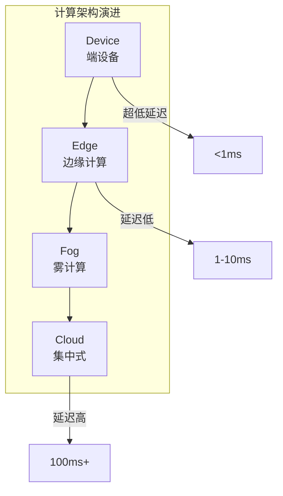
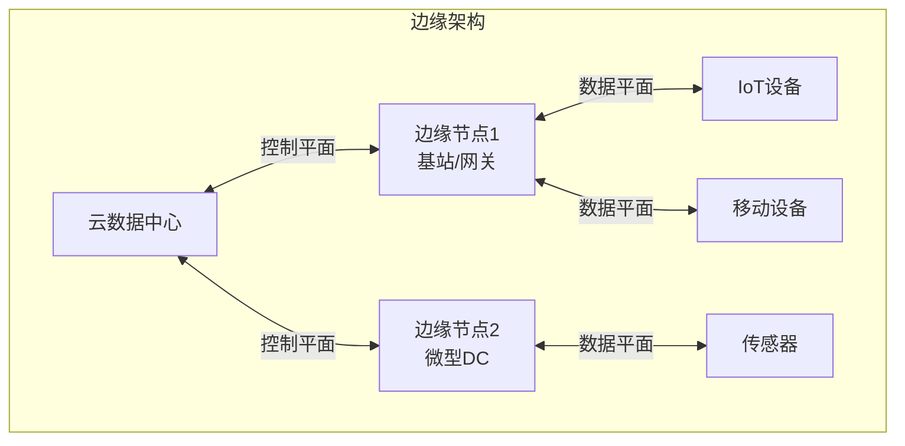
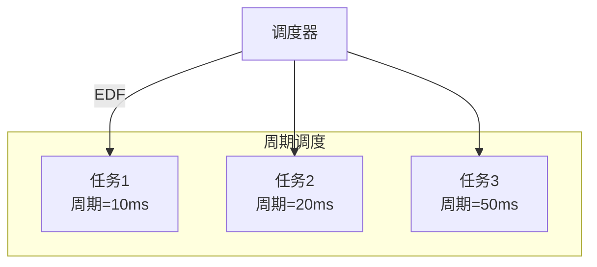

# 04.4 边缘调度

---

📌 **内容摘要**

本文档深入探讨边缘调度的核心原理和关键方法。内容涵盖分布式调度领域的主要知识点，包括任务调度, 调度, 资源分配等关键主题。适合具备相关基础的学习者进行深入研究。

**关键词**: 任务调度, 分布式调度, 调度, 资源分配

📚 **学习目标**

- 深入理解边缘调度的理论体系和形式化方法
- 能够进行相关定理的形式化证明
- 能够分析和实现相关算法

🎯 **难度级别**: 高级

⏱️ **预计阅读时间**: 15分钟

**前置知识**: 该领域的中级知识, 形式化方法基础, 算法与数据结构

---


> **形式科学 · 调度系统系列**
> 上一篇: [04.3 任务调度](04.3_任务调度.md) | 下一篇: [目录](../README.md)

---

## 1. 边缘计算概述

### 1.1 计算范式对比



**性能对比**:

| 指标 | 云计算 | 边缘计算 | 端计算 |
|------|--------|----------|--------|
| 延迟 | 100ms+ | 5-20ms | <1ms |
| 带宽 | 高 | 中 | 低 |
| 计算能力 | 强 | 中 | 弱 |
| 能耗 | 低 | 中 | 受限 |
| 隐私 | 低 | 中 | 高 |

### 1.2 边缘计算架构



---

## 2. 移动边缘计算调度

### 2.1 任务卸载决策

**定义 2.1（任务卸载）**: 决定是否将任务在本地执行或卸载到边缘/云端。

**决策模型**:

$$\min_{x \in \{0, 1, 2\}} \alpha \cdot T(x) + \beta \cdot E(x) + \gamma \cdot C(x)$$

- $x=0$: 本地执行
- $x=1$: 边缘卸载
- $x=2$: 云端卸载

| 因素 | 本地 | 边缘 | 云端 |
|------|------|------|------|
| 执行时间 | $D_i/f_{local}$ | $D_i/f_{edge} + D_i/R$ | $D_i/f_{cloud} + D_i/R$ |
| 能耗 | $\kappa f_{local}^2 D_i$ | $p_{tx} D_i/R$ | $p_{tx} D_i/R$ |
| 成本 | 0 | $c_{edge}$ | $c_{cloud}$ |

### 2.2 Rust 实现：卸载决策

```rust
// Rust: 任务卸载决策引擎
#[derive(Debug, Clone, Copy)]
pub enum ExecutionLocation {
    Local,
    Edge,
    Cloud,
}

#[derive(Debug, Clone)]
pub struct Task {
    pub id: u64,
    pub data_size: f64,      // MB
    pub compute_cycles: f64, // 百万指令
    pub deadline: f64,       // ms
    pub priority: u8,
}

#[derive(Debug, Clone)]
pub struct SystemState {
    pub local_compute_capacity: f64,  // MIPS
    pub edge_compute_capacity: f64,   // MIPS
    pub cloud_compute_capacity: f64,  // MIPS
    pub uplink_bandwidth: f64,        // Mbps
    pub downlink_bandwidth: f64,      // Mbps
    pub edge_load: f64,               // 0-1
    pub cloud_latency: f64,           // ms
}

pub struct OffloadingDecisionEngine {
    pub alpha: f64,  // 时间权重
    pub beta: f64,   // 能耗权重
    pub gamma: f64,  // 成本权重
    pub kappa: f64,  // 能耗系数
    pub tx_power: f64, // 传输功率
}

impl OffloadingDecisionEngine {
    pub fn decide(&self, task: &Task, state: &SystemState) -> ExecutionLocation {
        let local_cost = self.local_cost(task, state);
        let edge_cost = self.edge_cost(task, state);
        let cloud_cost = self.cloud_cost(task, state);

        if local_cost <= edge_cost && local_cost <= cloud_cost {
            ExecutionLocation::Local
        } else if edge_cost <= cloud_cost {
            ExecutionLocation::Edge
        } else {
            ExecutionLocation::Cloud
        }
    }

    fn local_cost(&self, task: &Task, state: &SystemState) -> f64 {
        let exec_time = task.compute_cycles / state.local_compute_capacity;  // ms
        let energy = self.kappa * state.local_compute_capacity.powi(2) * task.compute_cycles;

        self.alpha * exec_time + self.beta * energy
    }

    fn edge_cost(&self, task: &Task, state: &SystemState) -> f64 {
        let upload_time = (task.data_size * 8.0) / state.uplink_bandwidth;  // ms
        let exec_time = task.compute_cycles / (state.edge_compute_capacity * (1.0 - state.edge_load));
        let download_time = (task.data_size * 8.0 * 0.1) / state.downlink_bandwidth;  // 假设结果大小为10%

        let total_time = upload_time + exec_time + download_time;
        let energy = self.tx_power * (upload_time + download_time);
        let cost = 0.01 * task.compute_cycles;  // 边缘计算成本

        self.alpha * total_time + self.beta * energy + self.gamma * cost
    }

    fn cloud_cost(&self, task: &Task, state: &SystemState) -> f64 {
        let upload_time = (task.data_size * 8.0) / state.uplink_bandwidth;
        let exec_time = task.compute_cycles / state.cloud_compute_capacity;
        let download_time = (task.data_size * 8.0 * 0.1) / state.downlink_bandwidth;

        let total_time = upload_time + state.cloud_latency + exec_time + download_time;
        let energy = self.tx_power * (upload_time + download_time);
        let cost = 0.001 * task.compute_cycles;  // 云端成本更低

        self.alpha * total_time + self.beta * energy + self.gamma * cost
    }

    // 检查是否满足截止期限
    pub fn check_deadline(&self, task: &Task, location: ExecutionLocation, state: &SystemState) -> bool {
        let latency = match location {
            ExecutionLocation::Local => task.compute_cycles / state.local_compute_capacity,
            ExecutionLocation::Edge => {
                let upload = (task.data_size * 8.0) / state.uplink_bandwidth;
                let exec = task.compute_cycles / (state.edge_compute_capacity * (1.0 - state.edge_load));
                let download = (task.data_size * 8.0 * 0.1) / state.downlink_bandwidth;
                upload + exec + download
            }
            ExecutionLocation::Cloud => {
                let upload = (task.data_size * 8.0) / state.uplink_bandwidth;
                let exec = task.compute_cycles / state.cloud_compute_capacity;
                let download = (task.data_size * 8.0 * 0.1) / state.downlink_bandwidth;
                upload + state.cloud_latency + exec + download
            }
        };

        latency <= task.deadline
    }
}
```

---

## 3. IoT 任务调度

### 3.1 IoT 特点

| 特点 | 影响 | 调度策略 |
|------|------|----------|
| 资源受限 | 计算能力弱 | 优先卸载 |
| 电池供电 | 能耗敏感 | 能耗优化 |
| 间歇连接 | 网络不稳定 | 本地缓存 |
| 实时性 | 延迟敏感 | 截止时间驱动 |
| 大规模 | 设备数量多 | 聚合调度 |

### 3.2 调度策略

**周期性任务调度**:



---

## 4. 5G 网络调度

### 4.1 5G 网络切片

**定义 4.1（网络切片）**: 在共享物理基础设施上创建多个虚拟网络。

| 切片类型 | 特性 | 应用 |
|----------|------|------|
| eMBB | 增强移动宽带 | 高清视频 |
| uRLLC | 超可靠低延迟 | 自动驾驶 |
| mMTC | 海量机器通信 | IoT |

### 4.2 切片资源分配

$$\max \sum_{s \in S} U_s(R_s) \quad \text{s.t.} \quad \sum_{s} R_s \leq R_{total}$$

### 4.3 Haskell 实现：切片调度

```haskell
-- Haskell: 5G网络切片资源分配
module Edge.NetworkSlicing where

import Data.Map (Map)
import qualified Data.Map as Map
import Data.List (sortBy)

data SliceType = eMBB | uRLLC | mMTC
    deriving (Show, Eq)

data NetworkSlice = NetworkSlice {
    sliceId :: String,
    sliceType :: SliceType,
    requiredBandwidth :: Double,    -- Mbps
    requiredLatency :: Double,      -- ms
    priority :: Int                 -- 1-10
} deriving (Show)

data ResourceAllocation = ResourceAllocation {
    allocatedBandwidth :: Double,
    allocatedCompute :: Double,
    allocatedStorage :: Double
} deriving (Show)

type SliceAllocation = Map String ResourceAllocation

-- 切片调度器
data SliceScheduler = SliceScheduler {
    totalBandwidth :: Double,
    totalCompute :: Double,
    allocations :: SliceAllocation
}

-- 基于优先级的资源分配
allocateSlices :: SliceScheduler -> [NetworkSlice] -> SliceAllocation
allocateSlices scheduler slices =
    let sortedSlices = sortBy (\s1 s2 -> compare (priority s2) (priority s1)) slices
        initialAllocations = allocations scheduler
        (finalAllocs, _) = foldl (allocateSingleSlice scheduler)
            (initialAllocations, availableResources scheduler)
            sortedSlices
    in finalAllocs
  where
    allocateSingleSlice scheduler (allocs, avail) slice =
        let reqBW = requiredBandwidth slice
            allocBW = min reqBW (availableBandwidth avail)

            reqCompute = requiredCompute slice
            allocCompute = min reqCompute (availableCompute avail)

            allocation = ResourceAllocation allocBW allocCompute 0
            newAllocs = Map.insert (sliceId slice) allocation allocs
            newAvail = avail {
                availableBandwidth = availableBandwidth avail - allocBW,
                availableCompute = availableCompute avail - allocCompute
            }
        in (newAllocs, newAvail)

data AvailableResources = AvailableResources {
    availableBandwidth :: Double,
    availableCompute :: Double
} deriving (Show)

availableResources :: SliceScheduler -> AvailableResources
availableResources scheduler =
    let usedBW = sum $ map allocatedBandwidth $ Map.elems (allocations scheduler)
        usedCompute = sum $ map allocatedCompute $ Map.elems (allocations scheduler)
    in AvailableResources {
        availableBandwidth = totalBandwidth scheduler - usedBW,
        availableCompute = totalCompute scheduler - usedCompute
    }

-- 根据切片类型估算计算需求
requiredCompute :: NetworkSlice -> Double
requiredCompute slice = case sliceType slice of
    eMBB  -> requiredBandwidth slice * 0.1   -- 视频编码
    uRLLC -> requiredBandwidth slice * 0.5   -- 控制处理
    mMTC  -> requiredBandwidth slice * 0.01  -- 简单聚合
```

---

## 5. 联合优化

### 5.1 计算-通信协同

**定义 5.1（联合优化）**: 同时优化计算资源和网络资源分配。

$$
\min_{x, r} \sum_{i} \left( \frac{D_i}{f_i} x_i + \frac{D_i}{r_i} (1-x_i) \right)
$$

约束：

- $\sum f_i \leq F_{edge}$ (计算容量)
- $\sum r_i \leq R_{total}$ (带宽容量)

### 5.2 深度强化学习调度

**状态空间**: $S = (load_{edge}, load_{cloud}, bandwidth, task\_queue)$

**动作空间**: $A = \{local, edge, cloud\}$

**奖励函数**: $R = -(\alpha \cdot latency + \beta \cdot energy)$

---

## 6. Lean 形式化：边缘调度约束

```lean4
-- Lean: 边缘调度约束
structure EdgeNode where
  id : Nat
  computeCapacity : Nat  -- MIPS
  bandwidth : Nat        -- Mbps
  location : Coordinates

def Coordinates := (Float, Float)

def distance (c1 c2 : Coordinates) : Float :=
  let (x1, y1) := c1
  let (x2, y2) := c2
  Float.sqrt ((x1 - x2) ^ 2 + (y1 - y2) ^ 2)

structure MobileTask where
  id : Nat
  dataSize : Nat         -- MB
  computeCycles : Nat    -- 百万指令
  deadline : Nat         -- ms
  sourceLocation : Coordinates
  deriving Repr

-- 卸载决策
def OffloadDecision := Nat → Option Nat  -- taskId -> Some nodeId or None (local)

def feasibleOffload
    (tasks : List MobileTask)
    (nodes : List EdgeNode)
    (decision : OffloadDecision) : Prop :=
  -- 每个任务满足截止期限
  (∀ t ∈ tasks,
    let latency := match decision t.id with
      | none => t.computeCycles / 1000  -- 本地执行 (假设1 MIPS本地)
      | some nodeId =>
          match nodes.find? (λ n => n.id = nodeId) with
          | some node =>
              let uploadTime := (t.dataSize * 8) / node.bandwidth
              let execTime := t.computeCycles / node.computeCapacity
              let propagationTime := (distance t.sourceLocation node.location / 3e5 * 1000).toNat
              uploadTime + execTime + propagationTime
          | none => 0
    latency ≤ t.deadline)

  -- 每个节点不超载
  ∧ (∀ node ∈ nodes,
      let assignedTasks := tasks.filter (λ t => decision t.id = some node.id)
      let totalCompute := assignedTasks.sum (λ t => t.computeCycles)
      totalCompute ≤ node.computeCapacity)

-- 优化目标：最小化总能耗
def totalEnergy
    (tasks : List MobileTask)
    (decision : OffloadDecision)
    (nodes : List EdgeNode) : Nat :=
  tasks.foldl (λ acc t =>
    let energy := match decision t.id with
      | none => t.computeCycles * 10  -- 本地能耗系数
      | some nodeId =>
          match nodes.find? (λ n => n.id = nodeId) with
          | some node =>
              let txEnergy := (t.dataSize * 8) / node.bandwidth * 500  -- 传输能耗
              txEnergy
          | none => 0
    acc + energy) 0

theorem optimalOffloadExists :
    ∀ (tasks : List MobileTask) (nodes : List EdgeNode),
    (∃ d, feasibleOffload tasks nodes d) →
    ∃ d*, feasibleOffload tasks nodes d* ∧
      ∀ d', feasibleOffload tasks nodes d' →
        totalEnergy tasks d* nodes ≤ totalEnergy tasks d' nodes := by
  sorry
```

---

## 7. 应用场景

### 7.1 应用场景对比

| 场景 | 延迟要求 | 带宽需求 | 计算需求 | 调度策略 |
|------|----------|----------|----------|----------|
| 自动驾驶 | <10ms | 高 | 高 | uRLLC + 本地优先 |
| AR/VR | <20ms | 极高 | 中 | eMBB + 边缘渲染 |
| 工业IoT | <50ms | 中 | 低 | mMTC + 聚合 |
| 智能城市 | <100ms | 中 | 中 | 混合策略 |

---

## 8. 参考文献

1. Mao, Y., et al. "A survey on mobile edge computing: The communication perspective." _IEEE Communications Surveys & Tutorials_ 2017.
2. Dastjerdi, A. V., & Buyya, R. "Fog computing: Helping the Internet of Things realize its potential." _Computer_ 2016.
3. Zhang, J., et al. "5G-oriented mobile edge computing." _IEEE Communications Magazine_ 2020.
4. Bi, S., & Zhang, Y. J. "Computation rate maximization for wireless powered mobile-edge computing with binary computation offloading." _IEEE Trans. Wireless Communications_ 2018.

---

## 9. 相关文档

- [04.1 集群调度](04.1_集群调度.md) - YARN、Mesos、Kubernetes
- [04.2 数据流调度](04.2_数据流调度.md) - Spark、Flink、数据局部性
- [04.3 任务调度](04.3_任务调度.md) - DAG调度、依赖管理、容错
- [02.4 网络调度](../02_硬件调度/02.4_网络调度.md) - 包调度、QoS、拥塞控制

---

## 📚 延伸阅读

- [02.4 网络调度](../02_硬件调度/02.4_网络调度.md)
- [04.3 任务调度](../04_分布式调度/04.3_任务调度.md)
- [04.2 数据流调度](../04_分布式调度/04.2_大数据调度.md)
- [04.1 集群调度](../04_分布式调度/04.1_集群调度.md)
