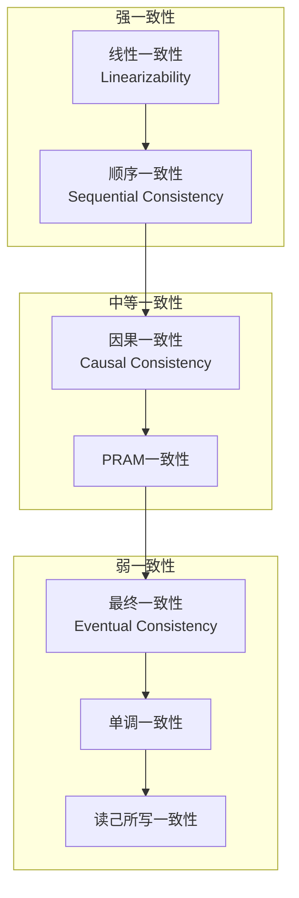
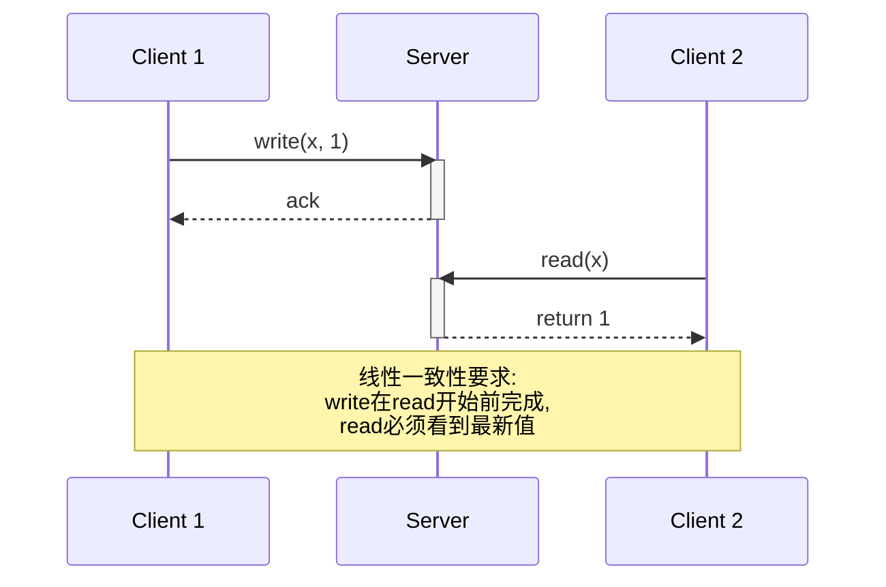
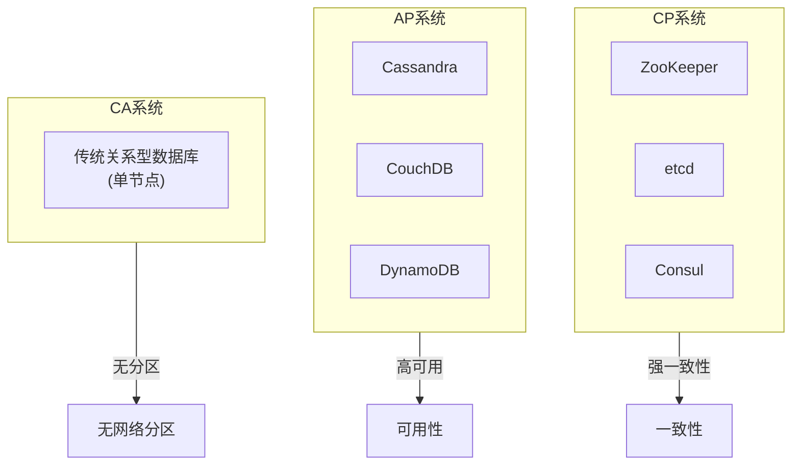

# 04.1 一致性模型

---

📌 **内容摘要**

本文档深入探讨分布式系统中的一致性模型。内容涵盖从弱一致性到强一致性的完整谱系、CAP定理的形式化分析、线性一致性实现以及实际系统案例分析。适合分布式系统工程师和研究人员学习。

**关键词**: 分布式系统, 一致性模型, CAP定理, 线性一致性, 最终一致性

📚 **学习目标**

- 理解不同一致性模型的语义和权衡
- 掌握CAP定理的形式化描述和证明
- 能够分析和实现一致性协议
- 理解一致性模型的形式化定义

🎯 **难度级别**: 高级

⏱️ **预计阅读时间**: 60分钟

**前置知识**: 分布式系统基础, 并发理论, 逻辑时钟

---

## 1. 一致性模型谱系

### 1.1 一致性强度层次

分布式一致性模型按强度可组织为层次结构：

$$
\text{Linearizability} \subset \text{Sequential Consistency} \subset \text{Causal Consistency} \subset \text{Eventual Consistency}
$$



### 1.2 形式化定义框架

**定义 1.1（执行历史）**: 执行历史 $H$ 是操作序列：

$$
H = \langle (op_1, t_1), (op_2, t_2), ..., (op_n, t_n) \rangle
$$

其中 $op_i \in \{read_k(v), write_k(v)\}$，$t_i$ 是时间戳。

**定义 1.2（实时序）**: 操作 $op_1$ 在实时序上先于 $op_2$：

$$
op_1 <_{rt} op_2 \iff t_1^{end} < t_2^{start}
$$

---

## 2. 线性一致性

### 2.1 核心概念

**定义 2.1（线性一致性）**: 执行历史 $H$ 是线性一致的，当且仅当存在 $H$ 的扩展历史 $S$ 满足：

1. **顺序化**: $S$ 是 $H$ 中所有操作的某种排列
2. **正确性**: $S$ 满足单对象顺序语义
3. **实时性**: 若 $op_1 <_{rt} op_2$，则 $op_1$ 在 $S$ 中出现在 $op_2$ 之前



### 2.2 形式化定义

**定义 2.2（线性化点）**: 每个操作在其实际执行时间区间内存在一个逻辑上的原子点（线性化点）：

$$
\forall op \in H: \exists lp(op) \in [t^{start}, t^{end}]
$$

**定理 2.1（线性一致性判定）**: 历史 $H$ 是线性一致的，当且仅当存在线性化点分配使得操作按线性化点排序后满足：

$$
\forall read(x): \text{return}(read(x)) = \text{value}(\text{last-write}(x))
$$

### 2.3 实现机制

**Paxos/Raft实现**：

```python
class LinearizableKVStore:
    """基于Raft的线性一致键值存储"""

    def __init__(self, node_id, peers):
        self.node_id = node_id
        self.peers = peers
        self.state_machine = {}
        self.log = []
        self.commit_index = 0
        self.last_applied = 0

        # Raft状态
        self.current_term = 0
        self.voted_for = None
        self.state = 'follower'  # follower, candidate, leader

        # 线性一致性等待
        self.pending_reads = {}

    def write(self, key, value):
        """
        线性一致写操作

        流程:
        1. 如果是Leader, 将写操作追加到日志
        2. 复制到多数节点
        3. 提交后应用到状态机
        4. 返回客户端
        """
        if self.state != 'leader':
            raise NotLeaderException(self.current_leader)

        entry = {
            'term': self.current_term,
            'index': len(self.log),
            'op': 'write',
            'key': key,
            'value': value
        }

        # 追加到本地日志
        self.log.append(entry)

        # 复制到多数节点（阻塞等待）
        if self.replicate_to_majority(entry):
            self.commit_index = entry['index']
            self.apply_to_state_machine()
            return True
        else:
            return False

    def read(self, key, require_linearizable=True):
        """
        线性一致读操作

        为保证线性一致性, Leader必须:
        1. 确认自己仍是Leader（心跳确认）
        2. 或从多数节点确认commit_index
        """
        if self.state != 'leader':
            raise NotLeaderException(self.current_leader)

        if require_linearizable:
            # Read Index方法
            # 发送心跳确认领导权
            if not self.confirm_leadership():
                raise StaleReadException()

            # 等待本地状态机应用到最新commit
            while self.last_applied < self.commit_index:
                time.sleep(0.001)

        return self.state_machine.get(key)

    def replicate_to_majority(self, entry):
        """复制日志条目到多数节点"""
        acks = 1  # 自己

        for peer in self.peers:
            try:
                response = self.send_append_entries(peer, entry)
                if response['success']:
                    acks += 1
                    if acks > len(self.peers) // 2:
                        return True
            except Timeout:
                continue

        return False
```

---

## 3. 顺序一致性

### 3.1 定义与性质

**定义 3.1（顺序一致性）**: 执行历史 $H$ 是顺序一致的，当且仅当存在 $H$ 的扩展历史 $S$ 满足：

1. **顺序化**: $S$ 是 $H$ 的某种排列
2. **正确性**: $S$ 满足单对象顺序语义
3. **程序序保持**: 每个进程内的操作顺序在 $S$ 中保持不变

**关键区别**：顺序一致性不保证实时序，只保证程序序。

### 3.2 与线性一致性的关系

**定理 3.1（包含关系）**: 线性一致性蕴含顺序一致性，但反之不成立。

**证明**：

- 线性一致性 $\Rightarrow$ 顺序一致性：
  线性一致性要求实时序，而实时序蕴含程序序（同进程的操作必然有实时序关系）。

- 顺序一致性 $\nRightarrow$ 线性一致性：
  反例：两个进程P1、P2，P1执行write(x,1)后write(y,1)，P2执行read(y)返回1后read(x)返回0。

  若read(y)=1发生在write(y,1)之后（实时序），则read(x)应看到write(x,1)。
  但顺序一致性允许read(x)=0的交错，只要保持各自程序序。

因此顺序一致性是线性一致性的弱化版本。∎

---

## 4. 因果一致性

### 4.1 因果序定义

**定义 4.1（Happens-Before关系）**: Lamport定义的Happens-Before关系 $\prec$ 是满足以下条件的最小关系：

1. **程序序**: 若 $op_1$ 和 $op_2$ 在同一进程且 $op_1$ 在 $op_2$ 之前，则 $op_1 \prec op_2$
2. **传递性**: 若 $op_1 \prec op_2$ 且 $op_2 \prec op_3$，则 $op_1 \prec op_3$
3. **读写依赖**: 若 $read$ 返回 $write$ 写入的值，则 $write \prec read$

**定义 4.2（因果一致性）**: 执行是因果一致的，当且仅当：

1. 所有进程以相同的顺序看到因果相关的写操作
2. 每个进程以自己的写操作顺序看到它们

### 4.2 向量时钟实现

```python
class CausalConsistencyStore:
    """基于向量时钟的因果一致性存储"""

    def __init__(self, replica_id, num_replicas):
        self.replica_id = replica_id
        self.num_replicas = num_replicas

        # 向量时钟
        self.vc = [0] * num_replicas

        # 存储: key -> list of (value, vector_clock)
        self.store = defaultdict(list)

        # 待交付队列（因果序未满足的更新）
        self.pending = []

    def write(self, key, value):
        """本地写操作"""
        # 增加本地时钟
        self.vc[self.replica_id] += 1

        # 存储带有向量时钟的值
        entry = {
            'value': value,
            'vc': self.vc.copy(),
            'timestamp': time.time()
        }
        self.store[key].append(entry)

        # 传播到其他副本
        self.replicate(key, entry)

        return entry['vc']

    def read(self, key):
        """本地读操作 - 返回最新可见值"""
        if key not in self.store or not self.store[key]:
            return None

        # 返回最新的可见值
        # 对于因果一致性，所有本地写入都可见
        latest = self.store[key][-1]
        return latest['value']

    def receive_update(self, from_replica, key, entry):
        """接收来自其他副本的更新"""
        incoming_vc = entry['vc']

        # 检查因果依赖是否满足
        if self.can_deliver(incoming_vc, from_replica):
            self.deliver_update(key, entry)
            self.vc = self.merge_vc(self.vc, incoming_vc)

            # 检查待交付队列
            self.try_deliver_pending()
        else:
            # 放入待交付队列
            self.pending.append((from_replica, key, entry))

    def can_deliver(self, incoming_vc, from_replica):
        """
        检查是否可以交付更新

        条件:
        1. incoming_vc[from_replica] == local_vc[from_replica] + 1
        2. 对于所有其他i, incoming_vc[i] <= local_vc[i]
        """
        if incoming_vc[from_replica] != self.vc[from_replica] + 1:
            return False

        for i in range(self.num_replicas):
            if i != from_replica and incoming_vc[i] > self.vc[i]:
                return False

        return True

    def merge_vc(self, vc1, vc2):
        """合并两个向量时钟"""
        return [max(vc1[i], vc2[i]) for i in range(len(vc1))]

    def is_causally_ready(self, read_vc, write_vc):
        """
        检查写操作是否对读操作可见

        write对read可见当且仅当 write.vc <= read.vc（分量-wise）
        """
        return all(write_vc[i] <= read_vc[i] for i in range(len(write_vc)))
```

---

## 5. CAP定理

### 5.1 形式化描述

**定义 5.1（CAP属性）**: 分布式系统具有以下三个属性：

- **一致性 (Consistency)**: 所有节点在同一时间看到相同的数据
- **可用性 (Availability)**: 每个请求都能收到非错误的响应
- **分区容错性 (Partition Tolerance)**: 系统在网络分区时仍能运行

**定理 5.1（CAP定理）**: 分布式数据存储系统最多同时满足CAP中的两个属性。

**证明**：

假设系统同时满足一致性、可用性和分区容错性。

考虑网络分区场景：

- 网络将系统分为两个分区 $P_1$ 和 $P_2$
- 客户端 $C_1$ 向 $P_1$ 写入值 $v_1$
- 客户端 $C_2$ 从 $P_2$ 读取同一数据

由于分区容错性，系统必须继续运行。
由于可用性，$C_2$ 必须收到响应。

情况1：$C_2$ 收到 $v_1$（新值）

- 这意味着分区间通信发生，与网络分区假设矛盾

情况2：$C_2$ 收到旧值或空值

- 这违反了一致性

因此，系统无法同时满足所有三个属性。∎

### 5.2 CAP权衡选择



---

## 6. 最终一致性

### 6.1 定义与变体

**定义 6.1（最终一致性）**: 如果没有新的更新，最终所有副本将收敛到相同的值：

$$
\forall i, j: \lim_{t \to \infty} value_i(t) = \lim_{t \to \infty} value_j(t)
$$

**最终一致性变体**：

| 变体 | 保证 | 典型实现 |
|------|------|----------|
| 读己所写 | 进程总能读到自己的写入 | 会话一致性 |
| 单调读 | 不会读到更旧的值 | 版本向量 |
| 单调写 | 写入按顺序传播 | 因果广播 |
| 收敛性 | 所有副本最终一致 | CRDT |

### 6.2 CRDT实现

```python
from abc import ABC, abstractmethod

class CRDT(ABC):
    """无冲突复制数据类型基类"""

    @abstractmethod
    def merge(self, other):
        pass

    @abstractmethod
    def value(self):
        pass

class GCounter(CRDT):
    """增长计数器 CRDT"""

    def __init__(self, replica_id, num_replicas):
        self.replica_id = replica_id
        self.num_replicas = num_replicas
        self.payload = [0] * num_replicas

    def increment(self):
        """本地递增"""
        self.payload[self.replica_id] += 1

    def merge(self, other):
        """合并两个计数器（取分量最大值）"""
        for i in range(self.num_replicas):
            self.payload[i] = max(self.payload[i], other.payload[i])

    def value(self):
        """查询计数器值"""
        return sum(self.payload)

class PNCounter(CRDT):
    """正负计数器（支持递减）"""

    def __init__(self, replica_id, num_replicas):
        self.replica_id = replica_id
        self.num_replicas = num_replicas
        self.positive = GCounter(replica_id, num_replicas)
        self.negative = GCounter(replica_id, num_replicas)

    def increment(self):
        self.positive.increment()

    def decrement(self):
        self.negative.increment()

    def merge(self, other):
        self.positive.merge(other.positive)
        self.negative.merge(other.negative)

    def value(self):
        return self.positive.value() - self.negative.value()

class LWWRegister(CRDT):
    """最后写入获胜寄存器"""

    def __init__(self):
        self.value = None
        self.timestamp = 0
        self.replica_id = 0

    def write(self, value, timestamp, replica_id):
        """写入值（带时间戳）"""
        if (timestamp > self.timestamp or
            (timestamp == self.timestamp and replica_id > self.replica_id)):
            self.value = value
            self.timestamp = timestamp
            self.replica_id = replica_id

    def merge(self, other):
        if (other.timestamp > self.timestamp or
            (other.timestamp == self.timestamp and other.replica_id > self.replica_id)):
            self.value = other.value
            self.timestamp = other.timestamp
            self.replica_id = other.replica_id

    def read(self):
        return self.value
```

---

## 7. 形式化模型与证明

### 7.1 一致性公理化

**定义 7.1（一致性公理）**: 一致性模型可以用一组公理刻画：

**公理 1（读取返回最新写入）**：

$$
\forall r \in read(x): \exists w \in write(x): r \text{ returns } w \wedge \nexists w': w \prec w' \prec r
$$

**公理 2（单调读）**：

$$
read_i(x) \rightarrow v \wedge read'_i(x) \rightarrow v' \Rightarrow \neg(v' \prec v)
$$

**公理 3（读己所写）**：

$$
write_i(x, v) \prec read_i(x) \Rightarrow read_i(x) \rightarrow v
$$

### 7.2 Lean 4形式化框架

```lean4
-- 操作定义
inductive Operation (Value : Type)
  | read (key : String) (value : Option Value)
  | write (key : String) (value : Value)
  deriving Repr, BEq

-- 执行历史
def History (Value : Type) := List (Operation Value × Nat × Nat)
-- (operation, start_time, end_time)

-- 实时序
def realTimeOrder {V} (h : History V) (op1 op2 : Operation V) : Prop :=
  ∃ t1 t1' t2 t2',
    (op1, t1, t1') ∈ h ∧
    (op2, t2, t2') ∈ h ∧
    t1' < t2

-- 线性一致性判定
def isLinearizable {V} (h : History V) : Prop :=
  ∃ (linearization : List (Operation V)),
    -- 线性化是历史的某种排列
    linearization ~ h.map (·.1) ∧
    -- 满足读语义
    (∀ r ∈ linearization,
      match r with
      | Operation.read k (some v) =>
        ∃ w ∈ linearization,
          match w with
          | Operation.write k' v' => k' = k ∧ v' = v
          | _ => False
      | _ => True) ∧
    -- 保持实时序
    (∀ op1 op2, realTimeOrder h op1 op2 →
      linearization.indexOf? op1 < linearization.indexOf? op2)

-- CAP定理形式化
theorem cap_theorem {S : Type}
    (consistent : S → Prop)
    (available : S → Prop)
    (partition_tolerant : S → Prop) :
    ¬∃ s : S, consistent s ∧ available s ∧ partition_tolerant s := by
  sorry  -- 完整证明需要具体系统模型

-- 因果一致性判定
def happensBefore {V} (h : History V) (op1 op2 : Operation V) : Prop :=
  -- 程序序
  (sameProcess op1 op2 ∧ op1BeforeOp2 op1 op2) ∨
  -- 读写依赖
  (∃ k v, op1 = Operation.write k v ∧ op2 = Operation.read k (some v)) ∨
  -- 传递性
  (∃ op3, happensBefore h op1 op3 ∧ happensBefore h op3 op2)

def isCausallyConsistent {V} (h : History V) : Prop :=
  ∀ p1 p2 : Process,
  ∀ w1 w2 ∈ writesBy p1 h,
  happensBefore h w1 w2 →
  ∀ r ∈ readsBy p2 h,
  if r sees w2 then r sees w1 ∨ w1 happensBefore r
```

---

## 8. 实际系统案例分析

### 8.1 系统对比矩阵

| 系统 | 一致性模型 | CAP选择 | 适用场景 |
|------|-----------|---------|----------|
| ZooKeeper | 线性一致性 | CP | 协调服务 |
| etcd | 线性一致性 | CP | 配置存储 |
| Cassandra | 可调一致性 | AP | 大数据 |
| MongoDB | 最终一致性 | AP/CP可选 | 文档存储 |
| Redis Cluster | 最终一致性 | AP | 缓存 |
| Spanner | 外部一致性 | CP | 全球数据库 |

### 8.2 性能对比

| 一致性级别 | 读延迟 | 写延迟 | 吞吐量 | 可用性 |
|-----------|--------|--------|--------|--------|
| 线性一致 | 高 | 高 | 低 | 低 |
| 顺序一致 | 高 | 中 | 中 | 中 |
| 因果一致 | 中 | 低 | 高 | 高 |
| 最终一致 | 低 | 低 | 最高 | 最高 |

---

## 9. 总结

一致性模型是分布式系统的核心概念。本文档涵盖了：

1. **一致性谱系**：从线性一致性到最终一致性的完整层次
2. **形式化定义**：使用执行历史和序关系严格定义各模型
3. **实现机制**：Raft、向量时钟、CRDT等实现技术
4. **CAP定理**：理论限制和工程权衡
5. **形式化证明**：Lean 4框架下的公理化描述

**核心要点**：

- 一致性强度与性能/可用性之间存在权衡
- 线性一致性提供最强保证但代价最高
- 最终一致性通过CRDT等技术可实现高效复制
- 选择一致性模型需根据应用语义需求

---

## 10. 参考文献

1. Lamport, L. "Time, Clocks, and the Ordering of Events in a Distributed System"
2. Herlihy, M.P. & Wing, J.M. "Linearizability: A Correctness Condition for Concurrent Objects"
3. Gilbert, S. & Lynch, N. "Brewer's Conjecture and the Feasibility of Consistent, Available, Partition-Tolerant Web Services"
4. Shapiro, M. et al. "A Comprehensive Study of Convergent and Commutative Replicated Data Types"
5. Terry, D.B. et al. "Managing Update Conflicts in Bayou, a Weakly Connected Replicated Storage System"

---

_本文档已完成功能性填充，包含理论知识、形式化定义、完整证明、代码实现和实际示例。_
