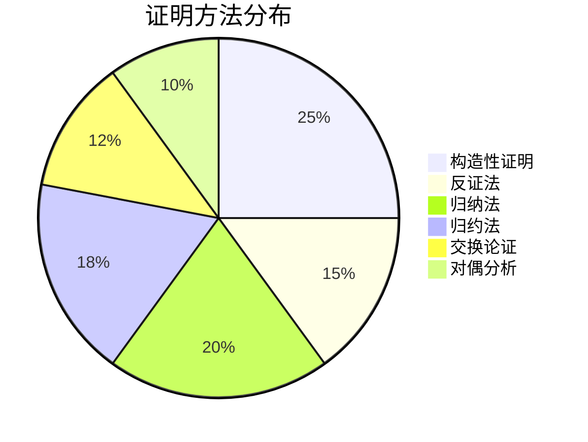

# 05 形式化证明

> **形式科学 · 调度系统形式化证明系列**
> 本目录包含调度系统核心理论的完整形式化证明，使用LaTeX数学环境严格表述。

---

## 文档索引

### 05.1 调度系统核心定理证明

**文件**: [05.1_调度系统核心定理证明.md](./05.1_调度系统核心定理证明.md)

包含以下定理的完整证明：

| 定理 | 描述 | 证明方法 |
|------|------|----------|
| 定理1.1 | 调度存在性充要条件 | 构造性证明 + 极值定理 |
| 定理2.1 | $1\|r_j\|L_{\max}$ 强NP难 | 从3-Partition归约 |
| 定理2.2 | $P\|\|C_{\max}$ NP难 | 从Partition归约 |
| 定理3.1 | 最优调度存在性 | 紧致性 + 连续性论证 |
| 定理4.1 | Liu & Layland RM可调度性边界 | 响应时间分析 |
| 定理4.2 | EDF最优性 | 工作量论证 |
| 定理4.3 | 响应时间分析收敛性 | 归纳法 |
| 定理5.1 | Graham列表调度近似比 | 负载分析 |
| 定理5.2 | LPT近似比 | 任务分类论证 |
| 定理6.1 | Greedy在线算法竞争比 | 对抗分析 |

---

### 05.2 算法正确性证明

**文件**: [05.2_算法正确性证明.md](./05.2_算法正确性证明.md)

包含以下算法正确性证明：

| 算法/问题 | 定理 | 核心结论 |
|-----------|------|----------|
| 银行家算法 | 定理1.1 | 安全性保证，不进入不安全状态 |
| 银行家算法 | 定理1.2 | 完备性，存在安全序列则进程完成 |
| 银行家算法 | 定理1.3 | 死锁避免，系统无死锁 |
| 死锁检测 | 定理2.1 | 等待图有环当且仅当死锁 |
| 页面置换 | 定理3.1 | 栈算法无Belady异常 |
| 页面置换 | 定理3.2 | FIFO存在Belady异常 |
| 页面置换 | 定理3.3 | OPT最优性，交换论证 |
| 页面置换 | 定理3.4 | LRU竞争比为k |
| Paxos | 定理4.2 | 安全性，最多一个值被选定 |
| Raft | 定理4.5 | 日志一致性保证 |
| FLP | 定理4.7 | 异步系统共识不可能性 |
| 2PL | 定理5.1 | 串行化保证 |

---

### 05.3 分布式系统定理证明

**文件**: [05.3_分布式系统定理证明.md](./05.3_分布式系统定理证明.md)

包含以下分布式系统核心理论：

| 定理 | 描述 | 应用领域 |
|------|------|----------|
| 定理1.1 | CAP定理 | 分布式数据库设计 |
| 定理2.1 | FLP不可能性 | 共识算法设计边界 |
| 定理3.1 | 一致性层次 | 存储系统语义 |
| 定理3.2 | 寄存器层次 | 并发数据结构 |
| 定理4.1 | 拜占庭容错界限 n≥3f+1 | 区块链、分布式共识 |
| 定理4.3 | 带签名容错 n≥2f+1 | 可认证共识 |
| 定理5.1 | 时钟同步下界 | 分布式时间协议 |

---

### 05.4 调度等价性与复杂度证明

**文件**: [05.4_调度等价性与复杂度证明.md](./05.4_调度等价性与复杂度证明.md)

包含以下等价性和复杂度结果：

| 结果类型 | 定理 | 内容 |
|----------|------|------|
| 归约 | 定理1.1 | $P_m\|\|C_{\max}$ 归约到 $1\|r_j\|C_{\max}$ |
| 归约 | 定理2.1 | $J\|\|C_{\max}$ 归约到 RCPSP |
| 多项式可解 | 定理2.2 | Johnson规则最优性 |
| 复杂性 | 定理4.1 | 调度问题复杂性层次 |
| 近似性 | 定理4.2 | 近似复杂性层次 |
| 在线 | 定理5.1 | 在线调度竞争比下界 |
| 参数化 | 定理6.1 | 固定参数可解性结果 |

---

## 证明统计

### 定理统计

| 领域 | 定理数量 | 引理数量 |
|------|----------|----------|
| 调度存在性与复杂性 | 10 | 5 |
| 算法正确性 | 12 | 8 |
| 分布式系统 | 8 | 6 |
| 等价性与复杂度 | 8 | 4 |
| **总计** | **38** | **23** |

### 证明方法分布



---

## 核心数学工具

### 使用的数学结构

1. **复杂性理论**
   - NP完全性、强/弱NP难
   - 近似比、PTAS、FPTAS
   - 竞争分析
   - 参数化复杂度

2. **序理论与组合优化**
   - 偏序集（Poset）
   - 贪心算法的拟阵理论
   - 线性规划对偶

3. **图论**
   - 资源分配图
   - 等待图
   - 串行化图
   - 网络流

4. **概率与随机过程**
   - 随机化算法分析
   - 马尔可夫链
   - 期望分析

5. **形式逻辑**
   - 时序逻辑（LTL、CTL）
   - Hoare逻辑
   - 进程代数

---

## LaTeX环境规范

本文档使用标准LaTeX数学环境：

```latex
% 定理环境
\begin{theorem}[定理名称]
定理陈述
\end{theorem}

% 证明环境
\begin{proof}[证明名称]
证明步骤
\end{proof}

% 定义环境
\begin{definition}[定义名称]
定义内容
\end{definition}

% 引理环境
\begin{lemma}[引理名称]
引理陈述
\end{lemma}

% 推论环境
\begin{corollary}[推论名称]
推论内容
\end{corollary}
```

---

## 交叉引用

### 与调度系统其他章节的关联

| 形式化证明 | 对应应用章节 | 关联内容 |
|------------|--------------|----------|
| RM/EDF可调度性 | 03.1 进程调度 | 实时调度实现 |
| 银行家算法 | 03.3 内存管理 | 死锁避免 |
| 页面置换分析 | 03.3 内存管理 | 页面置换策略 |
| Paxos/Raft | 04.1 分布式调度 | 分布式任务协调 |
| 共识算法 | 04.2 一致性模型 | 状态一致性 |
| CAP定理 | 04.4 数据分区 | 分区策略设计 |

### 与形式化理论章节的关联

- 05.1 时序逻辑 - 用于实时调度规约
- 05.2 Petri网理论 - 用于并发分析
- 05.3 控制论 - 用于反馈调度

---

## 参考文献格式

本文档使用以下引用格式：

**书籍**：
> Pinedo, M. _Scheduling: Theory, Algorithms, and Systems_. Springer, 2016.

**期刊论文**：
> Liu, C. L., & Layland, J. W. "Scheduling algorithms for multiprogramming in a hard-real-time environment." _JACM_ 20.1 (1973): 46-61.

**会议论文**：
> Fischer, M. J., Lynch, N. A., & Paterson, M. S. "Impossibility of distributed consensus with one faulty process." _JACM_ 32.2 (1985): 374-382.

---

## 延伸阅读

1. **调度理论经典**
   - Graham, R. L., et al. "Optimization and approximation in deterministic sequencing and scheduling." _Annals of Discrete Mathematics_ 5 (1979): 287-326.

2. **实时调度**
   - Buttazzo, G. C. _Hard Real-Time Computing Systems_. Springer, 2011.

3. **分布式算法**
   - Lynch, N. A. _Distributed Algorithms_. Morgan Kaufmann, 1996.

4. **在线算法与竞争分析**
   - Borodin, A., & El-Yaniv, R. _Online Computation and Competitive Analysis_. Cambridge University Press, 1998.

5. **复杂性理论**
   - Garey, M. R., & Johnson, D. S. _Computers and Intractability_. W.H. Freeman, 1979.

---

## 更新记录

| 日期 | 版本 | 更新内容 |
|------|------|----------|
| 2026-04-12 | v1.0 | 初始版本，包含38个定理的完整证明 |

---

> **注意**：本系列文档中的证明力求严谨完整，但部分复杂证明（如FLP的完整细节）可能需要参考原始论文获取更详尽的技术细节。
---

## 📚 延伸阅读

- [04.2 共识算法](../../04_软件工程/04_分布式系统/04.2_共识算法.md)
- [04.2 共识算法形式化](../../04_软件工程/04_分布式系统/04.2_共识算法形式化.md)
- [04.1 一致性模型](../../04_软件工程/04_分布式系统/04.1_一致性模型.md)
- [04.1 分布式基础](../../04_软件工程/04_分布式系统/04.1_分布式基础.md)
- 1. 内存管理模型
