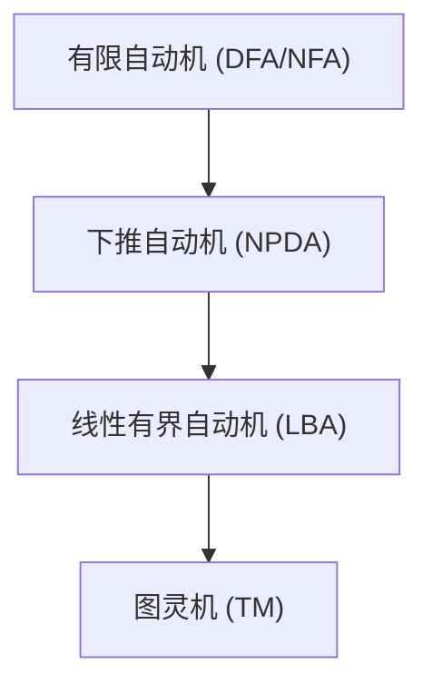
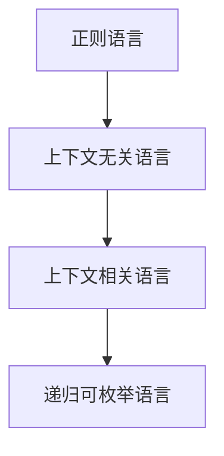
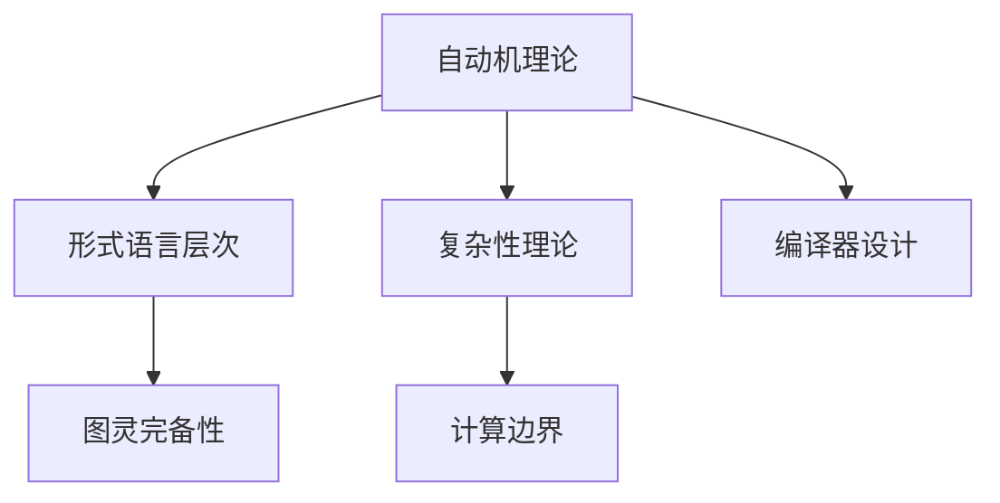

# 自动机理论（Automata Theory）

## 目录

- [自动机理论（Automata Theory）](#自动机理论automata-theory)
  - [目录](#目录)
  - [1. 概述](#1-概述)
  - [2. 有限自动机（Finite Automata）](#2-有限自动机finite-automata)
    - [2.1 DFA 与 NFA 定义与等价性](#21-dfa-与-nfa-定义与等价性)
    - [2.2 ε-NFA 及其消除](#22-ε-nfa-及其消除)
    - [2.3 正则语言与自动机](#23-正则语言与自动机)
  - [3. 下推自动机（Pushdown Automata）](#3-下推自动机pushdown-automata)
    - [3.1 DPDA 与 NPDA](#31-dpda-与-npda)
    - [3.2 上下文无关语言与自动机](#32-上下文无关语言与自动机)
  - [4. 图灵机（Turing Machine）](#4-图灵机turing-machine)
    - [4.1 标准图灵机与非确定性图灵机](#41-标准图灵机与非确定性图灵机)
    - [4.2 多带图灵机](#42-多带图灵机)
  - [5. 线性有界自动机（LBA）](#5-线性有界自动机lba)
  - [6. 自动机层次结构与复杂性](#6-自动机层次结构与复杂性)
    - [6.1 乔姆斯基层次与自动机](#61-乔姆斯基层次与自动机)
    - [6.2 计算复杂度表](#62-计算复杂度表)
    - [6.3 Mermaid 层次结构图](#63-mermaid-层次结构图)
  - [7. 自动机的应用](#7-自动机的应用)
    - [7.1 编译器设计](#71-编译器设计)
    - [7.2 形式验证](#72-形式验证)
  - [8. 哲学批判与主题联动](#8-哲学批判与主题联动)
    - [8.1 主题关联性Mermaid图](#81-主题关联性mermaid图)
    - [8.2 主题间表格对比](#82-主题间表格对比)
    - [8.3 批判性分析](#83-批判性分析)
  - [9. 结论](#9-结论)
  - [10. 参考文献](#10-参考文献)

## 1. 概述

自动机理论研究抽象计算模型与语言识别能力，是形式语言理论的基础。其核心问题包括不同自动机模型的定义、能力、相互关系及其在计算机科学中的应用。

## 2. 有限自动机（Finite Automata）

### 2.1 DFA 与 NFA 定义与等价性

- **DFA**：五元组 \( M = (Q, \Sigma, \delta, q_0, F) \)
- **NFA**：五元组 \( M = (Q, \Sigma, \delta, q_0, F) \)，其中 \( \delta: Q \times \Sigma \to 2^Q \)

| 类型 | 状态转移 | 接受能力 | 语言类 |
|------|----------|----------|--------|
| DFA  | 确定性   | 唯一路径 | 正则语言 |
| NFA  | 非确定性 | 多路径   | 正则语言 |

**定理**：DFA 与 NFA 等价。证明见子集构造法。

### 2.2 ε-NFA 及其消除

- **ε-NFA**：允许 ε-转移的 NFA。
- **ε-闭包**：ECLOSE(q) = {q} ∪ ∪_{p∈δ(q,ε)} ECLOSE(p)

**定理**：任意 ε-NFA 可等价转化为 NFA。

### 2.3 正则语言与自动机

- **正则语言**：可被 DFA/NFA/ε-NFA 识别。
- **正则表达式**：与有限自动机等价。

## 3. 下推自动机（Pushdown Automata）

### 3.1 DPDA 与 NPDA

- **DPDA**：确定性下推自动机，识别 DCFL。
- **NPDA**：非确定性下推自动机，识别 CFL。

| 类型 | 状态转移 | 栈操作 | 语言类 |
|------|----------|--------|--------|
| DPDA | 确定性   | 有     | DCFL   |
| NPDA | 非确定性 | 有     | CFL    |

**定理**：NPDA > DPDA，存在 NPDA 可识别但 DPDA 不可识别的语言。

### 3.2 上下文无关语言与自动机

- **上下文无关文法**与 NPDA 等价。
- **应用**：编程语言语法分析。

## 4. 图灵机（Turing Machine）

### 4.1 标准图灵机与非确定性图灵机

- **标准图灵机**：七元组 \( M = (Q, \Sigma, \Gamma, \delta, q_0, B, F) \)
- **非确定性图灵机**：转移函数为 \( \delta: Q \times \Gamma \to 2^{Q \times \Gamma \times \{L, R\}} \)

**定理**：非确定性图灵机与确定性图灵机等价。

### 4.2 多带图灵机

- **k-带图灵机**：多带可编码为单带。

**定理**：多带图灵机与单带图灵机等价。

## 5. 线性有界自动机（LBA）

- **LBA**：带长受限的图灵机，识别上下文敏感语言。

## 6. 自动机层次结构与复杂性

### 6.1 乔姆斯基层次与自动机

### 6.2 计算复杂度表

| 自动机类型 | 时间复杂度 | 空间复杂度 |
|-----------|-----------|-----------|
| DFA/NFA   | O(n)      | O(1)      |
| DPDA/NPDA | O(n³)     | O(n)      |
| LBA       | O(2^n)    | O(n)      |
| 图灵机    | 无界      | 无界      |

### 6.3 Mermaid 层次结构图

## 7. 自动机的应用

### 7.1 编译器设计

- **词法分析**：DFA
- **语法分析**：NPDA

### 7.2 形式验证

- **模型检查**：DFA
- **程序验证**：图灵机

## 8. 哲学批判与主题联动

### 8.1 主题关联性Mermaid图

### 8.2 主题间表格对比

| 主题         | 主要内容           | 关联领域         |
|--------------|--------------------|------------------|
| 自动机理论   | 计算模型、识别能力 | 形式语言、复杂性 |
| 形式语言层次 | 乔姆斯基结构、自动机 | 复杂性、语法分析 |
| 复杂性理论   | 计算资源、难度     | 自动机、计算边界 |

### 8.3 批判性分析

- 自动机理论揭示了计算能力的层次性与极限。
- 图灵机模型为"可计算性"与"不可判定性"提供了理论基础。
- 自动机与形式语言的联动为编程语言、人工智能等领域奠定了基础。
- 复杂性理论与自动机理论的结合，揭示了计算资源与问题难度的本质联系。

## 9. 结论

自动机理论构建了从有限状态到图灵完备的计算模型体系，是理解计算本质与形式语言层次的核心工具。其理论成果广泛应用于编译器、形式验证、人工智能等领域。

## 10. 参考文献

1. Hopcroft, J. E., Motwani, R., & Ullman, J. D. (2006). Introduction to automata theory, languages, and computation.
2. Sipser, M. (2012). Introduction to the theory of computation.
3. Chomsky, N. (1956). Three models for the description of language. IRE Transactions on information theory, 2(3), 113-124.
4. Turing, A. M. (1936). On computable numbers, with an application to the Entscheidungsproblem. Proceedings of the London mathematical society, 2(1), 230-265.
5. Kleene, S. C. (1956). Representation of events in nerve nets and finite automata. Automata studies, 34, 3-41.
