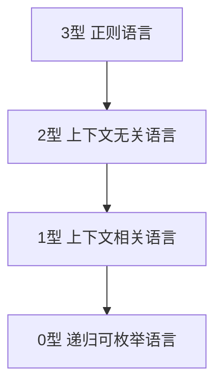
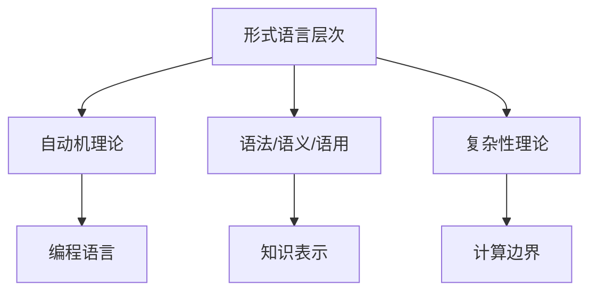

# 形式语言的理论模型与层次结构

(Language Hierarchy and Theoretical Models)

## 目录

- [形式语言的理论模型与层次结构](#形式语言的理论模型与层次结构)
  - [目录](#目录)
  - [1. 乔姆斯基层次结构（Chomsky Hierarchy）](#1-乔姆斯基层次结构chomsky-hierarchy)
    - [1.1 层次结构总览](#11-层次结构总览)
    - [1.2 各层次定义与特征](#12-各层次定义与特征)
      - [0型语言（递归可枚举语言）](#0型语言递归可枚举语言)
      - [1型语言（上下文相关语言）](#1型语言上下文相关语言)
      - [2型语言（上下文无关语言）](#2型语言上下文无关语言)
      - [3型语言（正则语言）](#3型语言正则语言)
    - [1.3 形式化表格与Mermaid图](#13-形式化表格与mermaid图)
  - [2. 形式语言的多层次模型](#2-形式语言的多层次模型)
    - [2.1 语言学层次模型](#21-语言学层次模型)
    - [2.2 计算机系统层次模型](#22-计算机系统层次模型)
    - [2.3 形式语义学模型](#23-形式语义学模型)
    - [2.4 系统与交互规约层次](#24-系统与交互规约层次)
  - [3. 形式语言与自动机理论的对应关系](#3-形式语言与自动机理论的对应关系)
  - [4. 形式语言在软件工程中的应用](#4-形式语言在软件工程中的应用)
    - [4.1 编程语言设计](#41-编程语言设计)
    - [4.2 形式化方法与验证](#42-形式化方法与验证)
    - [4.3 领域特定语言(DSL)](#43-领域特定语言dsl)
  - [5. 形式语言与图科学的交叉](#5-形式语言与图科学的交叉)
    - [5.1 图语法与图转换系统](#51-图语法与图转换系统)
    - [5.2 知识图谱层次结构](#52-知识图谱层次结构)
  - [6. 形式语言的理论边界与局限性](#6-形式语言的理论边界与局限性)
    - [6.1 计算理论限制](#61-计算理论限制)
    - [6.2 认知与哲学维度](#62-认知与哲学维度)
  - [7. 表示论视角下的形式语言](#7-表示论视角下的形式语言)
  - [8. 主题间关联性与哲学批判](#8-主题间关联性与哲学批判)
    - [8.1 主题关联性Mermaid图](#81-主题关联性mermaid图)
    - [8.2 主题间表格对比](#82-主题间表格对比)
    - [8.3 主题间批判性分析](#83-主题间批判性分析)
  - [9. 结论](#9-结论)

## 1. 乔姆斯基层次结构（Chomsky Hierarchy）

### 1.1 层次结构总览

乔姆斯基层次结构是形式语言理论的核心框架，将语言按照其生成文法的复杂性和表达能力分为四个层次：

### 1.2 各层次定义与特征

#### 0型语言（递归可枚举语言）

- **文法规则**：无限制文法（α → β，α非空）
- **识别装置**：图灵机（Turing Machine）
- **计算能力**：图灵完备，能表达所有可计算问题
- **应用**：通用计算、编程语言的理论基础

#### 1型语言（上下文相关语言）

- **文法规则**：上下文相关文法（αAβ → αγβ）
- **识别装置**：线性有界自动机（Linear Bounded Automaton）
- **计算能力**：非确定性线性空间
- **应用**：自然语言处理中的复杂语法结构

#### 2型语言（上下文无关语言）

- **文法规则**：上下文无关文法（A → γ）
- **识别装置**：下推自动机（Pushdown Automaton）
- **计算能力**：能处理嵌套结构
- **应用**：编程语言的语法分析、表达式解析

#### 3型语言（正则语言）

- **文法规则**：正则文法（A → aB 或 A → a）
- **识别装置**：有限状态自动机（Finite State Automaton）
- **计算能力**：有限状态，无记忆能力
- **应用**：词法分析、模式匹配、正则表达式

### 1.3 形式化表格与Mermaid图

| 层次 | 语言类型 | 文法 | 自动机 | 计算能力 | 应用 |
|------|----------|------|--------|----------|------|
| 0型  | 递归可枚举 | 无限制 | 图灵机 | 图灵完备 | 通用计算 |
| 1型  | 上下文相关 | 上下文相关 | 线性有界自动机 | 线性空间 | 复杂语法 |
| 2型  | 上下文无关 | 上下文无关 | 下推自动机 | 嵌套结构 | 语法分析 |
| 3型  | 正则语言 | 正则 | 有限自动机 | 有限状态 | 词法分析 |

## 2. 形式语言的多层次模型

### 2.1 语言学层次模型

- **符号层**：基本符号集合（字母表）
- **语法层**：符号组合规则
- **语义层**：赋予语法结构意义
- **语用层**：语言在上下文中的使用

### 2.2 计算机系统层次模型

- **机器语言层**：二进制指令，直接由硬件执行
- **汇编语言层**：机器指令的符号表示
- **系统编程语言层**（C, Rust）：提供硬件抽象
- **高级编程语言层**（Java, Python）：高度抽象
- **领域特定语言层**（SQL, HTML）：针对特定领域
- **元语言层**（BNF, 元编程语言）：用于定义其他语言

### 2.3 形式语义学模型

- **操作语义**：通过状态转换描述程序执行（"如何执行"）
- **指称语义**：将程序映射到数学对象（"是什么"）
- **公理语义**：通过逻辑断言描述程序行为（"产生什么效果"）

### 2.4 系统与交互规约层次

- **建模语言**（UML, SysML）：描述系统结构和行为
- **规约语言**（Z, TLA+）：精确描述系统需求和属性
- **接口描述语言**（Protocol Buffers, OpenAPI）：定义组件间通信

## 3. 形式语言与自动机理论的对应关系

| 语言类型 | 自动机类型 | 存储能力 | 计算复杂性 |
|---------|-----------|---------|-----------|
| 正则语言 | 有限自动机 | 无额外存储 | O(n)，线性时间 |
| 上下文无关语言 | 下推自动机 | 栈存储 | O(n³)，多项式时间 |
| 上下文相关语言 | 线性有界自动机 | 有限线性存储 | PSPACE-完全 |
| 递归可枚举语言 | 图灵机 | 无限存储 | 不可判定 |

## 4. 形式语言在软件工程中的应用

### 4.1 编程语言设计

- **语法设计**：基于上下文无关文法
- **类型系统**：基于类型理论和逻辑
- **语义定义**：通过形式语义学模型

### 4.2 形式化方法与验证

- **形式规范**：Z表示法、VDM、B方法
- **程序逻辑**：霍尔逻辑、分离逻辑、时态逻辑
- **验证技术**：定理证明、模型检查、抽象解释

### 4.3 领域特定语言(DSL)

- **内部DSL**：嵌入宿主语言
- **外部DSL**：独立语言
- **语言工作台**：DSL开发环境

## 5. 形式语言与图科学的交叉

### 5.1 图语法与图转换系统

- **节点标记图语法**
- **边标记图语法**
- **超边替换图语法**

### 5.2 知识图谱层次结构

- **实体层**：基本概念单元
- **关系层**：实体间联系
- **本体层**：领域概念体系
- **推理层**：基于规则的知识扩展

## 6. 形式语言的理论边界与局限性

### 6.1 计算理论限制

- **不可判定性**：图灵停机问题、Rice定理
- **计算复杂性**：NP完全性、PSPACE完全性
- **表达能力边界**：各层次语言的表达限制

### 6.2 认知与哲学维度

- **符号接地问题**：形式符号与现实意义的联系
- **默会知识**：难以形式化的隐性知识
- **具身认知**：形式语言难以捕捉的体验维度

## 7. 表示论视角下的形式语言

- **语法表示层**：符号的形式结构
- **语义表示层**：符号与意义的映射
- **语用表示层**：符号在上下文中的使用
- **元表示层**：关于表示本身的表示

计算表示理论提供了评估形式语言表示能力的框架：

- **表示充分性**：能够表达的内容范围
- **计算充分性**：支持的计算操作
- **启发充分性**：对问题解决的引导作用

## 8. 主题间关联性与哲学批判

### 8.1 主题关联性Mermaid图

### 8.2 主题间表格对比

| 主题         | 主要内容           | 关联领域         |
|--------------|--------------------|------------------|
| 形式语言层次 | 乔姆斯基结构、自动机 | 复杂性、语法分析 |
| 自动机理论   | 识别能力、计算模型 | 形式语言、复杂性 |
| 语法/语义/语用 | 语言多层次结构     | 编程语言、知识表示 |
| 复杂性理论   | 计算资源、难度     | 自动机、计算边界 |

### 8.3 主题间批判性分析

- 乔姆斯基层次结构揭示了"表达能力与计算能力的权衡"，为理论计算机科学和编程语言设计提供了基础。
- 形式语言的多层次模型反映了从符号到语用、从机器到知识的抽象演进。
- 计算理论边界和认知哲学问题提示了形式化方法的极限与未来挑战。

## 9. 结论

形式语言在计算机科学和软件工程中构建了从理论到实践的完整知识体系。乔姆斯基层次结构为理解语言表达能力提供了基础框架，而多维度的层次模型则揭示了形式语言在不同应用场景中的丰富性。这些理论模型不仅解释了计算机系统的基本原理，也为人工智能、知识表示等前沿领域提供了形式化基础。

形式语言的层次结构反映了计算能力与表达能力之间的根本权衡，也体现了从抽象到具体、从理论到应用的知识演进路径。通过理解这些层次结构和理论模型，我们能更深入地把握形式语言的本质特性和应用潜力。
