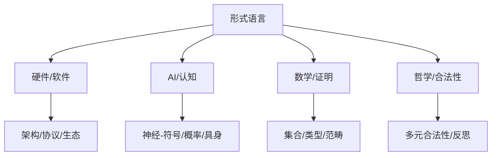

# 形式语言的多维批判性分析：从基础理论到应用实践

## 目录

- [形式语言的多维批判性分析：从基础理论到应用实践](#形式语言的多维批判性分析从基础理论到应用实践)
  - [目录](#目录)
  - [1. 引言：形式语言的本质与批判视角](#1-引言形式语言的本质与批判视角)
  - [2. 形式语言与计算机硬件](#2-形式语言与计算机硬件)
  - [3. 形式语言与计算机软件](#3-形式语言与计算机软件)
  - [4. 形式语言与AI模型](#4-形式语言与ai模型)
  - [5. 形式语言与认知结构模型](#5-形式语言与认知结构模型)
  - [6. 形式语言的建模与验证](#6-形式语言的建模与验证)
  - [7. 形式语言与程序验证](#7-形式语言与程序验证)
  - [8. 形式语言与数学的关系](#8-形式语言与数学的关系)
  - [9. 综合分析与未来展望](#9-综合分析与未来展望)
  - [10. 结论：形式语言的批判性综合视角](#10-结论形式语言的批判性综合视角)
  - [11. 形式语言合法性的多元来源与哲学反思](#11-形式语言合法性的多元来源与哲学反思)
    - [11.1 合法性的多元来源](#111-合法性的多元来源)
    - [11.2 合法性的哲学反思](#112-合法性的哲学反思)
  - [多维主题关联性Mermaid图](#多维主题关联性mermaid图)
  - [主题间对比表](#主题间对比表)
  - [主题间批判性分析](#主题间批判性分析)

---

## 1. 引言：形式语言的本质与批判视角

- 形式语言是精确定义的符号系统，区别于自然语言的无歧义性和形式化特性。
- 其批判性分析需关注历史、文化、认知等多重限制。

## 2. 形式语言与计算机硬件

- 硬件描述语言（HDL）、布尔代数、状态机模型等形式系统在硬件设计与验证中的应用。
- 指令集架构（ISA）作为形式语言，微架构的形式化描述与验证。
- 专用处理器（GPU/TPU/DSA）与领域特定形式模型。
- 通信协议的形式化规范与验证。

## 3. 形式语言与计算机软件

- 形式化规范（Z、VDM、Alloy）、设计（CSP、π演算）、验证（霍尔逻辑、分离逻辑）、轻量级形式化方法。
- 编程语言的语法、语义、类型系统的形式化基础。
- 软件架构描述语言（ADL）、设计模式、微服务、架构风格的形式化。
- API契约、生态依赖、开源许可的形式化。

## 4. 形式语言与AI模型

- LLM中的表征空间、注意力机制的形式化解释、上下文窗口的形式约束。
- 神经网络与符号系统的张力与融合、可解释性问题。
- 概率图模型、生成模型、概率编程语言、贝叶斯推理的形式化。
- AI代码生成、神经-符号混合、AI辅助形式验证。

## 5. 形式语言与认知结构模型

- 意识结构的形式化（模态/时态逻辑、自指系统、注意力机制）。
- 具身认知理论对形式系统的挑战与补充。
- 时空认知的形式化模型（空间关系、时态逻辑、叙事结构）。
- 反身性与自指性系统（哥德尔、类型论、AI自指结构）。

## 6. 形式语言的建模与验证

- 公理化方法、模型检验、类型论证明、自动定理证明、交互式证明辅助。
- 分布式系统与区块链的形式化验证、共识模型分析、FLP不可能性定理。
- 形式化验证的局限性（实现鸿沟、规范正确性、可扩展性、环境假设、社会语境）。

## 7. 形式语言与程序验证

- 控制流图、操作/指称/公理语义、抽象解释。
- 类型系统的理论基础（类型论、类型安全、柯里-霍华德同构）。
- 程序逻辑（霍尔逻辑、分离逻辑、时态逻辑、契约设计、精化演算）。
- 形式化验证工具生态（Coq、Isabelle、Lean、SPIN、Z3、Why3等）。

## 8. 形式语言与数学的关系

- 集合论、类型论、范畴论等作为数学基础的形式系统。
- 数学证明与形式化证明的差异（结构、风格、认知、社会层面）。
- 形式化数学的挑战与前景（规模、表达、工具、自动化、教育、实践变革）。
- 数学实践中的非形式因素（美学、创造性、社会历史、认知经济、概念形成）。

## 9. 综合分析与未来展望

- 哥德尔不完备、语义闭合、表达力边界、操作化简化、解释依赖等哲学局限。
- 形式语言与现实世界映射的挑战（抽象简化、本体论、动态系统、价值负载、情境知识）。
- 未来趋势：AI与形式方法融合、认知转向、工具民主化、生物/社会科学、量子计算、形式语言多样化。
- 跨学科整合前景（认知科学、计算机与数学、哲学、自然语言、复杂系统科学）。

## 10. 结论：形式语言的批判性综合视角

- 形式语言是多维认知工具，兼具符号系统、认知工具、技术基础和文化实践多重属性。
- 存在确定性与创造性、精确性与表达力等多重张力。
- 认知基础、历史演化、社会共识等多元合法性。
- 未来发展需批判反思、跨学科整合、多元创新。

## 11. 形式语言合法性的多元来源与哲学反思

### 11.1 合法性的多元来源

| 来源         | 说明                                                         |
|--------------|--------------------------------------------------------------|
| 一致性       | 内部无矛盾性，哥德尔定理限制                                 |
| 实用有效性   | 科学建模、推理验证、算法实现中的有效性                       |
| 社会共识     | 学术机构、专家社区、同行评审                                 |
| 认知自然性   | 与人类推理、空间、语言等认知结构的自然对应                   |
| 历史演化     | 经受历史淘汰和批判修正的理论结构                             |
| 元理论保证   | 完备性、可靠性、表达力等元理论性质的证明                     |

### 11.2 合法性的哲学反思

- 逻辑实证主义、构造主义、柏拉图主义、自然主义、批判理性主义、实用主义等多元哲学视角。
- 合法性既有内部一致性，也有外部实践有效性、认知自然性、社会制度性、历史演化性和元理论保证。
- 形式语言的合法性是多元、动态、历史性和实践性的。

---

## 多维主题关联性Mermaid图

---

## 主题间对比表

| 主题         | 主要内容           | 关联领域         |
|--------------|--------------------|------------------|
| 形式语言     | 符号系统、认知工具 | 数学、AI、哲学   |
| 硬件/软件    | HDL、ISA、API      | 形式验证、架构   |
| AI/认知      | LLM、神经-符号     | 认知科学、推理   |
| 数学/证明    | 集合、类型、范畴   | 形式化、教育     |
| 哲学/合法性  | 合法性、反思       | 认识论、科学哲学 |

---

## 主题间批判性分析

- 形式语言的多维性和张力决定了其理论与应用的复杂性。
- 合法性既依赖于内部一致性，也依赖于外部实践、认知和社会历史。
- 未来发展需关注AI融合、认知转向、工具民主化和跨学科整合。
- 哲学反思是推动形式语言理论创新和实践扩展的关键动力。
