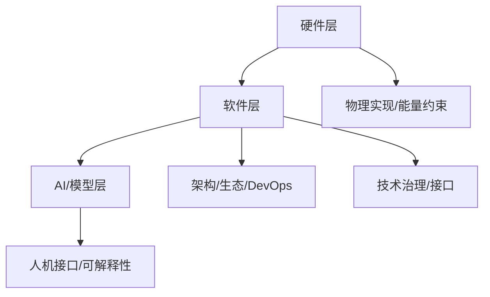

# 形式语言的多维技术生态批判性分析

## 目录

- [形式语言的多维技术生态批判性分析](#形式语言的多维技术生态批判性分析)
  - [目录](#目录)
  - [1. 引言：形式语言的技术维度](#1-引言形式语言的技术维度)
  - [2. 形式语言与计算机硬件](#2-形式语言与计算机硬件)
  - [3. 形式语言与计算机软件](#3-形式语言与计算机软件)
  - [4. 形式语言与AI模型](#4-形式语言与ai模型)
  - [5. 形式语言的技术生态整合分析](#5-形式语言的技术生态整合分析)
    - [技术生态多层次Mermaid图](#技术生态多层次mermaid图)
  - [主题间对比表](#主题间对比表)
  - [6. 结论：形式语言的技术哲学反思](#6-结论形式语言的技术哲学反思)

---

## 1. 引言：形式语言的技术维度

- 形式语言不仅是理论构造，更是现代技术世界的基础设施。
- 贯穿硬件、软件、AI等多层次技术栈，体现抽象与物理、理论与工程的多重张力。

## 2. 形式语言与计算机硬件

- 布尔逻辑到物理电路的映射，物理约束对形式系统的限制。
- 处理器架构的多层次形式语言（微架构、ISA、专用处理器）。
- 专用硬件加速器（NPU/TPU/FPGA/量子计算）与形式优化。
- 硬件验证中的形式方法（模型检验、定理证明、硬件安全分析）。

## 3. 形式语言与计算机软件

- 编程语言的语法、语义、类型系统的形式化基础。
- 软件架构描述语言、设计模式、微服务、事件驱动架构的形式模型。
- 形式化方法在软件工程中的应用与局限（规约、验证、轻量级方法、工业应用）。
- 软件生态系统中的形式语言（API契约、依赖图、开源协作、DevOps、基础设施即代码）。

## 4. 形式语言与AI模型

- 语言模型的形式基础（乔姆斯基层次、n-gram、Transformer、概率分布）。
- 多模态AI与形式表征的转换（文本-图像-音频的映射、VQA、多模态推理）。
- AI系统的形式推理能力与局限（神经-符号系统、链式思考、形式验证、统计与逻辑的张力）。
- 形式语言作为AI与人类的接口（自然语言、编程语言、交互式证明、可解释性）。

## 5. 形式语言的技术生态整合分析

- 从硬件到软件的形式语言层次转换（编译器、虚拟机、HAL等系统性映射）。
- 软件与AI系统的形式语言交互（API、提示工程、AI辅助开发与验证）。
- 技术栈中的垂直整合与端到端形式化（接口一致性、版本兼容、治理工具）。

### 技术生态多层次Mermaid图

---

## 主题间对比表

| 层次         | 主要内容           | 关键张力/挑战         |
|--------------|--------------------|----------------------|
| 硬件         | 物理实现、布尔逻辑 | 能量/材料/物理约束   |
| 软件         | 语法、架构、生态   | 形式-实用、复杂性    |
| AI/模型      | 统计、推理、接口   | 统计-逻辑、解释性    |
| 技术整合     | 层次映射、治理     | 端到端一致性、兼容性 |

---

## 6. 结论：形式语言的技术哲学反思

- 形式语言的物理实现受限于能量、材料和物理定律，抽象层次与物理效率存在内在权衡。
- 形式严格性与实用性之间存在动态张力，技术形式语言是二者平衡的产物。
- 技术栈的核心是不同抽象层次形式语言之间的可靠映射与信息转换。
- AI系统展示了形式结构可通过非形式化过程涌现，挑战了传统形式系统观。
- 形式语言既是技术工具，也是社会协作与治理的媒介，需综合技术与社会文化视角评估。
- 未来发展趋势是更高适应性与整合性，融合严谨性与灵活性，推动认知与技术的深度互动。
