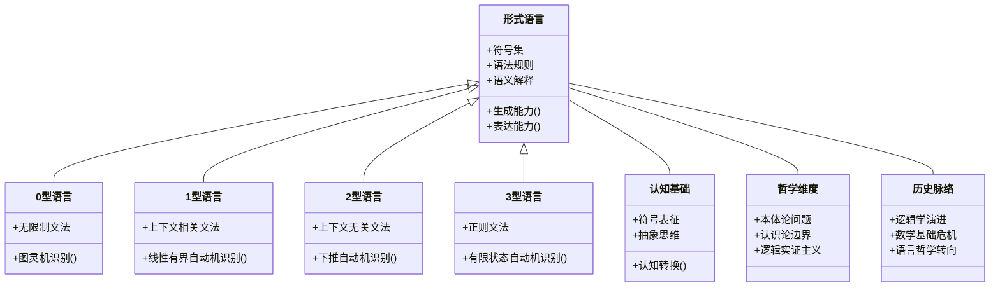

# 形式语言的综合批判分析

## 目录

- [形式语言的综合批判分析](#形式语言的综合批判分析)
  - [目录](#目录)
  - [1. 引言](#1-引言)
  - [2. 形式语言的基础理论框架](#2-形式语言的基础理论框架)
  - [3. 形式语言的认知基础](#3-形式语言的认知基础)
  - [4. 形式语言的哲学维度](#4-形式语言的哲学维度)
  - [5. 形式语言的核心定理与隐喻](#5-形式语言的核心定理与隐喻)
  - [6. 形式语言的多层次表征](#6-形式语言的多层次表征)
  - [7. 形式语言的历史发展脉络](#7-形式语言的历史发展脉络)
  - [8. 形式语言的合法性与局限性](#8-形式语言的合法性与局限性)
  - [9. 形式语言的当代应用与发展](#9-形式语言的当代应用与发展)
  - [10. 结论：形式语言的综合评价](#10-结论形式语言的综合评价)
  - [主题结构Mermaid图](#主题结构mermaid图)
  - [形式语言类型与认知结构类图](#形式语言类型与认知结构类图)

---

## 1. 引言

- 形式语言是数学、逻辑、计算机科学等领域的基础工具，也是认知与哲学反思的重要对象。
- 本文综合考察其理论结构、认知基础、哲学内涵、历史演化、合法性与局限性。

## 2. 形式语言的基础理论框架

- 形式语言的定义、分类（乔姆斯基谱系）、语法与语义、自动机模型。
- 语法-语义二元关系、模型论与证明论。
- 乔姆斯基层次结构表：

| 语言类型 | 文法特征 | 识别装置 | 计算能力 |
|---------|---------|---------|---------|
| 0型语言 | 无限制文法 | 图灵机 | 图灵完备 |
| 1型语言 | 上下文相关文法 | 线性有界自动机 | 非确定性线性空间 |
| 2型语言 | 上下文无关文法 | 下推自动机 | 非确定性栈空间 |
| 3型语言 | 正则文法 | 有限状态自动机 | 有限状态 |

## 3. 形式语言的认知基础

- 符号系统与人脑认知、抽象与具象的认知转换、形式语言作为思维工具。
- 认知神经科学支持、抽象化、精确性、系统性、生产性。
- 认知转换流程：

## 4. 形式语言的哲学维度

- 逻辑实证主义、构造主义、结构主义等哲学流派。
- 本体论问题（符号与实在）、认识论边界（确定性、不完备性、可证明性）。
- 哥德尔不完备定理、图灵停机问题、不确定性原理的哲学隐喻。

## 5. 形式语言的核心定理与隐喻

- 哥德尔不完备定理：思维超越形式化、真理超越证明、自我指涉悖论、开放性与不确定性。
- 图灵停机问题：不可计算性、形式化方法的极限。
- 不确定性原理：表达力与决定性、完备性与一致性、精确性与普遍性的张力。

## 6. 形式语言的多层次表征

- 句法层（符号与规则）、语义层（指称与真值）、语用层（应用情境、交际功能、语境依赖、实用价值）。
- 形式语言与自然语言的对比表：

| 形式语言特征 | 自然语言特征 |
|------------|------------|
| 精确性 | 模糊性 |
| 上下文独立 | 上下文敏感 |
| 有限规则 | 开放规则 |
| 明确语义 | 多义性 |
| 静态结构 | 动态演化 |

## 7. 形式语言的历史发展脉络

- 从亚里士多德三段论到弗雷格、希尔伯特纲领、哥德尔、维特根斯坦。
- 逻辑学、集合论、数理逻辑、语言哲学的演进。
- 维特根斯坦的语言游戏理论对形式主义的批判。

## 8. 形式语言的合法性与局限性

- 自我指涉问题（罗素悖论、理查德悖论、说谎者悖论）。
- 形式语言与自然语言的鸿沟、直觉与创造性思维的不可形式化。
- 默会知识、隐性知识、数学直觉主义。

## 9. 形式语言的当代应用与发展

- 编程语言、自动推理、形式验证、机器学习、人工智能。
- 科学哲学中的地位转变，跨学科（认知科学、语言学、计算语言学、生物语言学）。
- 符号推理与统计学习的融合趋势。

## 10. 结论：形式语言的综合评价

- 形式语言是认知工具箱中的特殊工具，既有无可替代的优势，也有内在局限。
- 应避免绝对化或全盘否定，需与隐喻、叙事、直觉等认知方式互补。
- 研究具有技术、哲学、认知多重意义，是连接数学、逻辑、哲学、认知科学和计算机科学的重要桥梁。

---

## 主题结构Mermaid图

```mermaid
graph TD
    A["形式语言理论体系"] --> B["基础理论框架"]
    A --> C["认知基础"]
    A --> D["哲学维度"]
    A --> E["核心定理与隐喻"]
    A --> F["多层次表征"]
    A --> G["历史发展脉络"]
    A --> H["合法性与局限性"]
    A --> I["当代应用与发展"]
    
    B --> B1["定义与分类"]
    B --> B2["语法与语义"]
    B --> B3["乔姆斯基谱系"]
    
    C --> C1["符号系统与认知"]
    C --> C2["思维工具"]
    C --> C3["认知转换"]
    
    D --> D1["逻辑实证主义"]
    D --> D2["本体论问题"]
    D --> D3["认识论边界"]
    
    E --> E1["哥德尔不完备定理"]
    E --> E2["图灵停机问题"]
    E --> E3["不确定性原理"]
    
    F --> F1["句法层面"]
    F --> F2["语义层面"]
    F --> F3["语用层面"]
    
    G --> G1["亚里士多德-弗雷格"]
    G --> G2["希尔伯特纲领"]
    G --> G3["维特根斯坦转向"]
    
    H --> H1["自我指涉"]
    H --> H2["与自然语言的鸿沟"]
    H --> H3["超越形式主义"]
    
    I --> I1["计算理论与AI"]
    I --> I2["科学哲学地位"]
    I --> I3["跨学科视角"]
```

---

## 形式语言类型与认知结构类图

