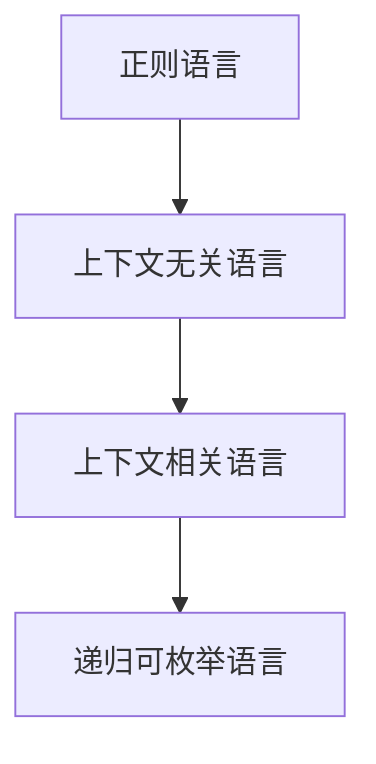

# 形式语言与计算机科学的多维批判性综合分析

## 目录

- [形式语言与计算机科学的多维批判性综合分析](#形式语言与计算机科学的多维批判性综合分析)
  - [目录](#目录)
  - [1. 引言：形式语言的本质与多维意义](#1-引言形式语言的本质与多维意义)
  - [2. 形式语言的理论基础与层次结构](#2-形式语言的理论基础与层次结构)
    - [2.1 形式语言的严格定义与系统要素](#21-形式语言的严格定义与系统要素)
    - [2.2 乔姆斯基层次结构与自动机模型](#22-乔姆斯基层次结构与自动机模型)
    - [2.3 形式系统的构成与表达能力](#23-形式系统的构成与表达能力)
  - [3. 形式语言与计算机硬件](#3-形式语言与计算机硬件)
    - [3.1 逻辑门与布尔代数的物理实现](#31-逻辑门与布尔代数的物理实现)
    - [3.2 指令集架构与专用处理器](#32-指令集架构与专用处理器)
    - [3.3 通信协议与物理约束](#33-通信协议与物理约束)
  - [4. 形式语言与计算机软件](#4-形式语言与计算机软件)
    - [4.1 编程语言的形式化与类型系统](#41-编程语言的形式化与类型系统)
    - [4.2 软件架构与API的形式化表达](#42-软件架构与api的形式化表达)
    - [4.3 软件生态系统的复杂性与局限](#43-软件生态系统的复杂性与局限)
  - [5. 形式语言与AI模型](#5-形式语言与ai模型)
    - [5.1 符号主义、连接主义与神经符号整合](#51-符号主义连接主义与神经符号整合)
    - [5.2 大语言模型与统计推理的挑战](#52-大语言模型与统计推理的挑战)
    - [5.3 概率模型与多模态AI](#53-概率模型与多模态ai)
  - [6. 形式语言与认知结构](#6-形式语言与认知结构)
    - [6.1 认知表征的多模态性](#61-认知表征的多模态性)
    - [6.2 意向性、反身性与具身认知](#62-意向性反身性与具身认知)
    - [6.3 形式化的认知边界](#63-形式化的认知边界)
  - [7. 形式语言的建模、验证与证明](#7-形式语言的建模验证与证明)
    - [7.1 形式化验证与模型检测](#71-形式化验证与模型检测)
    - [7.2 分布式系统与共识协议](#72-分布式系统与共识协议)
    - [7.3 程序-证明同构与Curry-Howard](#73-程序-证明同构与curry-howard)
  - [8. 形式语言与数学的关系](#8-形式语言与数学的关系)
    - [8.1 形式主义、类型论与范畴论](#81-形式主义类型论与范畴论)
    - [8.2 哥德尔不完备性与理论边界](#82-哥德尔不完备性与理论边界)
    - [8.3 数学与计算的异同](#83-数学与计算的异同)
  - [9. 综合批判与未来展望](#9-综合批判与未来展望)
    - [9.1 工具性、局限性与多范式生态](#91-工具性局限性与多范式生态)
    - [9.2 统一理论的可能与不可能](#92-统一理论的可能与不可能)
    - [9.3 未来发展趋势与哲学反思](#93-未来发展趋势与哲学反思)

---

## 1. 引言：形式语言的本质与多维意义

形式语言作为计算机科学、数学、逻辑、认知科学等领域的基础工具，具有精确性、无歧义性和形式化的符号操作特征。它不仅是理论推理的载体，也是工程实现的基石。随着AI、分布式系统、认知建模等领域的发展，形式语言的角色和边界不断被拓展和挑战。

## 2. 形式语言的理论基础与层次结构

### 2.1 形式语言的严格定义与系统要素

- **定义**：形式语言是由有限字母表、生成规则（文法）、语义解释系统组成的符号串集合。
- **系统要素**：
  - 字母表 Σ
  - 语法规则 G
  - 语义系统 S

### 2.2 乔姆斯基层次结构与自动机模型

| 语言类型 | 文法特征 | 识别装置 | 计算能力 |
|----------|----------|----------|----------|
| 0型      | 无限制文法 | 图灵机   | 图灵完备 |
| 1型      | 上下文相关 | 线性有界自动机 | PSPACE |
| 2型      | 上下文无关 | 下推自动机 | 多项式 |
| 3型      | 正则文法   | 有限自动机 | 线性 |

- **嵌套关系图**：

### 2.3 形式系统的构成与表达能力

- 语言层（表达内容范围）
- 公理层（基本真理）
- 规则层（推理步骤）
- 表达能力与计算复杂性的权衡

## 3. 形式语言与计算机硬件

### 3.1 逻辑门与布尔代数的物理实现

- 布尔代数通过逻辑门在硬件中实现
- 物理约束（速度、能耗、量子效应）对形式系统的影响

### 3.2 指令集架构与专用处理器

- ISA作为软硬件契约的形式语言
- GPU/TPU等专用处理器与领域特定形式模型的共进化
- 量子计算对传统形式语言的挑战

### 3.3 通信协议与物理约束

- 协议分层与有限状态机
- 物理实现对协议形式化的限制

## 4. 形式语言与计算机软件

### 4.1 编程语言的形式化与类型系统

- 语法（BNF）、语义（操作/指称/公理）、类型系统
- 类型系统与Curry-Howard同构
- 形式严谨性与实用性的权衡

### 4.2 软件架构与API的形式化表达

- 架构描述语言（ADL）、接口描述语言（IDL）
- 设计模式与半形式化表达
- 抽象层次与"抽象泄露"

### 4.3 软件生态系统的复杂性与局限

- 组件化、API契约、依赖管理
- 生态系统的开放性、异质性与演化
- 形式化方法的边界

## 5. 形式语言与AI模型

### 5.1 符号主义、连接主义与神经符号整合

- 符号AI（形式逻辑、专家系统）
- 连接主义（神经网络、统计学习）
- 神经符号AI的理论挑战

### 5.2 大语言模型与统计推理的挑战

- LLM的概率性与形式规则的隐式学习
- 可解释性、可验证性与黑箱问题

### 5.3 概率模型与多模态AI

- 概率图模型、概率编程语言
- 多模态AI与跨模态表征

## 6. 形式语言与认知结构

### 6.1 认知表征的多模态性

- 命题、图像、感知、情感、身体表征
- 多模态性对形式化模型的挑战

### 6.2 意向性、反身性与具身认知

- 意向性（指向性）、反身性（自指）
- 具身认知与符号接地问题
- 形式系统的自我指涉与哥德尔定理

### 6.3 形式化的认知边界

- 形式语言的认知增强作用
- 默会知识与非形式化经验
- 还原论与模型隐喻的风险

## 7. 形式语言的建模、验证与证明

### 7.1 形式化验证与模型检测

- 形式规约、模型检测、定理证明
- 状态空间爆炸与可扩展性
- 规约正确性与"specification is the new bug"

### 7.2 分布式系统与共识协议

- Paxos、Raft、区块链共识的形式化
- 智能合约与不可篡改性

### 7.3 程序-证明同构与Curry-Howard

- 程序=证明，类型=命题
- 依赖类型与形式化验证

## 8. 形式语言与数学的关系

### 8.1 形式主义、类型论与范畴论

- 数学与形式语言的共同逻辑根基
- 类型论、范畴论的统一视角

### 8.2 哥德尔不完备性与理论边界

- 不完备性定理对形式系统的根本限制
- 形式系统的开放性与局部性

### 8.3 数学与计算的异同

- 数学作为对象，计算作为工具
- 操作语义与抽象结构的差异

## 9. 综合批判与未来展望

### 9.1 工具性、局限性与多范式生态

- 形式语言的强大与边界
- 多范式、多层次、多模态的复杂生态

### 9.2 统一理论的可能与不可能

- 普适形式语言的梦想与哥德尔幽灵
- 领域特定语言与碎片化趋势

### 9.3 未来发展趋势与哲学反思

- AI与统计模型对形式语言的挑战
- 形式化与非形式化的融合前景
- 哲学批判与跨学科整合

---

> **进度追踪**：本文件系统性整合了 /docs/FormalLanguage/CS 目录下主要理论批判与综合分析内容，已完成多维主题的学术化升级。后续可针对特定子主题（如AI、认知、分布式系统等）进一步细化多模态表达与案例分析。
