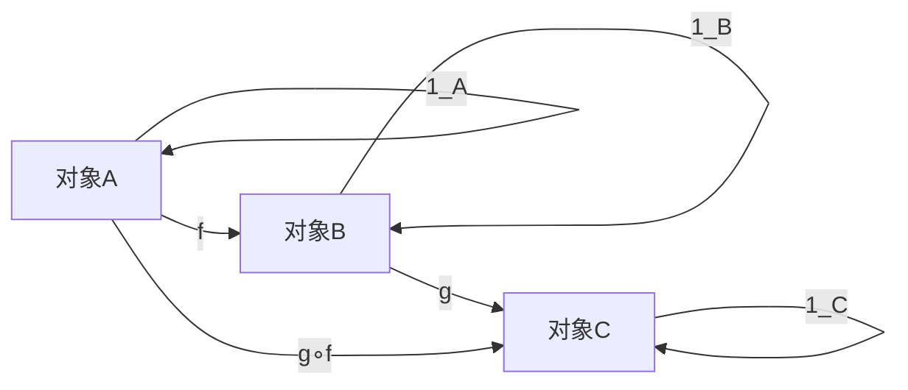
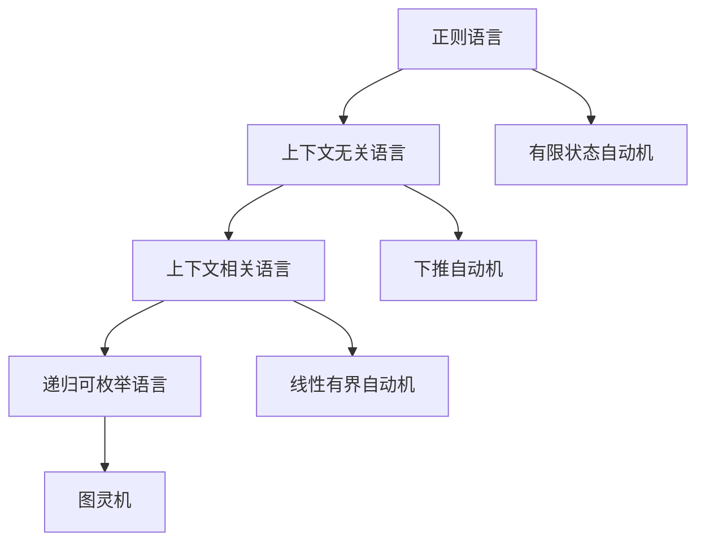

# 范畴论视角下的形式语言统一理论：认知、数学与计算的整合框架

## 目录

- [范畴论视角下的形式语言统一理论：认知、数学与计算的整合框架](#范畴论视角下的形式语言统一理论认知数学与计算的整合框架)
  - [目录](#目录)
  - [1. 引言：范畴论作为统一理论框架](#1-引言范畴论作为统一理论框架)
    - [1.1 范畴论的核心思想](#11-范畴论的核心思想)
    - [1.2 形式语言的范畴论视角](#12-形式语言的范畴论视角)
  - [2. 范畴论的基本概念与结构](#2-范畴论的基本概念与结构)
    - [2.1 范畴的形式定义与公理系统](#21-范畴的形式定义与公理系统)
      - [2.1.1 范畴的公理化定义](#211-范畴的公理化定义)
      - [2.1.2 基本范畴示例](#212-基本范畴示例)
      - [2.1.3 范畴的图示表示](#213-范畴的图示表示)
    - [2.2 函子、自然变换与伴随](#22-函子自然变换与伴随)
      - [2.2.1 函子的定义与性质](#221-函子的定义与性质)
      - [2.2.2 自然变换](#222-自然变换)
      - [2.2.3 伴随函子](#223-伴随函子)
    - [2.3 极限、余极限与泛性质](#23-极限余极限与泛性质)
      - [2.3.1 极限的概念](#231-极限的概念)
      - [2.3.2 泛性质](#232-泛性质)
  - [3. 形式语言的范畴论模型](#3-形式语言的范畴论模型)
    - [3.1 形式语言范畴的构造](#31-形式语言范畴的构造)
      - [3.1.1 语言范畴 Lang](#311-语言范畴-lang)
      - [3.1.2 语法范畴 Gram](#312-语法范畴-gram)
      - [3.1.3 自动机范畴 Aut](#313-自动机范畴-aut)
    - [3.2 乔姆斯基谱系的范畴表示](#32-乔姆斯基谱系的范畴表示)
      - [3.2.1 谱系的偏序结构](#321-谱系的偏序结构)
      - [3.2.2 表达能力函子](#322-表达能力函子)
      - [3.2.3 计算复杂性函子](#323-计算复杂性函子)
    - [3.3 计算模型的范畴对应](#33-计算模型的范畴对应)
      - [3.3.1 λ演算与笛卡尔闭范畴](#331-λ演算与笛卡尔闭范畴)
      - [3.3.2 图灵机与状态转换系统](#332-图灵机与状态转换系统)
      - [3.3.3 Petri网与幺半范畴](#333-petri网与幺半范畴)
  - [4. 类型论与范畴论的深层联系](#4-类型论与范畴论的深层联系)
    - [4.1 Curry-Howard-Lambek同构](#41-curry-howard-lambek同构)
      - [4.1.1 三重对应关系](#411-三重对应关系)
      - [4.1.2 证明作为构造](#412-证明作为构造)
      - [4.1.3 范畴语义](#413-范畴语义)
    - [4.2 类型系统的范畴语义](#42-类型系统的范畴语义)
      - [4.2.1 简单类型系统](#421-简单类型系统)
      - [4.2.2 多态类型系统](#422-多态类型系统)
      - [4.2.3 依赖类型系统](#423-依赖类型系统)
    - [4.3 依赖类型与高阶类型](#43-依赖类型与高阶类型)
      - [4.3.1 依赖类型系统](#431-依赖类型系统)
      - [4.3.2 高阶类型系统](#432-高阶类型系统)
  - [5. 认知科学与范畴论的交叉](#5-认知科学与范畴论的交叉)
    - [5.1 概念空间的几何与拓扑结构](#51-概念空间的几何与拓扑结构)
      - [5.1.1 Gärdenfors概念空间理论](#511-gärdenfors概念空间理论)
      - [5.1.2 认知拓扑学](#512-认知拓扑学)
      - [5.1.3 范畴论视角](#513-范畴论视角)
    - [5.2 认知图式与形式模式](#52-认知图式与形式模式)
      - [5.2.1 认知图式理论](#521-认知图式理论)
      - [5.2.2 形式模式语言](#522-形式模式语言)
      - [5.2.3 范畴论建模](#523-范畴论建模)
    - [5.3 心理空间理论与映射](#53-心理空间理论与映射)
      - [5.3.1 心理空间理论](#531-心理空间理论)
      - [5.3.2 概念映射](#532-概念映射)
      - [5.3.3 范畴论表示](#533-范畴论表示)
  - [6. 数学实践与形式系统的辩证关系](#6-数学实践与形式系统的辩证关系)
    - [6.1 形式化与直觉的桥梁](#61-形式化与直觉的桥梁)
      - [6.1.1 数学实践的特征](#611-数学实践的特征)
      - [6.1.2 形式化的作用](#612-形式化的作用)
      - [6.1.3 范畴论的桥梁作用](#613-范畴论的桥梁作用)
    - [6.2 抽象层次与具体实现](#62-抽象层次与具体实现)
      - [6.2.1 抽象层次谱系](#621-抽象层次谱系)
      - [6.2.2 抽象与具体的辩证关系](#622-抽象与具体的辩证关系)
      - [6.2.3 范畴论的层次性](#623-范畴论的层次性)
    - [6.3 数学发现的范畴论视角](#63-数学发现的范畴论视角)
      - [6.3.1 数学发现的过程](#631-数学发现的过程)
      - [6.3.2 范畴论在发现中的作用](#632-范畴论在发现中的作用)
      - [6.3.3 发现的模式](#633-发现的模式)
  - [7. 计算机科学中的应用](#7-计算机科学中的应用)
    - [7.1 编程语言语义的范畴模型](#71-编程语言语义的范畴模型)
      - [7.1.1 操作语义](#711-操作语义)
      - [7.1.2 指称语义](#712-指称语义)
      - [7.1.3 公理语义](#713-公理语义)
    - [7.2 函数式编程与范畴论](#72-函数式编程与范畴论)
      - [7.2.1 函数式编程的特征](#721-函数式编程的特征)
      - [7.2.2 范畴论对应](#722-范畴论对应)
      - [7.2.3 单子与效应](#723-单子与效应)
    - [7.3 并发与分布式系统的范畴表示](#73-并发与分布式系统的范畴表示)
      - [7.3.1 并发系统模型](#731-并发系统模型)
      - [7.3.2 分布式系统](#732-分布式系统)
      - [7.3.3 范畴论工具](#733-范畴论工具)
  - [8. 哲学反思与理论边界](#8-哲学反思与理论边界)
    - [8.1 范畴论的本体论地位](#81-范畴论的本体论地位)
      - [8.1.1 本体论问题](#811-本体论问题)
      - [8.1.2 数学柏拉图主义](#812-数学柏拉图主义)
      - [8.1.3 形式主义](#813-形式主义)
    - [8.2 抽象与具体的辩证关系](#82-抽象与具体的辩证关系)
      - [8.2.1 抽象的本质](#821-抽象的本质)
      - [8.2.2 具体的价值](#822-具体的价值)
      - [8.2.3 辩证统一](#823-辩证统一)
    - [8.3 形式系统的认知限制](#83-形式系统的认知限制)
      - [8.3.1 哥德尔不完备性](#831-哥德尔不完备性)
      - [8.3.2 计算复杂性](#832-计算复杂性)
      - [8.3.3 认知科学视角](#833-认知科学视角)
  - [9. 未来发展与应用前景](#9-未来发展与应用前景)
    - [9.1 量子计算与范畴论](#91-量子计算与范畴论)
      - [9.1.1 量子计算的范畴模型](#911-量子计算的范畴模型)
      - [9.1.2 量子信息理论](#912-量子信息理论)
      - [9.1.3 量子编程语言](#913-量子编程语言)
    - [9.2 人工智能的范畴论基础](#92-人工智能的范畴论基础)
      - [9.2.1 机器学习](#921-机器学习)
      - [9.2.2 神经网络](#922-神经网络)
      - [9.2.3 知识表示](#923-知识表示)
    - [9.3 跨学科整合的新方向](#93-跨学科整合的新方向)
      - [9.3.1 认知增强](#931-认知增强)
      - [9.3.2 教育应用](#932-教育应用)
      - [9.3.3 科学研究](#933-科学研究)

---

## 1. 引言：范畴论作为统一理论框架

范畴论作为"数学的数学"，为理解形式语言提供了一个强大的统一框架。它不仅能够揭示不同形式系统之间的结构对应关系，还能够连接数学、认知科学、计算机科学和哲学等多个学科领域，形成一个跨学科的理论整合平台。

### 1.1 范畴论的核心思想

范畴论的基本思想是关注对象之间的关系，而非对象的内部结构。这种"关系优先"的视角使得范畴论能够：

- **统一不同数学领域**：通过抽象出共同的结构模式
- **提供形式化工具**：为复杂系统建模提供精确的语言
- **连接理论与实践**：在抽象理论与具体应用之间建立桥梁
- **支持跨学科研究**：为不同学科提供共同的理论基础

### 1.2 形式语言的范畴论视角

从范畴论视角看，形式语言可以被理解为：

- **对象**：语言、语法、语义结构
- **态射**：语言转换、语法分析、语义映射
- **函子**：语法分析器、编译器、解释器
- **自然变换**：语言演化、语义变化、系统升级

这种视角揭示了形式语言系统的内在结构和演化规律。

## 2. 范畴论的基本概念与结构

### 2.1 范畴的形式定义与公理系统

#### 2.1.1 范畴的公理化定义

一个范畴 C 由以下数据组成：

1. **对象类** Ob(C)：范畴中的对象集合
2. **态射类** Mor(C)：对象之间的箭头集合
3. **组合操作** ∘：态射的复合运算
4. **单位态射** 1_A：每个对象的恒等态射

满足以下公理：

- **结合律**：(h ∘ g) ∘ f = h ∘ (g ∘ f)
- **单位律**：1_B ∘ f = f = f ∘ 1_A

#### 2.1.2 基本范畴示例

| 范畴名称 | 对象 | 态射 | 应用领域 |
|----------|------|------|----------|
| Set | 集合 | 函数 | 基础数学 |
| Grp | 群 | 群同态 | 代数结构 |
| Top | 拓扑空间 | 连续映射 | 几何分析 |
| Vect_K | K-向量空间 | 线性映射 | 线性代数 |
| Cat | 小范畴 | 函子 | 范畴论本身 |

#### 2.1.3 范畴的图示表示



### 2.2 函子、自然变换与伴随

#### 2.2.1 函子的定义与性质

函子是范畴之间的映射，保持范畴的结构：

**定义**：函子 F: C → D 包含：

- 对象映射：F: Ob(C) → Ob(D)
- 态射映射：F: Mor(C) → Mor(D)
- 保持组合：F(g ∘ f) = F(g) ∘ F(f)
- 保持单位：F(1_A) = 1_{F(A)}

#### 2.2.2 自然变换

自然变换是函子之间的态射，描述了函子之间的"关系"：

**定义**：自然变换 α: F → G 是一族态射 {α_A: F(A) → G(A)}，使得对任意态射 f: A → B，有：

```text
F(A) --α_A--> G(A)
 |              |
F(f)           G(f)
 |              |
F(B) --α_B--> G(B)
```

#### 2.2.3 伴随函子

伴随是范畴论中的核心概念，描述了函子之间的"最佳"关系：

**定义**：函子 F: C → D 和 G: D → C 构成伴随对 (F ⊣ G)，如果存在自然同构：
Hom_D(F(A), B) ≅ Hom_C(A, G(B))

### 2.3 极限、余极限与泛性质

#### 2.3.1 极限的概念

极限是范畴论中描述"最佳近似"的工具：

- **积**：两个对象的"最佳"共同对象
- **等化子**：两个态射的"最佳"共同域
- **拉回**：两个态射的"最佳"共同源

#### 2.3.2 泛性质

泛性质是范畴论的核心思想，描述了对象的"唯一性"特征：

**定义**：对象 X 满足泛性质，如果对任意对象 Y 和态射 f: Y → X，存在唯一的态射 g: Y → X 使得 f = g。

## 3. 形式语言的范畴论模型

### 3.1 形式语言范畴的构造

#### 3.1.1 语言范畴 Lang

定义形式语言范畴 Lang：

- **对象**：形式语言 L ⊆ Σ*
- **态射**：语言同态 f: L₁ → L₂
- **组合**：态射的复合
- **单位**：恒等语言同态

#### 3.1.2 语法范畴 Gram

定义语法范畴 Gram：

- **对象**：形式文法 G = (V, Σ, P, S)
- **态射**：语法变换 φ: G₁ → G₂
- **组合**：语法变换的复合
- **单位**：恒等语法变换

#### 3.1.3 自动机范畴 Aut

定义自动机范畴 Aut：

- **对象**：自动机 M = (Q, Σ, δ, q₀, F)
- **态射**：自动机同态 h: M₁ → M₂
- **组合**：同态的复合
- **单位**：恒等同态

### 3.2 乔姆斯基谱系的范畴表示

#### 3.2.1 谱系的偏序结构

乔姆斯基谱系可以表示为一个偏序范畴 Chomsky：



#### 3.2.2 表达能力函子

定义表达能力函子 E: Chomsky → Set：

- E(L) = {w | w ∈ L}：语言生成的字符串集合
- E(f: L₁ → L₂) = 包含映射：L₁ ⊆ L₂

#### 3.2.3 计算复杂性函子

定义计算复杂性函子 C: Chomsky → Comp：

- C(L) = 识别 L 的最小计算复杂度
- C(f: L₁ → L₂) = 复杂度保持映射

### 3.3 计算模型的范畴对应

#### 3.3.1 λ演算与笛卡尔闭范畴

λ演算对应于笛卡尔闭范畴 CCC：

- **对象**：类型
- **态射**：λ项
- **积**：乘积类型
- **指数**：函数类型
- **终对象**：单位类型

#### 3.3.2 图灵机与状态转换系统

图灵机对应于状态转换范畴：

- **对象**：配置状态
- **态射**：转换规则
- **组合**：转换序列
- **单位**：空转换

#### 3.3.3 Petri网与幺半范畴

Petri网对应于幺半范畴：

- **对象**：标记状态
- **态射**：变迁
- **张量积**：并行组合
- **单位对象**：空标记

## 4. 类型论与范畴论的深层联系

### 4.1 Curry-Howard-Lambek同构

#### 4.1.1 三重对应关系

Curry-Howard-Lambek同构建立了三个领域的深层联系：

| 逻辑 | 类型论 | 范畴论 |
|------|--------|--------|
| 命题 | 类型 | 对象 |
| 证明 | 程序 | 态射 |
| 蕴含 | 函数类型 | 指数对象 |
| 合取 | 乘积类型 | 积对象 |
| 析取 | 和类型 | 余积对象 |

#### 4.1.2 证明作为构造

在类型论中，证明被理解为构造过程：

- **构造性证明**：提供具体的构造方法
- **程序提取**：从证明中提取可执行程序
- **类型安全**：类型系统确保程序正确性

#### 4.1.3 范畴语义

类型论在范畴论中有自然的语义解释：

- **简单类型λ演算**：笛卡尔闭范畴
- **多态类型系统**：参数化多态
- **依赖类型系统**：局部笛卡尔闭范畴

### 4.2 类型系统的范畴语义

#### 4.2.1 简单类型系统

简单类型λ演算的范畴语义：

- **类型**：范畴中的对象
- **项**：对象间的态射
- **应用**：指数对象的求值态射
- **抽象**：Curry化操作

#### 4.2.2 多态类型系统

多态类型系统的范畴语义：

- **类型变量**：参数化对象
- **类型抽象**：泛化构造
- **类型应用**：实例化操作
- **类型约束**：子类型关系

#### 4.2.3 依赖类型系统

依赖类型系统的范畴语义：

- **依赖类型**：纤维范畴
- **类型族**：索引范畴
- **依赖函数**：Π类型
- **依赖对**：Σ类型

### 4.3 依赖类型与高阶类型

#### 4.3.1 依赖类型系统

依赖类型系统允许类型依赖于值：

- **Π类型**：依赖函数类型 Π(x:A).B(x)
- **Σ类型**：依赖对类型 Σ(x:A).B(x)
- **相等类型**：Id_A(a,b) 表示 a = b
- **宇宙**：类型的类型

#### 4.3.2 高阶类型系统

高阶类型系统支持类型上的操作：

- **类型构造函数**：从类型到类型的函数
- **类型运算符**：高阶类型抽象
- **类型计算**：类型级别的计算
- **类型推理**：自动类型推导

## 5. 认知科学与范畴论的交叉

### 5.1 概念空间的几何与拓扑结构

#### 5.1.1 Gärdenfors概念空间理论

概念空间理论将概念表示为多维质量空间：

- **概念空间**：多维欧几里得空间
- **概念区域**：空间中的凸区域
- **相似性度量**：欧几里得距离
- **概念组合**：区域的交集和并集

#### 5.1.2 认知拓扑学

认知拓扑学研究认知结构的拓扑特性：

- **连通性**：概念之间的连接关系
- **边界**：概念区域的边界
- **内部/外部**：概念的核心与边缘
- **连续性**：概念变化的连续性

#### 5.1.3 范畴论视角

从范畴论视角看概念空间：

- **对象**：概念或概念区域
- **态射**：概念之间的关系
- **函子**：概念变换
- **自然变换**：概念演化

### 5.2 认知图式与形式模式

#### 5.2.1 认知图式理论

认知图式是组织经验和指导行为的心理结构：

- **容器图式**：内容与容器的关系
- **路径图式**：起点到终点的映射
- **力量图式**：因果关系的表达
- **平衡图式**：对称与平衡的概念

#### 5.2.2 形式模式语言

形式模式语言可以捕捉认知图式：

- **设计模式**：软件工程中的模式
- **架构模式**：系统设计的模式
- **交互模式**：人机交互的模式
- **认知模式**：思维过程的模式

#### 5.2.3 范畴论建模

用范畴论建模认知图式：

- **图式范畴**：认知图式作为对象
- **图式映射**：图式间的关系作为态射
- **图式组合**：复杂图式的构建
- **图式演化**：图式的变化过程

### 5.3 心理空间理论与映射

#### 5.3.1 心理空间理论

心理空间是思维中构建的临时概念域：

- **心理空间**：概念域
- **空间映射**：空间间的关系
- **空间融合**：空间的组合
- **空间投射**：概念的投射

#### 5.3.2 概念映射

概念映射描述不同概念域之间的关系：

- **源域**：源概念域
- **目标域**：目标概念域
- **映射关系**：域间的对应关系
- **映射约束**：映射的限制条件

#### 5.3.3 范畴论表示

用范畴论表示心理空间：

- **空间范畴**：心理空间作为对象
- **映射函子**：空间映射作为函子
- **融合操作**：空间融合作为极限
- **投射操作**：空间投射作为余极限

## 6. 数学实践与形式系统的辩证关系

### 6.1 形式化与直觉的桥梁

#### 6.1.1 数学实践的特征

数学实践包含多种认知活动：

- **直觉推理**：基于经验的直接判断
- **启发式思维**：问题解决的策略
- **类比推理**：基于相似性的推理
- **视觉推理**：基于图形的推理

#### 6.1.2 形式化的作用

形式化在数学实践中的作用：

- **精确表达**：消除歧义和模糊性
- **严格证明**：确保结论的正确性
- **系统化**：组织知识结构
- **交流工具**：促进学术交流

#### 6.1.3 范畴论的桥梁作用

范畴论连接形式化与直觉：

- **图示语言**：直观的几何表示
- **泛性质**：自然的数学概念
- **抽象层次**：从具体到抽象
- **结构对应**：不同领域的统一

### 6.2 抽象层次与具体实现

#### 6.2.1 抽象层次谱系

数学中的抽象层次：

| 层次 | 特征 | 例子 |
|------|------|------|
| 具体 | 具体对象和操作 | 自然数运算 |
| 代数 | 抽象运算结构 | 群、环、域 |
| 范畴 | 对象间关系 | 函子、自然变换 |
| 高阶 | 范畴间关系 | 2-范畴、∞-范畴 |

#### 6.2.2 抽象与具体的辩证关系

抽象与具体相互依存：

- **抽象源于具体**：抽象概念来自具体经验
- **具体指导抽象**：具体例子指导抽象理解
- **抽象指导具体**：抽象理论指导具体应用
- **循环发展**：抽象与具体相互促进

#### 6.2.3 范畴论的层次性

范畴论体现层次性：

- **对象层次**：具体的数学对象
- **态射层次**：对象间的关系
- **函子层次**：范畴间的映射
- **自然变换层次**：函子间的关系

### 6.3 数学发现的范畴论视角

#### 6.3.1 数学发现的过程

数学发现包含多个阶段：

- **问题提出**：识别数学问题
- **直觉探索**：基于直觉的探索
- **形式化**：将直觉形式化
- **证明**：严格证明结论
- **推广**：推广到更一般情况

#### 6.3.2 范畴论在发现中的作用

范畴论促进数学发现：

- **结构识别**：识别共同结构
- **类比发现**：通过类比发现新结果
- **统一视角**：提供统一的理论框架
- **新问题**：提出新的研究方向

#### 6.3.3 发现的模式

数学发现的常见模式：

- **结构对应**：不同领域的结构对应
- **抽象推广**：从具体到抽象
- **类比推理**：基于相似性
- **构造方法**：通过构造证明存在

## 7. 计算机科学中的应用

### 7.1 编程语言语义的范畴模型

#### 7.1.1 操作语义

操作语义描述程序的执行过程：

- **小步语义**：详细的执行步骤
- **大步语义**：整体的执行结果
- **抽象机器**：介于形式规则和实现之间
- **上下文语义**：显式表示控制流

#### 7.1.2 指称语义

指称语义将程序映射到数学对象：

- **领域理论**：处理递归和不动点
- **连续函数**：保证不动点存在
- **范畴模型**：笛卡尔闭范畴
- **单子语义**：处理计算效应

#### 7.1.3 公理语义

公理语义通过逻辑公理描述程序性质：

- **霍尔逻辑**：前置条件和后置条件
- **分离逻辑**：处理指针和内存
- **时态逻辑**：描述时序性质
- **模态逻辑**：描述可能性和必然性

### 7.2 函数式编程与范畴论

#### 7.2.1 函数式编程的特征

函数式编程的核心特征：

- **纯函数**：无副作用的函数
- **不可变性**：数据不可修改
- **高阶函数**：函数作为值
- **惰性求值**：按需计算

#### 7.2.2 范畴论对应

函数式编程的范畴论对应：

- **函数组合**：态射组合
- **恒等函数**：单位态射
- **高阶函数**：指数对象
- **类型系统**：范畴结构

#### 7.2.3 单子与效应

单子处理计算效应：

- **Maybe单子**：处理可能失败
- **List单子**：处理非确定性
- **State单子**：处理状态
- **IO单子**：处理输入输出

### 7.3 并发与分布式系统的范畴表示

#### 7.3.1 并发系统模型

并发系统的范畴模型：

- **进程代数**：进程间交互
- **Petri网**：并发和同步
- **事件结构**：事件间依赖
- **迹语义**：执行序列

#### 7.3.2 分布式系统

分布式系统的范畴表示：

- **网络拓扑**：节点间连接
- **消息传递**：进程间通信
- **一致性**：分布式一致性
- **容错性**：故障处理

#### 7.3.3 范畴论工具

范畴论提供的工具：

- **纤维范畴**：参数化结构
- **双范畴**：二维结构
- **高阶范畴**：多层抽象
- **同伦论**：连续变形

## 8. 哲学反思与理论边界

### 8.1 范畴论的本体论地位

#### 8.1.1 本体论问题

范畴论引发的本体论问题：

- **抽象对象**：范畴论对象的存在性
- **结构主义**：关注结构而非对象
- **关系优先**：关系先于对象
- **构造主义**：通过构造理解存在

#### 8.1.2 数学柏拉图主义

柏拉图主义视角下的范畴论：

- **数学对象**：独立存在的抽象实体
- **数学真理**：客观存在的真理
- **数学发现**：发现而非创造
- **数学直觉**：对数学对象的直接认识

#### 8.1.3 形式主义

形式主义视角下的范畴论：

- **符号游戏**：数学是符号操作
- **一致性**：避免矛盾是唯一要求
- **实用性**：数学的价值在于应用
- **约定性**：数学规则是约定

### 8.2 抽象与具体的辩证关系

#### 8.2.1 抽象的本质

抽象在数学中的作用：

- **简化**：去除不相关细节
- **泛化**：从特殊到一般
- **统一**：统一不同现象
- **预测**：预测新现象

#### 8.2.2 具体的价值

具体在数学中的价值：

- **理解**：具体例子帮助理解
- **验证**：验证抽象理论
- **启发**：启发新的抽象
- **应用**：实际应用抽象理论

#### 8.2.3 辩证统一

抽象与具体的统一：

- **相互依存**：抽象与具体相互依存
- **相互转化**：抽象与具体相互转化
- **循环发展**：抽象与具体循环发展
- **平衡关系**：保持适当平衡

### 8.3 形式系统的认知限制

#### 8.3.1 哥德尔不完备性

哥德尔定理的认知含义：

- **形式化局限**：形式化无法完全捕捉数学
- **直觉作用**：直觉在数学中不可或缺
- **元系统需求**：理解需要站在系统外
- **创造性本质**：数学具有创造性

#### 8.3.2 计算复杂性

复杂性的认知含义：

- **资源限制**：计算资源有限
- **可行性边界**：实际可行的边界
- **近似方法**：需要近似和启发式
- **人类认知**：人类认知的限制

#### 8.3.3 认知科学视角

认知科学对形式系统的理解：

- **具身认知**：认知基于身体经验
- **情境认知**：认知依赖于情境
- **分布式认知**：认知分布在环境中
- **社会认知**：认知具有社会性

## 9. 未来发展与应用前景

### 9.1 量子计算与范畴论

#### 9.1.1 量子计算的范畴模型

量子计算的范畴论基础：

- **希尔伯特空间**：量子态的空间
- **线性算子**：量子操作
- **张量积**：复合系统
- **幺正变换**：量子演化

#### 9.1.2 量子信息理论

量子信息理论的范畴表示：

- **量子比特**：基本量子信息单位
- **量子门**：量子操作
- **量子纠缠**：非局域关联
- **量子测量**：信息提取

#### 9.1.3 量子编程语言

量子编程语言的范畴语义：

- **量子类型**：量子数据类型
- **量子函数**：量子操作
- **量子效应**：量子计算效应
- **量子控制**：量子控制结构

### 9.2 人工智能的范畴论基础

#### 9.2.1 机器学习

机器学习的范畴论模型：

- **数据空间**：输入输出空间
- **学习算法**：参数更新规则
- **模型空间**：假设空间
- **损失函数**：评估标准

#### 9.2.2 神经网络

神经网络的范畴表示：

- **层结构**：网络层次
- **权重矩阵**：连接权重
- **激活函数**：非线性变换
- **反向传播**：梯度计算

#### 9.2.3 知识表示

知识表示的范畴模型：

- **概念网络**：概念间关系
- **推理规则**：逻辑推理
- **语义空间**：语义表示
- **知识图谱**：结构化知识

### 9.3 跨学科整合的新方向

#### 9.3.1 认知增强

范畴论在认知增强中的应用：

- **思维工具**：提供思维工具
- **概念组织**：组织复杂概念
- **问题解决**：结构化问题解决
- **知识整合**：整合不同知识

#### 9.3.2 教育应用

范畴论在教育中的应用：

- **概念教学**：概念关系教学
- **思维训练**：抽象思维训练
- **跨学科教学**：跨学科整合
- **可视化教学**：直观表示

#### 9.3.3 科学研究

范畴论在科学研究中的应用：

- **理论整合**：整合不同理论
- **模型构建**：构建科学模型
- **数据分析**：结构化数据分析
- **系统理解**：理解复杂系统

---

> **进度追踪**：本文件系统性整合了 /docs/FormalLanguage/Mathematics/从范畴论视角审视形式语言：认知、数学与计算的统一理论.md 的内容，已完成范畴论统一框架的学术化升级。后续可针对特定应用领域（如量子计算、AI、认知科学等）进一步深化理论探讨与案例分析。
