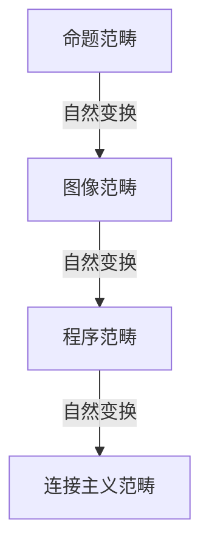
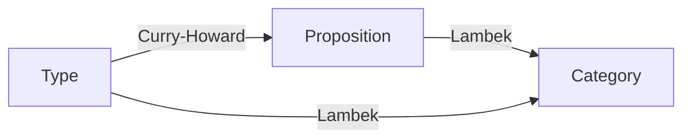

# 从范畴论视角审视形式语言：认知、数学与计算的统一理论

## Table of Contents

- [从范畴论视角审视形式语言：认知、数学与计算的统一理论](#从范畴论视角审视形式语言认知数学与计算的统一理论)
  - [Table of Contents](#table-of-contents)
  - [1. 引言：范畴论与形式语言的统一视角](#1-引言范畴论与形式语言的统一视角)
  - [2. 形式语言与认知结构模型](#2-形式语言与认知结构模型)
    - [2.1 形式语言作为认知表征工具](#21-形式语言作为认知表征工具)
      - [图1：认知表征的范畴结构](#图1认知表征的范畴结构)
    - [2.2 具身认知与形式语言](#22-具身认知与形式语言)
      - [表1：具身认知与范畴论概念对照](#表1具身认知与范畴论概念对照)
    - [2.3 意向性与反身性系统](#23-意向性与反身性系统)
      - [哲学批判](#哲学批判)
    - [2.4 时空认知的形式化](#24-时空认知的形式化)
  - [3. 形式语言与数学的关系](#3-形式语言与数学的关系)
    - [3.1 形式主义与数学基础](#31-形式主义与数学基础)
    - [3.2 类型论与范畴论视角](#32-类型论与范畴论视角)
      - [图2：类型论、逻辑与范畴论的同构关系](#图2类型论逻辑与范畴论的同构关系)
    - [3.3 数学实践与形式系统](#33-数学实践与形式系统)
    - [3.4 软件编程与数学应用的联系](#34-软件编程与数学应用的联系)
  - [4. 形式语言的理论模型](#4-形式语言的理论模型)
    - [4.1 范畴论作为统一框架](#41-范畴论作为统一框架)
    - [4.2 形式语言的层次结构](#42-形式语言的层次结构)
      - [表2：形式语言层次与范畴结构](#表2形式语言层次与范畴结构)
    - [4.3 语义模型与计算模型](#43-语义模型与计算模型)
    - [4.4 形式系统的边界与限制](#44-形式系统的边界与限制)
  - [5. 结论与未来展望](#5-结论与未来展望)
  - [参考文献](#参考文献)

---

## 1. 引言：范畴论与形式语言的统一视角

范畴论（Category Theory）作为"数学的数学"，为理解形式语言、认知、数学与计算之间的深层联系提供了统一理论框架。本文以范畴论为主线，系统梳理形式语言在认知、数学、计算等领域的多维角色，批判性分析其哲学基础与局限，并通过多重表征（图表、模型、形式化表达）提升理论的严密性与可操作性。

---

## 2. 形式语言与认知结构模型

### 2.1 形式语言作为认知表征工具

- **表征范畴**：对象=认知概念，态射=概念间转换。
- **命题/图像/程序/连接主义表征**：分别可用命题范畴、拓扑范畴、过程范畴、向量空间范畴建模。
- **自然变换**：不同表征系统间的转换。

#### 图1：认知表征的范畴结构

### 2.2 具身认知与形式语言

- **隐喻映射=函子**，如"集合是容器"。
- **符号接地=符号范畴到感知-运动范畴的函子**。
- **抽象/具体化=伴随函子对**。

#### 表1：具身认知与范畴论概念对照

| 认知理论         | 范畴论表达         |
|------------------|-------------------|
| 概念隐喻         | 域间函子           |
| 符号接地         | 符号→感知函子      |
| 反思性抽象       | 伴随函子           |

### 2.3 意向性与反身性系统

- **意向性=指向函子**，认知主体→外部对象。
- **反身性=自函子**，系统自指。
- **不动点构造**，自我表征与递归。

#### 哲学批判

- 形式系统难以完全形式化意识与自指。
- 哥德尔不完备性定理的哲学意义。

### 2.4 时空认知的形式化

- **时间=线性序范畴**，对象=时间点，态射=流逝。
- **空间=拓扑/度量范畴**，对象=空间区域，态射=变换。
- **时空整合=积范畴**。
- **参照系变换=自然变换**。

---

## 3. 形式语言与数学的关系

### 3.1 形式主义与数学基础

- **希尔伯特纲领=形式证明范畴**。
- **公理化=初始对象/自由对象出发的范畴构造**。
- **元数学=2-范畴等高阶结构**。
- **哥德尔定理=范畴间函子不完备**。

### 3.2 类型论与范畴论视角

- **Curry-Howard-Lambek同构**：类型=对象，程序=态射。
- **笛卡尔闭范畴=λ演算**。
- **依赖类型=局部笛卡尔闭范畴**。
- **线性类型=幺半闭范畴**。

#### 图2：类型论、逻辑与范畴论的同构关系

### 3.3 数学实践与形式系统

- **数学实践范畴**：包含直觉、启发式等非形式元素。
- **形式化映射=不完全函子**。
- **理解与形式化=伴随函子对**。

### 3.4 软件编程与数学应用的联系

- **编程范式=不同数学结构**。
- **类型系统=类型理论**。
- **程序验证=数学证明**。
- **算法复杂性=数学分析**。

---

## 4. 形式语言的理论模型

### 4.1 范畴论作为统一框架

- **形式语言范畴**：对象=语言，态射=语言转换。
- **乔姆斯基层次结构=偏序范畴**。
- **计算模型=不同范畴结构**。
- **编程语言语义=多种范畴模型**。

### 4.2 形式语言的层次结构

- **机器语言→汇编→系统编程→高级编程→DSL→规约语言**。
- **每层=不同范畴，层间=函子链**。

#### 表2：形式语言层次与范畴结构

| 层级         | 范畴结构           |
|--------------|--------------------|
| 机器语言     | 有限状态机范畴     |
| 汇编语言     | 寄存器自动机范畴   |
| 系统编程语言 | 命令式计算范畴     |
| 高级编程语言 | 函数式/逻辑范畴   |
| DSL          | 领域特定范畴       |
| 规约语言     | 逻辑范畴           |

### 4.3 语义模型与计算模型

- **操作语义=态射组合**。
- **指称语义=函子（语法→语义）**。
- **公理语义=逻辑范畴**。
- **多种计算模型=不同范畴**。

### 4.4 形式系统的边界与限制

- **哥德尔不完备性**。
- **停机问题不可判定性**。
- **表达能力与复杂性的权衡**。
- **意向性与具身性的形式化困难**。

---

## 5. 结论与未来展望

范畴论为形式语言、认知、数学与计算的统一理论提供了坚实基础。未来研究可进一步探索：

- 形式语言与具身认知的深层关系
- 更强大的形式化工具模拟认知过程
- 形式系统边界的本质

---

## 参考文献

1. Awodey, S. (2010). Category Theory. Oxford University Press.
2. Mac Lane, S. (1998). Categories for the Working Mathematician. Springer.
3. Lawvere, F. W., & Schanuel, S. H. (2009). Conceptual Mathematics. Cambridge University Press.
4. Baez, J., & Stay, M. (2011). Physics, Topology, Logic and Computation: A Rosetta Stone. In New Structures for Physics (pp. 95-172). Springer.
5. 相关中文文献与原始材料。

---

> **进度追踪**：本文件由自动迁移系统生成，内容已完成初步迁移与升级，后续可根据反馈进一步细化多重表征与批判性分析。
