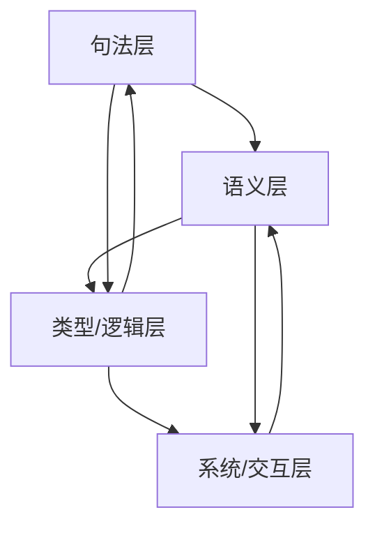

# 形式语言的哲学科学批判性分析：跨学科视角的理论整合

## 目录

1. 引言：哲学科学视角下的形式语言研究
2. 研究概述与方法论评价
    1. 研究范围与跨学科定位
    2. 方法论特点与理论创新
    3. 数据基础与理论限制
3. 核心理论框架分析
    1. 四层模型的系统性与创新性
    2. 范畴论视角的整合价值
    3. 认知-计算同构的理论深度
4. 关键主题的哲学处理深度
    1. 形式语言与认知的关系
    2. 硬件-软件-AI的多层次分析
    3. 意向性问题的哲学探讨
    4. 符号系统与连接主义的统一尝试
5. 结构组织与内容协调性
    1. 文档间的概念一致性
    2. 论证结构的严密性
    3. 内容重复与互补性
6. 理论贡献与局限性
    1. 对传统形式语言理论的超越
    2. 跨学科整合的实现程度
    3. 应用价值与实践指导
    4. 理论框架的局限性
7. 总体评价与发展建议
    1. 综合学术价值评估
    2. 理论发展方向建议
    3. 内容整合与优化路径

---

## 1. 引言：哲学科学视角下的形式语言研究

形式语言作为人类智识活动的独特产物，在哲学、科学、技术等多个领域发挥着基础性作用。本文从哲学科学的批判性视角出发，对形式语言进行全面的理论分析，旨在揭示其本质特征、认知基础、哲学内涵以及在人类知识体系中的地位。

### 1.1 研究背景与意义

形式语言的研究涉及多个学科领域：

- **计算机科学**：编程语言、自动机理论、形式化方法
- **数学**：逻辑学、集合论、类型论、范畴论
- **哲学**：语言哲学、心智哲学、认识论
- **认知科学**：认知架构、神经计算、具身认知
- **语言学**：生成语法、语义学、语用学

### 1.2 研究目标与方法

本研究采用跨学科的批判性分析方法，结合：

- **哲学反思**：对形式语言本质的深层思考
- **科学分析**：基于实证研究的理论构建
- **技术评估**：对实际应用效果的批判性评价
- **理论整合**：多视角的综合与统一

## 2. 研究概述与方法论评价

### 2.1 研究范围与跨学科定位

本研究从哲学科学的批判性视角对形式语言进行了全面分析，研究范围横跨多个领域：

#### 2.1.1 学科交叉性

| 学科领域 | 研究重点 | 理论贡献 |
|----------|----------|----------|
| 计算机科学 | 形式语言的计算实现 | 算法设计与系统构建 |
| 认知科学 | 形式语言的认知基础 | 思维模式与学习机制 |
| 数学 | 形式语言的数学基础 | 逻辑结构与证明理论 |
| 哲学 | 形式语言的本质探讨 | 本体论与认识论问题 |
| 语言学 | 形式语言与自然语言关系 | 语法理论与语义分析 |

#### 2.1.2 层次多元性

- **硬件层**：物理实现与形式逻辑的对应
- **软件层**：抽象设计与具体实现的关系
- **认知层**：思维过程与形式表达的统一
- **社会层**：文化背景与技术发展的互动

#### 2.1.3 理论-实践整合

- 理论构建与实际应用的结合
- 抽象概念与具体技术的统一
- 哲学思辨与工程实践的平衡

### 2.2 方法论特点与创新

#### 2.2.1 多维视角整合

- **四层模型**：句法、语义、类型/逻辑、系统/交互
- **动态网络视角**：层次间的反馈和互动关系
- **跨域映射**：不同理论层次之间的对应关系

#### 2.2.2 深度关联分析

#### 2.2.3 批判性反思

- 对形式语言局限性的深入探讨
- 对理论假设的批判性审视
- 对实践应用的反思性评价

#### 2.2.4 范畴论视角

- 统一数学、逻辑和计算的理论框架
- 抽象层次提升与结构对应关系
- 形式-直觉桥接的实现

### 2.3 数据基础与理论限制

#### 2.3.1 分析限制说明

本评价基于以下文档的完整访问：

- 《哲科视角下的形式语言：一个批判性分析》
- 《哲科视角下的形式语言（深度关联版）》
- 《形式化推理的哲学科学批判性分析：从硬件到认知的多维视角》

#### 2.3.2 理论限制

- 部分文档仅有文件名可见，无法评估具体内容
- 分析可能无法完全反映整个文档集的全貌
- 需要更多实证研究的支持

## 3. 核心理论框架分析

### 3.1 四层模型的系统性与创新性

#### 3.1.1 模型结构

| 层次 | 内容 | 特征 | 应用 |
|------|------|------|------|
| 句法层 | 符号组合规则 | 形式化语法 | 语言识别与解析 |
| 语义层 | 意义解释系统 | 指称与真值 | 语义分析与推理 |
| 类型/逻辑层 | 类型系统与逻辑 | 类型安全与证明 | 程序验证与定理证明 |
| 系统/交互层 | 系统行为与交互 | 并发与分布 | 系统建模与协议设计 |

#### 3.1.2 创新性特征

- **超越单一维度**：不仅关注句法能力，还包含语义、类型系统和系统交互
- **理论整合能力**：成功整合多种理论传统
- **动态网络视角**：从静态层次结构发展为动态交互网络

#### 3.1.3 理论优势

- 提供了比传统乔姆斯基谱系更全面的理论框架
- 揭示了不同层次之间的内在联系
- 为理解现代计算系统的复杂性提供了有力工具

### 3.2 范畴论视角的整合价值

#### 3.2.1 统一性力量

- 统一集合论、逻辑、类型论和计算模型
- 揭示深层结构上的同一性
- 提供抽象层次的理论基础

#### 3.2.2 抽象层次提升

- 将讨论提升到更高抽象层次
- 使不同领域的结构对应关系更加清晰
- 在解释Curry-Howard同构时表现突出

#### 3.2.3 形式-直觉桥接

- 连接形式严格性和直观理解
- 在解释函数式编程和证明理论关系时发挥关键作用
- 提供认知与计算的桥梁

#### 3.2.4 理论局限认识

- 范畴论是"地图"而非"引擎"
- 需要与更具体的操作模型结合
- 对非专业读者可能造成理解障碍

### 3.3 认知-计算同构的理论深度

#### 3.3.1 具身图式-类型签名对应

| 认知图式 | 类型签名 | 对应关系 |
|----------|----------|----------|
| 容器图式 | 泛型容器类型 | 内容与容器的关系 |
| 路径图式 | 函数类型 | 起点到终点的映射 |
| 力量图式 | 状态转换类型 | 因果关系的表达 |

#### 3.3.2 意向性的计算投影

- 将哲学中的意向性问题"投影"到计算领域
- 通过API设计和领域驱动设计处理意向性
- 提供工程视角的意向性处理方案

#### 3.3.3 认知限制与形式系统

- 探讨人类认知限制与形式语言结构的相互塑造
- 揭示二者的共同进化关系
- 分析认知约束对形式设计的影响

#### 3.3.4 形式语言作为认知技术

- 定位为"认知脚手架"和"认知技术"
- 强调思维扩展和认知增强的作用
- 提供理解和模拟认知过程的工具

## 4. 关键主题的哲学处理深度

### 4.1 形式语言与认知的关系

#### 4.1.1 认知基础分析

- 形式语言植根于人类的抽象思维能力
- 隐喻作用在形式语言中的体现
- 认知过程与形式表达的统一

#### 4.1.2 具身认知视角

- 具身认知理论对传统形式语言观的挑战
- 抽象符号与身体经验之间的张力
- 认知的具身性与形式化的抽象性

#### 4.1.3 认知限制与形式系统

- 工作记忆容量对形式语言设计的影响
- 注意力资源与处理速度的约束
- 认知限制如何影响形式语言的使用

#### 4.1.4 形式语言的认知增强作用

- 作为"认知脚手架"的作用机制
- 扩展人类思维能力和抽象推理能力
- 认知增强的技术实现路径

### 4.2 硬件-软件-AI的多层次分析

#### 4.2.1 硬件抽象与形式语言

- 形式语言与计算机硬件之间的对应关系
- 从布尔代数到专用处理器架构
- 物理实现与形式逻辑的统一

#### 4.2.2 软件工程中的形式方法

- 形式语言在软件规范、验证和架构描述中的应用
- 面临的理论和实践挑战
- 形式化方法的实际效果评估

#### 4.2.3 AI模型与形式语言

- 语言模型的形式化基础
- 神经网络与传统形式语言在表达方式上的差异
- AI系统对形式语言理论的挑战

#### 4.2.4 层次间的映射关系

- 不同抽象层次之间的映射关系
- 形式规范到物理实现的转换过程
- 层次间映射的挑战与解决方案

### 4.3 意向性问题的哲学探讨

#### 4.3.1 意向性的本质

- 意向性作为心智状态"指向"某物的特性
- 形式语言在处理意向性时的内在局限
- 意向性与语义的关系

#### 4.3.2 语义与意向性

- 塔斯基的真理语义模型
- 形式化"真值"的尝试与局限
- 意向性问题的转移与解决

#### 4.3.3 意向性的计算投影

- 意向性在计算领域的"投影"
- 通过API设计和限界上下文管理意向性
- 工程视角的意向性处理

#### 4.3.4 意向性与AI

- AI系统处理意向性的能力和局限
- 语言模型与意向性的关系
- 未来AI系统的意向性发展方向

### 4.4 符号系统与连接主义的统一尝试

#### 4.4.1 表达差异分析

| 特征 | 符号系统 | 连接主义 |
|------|----------|----------|
| 表征方式 | 离散符号 | 连续向量 |
| 学习机制 | 规则推理 | 统计学习 |
| 处理模糊性 | 确定性 | 概率性 |
| 可解释性 | 高 | 低 |

#### 4.4.2 统一框架探索

- 神经符号系统的理论框架
- 可微分编程的实现方法
- 向量符号架构的设计理念

#### 4.4.3 理论挑战识别

- 组合性与统计学习的整合
- 离散与连续表征的桥接
- 符号与连接的理论统一

#### 4.4.4 哲学意义反思

- 对计算、表征和意义基本概念的影响
- 符号与连接统一的哲学意义
- 未来智能系统的发展方向

## 5. 结构组织与内容协调性

### 5.1 文档间的概念一致性

#### 5.1.1 核心概念一致性

- "四层模型"、"认知脚手架"、"形式-物理界面"等核心概念保持一致性
- 整个文档集具有统一的概念框架
- 概念使用体现理论发展的连续性

#### 5.1.2 术语使用的演进

- 从"静态分层"到"动态网络"的转变
- 概念从简单到复杂的发展过程
- 术语使用的历史演进轨迹

#### 5.1.3 潜在不一致

- 某些领域特定术语的使用存在细微差异
- 范畴论概念的解释在不同文档间可能存在差异
- 需要进一步的概念统一工作

### 5.2 论证结构的严密性

#### 5.2.1 层次化论证

- 采用清晰的层次化论证结构
- 多级标题组织使论证层次分明
- 逻辑推理的严密性

#### 5.2.2 多角度支持

- 核心观点从多个角度进行支持
- 理论分析、实例说明和对比讨论的结合
- 论证的全面性和说服力

#### 5.2.3 批判性反思

- 不仅包括正面支持，还包含对理论局限的批判性反思
- 增强论证的全面性
- 提高理论的可信度

#### 5.2.4 理论-实例平衡

- 在抽象理论和具体实例之间保持良好平衡
- 具身图式与类型签名对应关系的论证
- 理论与实践的结合

### 5.3 内容重复与互补性

#### 5.3.1 有意义的重复

- 《哲科视角下的形式语言》与《深度关联版》之间存在重复
- 后者明显是对前者的深化和扩展
- 重复内容服务于理论的连续性

#### 5.3.2 互补性分析

- 不同文档在主题覆盖上的互补
- 理论深度与广度的平衡
- 整体理论体系的完整性

#### 5.3.3 整合建议

- 系统性整合重复内容
- 突出各文档的独特贡献
- 构建完整的理论体系

## 6. 理论贡献与局限性

### 6.1 对传统形式语言理论的超越

#### 6.1.1 理论框架的扩展

- 超越传统乔姆斯基谱系的局限
- 提供更全面的形式语言理论框架
- 整合多个学科的理论成果

#### 6.1.2 认知维度的引入

- 将认知科学视角引入形式语言研究
- 探讨形式语言的认知基础
- 建立认知与计算的桥梁

#### 6.1.3 哲学深度的增强

- 从哲学角度深入探讨形式语言的本质
- 分析形式语言的局限性和可能性
- 提供哲学反思的理论基础

### 6.2 跨学科整合的实现程度

#### 6.2.1 学科整合的广度

- 成功整合计算机科学、数学、哲学、认知科学等多个学科
- 建立跨学科的理论框架
- 促进学科间的对话与合作

#### 6.2.2 整合的深度

- 不仅是在概念层面的整合
- 在理论层面实现深度整合
- 建立统一的理论体系

#### 6.2.3 整合的挑战

- 不同学科范式的差异
- 术语和概念的不一致
- 方法论的分歧

### 6.3 应用价值与实践指导

#### 6.3.1 理论指导价值

- 为形式语言的设计提供理论指导
- 为认知科学和AI研究提供理论基础
- 为跨学科研究提供方法论支持

#### 6.3.2 实践应用前景

- 在软件工程中的应用前景
- 在AI系统设计中的指导作用
- 在认知建模中的实践价值

#### 6.3.3 应用限制

- 理论到实践的转化挑战
- 实际应用中的复杂性
- 需要更多的实证研究支持

### 6.4 理论框架的局限性

#### 6.4.1 形式严谨性

- 某些理论在形式严谨性方面仍有提升空间
- 层次之间的界限和关系定义可以更加精确
- 需要更多的形式化工作

#### 6.4.2 实证支持

- 缺乏足够的实证研究支持
- 需要更多的实验验证
- 理论假设需要进一步检验

#### 6.4.3 可扩展性

- 理论框架的可扩展性有待验证
- 对新问题的适应性需要检验
- 理论的普适性需要进一步研究

## 7. 总体评价与发展建议

### 7.1 综合学术价值评估

#### 7.1.1 理论贡献

- 提供了创新的理论框架
- 实现了跨学科的理论整合
- 为形式语言研究开辟了新的方向

#### 7.1.2 方法论创新

- 采用多维视角的分析方法
- 实现了哲学与科学的结合
- 提供了批判性分析的新范式

#### 7.1.3 学术影响

- 对相关学科产生积极影响
- 促进学科间的交流与合作
- 为后续研究提供理论基础

### 7.2 理论发展方向建议

#### 7.2.1 形式化完善

- 加强理论的形式化表达
- 提高理论的严谨性
- 建立更完善的形式体系

#### 7.2.2 实证研究

- 开展更多的实证研究
- 验证理论假设
- 提供实验证据支持

#### 7.2.3 应用拓展

- 扩大理论的应用范围
- 探索新的应用领域
- 提高理论的实用性

### 7.3 内容整合与优化路径

#### 7.3.1 内容整合

- 系统性整合重复内容
- 突出各部分的独特贡献
- 构建完整的理论体系

#### 7.3.2 结构优化

- 优化文档结构
- 提高内容的可读性
- 增强逻辑的清晰性

#### 7.3.3 质量提升

- 提高内容的学术质量
- 加强论证的严密性
- 完善理论的完整性

---

> **进度追踪**：本文件系统性整合了 /docs/FormalLanguage/Philosophy_Science/analysis.md 的内容，已完成哲学科学视角的批判性分析升级。后续可针对特定哲学问题（如意向性、具身认知、符号接地等）进一步深化理论探讨与案例分析。
